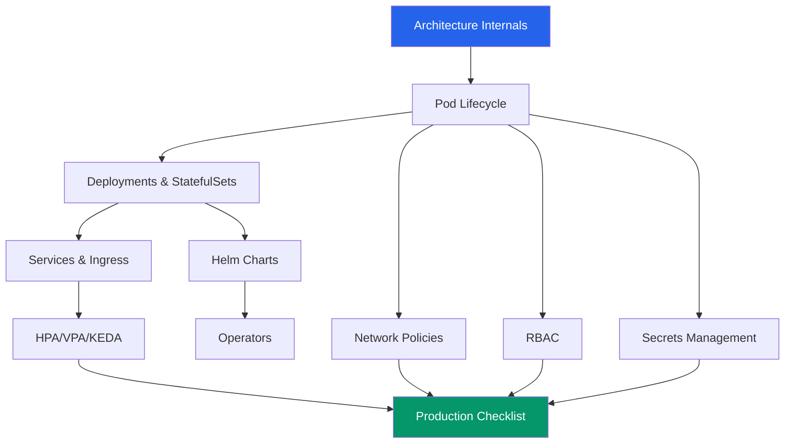

# Kubernetes

Kubernetes is a container orchestration platform that automates deploying, scaling, and managing containerized applications. It handles the problems that emerge when you go from running one container on one machine to running hundreds of containers across dozens of machines: scheduling, networking, storage, self-healing, rolling updates, and access control.

This section covers Kubernetes from architecture internals to production operations. Every configuration is production-grade, not a tutorial that works on Minikube but collapses under real traffic.

## Why Kubernetes

Docker lets you package an application into a container. But containers alone do not solve the problems of running services in production:

- **What happens when a container crashes?** Kubernetes restarts it automatically.
- **How do you distribute containers across machines?** Kubernetes schedules them based on resource requirements.
- **How do containers find each other?** Kubernetes provides service discovery and DNS.
- **How do you update without downtime?** Kubernetes does rolling updates with health checks.
- **How do you handle traffic spikes?** Kubernetes auto-scales based on CPU, memory, or custom metrics.
- **How do you restrict who can deploy what?** Kubernetes has built-in RBAC.

## Section Map

| Page | What You Will Learn |
|---|---|
| [Architecture Internals](./architecture-internals) | Control plane components, node components, how scheduling works, admission controllers |
| [Pod Lifecycle](./pod-lifecycle) | Pod phases, init/sidecar containers, probes, graceful shutdown, pod disruption budgets |
| [Deployments & StatefulSets](./deployments-statefulsets) | Deployment strategies, StatefulSets, DaemonSets, Jobs/CronJobs |
| [Services & Ingress](./services-ingress) | ClusterIP, NodePort, LoadBalancer, Ingress controllers, Gateway API |
| [HPA, VPA & KEDA](./hpa-vpa-keda) | Horizontal/Vertical Pod Autoscalers, KEDA event-driven scaling |
| [Network Policies](./network-policies) | Pod-to-pod isolation, namespace isolation, egress policies |
| [RBAC](./rbac) | Roles, ClusterRoles, ServiceAccounts, OIDC integration |
| [Secrets Management](./secrets-management) | Native secrets, sealed-secrets, external-secrets-operator, CSI driver |
| [Helm Charts](./helm-charts) | Chart structure, templates, hooks, Helmfile |
| [Operators](./operators) | Custom resources, the controller pattern, Operator SDK |
| [Troubleshooting](./troubleshooting) | CrashLoopBackOff, ImagePullBackOff, DNS issues, debugging |
| [Production Checklist](./production-checklist) | Everything you need before going to production |

## Learning Path



Start with **Architecture Internals** to understand what Kubernetes actually is under the hood. Then follow the Pod Lifecycle into Deployments, Services, and scaling. The security topics (RBAC, Network Policies, Secrets) can be learned in parallel. Everything converges at the **Production Checklist**.

## Quick Reference

```bash
# Most-used kubectl commands
kubectl get pods -n <namespace>           # List pods
kubectl describe pod <name> -n <ns>       # Detailed pod info
kubectl logs <pod> -n <ns> -f             # Stream logs
kubectl logs <pod> -n <ns> -c <container> # Specific container logs
kubectl exec -it <pod> -n <ns> -- sh      # Shell into pod
kubectl apply -f manifest.yaml            # Apply configuration
kubectl delete -f manifest.yaml           # Delete resources
kubectl get events -n <ns> --sort-by=.lastTimestamp  # Recent events
kubectl top pods -n <ns>                  # Resource usage
kubectl rollout status deployment/<name>  # Deployment progress
kubectl rollout undo deployment/<name>    # Rollback
```

## Prerequisites

- **Docker** — you should be able to build and run containers locally
- **kubectl** — install the Kubernetes CLI
- **A cluster** — Minikube or kind for learning, EKS/GKE/AKS for production
- **Helm** — install Helm v3 for package management

Start with [Architecture Internals](./architecture-internals) to understand what happens when you run `kubectl apply`.
