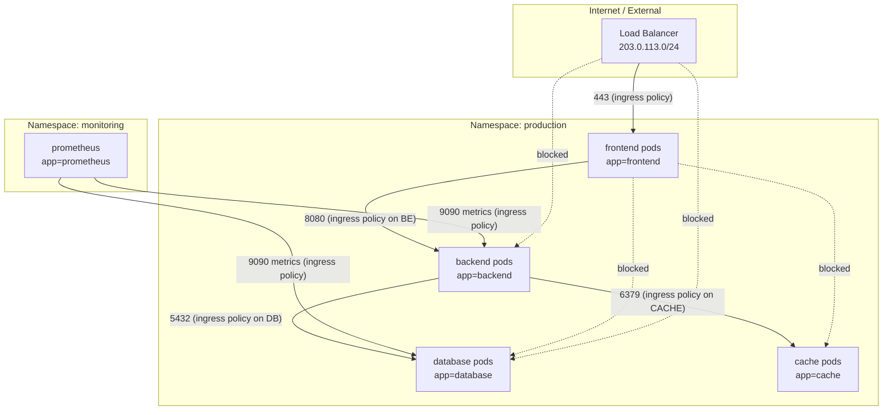

# Kubernetes Network Policies

By default, every pod in a Kubernetes cluster can talk to every other pod. Across namespaces. Without authentication. Without restriction. A compromised frontend pod can reach your database directly. A misconfigured service can access secrets from another team's namespace. This is the flat-network problem, and NetworkPolicy is Kubernetes' answer to it.

NetworkPolicy resources let you define firewall rules at the pod level using label selectors. They are declarative, version-controlled, and enforced by the CNI plugin — not by iptables rules you manage manually.

---

## 1. Why It Exists — The Problem It Solves

Before NetworkPolicy existed, Kubernetes networking followed a single rule: every pod can reach every other pod. This made getting started simple. It also made security nightmares inevitable at scale.

**The flat network failure modes:**

- A single compromised container in a multi-tenant cluster can reach every other service — databases, internal APIs, admin endpoints — without needing to break out of the pod
- An attacker who exploits a vulnerability in your public-facing Node.js app can immediately connect to your PostgreSQL instance on port 5432 (no network hop required)
- Noisy neighbor situations: a runaway service can flood internal endpoints with requests that have no network-level rate limits
- Regulatory compliance (PCI-DSS, HIPAA, SOC 2) typically requires network segmentation — "pods can talk to anything" doesn't pass an audit

**What NetworkPolicy gives you:**

- Declarative, label-based firewall rules stored in git
- Zero-trust microsegmentation: only explicitly allowed traffic flows
- Both ingress (incoming to a pod) and egress (outgoing from a pod) control
- Namespace-level isolation out of the box
- L3/L4 rules natively; L7 (HTTP method/path) with extended CNIs like Cilium

The NetworkPolicy resource describes *intent*. The CNI plugin (Calico, Cilium, Weave, etc.) translates that intent into actual kernel-level enforcement via eBPF programs or iptables rules.

---

## 2. First Principles

NetworkPolicy operates on three concepts:

**1. Pod selector:** Which pods this policy applies to (the "target"). Uses `podSelector` with `matchLabels`. An empty `podSelector: {}` matches all pods in the namespace.

**2. Policy types:** `Ingress`, `Egress`, or both. A policy only affects the direction(s) listed in `policyTypes`.

**3. Rules:** A list of `ingress` or `egress` rules. Each rule specifies:
- `from` / `to`: Sources or destinations (podSelector, namespaceSelector, or ipBlock)
- `ports`: Which ports to allow

**Critical mental model — additive allow, implicit deny:**

NetworkPolicy is additive. You never write "deny" rules. Instead:
- If no NetworkPolicy selects a pod, all traffic is allowed (the default)
- Once at least one NetworkPolicy selects a pod for a given direction, all traffic in that direction is denied EXCEPT what's explicitly allowed
- Multiple policies targeting the same pod are unioned together

This means: adding a NetworkPolicy that allows port 80 ingress does NOT break port 443 — unless another policy already selected that pod for ingress control. When the first ingress policy is applied, all unlisted ingress traffic is implicitly denied.

**The order of evaluation:**

```
Does any NetworkPolicy select this pod for ingress/egress?
  NO  → allow all traffic (dangerous default)
  YES → deny all traffic in that direction except what the policies explicitly allow
```

---

## 3. Core Mechanics and Spec Structure

### Full NetworkPolicy Schema

```yaml
apiVersion: networking.k8s.io/v1
kind: NetworkPolicy
metadata:
  name: my-network-policy
  namespace: production          # NetworkPolicy is namespace-scoped
spec:
  podSelector:                   # Pods this policy applies TO
    matchLabels:
      app: backend
  policyTypes:
    - Ingress
    - Egress
  ingress:
    - from:
        - podSelector:           # Pods in the same namespace
            matchLabels:
              app: frontend
        - namespaceSelector:     # Pods in namespaces with this label
            matchLabels:
              environment: staging
        - ipBlock:               # CIDR range (for external traffic)
            cidr: 10.0.0.0/8
            except:
              - 10.0.1.0/24
      ports:
        - protocol: TCP
          port: 8080
  egress:
    - to:
        - podSelector:
            matchLabels:
              app: database
      ports:
        - protocol: TCP
          port: 5432
    - to: []                     # Allow to any destination
      ports:
        - protocol: UDP
          port: 53               # DNS — always remember this!
```

### Selector Logic: AND vs OR

A common source of confusion: within a single `from`/`to` item, `podSelector` AND `namespaceSelector` are ANDed. Separate items in the list are ORed.

```yaml
# This is OR: pods matching app=frontend OR pods in namespace monitoring
ingress:
  - from:
      - podSelector:
          matchLabels:
            app: frontend
      - namespaceSelector:
          matchLabels:
            name: monitoring

# This is AND: pods matching app=frontend AND in namespace monitoring
ingress:
  - from:
      - podSelector:
          matchLabels:
            app: frontend
        namespaceSelector:      # Same list item = AND
          matchLabels:
            name: monitoring
```

The AND form is far more secure — use it when restricting cross-namespace access to avoid accidentally allowing all pods in a namespace to reach your service.

### Network Topology with Policies



---

## 4. Complete YAML Examples

### 4.1 Default Deny All Ingress and Egress

Apply this first in every namespace. It creates a baseline of zero trust. All other policies then punch holes in this baseline.

```yaml
# deny-all.yaml
# Apply this to every namespace as your first NetworkPolicy.
# Once applied, NO traffic flows in or out of any pod in this namespace
# until explicitly allowed by additional NetworkPolicies.
apiVersion: networking.k8s.io/v1
kind: NetworkPolicy
metadata:
  name: default-deny-all
  namespace: production
  annotations:
    description: "Zero-trust baseline: deny all ingress and egress by default"
spec:
  podSelector: {}            # Empty = matches ALL pods in namespace
  policyTypes:
    - Ingress
    - Egress
  # No ingress or egress rules = deny everything
```

**Applying namespace-wide deny:**

```bash
# Apply to all namespaces at once using a loop
for ns in production staging; do
  kubectl apply -f deny-all.yaml -n "$ns"
done

# Or use a Helm chart / GitOps to apply to all namespaces automatically

# Verify: after applying, a pod should not be able to reach anything
kubectl run test --image=nicolaka/netshoot -it --rm -- curl http://backend-service:8080
# Expected: connection timeout (not refused — it's being dropped at the network level)
```

### 4.2 Allow Ingress from Specific Namespace

Allow the `monitoring` namespace's Prometheus to scrape metrics from `production` pods:

```yaml
# allow-prometheus-scrape.yaml
apiVersion: networking.k8s.io/v1
kind: NetworkPolicy
metadata:
  name: allow-prometheus-scrape
  namespace: production
spec:
  podSelector:
    matchLabels:
      monitoring/scrape: "true"    # Only pods that opt-in to scraping
  policyTypes:
    - Ingress
  ingress:
    - from:
        - namespaceSelector:
            matchLabels:
              kubernetes.io/metadata.name: monitoring   # Built-in label since K8s 1.21
          podSelector:
            matchLabels:
              app.kubernetes.io/name: prometheus
      ports:
        - protocol: TCP
          port: 9090               # Prometheus scrape port
        - protocol: TCP
          port: 8080               # Alternative metrics port
```

**Note on namespace labels:** Since Kubernetes 1.21, `kubernetes.io/metadata.name` is automatically set on every namespace equal to the namespace's name. Use this instead of manually labeling namespaces — one less thing to forget.

### 4.3 Allow Egress Only to DNS and Specific Service

This policy is for a frontend pod that should only talk to the backend service and DNS. Nothing else.

```yaml
# frontend-egress.yaml
apiVersion: networking.k8s.io/v1
kind: NetworkPolicy
metadata:
  name: frontend-egress-restrict
  namespace: production
spec:
  podSelector:
    matchLabels:
      app: frontend
  policyTypes:
    - Egress
  egress:
    # Rule 1: Allow DNS resolution (CRITICAL — without this, pods can't resolve names)
    - to:
        - namespaceSelector:
            matchLabels:
              kubernetes.io/metadata.name: kube-system
          podSelector:
            matchLabels:
              k8s-app: kube-dns
      ports:
        - protocol: UDP
          port: 53
        - protocol: TCP
          port: 53                 # TCP fallback for large DNS responses
    # Rule 2: Allow traffic to backend service only
    - to:
        - podSelector:
            matchLabels:
              app: backend
      ports:
        - protocol: TCP
          port: 8080
```

### 4.4 Database Network Policy — Only Backend Pods Can Connect

The most important policy in any cluster: lock down your database to accept connections only from authorized application pods.

```yaml
# database-network-policy.yaml
apiVersion: networking.k8s.io/v1
kind: NetworkPolicy
metadata:
  name: database-allow-backend-only
  namespace: production
  annotations:
    description: "Restricts database access to backend application pods only"
    owner: "platform-team"
    last-reviewed: "2026-03-17"
spec:
  podSelector:
    matchLabels:
      app: database
      tier: data
  policyTypes:
    - Ingress
    - Egress
  ingress:
    # Only allow from backend pods in the same namespace
    - from:
        - podSelector:
            matchLabels:
              app: backend
              tier: application
      ports:
        - protocol: TCP
          port: 5432               # PostgreSQL
    # Allow from backup job pods
    - from:
        - podSelector:
            matchLabels:
              app: db-backup
      ports:
        - protocol: TCP
          port: 5432
    # Allow Prometheus to scrape postgres_exporter
    - from:
        - namespaceSelector:
            matchLabels:
              kubernetes.io/metadata.name: monitoring
          podSelector:
            matchLabels:
              app.kubernetes.io/name: prometheus
      ports:
        - protocol: TCP
          port: 9187               # postgres_exporter metrics port
  egress:
    # Databases need DNS for replica discovery, connection strings, etc.
    - to:
        - namespaceSelector:
            matchLabels:
              kubernetes.io/metadata.name: kube-system
      ports:
        - protocol: UDP
          port: 53
        - protocol: TCP
          port: 53
    # PostgreSQL streaming replication between primary and replicas
    - to:
        - podSelector:
            matchLabels:
              app: database
              tier: data
      ports:
        - protocol: TCP
          port: 5432
```

### 4.5 Complete Multi-Tier Application Policies

```yaml
# Full policy set for a 3-tier app (frontend, backend, database)
---
# Backend ingress: only from frontend and ingress controller
apiVersion: networking.k8s.io/v1
kind: NetworkPolicy
metadata:
  name: backend-ingress
  namespace: production
spec:
  podSelector:
    matchLabels:
      app: backend
  policyTypes:
    - Ingress
  ingress:
    - from:
        - podSelector:
            matchLabels:
              app: frontend
      ports:
        - protocol: TCP
          port: 8080
    - from:
        - namespaceSelector:
            matchLabels:
              kubernetes.io/metadata.name: ingress-nginx
      ports:
        - protocol: TCP
          port: 8080
---
# Backend egress: to database, cache, DNS, and external APIs
apiVersion: networking.k8s.io/v1
kind: NetworkPolicy
metadata:
  name: backend-egress
  namespace: production
spec:
  podSelector:
    matchLabels:
      app: backend
  policyTypes:
    - Egress
  egress:
    - to: []
      ports:
        - protocol: UDP
          port: 53
        - protocol: TCP
          port: 53
    - to:
        - podSelector:
            matchLabels:
              app: database
      ports:
        - protocol: TCP
          port: 5432
    - to:
        - podSelector:
            matchLabels:
              app: redis
      ports:
        - protocol: TCP
          port: 6379
    # Allow HTTPS to external APIs (Stripe, SendGrid, etc.)
    - to:
        - ipBlock:
            cidr: 0.0.0.0/0
            except:
              - 10.0.0.0/8       # Exclude internal IPs
              - 172.16.0.0/12
              - 192.168.0.0/16
      ports:
        - protocol: TCP
          port: 443
```

---

## 5. CNI Support: Calico vs Cilium vs Weave vs Others

**NetworkPolicy is only enforced if your CNI plugin supports it.** The built-in kubenet plugin does NOT support NetworkPolicy. If you apply a NetworkPolicy without a supporting CNI, it's silently ignored — the policy exists in etcd but does nothing.

| CNI Plugin | NetworkPolicy Support | L7 Policies | eBPF Dataplane | Notes |
|---|---|---|---|---|
| **Calico** | Full | Via Calico CRDs | Optional (eBPF mode) | Most feature-complete traditional option; GlobalNetworkPolicy for cluster-wide rules |
| **Cilium** | Full | Native (HTTP/gRPC/Kafka) | Yes (always) | Best performance; CiliumNetworkPolicy CRD extends standard spec |
| **Weave** | Full | No | No | Simpler setup; lower performance ceiling |
| **Flannel** | None | No | No | Flannel alone does NOT support NetworkPolicy; pair with Calico (Canal) |
| **kubenet** | None | No | No | AWS VPC CNI with policy enforcement via Calico |
| **Canal** | Full | No | No | Flannel networking + Calico policy enforcement |
| **AWS VPC CNI** | Full (via Calico) | No | Partial | Amazon EKS: install Calico alongside VPC CNI |

**Checking your CNI plugin:**

```bash
kubectl get pods -n kube-system | grep -E "calico|cilium|flannel|weave"
kubectl get daemonset -n kube-system

# For Calico: check if NetworkPolicy is being processed
kubectl get networkpolicies -A
calicoctl get networkpolicy -A   # Calico-native policies
```

### Calico: GlobalNetworkPolicy

Calico extends standard NetworkPolicy with cluster-scoped `GlobalNetworkPolicy` — rules that apply across all namespaces without namespace-by-namespace configuration:

```yaml
# Requires Calico CRDs
apiVersion: projectcalico.org/v3
kind: GlobalNetworkPolicy
metadata:
  name: deny-all-default
spec:
  selector: all()
  types:
    - Ingress
    - Egress
  ingress: []    # No rules = deny all ingress
  egress:
    - action: Allow
      protocol: UDP
      destination:
        ports: [53]
    - action: Allow
      protocol: TCP
      destination:
        ports: [53]
```

---

## 6. Cilium: L7 Network Policies

Cilium's extended `CiliumNetworkPolicy` supports L7 (application-layer) policy enforcement using Envoy under the hood. This means you can write policies based on HTTP method and path, gRPC service name, or Kafka topic — not just IP and port.

```yaml
# CiliumNetworkPolicy — restrict backend API to only GET requests from frontend
apiVersion: "cilium.io/v2"
kind: CiliumNetworkPolicy
metadata:
  name: backend-l7-policy
  namespace: production
spec:
  endpointSelector:
    matchLabels:
      app: backend
  ingress:
    - fromEndpoints:
        - matchLabels:
            app: frontend
      toPorts:
        - ports:
            - port: "8080"
              protocol: TCP
          rules:
            http:
              - method: "GET"
                path: "/api/v1/products.*"
              - method: "POST"
                path: "/api/v1/orders"
              - method: "GET"
                path: "/health"
```

**Cilium gRPC policy:**

```yaml
spec:
  ingress:
    - fromEndpoints:
        - matchLabels:
            app: grpc-client
      toPorts:
        - ports:
            - port: "9090"
              protocol: TCP
          rules:
            http:
              - method: POST
                path: /com.example.ProductService/GetProduct
              - method: POST
                path: /grpc.health.v1.Health/Check
```

L7 policies require Cilium to terminate and proxy the connection through Envoy, adding ~50-200 microseconds of latency per request. For most workloads this is negligible. For latency-sensitive internal gRPC calls, measure before deploying L7 policies.

---

## 7. Testing Network Policies

**The golden rule: always test that blocked traffic is actually blocked.** A missing CNI plugin silently passes all traffic — always verify.

### Testing with netcat (nc)

```bash
# Step 1: Find pods to test with
kubectl get pods -n production -l app=frontend -o wide
kubectl get pods -n production -l app=database -o wide

# Step 2: Test blocked connection (frontend → database directly, should be blocked)
kubectl exec -n production \
  $(kubectl get pod -n production -l app=frontend -o name | head -1) \
  -- nc -zv database-service 5432 -w 3
# Expected: nc: connect to database-service port 5432 (tcp) timed out: Operation timed out
# (timeout, NOT "connection refused" — it's being dropped at the network level)

# Step 3: Test allowed connection (backend → database, should work)
kubectl exec -n production \
  $(kubectl get pod -n production -l app=backend -o name | head -1) \
  -- nc -zv database-service 5432 -w 3
# Expected: Connection to database-service 5432 port [tcp/postgresql] succeeded!

# Step 4: Test DNS resolution (should always work after allowing DNS egress)
kubectl exec -n production \
  $(kubectl get pod -n production -l app=backend -o name | head -1) \
  -- nslookup kubernetes.default.svc.cluster.local
```

### Using netshoot for Rich Debugging

```bash
# Launch a debug pod with networking tools in the target namespace
kubectl run netshoot --image=nicolaka/netshoot -it --rm -n production -- bash

# Inside netshoot:
# Test TCP connectivity
curl -v http://backend-service:8080/health --connect-timeout 5

# Test UDP (DNS)
nslookup backend-service.production.svc.cluster.local

# Test port reachability
nc -zv -w 3 database-service 5432

# Trace the network path
traceroute backend-service

# Scan open ports on a service
nmap -p 1-1024 database-service
```

### Systematic Policy Verification

```bash
#!/bin/bash
# network-policy-test.sh
# Run this script to verify your network policies are working correctly

NAMESPACE="production"
FRONTEND_POD=$(kubectl get pod -n $NAMESPACE -l app=frontend -o jsonpath='{.items[0].metadata.name}')
BACKEND_POD=$(kubectl get pod -n $NAMESPACE -l app=backend -o jsonpath='{.items[0].metadata.name}')

echo "=== Testing Frontend → Backend (should SUCCEED) ==="
kubectl exec -n $NAMESPACE $FRONTEND_POD -- \
  curl -s -o /dev/null -w "%{http_code}" http://backend-service:8080/health --connect-timeout 5
echo ""

echo "=== Testing Frontend → Database (should FAIL/timeout) ==="
kubectl exec -n $NAMESPACE $FRONTEND_POD -- \
  nc -zv -w 3 database-service 5432 2>&1 || echo "BLOCKED (expected)"
echo ""

echo "=== Testing Backend → Database (should SUCCEED) ==="
kubectl exec -n $NAMESPACE $BACKEND_POD -- \
  nc -zv -w 3 database-service 5432 2>&1
echo ""

echo "=== Testing DNS from Backend (should SUCCEED) ==="
kubectl exec -n $NAMESPACE $BACKEND_POD -- \
  nslookup kubernetes.default.svc.cluster.local
echo ""
```

---

## 8. Edge Cases and Failure Modes

### The DNS Gotcha (Most Common Production Incident)

The single most common NetworkPolicy mistake in production: you add an egress policy but forget to allow port 53 UDP/TCP. Every DNS lookup silently fails. Pods can't connect to services by name. Depending on application timeout settings, this causes:

- Connection timeouts that look like service outages
- Requests queuing up because HTTP clients retry on DNS failure
- Kubernetes readiness probes failing → pod removed from service endpoints → cascading restart

**The fix: always include DNS in any egress policy:**

```yaml
egress:
  # This must be the FIRST rule in every egress policy
  - to: []                   # Empty = any destination
    ports:
      - protocol: UDP
        port: 53
      - protocol: TCP
        port: 53
```

Some teams use `to: []` (allow any destination) for DNS instead of targeting kube-dns specifically. This is slightly less secure but far less likely to cause incidents — kube-dns can move between namespaces or get different labels in different distributions (EKS, GKE, AKS all have slight variations).

### Egress to Kubernetes API Server

If your pods use the Kubernetes API (admission webhooks, operators, service account token projection), they need egress to the API server IP. This is usually in the control plane IP range, not a pod IP.

```yaml
egress:
  # Allow egress to Kubernetes API server
  - to:
      - ipBlock:
          cidr: 10.0.0.0/16    # Your cluster's API server CIDR
    ports:
      - protocol: TCP
        port: 443
      - protocol: TCP
        port: 6443
```

### NodePort and LoadBalancer Services

NetworkPolicy applies to pod-level traffic, not node-level traffic. If you expose a service as NodePort:
- Traffic arriving at the node's port bypasses pod-level NetworkPolicy for **the ingress direction** to the node
- Once the traffic reaches the pod, ingress NetworkPolicy still applies

LoadBalancer services with externalTrafficPolicy: Local behave more predictably with NetworkPolicy.

### Stateful Connections

NetworkPolicy is stateless — it evaluates individual packets, not connection state. However, the conntrack table (iptables connection tracking) handles the return traffic for established TCP connections. This means:
- If a connection is allowed to initiate (matched by ingress/egress rule), the return packets are allowed automatically
- You don't need to write symmetric rules

### Overlapping Policies

When multiple policies select the same pod, they are combined with OR logic. If Policy A allows port 80 and Policy B allows port 443, the pod accepts both 80 and 443. There's no precedence or priority — unlike traditional firewall rules. Be careful: if you have a permissive catch-all policy and a restrictive policy, the permissive one wins.

---

## 9. Performance Characteristics

### iptables vs eBPF

**iptables-based CNIs (Calico non-eBPF, Weave):**
- Policy rules translate to iptables rules in the FILTER table
- Rule evaluation is O(n) — every packet walks the chain in order
- At 1000+ pods with complex policies, iptables chains can have 10,000+ rules
- This adds 1-3ms latency per packet in extreme cases
- Memory: each iptables rule consumes kernel memory

**eBPF-based CNIs (Cilium, Calico eBPF mode):**
- Policy rules compile to eBPF programs attached to network interfaces
- Rule evaluation uses hash maps — O(1) lookup
- Scales to 50,000+ pods with no performance degradation
- Latency overhead: ~5-20 microseconds per packet (constant regardless of policy count)
- Cilium benchmarks show 2-3x better throughput than iptables at scale

**Rule of thumb:** Below 500 pods, any CNI works fine. Above 500 pods, prefer Cilium or Calico in eBPF mode. Above 2000 pods, eBPF is essentially required for production performance.

---

## 10. Formal Model: NetworkPolicy as a Predicate

A NetworkPolicy can be modeled as a traffic predicate P(src, dst, proto, port) → allow | deny.

For a packet (src, dst, proto, port):

$$\text{allowed}(\text{src}, \text{dst}, \text{proto}, \text{port}) = \bigvee_{i} \text{rule}_i(\text{src}, \text{dst}, \text{proto}, \text{port})$$

Where each rule $\text{rule}_i$ is a conjunction:

$$\text{rule}_i = \text{selector}(\text{src}) \wedge \text{port\_match}(\text{proto}, \text{port}) \wedge \text{direction\_match}$$

If no policy selects the destination pod, the predicate is trivially true (default allow). Once any policy selects the pod, the predicate is the disjunction of all matching rules.

The full cluster policy is then:

$$\text{cluster\_allowed}(s, d, p, q) = \begin{cases} \top & \text{if no policy selects } d \\ \bigvee_j \text{policy}_j(s, d, p, q) & \text{otherwise} \end{cases}$$

This means policies compose safely — no policy can restrict what another policy explicitly allows.

---

::: info War Story: The Health Check That Brought Down Production

**The setup:** A backend service deployed in a namespace with a strict default-deny-all policy. The team added egress rules to allow database and external API access. The deployment went fine. The next day, the on-call engineer got paged: "backend pods in CrashLoopBackOff."

**The symptoms:**
- `kubectl describe pod` showed: readiness probe failed, liveness probe failed
- Pods would start, the liveness probe would hit `/health`, the health endpoint would try to check database connectivity, and return 500
- The liveness probe would then kill the pod after `failureThreshold` attempts
- The pod would restart, and the cycle would repeat

**The real cause:** The `/health` endpoint called `SELECT 1` against the database. The database egress rule existed (port 5432 to database pods), but DNS resolution for `database-service.production.svc.cluster.local` was timing out because port 53 egress was not included.

DNS timeouts in Go applications default to 30 seconds. The health check was timing out after 30 seconds, which exceeded the probe's `timeoutSeconds: 5`. So the probe killed the pod before the app could even finish its first health check.

**The cascade:**
1. Pods restart → they're removed from service endpoints
2. During the restart window, frontend pods hit "connection refused" from the backend service
3. Frontend pods' own health checks started returning 500 (they depended on backend)
4. Frontend pods began restarting too
5. For 11 minutes, the service was completely unavailable

**The fix:** Adding DNS egress (port 53 UDP/TCP) to the backend's egress policy. One-line YAML change. 11 minutes of downtime.

**The lesson:**
1. Always add DNS egress before any other egress rule — make it a team standard
2. Health check endpoints should NOT check downstream dependencies — they should only check the pod's own health
3. Test your NetworkPolicies explicitly after every change using the `nc`/`nslookup` tests shown above
4. Add network policy testing to your deployment runbook

**The prevention:** The team added a NetworkPolicy linting step to CI that checks every egress policy for the presence of DNS rules. If a pod has egress rules but no port-53 rule, CI fails with a clear message.

:::

---

## 11. Decision Framework: When to Use What

```
Q: Do you need to restrict pod-to-pod traffic at all?
├── No → Don't apply NetworkPolicy (accept the risk, document it)
└── Yes ↓

Q: Do you need restrictions within a namespace only, or across namespaces?
├── Within namespace only → use podSelector-based policies
└── Cross-namespace → use namespaceSelector + podSelector (AND form)

Q: Do you need L7 (HTTP/gRPC) restrictions?
├── No → Standard NetworkPolicy is sufficient
└── Yes → Use Cilium CiliumNetworkPolicy

Q: How many namespaces need isolation?
├── Few (< 10) → Apply per-namespace NetworkPolicies manually
└── Many → Use Calico GlobalNetworkPolicy or a namespace bootstrap GitOps process

Q: Which CNI do you have?
├── Cilium → Use CiliumNetworkPolicy for L7, standard NetworkPolicy for L3/L4
├── Calico → Use GlobalNetworkPolicy for cluster-wide, NetworkPolicy for namespace
├── Flannel alone → Install Calico alongside (Canal mode) or switch CNI
└── Unknown → kubectl get daemonset -n kube-system; pick based on what's installed
```

**Starting point recommendation for any new cluster:**

1. Apply `default-deny-all` to every application namespace immediately
2. Apply `allow-dns-egress` policy to allow DNS from all pods
3. Define explicit allow policies for each service-to-service communication
4. Use GitOps (Argo CD, Flux) to ensure these policies are always present

---

## 12. Advanced Topics

### Namespace Isolation Pattern

For multi-tenant clusters, isolate each tenant's namespace so they can't reach each other but can still access shared services (monitoring, logging):

```yaml
# Deny all cross-namespace traffic by default
apiVersion: networking.k8s.io/v1
kind: NetworkPolicy
metadata:
  name: deny-cross-namespace
  namespace: tenant-a
spec:
  podSelector: {}
  policyTypes:
    - Ingress
  ingress:
    - from:
        - podSelector: {}          # Allow from same namespace only
    - from:
        - namespaceSelector:
            matchLabels:
              shared-service: "true"   # Allow from shared service namespaces
```

### Policy-as-Code Validation

Use `kubectl` dry-run and network policy tools to validate before applying:

```bash
# Dry run to see what would happen
kubectl apply -f network-policy.yaml --dry-run=server

# Use netpol-verifier (open source tool) to verify policy logic
netpol-verifier --policy network-policy.yaml --from app=frontend --to app=database --port 5432

# Calico-specific: use calicoctl to verify policy evaluation
calicoctl eval policy --from frontend --to database --port 5432
```

### Monitoring Network Policy Drops

In production, you want visibility into what traffic is being dropped. Cilium provides this natively:

```bash
# Install Hubble (Cilium's observability layer)
cilium hubble enable

# Watch live traffic (including drops)
hubble observe --verdict DROPPED --namespace production

# Get drop metrics
hubble observe --verdict DROPPED --namespace production --output json | \
  jq '.flow | {src: .source.pod_name, dst: .destination.pod_name, reason: .drop_reason_desc}'
```

For Calico, enable iptables logging for denied traffic:

```yaml
# Enable Calico policy logging
apiVersion: projectcalico.org/v3
kind: GlobalNetworkPolicy
metadata:
  name: log-denied-traffic
spec:
  selector: all()
  types:
    - Ingress
    - Egress
  ingress:
    - action: Log      # Log before the default deny takes effect
  egress:
    - action: Log
```

### NetworkPolicy and Service Mesh

If you use Istio or Linkerd, you have two layers of policy:
- NetworkPolicy at L3/L4 (CNI level)
- AuthorizationPolicy at L7 (service mesh level)

Use NetworkPolicy to enforce namespace boundaries and block direct pod-to-pod access for ports that should only be accessed via the mesh proxy. Use AuthorizationPolicy for fine-grained per-method and per-path rules. They're complementary — defense in depth.
