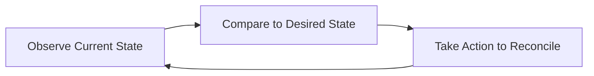
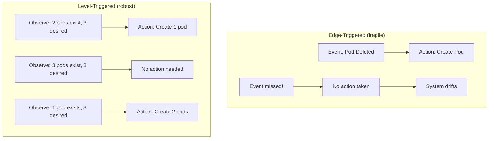
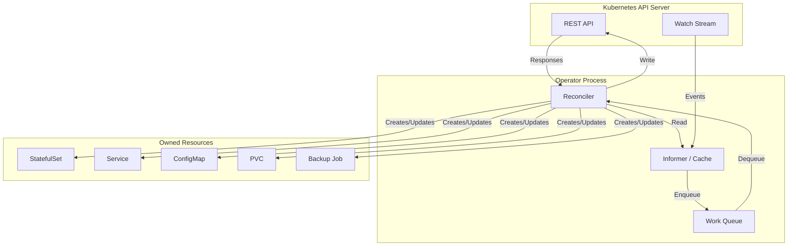
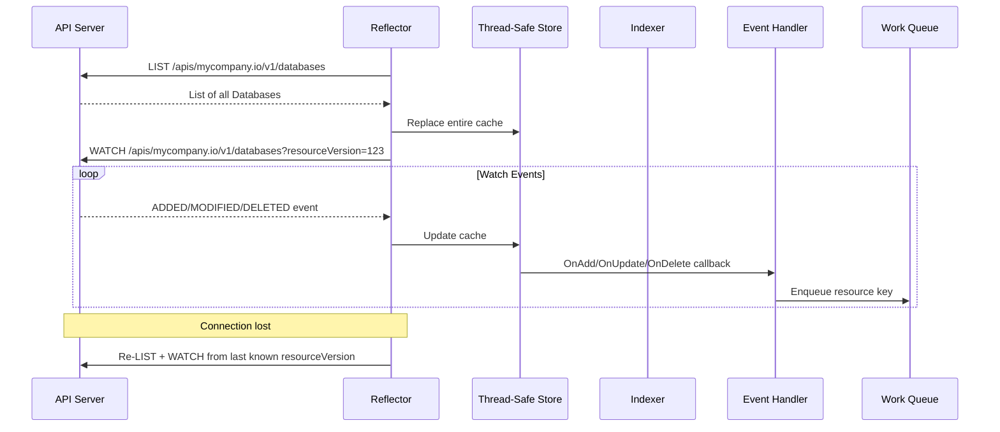

# Kubernetes Operators

## Why It Exists

Kubernetes excels at managing stateless workloads — Deployments, ReplicaSets, and Services handle the lifecycle of pods that can be created and destroyed without ceremony. But real systems include **stateful, complex software** — databases, message queues, ML training pipelines, certificate authorities — that require deep domain knowledge to operate correctly.

Consider running PostgreSQL on Kubernetes. A human operator must know:
- How to bootstrap a primary and replicas
- How to perform failover when the primary dies
- How to handle backup schedules and point-in-time recovery
- How to resize storage without downtime
- How to upgrade minor/major versions safely

The **Operator pattern** encodes this human operational knowledge into software that extends the Kubernetes API. Instead of writing runbooks, you write a controller that watches custom resources and takes automated actions to maintain the desired state.

The term was coined by CoreOS in 2016 and is built on two Kubernetes primitives: **Custom Resource Definitions (CRDs)** that extend the API, and **controllers** that reconcile the actual state to match the desired state.

## First Principles

### The Control Loop

Every Kubernetes controller follows the same pattern — the control loop (also called the reconciliation loop):



This is fundamentally a **feedback control system** from control theory:

$$
u(t) = K_p \cdot e(t) \text{ where } e(t) = r(t) - y(t)
$$

Where:
- $r(t)$ = desired state (the spec of your custom resource)
- $y(t)$ = current state (what actually exists in the cluster)
- $e(t)$ = error signal (the difference between desired and actual)
- $u(t)$ = control action (create/update/delete operations)
- $K_p$ = controller logic (the reconcile function)

Unlike continuous control systems, Kubernetes controllers are **event-driven level-triggered** — they react to the current state, not the transition. If you miss an event, the next reconciliation still converges to the correct state.

### Level-Triggered vs. Edge-Triggered



Level-triggered controllers are **idempotent** by design — running the same reconciliation twice produces the same result. This is crucial for reliability: if a controller crashes mid-reconciliation, it simply re-reconciles on restart.

### The Operator Maturity Model

The operator capability model (from Red Hat) defines five levels:

| Level | Name | Capabilities |
|-------|------|-------------|
| 1 | Basic Install | Automated provisioning and configuration |
| 2 | Seamless Upgrades | Patch and minor version upgrades |
| 3 | Full Lifecycle | Backup, restore, failure recovery |
| 4 | Deep Insights | Metrics, alerts, log processing |
| 5 | Auto Pilot | Auto-scaling, auto-tuning, anomaly detection |

## Core Mechanics

### Custom Resource Definitions (CRDs)

CRDs extend the Kubernetes API with new resource types. When you create a CRD, the API server dynamically creates a new RESTful endpoint.

```yaml
apiVersion: apiextensions.k8s.io/v1
kind: CustomResourceDefinition
metadata:
  name: databases.mycompany.io
spec:
  group: mycompany.io
  versions:
    - name: v1alpha1
      served: true
      storage: true
      schema:
        openAPIV3Schema:
          type: object
          properties:
            spec:
              type: object
              required:
                - engine
                - version
                - storage
              properties:
                engine:
                  type: string
                  enum: ["postgresql", "mysql"]
                version:
                  type: string
                  pattern: '^\d+\.\d+$'
                replicas:
                  type: integer
                  minimum: 1
                  maximum: 7
                  default: 1
                storage:
                  type: object
                  required:
                    - size
                  properties:
                    size:
                      type: string
                      pattern: '^\d+Gi$'
                    storageClass:
                      type: string
                      default: "gp3"
                backup:
                  type: object
                  properties:
                    enabled:
                      type: boolean
                      default: true
                    schedule:
                      type: string
                      default: "0 2 * * *"
                    retention:
                      type: integer
                      default: 7
                resources:
                  type: object
                  properties:
                    requests:
                      type: object
                      properties:
                        cpu:
                          type: string
                        memory:
                          type: string
                    limits:
                      type: object
                      properties:
                        cpu:
                          type: string
                        memory:
                          type: string
            status:
              type: object
              properties:
                phase:
                  type: string
                  enum: ["Pending", "Creating", "Running", "Failed", "Upgrading", "Deleting"]
                readyReplicas:
                  type: integer
                primaryEndpoint:
                  type: string
                replicaEndpoint:
                  type: string
                lastBackup:
                  type: string
                  format: date-time
                conditions:
                  type: array
                  items:
                    type: object
                    properties:
                      type:
                        type: string
                      status:
                        type: string
                      lastTransitionTime:
                        type: string
                        format: date-time
                      reason:
                        type: string
                      message:
                        type: string
      subresources:
        status: {}
        scale:
          specReplicasPath: .spec.replicas
          statusReplicasPath: .status.readyReplicas
      additionalPrinterColumns:
        - name: Engine
          type: string
          jsonPath: .spec.engine
        - name: Version
          type: string
          jsonPath: .spec.version
        - name: Replicas
          type: integer
          jsonPath: .spec.replicas
        - name: Status
          type: string
          jsonPath: .status.phase
        - name: Age
          type: date
          jsonPath: .metadata.creationTimestamp
  scope: Namespaced
  names:
    plural: databases
    singular: database
    kind: Database
    shortNames:
      - db
    categories:
      - all
      - mycompany
```

After creating this CRD, you can use it like any built-in resource:

```bash
kubectl get databases
kubectl describe database mydb
kubectl scale database mydb --replicas=3
kubectl get db  # short name
```

### The Controller Architecture



**Key components:**

1. **Informer** — Watches the API server for changes to resources. Maintains a local cache to reduce API server load. Uses list-watch: initial list + continuous watch stream.

2. **Work Queue** — Rate-limited queue that deduplicates events. If the same resource is modified 10 times in 1 second, it is only reconciled once.

3. **Reconciler** — The business logic. Takes a resource key (namespace/name), reads the current state, computes the diff, and takes action.

### Informer Internals



The informer implements **exponential backoff** for reconnection and **resource version tracking** for consistency:

$$
t_{backoff}(n) = \min(t_{base} \times 2^n + \text{jitter}, t_{max})
$$

Where $t_{base} = 200\text{ms}$, $t_{max} = 5\text{min}$, and jitter is random within $[0, t_{base} \times 2^n]$.

## Implementation — Building a Database Operator

### Project Setup with Operator SDK

```bash
# Initialize the project
operator-sdk init \
  --domain mycompany.io \
  --repo github.com/mycompany/database-operator

# Create the API and controller
operator-sdk create api \
  --group database \
  --version v1alpha1 \
  --kind Database \
  --resource --controller
```

### Type Definitions

```go
// api/v1alpha1/database_types.go
package v1alpha1

import (
	corev1 "k8s.io/api/core/v1"
	"k8s.io/apimachinery/pkg/api/resource"
	metav1 "k8s.io/apimachinery/pkg/apis/meta/v1"
)

// DatabaseSpec defines the desired state of Database
type DatabaseSpec struct {
	// Engine is the database engine type
	// +kubebuilder:validation:Enum=postgresql;mysql
	Engine string `json:"engine"`

	// Version is the database engine version
	// +kubebuilder:validation:Pattern=`^\d+\.\d+$`
	Version string `json:"version"`

	// Replicas is the number of database instances
	// +kubebuilder:validation:Minimum=1
	// +kubebuilder:validation:Maximum=7
	// +kubebuilder:default=1
	Replicas int32 `json:"replicas,omitempty"`

	// Storage configuration
	Storage StorageSpec `json:"storage"`

	// Backup configuration
	// +optional
	Backup *BackupSpec `json:"backup,omitempty"`

	// Resources defines compute resources
	// +optional
	Resources corev1.ResourceRequirements `json:"resources,omitempty"`
}

type StorageSpec struct {
	// Size of the persistent volume
	Size resource.Quantity `json:"size"`

	// StorageClass for the PVC
	// +kubebuilder:default="gp3"
	StorageClass string `json:"storageClass,omitempty"`
}

type BackupSpec struct {
	// Enabled enables automated backups
	// +kubebuilder:default=true
	Enabled bool `json:"enabled,omitempty"`

	// Schedule in cron format
	// +kubebuilder:default="0 2 * * *"
	Schedule string `json:"schedule,omitempty"`

	// Retention in days
	// +kubebuilder:default=7
	Retention int `json:"retention,omitempty"`
}

// DatabasePhase represents the current lifecycle phase
type DatabasePhase string

const (
	DatabasePhasePending   DatabasePhase = "Pending"
	DatabasePhaseCreating  DatabasePhase = "Creating"
	DatabasePhaseRunning   DatabasePhase = "Running"
	DatabasePhaseFailed    DatabasePhase = "Failed"
	DatabasePhaseUpgrading DatabasePhase = "Upgrading"
	DatabasePhaseDeleting  DatabasePhase = "Deleting"
)

// DatabaseStatus defines the observed state of Database
type DatabaseStatus struct {
	Phase            DatabasePhase      `json:"phase,omitempty"`
	ReadyReplicas    int32              `json:"readyReplicas,omitempty"`
	PrimaryEndpoint  string             `json:"primaryEndpoint,omitempty"`
	ReplicaEndpoint  string             `json:"replicaEndpoint,omitempty"`
	LastBackup       *metav1.Time       `json:"lastBackup,omitempty"`
	Conditions       []metav1.Condition `json:"conditions,omitempty"`
	ObservedGeneration int64            `json:"observedGeneration,omitempty"`
}

// +kubebuilder:object:root=true
// +kubebuilder:subresource:status
// +kubebuilder:subresource:scale:specpath=.spec.replicas,statuspath=.status.readyReplicas
// +kubebuilder:printcolumn:name="Engine",type=string,JSONPath=`.spec.engine`
// +kubebuilder:printcolumn:name="Version",type=string,JSONPath=`.spec.version`
// +kubebuilder:printcolumn:name="Replicas",type=integer,JSONPath=`.spec.replicas`
// +kubebuilder:printcolumn:name="Status",type=string,JSONPath=`.status.phase`
// +kubebuilder:printcolumn:name="Age",type="date",JSONPath=".metadata.creationTimestamp"
type Database struct {
	metav1.TypeMeta   `json:",inline"`
	metav1.ObjectMeta `json:"metadata,omitempty"`

	Spec   DatabaseSpec   `json:"spec,omitempty"`
	Status DatabaseStatus `json:"status,omitempty"`
}

// +kubebuilder:object:root=true
type DatabaseList struct {
	metav1.TypeMeta `json:",inline"`
	metav1.ListMeta `json:"metadata,omitempty"`
	Items           []Database `json:"items"`
}
```

### Reconciler Implementation

```go
// controllers/database_controller.go
package controllers

import (
	"context"
	"fmt"
	"time"

	appsv1 "k8s.io/api/apps/v1"
	corev1 "k8s.io/api/core/v1"
	"k8s.io/apimachinery/pkg/api/errors"
	"k8s.io/apimachinery/pkg/api/resource"
	metav1 "k8s.io/apimachinery/pkg/apis/meta/v1"
	"k8s.io/apimachinery/pkg/runtime"
	"k8s.io/apimachinery/pkg/types"
	"k8s.io/apimachinery/pkg/util/intstr"
	ctrl "sigs.k8s.io/controller-runtime"
	"sigs.k8s.io/controller-runtime/pkg/client"
	"sigs.k8s.io/controller-runtime/pkg/controller/controllerutil"
	"sigs.k8s.io/controller-runtime/pkg/log"

	dbv1alpha1 "github.com/mycompany/database-operator/api/v1alpha1"
)

const (
	databaseFinalizer = "database.mycompany.io/finalizer"
	requeueAfter      = 30 * time.Second
)

type DatabaseReconciler struct {
	client.Client
	Scheme *runtime.Scheme
}

// +kubebuilder:rbac:groups=database.mycompany.io,resources=databases,verbs=get;list;watch;create;update;patch;delete
// +kubebuilder:rbac:groups=database.mycompany.io,resources=databases/status,verbs=get;update;patch
// +kubebuilder:rbac:groups=database.mycompany.io,resources=databases/finalizers,verbs=update
// +kubebuilder:rbac:groups=apps,resources=statefulsets,verbs=get;list;watch;create;update;patch;delete
// +kubebuilder:rbac:groups=core,resources=services,verbs=get;list;watch;create;update;patch;delete
// +kubebuilder:rbac:groups=core,resources=configmaps,verbs=get;list;watch;create;update;patch;delete

func (r *DatabaseReconciler) Reconcile(ctx context.Context, req ctrl.Request) (ctrl.Result, error) {
	logger := log.FromContext(ctx)

	// Step 1: Fetch the Database resource
	db := &dbv1alpha1.Database{}
	if err := r.Get(ctx, req.NamespacedName, db); err != nil {
		if errors.IsNotFound(err) {
			logger.Info("Database resource not found, likely deleted")
			return ctrl.Result{}, nil
		}
		return ctrl.Result{}, err
	}

	// Step 2: Handle deletion with finalizer
	if db.ObjectMeta.DeletionTimestamp.IsZero() {
		// Resource is not being deleted — ensure finalizer is present
		if !controllerutil.ContainsFinalizer(db, databaseFinalizer) {
			controllerutil.AddFinalizer(db, databaseFinalizer)
			if err := r.Update(ctx, db); err != nil {
				return ctrl.Result{}, err
			}
		}
	} else {
		// Resource is being deleted — run cleanup
		if controllerutil.ContainsFinalizer(db, databaseFinalizer) {
			if err := r.cleanupDatabase(ctx, db); err != nil {
				return ctrl.Result{}, err
			}
			controllerutil.RemoveFinalizer(db, databaseFinalizer)
			if err := r.Update(ctx, db); err != nil {
				return ctrl.Result{}, err
			}
		}
		return ctrl.Result{}, nil
	}

	// Step 3: Update status to Creating if Pending
	if db.Status.Phase == "" || db.Status.Phase == dbv1alpha1.DatabasePhasePending {
		db.Status.Phase = dbv1alpha1.DatabasePhaseCreating
		if err := r.Status().Update(ctx, db); err != nil {
			return ctrl.Result{}, err
		}
	}

	// Step 4: Reconcile all owned resources
	if err := r.reconcileConfigMap(ctx, db); err != nil {
		return ctrl.Result{}, r.setFailedStatus(ctx, db, err)
	}

	if err := r.reconcileService(ctx, db); err != nil {
		return ctrl.Result{}, r.setFailedStatus(ctx, db, err)
	}

	if err := r.reconcileStatefulSet(ctx, db); err != nil {
		return ctrl.Result{}, r.setFailedStatus(ctx, db, err)
	}

	// Step 5: Check if StatefulSet is ready
	sts := &appsv1.StatefulSet{}
	stsName := types.NamespacedName{
		Name:      fmt.Sprintf("%s-db", db.Name),
		Namespace: db.Namespace,
	}
	if err := r.Get(ctx, stsName, sts); err != nil {
		return ctrl.Result{RequeueAfter: requeueAfter}, nil
	}

	// Step 6: Update status
	db.Status.ReadyReplicas = sts.Status.ReadyReplicas
	db.Status.ObservedGeneration = db.Generation
	db.Status.PrimaryEndpoint = fmt.Sprintf(
		"%s-db-0.%s-db-headless.%s.svc.cluster.local:5432",
		db.Name, db.Name, db.Namespace,
	)
	if db.Spec.Replicas > 1 {
		db.Status.ReplicaEndpoint = fmt.Sprintf(
			"%s-db-readonly.%s.svc.cluster.local:5432",
			db.Name, db.Namespace,
		)
	}

	if sts.Status.ReadyReplicas == db.Spec.Replicas {
		db.Status.Phase = dbv1alpha1.DatabasePhaseRunning
		setCondition(db, "Ready", metav1.ConditionTrue, "AllReplicasReady",
			"All database replicas are running and ready")
	} else {
		db.Status.Phase = dbv1alpha1.DatabasePhaseCreating
		setCondition(db, "Ready", metav1.ConditionFalse, "ReplicasNotReady",
			fmt.Sprintf("%d/%d replicas ready", sts.Status.ReadyReplicas, db.Spec.Replicas))
	}

	if err := r.Status().Update(ctx, db); err != nil {
		return ctrl.Result{}, err
	}

	// Requeue to periodically check health
	return ctrl.Result{RequeueAfter: requeueAfter}, nil
}

func (r *DatabaseReconciler) reconcileStatefulSet(ctx context.Context, db *dbv1alpha1.Database) error {
	sts := &appsv1.StatefulSet{
		ObjectMeta: metav1.ObjectMeta{
			Name:      fmt.Sprintf("%s-db", db.Name),
			Namespace: db.Namespace,
		},
	}

	image := r.getImage(db)

	result, err := controllerutil.CreateOrUpdate(ctx, r.Client, sts, func() error {
		// Set the owner reference so the STS is garbage-collected when the DB is deleted
		if err := controllerutil.SetControllerReference(db, sts, r.Scheme); err != nil {
			return err
		}

		labels := map[string]string{
			"app.kubernetes.io/name":       "database",
			"app.kubernetes.io/instance":   db.Name,
			"app.kubernetes.io/component":  "database",
			"app.kubernetes.io/managed-by": "database-operator",
		}

		sts.Spec = appsv1.StatefulSetSpec{
			Replicas:    &db.Spec.Replicas,
			ServiceName: fmt.Sprintf("%s-db-headless", db.Name),
			Selector: &metav1.LabelSelector{
				MatchLabels: labels,
			},
			Template: corev1.PodTemplateSpec{
				ObjectMeta: metav1.ObjectMeta{
					Labels: labels,
				},
				Spec: corev1.PodSpec{
					SecurityContext: &corev1.PodSecurityContext{
						RunAsNonRoot: boolPtr(true),
						RunAsUser:    int64Ptr(999),
						FSGroup:      int64Ptr(999),
					},
					Containers: []corev1.Container{
						{
							Name:  "database",
							Image: image,
							Ports: []corev1.ContainerPort{
								{
									Name:          "db",
									ContainerPort: 5432,
									Protocol:      corev1.ProtocolTCP,
								},
							},
							Resources: db.Spec.Resources,
							VolumeMounts: []corev1.VolumeMount{
								{
									Name:      "data",
									MountPath: "/var/lib/postgresql/data",
								},
								{
									Name:      "config",
									MountPath: "/etc/postgresql",
								},
							},
							LivenessProbe: &corev1.Probe{
								ProbeHandler: corev1.ProbeHandler{
									Exec: &corev1.ExecAction{
										Command: []string{
											"pg_isready", "-U", "postgres",
										},
									},
								},
								InitialDelaySeconds: 30,
								PeriodSeconds:       10,
								TimeoutSeconds:      5,
								FailureThreshold:    6,
							},
							ReadinessProbe: &corev1.Probe{
								ProbeHandler: corev1.ProbeHandler{
									Exec: &corev1.ExecAction{
										Command: []string{
											"pg_isready", "-U", "postgres",
										},
									},
								},
								InitialDelaySeconds: 5,
								PeriodSeconds:       10,
								TimeoutSeconds:      5,
								FailureThreshold:    3,
							},
							SecurityContext: &corev1.SecurityContext{
								AllowPrivilegeEscalation: boolPtr(false),
								ReadOnlyRootFilesystem:   boolPtr(false),
								Capabilities: &corev1.Capabilities{
									Drop: []corev1.Capability{"ALL"},
								},
							},
						},
					},
					Volumes: []corev1.Volume{
						{
							Name: "config",
							VolumeSource: corev1.VolumeSource{
								ConfigMap: &corev1.ConfigMapVolumeSource{
									LocalObjectReference: corev1.LocalObjectReference{
										Name: fmt.Sprintf("%s-db-config", db.Name),
									},
								},
							},
						},
					},
				},
			},
			VolumeClaimTemplates: []corev1.PersistentVolumeClaim{
				{
					ObjectMeta: metav1.ObjectMeta{
						Name: "data",
					},
					Spec: corev1.PersistentVolumeClaimSpec{
						AccessModes: []corev1.PersistentVolumeAccessMode{
							corev1.ReadWriteOnce,
						},
						StorageClassName: &db.Spec.Storage.StorageClass,
						Resources: corev1.VolumeResourceRequirements{
							Requests: corev1.ResourceList{
								corev1.ResourceStorage: db.Spec.Storage.Size,
							},
						},
					},
				},
			},
			PodManagementPolicy:  appsv1.OrderedReadyPodManagement,
			UpdateStrategy: appsv1.StatefulSetUpdateStrategy{
				Type: appsv1.RollingUpdateStatefulSetStrategyType,
				RollingUpdate: &appsv1.RollingUpdateStatefulSetStrategy{
					MaxUnavailable: intstrPtr(1),
				},
			},
		}

		return nil
	})

	if err != nil {
		return fmt.Errorf("reconciling StatefulSet: %w", err)
	}

	log.FromContext(ctx).Info("StatefulSet reconciled",
		"name", sts.Name, "result", result)
	return nil
}

func (r *DatabaseReconciler) reconcileService(ctx context.Context, db *dbv1alpha1.Database) error {
	labels := map[string]string{
		"app.kubernetes.io/name":     "database",
		"app.kubernetes.io/instance": db.Name,
	}

	// Headless service for StatefulSet DNS
	headlessSvc := &corev1.Service{
		ObjectMeta: metav1.ObjectMeta{
			Name:      fmt.Sprintf("%s-db-headless", db.Name),
			Namespace: db.Namespace,
		},
	}

	_, err := controllerutil.CreateOrUpdate(ctx, r.Client, headlessSvc, func() error {
		if err := controllerutil.SetControllerReference(db, headlessSvc, r.Scheme); err != nil {
			return err
		}
		headlessSvc.Spec = corev1.ServiceSpec{
			ClusterIP: "None",
			Selector:  labels,
			Ports: []corev1.ServicePort{
				{
					Name:       "db",
					Port:       5432,
					TargetPort: intstr.FromString("db"),
				},
			},
			PublishNotReadyAddresses: true,
		}
		return nil
	})

	if err != nil {
		return fmt.Errorf("reconciling headless service: %w", err)
	}

	// Read-only service (load balances across replicas)
	if db.Spec.Replicas > 1 {
		roSvc := &corev1.Service{
			ObjectMeta: metav1.ObjectMeta{
				Name:      fmt.Sprintf("%s-db-readonly", db.Name),
				Namespace: db.Namespace,
			},
		}

		_, err := controllerutil.CreateOrUpdate(ctx, r.Client, roSvc, func() error {
			if err := controllerutil.SetControllerReference(db, roSvc, r.Scheme); err != nil {
				return err
			}
			roSvc.Spec = corev1.ServiceSpec{
				Type:     corev1.ServiceTypeClusterIP,
				Selector: labels,
				Ports: []corev1.ServicePort{
					{
						Name:       "db",
						Port:       5432,
						TargetPort: intstr.FromString("db"),
					},
				},
			}
			return nil
		})

		if err != nil {
			return fmt.Errorf("reconciling readonly service: %w", err)
		}
	}

	return nil
}

func (r *DatabaseReconciler) reconcileConfigMap(ctx context.Context, db *dbv1alpha1.Database) error {
	cm := &corev1.ConfigMap{
		ObjectMeta: metav1.ObjectMeta{
			Name:      fmt.Sprintf("%s-db-config", db.Name),
			Namespace: db.Namespace,
		},
	}

	_, err := controllerutil.CreateOrUpdate(ctx, r.Client, cm, func() error {
		if err := controllerutil.SetControllerReference(db, cm, r.Scheme); err != nil {
			return err
		}
		cm.Data = map[string]string{
			"postgresql.conf": r.generatePostgresConfig(db),
			"pg_hba.conf":    r.generatePgHbaConfig(db),
		}
		return nil
	})

	return err
}

func (r *DatabaseReconciler) cleanupDatabase(ctx context.Context, db *dbv1alpha1.Database) error {
	logger := log.FromContext(ctx)
	logger.Info("Running finalizer cleanup for database", "name", db.Name)

	// Take a final backup before deletion
	if db.Spec.Backup != nil && db.Spec.Backup.Enabled {
		logger.Info("Taking final backup before deletion")
		// Implementation: create a backup job and wait for completion
	}

	return nil
}

func (r *DatabaseReconciler) setFailedStatus(ctx context.Context, db *dbv1alpha1.Database, err error) error {
	db.Status.Phase = dbv1alpha1.DatabasePhaseFailed
	setCondition(db, "Ready", metav1.ConditionFalse, "ReconciliationFailed", err.Error())
	if updateErr := r.Status().Update(ctx, db); updateErr != nil {
		return fmt.Errorf("failed to update status: %w (original error: %v)", updateErr, err)
	}
	return err
}

func (r *DatabaseReconciler) getImage(db *dbv1alpha1.Database) string {
	switch db.Spec.Engine {
	case "postgresql":
		return fmt.Sprintf("postgres:%s", db.Spec.Version)
	case "mysql":
		return fmt.Sprintf("mysql:%s", db.Spec.Version)
	default:
		return fmt.Sprintf("postgres:%s", db.Spec.Version)
	}
}

func (r *DatabaseReconciler) generatePostgresConfig(db *dbv1alpha1.Database) string {
	config := `
listen_addresses = '*'
max_connections = 200
shared_buffers = '256MB'
effective_cache_size = '768MB'
work_mem = '4MB'
maintenance_work_mem = '128MB'
wal_level = replica
max_wal_senders = 10
max_replication_slots = 10
hot_standby = on
`
	return config
}

func (r *DatabaseReconciler) generatePgHbaConfig(db *dbv1alpha1.Database) string {
	return `
local   all   all               trust
host    all   all   0.0.0.0/0   md5
host    replication   all   0.0.0.0/0   md5
`
}

// Helper functions
func setCondition(db *dbv1alpha1.Database, condType string, status metav1.ConditionStatus, reason, message string) {
	condition := metav1.Condition{
		Type:               condType,
		Status:             status,
		LastTransitionTime: metav1.Now(),
		Reason:             reason,
		Message:            message,
	}

	for i, c := range db.Status.Conditions {
		if c.Type == condType {
			if c.Status != status {
				db.Status.Conditions[i] = condition
			}
			return
		}
	}
	db.Status.Conditions = append(db.Status.Conditions, condition)
}

func boolPtr(b bool) *bool          { return &b }
func int64Ptr(i int64) *int64       { return &i }
func intstrPtr(i int) *intstr.IntOrString {
	v := intstr.FromInt(i)
	return &v
}

func (r *DatabaseReconciler) SetupWithManager(mgr ctrl.Manager) error {
	return ctrl.NewControllerManagedBy(mgr).
		For(&dbv1alpha1.Database{}).
		Owns(&appsv1.StatefulSet{}).
		Owns(&corev1.Service{}).
		Owns(&corev1.ConfigMap{}).
		Complete(r)
}
```

## Edge Cases and Failure Modes

### 1. Status Update Conflicts

Multiple reconciliation loops may try to update status simultaneously, causing conflicts:

```go
// WRONG: Simple update that can conflict
db.Status.Phase = dbv1alpha1.DatabasePhaseRunning
err := r.Status().Update(ctx, db)
// error: the object has been modified; please apply your changes to the latest version

// RIGHT: Retry with fresh object
err := retry.RetryOnConflict(retry.DefaultRetry, func() error {
    fresh := &dbv1alpha1.Database{}
    if err := r.Get(ctx, req.NamespacedName, fresh); err != nil {
        return err
    }
    fresh.Status.Phase = dbv1alpha1.DatabasePhaseRunning
    return r.Status().Update(ctx, fresh)
})
```

### 2. Infinite Reconciliation Loops

If the reconciler modifies the resource it is watching, it triggers another reconciliation, creating an infinite loop:

```go
// BAD: This modifies the resource, triggering another reconcile
db.Annotations["last-reconciled"] = time.Now().String()
r.Update(ctx, db) // triggers another reconcile!

// GOOD: Only update status subresource (does not trigger watches by default)
db.Status.LastReconciled = metav1.Now()
r.Status().Update(ctx, db)
```

### 3. Finalizer Deadlock

If the finalizer cleanup code fails permanently, the resource can never be deleted:

```go
func (r *DatabaseReconciler) cleanupDatabase(ctx context.Context, db *dbv1alpha1.Database) error {
    logger := log.FromContext(ctx)

    // Set a timeout for cleanup
    cleanupCtx, cancel := context.WithTimeout(ctx, 5*time.Minute)
    defer cancel()

    if err := r.takeBackup(cleanupCtx, db); err != nil {
        // Log but don't block deletion — data loss is better than stuck resources
        logger.Error(err, "Failed to take final backup, proceeding with deletion")
    }

    return nil // Always return nil to allow deletion to proceed
}
```

### 4. Owner Reference Limitations

Owner references only work within the same namespace. Cross-namespace ownership is not possible:

```go
// This FAILS if the owner and owned resource are in different namespaces
controllerutil.SetControllerReference(db, crossNamespaceResource, r.Scheme)
// error: cross-namespace owner references are disallowed

// Solution: Use labels + manual cleanup instead
crossNamespaceResource.Labels["database.mycompany.io/owner-namespace"] = db.Namespace
crossNamespaceResource.Labels["database.mycompany.io/owner-name"] = db.Name
```

## Performance Characteristics

### Reconciliation Throughput

| Factor | Impact | Recommendation |
|--------|--------|----------------|
| API server calls per reconcile | Linear increase in latency | Cache reads via informer, batch writes |
| Number of owned resources | Each creates/update is an API call | Use server-side apply for efficiency |
| Reconcile concurrency | Parallel reconciles for different resources | Set `MaxConcurrentReconciles: 5-10` |
| Work queue rate limiting | Prevents thundering herd | Default: 10 req/s with 100 burst |
| Informer cache sync | Initial list + watch | Memory: ~1KB per cached object |

### Memory Usage

$$
M_{operator} = M_{base} + N_{CRs} \times M_{per\_CR} + N_{owned} \times M_{per\_owned}
$$

Where:
- $M_{base} \approx 50\text{MB}$ (Go runtime + framework)
- $M_{per\_CR} \approx 1-5\text{KB}$ per custom resource in cache
- $M_{per\_owned} \approx 1-5\text{KB}$ per owned resource in cache

For 100 Database resources, each owning 4 resources:

$$
M_{total} = 50\text{MB} + 100 \times 3\text{KB} + 400 \times 3\text{KB} = 50\text{MB} + 1.5\text{MB} \approx 52\text{MB}
$$

### Reconciliation Latency

| Scenario | Typical Latency |
|----------|----------------|
| No changes needed | 1-5ms (cache read only) |
| Status update only | 5-20ms |
| Create owned resource | 20-100ms |
| Full reconcile (all resources) | 50-500ms |
| With external API calls (vault, cloud) | 200ms-5s |

## Mathematical Foundations

### Convergence Guarantees

An operator provides **eventual consistency** — given that:

1. The reconciliation function is **idempotent**: $f(f(s)) = f(s)$
2. The controller **eventually processes** every state change
3. The system is **bounded** (finite resources)

Then the system converges to the desired state in bounded time:

$$
\exists T > 0 : \forall t > T, \text{actual}(t) = \text{desired}(t)
$$

The convergence time depends on:

$$
T_{converge} \leq T_{detect} + T_{queue} + T_{reconcile} + T_{propagate}
$$

Where:
- $T_{detect}$ = time for the informer to receive the watch event (~10ms)
- $T_{queue}$ = time spent in the work queue (depends on rate limiter)
- $T_{reconcile}$ = time to execute the reconcile function
- $T_{propagate}$ = time for Kubernetes to actually apply the changes

### Rate Limiter Mathematics

The default controller-runtime rate limiter uses an exponential backoff:

$$
\text{delay}(n) = \min(\text{baseDelay} \times 2^n, \text{maxDelay})
$$

With `baseDelay = 5ms` and `maxDelay = 1000s`:

| Attempt | Delay |
|---------|-------|
| 0 | 5ms |
| 1 | 10ms |
| 2 | 20ms |
| 5 | 160ms |
| 10 | 5.12s |
| 15 | 163.84s |
| 18+ | 1000s (capped) |

## Real-World War Stories

::: info War Story — The Operator That DDoS'd the API Server
A team built a custom operator that reconciled every 5 seconds by always returning `RequeueAfter: 5 * time.Second`. With 500 custom resources, this generated 100 API server requests per second just from the reconciler — not counting the informer watch traffic.

During a cluster upgrade, the API server was already under load, and the operator's constant polling tipped it over. The API server started rejecting requests, causing the operator to fail and retry even more aggressively.

**Fix:** Changed to event-driven reconciliation (only reconcile when the resource changes) with a 5-minute health-check requeue. API server load dropped by 95%.
:::

::: info War Story — The Finalizer That Held a Namespace Hostage
A database operator had a finalizer that attempted to delete cloud resources (RDS instances) during cleanup. The operator was uninstalled before deleting all Database custom resources. The finalizer could never run (no controller to process it), so the CRs could not be deleted, and the namespace was stuck in Terminating state for 3 days.

**Fix:**
1. Reinstalled the operator to let finalizers run
2. Added documentation: "Always delete CRs before uninstalling the operator"
3. Added a flag `--skip-finalizer` to the operator that removes all finalizers during shutdown
:::

::: info War Story — The Leader Election Split-Brain
An operator was deployed with 2 replicas for high availability using leader election. A network partition caused both replicas to believe they were the leader (the lease had expired but was not properly renewed due to clock skew). Both controllers attempted to reconcile simultaneously, causing duplicate resources and conflicting updates.

**Fix:** Increased the lease duration, decreased the renewal deadline, and added `RenewDeadline < LeaseDuration / 2` validation. Also added duplicate detection in the reconciler using resource generation numbers.
:::

## Decision Framework

### Build vs. Buy

| Factor | Build Custom Operator | Use Existing Operator |
|--------|----------------------|----------------------|
| Domain-specific logic | Must build | Check OperatorHub first |
| Standard databases | Use CloudNativePG, Zalando | Available and mature |
| Message queues | Use Strimzi (Kafka), RabbitMQ Operator | Available and mature |
| Custom CRDs for business logic | Must build | N/A |
| Team Go expertise | Required | Not required |
| Maintenance burden | High (you own it) | Medium (upstream updates) |

### Framework Comparison

| Framework | Language | Maturity | Learning Curve | Best For |
|-----------|----------|----------|---------------|----------|
| Operator SDK (kubebuilder) | Go | High | Medium | Production operators |
| Kopf | Python | Medium | Low | Prototyping, simple operators |
| Java Operator SDK | Java | Medium | Medium | Java shops |
| Shell-operator | Bash | Low | Low | Simple automation |
| Metacontroller | Any (webhooks) | Medium | Low | Polyglot teams |

## Advanced Topics

### Multi-Version CRD with Conversion Webhooks

When evolving your CRD API, use conversion webhooks to support multiple versions simultaneously:

```go
// Conversion between v1alpha1 and v1beta1
func (src *DatabaseV1Alpha1) ConvertTo(dstRaw conversion.Hub) error {
    dst := dstRaw.(*DatabaseV1Beta1)

    dst.ObjectMeta = src.ObjectMeta
    dst.Spec.Engine = src.Spec.Engine
    dst.Spec.Version = src.Spec.Version
    dst.Spec.Replicas = src.Spec.Replicas

    // New field in v1beta1 with sensible default
    dst.Spec.HighAvailability = &HighAvailabilitySpec{
        Enabled:          src.Spec.Replicas > 1,
        AutoFailover:     true,
        FailoverTimeout:  metav1.Duration{Duration: 30 * time.Second},
    }

    return nil
}

func (dst *DatabaseV1Alpha1) ConvertFrom(srcRaw conversion.Hub) error {
    src := srcRaw.(*DatabaseV1Beta1)

    dst.ObjectMeta = src.ObjectMeta
    dst.Spec.Engine = src.Spec.Engine
    dst.Spec.Version = src.Spec.Version
    dst.Spec.Replicas = src.Spec.Replicas

    // v1alpha1 doesn't have HighAvailability — store in annotation for lossless round-trip
    if src.Spec.HighAvailability != nil {
        data, _ := json.Marshal(src.Spec.HighAvailability)
        if dst.Annotations == nil {
            dst.Annotations = map[string]string{}
        }
        dst.Annotations["database.mycompany.io/ha-config"] = string(data)
    }

    return nil
}
```

### Admission Webhooks for Validation

```go
// Validating webhook
func (r *Database) ValidateCreate() (admission.Warnings, error) {
    var allErrs field.ErrorList

    // Validate replicas must be odd for consensus
    if r.Spec.Replicas > 1 && r.Spec.Replicas%2 == 0 {
        allErrs = append(allErrs, field.Invalid(
            field.NewPath("spec", "replicas"),
            r.Spec.Replicas,
            "replicas must be odd for proper quorum (1, 3, 5, 7)",
        ))
    }

    // Validate storage size minimum
    minStorage := resource.MustParse("10Gi")
    if r.Spec.Storage.Size.Cmp(minStorage) < 0 {
        allErrs = append(allErrs, field.Invalid(
            field.NewPath("spec", "storage", "size"),
            r.Spec.Storage.Size.String(),
            "minimum storage size is 10Gi",
        ))
    }

    if len(allErrs) > 0 {
        return nil, apierrors.NewInvalid(
            schema.GroupKind{Group: "database.mycompany.io", Kind: "Database"},
            r.Name,
            allErrs,
        )
    }

    return nil, nil
}

// Mutating webhook (defaulting)
func (r *Database) Default() {
    if r.Spec.Replicas == 0 {
        r.Spec.Replicas = 1
    }
    if r.Spec.Resources.Requests == nil {
        r.Spec.Resources.Requests = corev1.ResourceList{
            corev1.ResourceCPU:    resource.MustParse("250m"),
            corev1.ResourceMemory: resource.MustParse("512Mi"),
        }
    }
}
```

### Testing Operators with envtest

```go
func TestDatabaseReconciler(t *testing.T) {
    g := gomega.NewGomegaWithT(t)

    // Create a Database resource
    db := &dbv1alpha1.Database{
        ObjectMeta: metav1.ObjectMeta{
            Name:      "test-db",
            Namespace: "default",
        },
        Spec: dbv1alpha1.DatabaseSpec{
            Engine:   "postgresql",
            Version:  "15.4",
            Replicas: 3,
            Storage: dbv1alpha1.StorageSpec{
                Size:         resource.MustParse("50Gi"),
                StorageClass: "standard",
            },
        },
    }

    // Create the resource
    err := k8sClient.Create(ctx, db)
    g.Expect(err).NotTo(gomega.HaveOccurred())

    // Wait for StatefulSet to be created
    sts := &appsv1.StatefulSet{}
    g.Eventually(func() error {
        return k8sClient.Get(ctx, types.NamespacedName{
            Name:      "test-db-db",
            Namespace: "default",
        }, sts)
    }, 10*time.Second, 250*time.Millisecond).Should(gomega.Succeed())

    // Verify StatefulSet properties
    g.Expect(*sts.Spec.Replicas).To(gomega.Equal(int32(3)))
    g.Expect(sts.Spec.Template.Spec.Containers[0].Image).To(
        gomega.Equal("postgres:15.4"))

    // Verify services created
    headlessSvc := &corev1.Service{}
    g.Eventually(func() error {
        return k8sClient.Get(ctx, types.NamespacedName{
            Name:      "test-db-db-headless",
            Namespace: "default",
        }, headlessSvc)
    }, 10*time.Second, 250*time.Millisecond).Should(gomega.Succeed())

    g.Expect(headlessSvc.Spec.ClusterIP).To(gomega.Equal("None"))
}
```

---

*Next: [Troubleshooting](./troubleshooting.md) — Debugging ImagePullBackOff, CrashLoopBackOff, DNS failures, and systematic Kubernetes debugging.*
