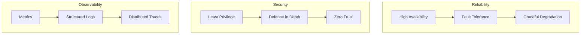
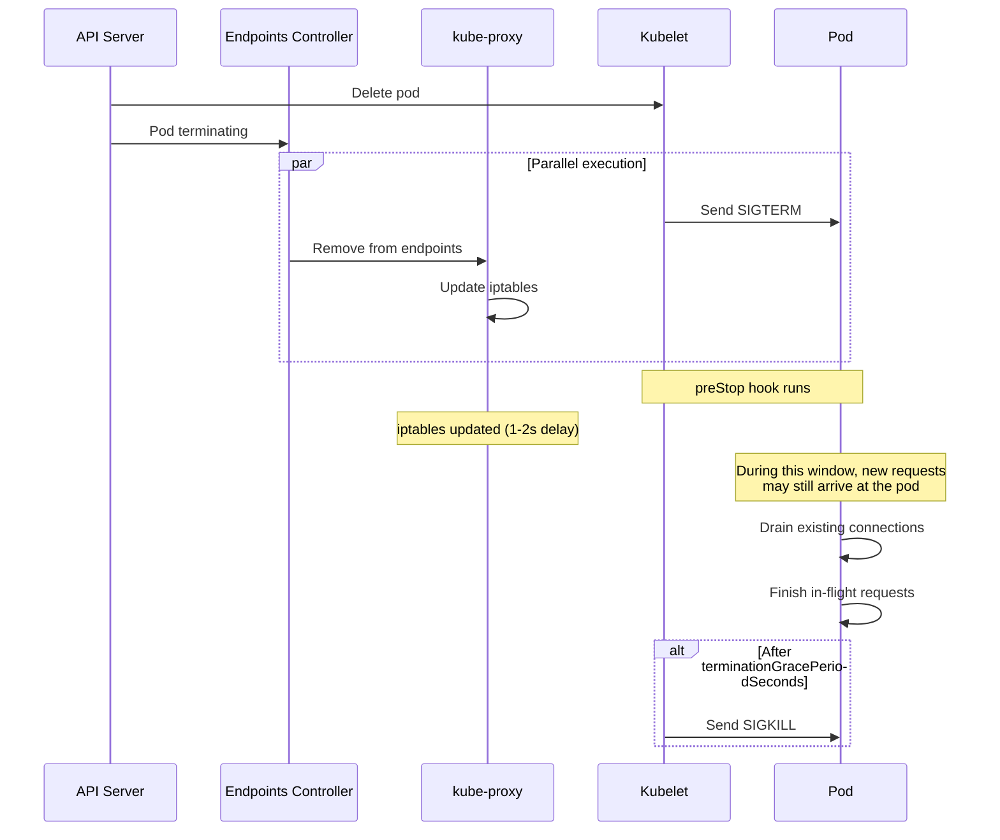

# Kubernetes Production Checklist

## Why It Exists

Running Kubernetes in production is fundamentally different from running it in development. A misconfigured deployment that works perfectly in staging can cause cascading failures, security breaches, or data loss in production. The gap between "it works" and "it works reliably, securely, and at scale" is enormous.

This checklist exists because every production Kubernetes incident we have studied traces back to a violation of one of these items. Missing resource limits cause noisy-neighbor problems and OOM kills. Missing PodDisruptionBudgets cause full outages during node drains. Missing security contexts allow container escapes. Missing anti-affinity rules mean a single node failure takes down your entire service.

This page is organized as a systematic checklist with the "why" behind each item, the exact configuration, and the failure mode it prevents.

## First Principles

### The Production Reliability Triangle



Every item in this checklist falls into one of these three pillars. Skip any pillar and your production deployment has a critical weakness.

### The Blast Radius Principle

Every configuration decision should be evaluated by its blast radius:

$$
\text{Risk} = P(\text{failure}) \times \text{BlastRadius} \times \text{RecoveryTime}
$$

| Blast Radius | Example | Risk Reduction |
|-------------|---------|----------------|
| Single container | Process crash | Restart policy |
| Single pod | Node failure | Multiple replicas |
| Single node | Hardware failure | Anti-affinity |
| Single AZ | Datacenter failure | Topology spread |
| Single cluster | Control plane failure | Multi-cluster |
| Single region | Regional outage | Multi-region |

## Core Mechanics — The Checklist

### 1. Resource Management

#### Resource Requests and Limits

Every container MUST have resource requests and limits defined.

```yaml
containers:
  - name: app
    resources:
      requests:
        cpu: 100m        # Guaranteed CPU
        memory: 256Mi    # Guaranteed memory
      limits:
        cpu: "1"         # Max CPU (throttled beyond this)
        memory: 512Mi    # Max memory (OOM killed beyond this)
```

**Why requests matter:**

The scheduler uses requests (not limits) to decide where to place pods. Without requests, the scheduler assumes zero resource needs and can pack 100 pods on a node with 4 CPU cores.

$$
\text{Allocatable}_{\text{node}} = \text{Total} - \text{System Reserved} - \text{Kube Reserved} - \text{Eviction Threshold}
$$

For a `m5.xlarge` (4 vCPU, 16 GiB):

$$
\text{CPU Allocatable} = 4000m - 60m - 100m = 3840m
$$

$$
\text{Memory Allocatable} = 16384\text{Mi} - 256\text{Mi} - 100\text{Mi} - 100\text{Mi} = 15928\text{Mi}
$$

**CPU limits controversy:**

::: warning
CPU limits are increasingly discouraged in production. When a container hits its CPU limit, it is **throttled** — the kernel delays its execution. This causes latency spikes that are hard to diagnose because the container appears healthy but responds slowly.

**Recommendation:** Set CPU requests (for scheduling) but consider removing CPU limits for latency-sensitive workloads. Always keep memory limits.
:::

**QoS Classes:**

| Class | Criteria | Eviction Priority |
|-------|----------|------------------|
| Guaranteed | requests == limits for all resources | Last (highest priority) |
| Burstable | requests < limits for at least one resource | Middle |
| BestEffort | No requests or limits set | First (lowest priority) |

```yaml
# Guaranteed QoS (recommended for critical workloads)
resources:
  requests:
    cpu: 500m
    memory: 512Mi
  limits:
    cpu: 500m
    memory: 512Mi
```

#### LimitRange and ResourceQuota

Enforce defaults and caps at the namespace level:

```yaml
apiVersion: v1
kind: LimitRange
metadata:
  name: default-limits
  namespace: production
spec:
  limits:
    - type: Container
      default:
        cpu: 500m
        memory: 512Mi
      defaultRequest:
        cpu: 100m
        memory: 128Mi
      max:
        cpu: "4"
        memory: 8Gi
      min:
        cpu: 50m
        memory: 64Mi
    - type: Pod
      max:
        cpu: "8"
        memory: 16Gi
    - type: PersistentVolumeClaim
      max:
        storage: 100Gi
      min:
        storage: 1Gi
---
apiVersion: v1
kind: ResourceQuota
metadata:
  name: production-quota
  namespace: production
spec:
  hard:
    requests.cpu: "40"
    requests.memory: 80Gi
    limits.cpu: "80"
    limits.memory: 160Gi
    pods: "200"
    services: "50"
    persistentvolumeclaims: "100"
    services.loadbalancers: "5"
    services.nodeports: "0"
```

### 2. Pod Disruption Budgets (PDB)

PDBs prevent Kubernetes from evicting too many pods simultaneously during voluntary disruptions (node drain, cluster upgrade, autoscaler scale-down).

```yaml
apiVersion: policy/v1
kind: PodDisruptionBudget
metadata:
  name: api-server-pdb
  namespace: production
spec:
  # Use ONE of minAvailable or maxUnavailable, not both
  minAvailable: 2
  # OR
  # maxUnavailable: 1
  selector:
    matchLabels:
      app: api-server
```

**When to use which:**

| Scenario | Configuration | Why |
|----------|--------------|-----|
| 3 replicas, need 2 for quorum | `minAvailable: 2` | Ensures quorum maintained |
| 5 replicas, can tolerate 1 down | `maxUnavailable: 1` | Allows rolling updates |
| 2 replicas (stateless) | `maxUnavailable: 1` | Keeps 1 running during drain |
| 1 replica (stateless) | Do NOT create PDB | PDB would block all drains |
| StatefulSet (database) | `maxUnavailable: 1` | Prevents data unavailability |

::: danger
A PDB with `minAvailable` equal to the replica count will **permanently block** node drains. If you have 3 replicas and `minAvailable: 3`, the cluster cannot drain any node hosting those pods. This blocks cluster upgrades indefinitely.

Always ensure `minAvailable < replicaCount` or use `maxUnavailable >= 1`.
:::

**PDB with percentage:**

```yaml
spec:
  maxUnavailable: 25%  # At most 25% of pods can be unavailable
  # For 8 replicas: allows 2 to be evicted simultaneously
  # For 4 replicas: allows 1
```

### 3. Anti-Affinity and Topology Spread

Ensure pods are spread across failure domains:

```yaml
spec:
  template:
    spec:
      # Pod anti-affinity: don't schedule on same node as other instances
      affinity:
        podAntiAffinity:
          # Hard requirement: different nodes
          requiredDuringSchedulingIgnoredDuringExecution:
            - labelSelector:
                matchExpressions:
                  - key: app
                    operator: In
                    values:
                      - api-server
              topologyKey: kubernetes.io/hostname
          # Soft preference: different AZs
          preferredDuringSchedulingIgnoredDuringExecution:
            - weight: 100
              podAffinityTerm:
                labelSelector:
                  matchExpressions:
                    - key: app
                      operator: In
                      values:
                        - api-server
                topologyKey: topology.kubernetes.io/zone

      # TopologySpreadConstraints (more flexible than anti-affinity)
      topologySpreadConstraints:
        - maxSkew: 1
          topologyKey: topology.kubernetes.io/zone
          whenUnsatisfiable: DoNotSchedule
          labelSelector:
            matchLabels:
              app: api-server
        - maxSkew: 1
          topologyKey: kubernetes.io/hostname
          whenUnsatisfiable: ScheduleAnyway
          labelSelector:
            matchLabels:
              app: api-server
```

**maxSkew explained:**

$$
\text{skew} = \max(\text{count per zone}) - \min(\text{count per zone})
$$

With `maxSkew: 1` and 3 AZs, 6 replicas distribute as 2-2-2 (not 3-2-1).

**Anti-affinity vs TopologySpreadConstraints:**

| Feature | Pod Anti-Affinity | TopologySpreadConstraints |
|---------|------------------|--------------------------|
| Guarantee distribution | Hard/Soft | maxSkew control |
| Multiple topology keys | Requires multiple rules | Native support |
| Scale beyond topology count | Fails (can't schedule) | Allows with ScheduleAnyway |
| K8s version | All versions | 1.19+ (stable) |
| Performance at scale | O(n^2) pod comparisons | O(n) |

### 4. Security Contexts

#### Pod-Level Security

```yaml
spec:
  template:
    spec:
      # Pod-level security context
      securityContext:
        runAsNonRoot: true
        runAsUser: 65534        # nobody user
        runAsGroup: 65534
        fsGroup: 65534
        seccompProfile:
          type: RuntimeDefault
        supplementalGroups: []

      # Disable service account token auto-mount
      automountServiceAccountToken: false

      containers:
        - name: app
          # Container-level security context
          securityContext:
            allowPrivilegeEscalation: false
            readOnlyRootFilesystem: true
            capabilities:
              drop:
                - ALL
            privileged: false
            runAsNonRoot: true

          # Writable directories for apps that need them
          volumeMounts:
            - name: tmp
              mountPath: /tmp
            - name: cache
              mountPath: /var/cache

      volumes:
        - name: tmp
          emptyDir:
            sizeLimit: 100Mi
        - name: cache
          emptyDir:
            sizeLimit: 500Mi
```

**Security context checklist:**

| Setting | Required Value | Why |
|---------|---------------|-----|
| `runAsNonRoot: true` | Always | Prevents running as UID 0 |
| `allowPrivilegeEscalation: false` | Always | Blocks `setuid` binaries |
| `readOnlyRootFilesystem: true` | When possible | Prevents filesystem tampering |
| `capabilities.drop: [ALL]` | Always | Removes all Linux capabilities |
| `privileged: false` | Always | Never run privileged containers |
| `seccompProfile.type: RuntimeDefault` | Always | Restricts syscalls |
| `automountServiceAccountToken: false` | Unless needed | Prevents token theft |

#### Pod Security Standards (PSS)

Enforce security at the namespace level (replaces deprecated PodSecurityPolicy):

```yaml
apiVersion: v1
kind: Namespace
metadata:
  name: production
  labels:
    # Enforce: reject pods that violate the standard
    pod-security.kubernetes.io/enforce: restricted
    pod-security.kubernetes.io/enforce-version: latest

    # Audit: log violations but allow
    pod-security.kubernetes.io/audit: restricted
    pod-security.kubernetes.io/audit-version: latest

    # Warn: show warnings to users
    pod-security.kubernetes.io/warn: restricted
    pod-security.kubernetes.io/warn-version: latest
```

**PSS levels:**

| Level | What It Allows |
|-------|---------------|
| `privileged` | Everything (no restrictions) |
| `baseline` | Prevents known privilege escalations |
| `restricted` | Heavily restricted, follows security best practices |

### 5. Health Probes

```yaml
containers:
  - name: app
    # Startup probe: gives the app time to initialize
    startupProbe:
      httpGet:
        path: /health/startup
        port: 8080
      initialDelaySeconds: 0
      periodSeconds: 5
      timeoutSeconds: 3
      failureThreshold: 30  # 30 * 5s = 150s to start
      successThreshold: 1

    # Liveness probe: restarts the container if it deadlocks
    livenessProbe:
      httpGet:
        path: /health/live
        port: 8080
      initialDelaySeconds: 0
      periodSeconds: 15
      timeoutSeconds: 5
      failureThreshold: 3
      successThreshold: 1

    # Readiness probe: removes from service endpoints when not ready
    readinessProbe:
      httpGet:
        path: /health/ready
        port: 8080
      initialDelaySeconds: 0
      periodSeconds: 10
      timeoutSeconds: 5
      failureThreshold: 3
      successThreshold: 1
```

**Probe design guidelines:**

| Probe | Should Check | Should NOT Check |
|-------|-------------|-----------------|
| Startup | App is initialized and listening | External dependencies |
| Liveness | App is not deadlocked | External dependencies |
| Readiness | App can serve traffic | Slow but recovering operations |

::: danger
The single most common probe mistake: **putting external dependency checks in the liveness probe**. If your database goes down, your liveness probe fails, Kubernetes kills your pod, the new pod also can't reach the database, it gets killed too, and you end up with zero pods. The database was the problem, not your application.

**Liveness probes should only check if the application process is alive, not its dependencies.**
:::

### 6. Graceful Shutdown

```yaml
spec:
  terminationGracePeriodSeconds: 60  # Default is 30s

  containers:
    - name: app
      lifecycle:
        preStop:
          exec:
            command:
              - /bin/sh
              - -c
              - "sleep 5"  # Wait for endpoint removal propagation
```

**The shutdown race condition:**



The `sleep 5` in the preStop hook gives kube-proxy time to update iptables rules so new traffic stops being sent to the pod before it starts shutting down.

**Application-side graceful shutdown (TypeScript):**

```typescript
import { createServer, Server } from 'http';

const server: Server = createServer(/* ... */);

let isShuttingDown = false;

process.on('SIGTERM', async () => {
  console.log('SIGTERM received, starting graceful shutdown');
  isShuttingDown = true;

  // Stop accepting new connections
  server.close(() => {
    console.log('All connections closed');
    process.exit(0);
  });

  // Force exit after timeout (leave 5s buffer before SIGKILL)
  setTimeout(() => {
    console.error('Forced exit after timeout');
    process.exit(1);
  }, 25_000); // terminationGracePeriodSeconds(30) - preStop(5)
});

// Health check that respects shutdown
app.get('/health/ready', (req, res) => {
  if (isShuttingDown) {
    res.status(503).json({ status: 'shutting_down' });
  } else {
    res.status(200).json({ status: 'ready' });
  }
});
```

### 7. Network Policies

Default deny all traffic, then explicitly allow what is needed:

```yaml
# Default deny all ingress and egress
apiVersion: networking.k8s.io/v1
kind: NetworkPolicy
metadata:
  name: default-deny
  namespace: production
spec:
  podSelector: {}  # Applies to all pods
  policyTypes:
    - Ingress
    - Egress
---
# Allow specific traffic
apiVersion: networking.k8s.io/v1
kind: NetworkPolicy
metadata:
  name: allow-api-server
  namespace: production
spec:
  podSelector:
    matchLabels:
      app: api-server
  policyTypes:
    - Ingress
    - Egress
  ingress:
    - from:
        - namespaceSelector:
            matchLabels:
              name: ingress-nginx
      ports:
        - protocol: TCP
          port: 8080
  egress:
    # Allow DNS
    - to: []
      ports:
        - protocol: UDP
          port: 53
        - protocol: TCP
          port: 53
    # Allow database
    - to:
        - podSelector:
            matchLabels:
              app: postgresql
      ports:
        - protocol: TCP
          port: 5432
    # Allow external HTTPS
    - to:
        - ipBlock:
            cidr: 0.0.0.0/0
            except:
              - 10.0.0.0/8
              - 172.16.0.0/12
              - 192.168.0.0/16
      ports:
        - protocol: TCP
          port: 443
```

### 8. Monitoring and Observability

```yaml
# ServiceMonitor for Prometheus
apiVersion: monitoring.coreos.com/v1
kind: ServiceMonitor
metadata:
  name: api-server-metrics
  namespace: production
spec:
  selector:
    matchLabels:
      app: api-server
  endpoints:
    - port: metrics
      interval: 15s
      path: /metrics
---
# Essential PrometheusRules
apiVersion: monitoring.coreos.com/v1
kind: PrometheusRule
metadata:
  name: api-server-alerts
  namespace: production
spec:
  groups:
    - name: availability
      rules:
        - alert: HighErrorRate
          expr: |
            sum(rate(http_requests_total{status=~"5..", app="api-server"}[5m]))
            / sum(rate(http_requests_total{app="api-server"}[5m])) > 0.01
          for: 5m
          labels:
            severity: critical
          annotations:
            summary: "Error rate exceeds 1%"

        - alert: HighLatency
          expr: |
            histogram_quantile(0.99,
              sum(rate(http_request_duration_seconds_bucket{app="api-server"}[5m])) by (le)
            ) > 1.0
          for: 5m
          labels:
            severity: warning
          annotations:
            summary: "P99 latency exceeds 1 second"

        - alert: PodRestarting
          expr: |
            increase(kube_pod_container_status_restarts_total{namespace="production"}[1h]) > 3
          for: 5m
          labels:
            severity: warning
          annotations:
            summary: "Pod restarting frequently"
```

### 9. Image Security

```yaml
containers:
  - name: app
    # Always use specific SHA digests in production
    image: ghcr.io/company/api-server@sha256:a1b2c3d4e5f6...

    # At minimum, use specific tags (never :latest)
    # image: ghcr.io/company/api-server:v3.1.2

    imagePullPolicy: IfNotPresent
    # Use Always for :latest tags (but don't use :latest in prod)
```

**Image provenance verification with cosign:**

```bash
# Sign the image during CI/CD
cosign sign --key cosign.key ghcr.io/company/api-server@sha256:a1b2c3d4

# Verify in admission control
apiVersion: policy.sigstore.dev/v1alpha1
kind: ClusterImagePolicy
metadata:
  name: verify-company-images
spec:
  images:
    - glob: "ghcr.io/company/**"
  authorities:
    - key:
        data: |
          -----BEGIN PUBLIC KEY-----
          MFkwEwYHKoZIzj0CAQYIKoZIzj0DAQcDQgAE...
          -----END PUBLIC KEY-----
```

### 10. Rollout Strategy

```yaml
spec:
  strategy:
    type: RollingUpdate
    rollingUpdate:
      maxUnavailable: 0     # Never have fewer than desired replicas
      maxSurge: 1            # Create at most 1 extra pod during rollout

  # Keep rollout history for debugging
  revisionHistoryLimit: 5

  # Minimum time a pod must be ready before it's considered available
  minReadySeconds: 10

  # Automatically rollback if the rollout is stuck
  progressDeadlineSeconds: 600  # 10 minutes
```

**Rollout monitoring:**

```bash
# Watch rollout progress
kubectl rollout status deployment/api-server -n production --timeout=10m

# Check rollout history
kubectl rollout history deployment/api-server -n production

# Quick rollback
kubectl rollout undo deployment/api-server -n production

# Rollback to specific revision
kubectl rollout undo deployment/api-server -n production --to-revision=3
```

## Implementation — Production Manifest Template

```yaml
# Complete production-ready deployment
apiVersion: apps/v1
kind: Deployment
metadata:
  name: api-server
  namespace: production
  labels:
    app: api-server
    app.kubernetes.io/name: api-server
    app.kubernetes.io/version: "3.1.2"
    app.kubernetes.io/managed-by: helm
spec:
  replicas: 3
  revisionHistoryLimit: 5
  progressDeadlineSeconds: 600
  minReadySeconds: 10
  strategy:
    type: RollingUpdate
    rollingUpdate:
      maxUnavailable: 0
      maxSurge: 1
  selector:
    matchLabels:
      app: api-server
  template:
    metadata:
      labels:
        app: api-server
      annotations:
        prometheus.io/scrape: "true"
        prometheus.io/port: "9090"
    spec:
      serviceAccountName: api-server
      automountServiceAccountToken: false
      terminationGracePeriodSeconds: 60

      securityContext:
        runAsNonRoot: true
        runAsUser: 65534
        runAsGroup: 65534
        fsGroup: 65534
        seccompProfile:
          type: RuntimeDefault

      topologySpreadConstraints:
        - maxSkew: 1
          topologyKey: topology.kubernetes.io/zone
          whenUnsatisfiable: DoNotSchedule
          labelSelector:
            matchLabels:
              app: api-server
        - maxSkew: 1
          topologyKey: kubernetes.io/hostname
          whenUnsatisfiable: ScheduleAnyway
          labelSelector:
            matchLabels:
              app: api-server

      containers:
        - name: api-server
          image: ghcr.io/company/api-server:v3.1.2
          imagePullPolicy: IfNotPresent

          ports:
            - name: http
              containerPort: 8080
              protocol: TCP
            - name: metrics
              containerPort: 9090
              protocol: TCP

          env:
            - name: NODE_ENV
              value: production
            - name: PORT
              value: "8080"
            - name: LOG_LEVEL
              value: info
            - name: POD_NAME
              valueFrom:
                fieldRef:
                  fieldPath: metadata.name
            - name: POD_NAMESPACE
              valueFrom:
                fieldRef:
                  fieldPath: metadata.namespace

          envFrom:
            - secretRef:
                name: api-server-secrets

          resources:
            requests:
              cpu: 250m
              memory: 512Mi
            limits:
              memory: 1Gi
              # CPU limit intentionally omitted to avoid throttling

          securityContext:
            allowPrivilegeEscalation: false
            readOnlyRootFilesystem: true
            capabilities:
              drop:
                - ALL

          startupProbe:
            httpGet:
              path: /health/startup
              port: http
            periodSeconds: 5
            failureThreshold: 30

          livenessProbe:
            httpGet:
              path: /health/live
              port: http
            periodSeconds: 15
            timeoutSeconds: 5
            failureThreshold: 3

          readinessProbe:
            httpGet:
              path: /health/ready
              port: http
            periodSeconds: 10
            timeoutSeconds: 5
            failureThreshold: 3

          volumeMounts:
            - name: tmp
              mountPath: /tmp

          lifecycle:
            preStop:
              exec:
                command: ["/bin/sh", "-c", "sleep 5"]

      volumes:
        - name: tmp
          emptyDir:
            sizeLimit: 100Mi

      imagePullSecrets:
        - name: ghcr-credentials
---
apiVersion: v1
kind: ServiceAccount
metadata:
  name: api-server
  namespace: production
  annotations:
    eks.amazonaws.com/role-arn: arn:aws:iam::123456789012:role/api-server-role
---
apiVersion: v1
kind: Service
metadata:
  name: api-server
  namespace: production
  labels:
    app: api-server
spec:
  type: ClusterIP
  ports:
    - name: http
      port: 80
      targetPort: http
    - name: metrics
      port: 9090
      targetPort: metrics
  selector:
    app: api-server
---
apiVersion: policy/v1
kind: PodDisruptionBudget
metadata:
  name: api-server
  namespace: production
spec:
  maxUnavailable: 1
  selector:
    matchLabels:
      app: api-server
---
apiVersion: autoscaling/v2
kind: HorizontalPodAutoscaler
metadata:
  name: api-server
  namespace: production
spec:
  scaleTargetRef:
    apiVersion: apps/v1
    kind: Deployment
    name: api-server
  minReplicas: 3
  maxReplicas: 20
  behavior:
    scaleDown:
      stabilizationWindowSeconds: 300
      policies:
        - type: Pods
          value: 1
          periodSeconds: 60
    scaleUp:
      stabilizationWindowSeconds: 0
      policies:
        - type: Percent
          value: 100
          periodSeconds: 15
  metrics:
    - type: Resource
      resource:
        name: cpu
        target:
          type: Utilization
          averageUtilization: 70
    - type: Resource
      resource:
        name: memory
        target:
          type: Utilization
          averageUtilization: 80
```

## Edge Cases and Failure Modes

### 1. PDB Blocking Cluster Upgrades

```bash
# Find PDBs that could block drains
kubectl get pdb -A -o json | jq -r '
  .items[] |
  select(.status.disruptionsAllowed == 0) |
  "\(.metadata.namespace)/\(.metadata.name): allowed=\(.status.disruptionsAllowed) current=\(.status.currentHealthy) desired=\(.status.desiredHealthy)"'
```

### 2. Resource Quota Preventing Deployments

A new deployment fails because the namespace has hit its resource quota. The ReplicaSet creates no pods, and there is no obvious error message on the Deployment object.

```bash
# Check ReplicaSet events (not Deployment events!)
kubectl get rs -n production -l app=api-server
kubectl describe rs <replicaset-name> -n production | grep -A5 "Events"
# "Error creating: exceeded quota"
```

### 3. Topology Spread Deadlock

With `whenUnsatisfiable: DoNotSchedule` and only 2 AZs but 3 replicas already distributed 2-1, the 4th pod cannot be scheduled because placing it in either AZ would violate `maxSkew: 1`.

```yaml
# Fix: Use ScheduleAnyway for the hostname constraint
topologySpreadConstraints:
  - maxSkew: 1
    topologyKey: topology.kubernetes.io/zone
    whenUnsatisfiable: DoNotSchedule
  - maxSkew: 1
    topologyKey: kubernetes.io/hostname
    whenUnsatisfiable: ScheduleAnyway  # Soft constraint for hostname
```

### 4. Readiness Probe Flapping

If the readiness probe intermittently fails, the pod is repeatedly added and removed from endpoints, causing connection errors for clients.

$$
\text{Flap rate} = \frac{\text{status changes}}{T} > \text{threshold}
$$

Fix with `successThreshold: 2` (require 2 consecutive successes before marking ready again):

```yaml
readinessProbe:
  httpGet:
    path: /health/ready
    port: 8080
  periodSeconds: 10
  successThreshold: 2   # Must pass twice before being ready
  failureThreshold: 3
```

## Performance Characteristics

### Scheduling Latency by Configuration

| Configuration | Scheduling Latency | Notes |
|--------------|-------------------|-------|
| No constraints | 1-5ms | Fastest |
| Resource requests only | 2-10ms | Minimal overhead |
| Node affinity | 5-20ms | Evaluates node labels |
| Pod anti-affinity | 10-100ms | O(n) pod comparisons |
| TopologySpreadConstraints | 5-50ms | More efficient than anti-affinity |
| All combined | 20-200ms | Acceptable for production |

### Resource Overhead of Production Config

| Component | CPU Overhead | Memory Overhead |
|-----------|-------------|-----------------|
| Sidecar proxy (Envoy) | 50-100m | 64-128Mi per pod |
| Metrics endpoint | 5-10m | 10-20Mi |
| Log collector (Fluentbit) | 50-100m per node | 64-128Mi per node |
| Network policy enforcement | 5-10% CPU on node | 50-100Mi per node |
| Pod security admission | <1ms per request | Negligible |

## Mathematical Foundations

### Availability Calculation

For a service with $n$ replicas, each with individual availability $a$:

$$
A_{service} = 1 - (1 - a)^n
$$

| Replicas | Individual Availability | Service Availability | Annual Downtime |
|----------|----------------------|---------------------|-----------------|
| 1 | 99.9% | 99.9% | 8.76h |
| 2 | 99.9% | 99.9999% | 31.5s |
| 3 | 99.9% | 99.9999999% | 0.03s |
| 2 | 99% | 99.99% | 52.6m |
| 3 | 99% | 99.9999% | 31.5s |

This assumes independent failures. Correlated failures (same node, same AZ) reduce the effective availability — which is why anti-affinity and topology spread are critical.

With AZ-aware distribution across $k$ AZs:

$$
A_{service} = 1 - \prod_{i=1}^{k} (1 - a_i)^{n_i}
$$

Where $n_i$ is the number of replicas in AZ $i$.

### Optimal Replica Count

Given a target availability $A_t$ and per-replica availability $a$:

$$
n \geq \frac{\ln(1 - A_t)}{\ln(1 - a)}
$$

For 99.99% target with 99.5% per-replica:

$$
n \geq \frac{\ln(0.0001)}{\ln(0.005)} = \frac{-9.21}{-5.30} \approx 1.74 \rightarrow 2 \text{ replicas}
$$

For 99.999% target with 99.5% per-replica:

$$
n \geq \frac{\ln(0.00001)}{\ln(0.005)} = \frac{-11.51}{-5.30} \approx 2.17 \rightarrow 3 \text{ replicas}
$$

## Real-World War Stories

::: info War Story — The Missing PDB
A platform team initiated a cluster upgrade during business hours. The upgrade drained nodes one by one. Because no PDB existed for the payment service, Kubernetes evicted all 3 payment service pods from a node simultaneously, leaving 0 running pods for 45 seconds while the new pods started on other nodes. During those 45 seconds, all payment transactions failed.

**Impact:** $47,000 in failed transactions during a peak hour.

**Fix:** Mandatory PDB creation for all production deployments, enforced via OPA/Gatekeeper policy.
:::

::: info War Story — The ReadOnlyRootFilesystem Surprise
A team enabled `readOnlyRootFilesystem: true` on their Node.js application without testing. The app worked fine until it received its first file upload — it tried to write to `/tmp` (which was on the read-only root filesystem) and crashed. The crash triggered a CrashLoopBackOff, and because the readiness probe was also failing, all pods were removed from the service.

**Fix:** Added emptyDir volumes for `/tmp` and `/var/cache`. Added a CI step that runs the container with read-only FS and exercises all code paths.
:::

::: info War Story — Liveness Probe Database Dependency
A team set their liveness probe to check database connectivity. When the database failed over (30 seconds of unavailability), all 20 API pods failed their liveness probes and were killed simultaneously. The new pods also couldn't reach the database, failed their liveness probes, and entered CrashLoopBackOff. The 5-minute backoff meant that when the database came back after 30 seconds, the API pods didn't recover for 5 minutes.

**Impact:** 5 minutes of complete API downtime for a 30-second database failover.

**Fix:** Changed liveness probe to only check if the HTTP server is responding. Moved database connectivity to the readiness probe (which removes from service but doesn't kill the pod).
:::

## Decision Framework

### Production Readiness Scoring

Rate each item 0-2 (0 = missing, 1 = partial, 2 = complete):

| Category | Item | Score |
|----------|------|-------|
| **Resources** | Requests and limits defined | /2 |
| | LimitRange and ResourceQuota | /2 |
| | QoS class is Guaranteed or Burstable | /2 |
| **Availability** | Minimum 2 replicas | /2 |
| | PDB configured | /2 |
| | Anti-affinity or topology spread | /2 |
| | minReadySeconds > 0 | /2 |
| **Security** | runAsNonRoot | /2 |
| | readOnlyRootFilesystem | /2 |
| | Drop all capabilities | /2 |
| | No privileged containers | /2 |
| | NetworkPolicy (default deny + allow) | /2 |
| | Image tag is not :latest | /2 |
| **Health** | Startup probe | /2 |
| | Liveness probe (no external deps) | /2 |
| | Readiness probe | /2 |
| | Graceful shutdown (preStop + SIGTERM) | /2 |
| **Observability** | Metrics endpoint exposed | /2 |
| | Alerts configured | /2 |
| | Structured logging | /2 |
| **Total** | | /40 |

**Score interpretation:**
- 36-40: Production ready
- 28-35: Needs improvement, acceptable for staging
- 20-27: Not production ready
- Below 20: Development environment only

## Advanced Topics

### Policy Enforcement with OPA/Gatekeeper

Enforce the checklist automatically:

```yaml
apiVersion: templates.gatekeeper.sh/v1
kind: ConstraintTemplate
metadata:
  name: k8sproductionreadiness
spec:
  crd:
    spec:
      names:
        kind: K8sProductionReadiness
  targets:
    - target: admission.k8s.gatekeeper.sh
      rego: |
        package k8sproductionreadiness

        violation[{"msg": msg}] {
          container := input.review.object.spec.template.spec.containers[_]
          not container.resources.limits.memory
          msg := sprintf("Container %s must have memory limits", [container.name])
        }

        violation[{"msg": msg}] {
          container := input.review.object.spec.template.spec.containers[_]
          not container.readinessProbe
          msg := sprintf("Container %s must have a readiness probe", [container.name])
        }

        violation[{"msg": msg}] {
          container := input.review.object.spec.template.spec.containers[_]
          container.securityContext.privileged == true
          msg := sprintf("Container %s must not be privileged", [container.name])
        }

        violation[{"msg": msg}] {
          input.review.object.spec.template.spec.containers[_].image
          endswith(input.review.object.spec.template.spec.containers[_].image, ":latest")
          msg := "Images must not use the :latest tag"
        }

        violation[{"msg": msg}] {
          not input.review.object.spec.template.spec.securityContext.runAsNonRoot
          msg := "Pod must set runAsNonRoot: true"
        }
---
apiVersion: constraints.gatekeeper.sh/v1beta1
kind: K8sProductionReadiness
metadata:
  name: enforce-production-readiness
spec:
  match:
    kinds:
      - apiGroups: ["apps"]
        kinds: ["Deployment"]
    namespaces: ["production"]
  parameters: {}
```

### Kyverno Policies (Alternative to Gatekeeper)

```yaml
apiVersion: kyverno.io/v1
kind: ClusterPolicy
metadata:
  name: require-production-standards
spec:
  validationFailureAction: enforce
  rules:
    - name: require-resource-limits
      match:
        resources:
          kinds:
            - Deployment
          namespaces:
            - production
      validate:
        message: "All containers must have memory limits and CPU requests"
        pattern:
          spec:
            template:
              spec:
                containers:
                  - resources:
                      limits:
                        memory: "?*"
                      requests:
                        cpu: "?*"

    - name: require-probes
      match:
        resources:
          kinds:
            - Deployment
          namespaces:
            - production
      validate:
        message: "All containers must have readiness and liveness probes"
        pattern:
          spec:
            template:
              spec:
                containers:
                  - readinessProbe:
                      httpGet:
                        path: "?*"
                    livenessProbe:
                      httpGet:
                        path: "?*"

    - name: restrict-image-registries
      match:
        resources:
          kinds:
            - Pod
          namespaces:
            - production
      validate:
        message: "Images must be from approved registries"
        pattern:
          spec:
            containers:
              - image: "ghcr.io/company/* | registry.company.com/*"
```

---

*Previous: [Troubleshooting](./troubleshooting.md) | Next: [Docker Overview](../docker/)*
