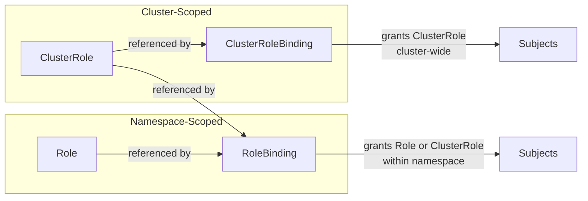
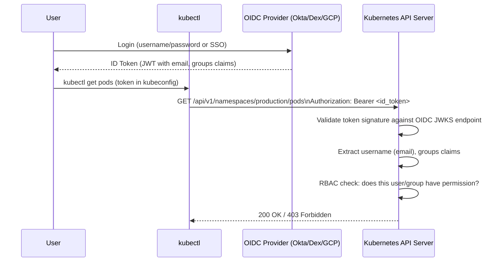

# Kubernetes RBAC

Role-Based Access Control is the mechanism by which Kubernetes decides whether a request is allowed to proceed. Every action against the Kubernetes API — whether it's `kubectl get pods`, a controller reading ConfigMaps, or a webhook validating a deployment — goes through the RBAC authorization layer. Getting RBAC right is the difference between a cluster with meaningful access controls and one where a single compromised CI/CD token can delete every resource in every namespace.

---

## 1. Why It Exists — The Problem It Solves

The Kubernetes API is the control plane for everything: pods, deployments, secrets, service accounts, network policies, cluster configuration. Before RBAC (added in Kubernetes 1.6), the alternatives were:

**ABAC (Attribute-Based Access Control):** The original Kubernetes authorization mechanism. You define policies in a JSON file on the API server, restart the API server for changes to take effect, and manage a flat file with policy rules. It worked, but it was operationally painful — every change required a node operation, policies couldn't be scoped to namespaces easily, and there was no API to manage them.

**AllowAll / AlwaysAllow:** Literally what the name implies. Used in development clusters and by teams who hadn't yet dealt with the consequences.

**RBAC solves these problems:**
- Policies are stored as Kubernetes resources in etcd — managed via `kubectl` like everything else
- Namespaced roles scope permissions to specific namespaces without affecting others
- Cluster roles and bindings handle cluster-level or cross-namespace resources
- Changes take effect immediately, no API server restart needed
- You can grant read access to one team, write access to another, and admin to a third — all from the same API
- Audit logs record every RBAC decision

---

## 2. First Principles

RBAC in Kubernetes has three concepts: **subjects**, **verbs**, and **resources**.

**Subjects** are who is making the request:
- `User`: A human operator (authenticated via client certificate, OIDC, etc.)
- `Group`: A collection of users (e.g., `system:authenticated`, `developers`)
- `ServiceAccount`: A pod identity, scoped to a namespace

**Verbs** are what they want to do:
- `get`, `list`, `watch` — read operations
- `create`, `update`, `patch` — write operations
- `delete`, `deletecollection` — delete operations
- `use` — for PodSecurityPolicy / PodSecurityAdmission
- `bind`, `escalate`, `impersonate` — special meta-permissions

**Resources** are what Kubernetes object type they're acting on:
- `pods`, `deployments`, `services`, `secrets`, `configmaps`, etc.
- Sub-resources: `pods/log`, `pods/exec`, `pods/portforward`
- Non-resource URLs: `/healthz`, `/metrics`, `/api`

RBAC is **allow-only**: there are no deny rules. If a subject has no permissions, everything is denied. You grant permissions by creating Rules that allow specific verb+resource combinations.

---

## 3. Core Objects

### Role and ClusterRole

A **Role** defines a set of permissions within a single namespace.
A **ClusterRole** defines a set of permissions cluster-wide OR can be bound within a namespace.

```yaml
# Role: namespace-scoped permissions
apiVersion: rbac.authorization.k8s.io/v1
kind: Role
metadata:
  name: pod-reader
  namespace: production
rules:
  - apiGroups: [""]              # "" = core API group (pods, services, secrets)
    resources: ["pods"]
    verbs: ["get", "list", "watch"]
  - apiGroups: [""]
    resources: ["pods/log"]      # Sub-resource for kubectl logs
    verbs: ["get"]

---
# ClusterRole: cluster-scoped or used for cluster-wide permission templates
apiVersion: rbac.authorization.k8s.io/v1
kind: ClusterRole
metadata:
  name: node-reader
rules:
  - apiGroups: [""]
    resources: ["nodes"]         # nodes are cluster-scoped (no namespace)
    verbs: ["get", "list", "watch"]
  - apiGroups: ["metrics.k8s.io"]
    resources: ["nodes", "pods"]
    verbs: ["get", "list"]
```

### RoleBinding and ClusterRoleBinding

A **RoleBinding** grants a Role (or ClusterRole) to subjects within a namespace.
A **ClusterRoleBinding** grants a ClusterRole to subjects cluster-wide.

```yaml
# RoleBinding: grant pod-reader Role to user alice in production namespace
apiVersion: rbac.authorization.k8s.io/v1
kind: RoleBinding
metadata:
  name: alice-pod-reader
  namespace: production
subjects:
  - kind: User
    name: alice@company.com      # Exact string from authentication token
    apiGroup: rbac.authorization.k8s.io
  - kind: Group
    name: developers             # Everyone in the developers group
    apiGroup: rbac.authorization.k8s.io
roleRef:
  kind: Role
  name: pod-reader
  apiGroup: rbac.authorization.k8s.io

---
# RoleBinding binding a ClusterRole to namespace scope
# This is a powerful pattern: define ClusterRoles as templates,
# bind them per-namespace via RoleBinding
apiVersion: rbac.authorization.k8s.io/v1
kind: RoleBinding
metadata:
  name: ops-team-admin
  namespace: production
subjects:
  - kind: Group
    name: ops-team
    apiGroup: rbac.authorization.k8s.io
roleRef:
  kind: ClusterRole              # ClusterRole as a template
  name: admin                    # Built-in admin ClusterRole
  apiGroup: rbac.authorization.k8s.io
```

### The Four Objects and Their Scope



### Built-in ClusterRoles

Kubernetes ships with several built-in ClusterRoles you should know:

| ClusterRole | What it allows |
|---|---|
| `cluster-admin` | Everything — God mode. Equivalent to root. |
| `admin` | Full CRUD on most namespace resources. Cannot manage quota or RBAC roles. |
| `edit` | Read/write most resources. Cannot view or modify Roles/RoleBindings. |
| `view` | Read-only access to most namespace resources. Cannot view Secrets. |
| `system:kube-scheduler` | What the scheduler needs to function |
| `system:node` | What each kubelet node needs |
| `system:auth-delegator` | Allows delegating authentication decisions |

---

## 4. Service Accounts

Service accounts are Kubernetes-native identities for pods. Every pod runs under a service account. By default, pods run under the `default` service account in their namespace.

### How Service Accounts Work

When a pod starts, if `automountServiceAccountToken` is true (the default), Kubernetes:
1. Creates a projected volume with a service account token
2. Mounts it at `/var/run/secrets/kubernetes.io/serviceaccount/token`
3. Also mounts the cluster CA cert and namespace file in the same directory

The token is a JWT signed by the cluster's service account signing key. Any pod can use this token to authenticate to the Kubernetes API server as the service account identity `system:serviceaccount:<namespace>:<name>`.

### Disabling Auto-Mount

Most pods don't need API access. Auto-mounting tokens gives every compromised pod potential API access. Disable it at the pod or service account level:

```yaml
# Disable at ServiceAccount level (all pods using this SA won't auto-mount)
apiVersion: v1
kind: ServiceAccount
metadata:
  name: app-service-account
  namespace: production
automountServiceAccountToken: false   # Opt-out at SA level

---
# Disable at Pod level (overrides ServiceAccount setting)
apiVersion: v1
kind: Pod
spec:
  automountServiceAccountToken: false
  serviceAccountName: app-service-account
  containers:
    - name: app
      image: myapp:1.0.0
```

**Token expiry:** Before Kubernetes 1.22, service account tokens had no expiry. Since 1.22, projected tokens expire (default 1 hour, configurable). The kubelet automatically rotates them. If your application caches the token (reads it once at startup), it will eventually use a stale token. Always read the token from the file on each API request.

### Service Account RBAC Pattern

```yaml
# Create a dedicated ServiceAccount (don't use default!)
apiVersion: v1
kind: ServiceAccount
metadata:
  name: backend-app
  namespace: production
  annotations:
    description: "Service account for backend application pods"
automountServiceAccountToken: false    # We'll mount explicitly where needed

---
# Create a Role with least-privilege permissions
apiVersion: rbac.authorization.k8s.io/v1
kind: Role
metadata:
  name: backend-app-role
  namespace: production
rules:
  # Read ConfigMaps (app config)
  - apiGroups: [""]
    resources: ["configmaps"]
    verbs: ["get", "list", "watch"]
    resourceNames: ["app-config", "feature-flags"]   # Restrict to specific names!
  # Read Secrets for database credentials
  - apiGroups: [""]
    resources: ["secrets"]
    verbs: ["get"]
    resourceNames: ["db-credentials"]

---
# Bind the Role to the ServiceAccount
apiVersion: rbac.authorization.k8s.io/v1
kind: RoleBinding
metadata:
  name: backend-app-binding
  namespace: production
subjects:
  - kind: ServiceAccount
    name: backend-app
    namespace: production
roleRef:
  kind: Role
  name: backend-app-role
  apiGroup: rbac.authorization.k8s.io
```

---

## 5. Complete YAML Examples

### 5.1 Read-Only Role for a Namespace

For a developer who needs to inspect production but should never modify anything:

```yaml
# read-only-developer.yaml
apiVersion: rbac.authorization.k8s.io/v1
kind: Role
metadata:
  name: namespace-read-only
  namespace: production
rules:
  - apiGroups: [""]
    resources:
      - pods
      - pods/log
      - services
      - endpoints
      - configmaps
      - events
      - persistentvolumeclaims
    verbs: ["get", "list", "watch"]
  - apiGroups: ["apps"]
    resources:
      - deployments
      - replicasets
      - statefulsets
      - daemonsets
    verbs: ["get", "list", "watch"]
  - apiGroups: ["networking.k8s.io"]
    resources:
      - ingresses
      - networkpolicies
    verbs: ["get", "list", "watch"]
  - apiGroups: ["autoscaling"]
    resources:
      - horizontalpodautoscalers
    verbs: ["get", "list", "watch"]
  # Note: Secrets are deliberately excluded
  # Developers should not have access to production secrets

---
apiVersion: rbac.authorization.k8s.io/v1
kind: RoleBinding
metadata:
  name: developers-read-only
  namespace: production
subjects:
  - kind: Group
    name: developers
    apiGroup: rbac.authorization.k8s.io
roleRef:
  kind: Role
  name: namespace-read-only
  apiGroup: rbac.authorization.k8s.io
```

### 5.2 Admin Role with Exceptions

An operations team role that can manage most resources but cannot touch secrets or modify RBAC:

```yaml
# ops-admin.yaml
apiVersion: rbac.authorization.k8s.io/v1
kind: Role
metadata:
  name: ops-admin
  namespace: production
rules:
  # Full access to workload resources
  - apiGroups: ["", "apps", "batch", "networking.k8s.io", "autoscaling"]
    resources: ["*"]
    verbs: ["*"]
  # Explicitly EXCLUDE: since RBAC is allow-only, we can't deny secrets
  # Instead, we don't include secrets in the allowed resources
  # Secrets require explicit permission; not listing them means no access
  # If you need to grant partial access to secrets:
  - apiGroups: [""]
    resources: ["secrets"]
    verbs: ["list"]              # Can see secret names, not values
    # Cannot: get, create, update, patch, delete secrets
  # RBAC management: read-only (for auditing, not modification)
  - apiGroups: ["rbac.authorization.k8s.io"]
    resources: ["roles", "rolebindings"]
    verbs: ["get", "list", "watch"]
```

### 5.3 CI/CD Deployment Role

Minimal permissions for a deployment pipeline. The pipeline only needs to update images and restart pods — nothing else:

```yaml
# cicd-deploy-role.yaml
# Production CI/CD service account and RBAC
apiVersion: v1
kind: ServiceAccount
metadata:
  name: cicd-deployer
  namespace: production

---
apiVersion: rbac.authorization.k8s.io/v1
kind: Role
metadata:
  name: cicd-deployer-role
  namespace: production
rules:
  # Update deployment images (the main use case)
  - apiGroups: ["apps"]
    resources: ["deployments"]
    verbs: ["get", "patch", "update"]
  # Wait for rollout completion
  - apiGroups: ["apps"]
    resources: ["deployments/status", "replicasets"]
    verbs: ["get", "list", "watch"]
  # Read pods (for rollout status checking)
  - apiGroups: [""]
    resources: ["pods"]
    verbs: ["get", "list", "watch"]
  # Apply ConfigMap updates
  - apiGroups: [""]
    resources: ["configmaps"]
    verbs: ["get", "create", "update", "patch"]
    resourceNames: ["app-config"]  # Only specific ConfigMaps
  # For helm: manage secrets that helm uses for release metadata
  - apiGroups: [""]
    resources: ["secrets"]
    verbs: ["get", "create", "update", "patch", "delete"]
    resourceNames: ["sh.helm.release.v1.*"]    # Helm release secrets only

---
apiVersion: rbac.authorization.k8s.io/v1
kind: RoleBinding
metadata:
  name: cicd-deployer-binding
  namespace: production
subjects:
  - kind: ServiceAccount
    name: cicd-deployer
    namespace: production
roleRef:
  kind: Role
  name: cicd-deployer-role
  apiGroup: rbac.authorization.k8s.io
```

### 5.4 Cross-Namespace Service Account Binding

A service account in `namespace-a` needs to read resources from `namespace-b`. This is done by binding a ClusterRole or Role from namespace-b to the service account from namespace-a:

```yaml
# cross-namespace-binding.yaml
# Service account in namespace-a reads ConfigMaps from namespace-b
apiVersion: rbac.authorization.k8s.io/v1
kind: RoleBinding
metadata:
  name: cross-ns-configmap-reader
  namespace: namespace-b            # The namespace where access is granted
subjects:
  - kind: ServiceAccount
    name: my-app                    # Service account in namespace-a
    namespace: namespace-a          # IMPORTANT: specify the source namespace
roleRef:
  kind: ClusterRole
  name: view
  apiGroup: rbac.authorization.k8s.io
```

---

## 6. OIDC Integration

Kubernetes doesn't manage users itself — it delegates user authentication to external identity providers via OpenID Connect (OIDC). Once authenticated, the OIDC token's claims (email, groups) are mapped to Kubernetes users and groups that RBAC rules can reference.

### OIDC Flow



### API Server OIDC Configuration

```yaml
# API server flags (set via kube-apiserver configuration)
# For kubeadm clusters, add to ClusterConfiguration:
apiServer:
  extraArgs:
    oidc-issuer-url: "https://accounts.google.com"        # Or your Okta/Dex URL
    oidc-client-id: "kubernetes"                           # Must match the client ID in your IDP
    oidc-username-claim: "email"                           # JWT claim to use as username
    oidc-groups-claim: "groups"                            # JWT claim to use as groups
    oidc-username-prefix: "oidc:"                          # Prefix to avoid collisions
    oidc-groups-prefix: "oidc:"
```

Once configured, any ClusterRoleBinding or RoleBinding can reference OIDC-provided usernames and groups:

```yaml
# Bind ops-admin ClusterRole to the OIDC group "ops-team"
apiVersion: rbac.authorization.k8s.io/v1
kind: ClusterRoleBinding
metadata:
  name: ops-team-cluster-admin
subjects:
  - kind: Group
    name: "oidc:ops-team"          # Prefixed with oidc: to match the server config
    apiGroup: rbac.authorization.k8s.io
roleRef:
  kind: ClusterRole
  name: cluster-admin
  apiGroup: rbac.authorization.k8s.io
```

---

## 7. AWS IRSA (IAM Roles for Service Accounts)

IRSA is the AWS-native solution for giving Kubernetes pods access to AWS services (S3, DynamoDB, SQS) without embedding AWS credentials in pods or environment variables. It uses OIDC federation between the EKS cluster's OIDC provider and AWS IAM.

### How IRSA Works

```mermaid
sequenceDiagram
    participant Pod
    participant Kubelet
    participant EKSOIDC as EKS OIDC Provider
    participant STS as AWS STS
    participant S3 as AWS S3

    Kubelet->>Pod: Mount projected token at /var/run/secrets/eks.amazonaws.com/serviceaccount/token
    Pod->>STS: AssumeRoleWithWebIdentity(RoleArn, WebIdentityToken)
    STS->>EKSOIDC: Validate token signature
    EKSOIDC-->>STS: Valid; subject=system:serviceaccount:production:my-app
    STS-->>Pod: Temporary AWS credentials (access key, secret, session token)
    Pod->>S3: GetObject (with temporary credentials)
    S3-->>Pod: Object content
```

### Setting Up IRSA

```bash
# Step 1: Create OIDC provider for your EKS cluster
eksctl utils associate-iam-oidc-provider \
  --cluster my-cluster \
  --region us-east-1 \
  --approve

# Step 2: Get the OIDC provider URL
OIDC_URL=$(aws eks describe-cluster \
  --name my-cluster \
  --query "cluster.identity.oidc.issuer" \
  --output text)

# Step 3: Create IAM role with trust policy
ACCOUNT_ID=$(aws sts get-caller-identity --query Account --output text)
OIDC_PROVIDER=$(echo $OIDC_URL | sed -e 's/^https:\/\///')

cat > trust-policy.json <<EOF
{
  "Version": "2012-10-17",
  "Statement": [
    {
      "Effect": "Allow",
      "Principal": {
        "Federated": "arn:aws:iam::${ACCOUNT_ID}:oidc-provider/${OIDC_PROVIDER}"
      },
      "Action": "sts:AssumeRoleWithWebIdentity",
      "Condition": {
        "StringEquals": {
          "${OIDC_PROVIDER}:sub": "system:serviceaccount:production:my-app",
          "${OIDC_PROVIDER}:aud": "sts.amazonaws.com"
        }
      }
    }
  ]
}
EOF

aws iam create-role \
  --role-name my-app-irsa-role \
  --assume-role-policy-document file://trust-policy.json

# Step 4: Attach required permissions to the role
aws iam attach-role-policy \
  --role-name my-app-irsa-role \
  --policy-arn arn:aws:iam::aws:policy/AmazonS3ReadOnlyAccess
```

```yaml
# Step 5: Annotate the service account
apiVersion: v1
kind: ServiceAccount
metadata:
  name: my-app
  namespace: production
  annotations:
    eks.amazonaws.com/role-arn: "arn:aws:iam::123456789012:role/my-app-irsa-role"
    eks.amazonaws.com/token-expiration: "86400"   # Token expiry in seconds (optional)

---
# Step 6: Use the service account in the deployment
apiVersion: apps/v1
kind: Deployment
spec:
  template:
    spec:
      serviceAccountName: my-app
      containers:
        - name: app
          image: myapp:1.0.0
          # No AWS credentials needed! The SDK picks up the projected token automatically
          # AWS SDK v2 automatically uses the WebIdentityTokenFile
```

### Google Workload Identity

The GCP equivalent of IRSA:

```bash
# Enable Workload Identity on GKE cluster
gcloud container clusters update my-cluster \
  --workload-pool=my-project.svc.id.goog

# Create GCP service account
gcloud iam service-accounts create my-app-gsa \
  --display-name "My App GCP Service Account"

# Grant GCS permissions to GCP SA
gcloud projects add-iam-policy-binding my-project \
  --member "serviceAccount:my-app-gsa@my-project.iam.gserviceaccount.com" \
  --role "roles/storage.objectViewer"

# Allow K8s SA to impersonate GCP SA
gcloud iam service-accounts add-iam-policy-binding \
  my-app-gsa@my-project.iam.gserviceaccount.com \
  --role roles/iam.workloadIdentityUser \
  --member "serviceAccount:my-project.svc.id.goog[production/my-app]"
```

```yaml
# Annotate K8s ServiceAccount with GCP SA
apiVersion: v1
kind: ServiceAccount
metadata:
  name: my-app
  namespace: production
  annotations:
    iam.gke.io/gcp-service-account: my-app-gsa@my-project.iam.gserviceaccount.com
```

---

## 8. Impersonation: Testing Permissions

The `kubectl --as` flag lets you impersonate a user or service account to test what they can and cannot do. This is invaluable for verifying RBAC configurations without actually logging in as that user.

```bash
# Test as a user
kubectl get pods -n production --as alice@company.com
# Expected for read-only: success
kubectl delete pod my-pod -n production --as alice@company.com
# Expected: Error from server (Forbidden)

# Test as a group
kubectl get secrets -n production --as-group developers --as dummy-user@company.com

# Test as a service account
kubectl get configmaps -n production \
  --as system:serviceaccount:production:backend-app

# Check all permissions for a subject using can-i
kubectl auth can-i --list --as alice@company.com -n production
kubectl auth can-i --list --as system:serviceaccount:production:cicd-deployer -n production

# Check specific permission
kubectl auth can-i create deployments -n production \
  --as system:serviceaccount:production:cicd-deployer
# Expected: yes or no

# Dry-run a full permission audit
kubectl auth can-i "*" "*" --as alice@company.com
# Expected: no (for non-cluster-admin)
```

### Impersonation RBAC

Impersonation itself requires RBAC permissions. To allow an ops user to impersonate others for testing:

```yaml
apiVersion: rbac.authorization.k8s.io/v1
kind: ClusterRole
metadata:
  name: impersonator
rules:
  - apiGroups: [""]
    resources: ["users", "groups", "serviceaccounts"]
    verbs: ["impersonate"]
  - apiGroups: ["authentication.k8s.io"]
    resources: ["userextras/scopes"]
    verbs: ["impersonate"]

---
apiVersion: rbac.authorization.k8s.io/v1
kind: ClusterRoleBinding
metadata:
  name: ops-impersonator
subjects:
  - kind: Group
    name: ops-team
roleRef:
  kind: ClusterRole
  name: impersonator
  apiGroup: rbac.authorization.k8s.io
```

---

## 9. Audit Logging for RBAC Decisions

Kubernetes audit logging records every API server request with the user, action, resource, and outcome. Combined with RBAC, this gives you a complete audit trail of who did what.

### Audit Policy Configuration

```yaml
# audit-policy.yaml
apiVersion: audit.k8s.io/v1
kind: Policy
rules:
  # Log secret access at RequestResponse level (captures what was in the request/response)
  - level: RequestResponse
    resources:
      - group: ""
        resources: ["secrets"]
  # Log pod exec and port-forward (high-risk operations)
  - level: RequestResponse
    resources:
      - group: ""
        resources: ["pods/exec", "pods/portforward", "pods/proxy"]
  # Log all delete operations
  - level: Request
    verbs: ["delete", "deletecollection"]
  # Log RBAC changes
  - level: Request
    resources:
      - group: "rbac.authorization.k8s.io"
        resources: ["clusterroles", "clusterrolebindings", "roles", "rolebindings"]
  # Drop noisy read-only requests for common resources
  - level: None
    resources:
      - group: ""
        resources: ["events"]
  - level: None
    users: ["system:kube-controller-manager", "system:kube-scheduler"]
    verbs: ["get", "list", "watch"]
  # Everything else at Metadata level (who, what, when — not request body)
  - level: Metadata
```

### Querying Audit Logs

```bash
# If logs go to a file (common in kubeadm clusters)
journalctl -u kube-apiserver | grep '"verb":"delete"' | \
  jq '. | select(.requestURI | contains("/secrets/"))'

# Search for RBAC escalation attempts (403 responses)
grep '"code":403' /var/log/kubernetes/audit.log | \
  jq '{user: .user.username, verb: .verb, resource: .objectRef.resource, time: .requestReceivedTimestamp}'

# Find who deleted a specific resource
grep '"verb":"delete"' /var/log/kubernetes/audit.log | \
  grep '"name":"critical-deployment"' | \
  jq '{user: .user.username, time: .requestReceivedTimestamp, groups: .user.groups}'

# Watch audit log in real time
tail -f /var/log/kubernetes/audit.log | jq '. | select(.verb != "get" and .verb != "list" and .verb != "watch")'
```

---

## 10. Least Privilege: What Workloads Actually Need

The most common RBAC anti-pattern is over-granting. Here's what different workload types actually need:

### Typical Web Application
```
NONE — disable automount, no API access needed
```

Most web applications serve HTTP traffic. They read their configuration from environment variables and files. They don't need to talk to the Kubernetes API at all. The default of mounting a service account token is an unnecessary risk.

```yaml
spec:
  automountServiceAccountToken: false
  serviceAccountName: web-app   # A SA with no bindings and automount disabled
```

### Prometheus / Monitoring
```
get, list, watch: pods, services, endpoints, nodes
get: nodes/metrics, pods/metrics
```

```yaml
rules:
  - apiGroups: [""]
    resources: ["nodes", "pods", "services", "endpoints", "namespaces"]
    verbs: ["get", "list", "watch"]
  - apiGroups: [""]
    resources: ["nodes/proxy", "nodes/metrics"]
    verbs: ["get"]
  - nonResourceURLs: ["/metrics", "/federate"]
    verbs: ["get"]
```

### Ingress Controller (nginx, Traefik)
```
get, list, watch: ingresses, services, secrets (for TLS), configmaps
update: ingresses/status
```

### Helm / CI-CD
```
get, create, update, patch, delete: secrets (for release metadata)
Full CRUD on: deployments, services, configmaps, ingresses
```

### ArgoCD / GitOps Controller
```
get, list, watch: all resources in managed namespaces
create, update, patch, delete: all managed resources
get: secrets (for git credentials)
```

---

## 11. Common Mistakes

### Mistake 1: cluster-admin for Everything

The most common and most dangerous RBAC mistake:

```yaml
# NEVER DO THIS IN PRODUCTION
apiVersion: rbac.authorization.k8s.io/v1
kind: ClusterRoleBinding
metadata:
  name: cicd-cluster-admin
subjects:
  - kind: ServiceAccount
    name: cicd
    namespace: default
roleRef:
  kind: ClusterRole
  name: cluster-admin          # GOD MODE — can delete everything, read all secrets
  apiGroup: rbac.authorization.k8s.io
```

A CI/CD token with `cluster-admin` means: anyone who can exfiltrate that token from your CI system can destroy your entire cluster or read every secret (database passwords, API keys, TLS private keys) in every namespace.

### Mistake 2: Wildcards in RBAC Rules

```yaml
# Dangerous — matches any future resource types too
rules:
  - apiGroups: ["*"]
    resources: ["*"]
    verbs: ["*"]
```

Wildcards in resource rules match current AND future resource types. If you add a Custom Resource tomorrow, any role with `resources: ["*"]` will automatically have access to it. Be explicit.

### Mistake 3: Shared Service Accounts

Using the `default` service account for multiple applications means:
- You can't grant fine-grained permissions (you'd be granting to all pods)
- A security incident in one pod immediately has the permissions of every other pod using the same SA
- Audit logs show "default" instead of the actual application name

Create a dedicated service account per application. It takes one extra YAML file.

### Mistake 4: Forgetting Pod Exec Permissions

`pods/exec` is a sub-resource that requires explicit permission:

```yaml
# If you want to deny exec to production pods (good security practice):
# Simply don't grant pods/exec permission in any Role for production operators
# If you need exec for debugging, create a temporary RoleBinding that expires
```

```bash
# Verify exec is restricted:
kubectl auth can-i create pods/exec -n production --as alice@company.com
# Should return: no
```

---

## 12. Performance and Formal Model

### RBAC Caching

The Kubernetes API server caches RBAC decisions. Changes to Roles and RoleBindings propagate within ~5 seconds (the cache refresh interval). Don't expect RBAC changes to take effect instantaneously.

The cache key is (user, verb, resource, namespace, name). Cache entries are invalidated on Role or RoleBinding write events received from the watch loop.

### Formal Authorization Model

RBAC authorization can be modeled as a Boolean query over a set:

Let $P$ be the set of all (subject, verb, resource, namespace) tuples granted by existing Roles and Bindings.

A request $(s, v, r, n)$ is authorized if:

$$\text{authorized}(s, v, r, n) \iff \exists p \in P : p.\text{subject} \supseteq \{s\} \wedge p.\text{verb} \supseteq \{v\} \wedge p.\text{resource} \supseteq \{r\} \wedge p.\text{ns} \supseteq \{n\}$$

Where $\supseteq$ means "matches" (exact match or wildcard). Group membership expands $s$ to include all group identities.

The RBAC evaluator short-circuits on first match — it doesn't compute the full set. This means RBAC evaluation time is $O(|B|)$ where $|B|$ is the number of bindings for the requesting subject.

---

::: info War Story: Compromised CI/CD Token with cluster-admin

**The situation:** A fintech startup was running their CI/CD pipeline on GitHub Actions. Their Kubernetes deployment job used a service account token stored as a GitHub Actions secret. That service account had `cluster-admin` bound via ClusterRoleBinding because "it was easier and we planned to restrict it later."

**How the token was exposed:** A developer added a third-party GitHub Action from the community marketplace to their workflow. The action was legitimate, but its underlying Docker image had been compromised in a supply chain attack. The compromised action exfiltrated all environment variables — including `KUBE_TOKEN` — to an attacker-controlled server.

**What the attacker did:**
1. Used the token to enumerate all namespaces: 12 namespaces across staging and production
2. Dumped all secrets from all namespaces: database passwords, payment processor API keys, JWT signing secrets
3. Created a new namespace with a long-running pod for persistent access
4. The incident was detected 3 days later when anomalous API calls appeared in audit logs

**The damage:**
- Database credentials rotated (service downtime)
- Payment processor API keys rotated (required vendor coordination)
- JWT signing secret rotation invalidated all active user sessions (unexpected logout for all users)
- 3 days of potential data access by attacker
- Full SOC 2 incident response process triggered
- GDPR breach notification required

**What a least-privilege setup would have prevented:**
- A properly scoped CI/CD service account would only be able to update specific deployments in specific namespaces
- It cannot create new namespaces or read secrets outside its bound namespace
- Even with token exfiltration, the blast radius is a single namespace's deployments — not the entire cluster

**Changes made after the incident:**
1. All CI/CD service accounts scoped to specific namespaces with minimal deployment permissions
2. IRSA on EKS — no long-lived tokens; short-lived tokens via federated identity
3. GitHub Actions: third-party actions pinned to commit SHA, not version tags
4. Audit logging enabled with CloudTrail integration for alerting on anomalous API calls
5. Quarterly RBAC review mandated for all service accounts

:::

---

## 13. Decision Framework

```
Q: Who needs access?
├── Human operator →
│   ├── Short-term access? → Create temporary RoleBinding with TTL annotation; remove after task
│   └── Long-term access? → Use OIDC groups (Okta/Google) + RoleBinding to group
│
└── Machine/Pod →
    ├── On AWS EKS? → Use IRSA (no long-lived token)
    ├── On GKE? → Use Workload Identity (no long-lived token)
    └── Other? → Create dedicated ServiceAccount with automount disabled, use projected tokens

Q: What scope of access?
├── Single namespace only → Role + RoleBinding (namespace-scoped)
├── Multiple namespaces, same permissions → ClusterRole + multiple RoleBindings (one per namespace)
└── Cluster-wide resources (nodes, PVs, CRDs) → ClusterRole + ClusterRoleBinding

Q: What level of access?
├── Read-only inspection → view built-in ClusterRole (bound with RoleBinding)
├── Read-only + exec → Custom Role with pods, pods/log, pods/exec
├── Deploy/update workloads → Custom Role targeting deployments, configmaps
├── Full namespace management → admin built-in ClusterRole (bound with RoleBinding)
└── Cluster management → cluster-admin (only for cluster ops team, max 3-5 people)

Q: How to verify the permissions are correct?
└── Always run: kubectl auth can-i --list --as <subject> -n <namespace>
    And test the critical denials: kubectl auth can-i delete secrets --as <subject> -n production
```

---

## 14. Advanced Topics

### Just-In-Time Access

For production cluster access, consider just-in-time RBAC rather than persistent access:

```bash
# Grant temporary admin access for a 2-hour incident response window
# (Use a controller like Tetragon or a custom operator for TTL-based RoleBindings)

kubectl create rolebinding temp-admin-alice \
  --clusterrole=admin \
  --user=alice@company.com \
  --namespace=production \
  --dry-run=client -o yaml | \
  kubectl annotate -f - \
    janitor/expires-at="$(date -d '+2 hours' -u +%Y-%m-%dT%H:%M:%SZ)" \
    --local -o yaml | \
  kubectl apply -f -

# A TTL controller watches for this annotation and deletes the binding after 2 hours
```

### Validating Webhook for RBAC Policies

Use OPA/Gatekeeper or Kyverno to enforce RBAC policies (e.g., "never bind cluster-admin"):

```yaml
# Kyverno policy: disallow cluster-admin bindings
apiVersion: kyverno.io/v1
kind: ClusterPolicy
metadata:
  name: disallow-cluster-admin
spec:
  validationFailureAction: enforce
  rules:
    - name: check-cluster-admin-binding
      match:
        resources:
          kinds:
            - ClusterRoleBinding
            - RoleBinding
      validate:
        message: "Binding to cluster-admin is not allowed. Use a scoped role instead."
        deny:
          conditions:
            - key: "{{ request.object.roleRef.name }}"
              operator: Equals
              value: cluster-admin
```

### RBAC Visualization

Use `rbac-lookup` or `rbac-tool` to visualize complex RBAC setups:

```bash
# Install rbac-lookup
kubectl krew install rbac-lookup

# Find all RBAC rules for a user
kubectl rbac-lookup alice@company.com

# Find what subjects have access to secrets
kubectl rbac-lookup secrets

# Generate RBAC visualization
kubectl rbac-tool visualize --outformat dot | dot -Tpng > rbac-graph.png
```
