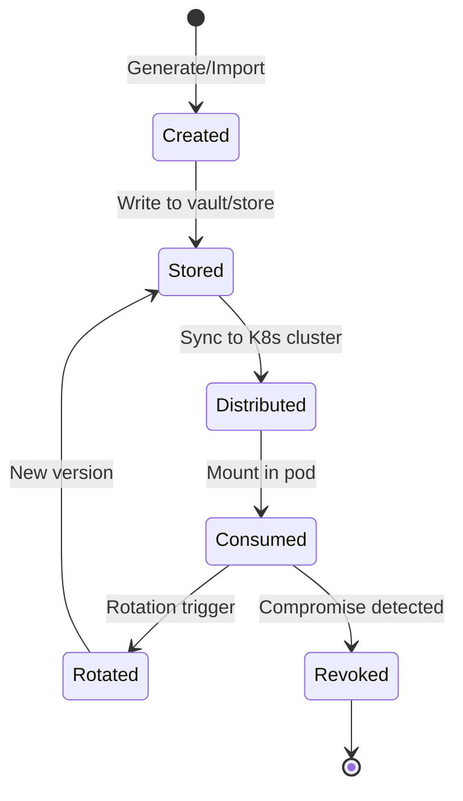
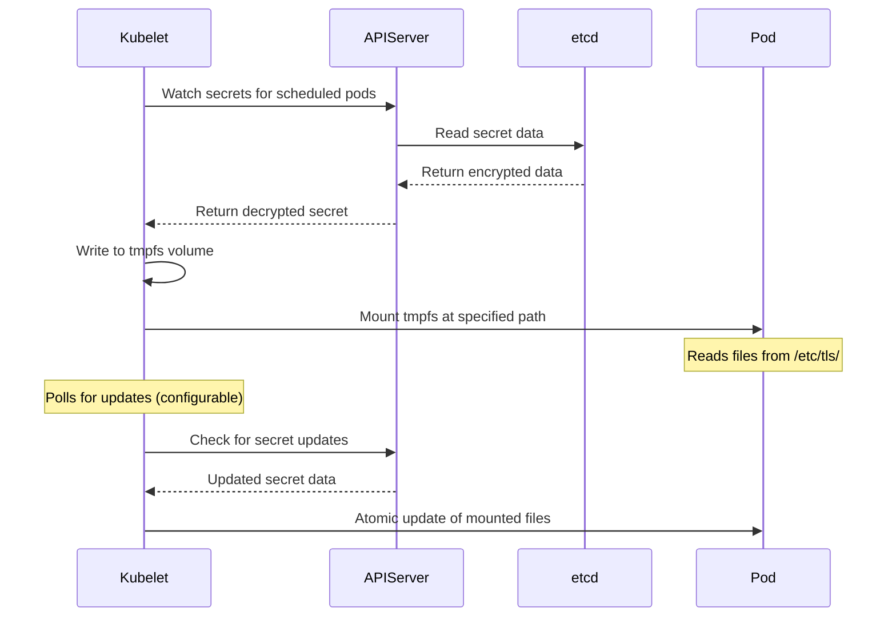
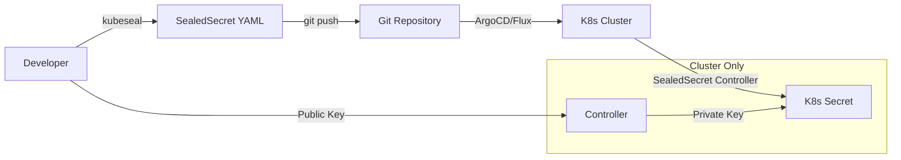
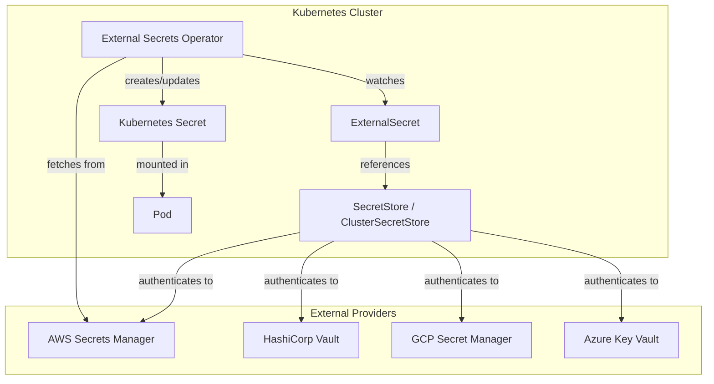
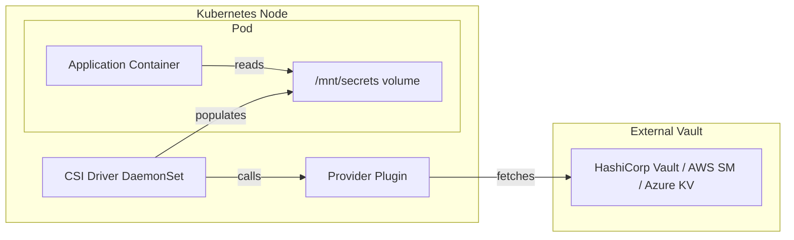
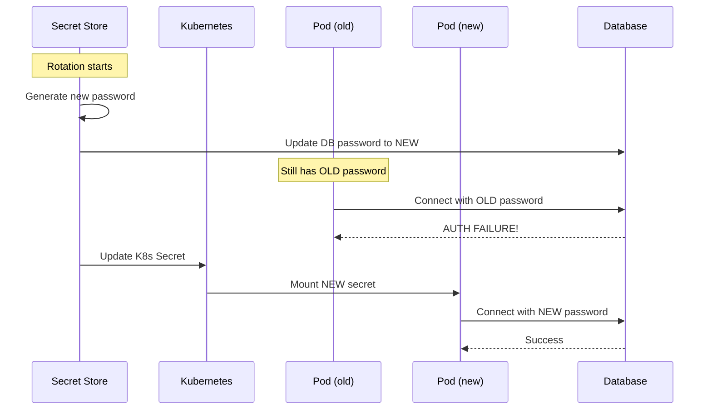
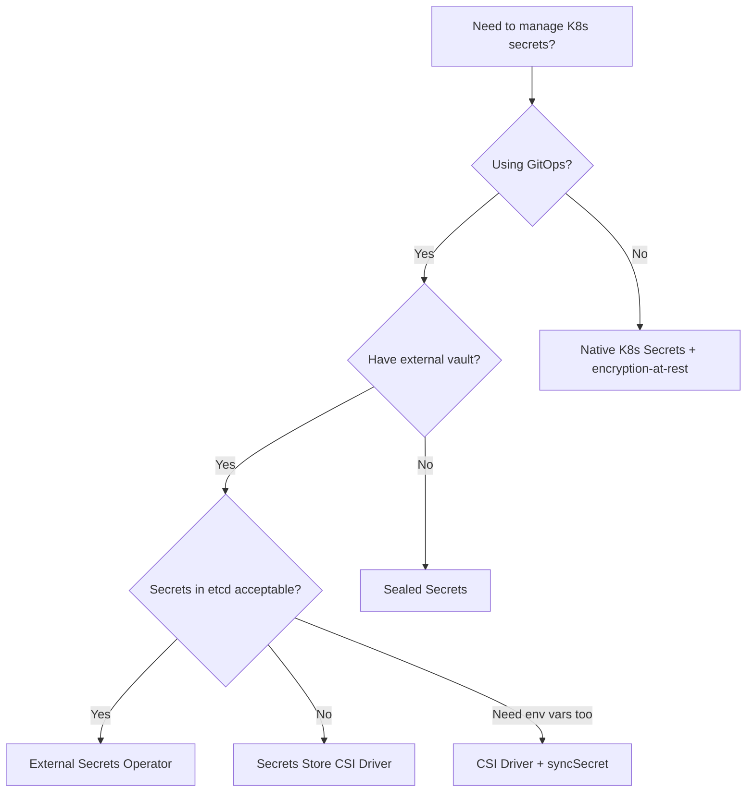
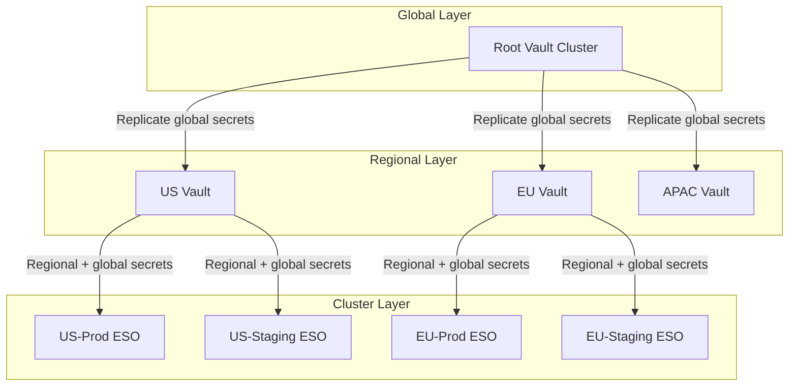

# Kubernetes Secrets Management

## Why It Exists

Kubernetes Secrets were introduced in v1.0 to solve a fundamental problem: applications need credentials, API keys, TLS certificates, and other sensitive data at runtime, but baking them into container images or passing them via environment variables in pod specs creates a security nightmare. Every `kubectl get secret -o yaml` reveals base64-encoded (not encrypted) data, and anyone with RBAC read access to secrets in a namespace can exfiltrate every credential.

The core challenges:
- **Secrets in etcd are base64-encoded by default, not encrypted** — anyone with etcd access reads everything
- **GitOps workflows require secrets in version control** — but plaintext secrets in Git is a critical vulnerability
- **Secret rotation** — changing a database password shouldn't require redeploying every consuming pod
- **Audit trail** — who accessed which secret, when, and from where
- **Multi-cluster consistency** — the same secret must exist across staging, production, and DR clusters

The ecosystem responded with three major patterns: **Sealed Secrets** (encrypt-at-rest in Git), **External Secrets Operator** (sync from external vaults), and **Secrets Store CSI Driver** (mount secrets as volumes from external providers). Each solves different parts of the problem.

## First Principles

### The Secret Lifecycle

Every secret goes through a lifecycle that must be managed:



### Threat Model for Kubernetes Secrets

Understanding what you are defending against is essential:

| Threat | Native K8s Secrets | Sealed Secrets | ESO | CSI Driver |
|--------|-------------------|----------------|-----|------------|
| etcd compromise | Vulnerable (unless encryption-at-rest) | Same (after unsealing) | Same (after sync) | Not stored in etcd |
| Git repo leak | Critical (if stored in Git) | Safe (encrypted) | Safe (only references) | Safe (only references) |
| RBAC escalation | Vulnerable | Vulnerable | Vulnerable | Reduced surface |
| Node compromise | Vulnerable (tmpfs) | Vulnerable (tmpfs) | Vulnerable (tmpfs) | Vulnerable (tmpfs) |
| Supply chain attack | N/A | Controller compromise | Operator compromise | Driver compromise |
| Secret sprawl | High | Medium | Low | Low |

### Encryption at Rest in etcd

Before any external tooling, you must enable encryption at rest in etcd. Without it, anyone who gets a backup of etcd has every secret in plaintext.

```yaml
# /etc/kubernetes/encryption-config.yaml
apiVersion: apiserver.config.k8s.io/v1
kind: EncryptionConfiguration
resources:
  - resources:
      - secrets
    providers:
      - aescbc:
          keys:
            - name: key1
              secret: <base64-encoded-32-byte-key>
      - identity: {} # fallback to read unencrypted secrets
```

The kube-apiserver must be configured with:

```bash
--encryption-provider-config=/etc/kubernetes/encryption-config.yaml
```

::: warning
Encryption at rest only protects against direct etcd access. It does NOT protect against API server access — anyone with `get secrets` RBAC permission still reads secrets in cleartext via the API.
:::

## Core Mechanics

### Native Kubernetes Secrets

Native secrets are stored in etcd and projected into pods via environment variables or volume mounts.

```yaml
apiVersion: v1
kind: Secret
metadata:
  name: db-credentials
  namespace: production
type: Opaque
data:
  username: cG9zdGdyZXM=     # base64("postgres")
  password: czNjcjN0UEBzcw== # base64("s3cr3tP@ss")
---
apiVersion: v1
kind: Pod
metadata:
  name: app
spec:
  containers:
    - name: app
      image: myapp:1.0
      env:
        - name: DB_USERNAME
          valueFrom:
            secretKeyRef:
              name: db-credentials
              key: username
        - name: DB_PASSWORD
          valueFrom:
            secretKeyRef:
              name: db-credentials
              key: password
      volumeMounts:
        - name: tls-certs
          mountPath: /etc/tls
          readOnly: true
  volumes:
    - name: tls-certs
      secret:
        secretName: tls-certificate
        defaultMode: 0400
```

**How volume-mounted secrets work internally:**



::: tip
Volume-mounted secrets are automatically updated by the kubelet (default sync period: 60 seconds + cache propagation delay). Environment variable secrets are NOT updated — the pod must restart.
:::

### Sealed Secrets (Bitnami)

Sealed Secrets solves the "secrets in Git" problem by encrypting secrets with a cluster-specific public key. Only the Sealed Secrets controller running in the cluster has the private key to decrypt them.



**Installation:**

```bash
# Install the controller
helm repo add sealed-secrets https://bitnami-labs.github.io/sealed-secrets
helm install sealed-secrets sealed-secrets/sealed-secrets \
  --namespace kube-system \
  --set fullnameOverride=sealed-secrets-controller

# Install kubeseal CLI
# macOS
brew install kubeseal

# Linux
KUBESEAL_VERSION='0.27.3'
wget "https://github.com/bitnami-labs/sealed-secrets/releases/download/v${KUBESEAL_VERSION}/kubeseal-${KUBESEAL_VERSION}-linux-amd64.tar.gz"
tar -xvzf kubeseal-${KUBESEAL_VERSION}-linux-amd64.tar.gz kubeseal
sudo install -m 755 kubeseal /usr/local/bin/kubeseal
```

**Creating a SealedSecret:**

```bash
# Create a regular secret manifest (don't apply it!)
kubectl create secret generic db-credentials \
  --namespace=production \
  --from-literal=username=postgres \
  --from-literal=password='s3cr3tP@ss' \
  --dry-run=client -o yaml > secret.yaml

# Seal it with the cluster's public key
kubeseal --format yaml < secret.yaml > sealed-secret.yaml

# Now safe to commit sealed-secret.yaml to Git
rm secret.yaml  # DELETE the plaintext!
```

The resulting SealedSecret:

```yaml
apiVersion: bitnami.com/v1alpha1
kind: SealedSecret
metadata:
  name: db-credentials
  namespace: production
spec:
  encryptedData:
    username: AgBy3i4OJSWK+PiTySYZZA9rO43cGDEq...
    password: AgCtr87IAAAL+Pml/gXHBz2kSJKNkKhKN...
  template:
    metadata:
      name: db-credentials
      namespace: production
    type: Opaque
```

**Scoping modes** control where the sealed secret can be unsealed:

| Scope | Flag | Behavior |
|-------|------|----------|
| `strict` (default) | `--scope strict` | Bound to exact name AND namespace |
| `namespace-wide` | `--scope namespace-wide` | Can be renamed within the namespace |
| `cluster-wide` | `--scope cluster-wide` | Can be used in any namespace with any name |

::: danger
Always use `strict` scope in production. `cluster-wide` scope means if someone copies the SealedSecret to another namespace, it still decrypts — defeating namespace isolation.
:::

**Key rotation and backup:**

```bash
# Backup the sealing key (CRITICAL — loss means all SealedSecrets become undecryptable)
kubectl get secret -n kube-system \
  -l sealedsecrets.bitnami.com/sealed-secrets-key \
  -o yaml > sealed-secrets-master-key.yaml

# Store this backup in a SEPARATE secure location (cloud KMS, hardware vault)

# The controller rotates keys every 30 days by default
# Old keys are kept so existing SealedSecrets still decrypt
# To force re-encryption with new key:
kubeseal --re-encrypt < sealed-secret.yaml > sealed-secret-new.yaml
```

### External Secrets Operator (ESO)

ESO syncs secrets from external secret management systems (AWS Secrets Manager, HashiCorp Vault, GCP Secret Manager, Azure Key Vault) into Kubernetes Secrets.



**Installation:**

```bash
helm repo add external-secrets https://charts.external-secrets.io
helm install external-secrets external-secrets/external-secrets \
  --namespace external-secrets \
  --create-namespace \
  --set installCRDs=true
```

**AWS Secrets Manager example:**

```yaml
# 1. Create a SecretStore that authenticates to AWS
apiVersion: external-secrets.io/v1beta1
kind: ClusterSecretStore
metadata:
  name: aws-secrets-manager
spec:
  provider:
    aws:
      service: SecretsManager
      region: us-east-1
      auth:
        jwt:
          serviceAccountRef:
            name: external-secrets-sa
            namespace: external-secrets
---
# 2. Create an ExternalSecret that references a secret in AWS
apiVersion: external-secrets.io/v1beta1
kind: ExternalSecret
metadata:
  name: db-credentials
  namespace: production
spec:
  refreshInterval: 1h  # How often to sync
  secretStoreRef:
    name: aws-secrets-manager
    kind: ClusterSecretStore
  target:
    name: db-credentials  # The K8s Secret that will be created
    creationPolicy: Owner
    deletionPolicy: Retain
  data:
    - secretKey: username
      remoteRef:
        key: production/database
        property: username
    - secretKey: password
      remoteRef:
        key: production/database
        property: password
---
# 3. IRSA ServiceAccount for AWS authentication
apiVersion: v1
kind: ServiceAccount
metadata:
  name: external-secrets-sa
  namespace: external-secrets
  annotations:
    eks.amazonaws.com/role-arn: arn:aws:iam::123456789012:role/external-secrets-role
```

**HashiCorp Vault example with AppRole auth:**

```yaml
apiVersion: external-secrets.io/v1beta1
kind: SecretStore
metadata:
  name: vault-backend
  namespace: production
spec:
  provider:
    vault:
      server: "https://vault.example.com"
      path: "secret"
      version: "v2"
      auth:
        appRole:
          path: "approle"
          roleId: "db02de05-fa39-4855-059b-67221c5c2f63"
          secretRef:
            name: vault-approle-secret
            key: secretId
---
apiVersion: external-secrets.io/v1beta1
kind: ExternalSecret
metadata:
  name: app-secrets
  namespace: production
spec:
  refreshInterval: 15m
  secretStoreRef:
    name: vault-backend
    kind: SecretStore
  target:
    name: app-secrets
  dataFrom:
    - extract:
        key: secret/data/production/app
```

**ExternalSecret status monitoring:**

```typescript
// TypeScript controller for monitoring ESO sync status
import { KubeConfig, CustomObjectsApi } from '@kubernetes/client-node';

interface ExternalSecretStatus {
  conditions: Array<{
    type: string;
    status: string;
    lastTransitionTime: string;
    reason: string;
    message: string;
  }>;
  refreshTime: string;
  syncedResourceVersion: string;
}

async function checkExternalSecretHealth(
  namespace: string,
): Promise<Map<string, boolean>> {
  const kc = new KubeConfig();
  kc.loadFromDefault();
  const customApi = kc.makeApiClient(CustomObjectsApi);

  const result = new Map<string, boolean>();

  const response = await customApi.listNamespacedCustomObject(
    'external-secrets.io',
    'v1beta1',
    namespace,
    'externalsecrets',
  );

  const items = (response.body as any).items;

  for (const item of items) {
    const name = item.metadata.name;
    const status: ExternalSecretStatus = item.status;

    const readyCondition = status?.conditions?.find(
      (c) => c.type === 'Ready',
    );

    const isHealthy = readyCondition?.status === 'True';
    result.set(name, isHealthy);

    if (!isHealthy) {
      console.error(
        `ExternalSecret ${namespace}/${name} is unhealthy: ${readyCondition?.message ?? 'No status'}`,
      );
    }

    // Check if refresh is stale (more than 2x the refresh interval)
    if (status?.refreshTime) {
      const lastRefresh = new Date(status.refreshTime);
      const staleThreshold = Date.now() - 2 * 60 * 60 * 1000; // 2 hours
      if (lastRefresh.getTime() < staleThreshold) {
        console.warn(
          `ExternalSecret ${namespace}/${name} refresh is stale: last refresh at ${status.refreshTime}`,
        );
      }
    }
  }

  return result;
}
```

### Secrets Store CSI Driver

The Secrets Store CSI Driver mounts secrets directly from external vaults as volumes — without creating Kubernetes Secret objects. This reduces the attack surface since secrets never exist in etcd.



**Installation:**

```bash
# Install the CSI driver
helm repo add secrets-store-csi-driver https://kubernetes-sigs.github.io/secrets-store-csi-driver/charts
helm install csi-secrets-store secrets-store-csi-driver/secrets-store-csi-driver \
  --namespace kube-system \
  --set syncSecret.enabled=true \
  --set enableSecretRotation=true \
  --set rotationPollInterval=2m

# Install the AWS provider (or Vault/Azure provider)
kubectl apply -f https://raw.githubusercontent.com/aws/secrets-store-csi-driver-provider-aws/main/deployment/aws-provider-installer.yaml
```

**SecretProviderClass and Pod configuration:**

```yaml
apiVersion: secrets-store.csi.x-k8s.io/v1
kind: SecretProviderClass
metadata:
  name: aws-secrets
  namespace: production
spec:
  provider: aws
  parameters:
    objects: |
      - objectName: "production/database"
        objectType: "secretsmanager"
        jmesPath:
          - path: username
            objectAlias: db-username
          - path: password
            objectAlias: db-password
      - objectName: "production/api-keys"
        objectType: "secretsmanager"
  # Optionally sync to K8s Secret (for env vars)
  secretObjects:
    - secretName: db-credentials-synced
      type: Opaque
      data:
        - objectName: db-username
          key: username
        - objectName: db-password
          key: password
---
apiVersion: v1
kind: Pod
metadata:
  name: app
  namespace: production
spec:
  serviceAccountName: app-sa  # Must have IRSA configured
  containers:
    - name: app
      image: myapp:1.0
      volumeMounts:
        - name: secrets-volume
          mountPath: /mnt/secrets
          readOnly: true
      env:
        - name: DB_USERNAME
          valueFrom:
            secretKeyRef:
              name: db-credentials-synced
              key: username
  volumes:
    - name: secrets-volume
      csi:
        driver: secrets-store.csi.k8s.io
        readOnly: true
        volumeAttributes:
          secretProviderClass: aws-secrets
```

## Implementation — Production Secret Rotation

### Automated Rotation Controller

```typescript
import { KubeConfig, CoreV1Api, AppsV1Api } from '@kubernetes/client-node';
import {
  SecretsManagerClient,
  GetSecretValueCommand,
  RotateSecretCommand,
} from '@aws-sdk/client-secrets-manager';

interface RotationConfig {
  secretName: string;
  namespace: string;
  awsSecretArn: string;
  rotationIntervalDays: number;
  dependentDeployments: string[];
}

class SecretRotationController {
  private k8sCoreApi: CoreV1Api;
  private k8sAppsApi: AppsV1Api;
  private smClient: SecretsManagerClient;

  constructor(region: string) {
    const kc = new KubeConfig();
    kc.loadFromDefault();
    this.k8sCoreApi = kc.makeApiClient(CoreV1Api);
    this.k8sAppsApi = kc.makeApiClient(AppsV1Api);
    this.smClient = new SecretsManagerClient({ region });
  }

  async rotateSecret(config: RotationConfig): Promise<void> {
    console.log(`Starting rotation for ${config.secretName}`);

    // Step 1: Trigger rotation in AWS Secrets Manager
    await this.smClient.send(
      new RotateSecretCommand({
        SecretId: config.awsSecretArn,
      }),
    );

    // Step 2: Wait for rotation to complete
    await this.waitForRotationComplete(config.awsSecretArn);

    // Step 3: Fetch the new secret value
    const newSecret = await this.smClient.send(
      new GetSecretValueCommand({
        SecretId: config.awsSecretArn,
        VersionStage: 'AWSCURRENT',
      }),
    );

    if (!newSecret.SecretString) {
      throw new Error('Rotated secret has no string value');
    }

    const secretData = JSON.parse(newSecret.SecretString);

    // Step 4: Update the Kubernetes secret
    const encodedData: Record<string, string> = {};
    for (const [key, value] of Object.entries(secretData)) {
      encodedData[key] = Buffer.from(String(value)).toString('base64');
    }

    await this.k8sCoreApi.patchNamespacedSecret(
      config.secretName,
      config.namespace,
      {
        data: encodedData,
        metadata: {
          annotations: {
            'secrets.example.com/last-rotated': new Date().toISOString(),
            'secrets.example.com/rotation-version':
              newSecret.VersionId ?? 'unknown',
          },
        },
      },
      undefined,
      undefined,
      undefined,
      undefined,
      undefined,
      {
        headers: { 'Content-Type': 'application/merge-patch+json' },
      },
    );

    // Step 5: Rolling restart dependent deployments
    for (const deployment of config.dependentDeployments) {
      await this.rollingRestart(deployment, config.namespace);
    }

    console.log(`Rotation complete for ${config.secretName}`);
  }

  private async rollingRestart(
    deploymentName: string,
    namespace: string,
  ): Promise<void> {
    const patch = {
      spec: {
        template: {
          metadata: {
            annotations: {
              'secrets.example.com/restart-trigger': new Date().toISOString(),
            },
          },
        },
      },
    };

    await this.k8sAppsApi.patchNamespacedDeployment(
      deploymentName,
      namespace,
      patch,
      undefined,
      undefined,
      undefined,
      undefined,
      undefined,
      {
        headers: { 'Content-Type': 'application/strategic-merge-patch+json' },
      },
    );

    console.log(`Triggered rolling restart for ${namespace}/${deploymentName}`);
  }

  private async waitForRotationComplete(
    secretArn: string,
    maxAttempts = 30,
  ): Promise<void> {
    for (let i = 0; i < maxAttempts; i++) {
      const secret = await this.smClient.send(
        new GetSecretValueCommand({
          SecretId: secretArn,
          VersionStage: 'AWSCURRENT',
        }),
      );

      if (secret.VersionId) {
        return;
      }

      await new Promise((resolve) => setTimeout(resolve, 10_000));
    }

    throw new Error(
      `Secret rotation did not complete after ${maxAttempts} attempts`,
    );
  }
}

// Usage
async function main() {
  const controller = new SecretRotationController('us-east-1');

  await controller.rotateSecret({
    secretName: 'db-credentials',
    namespace: 'production',
    awsSecretArn:
      'arn:aws:secretsmanager:us-east-1:123456789012:secret:production/database',
    rotationIntervalDays: 30,
    dependentDeployments: ['api-server', 'worker'],
  });
}

main().catch(console.error);
```

## Edge Cases and Failure Modes

### 1. Sealed Secrets Key Loss

If the sealed-secrets controller private key is lost (node failure, cluster rebuild), all existing SealedSecrets become permanently undecryptable.

**Prevention:**
```bash
# Backup IMMEDIATELY after installation
kubectl get secret -n kube-system -l sealedsecrets.bitnami.com/sealed-secrets-key -o yaml > master-key-backup.yaml

# Encrypt this backup with GPG or cloud KMS before storing
gpg --encrypt --recipient ops-team@company.com master-key-backup.yaml

# Restore from backup
kubectl apply -f master-key-backup.yaml
kubectl delete pod -n kube-system -l app.kubernetes.io/name=sealed-secrets
```

### 2. ESO Sync Failures

When the external provider is unavailable, ExternalSecrets cannot sync. If the K8s Secret already exists, it continues to work — but it may contain stale data.

```yaml
# Add alerting for ESO sync failures
apiVersion: monitoring.coreos.com/v1
kind: PrometheusRule
metadata:
  name: external-secrets-alerts
spec:
  groups:
    - name: external-secrets
      rules:
        - alert: ExternalSecretSyncFailed
          expr: |
            externalsecret_status_condition{condition="Ready", status="False"} == 1
          for: 15m
          labels:
            severity: critical
          annotations:
            summary: "ExternalSecret sync failed for longer than 15 minutes"
            description: "ExternalSecret in namespace {​{ $labels.namespace }} named {​{ $labels.name }} has been failing to sync."
```

### 3. Secret Race Conditions During Rotation

When rotating secrets, there is a window where some pods have the old secret and new pods have the new one. If both old and new credentials are not simultaneously valid, you will get authentication failures.



**Solution — Dual-password rotation:**

```typescript
async function dualPasswordRotation(
  dbClient: DatabaseClient,
  newPassword: string,
): Promise<void> {
  // Step 1: Add new password as secondary (both work)
  await dbClient.query(
    `ALTER USER app_user SET PASSWORD = '${newPassword}'`,
  );

  // Step 2: Update K8s secrets
  await updateK8sSecret('db-credentials', { password: newPassword });

  // Step 3: Wait for all pods to pick up new secret
  await waitForAllPodsRestarted('production', 'app');

  // Step 4: Verify all pods use new password (health checks)
  await verifyAllPodsHealthy('production', 'app');

  // Step 5: Old password is now unused — safe
  console.log('Dual-password rotation complete');
}
```

### 4. CSI Driver Pod Startup Dependency

If the CSI driver pod on a node is not ready, any pod scheduled to that node that uses a SecretProviderClass will fail to start with a volume mount error.

```yaml
# Ensure CSI driver pods have high priority
apiVersion: scheduling.k8s.io/v1
kind: PriorityClass
metadata:
  name: secrets-store-csi-driver
value: 1000000
globalDefault: false
description: "Priority class for secrets store CSI driver"
---
# In the CSI driver Helm values
priorityClassName: secrets-store-csi-driver
```

### 5. Secret Size Limits

Kubernetes Secrets have a hard limit of **1 MiB** per secret object. This includes the base64-encoded data plus metadata.

```typescript
function validateSecretSize(data: Record<string, string>): void {
  let totalSize = 0;
  for (const [key, value] of Object.entries(data)) {
    // Base64 encoding increases size by ~33%
    const encodedSize = Math.ceil((Buffer.from(value).length * 4) / 3);
    totalSize += key.length + encodedSize;
  }

  const MAX_SECRET_SIZE = 1_048_576; // 1 MiB
  if (totalSize > MAX_SECRET_SIZE * 0.9) {
    throw new Error(
      `Secret size ${totalSize} bytes is approaching the 1 MiB limit. ` +
        `Split into multiple secrets.`,
    );
  }
}
```

## Performance Characteristics

### Secret Access Latency

| Method | First Access | Subsequent Access | Rotation Propagation |
|--------|-------------|-------------------|---------------------|
| Env var | 0 (in memory) | 0 | Requires pod restart |
| Volume mount | ~1ms (tmpfs read) | ~1ms | 60-120s (kubelet sync) |
| CSI Driver | 100-500ms (first mount) | ~1ms (cached) | 2-5min (rotation poll) |
| ESO sync | N/A | Same as K8s Secret | `refreshInterval` setting |
| Direct API call to vault | 5-50ms (network) | 5-50ms | Immediate (no cache) |

### etcd Storage Impact

$$
S_{etcd} = N_{secrets} \times (M_{overhead} + \sum_{i=1}^{K} \lceil \frac{4 \times |V_i|}{3} \rceil + |K_i|)
$$

Where:
- $N_{secrets}$ = number of secrets
- $M_{overhead}$ = metadata overhead (~500 bytes per secret)
- $K$ = number of keys per secret
- $V_i$ = raw value size for key $i$
- $K_i$ = key name length
- The $\frac{4}{3}$ factor accounts for base64 encoding

For a typical cluster with 500 secrets averaging 2 KB each:

$$
S_{total} = 500 \times (500 + 2000) \approx 1.25\text{ MB in etcd}
$$

This is negligible for etcd (recommended max database size: 8 GB), but watch out for secrets containing large certificates or binary data.

### Sealed Secrets Controller Performance

The controller processes SealedSecrets sequentially. Benchmarks on a 4-vCPU node:

| Operation | Latency | Throughput |
|-----------|---------|------------|
| Seal (client-side) | 5-10ms | ~100/s per client |
| Unseal (controller) | 10-50ms | ~50/s |
| Key rotation | 200-500ms | N/A |
| Bulk re-encryption | Linear in count | ~20/s |

### ESO Sync Performance

ESO batches requests to external providers. Key metrics:

| Provider | API Latency | Rate Limit | ESO Batch Size |
|----------|-------------|------------|----------------|
| AWS Secrets Manager | 20-100ms | 5,000 req/s | 20 |
| HashiCorp Vault | 5-50ms | Unlimited (self-hosted) | 50 |
| GCP Secret Manager | 20-100ms | 10,000 req/s | 20 |
| Azure Key Vault | 20-100ms | 2,000 req/10s | 20 |

## Mathematical Foundations

### Information-Theoretic Security of Sealed Secrets

Sealed Secrets uses hybrid encryption: RSA-OAEP (4096-bit) for the asymmetric component and AES-256-GCM for symmetric encryption.

The security level in bits:

$$
\text{Security}_{RSA-4096} \approx 150 \text{ bits}
$$

$$
\text{Security}_{AES-256} = 256 \text{ bits}
$$

$$
\text{Effective Security} = \min(150, 256) = 150 \text{ bits}
$$

The probability of brute-forcing the RSA key:

$$
P_{brute} = \frac{1}{2^{150}} \approx 7.0 \times 10^{-46}
$$

### Secret Entropy Requirements

For generated secrets (passwords, tokens), entropy should meet:

$$
H(S) = \log_2(|A|^L) = L \times \log_2(|A|)
$$

Where $|A|$ is the alphabet size and $L$ is the length.

| Type | Alphabet Size | Min Length | Entropy (bits) |
|------|--------------|------------|----------------|
| Alphanumeric | 62 | 22 | 131 |
| Base64 | 64 | 22 | 132 |
| Hex | 16 | 32 | 128 |
| UUID v4 | N/A | N/A | 122 |
| Printable ASCII | 95 | 20 | 131 |

::: tip
For API keys and tokens, always use at least 32 bytes of cryptographically random data (256 bits of entropy). Use `openssl rand -base64 32` or `crypto.randomBytes(32)` in Node.js.
:::

## Real-World War Stories

::: info War Story — The Sealed Secrets Disaster
A fintech company migrated from EKS to a self-managed cluster. During migration, they forgot to back up the sealed-secrets controller key. After decommissioning the old cluster, they discovered that 47 SealedSecrets in their Git repository were now permanently undecryptable. Recovery required:
1. Manually recreating every secret from original sources (password managers, cloud consoles)
2. Re-sealing all 47 secrets with the new cluster's key
3. Updating and deploying all services

**Total downtime: 6 hours.** They now have automated key backup to S3 with versioning, stored in a separate AWS account.
:::

::: info War Story — ESO Rate Limiting at Scale
A large SaaS company with 200+ microservices used ESO with AWS Secrets Manager. Each ExternalSecret had a 5-minute refresh interval. With 1,500 secrets across 3 clusters:

$$
\text{Requests/minute} = \frac{1500 \times 3}{5} = 900 \text{ req/min} = 15 \text{ req/s}
$$

This seemed fine against the 5,000 req/s limit, but they also had Lambda functions and other services hitting the same account. During a deployment wave where all services restarted simultaneously, the thundering herd pushed them to 8,000+ req/s, and AWS throttled them. Secrets failed to sync for 12 minutes.

**Fix:** They implemented refresh interval jitter, staggered deployments, and moved to a dedicated AWS account for secrets.
:::

::: info War Story — The Volume Mount That Leaked Memory
A team using the CSI driver noticed nodes running out of memory over weeks. Investigation revealed that the CSI driver's rotation feature was creating a new tmpfs mount for each rotation cycle without cleaning up old ones. Each tmpfs mount consumed a small amount of kernel memory that accumulated. The driver version had a bug where the cleanup goroutine deadlocked under certain conditions.

**Fix:** Upgraded the CSI driver, added node-level memory monitoring with alerts at 80% usage, and implemented a CronJob that verified tmpfs mount counts.
:::

## Decision Framework

### When to Use Each Approach



### Comparison Matrix

| Feature | Native | Sealed Secrets | ESO | CSI Driver |
|---------|--------|---------------|-----|------------|
| GitOps friendly | No | Yes | Yes | Yes |
| External vault required | No | No | Yes | Yes |
| Secrets in etcd | Yes | Yes | Yes | Optional |
| Auto-rotation | No | No | Yes | Yes |
| Multi-cluster | Manual | Per-cluster keys | Shared vault | Shared vault |
| Setup complexity | Low | Low | Medium | High |
| Operational overhead | Low | Low | Medium | High |
| Env var support | Native | Native | Native | Via syncSecret |
| Audit trail | K8s audit logs | K8s audit logs | Vault audit | Vault audit |
| Cost | Free | Free | Free + vault cost | Free + vault cost |

### Recommendation by Team Size

| Team Size | Recommended Stack |
|-----------|------------------|
| 1-5 engineers | Sealed Secrets + encryption-at-rest |
| 5-20 engineers | ESO + AWS Secrets Manager/Vault |
| 20-100 engineers | ESO + Vault (self-hosted) + CSI for sensitive workloads |
| 100+ engineers | CSI Driver + Vault + custom operator for rotation |

## Advanced Topics

### Zero-Trust Secret Distribution with SPIFFE

SPIFFE (Secure Production Identity Framework For Everyone) provides cryptographic identities to workloads, enabling mutual TLS without managing certificates as secrets.

```yaml
# SPIRE agent configuration for K8s
apiVersion: spire.spiffe.io/v1alpha1
kind: ClusterSPIFFEID
metadata:
  name: app-identity
spec:
  spiffeIDTemplate: "spiffe://example.org/ns/{​{ .PodMeta.Namespace }}/sa/{​{ .PodSpec.ServiceAccountName }}"
  podSelector:
    matchLabels:
      spiffe.io/spire-managed-identity: "true"
  namespaceSelector:
    matchLabels:
      spiffe.io/enabled: "true"
```

### Hardware Security Module (HSM) Integration

For the highest security requirements (PCI-DSS, FIPS 140-2 Level 3), secrets must be managed by HSMs:

```yaml
# Vault configured with AWS CloudHSM
apiVersion: external-secrets.io/v1beta1
kind: ClusterSecretStore
metadata:
  name: vault-hsm
spec:
  provider:
    vault:
      server: "https://vault.example.com"
      path: "transit"  # Transit engine backed by HSM
      version: "v2"
      auth:
        kubernetes:
          mountPath: "kubernetes"
          role: "app-role"
          serviceAccountRef:
            name: vault-auth-sa
```

### Policy-as-Code for Secrets

Use OPA/Gatekeeper to enforce secret management policies:

```yaml
apiVersion: templates.gatekeeper.sh/v1
kind: ConstraintTemplate
metadata:
  name: k8ssecretsource
spec:
  crd:
    spec:
      names:
        kind: K8sSecretSource
  targets:
    - target: admission.k8s.gatekeeper.sh
      rego: |
        package k8ssecretsource

        violation[{"msg": msg}] {
          input.review.kind.kind == "Secret"
          not input.review.object.metadata.labels["app.kubernetes.io/managed-by"]
          msg := "Secrets must be managed by sealed-secrets or external-secrets. Direct Secret creation is not allowed."
        }

        violation[{"msg": msg}] {
          input.review.kind.kind == "Pod"
          container := input.review.object.spec.containers[_]
          env := container.env[_]
          env.valueFrom.secretKeyRef
          not container.volumeMounts[_].mountPath == "/mnt/secrets"
          msg := sprintf("Container %s uses secretKeyRef env vars. Use volume-mounted secrets instead for automatic rotation.", [container.name])
        }
---
apiVersion: constraints.gatekeeper.sh/v1beta1
kind: K8sSecretSource
metadata:
  name: require-managed-secrets
spec:
  match:
    kinds:
      - apiGroups: [""]
        kinds: ["Secret"]
    namespaces: ["production"]
```

### Secret Mesh Architecture

For large organizations, a secret mesh pattern distributes secrets hierarchically:



This architecture ensures:
- **Blast radius containment** — a compromised regional Vault only exposes that region's secrets
- **Low latency** — secrets are fetched from the nearest Vault
- **Compliance** — EU secrets never leave EU infrastructure (GDPR)
- **Resilience** — regional Vault failure only affects that region

### Quantum-Resistant Considerations

Current RSA-4096 and AES-256 are considered quantum-resistant for symmetric operations but vulnerable for asymmetric:

$$
\text{Grover's speedup (symmetric)}: 2^{256} \rightarrow 2^{128} \text{ (still secure)}
$$

$$
\text{Shor's algorithm (RSA-4096)}: \text{polynomial time (broken)}
$$

When quantum computers reach sufficient qubit counts, Sealed Secrets' RSA-based encryption will be broken. The mitigation path is to transition to lattice-based cryptography (ML-KEM, formerly CRYSTALS-Kyber) when the sealed-secrets project adopts post-quantum algorithms. Until then, the practical risk remains low but should be on the long-term roadmap for highly sensitive workloads.

---

*Next: [Helm Charts](./helm-charts.md) — Chart structure, values management, hooks, and Helmfile orchestration.*
