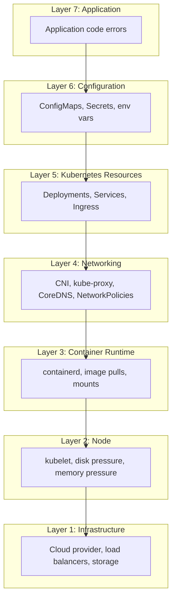
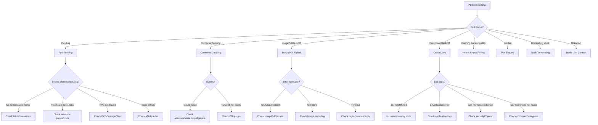

# Kubernetes Troubleshooting

## Why It Exists

Kubernetes is a distributed system with dozens of interacting components — kubelet, kube-proxy, CoreDNS, CNI plugins, CSI drivers, ingress controllers, and more. When something goes wrong, the failure often manifests far from its root cause. A pod stuck in `Pending` might be caused by a node taint, a resource quota, a PVC binding failure, or a scheduling affinity that cannot be satisfied. A `CrashLoopBackOff` might be a missing ConfigMap, a readiness probe misconfiguration, an OOM kill, or an application bug.

Without a systematic approach, engineers spend hours guessing. This page provides a structured decision tree for every common failure mode, the exact commands to diagnose each, and the fixes that resolve them.

## First Principles

### The Debugging Mental Model

Every Kubernetes problem falls into one of these layers:



**Debug top-down**: start with the application and work down. Most problems are in the top 3 layers.

### The Universal Debugging Sequence

For any pod issue, always run these commands first:

```bash
# 1. What is the pod's current status?
kubectl get pod <name> -n <namespace> -o wide

# 2. What events have occurred?
kubectl describe pod <name> -n <namespace>

# 3. What are the logs saying?
kubectl logs <name> -n <namespace> --all-containers

# 4. What was the previous container's output (if restarting)?
kubectl logs <name> -n <namespace> --previous

# 5. What is the pod's YAML state?
kubectl get pod <name> -n <namespace> -o yaml
```

## Core Mechanics — Failure Mode Reference

### Pod Status Decision Tree



### ImagePullBackOff

**Root causes and fixes:**

```bash
# Check the exact error
kubectl describe pod <name> -n <namespace> | grep -A 5 "Events"

# Common errors:
# 1. "401 Unauthorized" — missing or wrong imagePullSecret
# 2. "not found" — image name or tag is wrong
# 3. "manifest unknown" — tag exists but platform mismatch (amd64 vs arm64)
# 4. "timeout" — network issue or registry is down
```

**Fix: ImagePullSecret for private registries:**

```bash
# Create the secret
kubectl create secret docker-registry ghcr-credentials \
  --docker-server=ghcr.io \
  --docker-username=<username> \
  --docker-password=<token> \
  -n production

# Verify it works
kubectl run test --image=ghcr.io/company/app:latest \
  --overrides='{"spec":{"imagePullSecrets":[{"name":"ghcr-credentials"}]}}' \
  --rm -it --restart=Never -- echo "Image pull works"
```

**Fix: Attach imagePullSecret to ServiceAccount (applies to all pods):**

```yaml
apiVersion: v1
kind: ServiceAccount
metadata:
  name: default
  namespace: production
imagePullSecrets:
  - name: ghcr-credentials
```

**Fix: Image tag debugging:**

```bash
# Verify the image exists in the registry
# For Docker Hub:
curl -s "https://hub.docker.com/v2/repositories/library/nginx/tags/?name=1.25" | jq '.results[].name'

# For GHCR:
curl -H "Authorization: Bearer $(echo $GITHUB_TOKEN)" \
  "https://ghcr.io/v2/company/app/tags/list" | jq '.tags'

# For ECR:
aws ecr describe-images --repository-name myapp --image-ids imageTag=latest
```

### CrashLoopBackOff

The pod starts, crashes, Kubernetes restarts it, it crashes again, and the backoff time increases exponentially:

$$
t_{backoff}(n) = \min(10 \times 2^n, 300) \text{ seconds}
$$

| Restart Count | Backoff Delay |
|--------------|---------------|
| 0 | 0s (immediate) |
| 1 | 10s |
| 2 | 20s |
| 3 | 40s |
| 4 | 80s |
| 5 | 160s |
| 6+ | 300s (5 min cap) |

**Debugging by exit code:**

```bash
# Get the exit code
kubectl get pod <name> -n <namespace> -o jsonpath='{.status.containerStatuses[0].lastState.terminated.exitCode}'
```

| Exit Code | Signal | Meaning | Action |
|-----------|--------|---------|--------|
| 0 | N/A | Completed successfully (but restarting) | Check `restartPolicy`, should it be `Never`? |
| 1 | N/A | Application error | Check logs: `kubectl logs --previous` |
| 126 | N/A | Permission denied | Check file permissions, securityContext |
| 127 | N/A | Command not found | Check `command`/`args` in pod spec |
| 128+N | Signal N | Killed by signal | See below |
| 137 | SIGKILL (9) | OOM killed or `kill -9` | Check memory limits, see OOM section |
| 139 | SIGSEGV (11) | Segmentation fault | Native code bug, debug with core dumps |
| 143 | SIGTERM (15) | Graceful shutdown failed | Increase `terminationGracePeriodSeconds` |

**OOM Kill debugging:**

```bash
# Check if the container was OOM killed
kubectl describe pod <name> -n <namespace> | grep -i oom

# Check node-level OOM events
kubectl get events -n <namespace> --field-selector reason=OOMKilling

# Check actual memory usage vs limits
kubectl top pod <name> -n <namespace> --containers

# Check the node's memory pressure
kubectl describe node <node-name> | grep -A5 "Conditions"
```

**Fix for OOM kills:**

```yaml
resources:
  requests:
    memory: "512Mi"   # What the scheduler uses for placement
  limits:
    memory: "1Gi"     # OOM kill threshold
    # TIP: Set limit to 1.5-2x the request for bursty workloads
    # TIP: Set limit = request for predictable workloads
```

**Interactive debugging with ephemeral containers:**

```bash
# Attach a debug container to a running pod (K8s 1.25+)
kubectl debug <name> -n <namespace> -it \
  --image=nicolaka/netshoot \
  --target=<container-name>

# Debug a crashed pod by copying it without the problematic command
kubectl debug <name> -n <namespace> -it \
  --copy-to=debug-pod \
  --container=<container-name> \
  -- /bin/sh

# Debug a node
kubectl debug node/<node-name> -it --image=ubuntu
```

### DNS Issues

DNS failures are among the most insidious Kubernetes problems because they manifest as intermittent timeouts that are hard to reproduce.

```bash
# Test DNS resolution from inside a pod
kubectl run dnsutils --image=registry.k8s.io/e2e-test-images/jessie-dnsutils:1.7 \
  --rm -it --restart=Never -- /bin/sh

# Inside the pod:
nslookup kubernetes.default
nslookup myservice.production.svc.cluster.local
nslookup google.com

# Check CoreDNS health
kubectl get pods -n kube-system -l k8s-app=kube-dns
kubectl logs -n kube-system -l k8s-app=kube-dns --tail=50

# Check CoreDNS config
kubectl get configmap coredns -n kube-system -o yaml
```

**Common DNS failures:**

| Symptom | Cause | Fix |
|---------|-------|-----|
| `NXDOMAIN` for service names | Service doesn't exist or wrong namespace | Check `kubectl get svc -A` |
| `SERVFAIL` | CoreDNS pods are not running | Check CoreDNS deployment |
| Intermittent timeouts | CoreDNS overwhelmed or `ndots:5` issues | See ndots optimization below |
| External DNS fails | CoreDNS forward config wrong | Check upstream DNS servers |
| DNS works from some pods | NetworkPolicy blocking UDP/53 | Check NetworkPolicies |

**The ndots problem:**

By default, Kubernetes sets `ndots:5` in `/etc/resolv.conf`. This means any hostname with fewer than 5 dots is treated as a "short name" and appended with search domains before trying the literal name:

```
# /etc/resolv.conf in a pod (namespace: production)
nameserver 10.96.0.10
search production.svc.cluster.local svc.cluster.local cluster.local
options ndots:5
```

When resolving `api.stripe.com` (2 dots, < 5), Kubernetes tries:
1. `api.stripe.com.production.svc.cluster.local` (NXDOMAIN)
2. `api.stripe.com.svc.cluster.local` (NXDOMAIN)
3. `api.stripe.com.cluster.local` (NXDOMAIN)
4. `api.stripe.com.` (success!)

That is **4 DNS queries instead of 1**, and the 3 failures add latency.

**Fix:**

```yaml
# Option 1: Reduce ndots (recommended)
spec:
  dnsConfig:
    options:
      - name: ndots
        value: "2"

# Option 2: Use FQDNs in application code (trailing dot)
# "api.stripe.com." instead of "api.stripe.com"
```

**CoreDNS autoscaling:**

```yaml
# DNS Autoscaler ConfigMap
apiVersion: v1
kind: ConfigMap
metadata:
  name: dns-autoscaler
  namespace: kube-system
data:
  linear: |
    {
      "coresPerReplica": 256,
      "nodesPerReplica": 16,
      "min": 2,
      "max": 10,
      "preventSinglePointFailure": true
    }
```

### Networking Issues

```bash
# Test connectivity between pods
kubectl run curl-test --image=curlimages/curl --rm -it --restart=Never -- \
  curl -v http://myservice.production.svc.cluster.local:8080/health

# Test from specific namespace
kubectl run curl-test -n staging --image=curlimages/curl --rm -it --restart=Never -- \
  curl -v http://myservice.production.svc.cluster.local:8080/health

# Check if endpoints exist for a service
kubectl get endpoints myservice -n production

# Check if kube-proxy is updating iptables/ipvs rules
kubectl logs -n kube-system -l k8s-app=kube-proxy --tail=20

# Test with netshoot (comprehensive network debugging)
kubectl run netshoot --image=nicolaka/netshoot --rm -it --restart=Never -- /bin/bash
# Inside: tcpdump, dig, nmap, iperf3, etc.
```

**Service endpoint debugging:**

```bash
# If endpoints are empty, check label selector
kubectl get svc myservice -n production -o yaml | grep -A5 selector
kubectl get pods -n production -l app=myapp --show-labels

# Common mistake: selector labels don't match pod labels
# Service selector: app=myapp
# Pod labels: app=my-app  (hyphen mismatch!)
```

**NetworkPolicy debugging:**

```bash
# List all NetworkPolicies in a namespace
kubectl get networkpolicy -n production

# Check if a NetworkPolicy is blocking traffic
# Deploy a test pod and try to connect
kubectl run policy-test -n production --image=nicolaka/netshoot --rm -it --restart=Never -- \
  curl -v --connect-timeout 5 http://target-service:8080/health

# If blocked, check the policies
kubectl describe networkpolicy -n production

# Temporarily test without NetworkPolicies (find and save, then delete, then restore)
kubectl get networkpolicy -n production -o yaml > /tmp/policies-backup.yaml
```

### Node Issues

```bash
# Check node conditions
kubectl get nodes -o wide
kubectl describe node <node-name>

# Key conditions to look for:
# Ready = True (normal)
# MemoryPressure = True (node running out of memory)
# DiskPressure = True (node running out of disk)
# PIDPressure = True (too many processes)
# NetworkUnavailable = True (network not configured)

# Check node resource usage
kubectl top node <node-name>

# Check kubelet logs on the node
journalctl -u kubelet --since "30 minutes ago" -n 100

# Check for node taints that prevent scheduling
kubectl get nodes -o custom-columns=NAME:.metadata.name,TAINTS:.spec.taints
```

**Node NotReady debugging:**

```bash
# Check kubelet status
systemctl status kubelet

# Check kubelet logs for errors
journalctl -u kubelet -n 50 --no-pager

# Common causes:
# 1. kubelet can't reach API server — check network/firewall
# 2. Certificate expired — check kubelet certs
# 3. Container runtime down — check containerd/cri-o
# 4. Disk full — check df -h
# 5. Too many pods — check --max-pods setting

# Check container runtime
crictl info
crictl ps -a
```

### Storage Issues

```bash
# Check PVC status
kubectl get pvc -n production

# PVC stuck in Pending
kubectl describe pvc <name> -n production

# Common PVC issues:
# 1. No StorageClass with that name
kubectl get storageclass

# 2. No available PVs (for static provisioning)
kubectl get pv

# 3. Volume already bound to another PVC
kubectl get pv -o custom-columns=NAME:.metadata.name,STATUS:.status.phase,CLAIM:.spec.claimRef.name

# 4. Topology constraints (AZ mismatch)
kubectl describe pvc <name> -n production | grep -i "topology"

# 5. Quota exceeded
kubectl get resourcequota -n production
```

## Implementation — Production Debugging Toolkit

### Automated Health Check Script

```typescript
import {
  KubeConfig,
  CoreV1Api,
  AppsV1Api,
  V1Pod,
  V1Node,
  V1Event,
} from '@kubernetes/client-node';

interface HealthReport {
  timestamp: string;
  namespace: string;
  issues: Issue[];
  summary: {
    total: number;
    critical: number;
    warning: number;
    info: number;
  };
}

interface Issue {
  severity: 'critical' | 'warning' | 'info';
  resource: string;
  message: string;
  recommendation: string;
}

class ClusterHealthChecker {
  private coreApi: CoreV1Api;
  private appsApi: AppsV1Api;

  constructor() {
    const kc = new KubeConfig();
    kc.loadFromDefault();
    this.coreApi = kc.makeApiClient(CoreV1Api);
    this.appsApi = kc.makeApiClient(AppsV1Api);
  }

  async checkNamespace(namespace: string): Promise<HealthReport> {
    const issues: Issue[] = [];

    // Check pods
    const pods = await this.coreApi.listNamespacedPod(namespace);
    for (const pod of pods.body.items) {
      issues.push(...this.checkPod(pod));
    }

    // Check nodes
    const nodes = await this.coreApi.listNode();
    for (const node of nodes.body.items) {
      issues.push(...this.checkNode(node));
    }

    // Check events for warnings
    const events = await this.coreApi.listNamespacedEvent(namespace);
    issues.push(...this.checkEvents(events.body.items));

    // Check resource usage
    issues.push(...(await this.checkResourcePressure(namespace)));

    return {
      timestamp: new Date().toISOString(),
      namespace,
      issues,
      summary: {
        total: issues.length,
        critical: issues.filter((i) => i.severity === 'critical').length,
        warning: issues.filter((i) => i.severity === 'warning').length,
        info: issues.filter((i) => i.severity === 'info').length,
      },
    };
  }

  private checkPod(pod: V1Pod): Issue[] {
    const issues: Issue[] = [];
    const name = `Pod/${pod.metadata?.namespace}/${pod.metadata?.name}`;

    // Check for CrashLoopBackOff
    for (const cs of pod.status?.containerStatuses ?? []) {
      if (cs.state?.waiting?.reason === 'CrashLoopBackOff') {
        issues.push({
          severity: 'critical',
          resource: name,
          message: `Container ${cs.name} is in CrashLoopBackOff (${cs.restartCount} restarts)`,
          recommendation:
            'Check logs with: kubectl logs --previous. Common causes: OOM (exit 137), ' +
            'missing config (exit 1), permission denied (exit 126)',
        });
      }

      if (cs.state?.waiting?.reason === 'ImagePullBackOff') {
        issues.push({
          severity: 'critical',
          resource: name,
          message: `Container ${cs.name} cannot pull image: ${cs.image}`,
          recommendation:
            'Verify image exists, check imagePullSecrets, verify registry connectivity',
        });
      }

      // Check for high restart counts
      if (cs.restartCount > 5) {
        issues.push({
          severity: 'warning',
          resource: name,
          message: `Container ${cs.name} has restarted ${cs.restartCount} times`,
          recommendation:
            'Investigate root cause. High restart counts indicate recurring failures.',
        });
      }

      // Check for OOMKilled
      if (cs.lastState?.terminated?.reason === 'OOMKilled') {
        issues.push({
          severity: 'critical',
          resource: name,
          message: `Container ${cs.name} was OOM killed`,
          recommendation:
            'Increase memory limits. Current limit may be too low for the workload.',
        });
      }
    }

    // Check for pods stuck in Pending
    if (pod.status?.phase === 'Pending') {
      const age = Date.now() - (pod.metadata?.creationTimestamp?.getTime() ?? 0);
      if (age > 5 * 60 * 1000) {
        issues.push({
          severity: 'critical',
          resource: name,
          message: `Pod has been Pending for ${Math.round(age / 60000)} minutes`,
          recommendation:
            'Check events with kubectl describe. Common causes: insufficient resources, ' +
            'unbound PVCs, node taints, affinity constraints.',
        });
      }
    }

    // Check for missing resource requests/limits
    for (const container of pod.spec?.containers ?? []) {
      if (!container.resources?.requests || !container.resources?.limits) {
        issues.push({
          severity: 'warning',
          resource: name,
          message: `Container ${container.name} is missing resource requests or limits`,
          recommendation:
            'Always set resource requests and limits for production workloads.',
        });
      }
    }

    // Check for missing probes
    for (const container of pod.spec?.containers ?? []) {
      if (!container.readinessProbe) {
        issues.push({
          severity: 'warning',
          resource: name,
          message: `Container ${container.name} has no readiness probe`,
          recommendation:
            'Add a readiness probe to prevent traffic from being sent to unready pods.',
        });
      }
      if (!container.livenessProbe) {
        issues.push({
          severity: 'info',
          resource: name,
          message: `Container ${container.name} has no liveness probe`,
          recommendation:
            'Consider adding a liveness probe for automatic recovery from deadlocks.',
        });
      }
    }

    return issues;
  }

  private checkNode(node: V1Node): Issue[] {
    const issues: Issue[] = [];
    const name = `Node/${node.metadata?.name}`;

    for (const condition of node.status?.conditions ?? []) {
      if (condition.type === 'Ready' && condition.status !== 'True') {
        issues.push({
          severity: 'critical',
          resource: name,
          message: `Node is NotReady: ${condition.message}`,
          recommendation:
            'Check kubelet logs, container runtime status, and node connectivity.',
        });
      }

      if (condition.type === 'MemoryPressure' && condition.status === 'True') {
        issues.push({
          severity: 'critical',
          resource: name,
          message: 'Node is under memory pressure',
          recommendation:
            'Evict non-critical pods, add nodes to the cluster, or increase node size.',
        });
      }

      if (condition.type === 'DiskPressure' && condition.status === 'True') {
        issues.push({
          severity: 'critical',
          resource: name,
          message: 'Node is under disk pressure',
          recommendation:
            'Clean up unused images (crictl rmi --prune), check log rotation, increase disk.',
        });
      }

      if (condition.type === 'PIDPressure' && condition.status === 'True') {
        issues.push({
          severity: 'warning',
          resource: name,
          message: 'Node has PID pressure (too many processes)',
          recommendation:
            'Check for fork bombs or runaway processes. Consider setting PID limits.',
        });
      }
    }

    return issues;
  }

  private checkEvents(events: V1Event[]): Issue[] {
    const issues: Issue[] = [];
    const recentThreshold = Date.now() - 30 * 60 * 1000; // Last 30 minutes

    for (const event of events) {
      const eventTime =
        event.lastTimestamp?.getTime() ??
        event.eventTime?.getTime() ??
        0;

      if (eventTime < recentThreshold) continue;
      if (event.type !== 'Warning') continue;

      const resource = `${event.involvedObject?.kind}/${event.involvedObject?.name}`;

      issues.push({
        severity: event.count && event.count > 5 ? 'warning' : 'info',
        resource,
        message: `${event.reason}: ${event.message} (count: ${event.count ?? 1})`,
        recommendation: this.getEventRecommendation(event.reason ?? ''),
      });
    }

    return issues;
  }

  private getEventRecommendation(reason: string): string {
    const recommendations: Record<string, string> = {
      FailedScheduling: 'Check node resources, taints, and affinity rules.',
      FailedMount: 'Check PVC status, Secret/ConfigMap existence.',
      Unhealthy: 'Check probe configuration and application health.',
      BackOff: 'Check container logs for crash reason.',
      FailedCreate: 'Check RBAC permissions and resource quotas.',
      Evicted: 'Node under pressure. Check resource limits.',
    };
    return recommendations[reason] ?? 'Investigate the event details.';
  }

  private async checkResourcePressure(namespace: string): Promise<Issue[]> {
    const issues: Issue[] = [];

    // Check resource quotas
    const quotas = await this.coreApi.listNamespacedResourceQuota(namespace);
    for (const quota of quotas.body.items) {
      const hard = quota.status?.hard ?? {};
      const used = quota.status?.used ?? {};

      for (const [resource, hardLimit] of Object.entries(hard)) {
        const usedAmount = used[resource];
        if (!usedAmount) continue;

        const hardNum = parseFloat(hardLimit);
        const usedNum = parseFloat(usedAmount);
        const utilization = (usedNum / hardNum) * 100;

        if (utilization > 90) {
          issues.push({
            severity: 'warning',
            resource: `ResourceQuota/${quota.metadata?.name}`,
            message: `Resource ${resource} is at ${utilization.toFixed(0)}% of quota (${usedAmount}/${hardLimit})`,
            recommendation:
              'Consider increasing the quota or optimizing resource usage.',
          });
        }
      }
    }

    return issues;
  }
}

// Usage
async function main() {
  const checker = new ClusterHealthChecker();
  const report = await checker.checkNamespace('production');

  console.log(`Health Report for namespace: ${report.namespace}`);
  console.log(`Timestamp: ${report.timestamp}`);
  console.log(
    `Summary: ${report.summary.critical} critical, ${report.summary.warning} warnings, ${report.summary.info} info`,
  );
  console.log('---');

  for (const issue of report.issues.sort(
    (a, b) =>
      ['critical', 'warning', 'info'].indexOf(a.severity) -
      ['critical', 'warning', 'info'].indexOf(b.severity),
  )) {
    console.log(`[${issue.severity.toUpperCase()}] ${issue.resource}`);
    console.log(`  ${issue.message}`);
    console.log(`  Recommendation: ${issue.recommendation}`);
    console.log('');
  }
}

main().catch(console.error);
```

## Edge Cases and Failure Modes

### 1. Zombie Pods — Stuck in Terminating

Pods can get stuck in `Terminating` state for several reasons:

```bash
# Check if there's a finalizer blocking deletion
kubectl get pod <name> -n <namespace> -o jsonpath='{.metadata.finalizers}'

# Check if the kubelet on the node is responding
kubectl get node <node-name>

# Force delete (last resort — may leave orphaned resources)
kubectl delete pod <name> -n <namespace> --force --grace-period=0
```

::: danger
Force-deleting a pod does NOT guarantee the containers are stopped on the node. If the kubelet is down, the containers continue running. Only force-delete when you have confirmed the node is being decommissioned.
:::

### 2. Service Has No Endpoints

```bash
# Check endpoints
kubectl get endpoints myservice -n production
# NAME        ENDPOINTS
# myservice   <none>     <-- Problem!

# Diagnosis: label selector mismatch
kubectl get svc myservice -n production -o jsonpath='{.spec.selector}'
# Output: {"app":"myapp"}

kubectl get pods -n production -l app=myapp
# No resources found  <-- Labels don't match

kubectl get pods -n production --show-labels
# NAME      READY   LABELS
# myapp-x   1/1     app=my-app   <-- Hyphen mismatch!
```

### 3. Ingress Not Routing Traffic

```bash
# Check ingress status
kubectl get ingress -n production
kubectl describe ingress <name> -n production

# Verify the ingress controller is running
kubectl get pods -n ingress-nginx

# Check if the ingress has an address assigned
kubectl get ingress <name> -n production -o jsonpath='{.status.loadBalancer.ingress}'

# Check ingress controller logs
kubectl logs -n ingress-nginx -l app.kubernetes.io/name=ingress-nginx --tail=50

# Test from inside the cluster (bypassing ingress)
kubectl run curl-test --image=curlimages/curl --rm -it --restart=Never -- \
  curl -v http://myservice.production.svc.cluster.local:8080/health

# Common issues:
# 1. IngressClass not specified or doesn't match controller
# 2. TLS secret doesn't exist
# 3. Backend service port doesn't match
# 4. Path matching rules (Prefix vs Exact vs ImplementationSpecific)
```

### 4. Pod-to-Pod Communication Failures

```bash
# Systematic connectivity test
# Step 1: Pod to itself (loopback)
kubectl exec <pod> -n <ns> -- curl localhost:8080/health

# Step 2: Pod to Pod by IP (tests CNI)
kubectl exec <source-pod> -n <ns> -- curl <target-pod-ip>:8080/health

# Step 3: Pod to Service (tests kube-proxy + DNS)
kubectl exec <source-pod> -n <ns> -- curl http://target-service:8080/health

# Step 4: Pod to external (tests egress)
kubectl exec <source-pod> -n <ns> -- curl -v https://httpbin.org/get

# If step 2 fails but step 1 works: CNI issue
# If step 3 fails but step 2 works: kube-proxy or DNS issue
# If step 4 fails but step 3 works: egress NetworkPolicy or NAT issue
```

### 5. RBAC Debugging

```bash
# Check if a service account can perform an action
kubectl auth can-i get pods --as=system:serviceaccount:production:myapp-sa -n production

# Check all permissions for a service account
kubectl auth can-i --list --as=system:serviceaccount:production:myapp-sa -n production

# Find which role binding grants a permission
kubectl get rolebindings,clusterrolebindings -n production -o json | \
  jq '.items[] | select(.subjects[]?.name == "myapp-sa")'
```

## Performance Characteristics

### Debugging Command Latency

| Command | Typical Latency | Notes |
|---------|----------------|-------|
| `kubectl get pod` | 50-200ms | Reads from API server cache |
| `kubectl describe pod` | 100-500ms | Multiple API calls (pod + events) |
| `kubectl logs` | 100ms-5s | Streams from kubelet, depends on log volume |
| `kubectl exec` | 200ms-2s | Establishes exec stream through API server |
| `kubectl top pod` | 500ms-3s | Reads from metrics-server |
| `kubectl debug` | 2-10s | Creates ephemeral container |

### Common Timeout Values

| Component | Default Timeout | Configurable |
|-----------|----------------|--------------|
| API server request | 60s | `--request-timeout` flag |
| Pod graceful shutdown | 30s | `terminationGracePeriodSeconds` |
| Liveness probe | 1s | `timeoutSeconds` |
| Readiness probe | 1s | `timeoutSeconds` |
| Service load balancer | 60s | Cloud provider specific |
| DNS lookup | 5s | `/etc/resolv.conf` |
| HPA stabilization (scale down) | 300s | `behavior.scaleDown.stabilizationWindowSeconds` |
| PDB disruption timeout | None (blocks indefinitely) | Manual intervention needed |

## Mathematical Foundations

### Exponential Backoff Analysis

The CrashLoopBackOff delay follows:

$$
d(n) = \min(d_0 \times 2^{n-1}, d_{max})
$$

Where $d_0 = 10\text{s}$ and $d_{max} = 300\text{s}$.

Total time to reach the cap:

$$
n_{cap} = \lceil \log_2(\frac{d_{max}}{d_0}) \rceil + 1 = \lceil \log_2(30) \rceil + 1 = 6
$$

Total time before steady-state backoff:

$$
T_{total} = \sum_{i=0}^{n_{cap}} d(i) = 10 + 20 + 40 + 80 + 160 + 300 = 610\text{s} \approx 10\text{ minutes}
$$

After reaching the cap, each restart cycle is 300s. For debugging purposes, this means you have a 5-minute window between restarts.

### Probe Failure Probability

The probability of a false-positive failure detection (liveness probe killing a healthy pod) depends on the probe configuration:

$$
P_{false\_kill} = P_{single\_failure}^{failureThreshold}
$$

With a 1-second timeout and network jitter:

| Single Failure Rate | failureThreshold=3 | failureThreshold=5 |
|--------------------|--------------------|--------------------|
| 1% | 0.0001% | 0.0000001% |
| 5% | 0.0125% | 0.000003% |
| 10% | 0.1% | 0.001% |

::: tip
Use `failureThreshold: 3` for readiness probes (quick removal from service) and `failureThreshold: 5-6` for liveness probes (avoid false kills).
:::

## Real-World War Stories

::: info War Story — The DNS Stampede
A large e-commerce platform experienced a thundering herd during Black Friday. When their Redis cluster restarted, all 200 pods simultaneously tried to resolve the Redis service DNS name. CoreDNS (running 2 replicas for a 50-node cluster) was overwhelmed with 10,000+ DNS queries/second. DNS latency spiked to 5 seconds, causing cascading timeouts across all services.

**Root cause:** Undersized CoreDNS deployment + no DNS caching in application code.

**Fix:**
1. Scaled CoreDNS to 1 replica per 8 nodes using dns-autoscaler
2. Added NodeLocal DNSCache (DaemonSet that caches DNS on each node)
3. Reduced `ndots` from 5 to 2 in all pods
4. Added connection pooling in the application to avoid repeated DNS lookups

DNS query load dropped from 10,000/s to 200/s.
:::

::: info War Story — The Silent OOM Killer
A Node.js application was running fine in staging but getting OOM killed every 4 hours in production. Memory limits were set to 512Mi, and `kubectl top` showed usage at only 350Mi — well under the limit.

The issue: `kubectl top` shows the **working set size** (RSS), not the total memory including the kernel's page cache for files the process has accessed. The node's cgroup v1 accounted for page cache in the container's memory, pushing it over 512Mi.

**Fix:** Increased memory limits to 768Mi and migrated to cgroup v2 where page cache is not charged to the container's memory limit by default.
:::

::: info War Story — The Namespace That Wouldn't Die
An engineer ran `kubectl delete namespace staging` and the namespace was stuck in `Terminating` for 3 days. Investigation revealed that a CRD with a finalizer existed in the namespace, but the operator that handled that finalizer had already been uninstalled. No controller could remove the finalizer, so the namespace could never complete deletion.

**Fix:**
```bash
# Find resources with finalizers in the stuck namespace
kubectl api-resources --verbs=list --namespaced -o name | \
  while read resource; do
    kubectl get "$resource" -n staging -o json 2>/dev/null | \
      jq -r '.items[] | select(.metadata.finalizers != null) | .metadata.name'
  done

# Remove the finalizer from the stuck resource
kubectl patch <resource-type> <name> -n staging \
  --type json -p '[{"op":"remove","path":"/metadata/finalizers"}]'
```
:::

## Decision Framework

### When to Escalate

| Symptom | Self-Service | Escalate to Platform Team | Escalate to Cloud Provider |
|---------|-------------|--------------------------|---------------------------|
| CrashLoopBackOff | Check logs, fix app | If caused by cluster config | N/A |
| ImagePullBackOff | Fix image name/secret | If registry infra issue | If cloud registry down |
| Pending pods | Check resources/affinity | If cluster autoscaler stuck | If cloud API errors |
| DNS failures | Check service names | If CoreDNS pods unhealthy | If VPC DNS issues |
| Node NotReady | N/A | Check kubelet/runtime | If instance health check fails |
| Persistent volume issues | Check PVC/StorageClass | If CSI driver broken | If cloud storage API errors |

### Debugging Tools Comparison

| Tool | Use Case | Pros | Cons |
|------|----------|------|------|
| `kubectl debug` | Container-level debugging | No pod restart, ephemeral | K8s 1.25+ only |
| `kubectl exec` | Running commands in container | Works on any K8s version | Need shell in image |
| `kubectl port-forward` | Testing services locally | No ingress needed | Single connection |
| `kubectl cp` | Copying files to/from pods | Quick file inspection | Large files are slow |
| `stern` | Multi-pod log tailing | Follow multiple pods | Need to install |
| `k9s` | Terminal UI | Visual overview | Learning curve |
| `kubectx/kubens` | Context/namespace switching | Fast switching | Need to install |

## Advanced Topics

### Distributed Tracing for K8s Debugging

When a request traverses multiple services, use distributed tracing to find the bottleneck:

```yaml
# OpenTelemetry Collector DaemonSet for capturing traces
apiVersion: apps/v1
kind: DaemonSet
metadata:
  name: otel-collector
  namespace: monitoring
spec:
  selector:
    matchLabels:
      app: otel-collector
  template:
    metadata:
      labels:
        app: otel-collector
    spec:
      containers:
        - name: collector
          image: otel/opentelemetry-collector-contrib:0.96.0
          ports:
            - containerPort: 4317  # gRPC OTLP
            - containerPort: 4318  # HTTP OTLP
          volumeMounts:
            - name: config
              mountPath: /etc/otelcol-contrib
      volumes:
        - name: config
          configMap:
            name: otel-collector-config
```

### Chaos Engineering for Proactive Debugging

```yaml
# LitmusChaos experiment: Pod network latency
apiVersion: litmuschaos.io/v1alpha1
kind: ChaosEngine
metadata:
  name: network-chaos
  namespace: production
spec:
  appinfo:
    appns: production
    applabel: "app=api-server"
    appkind: deployment
  engineState: active
  chaosServiceAccount: litmus-admin
  experiments:
    - name: pod-network-latency
      spec:
        components:
          env:
            - name: NETWORK_INTERFACE
              value: eth0
            - name: NETWORK_LATENCY
              value: "200"  # 200ms added latency
            - name: TOTAL_CHAOS_DURATION
              value: "300"  # 5 minutes
```

### eBPF-Based Debugging

For deep kernel-level debugging without modifying pods:

```bash
# Use kubectl-trace for eBPF tracing
kubectl trace run <node-name> -e '
tracepoint:syscalls:sys_enter_connect {
  printf("PID %d connecting\n", pid);
}
'

# Or use Inspektor Gadget
kubectl gadget trace tcp -n production
kubectl gadget trace dns -n production
kubectl gadget top file -n production
```

### Custom Metrics for Debugging

```yaml
# PrometheusRule for debugging alerts
apiVersion: monitoring.coreos.com/v1
kind: PrometheusRule
metadata:
  name: debugging-alerts
  namespace: monitoring
spec:
  groups:
    - name: pod-health
      rules:
        - alert: PodCrashLooping
          expr: |
            increase(kube_pod_container_status_restarts_total[1h]) > 5
          for: 10m
          labels:
            severity: warning
          annotations:
            summary: "Pod is crash-looping"
            runbook: "https://wiki.company.com/runbooks/crashloop"

        - alert: PodNotReady
          expr: |
            kube_pod_status_ready{condition="true"} == 0
          for: 15m
          labels:
            severity: critical
          annotations:
            summary: "Pod has been not-ready for more than 15 minutes"

        - alert: ContainerOOMKilled
          expr: |
            kube_pod_container_status_last_terminated_reason{reason="OOMKilled"} == 1
          for: 0m
          labels:
            severity: critical
          annotations:
            summary: "Container was OOM killed"

        - alert: HighDNSLatency
          expr: |
            histogram_quantile(0.99, rate(coredns_dns_request_duration_seconds_bucket[5m])) > 0.1
          for: 10m
          labels:
            severity: warning
          annotations:
            summary: "DNS p99 latency exceeds 100ms"
```

---

*Next: [Production Checklist](./production-checklist.md) — Resource limits, PDB, anti-affinity, security contexts, and everything needed for production-grade Kubernetes deployments.*
