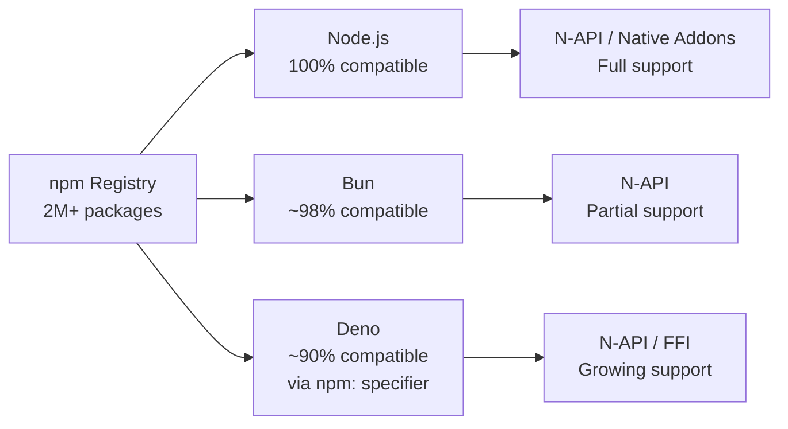
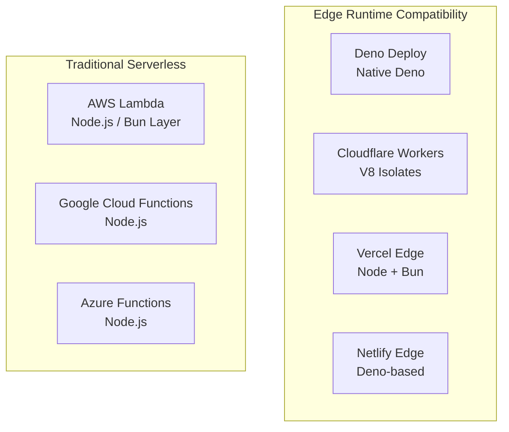
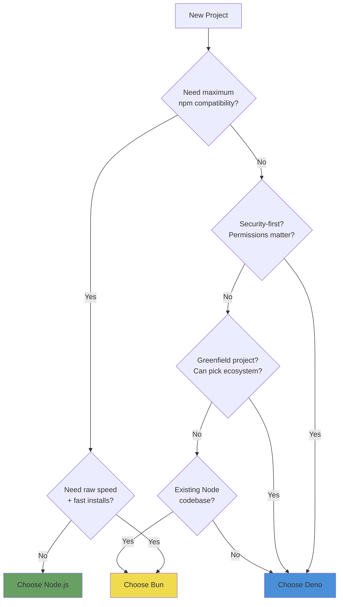

# Deno & Bun Runtimes

Node.js dominated server-side JavaScript for over a decade. Then Deno and Bun arrived with different philosophies: Deno prioritizes security and correctness, Bun prioritizes raw speed. Both natively support TypeScript. Both ship as single binaries. Both claim compatibility with the npm ecosystem while fixing Node's perceived mistakes.

This page compares all three runtimes across the dimensions that matter for production systems: security, performance, ecosystem compatibility, developer experience, and deployment. The goal is to help you pick the right runtime for a given project — or understand why you might run more than one.

**Related**: [Node.js Internals](/infrastructure/languages/nodejs-internals) | [TypeScript Advanced](/infrastructure/languages/typescript-advanced) | [TypeScript Cheat Sheet](/cheat-sheets/typescript)

---

## Architecture Overview

```mermaid
flowchart TB
    subgraph Node["Node.js"]
        NV8[V8 Engine]
        NLIBUV[libuv Event Loop]
        NCPP[C++ Bindings]
        NNAPI[N-API / Node-API]
        NV8 --> NLIBUV
        NLIBUV --> NCPP
        NCPP --> NNAPI
    end

    subgraph Deno["Deno"]
        DV8[V8 Engine]
        DTOKIO[Tokio Event Loop]
        DRUST[Rust Ops Layer]
        DPERM[Permission System]
        DV8 --> DTOKIO
        DTOKIO --> DRUST
        DRUST --> DPERM
    end

    subgraph Bun["Bun"]
        BJSC[JavaScriptCore Engine]
        BIO[io_uring / kqueue]
        BZIG[Zig Runtime]
        BTKIT[Built-in Toolkit]
        BJSC --> BIO
        BIO --> BZIG
        BZIG --> BTKIT
    end
```



### Engine Differences

| Aspect | Node.js | Deno | Bun |
|--------|---------|------|-----|
| **JS Engine** | V8 (Google) | V8 (Google) | JavaScriptCore (Apple) |
| **Language** | C++ | Rust | Zig |
| **Event Loop** | libuv | Tokio (Rust) | io_uring / kqueue |
| **TypeScript** | Via transpiler (tsx, ts-node) | Native | Native |
| **Package Manager** | npm / yarn / pnpm | deno add (npm compat) | bun install |
| **First Release** | 2009 | 2018 (1.0 in 2020) | 2022 (1.0 in 2023) |

::: tip
Bun uses JavaScriptCore (the engine in Safari), not V8. This means some V8-specific flags and behaviors (like `--max-old-space-size`) do not apply. JIT compilation strategies differ, which explains why certain workloads are faster or slower on each engine.
:::

---

## Permission Models

### Deno: Secure by Default

Deno runs with zero permissions by default. Every capability — file system, network, environment variables — must be explicitly granted.

```bash
# No permissions — script cannot access anything
deno run server.ts

# Grant specific permissions
deno run --allow-net=0.0.0.0:8000 --allow-read=./static server.ts

# Grant network access to specific domains
deno run --allow-net=api.example.com,cdn.example.com app.ts

# Environment variable access (specific vars)
deno run --allow-env=DATABASE_URL,API_KEY app.ts

# All permissions (development only)
deno run -A server.ts
```

Full permission matrix:

| Flag | Scope | Example |
|------|-------|---------|
| `--allow-read` | File system read | `--allow-read=/data,/config` |
| `--allow-write` | File system write | `--allow-write=/tmp,/logs` |
| `--allow-net` | Network access | `--allow-net=:8000,api.com` |
| `--allow-env` | Environment variables | `--allow-env=DB_URL` |
| `--allow-run` | Subprocess execution | `--allow-run=git,docker` |
| `--allow-ffi` | Foreign function interface | `--allow-ffi=./libcrypto.so` |
| `--allow-sys` | System info (hostname, etc.) | `--allow-sys=hostname,osRelease` |
| `--deny-net` | Deny specific network | `--deny-net=evil.com` |

#### Deno Permissions Config File

```json
// deno.json
{
  "permissions": {
    "allow-net": ["0.0.0.0:8000", "api.example.com"],
    "allow-read": ["./static", "./config"],
    "allow-env": ["DATABASE_URL", "NODE_ENV"],
    "allow-write": ["./logs"]
  }
}
```

### Node.js: Experimental Permission Model

Node.js 20+ introduced an experimental permission model inspired by Deno:

```bash
# Enable permission model
node --experimental-permission server.js

# Allow file system read for specific paths
node --experimental-permission --allow-fs-read=/app/config server.js

# Allow child process spawning
node --experimental-permission --allow-child-process server.js
```

::: warning
The Node.js permission model is still experimental and does not cover as many capabilities as Deno's. It also lacks per-domain network restrictions. Do not rely on it as a security boundary in production without additional hardening.
:::

### Bun: No Permission Model

Bun has no permission model. It runs with full system access, similar to traditional Node.js. The philosophy is that permissions add overhead and complexity, and container isolation handles security at a different layer.

---

## Performance Comparison

### HTTP Server Throughput

```typescript
// Minimal HTTP server — identical logic across runtimes

// === Node.js (node server.mjs) ===
import { createServer } from 'node:http';
createServer((req, res) => {
  res.writeHead(200, { 'Content-Type': 'text/plain' });
  res.end('Hello World');
}).listen(3000);

// === Deno (deno run --allow-net server.ts) ===
Deno.serve({ port: 3000 }, () => new Response('Hello World'));

// === Bun (bun server.ts) ===
Bun.serve({
  port: 3000,
  fetch() {
    return new Response('Hello World');
  },
});
```

Benchmark results (requests/second, single core, wrk -t1 -c100 -d30s):

| Runtime | Requests/sec | Latency (avg) | Latency (p99) |
|---------|-------------|---------------|---------------|
| **Bun 1.1** | ~115,000 | 0.87ms | 2.1ms |
| **Deno 2.x** | ~92,000 | 1.08ms | 2.8ms |
| **Node.js 22** | ~68,000 | 1.47ms | 3.9ms |

::: tip
These benchmarks measure the runtime overhead only. In real applications, the bottleneck is database queries, network calls, and business logic — not the HTTP layer. A 40% faster runtime does not mean your API is 40% faster.
:::

### Startup Time

```bash
# Measure cold start time (important for serverless)
$ hyperfine 'node -e "console.log(1)"' 'deno run -e "console.log(1)"' 'bun -e "console.log(1)"'

# Typical results:
# bun:  ~6ms
# node: ~30ms
# deno: ~25ms
```

| Metric | Node.js | Deno | Bun |
|--------|---------|------|-----|
| Cold start (hello world) | ~30ms | ~25ms | ~6ms |
| Cold start (Express app) | ~180ms | N/A | ~45ms |
| `install` 1000 packages | ~12s | ~15s | ~3s |
| TypeScript transpile | Needs tsx/ts-node | Built-in | Built-in |

### File I/O

```typescript
// Read a 100MB file
// Bun uses optimized I/O paths via io_uring (Linux) / kqueue (macOS)

// Bun
const file = Bun.file('./large.json');
const data = await file.text();

// Deno
const data = await Deno.readTextFile('./large.json');

// Node.js
import { readFile } from 'node:fs/promises';
const data = await readFile('./large.json', 'utf-8');
```

---

## Ecosystem & Compatibility

### npm Compatibility



#### Import Styles

```typescript
// === Node.js — CommonJS (legacy) ===
const express = require('express');

// === Node.js — ESM ===
import express from 'express';

// === Deno — URL imports (original style) ===
import { serve } from 'https://deno.land/std@0.220.0/http/server.ts';

// === Deno — npm specifier (modern style) ===
import express from 'npm:express@4';

// === Deno — JSR (JavaScript Registry) ===
import { Hono } from 'jsr:@hono/hono';

// === Bun — same as Node.js ESM ===
import express from 'express';
```

### Standard Library Comparison

| Capability | Node.js | Deno | Bun |
|-----------|---------|------|-----|
| HTTP server | `http` module | `Deno.serve()` | `Bun.serve()` |
| File system | `fs/promises` | `Deno.readFile()` etc. | `Bun.file()` |
| Testing | `node:test` (basic) | `deno test` (built-in) | `bun:test` (Jest-compat) |
| Formatting | External (Prettier) | `deno fmt` (built-in) | External |
| Linting | External (ESLint) | `deno lint` (built-in) | External |
| Bundling | External (esbuild, etc.) | `deno compile` | `bun build` |
| Benchmarking | External | `deno bench` (built-in) | External |
| Task runner | npm scripts | `deno task` | `bun run` |
| `.env` loading | `dotenv` package | `--env-file` flag | Built-in |

---

## Configuration

### Deno Configuration (`deno.json`)

```json
{
  "compilerOptions": {
    "strict": true,
    "jsx": "react-jsx",
    "jsxImportSource": "react"
  },
  "imports": {
    "@std/": "jsr:@std/",
    "hono": "jsr:@hono/hono@^4"
  },
  "tasks": {
    "dev": "deno run --watch --allow-net --allow-read main.ts",
    "test": "deno test --allow-read",
    "lint": "deno lint && deno fmt --check"
  },
  "fmt": {
    "singleQuote": true,
    "semiColons": false,
    "lineWidth": 100
  },
  "lint": {
    "rules": {
      "exclude": ["no-unused-vars"]
    }
  }
}
```

### Bun Configuration (`bunfig.toml`)

```toml
[install]
# Use exact versions by default
exact = true

# Scoped registry for private packages
[install.scopes]
"@mycompany" = { url = "https://npm.mycompany.com/", token = "$NPM_TOKEN" }

[run]
# Preload scripts
preload = ["./instrument.ts"]

[test]
# Test configuration
coverage = true
coverageReporter = ["text", "lcov"]
coverageDir = "./coverage"

[bundle]
# Bundle configuration
entrypoints = ["./src/index.ts"]
outdir = "./dist"
```

---

## Web API Compatibility

All three runtimes are converging on Web Standard APIs (WinterCG):

```typescript
// These APIs work across Node.js 18+, Deno, and Bun:
const response = await fetch('https://api.example.com/data');
const json = await response.json();

const url = new URL('/path', 'https://example.com');

const encoder = new TextEncoder();
const bytes = encoder.encode('hello');

const stream = new ReadableStream({
  start(controller) {
    controller.enqueue('chunk 1');
    controller.close();
  }
});

// Web Crypto API
const key = await crypto.subtle.generateKey(
  { name: 'AES-GCM', length: 256 },
  true,
  ['encrypt', 'decrypt']
);
```

::: warning
While the APIs share the same interface, edge cases differ. `fetch()` in Node.js uses undici under the hood, Deno uses hyper (Rust), and Bun uses its own Zig implementation. Behavior around redirects, timeouts, and TLS certificate validation can vary.
:::

---

## Testing

### Deno Built-in Test Runner

```typescript
// math_test.ts — run with: deno test
import { assertEquals, assertThrows } from 'jsr:@std/assert';

Deno.test('addition works', () => {
  assertEquals(2 + 2, 4);
});

Deno.test('async database query', async () => {
  const result = await fetchUser('user-1');
  assertEquals(result.name, 'Alice');
});

Deno.test({
  name: 'file write requires permission',
  permissions: { write: true, read: true },
  fn: async () => {
    await Deno.writeTextFile('/tmp/test.txt', 'hello');
    const content = await Deno.readTextFile('/tmp/test.txt');
    assertEquals(content, 'hello');
  },
});

// Snapshot testing (built-in)
Deno.test('snapshot', async (t) => {
  const data = { users: ['alice', 'bob'] };
  await assertSnapshot(t, data);
});
```

### Bun Test Runner (Jest-Compatible)

```typescript
// math.test.ts — run with: bun test
import { describe, expect, it, beforeAll, mock } from 'bun:test';

describe('Calculator', () => {
  it('adds numbers', () => {
    expect(2 + 2).toBe(4);
  });

  it('handles async operations', async () => {
    const result = await fetchUser('user-1');
    expect(result.name).toBe('Alice');
  });

  it('mocks functions', () => {
    const fn = mock(() => 42);
    expect(fn()).toBe(42);
    expect(fn).toHaveBeenCalledTimes(1);
  });
});
```

---

## Deployment Patterns

### Single Binary Compilation

```bash
# Deno — compile to standalone binary
deno compile --allow-net --allow-read --output myapp server.ts

# Bun — compile to standalone binary
bun build --compile --outfile myapp server.ts

# Result: single binary with runtime embedded (~50-90MB)
./myapp  # No runtime installation needed
```

### Docker Images

```dockerfile
# === Deno ===
FROM denoland/deno:2.0.0
WORKDIR /app
COPY deno.json deno.lock ./
RUN deno install
COPY . .
RUN deno cache main.ts
USER deno
CMD ["deno", "run", "--allow-net", "--allow-read", "--allow-env", "main.ts"]

# === Bun ===
FROM oven/bun:1.1
WORKDIR /app
COPY package.json bun.lockb ./
RUN bun install --frozen-lockfile --production
COPY . .
USER bun
CMD ["bun", "run", "main.ts"]
```

### Serverless / Edge



---

## Migration Strategies

### Node.js to Deno

```typescript
// 1. Start with npm compatibility mode
// deno.json
{
  "nodeModulesDir": "auto",
  "compilerOptions": {
    "allowImportingTsExtensions": true
  }
}

// 2. Replace Node APIs gradually
// Before (Node)
import { readFileSync } from 'node:fs';
const config = JSON.parse(readFileSync('./config.json', 'utf-8'));

// After (Deno)
const config = JSON.parse(await Deno.readTextFile('./config.json'));

// 3. Replace testing framework
// Before: jest/vitest
// After: deno test (built-in)
```

### Node.js to Bun

```typescript
// Bun is largely a drop-in replacement for Node.js
// 1. Replace package manager
// npm install -> bun install
// npm run dev -> bun run dev

// 2. Replace test runner (optional)
// jest -> bun:test (API-compatible)

// 3. Use Bun-specific APIs for performance
// Before
import { readFile } from 'node:fs/promises';
const data = await readFile('./data.json', 'utf-8');

// After (faster)
const data = await Bun.file('./data.json').text();
```

::: danger
Do not assume Bun is a 100% drop-in for Node.js. Native addons (N-API) have partial support, some `node:` modules have subtle behavior differences, and the `cluster` module is not yet fully implemented. Run your full test suite before deploying.
:::

---

## Decision Framework



### When to Choose Each Runtime

| Scenario | Recommendation | Reason |
|----------|---------------|--------|
| Existing Express/Fastify app | **Node.js** or **Bun** | Full ecosystem compatibility |
| New API, security-critical | **Deno** | Permission model, secure defaults |
| Serverless / cold-start sensitive | **Bun** | Fastest startup time |
| Deno Deploy / edge functions | **Deno** | Native platform support |
| CLI tools, scripts | **Deno** or **Bun** | Single binary compile, TS native |
| Enterprise, long-term support | **Node.js** | Largest ecosystem, most mature |
| Full-stack with fresh framework | **Deno** | Fresh is Deno-native |
| Monorepo with turbo/nx | **Node.js** or **Bun** | Best tooling support |

---

## Runtime Feature Matrix

| Feature | Node.js 22 | Deno 2.x | Bun 1.1 |
|---------|-----------|---------|---------|
| TypeScript native | No | Yes | Yes |
| JSX native | No | Yes | Yes |
| Permission model | Experimental | Yes (mature) | No |
| `node_modules` | Default | Optional | Default |
| Lock file | `package-lock.json` | `deno.lock` | `bun.lockb` (binary) |
| Built-in formatter | No | `deno fmt` | No |
| Built-in linter | No | `deno lint` | No |
| Built-in test runner | Basic (`node:test`) | Full (`deno test`) | Full (`bun:test`) |
| Built-in bundler | No | `deno compile` | `bun build` |
| Watch mode | `--watch` | `--watch` | `--watch` |
| `.env` loading | `--env-file` (v20.6+) | `--env-file` | Built-in |
| SQLite built-in | No | `jsr:@db/sqlite` | `bun:sqlite` |
| S3 client built-in | No | No | `Bun.s3()` |
| WebSocket server | `ws` package | `Deno.serve` upgrade | `Bun.serve` upgrade |
| HTTP/2 | `http2` module | Native | Partial |
| Workers | `worker_threads` | Web Workers | Web Workers |
| Compile to binary | `pkg` (third-party) | `deno compile` | `bun build --compile` |

---

## Common Gotchas

::: danger
**Bun lockfile is binary.** `bun.lockb` cannot be reviewed in pull requests as a text diff. Run `bun install --yarn` to generate a `yarn.lock` alongside it for auditability, or use `bun.lock` (text-based, available since Bun 1.2).
:::

::: warning
**Deno 2.x broke URL imports.** While Deno 1.x encouraged importing from URLs (`https://deno.land/std/...`), Deno 2.x pushes toward JSR and npm specifiers. URL imports still work but are no longer the recommended path. Plan for `jsr:` imports in new projects.
:::

::: tip
**Node.js is not standing still.** Node.js 22+ includes a built-in test runner, watch mode, `.env` file loading, the permission model, and native `fetch`. Many of the "advantages" of Deno and Bun are being backported. Evaluate the current versions, not the 2022 comparisons.
:::

---

## Further Reading

- [Node.js Internals](/infrastructure/languages/nodejs-internals) — deep dive into the Node.js event loop, libuv, and V8
- [TypeScript Advanced](/infrastructure/languages/typescript-advanced) — advanced type system patterns that work across all runtimes
- [Docker Cheat Sheet](/cheat-sheets/docker) — containerizing applications regardless of runtime
- [TypeScript Design Patterns](/infrastructure/languages/typescript-patterns) — patterns that leverage TypeScript's type system
