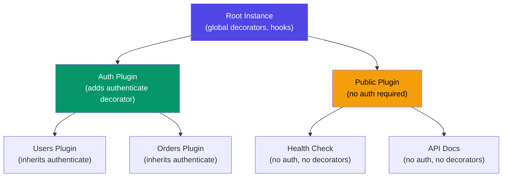
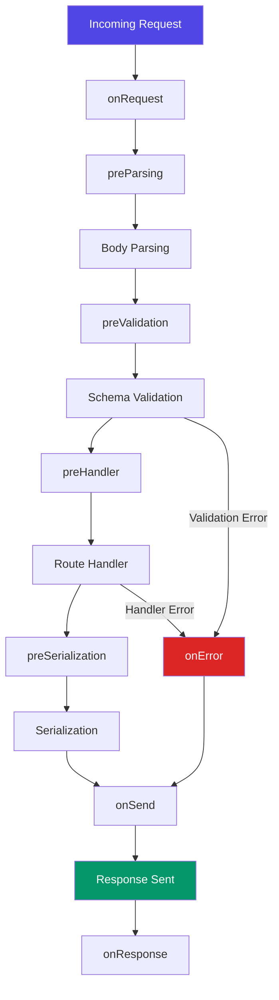
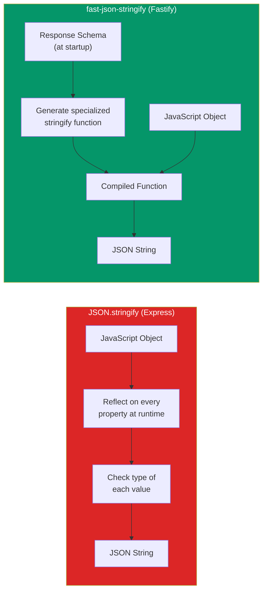

# Fastify Deep Dive

Fastify is a web framework for Node.js built from the ground up for performance and developer experience. While Express defined the category of Node.js web frameworks, it was designed in 2010 before async/await, TypeScript, JSON Schema, and modern V8 optimizations. Fastify was designed in 2017 with all of these in mind. The result is a framework that handles 2x the requests per second of Express, provides first-class TypeScript support, and enforces an encapsulated plugin architecture that scales to large codebases.

This page covers every architectural decision in Fastify, from the plugin tree to the serialization engine, with production-tested patterns and TypeScript examples throughout.

## Why Fastify Over Express

Before diving into architecture, here is the concrete case for choosing Fastify:

| Dimension | Express | Fastify |
|-----------|---------|---------|
| Requests/sec (JSON response) | ~15,000 | ~30,000+ |
| Schema validation | Manual (joi, zod, etc.) | Built-in (JSON Schema) |
| Serialization | `JSON.stringify` | `fast-json-stringify` (2-5x faster) |
| TypeScript | @types/express (community) | First-class with type providers |
| Plugin system | Middleware (global, no encapsulation) | Encapsulated plugin tree |
| Logging | None built-in | Pino (structured JSON logging) |
| Async errors | Must handle manually | Automatic async error handling |
| HTTP/2 | Requires separate setup | Built-in support |

::: tip When to Stay on Express
Express still wins in two scenarios: (1) you have a massive existing Express codebase with hundreds of middleware packages, and (2) you need maximum ecosystem compatibility with packages that only export Express middleware. For everything else, Fastify is the better choice.
:::

## Plugin System

The plugin system is the architectural foundation of Fastify. Everything in Fastify is a plugin — routes, decorators, hooks, even Fastify itself. Understanding encapsulation is the single most important concept in Fastify development.

### Encapsulation Model

Fastify uses a tree-based encapsulation model. Each plugin creates a new context that inherits from its parent but cannot affect its parent or siblings. This is fundamentally different from Express middleware, which mutates a shared global state.



Each node in this tree has its own:
- **Decorators** — custom properties/methods added to the instance
- **Hooks** — lifecycle functions that run at specific points
- **Routes** — HTTP endpoints registered in that context
- **Plugins** — child contexts with further encapsulation

### Registering Plugins

```typescript
import Fastify from 'fastify';

const app = Fastify({ logger: true });

// A plugin is just an async function that receives the instance
async function userRoutes(fastify, options) {
  // This decorator is only available in this plugin and its children
  fastify.decorate('userService', new UserService());

  fastify.get('/users', async (request, reply) => {
    return fastify.userService.findAll();
  });

  fastify.get('/users/:id', async (request, reply) => {
    const { id } = request.params as { id: string };
    return fastify.userService.findById(id);
  });
}

// Register with a route prefix
app.register(userRoutes, { prefix: '/api/v1' });

// This would fail — userService is encapsulated to userRoutes
// app.userService.findAll(); // TypeError: Cannot read property 'findAll'

await app.listen({ port: 3000 });
```

### Breaking Encapsulation with `fastify-plugin`

Sometimes you want a plugin to modify the parent context — for example, a database connection that should be available everywhere. Use `fastify-plugin` to skip encapsulation:

```typescript
import fp from 'fastify-plugin';

// This plugin's decorators are available to the parent and all siblings
const databasePlugin = fp(async (fastify, options) => {
  const pool = new Pool(options.connectionString);

  fastify.decorate('db', pool);

  fastify.addHook('onClose', async () => {
    await pool.end();
  });
}, {
  name: 'database-plugin',
  dependencies: [], // declare dependencies on other plugins
});

// Now db is available everywhere
app.register(databasePlugin, {
  connectionString: process.env.DATABASE_URL,
});

app.register(async (fastify) => {
  // fastify.db is available here because databasePlugin used fp()
  fastify.get('/health', async () => {
    await fastify.db.query('SELECT 1');
    return { status: 'ok' };
  });
});
```

::: warning Use `fastify-plugin` Sparingly
Breaking encapsulation should be reserved for cross-cutting concerns: database connections, authentication, caching. If you find yourself wrapping every plugin in `fp()`, you are fighting the architecture.
:::

## Decorators

Decorators extend the Fastify instance, request, or reply objects with custom properties and methods.

```typescript
// Instance decorator — adds to the Fastify instance
fastify.decorate('config', {
  jwtSecret: process.env.JWT_SECRET,
  dbUrl: process.env.DATABASE_URL,
});

// Request decorator — adds to every request object
fastify.decorateRequest('user', null);

// Reply decorator — adds to every reply object
fastify.decorateReply('sendSuccess', function (data: unknown) {
  // 'this' refers to the reply object
  return this.code(200).send({ success: true, data });
});

// Usage in routes
fastify.get('/profile', async (request, reply) => {
  return reply.sendSuccess(request.user);
});
```

### Decorator Best Practices

| Pattern | Good | Bad |
|---------|------|-----|
| Initial value | `decorateRequest('user', null)` | `decorateRequest('user', { name: '' })` |
| Reference types | Use `null` and set per-request in a hook | Sharing object reference across requests |
| Complex services | `decorate('userService', service)` | Attaching to `request` what belongs on instance |

::: danger Reference Type Trap
Never use a reference type (object, array) as the default value for a request/reply decorator. The same object would be shared across all requests, causing race conditions. Always use `null` and set the actual value in an `onRequest` hook.
:::

## Hooks Lifecycle

Fastify has a well-defined lifecycle with hooks at every stage. Understanding the hook order is essential for authentication, validation, logging, and error handling.



### Hook Descriptions

| Hook | Runs | Common Use |
|------|------|-----------|
| `onRequest` | After request received, before body parsing | Authentication, rate limiting |
| `preParsing` | Before body is parsed | Decompression, body transforms |
| `preValidation` | After parsing, before schema validation | Body enrichment, field normalization |
| `preHandler` | After validation, before handler | Authorization, loading resources |
| `preSerialization` | After handler, before serialization | Response transformation |
| `onSend` | After serialization, before sending | Compression, header modification |
| `onResponse` | After response sent | Logging, metrics, cleanup |
| `onError` | When an error occurs | Error formatting, error logging |

### Authentication Hook Example

```typescript
import fp from 'fastify-plugin';

const authPlugin = fp(async (fastify) => {
  fastify.decorate('authenticate', async (request, reply) => {
    const token = request.headers.authorization?.replace('Bearer ', '');

    if (!token) {
      reply.code(401).send({ error: 'Missing authentication token' });
      return;
    }

    try {
      const payload = await fastify.jwt.verify(token);
      request.user = payload;
    } catch (err) {
      reply.code(401).send({ error: 'Invalid token' });
    }
  });
});

// Apply as a preHandler hook on specific routes
fastify.get('/profile', {
  preHandler: [fastify.authenticate],
}, async (request) => {
  return { user: request.user };
});

// Or apply to an entire plugin scope
fastify.register(async (scope) => {
  scope.addHook('onRequest', scope.authenticate);

  scope.get('/settings', async (request) => {
    return getUserSettings(request.user.id);
  });

  scope.put('/settings', async (request) => {
    return updateUserSettings(request.user.id, request.body);
  });
});
```

## Schema Validation

Fastify uses JSON Schema for request validation by default. The schema is compiled at startup using `ajv`, so validation at runtime is a single function call — no parsing, no interpretation.

```typescript
const createUserSchema = {
  body: {
    type: 'object',
    required: ['name', 'email'],
    properties: {
      name: { type: 'string', minLength: 2, maxLength: 100 },
      email: { type: 'string', format: 'email' },
      age: { type: 'integer', minimum: 0, maximum: 150 },
      role: { type: 'string', enum: ['user', 'admin', 'moderator'] },
    },
    additionalProperties: false,
  },
  response: {
    201: {
      type: 'object',
      properties: {
        id: { type: 'string', format: 'uuid' },
        name: { type: 'string' },
        email: { type: 'string' },
        createdAt: { type: 'string', format: 'date-time' },
      },
    },
  },
};

fastify.post('/users', { schema: createUserSchema }, async (request, reply) => {
  // request.body is already validated — no additional checks needed
  const user = await createUser(request.body);
  reply.code(201);
  return user;
});
```

### Validation with Zod (Type Provider)

For teams that prefer Zod over JSON Schema, Fastify supports type providers:

```typescript
import Fastify from 'fastify';
import {
  serializerCompiler,
  validatorCompiler,
  ZodTypeProvider,
} from 'fastify-type-provider-zod';
import { z } from 'zod';

const app = Fastify().withTypeProvider<ZodTypeProvider>();
app.setValidatorCompiler(validatorCompiler);
app.setSerializerCompiler(serializerCompiler);

const CreateUserBody = z.object({
  name: z.string().min(2).max(100),
  email: z.string().email(),
  age: z.number().int().min(0).max(150).optional(),
});

app.post('/users', {
  schema: {
    body: CreateUserBody,
  },
}, async (request) => {
  // request.body is fully typed as { name: string; email: string; age?: number }
  const { name, email, age } = request.body;
  return createUser({ name, email, age });
});
```

## Serialization

Fastify uses `fast-json-stringify` instead of `JSON.stringify` for response serialization. By providing a JSON Schema for the response, Fastify generates a specialized serialization function at startup that is 2-5x faster than generic `JSON.stringify`.

### How It Works



The compiled function knows the exact shape of the object at compile time. It does not need to enumerate properties or check types at runtime. For large response objects, this difference is dramatic.

### Response Schema Example

```typescript
const getUserSchema = {
  response: {
    200: {
      type: 'object',
      properties: {
        id: { type: 'string' },
        name: { type: 'string' },
        email: { type: 'string' },
        // Properties not listed here are STRIPPED from the response
        // This acts as automatic data filtering — no accidental leaks
        // password, internal_notes, etc. are never sent
      },
    },
  },
};

fastify.get('/users/:id', { schema: getUserSchema }, async (request) => {
  // Even if the database returns { id, name, email, password, internal_notes },
  // the response only contains { id, name, email }
  return db.users.findById(request.params.id);
});
```

::: tip Security Through Serialization
Response schemas are not just for performance. They act as an allowlist — only properties defined in the schema are included in the response. This prevents accidental exposure of sensitive fields like passwords, tokens, or internal metadata. Define response schemas on every route.
:::

## TypeScript with Type Providers

Fastify's type system is designed around **type providers** — a pluggable system that infers request/response types from your schema definitions.

```typescript
import Fastify from 'fastify';
import { TypeBoxTypeProvider } from '@fastify/type-provider-typebox';
import { Type, Static } from '@sinclair/typebox';

const app = Fastify().withTypeProvider<TypeBoxTypeProvider>();

// Define schemas with TypeBox — JSON Schema + TypeScript types in one
const UserParams = Type.Object({
  id: Type.String({ format: 'uuid' }),
});

const UserResponse = Type.Object({
  id: Type.String(),
  name: Type.String(),
  email: Type.String(),
  createdAt: Type.String({ format: 'date-time' }),
});

// TypeScript type derived from schema
type User = Static<typeof UserResponse>;

app.get<{
  Params: Static<typeof UserParams>;
  Reply: Static<typeof UserResponse>;
}>('/users/:id', {
  schema: {
    params: UserParams,
    response: { 200: UserResponse },
  },
}, async (request, reply) => {
  // request.params.id is typed as string
  const user = await getUser(request.params.id);
  // Return type is checked against UserResponse
  return user;
});
```

### Type Provider Comparison

| Provider | Schema Format | Pros | Cons |
|----------|--------------|------|------|
| `@fastify/type-provider-typebox` | TypeBox (JSON Schema builder) | Runtime validation + TS types from one source | Learning TypeBox API |
| `fastify-type-provider-zod` | Zod | Popular, great DX, rich validation | Slower validation than JSON Schema |
| `@fastify/type-provider-json-schema-to-ts` | Raw JSON Schema | No extra library | Verbose, harder to maintain |

## Performance Deep Dive

Fastify's performance comes from several deliberate architectural decisions:

### 1. Radix Tree Router (find-my-way)

Fastify uses `find-my-way`, a radix tree router. Express uses a linear array of route patterns checked one by one. The radix tree matches routes in O(log n) time, not O(n):

```
Radix Tree for routes:
    /
    ├── api/
    │   ├── users          → GET handler
    │   │   └── /:id       → GET, PUT, DELETE handlers
    │   ├── orders          → GET handler
    │   │   └── /:id       → GET handler
    │   └── products        → GET handler
    └── health              → GET handler

Lookup: /api/users/123
  / → api/ → users → /:id → MATCH (3 comparisons)

Express linear scan:
  Check /api/users → no (has more path)
  Check /api/users/:id → MATCH (2 checks, but O(n) for n routes)
```

### 2. Compiled Schemas

Both validation (ajv) and serialization (fast-json-stringify) compile schemas into specialized functions at startup. At runtime, there is no interpretation overhead.

### 3. Reuse of Objects

Fastify reuses request and reply objects across requests through careful lifecycle management, reducing garbage collection pressure.

### 4. Pino Logger

Fastify bundles Pino, which logs JSON using `sonic-boom` (a fast non-blocking writer). Pino is 5x faster than Winston and 10x faster than Bunyan.

```typescript
const app = Fastify({
  logger: {
    level: 'info',
    transport: {
      target: 'pino-pretty', // only in development
      options: { colorize: true },
    },
  },
});

// Automatic request logging
// {"level":30,"time":1616,"reqId":"abc-123","req":{"method":"GET","url":"/api/users"},"msg":"incoming request"}
// {"level":30,"time":1618,"reqId":"abc-123","res":{"statusCode":200},"responseTime":12.34,"msg":"request completed"}
```

### Benchmark Comparison

| Framework | Req/sec (JSON) | Req/sec (Plain Text) | Latency (avg) |
|-----------|----------------|---------------------|---------------|
| Fastify | 30,000+ | 65,000+ | 0.03ms |
| Express | 15,000 | 35,000 | 0.06ms |
| Koa | 18,000 | 45,000 | 0.05ms |
| Hapi | 12,000 | 28,000 | 0.08ms |

::: tip Benchmarks Are Misleading
Raw framework benchmarks measure the overhead of the framework itself, not your application. In a real app with database queries, business logic, and external API calls, the framework overhead is 1-5% of total latency. Choose Fastify for its architecture and developer experience, not just for benchmarks.
:::

## Error Handling

Fastify provides structured error handling with automatic async error catching:

```typescript
// Custom error handler
app.setErrorHandler((error, request, reply) => {
  // Validation errors from JSON Schema
  if (error.validation) {
    return reply.code(400).send({
      error: 'Validation Error',
      message: error.message,
      details: error.validation,
    });
  }

  // Custom application errors
  if (error.statusCode) {
    return reply.code(error.statusCode).send({
      error: error.name,
      message: error.message,
    });
  }

  // Unexpected errors
  request.log.error(error);
  return reply.code(500).send({
    error: 'Internal Server Error',
    message: 'An unexpected error occurred',
  });
});

// Async errors are caught automatically — no try/catch needed
fastify.get('/users/:id', async (request) => {
  const user = await db.users.findById(request.params.id);
  if (!user) {
    // Fastify catches this and passes it to the error handler
    const error = new Error('User not found');
    error.statusCode = 404;
    throw error;
  }
  return user;
});
```

## Production Checklist

```typescript
import Fastify from 'fastify';
import cors from '@fastify/cors';
import helmet from '@fastify/helmet';
import rateLimit from '@fastify/rate-limit';

const app = Fastify({
  logger: true,
  trustProxy: true,             // behind a reverse proxy
  requestTimeout: 30000,        // 30s timeout
  bodyLimit: 1048576,           // 1MB body limit
  caseSensitive: true,          // /Users !== /users
});

// Security headers
await app.register(helmet);

// CORS
await app.register(cors, {
  origin: ['https://myapp.com'],
  credentials: true,
});

// Rate limiting
await app.register(rateLimit, {
  max: 100,
  timeWindow: '1 minute',
});

// Graceful shutdown
const signals = ['SIGINT', 'SIGTERM'];
for (const signal of signals) {
  process.on(signal, async () => {
    app.log.info(`Received ${signal}, shutting down gracefully`);
    await app.close(); // closes all plugins, connections
    process.exit(0);
  });
}
```

## Cross-References

- [Node.js Internals](/infrastructure/languages/nodejs-internals) — V8, event loop, and streams
- [TypeScript Advanced Patterns](/infrastructure/languages/typescript-advanced) — generics and type inference
- [REST Best Practices](/system-design/api-design/rest-best-practices) — route design and HTTP semantics
- [Deploy Node.js to Production](/devops/deployment-guides/deploy-nodejs) — containerization and deployment
- [API Security Patterns](/system-design/api-design/api-security-patterns) — authentication and authorization

## Summary

Fastify is not just "a faster Express." It is a fundamentally different architecture built on three pillars:

1. **Encapsulated plugins** — every piece of your application is isolated by default, preventing the global mutation chaos of Express middleware
2. **Schema-driven development** — validation and serialization are compiled from schemas at startup, providing both type safety and raw speed
3. **Performance by design** — radix tree routing, compiled serializers, object reuse, and Pino logging work together to deliver 2x the throughput of Express

If you are starting a new Node.js API in 2026, Fastify should be your default choice. It delivers Express-level simplicity with production-grade performance and type safety out of the box.
