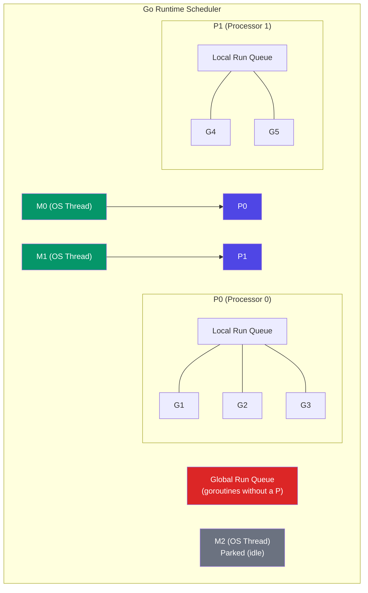
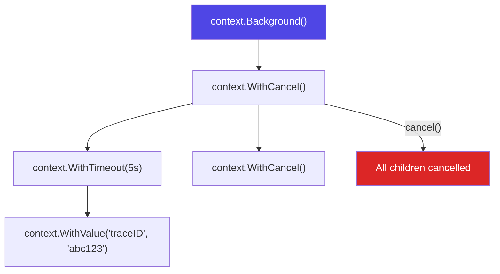

# Go Concurrency

Go was designed from the ground up for concurrency. Unlike languages that bolted threading onto an existing runtime, Go's concurrency primitives — goroutines and channels — are first-class language features backed by a sophisticated runtime scheduler. The result is a language where spawning 100,000 concurrent tasks is routine, not reckless. But power without understanding is dangerous: data races, goroutine leaks, and deadlocks are the most common production bugs in Go services. This page covers the full stack, from how the Go scheduler maps goroutines onto OS threads to the battle-tested patterns that keep production systems safe.

## Goroutines

A goroutine is a lightweight thread of execution managed by the Go runtime, not the operating system. It starts with a stack of only 2-8 KB (compared to 1-8 MB for an OS thread) and grows dynamically as needed.

```go
func main() {
    // Launch a goroutine — costs ~2 KB of memory
    go func() {
        fmt.Println("Hello from goroutine")
    }()

    // The main goroutine is also a goroutine
    time.Sleep(time.Millisecond) // Wait (crude; use sync primitives in real code)
}
```

### Goroutine vs OS Thread

| Property | Goroutine | OS Thread |
|----------|-----------|-----------|
| Initial stack size | 2-8 KB | 1-8 MB |
| Creation cost | ~0.3 microseconds | ~10+ microseconds |
| Context switch cost | ~200 ns (user-space) | ~1-10 microseconds (kernel) |
| Maximum practical count | 100,000 - 1,000,000 | 1,000 - 10,000 |
| Scheduling | Go runtime (cooperative + preemptive) | OS kernel (fully preemptive) |
| Stack growth | Dynamic, segmented | Fixed at creation |

## The GMP Scheduler

Go's runtime scheduler uses the **GMP model** to multiplex goroutines onto OS threads:

- **G** — Goroutine: the unit of work
- **M** — Machine: an OS thread
- **P** — Processor: a logical processor (execution context), limited to `GOMAXPROCS` (default = number of CPU cores)



### How Scheduling Works

1. Each P has a **local run queue** (LRQ) of goroutines ready to run
2. When a P's LRQ is empty, it **steals** half the goroutines from another P's queue (work stealing)
3. If no P has work, goroutines are taken from the **global run queue** (GRQ)
4. When a goroutine makes a blocking syscall (e.g., file I/O), the M is detached from the P, and a new M is found (or created) to serve the P
5. Network I/O does NOT block an M — it uses the **netpoller** (epoll/kqueue), which parks the goroutine and wakes it when I/O is ready

### Preemptive Scheduling (Go 1.14+)

Before Go 1.14, goroutines could only be preempted at function call boundaries. A tight loop without function calls (`for { i++ }`) would monopolize an M forever. Since Go 1.14, the runtime uses **asynchronous preemption** via signals (SIGURG on Unix) to interrupt long-running goroutines at any safe point.

```go
// Before Go 1.14, this would block the entire P
go func() {
    for {
        // Tight loop with no function calls
        // Go 1.14+ can still preempt this via signal
    }
}()
```

## Channels

Channels are Go's primary mechanism for communication between goroutines. They provide both **data transfer** and **synchronization**.

### Unbuffered Channels

An unbuffered channel has no capacity. A send blocks until another goroutine receives, and vice versa. This provides a synchronization point:

```go
ch := make(chan int) // unbuffered

go func() {
    result := expensiveComputation()
    ch <- result // blocks until receiver is ready
}()

value := <-ch // blocks until sender sends
fmt.Println(value)
```

### Buffered Channels

A buffered channel has a capacity. Sends only block when the buffer is full. Receives only block when the buffer is empty:

```go
ch := make(chan int, 100) // buffer of 100

// Producer can send 100 values without blocking
for i := 0; i < 100; i++ {
    ch <- i // does not block until buffer is full
}
```

### Channel Directionality

```go
// Send-only channel (producer)
func producer(out chan<- int) {
    for i := 0; i < 10; i++ {
        out <- i
    }
    close(out)
}

// Receive-only channel (consumer)
func consumer(in <-chan int) {
    for value := range in {
        fmt.Println(value)
    }
}

func main() {
    ch := make(chan int, 5)
    go producer(ch)
    consumer(ch) // blocks until channel is closed
}
```

### Select Statement

`select` lets a goroutine wait on multiple channel operations simultaneously:

```go
func process(ctx context.Context, input <-chan Job, results chan<- Result) {
    for {
        select {
        case job := <-input:
            result := doWork(job)
            select {
            case results <- result:
            case <-ctx.Done():
                return
            }
        case <-ctx.Done():
            // Context cancelled — clean up and exit
            log.Println("Shutting down processor:", ctx.Err())
            return
        }
    }
}
```

::: warning Channel Axioms
- A send to a nil channel blocks forever
- A receive from a nil channel blocks forever
- A send to a closed channel panics
- A receive from a closed channel returns the zero value immediately
- Closing a nil channel panics
- Closing an already-closed channel panics

These axioms are the source of most channel-related bugs. Always close channels from the sender side, never the receiver.
:::

## Sync Package

For scenarios where channels are too heavyweight or semantically wrong, the `sync` package provides low-level synchronization primitives.

### Mutex and RWMutex

```go
type SafeMap struct {
    mu sync.RWMutex
    data map[string]interface{}
}

func (m *SafeMap) Get(key string) (interface{}, bool) {
    m.mu.RLock()         // Multiple readers allowed
    defer m.mu.RUnlock()
    val, ok := m.data[key]
    return val, ok
}

func (m *SafeMap) Set(key string, value interface{}) {
    m.mu.Lock()          // Exclusive access for writes
    defer m.mu.Unlock()
    m.data[key] = value
}
```

### WaitGroup

```go
func processAll(items []Item) []Result {
    var wg sync.WaitGroup
    results := make([]Result, len(items))

    for i, item := range items {
        wg.Add(1)
        go func(idx int, it Item) {
            defer wg.Done()
            results[idx] = process(it)
        }(i, item)
    }

    wg.Wait() // Block until all goroutines complete
    return results
}
```

### sync.Once

Guarantees a function is executed exactly once, even when called from multiple goroutines concurrently. Used for lazy initialization:

```go
type DBPool struct {
    once sync.Once
    pool *sql.DB
}

func (d *DBPool) Get() *sql.DB {
    d.once.Do(func() {
        var err error
        d.pool, err = sql.Open("postgres", connString)
        if err != nil {
            log.Fatal(err)
        }
    })
    return d.pool
}
```

### sync.Pool

An object pool for temporary objects that reduces GC pressure. Objects may be removed from the pool at any time (between GC cycles):

```go
var bufferPool = sync.Pool{
    New: func() interface{} {
        return new(bytes.Buffer)
    },
}

func processRequest(data []byte) string {
    buf := bufferPool.Get().(*bytes.Buffer)
    defer func() {
        buf.Reset()
        bufferPool.Put(buf)
    }()

    buf.Write(data)
    // ... process
    return buf.String()
}
```

### Comparison: When to Use What

| Primitive | Use When |
|-----------|----------|
| Channels | Communicating data between goroutines, signaling events, orchestrating pipelines |
| Mutex | Protecting shared state (maps, slices, structs) from concurrent access |
| RWMutex | Shared state with many readers and few writers |
| WaitGroup | Waiting for a group of goroutines to finish |
| Once | One-time initialization (database connections, config loading) |
| Pool | Recycling expensive-to-allocate objects (buffers, connections) |
| Cond | Complex waiting conditions (rarely needed — channels are usually better) |

## Context Package

The `context` package is Go's mechanism for propagating deadlines, cancellation signals, and request-scoped values across API boundaries and between goroutines:



### Cancellation Propagation

```go
func handleRequest(w http.ResponseWriter, r *http.Request) {
    // Create a context with a 5-second timeout
    ctx, cancel := context.WithTimeout(r.Context(), 5*time.Second)
    defer cancel() // Always call cancel to release resources

    // Pass context to downstream operations
    user, err := fetchUser(ctx, userID)
    if err != nil {
        if ctx.Err() == context.DeadlineExceeded {
            http.Error(w, "Request timed out", http.StatusGatewayTimeout)
            return
        }
        http.Error(w, err.Error(), http.StatusInternalServerError)
        return
    }

    orders, err := fetchOrders(ctx, user.ID)
    // ...
}

func fetchUser(ctx context.Context, id string) (*User, error) {
    // Respect context cancellation
    select {
    case <-ctx.Done():
        return nil, ctx.Err()
    default:
    }

    // Pass context to database driver (most drivers support context)
    row := db.QueryRowContext(ctx, "SELECT * FROM users WHERE id = $1", id)
    // ...
}
```

::: tip Context Rules
1. Never store contexts in structs — pass them as the first parameter
2. Always call the cancel function returned by `WithCancel`/`WithTimeout`/`WithDeadline`
3. Do not pass a nil context — use `context.TODO()` if you are unsure
4. Use `context.WithValue` sparingly — only for request-scoped data (trace IDs, auth tokens), not for passing function parameters
:::

## Concurrency Patterns

### Fan-Out, Fan-In

Distribute work across multiple goroutines (fan-out) and collect results into a single channel (fan-in):

```go
func fanOutFanIn(ctx context.Context, input <-chan Job, numWorkers int) <-chan Result {
    // Fan-out: start N workers
    channels := make([]<-chan Result, numWorkers)
    for i := 0; i < numWorkers; i++ {
        channels[i] = worker(ctx, input)
    }

    // Fan-in: merge all worker outputs into one channel
    return merge(ctx, channels...)
}

func worker(ctx context.Context, jobs <-chan Job) <-chan Result {
    out := make(chan Result)
    go func() {
        defer close(out)
        for job := range jobs {
            select {
            case out <- process(job):
            case <-ctx.Done():
                return
            }
        }
    }()
    return out
}

func merge(ctx context.Context, channels ...<-chan Result) <-chan Result {
    var wg sync.WaitGroup
    merged := make(chan Result)

    wg.Add(len(channels))
    for _, ch := range channels {
        go func(c <-chan Result) {
            defer wg.Done()
            for result := range c {
                select {
                case merged <- result:
                case <-ctx.Done():
                    return
                }
            }
        }(ch)
    }

    go func() {
        wg.Wait()
        close(merged)
    }()

    return merged
}
```

### Worker Pool

A bounded pool of goroutines processing jobs from a shared channel:

```go
func workerPool(ctx context.Context, jobs <-chan Job, numWorkers int) <-chan Result {
    results := make(chan Result, numWorkers)

    var wg sync.WaitGroup
    for i := 0; i < numWorkers; i++ {
        wg.Add(1)
        go func(workerID int) {
            defer wg.Done()
            for job := range jobs {
                select {
                case <-ctx.Done():
                    return
                default:
                    result := process(job)
                    result.WorkerID = workerID
                    results <- result
                }
            }
        }(i)
    }

    go func() {
        wg.Wait()
        close(results)
    }()

    return results
}
```

### Pipeline

A series of stages connected by channels, where each stage is a group of goroutines running the same function:

```go
// Stage 1: Generate
func generate(ctx context.Context, nums ...int) <-chan int {
    out := make(chan int)
    go func() {
        defer close(out)
        for _, n := range nums {
            select {
            case out <- n:
            case <-ctx.Done():
                return
            }
        }
    }()
    return out
}

// Stage 2: Square
func square(ctx context.Context, in <-chan int) <-chan int {
    out := make(chan int)
    go func() {
        defer close(out)
        for n := range in {
            select {
            case out <- n * n:
            case <-ctx.Done():
                return
            }
        }
    }()
    return out
}

// Stage 3: Filter
func filterEven(ctx context.Context, in <-chan int) <-chan int {
    out := make(chan int)
    go func() {
        defer close(out)
        for n := range in {
            if n%2 == 0 {
                select {
                case out <- n:
                case <-ctx.Done():
                    return
                }
            }
        }
    }()
    return out
}

func main() {
    ctx, cancel := context.WithCancel(context.Background())
    defer cancel()

    // Compose the pipeline
    pipeline := filterEven(ctx, square(ctx, generate(ctx, 1, 2, 3, 4, 5, 6, 7, 8, 9, 10)))

    for result := range pipeline {
        fmt.Println(result) // 4, 16, 36, 64, 100
    }
}
```

### Semaphore (Bounded Concurrency)

```go
// Limit concurrent operations using a buffered channel as a semaphore
func processWithLimit(items []Item, maxConcurrency int) []Result {
    sem := make(chan struct{}, maxConcurrency)
    results := make([]Result, len(items))
    var wg sync.WaitGroup

    for i, item := range items {
        wg.Add(1)
        sem <- struct{}{} // Acquire — blocks if maxConcurrency reached
        go func(idx int, it Item) {
            defer wg.Done()
            defer func() { <-sem }() // Release
            results[idx] = process(it)
        }(i, item)
    }

    wg.Wait()
    return results
}
```

## Race Conditions and the Data Race Detector

A **data race** occurs when two goroutines access the same variable concurrently and at least one of them writes. Go's race detector (`-race` flag) instruments memory accesses to detect races at runtime:

```bash
# Run with race detection
go test -race ./...
go run -race main.go
go build -race -o myapp
```

### Common Race Condition

```go
// BUG: Data race on `counter`
var counter int

func increment() {
    for i := 0; i < 1000; i++ {
        counter++ // Not atomic! Read-modify-write is 3 operations
    }
}

func main() {
    go increment()
    go increment()
    time.Sleep(time.Second)
    fmt.Println(counter) // Could be anything from 1000 to 2000
}
```

### Fixes

```go
// Fix 1: Mutex
var mu sync.Mutex
var counter int

func increment() {
    for i := 0; i < 1000; i++ {
        mu.Lock()
        counter++
        mu.Unlock()
    }
}

// Fix 2: Atomic operations (best for simple counters)
var counter int64

func increment() {
    for i := 0; i < 1000; i++ {
        atomic.AddInt64(&counter, 1)
    }
}

// Fix 3: Channel (idiomatic Go — share memory by communicating)
func counter(ch <-chan struct{}, result chan<- int) {
    count := 0
    for range ch {
        count++
    }
    result <- count
}
```

::: danger Always Run -race in CI
The race detector has ~2-10x CPU overhead and ~5-10x memory overhead, so it should not run in production. But it must run in every CI pipeline. Undetected data races cause corrupted data, crashes, and security vulnerabilities that are nearly impossible to reproduce.
:::

## Goroutine Leaks

A goroutine leak occurs when a goroutine is spawned but never terminates. Common causes:

```go
// LEAK: Channel send with no receiver
func leak() {
    ch := make(chan int)
    go func() {
        result := expensiveWork()
        ch <- result // Blocks forever if nobody reads from ch
    }()
    // Function returns without reading from ch
    // The goroutine is leaked!
}

// FIX: Use context for cancellation
func noLeak(ctx context.Context) (int, error) {
    ch := make(chan int, 1) // Buffered so goroutine can exit even if we don't read
    go func() {
        result := expensiveWork()
        select {
        case ch <- result:
        case <-ctx.Done():
            return // Context cancelled — exit cleanly
        }
    }()

    select {
    case result := <-ch:
        return result, nil
    case <-ctx.Done():
        return 0, ctx.Err()
    }
}
```

### Detecting Goroutine Leaks

```go
// In tests, use goleak
import "go.uber.org/goleak"

func TestMain(m *testing.M) {
    goleak.VerifyTestMain(m)
}

// In production, monitor goroutine count
import "runtime"

func monitorGoroutines() {
    ticker := time.NewTicker(10 * time.Second)
    for range ticker.C {
        count := runtime.NumGoroutine()
        metrics.Gauge("goroutine.count", float64(count))
        if count > 10000 {
            log.Warn("High goroutine count", "count", count)
        }
    }
}
```

## Production Concurrency Checklist

| Rule | Why |
|------|-----|
| Every goroutine must have a way to stop | Prevents goroutine leaks; use `context.Context` |
| Always pass `context.Context` as first parameter | Enables cancellation, timeouts, and tracing |
| Run `-race` in CI on every commit | Catches data races before production |
| Prefer channels for communication, mutexes for state | "Share memory by communicating" is idiomatic Go |
| Use bounded concurrency (semaphore pattern) | Prevents resource exhaustion (connections, file descriptors) |
| Monitor `runtime.NumGoroutine()` | Detect goroutine leaks in production |
| Close channels from the sender, not the receiver | Prevents panics from sending on a closed channel |
| Use `errgroup` for concurrent error handling | `golang.org/x/sync/errgroup` combines WaitGroup + error propagation + context cancellation |

## Further Reading

- [Node.js Internals](/infrastructure/languages/nodejs-internals) — event loop concurrency, a fundamentally different model
- [Rust for Backend](/infrastructure/languages/rust-for-backend) — async/await with ownership-based thread safety
- [Consistent Hashing](/system-design/distributed-systems/consistent-hashing) — distributed systems patterns that Go services commonly implement
- [gRPC Internals](/system-design/networking/grpc-internals) — Go is gRPC's primary implementation language
- [Kafka Internals](/system-design/message-queues/kafka-internals) — consumer groups often use these concurrency patterns
