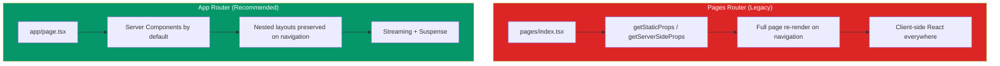
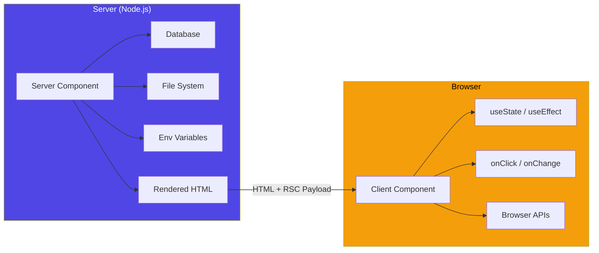
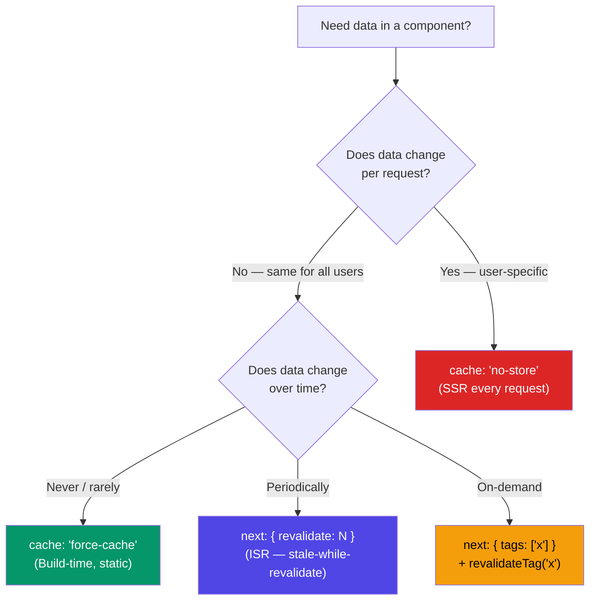

# Next.js Patterns & Best Practices

Next.js has become the de facto React framework for production applications. It is not a thin wrapper around React — it is an opinionated fullstack platform that makes critical architectural decisions for you: how code is split, where it runs, how data is fetched, and how pages are rendered. Understanding these decisions and the patterns they enable is the difference between a Next.js app that loads in 200ms and one that loads in 4 seconds.

This page covers the entire surface area of modern Next.js (v14+), focusing on the App Router paradigm that replaced Pages Router as the recommended approach. Every pattern includes production-tested code, performance implications, and guidance on when to use — and when to avoid — each technique.

## App Router vs Pages Router

Next.js has two routing systems. The Pages Router (`pages/` directory) was the original model, built on `getStaticProps`, `getServerSideProps`, and client-side React. The App Router (`app/` directory) was introduced in Next.js 13 and became stable in 13.4. It is built on React Server Components, nested layouts, and streaming.



### Key Differences

| Feature | Pages Router | App Router |
|---------|-------------|------------|
| Default rendering | Client Components | Server Components |
| Data fetching | `getStaticProps`, `getServerSideProps` | `async` components with `fetch` |
| Layouts | Re-render on every navigation | Persistent, nested |
| Loading states | Manual | Built-in `loading.tsx` |
| Error handling | `_error.tsx` global | Per-route `error.tsx` |
| Metadata | `<Head>` component | `metadata` export / `generateMetadata` |
| Streaming | Not supported | Native with Suspense |
| Server Actions | Not supported | Native form mutations |

### When to Use Each

The App Router is the recommended choice for all new projects. The Pages Router is still fully supported and will not be deprecated. You should stay on Pages Router if:

1. Your app is already large and migration cost is high
2. You depend on libraries that have not adopted Server Components
3. You need `getInitialProps` for custom `_app.tsx` patterns

::: tip Migration Strategy
You can run both routers simultaneously. Files in `app/` take precedence over `pages/` for the same route. Migrate route by route, starting with the simplest pages and working toward complex ones with heavy data fetching.
:::

## Server Components

Server Components are the foundation of the App Router. Every component in the `app/` directory is a Server Component by default. They run only on the server, their JavaScript is never sent to the client, and they can directly access databases, file systems, and environment variables.

### The Mental Model



### Server Component Patterns

```tsx
// app/users/page.tsx — Server Component (default)
// No "use client" directive = runs on server only
import { db } from '@/lib/database';

// This component can be async — a pattern impossible in client components
export default async function UsersPage() {
  // Direct database access — no API route needed
  const users = await db.query('SELECT * FROM users WHERE active = true');

  return (
    <div>
      <h1>Active Users ({users.length})</h1>
      <ul>
        {users.map(user => (
          <li key={user.id}>
            {user.name} — {user.email}
          </li>
        ))}
      </ul>
    </div>
  );
}
```

### Client Components

When you need interactivity — state, effects, event handlers, browser APIs — you add the `"use client"` directive at the top of the file:

```tsx
'use client';

// app/components/SearchFilter.tsx
import { useState, useTransition } from 'react';
import { useRouter } from 'next/navigation';

export function SearchFilter() {
  const [query, setQuery] = useState('');
  const [isPending, startTransition] = useTransition();
  const router = useRouter();

  function handleSearch(value: string) {
    setQuery(value);
    startTransition(() => {
      router.push(`/search?q=${encodeURIComponent(value)}`);
    });
  }

  return (
    <input
      value={query}
      onChange={e => handleSearch(e.target.value)}
      placeholder={isPending ? 'Searching...' : 'Search users...'}
    />
  );
}
```

::: warning The Boundary Rule
`"use client"` does not mean the component only runs on the client. It marks the boundary where the component tree transitions from server to client. Everything imported by a client component also becomes a client component. Push the `"use client"` boundary as deep as possible to minimize the client bundle.
:::

### Composition Pattern: Server Inside Client

You cannot import a Server Component into a Client Component. But you can pass Server Components as `children`:

```tsx
// app/dashboard/layout.tsx (Server Component)
import { ClientSidebar } from './ClientSidebar';
import { ServerStats } from './ServerStats';

export default function DashboardLayout({ children }) {
  return (
    <div className="flex">
      <ClientSidebar>
        {/* ServerStats runs on server, passed as children to client */}
        <ServerStats />
      </ClientSidebar>
      <main>{children}</main>
    </div>
  );
}
```

## Server Actions

Server Actions are functions that run on the server but can be called from client-side forms and event handlers. They replace the need for API routes in many cases.

```tsx
// app/actions/user-actions.ts
'use server';

import { db } from '@/lib/database';
import { revalidatePath } from 'next/cache';
import { z } from 'zod';

const CreateUserSchema = z.object({
  name: z.string().min(2).max(100),
  email: z.string().email(),
});

export async function createUser(formData: FormData) {
  const parsed = CreateUserSchema.safeParse({
    name: formData.get('name'),
    email: formData.get('email'),
  });

  if (!parsed.success) {
    return { error: parsed.error.flatten().fieldErrors };
  }

  await db.query(
    'INSERT INTO users (name, email) VALUES ($1, $2)',
    [parsed.data.name, parsed.data.email]
  );

  revalidatePath('/users');
  return { success: true };
}
```

```tsx
// app/users/new/page.tsx
import { createUser } from '@/app/actions/user-actions';

export default function NewUserPage() {
  return (
    <form action={createUser}>
      <input name="name" placeholder="Name" required />
      <input name="email" type="email" placeholder="Email" required />
      <button type="submit">Create User</button>
    </form>
  );
}
```

::: danger Security Warning
Server Actions are public HTTP endpoints under the hood. Always validate and authorize inside the action. Never trust that the caller is your own form — anyone can POST to the action's endpoint.
:::

### Progressive Enhancement

Forms using Server Actions work without JavaScript. The form submits as a standard HTML form, the server processes it, and the page reloads. When JavaScript loads, Next.js intercepts the submission and handles it with a fetch request, providing instant feedback without a full page reload. This is progressive enhancement by default.

## Data Fetching Patterns

The App Router replaces `getStaticProps` and `getServerSideProps` with extended `fetch` that supports caching and revalidation natively.

### Fetch with Caching

```tsx
// Static data — cached indefinitely (equivalent to getStaticProps)
const data = await fetch('https://api.example.com/products', {
  cache: 'force-cache', // default behavior
});

// Dynamic data — never cached (equivalent to getServerSideProps)
const data = await fetch('https://api.example.com/cart', {
  cache: 'no-store',
});

// ISR — cached but revalidated every 60 seconds
const data = await fetch('https://api.example.com/products', {
  next: { revalidate: 60 },
});

// Tag-based revalidation
const data = await fetch('https://api.example.com/products', {
  next: { tags: ['products'] },
});

// Later, in a Server Action or Route Handler:
import { revalidateTag } from 'next/cache';
revalidateTag('products'); // invalidates all fetches tagged 'products'
```

### Data Fetching Decision Tree



### Parallel Data Fetching

Never waterfall data fetches. Use `Promise.all` for independent data:

```tsx
export default async function DashboardPage() {
  // BAD: Sequential — total time = sum of all fetches
  // const users = await getUsers();
  // const orders = await getOrders();
  // const revenue = await getRevenue();

  // GOOD: Parallel — total time = slowest fetch
  const [users, orders, revenue] = await Promise.all([
    getUsers(),
    getOrders(),
    getRevenue(),
  ]);

  return (
    <Dashboard users={users} orders={orders} revenue={revenue} />
  );
}
```

### Request Deduplication

Next.js automatically deduplicates `fetch` requests with the same URL and options within a single render pass. If both a layout and a page fetch the same data, only one request is made:

```tsx
// app/layout.tsx
export default async function Layout({ children }) {
  const user = await fetch('/api/user'); // Request #1
  return <nav>{user.name}</nav>;
}

// app/page.tsx
export default async function Page() {
  const user = await fetch('/api/user'); // Deduplicated — same request as layout
  return <h1>Welcome, {user.name}</h1>;
}
// Only ONE fetch is made, not two
```

## Middleware

Middleware runs before every request and can rewrite, redirect, or modify headers. It executes on the Edge Runtime for low latency.

```tsx
// middleware.ts (project root)
import { NextResponse } from 'next/server';
import type { NextRequest } from 'next/server';

export function middleware(request: NextRequest) {
  // Authentication check
  const token = request.cookies.get('session-token');

  if (!token && request.nextUrl.pathname.startsWith('/dashboard')) {
    return NextResponse.redirect(new URL('/login', request.url));
  }

  // Add custom headers
  const response = NextResponse.next();
  response.headers.set('x-request-id', crypto.randomUUID());

  // Geolocation-based routing
  const country = request.geo?.country || 'US';
  if (country === 'DE' && !request.nextUrl.pathname.startsWith('/de')) {
    return NextResponse.redirect(new URL(`/de${request.nextUrl.pathname}`, request.url));
  }

  return response;
}

export const config = {
  // Match all paths except static files and API routes
  matcher: ['/((?!api|_next/static|_next/image|favicon.ico).*)'],
};
```

::: warning Middleware Limitations
Middleware runs on the Edge Runtime, which means no Node.js APIs (`fs`, `path`, `crypto` from Node — but Web Crypto is available). Keep middleware fast and simple — heavy logic belongs in route handlers or Server Actions.
:::

## Route Handlers

Route Handlers replace API routes from the Pages Router. They live in `app/` and support all HTTP methods:

```tsx
// app/api/users/route.ts
import { NextRequest, NextResponse } from 'next/server';
import { db } from '@/lib/database';

export async function GET(request: NextRequest) {
  const searchParams = request.nextUrl.searchParams;
  const page = parseInt(searchParams.get('page') || '1');
  const limit = 20;
  const offset = (page - 1) * limit;

  const users = await db.query(
    'SELECT id, name, email FROM users LIMIT $1 OFFSET $2',
    [limit, offset]
  );

  return NextResponse.json({
    data: users,
    pagination: { page, limit },
  });
}

export async function POST(request: NextRequest) {
  const body = await request.json();

  const user = await db.query(
    'INSERT INTO users (name, email) VALUES ($1, $2) RETURNING *',
    [body.name, body.email]
  );

  return NextResponse.json(user, { status: 201 });
}
```

### Dynamic Route Handlers

```tsx
// app/api/users/[id]/route.ts
import { NextRequest, NextResponse } from 'next/server';

export async function GET(
  request: NextRequest,
  { params }: { params: { id: string } }
) {
  const user = await db.query('SELECT * FROM users WHERE id = $1', [params.id]);

  if (!user) {
    return NextResponse.json({ error: 'User not found' }, { status: 404 });
  }

  return NextResponse.json(user);
}
```

## Performance Patterns

### Incremental Static Regeneration (ISR)

ISR lets you serve static pages while revalidating them in the background. The first request after the revalidation window triggers a background rebuild:

```tsx
// app/products/[slug]/page.tsx
export const revalidate = 3600; // Revalidate every hour

export async function generateStaticParams() {
  const products = await db.query('SELECT slug FROM products');
  return products.map(p => ({ slug: p.slug }));
}

export default async function ProductPage({ params }) {
  const product = await db.query(
    'SELECT * FROM products WHERE slug = $1',
    [params.slug]
  );

  return <ProductDetail product={product} />;
}
```

### Streaming with Suspense

Streaming lets you send parts of the page as they become ready, instead of waiting for all data to load:

```tsx
// app/dashboard/page.tsx
import { Suspense } from 'react';
import { RevenueChart } from './RevenueChart';
import { LatestOrders } from './LatestOrders';
import { TopProducts } from './TopProducts';

export default function DashboardPage() {
  return (
    <div className="grid grid-cols-2 gap-4">
      {/* Shell renders immediately */}
      <h1>Dashboard</h1>

      {/* Each section streams in independently */}
      <Suspense fallback={<ChartSkeleton />}>
        <RevenueChart />  {/* 2s query — streams when ready */}
      </Suspense>

      <Suspense fallback={<TableSkeleton />}>
        <LatestOrders />  {/* 500ms query — streams first */}
      </Suspense>

      <Suspense fallback={<GridSkeleton />}>
        <TopProducts />   {/* 1.5s query — streams second */}
      </Suspense>
    </div>
  );
}
```

### Parallel Routes

Parallel routes let you render multiple pages in the same layout simultaneously, each with independent loading and error states:

```tsx
// app/dashboard/layout.tsx
export default function DashboardLayout({
  children,
  analytics,
  team,
}: {
  children: React.ReactNode;
  analytics: React.ReactNode;
  team: React.ReactNode;
}) {
  return (
    <div>
      {children}
      <div className="grid grid-cols-2">
        {analytics}  {/* app/dashboard/@analytics/page.tsx */}
        {team}        {/* app/dashboard/@team/page.tsx */}
      </div>
    </div>
  );
}
```

Each parallel route (`@analytics`, `@team`) has its own `loading.tsx`, `error.tsx`, and can navigate independently.

### Route Segment Configuration

Control caching, runtime, and rendering per route segment:

```tsx
// Force dynamic rendering for an entire route
export const dynamic = 'force-dynamic';

// Set maximum revalidation time
export const revalidate = 3600;

// Choose runtime
export const runtime = 'edge'; // or 'nodejs'

// Limit dynamic params
export const dynamicParams = false; // 404 for non-generated params
```

## Deployment

### Vercel (Zero-Config)

Vercel is the company behind Next.js. Deploying to Vercel requires zero configuration:

```bash
# Install and link
npm i -g vercel
vercel link

# Deploy
vercel          # Preview deployment
vercel --prod   # Production deployment
```

Vercel provides automatic ISR, edge middleware, image optimization, and analytics out of the box.

### Self-Hosted with Docker

For self-hosting, use the `standalone` output mode to create a minimal production build:

```dockerfile
# Dockerfile
FROM node:20-alpine AS base

# Install dependencies
FROM base AS deps
WORKDIR /app
COPY package.json pnpm-lock.yaml ./
RUN corepack enable pnpm && pnpm install --frozen-lockfile

# Build
FROM base AS builder
WORKDIR /app
COPY --from=deps /app/node_modules ./node_modules
COPY . .
RUN npm run build

# Production
FROM base AS runner
WORKDIR /app
ENV NODE_ENV=production
ENV NEXT_TELEMETRY_DISABLED=1

RUN addgroup --system --gid 1001 nodejs
RUN adduser --system --uid 1001 nextjs

COPY --from=builder /app/public ./public
COPY --from=builder --chown=nextjs:nodejs /app/.next/standalone ./
COPY --from=builder --chown=nextjs:nodejs /app/.next/static ./.next/static

USER nextjs
EXPOSE 3000
ENV PORT=3000
CMD ["node", "server.js"]
```

::: tip Standalone Output
Add `output: 'standalone'` to `next.config.js` to generate a minimal `server.js` that includes only the necessary `node_modules`. This reduces the Docker image from ~1GB to ~100MB.
:::

### Environment Variables

```bash
# .env.local — loaded in all environments, not committed
DATABASE_URL=postgres://localhost/myapp

# .env.production — loaded only in production builds
NEXT_PUBLIC_API_URL=https://api.example.com

# NEXT_PUBLIC_ prefix exposes variables to the browser
# Variables without the prefix are server-only
```

| Variable Type | Available In | Example |
|--------------|-------------|---------|
| `NEXT_PUBLIC_*` | Server + Client | `NEXT_PUBLIC_API_URL` |
| No prefix | Server only | `DATABASE_URL`, `API_SECRET` |
| Runtime env | `process.env` at runtime | `PORT`, `HOSTNAME` |

## Common Mistakes

### Mistake 1: Making Everything a Client Component

```tsx
// BAD — entire page is a client component for one click handler
'use client';

export default function ProductPage({ product }) {
  return (
    <div>
      <h1>{product.name}</h1>
      <p>{product.description}</p>
      {/* ... 200 lines of static content ... */}
      <button onClick={() => addToCart(product.id)}>Add to Cart</button>
    </div>
  );
}

// GOOD — only the interactive part is a client component
// ProductPage stays as a Server Component
import { AddToCartButton } from './AddToCartButton';

export default async function ProductPage({ params }) {
  const product = await getProduct(params.id);
  return (
    <div>
      <h1>{product.name}</h1>
      <p>{product.description}</p>
      <AddToCartButton productId={product.id} />
    </div>
  );
}
```

### Mistake 2: Waterfall Data Fetching

Layouts and pages fetch data independently, but parent layouts finish before child pages start. If a layout fetches user data and a page fetches page-specific data, they waterfall. Use `loading.tsx` to show intermediate states and avoid blocking on layout data that is not immediately needed.

### Mistake 3: Ignoring `key` in Dynamic Routes

When navigating between dynamic routes (e.g., `/products/1` to `/products/2`), Client Components do not remount by default. Use the `key` prop or `useParams` to react to route changes.

## Cross-References

- [TypeScript Advanced Patterns](/infrastructure/languages/typescript-advanced) — type-safe props and generics
- [Tailwind CSS Architecture](/infrastructure/languages/tailwind-architecture) — styling patterns for Next.js
- [Deploy Next.js](/devops/deployment-guides/deploy-nextjs) — detailed deployment guide
- [tRPC End-to-End Type Safety](/system-design/api-design/trpc) — type-safe API layer for Next.js
- [REST Best Practices](/system-design/api-design/rest-best-practices) — route handler design

## Summary

| Pattern | When to Use | Key Benefit |
|---------|-------------|-------------|
| Server Components | Static content, data display | Zero client JS |
| Client Components | Interactivity, browser APIs | Full React features |
| Server Actions | Form submissions, mutations | No API routes needed |
| ISR | Content that changes periodically | Static speed, fresh data |
| Streaming | Slow data sources | Progressive rendering |
| Parallel Routes | Independent page sections | Isolated loading/error |
| Middleware | Auth, redirects, headers | Edge-speed request processing |
| Route Handlers | External API consumption | Full HTTP method support |

Next.js is not "React with routing." It is a rendering and data platform that happens to use React. The patterns on this page are not suggestions — they are the architecture. Understanding them means understanding where your code runs, when it runs, and what gets sent to the user. Every millisecond of loading time you save comes from making these decisions correctly.
