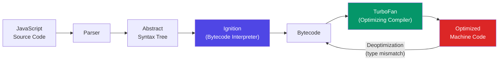
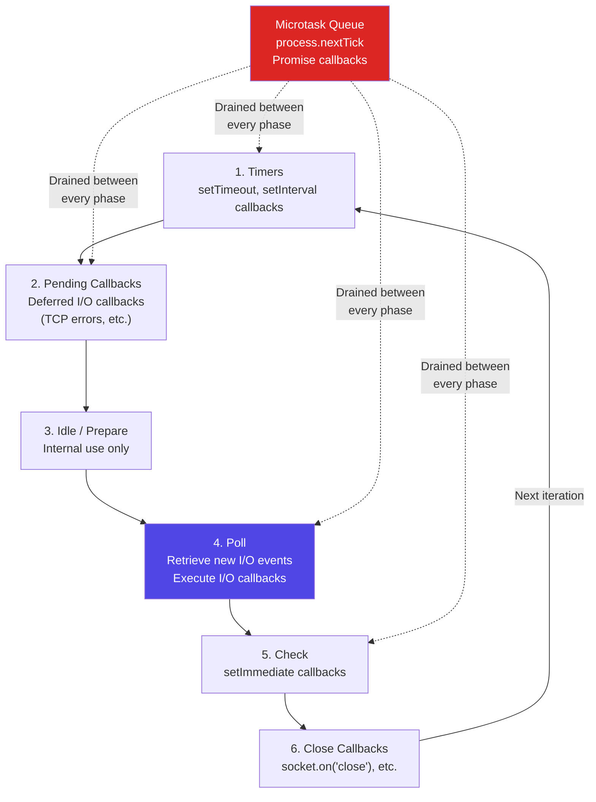
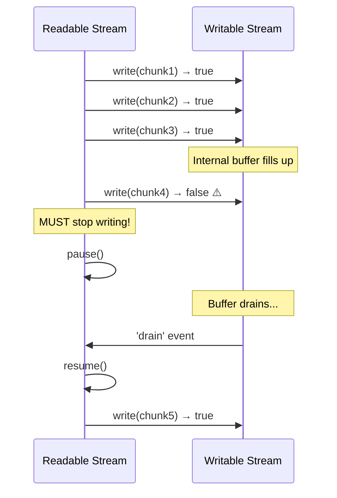
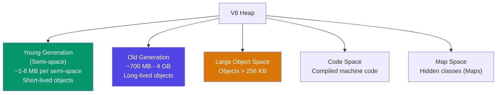

# Node.js Internals

Node.js is not "JavaScript on the server." It is a runtime that wires together two powerful C/C++ libraries — Google's V8 JavaScript engine and libuv's asynchronous I/O — behind a JavaScript API. Understanding what happens beneath `async/await` and `require()` is the difference between writing Node.js code that handles 100 concurrent connections and code that handles 100,000. This page takes apart every major subsystem: how V8 compiles and optimizes your code, how the event loop actually works (not the simplified version), how streams manage backpressure, and how you can break out of the single-threaded model when you need to.

## V8 Engine Internals

V8 is the JavaScript and WebAssembly engine that powers both Chrome and Node.js. It compiles JavaScript directly to machine code — there is no interpreter in the traditional sense (though V8 has reintroduced one for startup performance).

### Compilation Pipeline



1. **Parser** converts JavaScript source into an AST
2. **Ignition** (bytecode interpreter) generates compact bytecode and starts executing immediately — this gives fast startup
3. **TurboFan** (optimizing compiler) watches which functions are "hot" (called frequently) and compiles them to highly optimized machine code
4. **Deoptimization** happens when TurboFan's assumptions are violated (e.g., a variable that was always a number suddenly becomes a string)

### Hidden Classes and Inline Caches

V8 does not use hash maps for object property access. Instead, it creates **hidden classes** (internally called "Maps") that describe the shape of an object:

```javascript
// V8 creates hidden class transitions
function Point(x, y) {
  this.x = x;  // Hidden class C0 -> C1 (add property x)
  this.y = y;  // Hidden class C1 -> C2 (add property x, y)
}

const p1 = new Point(1, 2);  // Shape: C2
const p2 = new Point(3, 4);  // Shape: C2 (same hidden class!)

// GOOD: All Point objects share the same hidden class
// V8 can use inline caches for fast property access

// BAD: Adding properties in different order creates different hidden classes
const a = {};
a.x = 1;
a.y = 2;  // Hidden class: {x, y}

const b = {};
b.y = 2;
b.x = 1;  // Hidden class: {y, x} — DIFFERENT hidden class!
```

**Inline Caches (ICs)** are the performance mechanism that exploits hidden classes. When V8 sees `point.x`, it records the hidden class and the offset of `x`. On the next call, if the object has the same hidden class, V8 skips the property lookup entirely and reads directly from the memory offset.

::: warning Avoid Polymorphic Code Paths
When a function receives objects with different hidden classes, V8's inline caches become "megamorphic" and fall back to slow dictionary lookups. Keep objects with the same "shape" — initialize all properties in the constructor in the same order.
:::

### Optimization Killers

Certain patterns prevent TurboFan from optimizing a function:

| Pattern | Why It Prevents Optimization |
|---------|------------------------------|
| `try/catch` around hot code | Historically deoptimized (V8 improved this, but complex catches still hurt) |
| `arguments` object manipulation | Dynamic nature prevents static analysis |
| `delete` operator on objects | Destroys hidden class, forces dictionary mode |
| Changing type of a variable | Deoptimizes function when type assumption breaks |
| `eval()` or `with` | Prevents scope analysis entirely |
| Large `switch` with many cases | Can prevent inlining and IC optimization |

## The Event Loop: All Six Phases

The Node.js event loop is **not** a simple "callback queue." It has six distinct phases, each with its own queue, executed in a specific order every iteration (tick):



### Phase Details

**1. Timers** — Executes callbacks scheduled by `setTimeout()` and `setInterval()`. A timer does not guarantee exact execution at the specified time — it guarantees execution *no earlier than* the specified time. If the poll phase takes 200ms, a 100ms timer fires at 200ms.

**2. Pending Callbacks** — Executes I/O callbacks deferred from the previous loop iteration. For example, if a TCP socket receives `ECONNREFUSED`, some operating systems queue the error report here.

**3. Idle/Prepare** — Used internally by Node.js. You cannot interact with this phase.

**4. Poll** — The most important phase. It does two things:
  - Calculates how long it should block and wait for I/O
  - Processes events in the poll queue (file I/O, network I/O callbacks)

If there are no timers scheduled, the poll phase will block indefinitely waiting for I/O events. If there are timers, it will wait only until the nearest timer is due.

**5. Check** — `setImmediate()` callbacks execute here. `setImmediate()` is designed to run after the poll phase completes, which makes it useful for scheduling work that should happen after all I/O in the current tick.

**6. Close Callbacks** — Close event handlers like `socket.on('close', ...)`.

### Microtask Queue Priority

```javascript
// This demonstrates execution order
setTimeout(() => console.log('1: setTimeout'), 0);
setImmediate(() => console.log('2: setImmediate'));

Promise.resolve().then(() => console.log('3: Promise'));
process.nextTick(() => console.log('4: nextTick'));

console.log('5: synchronous');

// Output:
// 5: synchronous
// 4: nextTick          (microtask — drained first)
// 3: Promise           (microtask — drained after nextTick)
// 1: setTimeout        (timers phase — OR setImmediate, order not guaranteed at top level)
// 2: setImmediate      (check phase)
```

::: danger process.nextTick Can Starve I/O
`process.nextTick()` callbacks are drained completely before the event loop continues to the next phase. A recursive `nextTick` will block all I/O indefinitely. Prefer `setImmediate()` for deferring work unless you specifically need to execute before any I/O.
:::

## libuv Thread Pool

Node.js is single-threaded for JavaScript execution, but I/O operations run on libuv's thread pool (default: 4 threads, configurable via `UV_THREADPOOL_SIZE`, max 1024):

### What Uses the Thread Pool vs. OS Async

| Uses Thread Pool | Uses OS Async (epoll/kqueue/IOCP) |
|-----------------|-----------------------------------|
| `fs.*` (file system operations) | TCP/UDP sockets |
| `dns.lookup()` (uses getaddrinfo) | Pipes |
| `zlib.*` (compression) | TTY |
| `crypto.pbkdf2()`, `crypto.scrypt()` | `dns.resolve()` (uses c-ares) |
| `crypto.randomBytes()` (if not enough entropy) | Signals |
| Custom C++ addons using `uv_queue_work` | Child processes |

```javascript
// DNS — two APIs, different execution models
const dns = require('dns');

// Uses thread pool (libc getaddrinfo) — can block if pool is exhausted
dns.lookup('example.com', (err, address) => {});

// Uses c-ares (async I/O) — does not use thread pool
dns.resolve4('example.com', (err, addresses) => {});
```

### Thread Pool Exhaustion

If all thread pool threads are busy with slow file system operations, other file I/O and DNS lookups will queue up:

```javascript
const fs = require('fs');

// Setting a higher thread pool size for I/O-heavy applications
// Must be set before any I/O operations
process.env.UV_THREADPOOL_SIZE = '16';

// Monitoring event loop lag to detect thread pool exhaustion
const start = process.hrtime.bigint();
setImmediate(() => {
  const lag = Number(process.hrtime.bigint() - start) / 1e6;
  if (lag > 100) {
    console.warn(`Event loop lag: ${lag.toFixed(1)}ms — possible thread pool exhaustion`);
  }
});
```

## Streams and Backpressure

Streams are Node.js's mechanism for processing data incrementally instead of loading everything into memory. There are four types: Readable, Writable, Duplex, and Transform.

### Backpressure

Backpressure occurs when a writable stream cannot consume data as fast as a readable stream produces it. Without proper handling, data buffers in memory and eventually crashes the process:



```javascript
const fs = require('fs');

// BAD: Ignoring backpressure
const readable = fs.createReadStream('huge-file.csv');
const writable = fs.createWriteStream('output.csv');

readable.on('data', (chunk) => {
  // If write() returns false, we MUST wait for 'drain'
  // This code ignores that — memory will explode with large files
  writable.write(chunk);
});

// GOOD: Using pipe() — handles backpressure automatically
const readable2 = fs.createReadStream('huge-file.csv');
const writable2 = fs.createWriteStream('output.csv');
readable2.pipe(writable2);

// GOOD: Using pipeline() — handles errors AND backpressure
const { pipeline } = require('stream/promises');

async function processFile() {
  await pipeline(
    fs.createReadStream('huge-file.csv'),
    new Transform({
      transform(chunk, encoding, callback) {
        // Process each chunk
        const processed = chunk.toString().toUpperCase();
        callback(null, processed);
      }
    }),
    fs.createWriteStream('output.csv')
  );
  console.log('Pipeline completed');
}
```

### Buffer Internals

Buffers are fixed-size chunks of memory allocated outside the V8 heap (in C++ land). They are not subject to garbage collection in the normal V8 sense:

```javascript
// Buffer allocation strategies
const buf1 = Buffer.alloc(1024);        // Zero-filled, safe, slower
const buf2 = Buffer.allocUnsafe(1024);  // NOT zero-filled, fast, may contain old data
const buf3 = Buffer.from('hello');      // From string, UTF-8 by default

// Buffer pooling: allocUnsafe uses an 8KB pre-allocated pool
// Buffers < 4KB come from the pool (fast allocation, no system call)
// Buffers >= 4KB get their own allocation via C++ malloc
```

::: tip Use pipeline() Not pipe()
`pipe()` does not forward errors — if the readable stream errors, the writable stream is not closed, leading to file descriptor leaks. Always use `stream.pipeline()` (or `stream/promises` pipeline) which handles error propagation and cleanup.
:::

## Cluster Module

The cluster module forks the Node.js process to utilize multiple CPU cores. The master process distributes incoming connections to workers:

```javascript
const cluster = require('cluster');
const http = require('http');
const numCPUs = require('os').cpus().length;

if (cluster.isPrimary) {
  console.log(`Primary ${process.pid} is running`);

  // Fork workers
  for (let i = 0; i < numCPUs; i++) {
    cluster.fork();
  }

  cluster.on('exit', (worker, code, signal) => {
    console.log(`Worker ${worker.process.pid} died (${signal || code}). Restarting...`);
    cluster.fork();  // Auto-restart crashed workers
  });
} else {
  http.createServer((req, res) => {
    res.writeHead(200);
    res.end(`Handled by worker ${process.pid}\n`);
  }).listen(8000);

  console.log(`Worker ${process.pid} started`);
}
```

### Connection Distribution

On Linux, the primary process listens on the port and distributes connections to workers using **round-robin** scheduling (configurable). On Windows, the listening socket is shared directly with workers (OS handles distribution).

The round-robin approach is generally more balanced than OS-level distribution, which can be uneven due to the "thundering herd" problem.

## Worker Threads

Worker threads (added in Node.js 10.5) provide true parallelism for CPU-intensive work without the overhead of process forking:

```javascript
const { Worker, isMainThread, parentPort, workerData } = require('worker_threads');

if (isMainThread) {
  // Main thread — offload heavy computation
  async function computeHash(data) {
    return new Promise((resolve, reject) => {
      const worker = new Worker(__filename, {
        workerData: { data }
      });
      worker.on('message', resolve);
      worker.on('error', reject);
    });
  }

  // Use a worker pool for production
  const results = await Promise.all([
    computeHash('block-1'),
    computeHash('block-2'),
    computeHash('block-3'),
  ]);
} else {
  // Worker thread — runs in parallel
  const crypto = require('crypto');
  const hash = crypto.createHash('sha256')
    .update(workerData.data)
    .digest('hex');

  parentPort.postMessage(hash);
}
```

### Cluster vs Worker Threads

| Feature | Cluster | Worker Threads |
|---------|---------|----------------|
| Isolation | Separate processes, separate V8 heaps | Same process, separate V8 isolates |
| Memory sharing | IPC only (serialized) | `SharedArrayBuffer`, `Atomics` |
| Use case | Scaling HTTP servers across CPUs | CPU-intensive computation (crypto, parsing, image processing) |
| Overhead | High (full process fork) | Lower (thread, shared libuv loop) |
| Fault isolation | Worker crash does not affect primary | Worker crash can affect main thread |
| Port sharing | Built-in socket sharing | Not applicable |

## Memory Management and Garbage Collection

V8's garbage collector is a generational, incremental, concurrent collector:

### Memory Spaces



### GC Strategies

| GC Type | Space | Algorithm | Impact |
|---------|-------|-----------|--------|
| Scavenge (Minor GC) | Young Generation | Cheney's semi-space copying | Very fast (1-5ms), frequent |
| Mark-Sweep (Major GC) | Old Generation | Tri-color marking, concurrent sweeping | Slower (50-200ms), infrequent |
| Mark-Compact | Old Generation | Mark + compact to reduce fragmentation | Slowest, reduces memory usage |
| Incremental Marking | Old Generation | Break marking into small chunks | Reduces pause time |

```javascript
// Monitor GC in production
const v8 = require('v8');

// Heap statistics
const stats = v8.getHeapStatistics();
console.log({
  heapTotal: `${(stats.total_heap_size / 1024 / 1024).toFixed(1)} MB`,
  heapUsed: `${(stats.used_heap_size / 1024 / 1024).toFixed(1)} MB`,
  heapLimit: `${(stats.heap_size_limit / 1024 / 1024).toFixed(1)} MB`,
  external: `${(stats.external_memory / 1024 / 1024).toFixed(1)} MB`,
});

// Detect memory leaks with heap snapshots
// node --inspect app.js
// Use Chrome DevTools → Memory → Take heap snapshot
```

### Common Memory Leak Patterns

```javascript
// LEAK 1: Unbounded caches
const cache = {};  // Grows forever!
app.get('/user/:id', async (req, res) => {
  if (!cache[req.params.id]) {
    cache[req.params.id] = await db.getUser(req.params.id);
  }
  res.json(cache[req.params.id]);
});

// FIX: Use an LRU cache with a max size
const LRU = require('lru-cache');
const cache = new LRU({ max: 1000, ttl: 1000 * 60 * 5 });

// LEAK 2: Event emitter listeners accumulating
const emitter = new EventEmitter();
app.get('/stream', (req, res) => {
  const handler = (data) => res.write(data);
  emitter.on('data', handler);
  // If response closes, listener is never removed!

  // FIX: Clean up on close
  res.on('close', () => emitter.removeListener('data', handler));
});

// LEAK 3: Closures capturing large objects
function processRequest(hugePayload) {
  const metadata = extractMetadata(hugePayload); // small
  return function callback() {
    // This closure captures `hugePayload` even though it only uses `metadata`
    console.log(metadata);
  };
  // FIX: Null out the reference or restructure to avoid capturing
}
```

### Tuning V8 Memory

```bash
# Increase old generation heap limit (default ~1.5 GB on 64-bit)
node --max-old-space-size=4096 app.js

# Increase young generation size for allocation-heavy workloads
node --max-semi-space-size=64 app.js

# Enable GC logging for debugging
node --trace-gc app.js

# Expose GC for manual triggering (testing only!)
node --expose-gc -e "global.gc(); console.log('GC triggered')"
```

::: warning Do Not Over-Allocate Heap
Setting `--max-old-space-size` higher than your container's memory limit will cause the OOM killer to terminate your process without warning. Always set the V8 heap limit to ~75% of your container memory to leave room for native allocations (Buffers, C++ addons, libuv).
:::

## Production Performance Checklist

| Area | Recommendation | Why |
|------|---------------|-----|
| Event loop lag | Monitor with `perf_hooks.monitorEventLoopDelay()` | Lag > 100ms indicates blocking operations |
| Thread pool | Set `UV_THREADPOOL_SIZE` based on I/O workload | Default 4 threads is often too few |
| Streams | Always use `pipeline()` for stream composition | Prevents memory leaks and handles backpressure |
| DNS | Use `dns.resolve()` over `dns.lookup()` | `lookup()` uses the thread pool; `resolve()` uses async c-ares |
| Buffers | Use `Buffer.allocUnsafe()` for performance-critical paths | Skip zero-fill when you will immediately write to the buffer |
| Cluster | Use `numCPUs` workers for HTTP servers | Saturate all cores for network I/O workloads |
| Worker threads | Use for CPU tasks > 10ms | Offload crypto, parsing, image processing |
| GC | Monitor with `--trace-gc` in staging | Find GC pauses that cause latency spikes |
| Memory | Set `--max-old-space-size` to 75% of container memory | Prevent OOM kills from container runtime |

## Further Reading

- [Go Concurrency](/infrastructure/languages/go-concurrency) — a different concurrency model: goroutines and channels vs event loop
- [Rust for Backend](/infrastructure/languages/rust-for-backend) — zero-cost abstractions as an alternative to V8's runtime overhead
- [Kafka Internals](/system-design/message-queues/kafka-internals) — how Node.js producers/consumers interact with Kafka brokers
- [Consistent Hashing](/system-design/distributed-systems/consistent-hashing) — used in Node.js cluster connection distribution
- [HTTP/2 and HTTP/3](/system-design/networking/http2-http3) — the protocol layer Node.js HTTP servers implement
