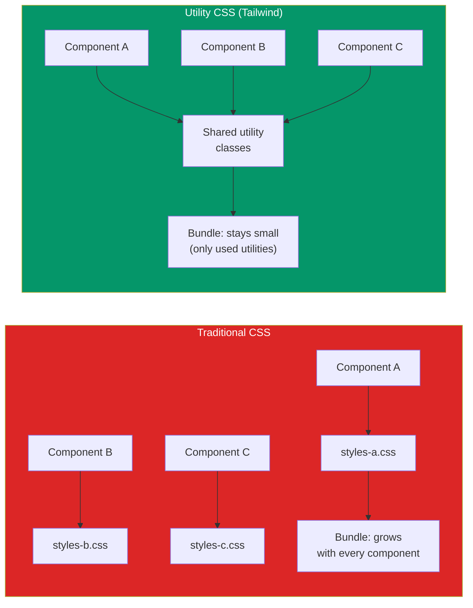
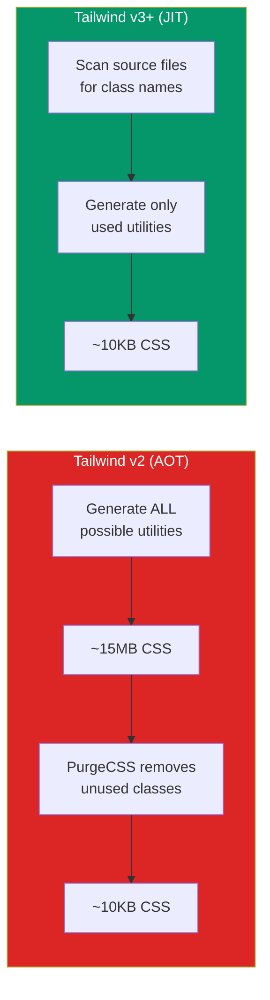

# Tailwind CSS Architecture

Tailwind CSS is not a component library. It is a utility-first CSS framework that generates atomic CSS classes from a design token configuration. Instead of writing `.card { padding: 1rem; border-radius: 0.5rem; box-shadow: ... }`, you write `<div class="p-4 rounded-lg shadow-md">`. This is a fundamental shift in how CSS is authored, and it is either the best idea in frontend development or the worst — depending on whether you understand the architecture behind it.

This page covers the full Tailwind architecture: how the utility-first approach works at scale, how to configure design tokens, how to build reusable component patterns without losing the utility-first advantage, how dark mode works, how the JIT compiler keeps CSS bundles small, and when Tailwind is the wrong choice.

## Utility-First Philosophy

Traditional CSS approaches (BEM, OOCSS, SMACSS) create semantic class names that describe what an element is. Utility-first CSS creates functional class names that describe what an element looks like.

### The Problem with Semantic CSS

```css
/* Traditional approach — semantic class names */
.card {
  padding: 1rem;
  border-radius: 0.5rem;
  background: white;
  box-shadow: 0 1px 3px rgba(0, 0, 0, 0.12);
}

.card--featured {
  border: 2px solid #3b82f6;
}

.card__title {
  font-size: 1.25rem;
  font-weight: 600;
  margin-bottom: 0.5rem;
}

.card__body {
  color: #6b7280;
  line-height: 1.625;
}
```

The problem: every new component requires new CSS. Over time, CSS files grow unbounded because removing unused styles is risky (you never know what is still referenced). The result is CSS files that only grow, never shrink.

### The Utility-First Solution

```html
<!-- Utility-first approach — describe appearance directly -->
<div class="p-4 rounded-lg bg-white shadow-md border-2 border-blue-500">
  <h2 class="text-xl font-semibold mb-2">Card Title</h2>
  <p class="text-gray-500 leading-relaxed">Card body text goes here.</p>
</div>
```

With utilities, adding a new component requires zero new CSS. The same utility classes are reused across every component. The total CSS size is bounded by the number of utility classes you use, not the number of components you build.



## Configuration and Design Tokens

Tailwind's configuration file (`tailwind.config.ts`) is where you define your design system. Every utility class is generated from this configuration.

### Basic Configuration

```typescript
// tailwind.config.ts
import type { Config } from 'tailwindcss';

const config: Config = {
  content: [
    './src/**/*.{js,ts,jsx,tsx,mdx}',
    './components/**/*.{js,ts,jsx,tsx}',
  ],
  theme: {
    // Override defaults entirely
    colors: {
      transparent: 'transparent',
      current: 'currentColor',
      white: '#ffffff',
      black: '#000000',
      // Brand colors with full scale
      brand: {
        50:  '#eff6ff',
        100: '#dbeafe',
        200: '#bfdbfe',
        300: '#93c5fd',
        400: '#60a5fa',
        500: '#3b82f6',  // Primary
        600: '#2563eb',
        700: '#1d4ed8',
        800: '#1e40af',
        900: '#1e3a8a',
        950: '#172554',
      },
      gray: {
        50:  '#f9fafb',
        100: '#f3f4f6',
        200: '#e5e7eb',
        300: '#d1d5db',
        400: '#9ca3af',
        500: '#6b7280',
        600: '#4b5563',
        700: '#374151',
        800: '#1f2937',
        900: '#111827',
        950: '#030712',
      },
      success: '#10b981',
      warning: '#f59e0b',
      error:   '#ef4444',
    },
    extend: {
      // Extend (don't override) defaults
      fontFamily: {
        sans: ['Inter', 'system-ui', 'sans-serif'],
        mono: ['JetBrains Mono', 'monospace'],
      },
      spacing: {
        '18': '4.5rem',
        '88': '22rem',
        '128': '32rem',
      },
      borderRadius: {
        '4xl': '2rem',
      },
      fontSize: {
        '2xs': ['0.625rem', { lineHeight: '0.875rem' }],
      },
      animation: {
        'fade-in': 'fadeIn 0.3s ease-in-out',
        'slide-up': 'slideUp 0.3s ease-out',
      },
      keyframes: {
        fadeIn: {
          '0%': { opacity: '0' },
          '100%': { opacity: '1' },
        },
        slideUp: {
          '0%': { transform: 'translateY(10px)', opacity: '0' },
          '100%': { transform: 'translateY(0)', opacity: '1' },
        },
      },
    },
  },
  plugins: [],
};

export default config;
```

### CSS Custom Properties as Design Tokens

For design tokens that need to be shared between Tailwind and JavaScript (or CSS-in-JS), use CSS custom properties:

```css
/* globals.css */
@tailwind base;
@tailwind components;
@tailwind utilities;

@layer base {
  :root {
    --color-brand: 59 130 246;     /* rgb values for opacity support */
    --color-surface: 255 255 255;
    --color-text: 17 24 39;
    --radius-default: 0.5rem;
    --shadow-default: 0 1px 3px rgb(0 0 0 / 0.1);
  }

  .dark {
    --color-brand: 96 165 250;
    --color-surface: 31 41 55;
    --color-text: 243 244 246;
  }
}
```

```typescript
// tailwind.config.ts — reference CSS custom properties
{
  theme: {
    extend: {
      colors: {
        brand: 'rgb(var(--color-brand) / <alpha-value>)',
        surface: 'rgb(var(--color-surface) / <alpha-value>)',
        'on-surface': 'rgb(var(--color-text) / <alpha-value>)',
      },
    },
  },
}
```

This allows `bg-brand`, `text-brand/50` (with 50% opacity), and `bg-surface` to automatically switch between light and dark mode values.

## Component Patterns

The biggest criticism of Tailwind is that long class strings are hard to maintain. The solution is not to go back to semantic CSS — it is to use component abstractions that keep the utility-first approach.

### Pattern 1: React Components

The simplest pattern — extract repeated class strings into React components:

```tsx
// components/ui/Button.tsx
interface ButtonProps extends React.ButtonHTMLAttributes<HTMLButtonElement> {
  variant?: 'primary' | 'secondary' | 'danger';
  size?: 'sm' | 'md' | 'lg';
}

export function Button({
  variant = 'primary',
  size = 'md',
  className,
  ...props
}: ButtonProps) {
  const baseClasses = 'inline-flex items-center justify-center font-medium rounded-lg transition-colors focus:outline-none focus:ring-2 focus:ring-offset-2';

  const variantClasses = {
    primary:   'bg-brand-600 text-white hover:bg-brand-700 focus:ring-brand-500',
    secondary: 'bg-gray-100 text-gray-700 hover:bg-gray-200 focus:ring-gray-500',
    danger:    'bg-red-600 text-white hover:bg-red-700 focus:ring-red-500',
  };

  const sizeClasses = {
    sm: 'px-3 py-1.5 text-sm',
    md: 'px-4 py-2 text-base',
    lg: 'px-6 py-3 text-lg',
  };

  return (
    <button
      className={`${baseClasses} ${variantClasses[variant]} ${sizeClasses[size]} ${className ?? ''}`}
      {...props}
    />
  );
}
```

### Pattern 2: Class Variance Authority (cva)

`cva` is a library specifically designed for creating variant-based component styles with Tailwind:

```typescript
// components/ui/button.ts
import { cva, type VariantProps } from 'class-variance-authority';

export const buttonVariants = cva(
  // Base classes
  'inline-flex items-center justify-center rounded-lg font-medium transition-colors focus:outline-none focus:ring-2 focus:ring-offset-2 disabled:opacity-50 disabled:pointer-events-none',
  {
    variants: {
      variant: {
        primary:   'bg-brand-600 text-white hover:bg-brand-700 focus:ring-brand-500',
        secondary: 'bg-gray-100 text-gray-700 hover:bg-gray-200 focus:ring-gray-500',
        danger:    'bg-red-600 text-white hover:bg-red-700 focus:ring-red-500',
        ghost:     'hover:bg-gray-100 hover:text-gray-900',
        link:      'text-brand-600 underline-offset-4 hover:underline',
      },
      size: {
        sm: 'h-8 px-3 text-sm',
        md: 'h-10 px-4 text-sm',
        lg: 'h-12 px-6 text-base',
        icon: 'h-10 w-10',
      },
    },
    compoundVariants: [
      {
        variant: 'primary',
        size: 'lg',
        className: 'text-base font-semibold',
      },
    ],
    defaultVariants: {
      variant: 'primary',
      size: 'md',
    },
  }
);

export type ButtonVariants = VariantProps<typeof buttonVariants>;
```

```tsx
// components/ui/Button.tsx
import { buttonVariants, type ButtonVariants } from './button';
import { cn } from '@/lib/utils';

interface ButtonProps
  extends React.ButtonHTMLAttributes<HTMLButtonElement>,
    ButtonVariants {}

export function Button({ variant, size, className, ...props }: ButtonProps) {
  return (
    <button
      className={cn(buttonVariants({ variant, size }), className)}
      {...props}
    />
  );
}
```

### Pattern 3: tailwind-variants

`tailwind-variants` is a more feature-rich alternative to cva with slot support:

```typescript
import { tv } from 'tailwind-variants';

const card = tv({
  slots: {
    base: 'rounded-xl shadow-md overflow-hidden',
    header: 'px-6 py-4 border-b',
    body: 'px-6 py-4',
    footer: 'px-6 py-4 border-t bg-gray-50',
  },
  variants: {
    variant: {
      elevated: { base: 'bg-white shadow-lg' },
      outlined: { base: 'bg-white border border-gray-200 shadow-none' },
      filled:   { base: 'bg-gray-50 shadow-none' },
    },
  },
  defaultVariants: {
    variant: 'elevated',
  },
});

// Usage
const { base, header, body, footer } = card({ variant: 'outlined' });

<div className={base()}>
  <div className={header()}>Title</div>
  <div className={body()}>Content</div>
  <div className={footer()}>Actions</div>
</div>
```

### The `cn()` Utility

The `cn()` function (class name merger) is essential for Tailwind component libraries. It uses `clsx` for conditional classes and `tailwind-merge` to resolve conflicting utilities:

```typescript
// lib/utils.ts
import { clsx, type ClassValue } from 'clsx';
import { twMerge } from 'tailwind-merge';

export function cn(...inputs: ClassValue[]) {
  return twMerge(clsx(inputs));
}

// Usage
cn('px-4 py-2', 'px-6')           // → 'py-2 px-6' (px-6 wins over px-4)
cn('text-red-500', false && 'hidden') // → 'text-red-500'
cn('rounded-lg', className)        // → merges with any override
```

::: warning Why `tailwind-merge` Is Essential
Without `tailwind-merge`, `className="px-4 px-6"` applies both utilities, and the one that appears later in the CSS file wins — which is unpredictable. `tailwind-merge` detects conflicting utilities and keeps only the last one, making component overrides predictable.
:::

## Dark Mode Implementation

Tailwind supports dark mode through a `dark:` variant prefix. There are two strategies:

### Strategy 1: CSS `prefers-color-scheme` (Media Query)

```typescript
// tailwind.config.ts
{ darkMode: 'media' }
```

This uses the user's OS preference. No JavaScript required, but no manual toggle.

### Strategy 2: Class-Based (Recommended)

```typescript
// tailwind.config.ts
{ darkMode: 'class' }
```

This requires adding a `dark` class to the `<html>` element. You control the toggle:

```tsx
// hooks/useTheme.ts
'use client';

import { useEffect, useState } from 'react';

type Theme = 'light' | 'dark' | 'system';

export function useTheme() {
  const [theme, setTheme] = useState<Theme>('system');

  useEffect(() => {
    const stored = localStorage.getItem('theme') as Theme | null;
    if (stored) {
      setTheme(stored);
      applyTheme(stored);
    }
  }, []);

  function applyTheme(newTheme: Theme) {
    const root = document.documentElement;
    const isDark =
      newTheme === 'dark' ||
      (newTheme === 'system' &&
        window.matchMedia('(prefers-color-scheme: dark)').matches);

    root.classList.toggle('dark', isDark);
    localStorage.setItem('theme', newTheme);
  }

  function toggleTheme(newTheme: Theme) {
    setTheme(newTheme);
    applyTheme(newTheme);
  }

  return { theme, toggleTheme };
}
```

### Preventing Flash of Wrong Theme

The theme class must be applied before the page renders, or users see a flash of the wrong theme. Add a blocking script to the `<head>`:

```html
<!-- app/layout.tsx or _document.tsx -->
<head>
  <script dangerouslySetInnerHTML={{ __html: `
    (function() {
      var theme = localStorage.getItem('theme');
      var isDark = theme === 'dark' ||
        (!theme && window.matchMedia('(prefers-color-scheme: dark)').matches);
      if (isDark) document.documentElement.classList.add('dark');
    })();
  `}} />
</head>
```

### Dark Mode Patterns

```html
<!-- Basic dark mode -->
<div class="bg-white dark:bg-gray-900 text-gray-900 dark:text-gray-100">
  <h1 class="text-2xl font-bold text-gray-800 dark:text-white">Title</h1>
  <p class="text-gray-600 dark:text-gray-400">Body text</p>
  <div class="border border-gray-200 dark:border-gray-700 rounded-lg p-4">
    Card content
  </div>
</div>
```

::: tip Semantic Color Tokens
Instead of repeating `dark:bg-gray-900` everywhere, use CSS custom properties (shown in the Configuration section above) so that `bg-surface` automatically resolves to the correct color in both light and dark mode.
:::

## Performance: PurgeCSS and JIT

### The JIT (Just-In-Time) Compiler

Tailwind v3+ uses a JIT compiler that generates CSS on demand as you write classes. This replaced the old approach of generating every possible utility class and then purging unused ones.



JIT benefits:
1. **Development builds are fast** — no purging step, no 15MB CSS in dev
2. **Arbitrary values** — `w-[327px]`, `bg-[#1a2b3c]`, `grid-cols-[1fr_2fr_1fr]`
3. **Every variant combination works** — `hover:first:dark:bg-gray-800` is generated on demand
4. **Build times are 3-5x faster** — only used classes are generated

### Content Configuration

The `content` array tells Tailwind where to look for class names. Misconfiguring this is the most common source of "my styles are not working" bugs:

```typescript
// tailwind.config.ts
{
  content: [
    './src/**/*.{js,ts,jsx,tsx}',     // App source
    './components/**/*.{js,ts,jsx,tsx}', // Component library
    './node_modules/@myorg/ui/**/*.js',  // Shared UI package
    // DO NOT include node_modules broadly — only specific packages
  ],
}
```

::: danger Dynamic Class Names Break JIT
Tailwind scans files as plain text — it does not execute JavaScript. Dynamic class names are invisible to the scanner:

```tsx
// BAD — Tailwind cannot find these classes
const color = 'red';
<div className={`bg-${color}-500`} />  // bg-red-500 is never generated

// GOOD — use complete class names
const colorClasses = {
  red: 'bg-red-500',
  blue: 'bg-blue-500',
  green: 'bg-green-500',
};
<div className={colorClasses[color]} />  // Tailwind finds all three classes
```
:::

### Production Bundle Size

A typical Tailwind production build is 8-15KB gzipped. This is smaller than most component library CSS bundles because:

1. Only used utilities are included
2. Utilities are atomic — `p-4` is defined once, used everywhere
3. Gzip compresses repetitive patterns extremely well

| Approach | Typical Bundle (gzipped) |
|----------|------------------------|
| Tailwind (utility-first) | 8-15KB |
| Bootstrap | 25-35KB |
| Material UI (CSS-in-JS) | 40-80KB |
| Custom CSS (BEM, no purging) | 20-100KB+ |

## Tailwind vs Other Approaches

| Approach | Authoring Speed | Maintenance | Performance | Learning Curve |
|----------|----------------|-------------|-------------|---------------|
| Tailwind (utility-first) | Fast | Low (no CSS to maintain) | Excellent (tiny bundles) | Medium (memorizing utilities) |
| CSS Modules | Medium | Medium (co-located) | Good | Low |
| Styled Components | Medium | Medium | Fair (runtime cost) | Medium |
| Vanilla CSS / BEM | Slow | High (global, grows forever) | Varies | Low |
| CSS-in-JS (Emotion) | Medium | Medium | Fair (runtime cost) | Medium |
| UnoCSS | Fast | Low | Excellent | Medium |

### When NOT to Use Tailwind

1. **You are building a design system consumed by non-React apps** — CSS custom properties and vanilla CSS are more portable
2. **Your team strongly prefers semantic CSS** — fighting the utility-first philosophy leads to worse code than just using BEM
3. **You need complex CSS animations** — while Tailwind supports animations, complex keyframe sequences are better in plain CSS
4. **Highly dynamic styles** — styles that depend on runtime values (e.g., user-specified colors) need CSS custom properties or inline styles, not Tailwind

## Responsive Design

Tailwind uses mobile-first responsive breakpoints:

```html
<!-- Mobile first: base styles apply to all sizes -->
<!-- sm: and up override for larger screens -->
<div class="grid grid-cols-1 sm:grid-cols-2 lg:grid-cols-3 xl:grid-cols-4 gap-4">
  <div class="p-4 text-sm md:text-base lg:text-lg">
    Responsive content
  </div>
</div>
```

| Prefix | Min-width | Typical Device |
|--------|----------|---------------|
| (none) | 0px | Mobile |
| `sm:` | 640px | Large phone / small tablet |
| `md:` | 768px | Tablet |
| `lg:` | 1024px | Laptop |
| `xl:` | 1280px | Desktop |
| `2xl:` | 1536px | Large desktop |

## Cross-References

- [Next.js Patterns](/infrastructure/languages/nextjs-patterns) — Tailwind integration with Next.js
- [TypeScript Advanced Patterns](/infrastructure/languages/typescript-advanced) — typed component props
- [Fastify Deep Dive](/infrastructure/languages/fastify-deep-dive) — backend for your Tailwind frontend

## Summary

Tailwind CSS is an architectural decision, not just a styling library. It inverts the traditional CSS model: instead of creating abstractions over CSS (`.card`, `.btn`), you use CSS directly through utility classes and create abstractions in your component framework (React, Vue, Svelte). The CSS bundle stays small and predictable. The components are the abstraction layer.

The key patterns to internalize:

1. **Push styling into components** — `<Button variant="primary">` instead of `class="btn btn-primary"`
2. **Use `cn()` for class merging** — always merge with `tailwind-merge` to resolve conflicts
3. **Use cva or tailwind-variants for complex variants** — keeps variant logic clean and type-safe
4. **Configure design tokens in `tailwind.config.ts`** — your brand colors, spacing scale, and typography are the design system
5. **Use CSS custom properties for theme switching** — light/dark mode with semantic color tokens
6. **Never use dynamic class names** — always write complete class strings that Tailwind can find at build time
