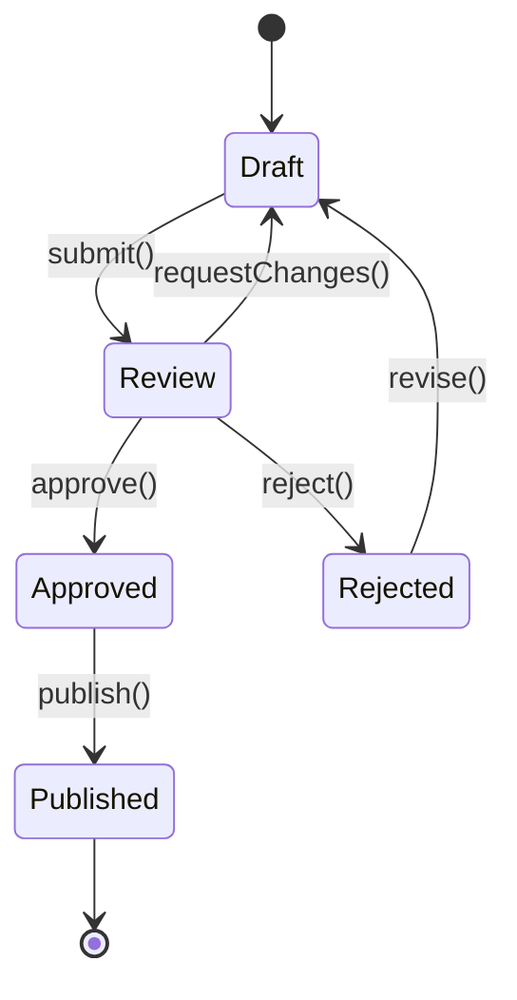

# TypeScript Design Patterns

Design patterns in TypeScript are not just Gang of Four patterns transliterated from Java. TypeScript's structural type system, conditional types, and template literals enable patterns that do not exist in other languages. The patterns on this page use the type system as a design tool — making impossible states unrepresentable, catching logic errors at compile time, and building APIs that guide consumers toward correct usage.

Every pattern here solves a real production problem. If it does not prevent a class of bugs or make an API significantly clearer, it does not belong on this page.

**Related**: [TypeScript Advanced Type System](/infrastructure/languages/typescript-advanced) | [TypeScript Cheat Sheet](/cheat-sheets/typescript)

---

## Type-Safe Builder Pattern

The classic builder pattern in JavaScript returns `this` from every method. But it cannot enforce that required fields were set before calling `.build()`. TypeScript can.

```typescript
// Track which fields have been set at the type level
interface BuilderState {
  host: boolean;
  port: boolean;
  database: boolean;
}

// The builder is generic over its state
class ConnectionBuilder<State extends BuilderState = {
  host: false; port: false; database: false;
}> {
  private config: Partial<{
    host: string;
    port: number;
    database: string;
    ssl: boolean;
    poolSize: number;
  }> = {};

  setHost(host: string): ConnectionBuilder<State & { host: true }> {
    this.config.host = host;
    return this as any;
  }

  setPort(port: number): ConnectionBuilder<State & { port: true }> {
    this.config.port = port;
    return this as any;
  }

  setDatabase(db: string): ConnectionBuilder<State & { database: true }> {
    this.config.database = db;
    return this as any;
  }

  // Optional fields don't change state
  setSsl(ssl: boolean): this {
    this.config.ssl = ssl;
    return this;
  }

  setPoolSize(size: number): this {
    this.config.poolSize = size;
    return this;
  }

  // build() is ONLY available when all required fields are set
  build(
    this: ConnectionBuilder<{ host: true; port: true; database: true }>
  ): ConnectionConfig {
    return this.config as ConnectionConfig;
  }
}

interface ConnectionConfig {
  host: string;
  port: number;
  database: string;
  ssl?: boolean;
  poolSize?: number;
}

// Usage — correct
const config = new ConnectionBuilder()
  .setHost('localhost')
  .setPort(5432)
  .setDatabase('mydb')
  .setSsl(true)
  .build(); // OK — all required fields set

// Usage — compile error
const bad = new ConnectionBuilder()
  .setHost('localhost')
  .build(); // ERROR: 'build' does not exist on type ConnectionBuilder<{ host: true; port: false; database: false }>
```

::: tip
The `this` parameter on `build()` is the key trick. It constrains the method to only be callable when the generic parameter matches the required state. The method does not appear in autocomplete until all required fields are set.
:::

---

## State Machines with Types

Model state machines where invalid transitions are compile errors, not runtime exceptions.



```typescript
// Each state carries its own data shape
type Document =
  | { status: 'draft'; content: string; author: string }
  | { status: 'review'; content: string; author: string; reviewer: string }
  | { status: 'approved'; content: string; author: string; reviewer: string; approvedAt: Date }
  | { status: 'rejected'; content: string; author: string; reviewer: string; reason: string }
  | { status: 'published'; content: string; author: string; publishedAt: Date; url: string };

// Transition functions accept only valid source states
function submit(doc: Extract<Document, { status: 'draft' }>, reviewer: string):
  Extract<Document, { status: 'review' }> {
  return { ...doc, status: 'review', reviewer };
}

function approve(doc: Extract<Document, { status: 'review' }>):
  Extract<Document, { status: 'approved' }> {
  return { ...doc, status: 'approved', approvedAt: new Date() };
}

function reject(doc: Extract<Document, { status: 'review' }>, reason: string):
  Extract<Document, { status: 'rejected' }> {
  return { ...doc, status: 'rejected', reason };
}

function publish(doc: Extract<Document, { status: 'approved' }>, url: string):
  Extract<Document, { status: 'published' }> {
  const { reviewer, approvedAt, ...rest } = doc;
  return { ...rest, status: 'published', publishedAt: new Date(), url };
}

function revise(doc: Extract<Document, { status: 'rejected' }>):
  Extract<Document, { status: 'draft' }> {
  const { reviewer, reason, ...rest } = doc;
  return { ...rest, status: 'draft' };
}

// Valid — transitions compile
const draft: Extract<Document, { status: 'draft' }> = {
  status: 'draft', content: 'Hello', author: 'Alice'
};
const inReview = submit(draft, 'Bob');
const approved = approve(inReview);
const published = publish(approved, '/blog/hello');

// Invalid — compile error
// approve(draft);  // ERROR: draft is not assignable to { status: 'review' }
// publish(inReview); // ERROR: review is not assignable to { status: 'approved' }
```

### Generic State Machine Utility

```typescript
type Transition<From, To> = (state: From) => To;

type StateMachine<States extends Record<string, any>> = {
  [K in keyof States]: {
    transitions: {
      [Target in keyof States]?: (state: States[K]) => States[Target];
    };
  };
};

// Define the machine declaratively
type OrderStates = {
  pending: { orderId: string; items: string[] };
  confirmed: { orderId: string; items: string[]; confirmedAt: Date };
  shipped: { orderId: string; trackingNumber: string; shippedAt: Date };
  delivered: { orderId: string; deliveredAt: Date };
  cancelled: { orderId: string; reason: string; cancelledAt: Date };
};

// Type-safe event dispatcher
class TypedStateMachine<S extends Record<string, any>> {
  constructor(private state: S[keyof S], private status: keyof S) {}

  transition<From extends keyof S, To extends keyof S>(
    from: From,
    to: To,
    fn: (state: S[From]) => S[To]
  ): S[To] {
    if (this.status !== from) {
      throw new Error(`Cannot transition from ${String(this.status)} to ${String(to)}`);
    }
    const newState = fn(this.state as S[From]);
    this.state = newState;
    this.status = to;
    return newState;
  }
}
```

---

## Result and Option Types

Replace `null`, `undefined`, and thrown exceptions with explicit types that force callers to handle both success and failure paths.

### Result Type

```typescript
// Result type — represents success or failure
type Result<T, E = Error> =
  | { readonly ok: true; readonly value: T }
  | { readonly ok: false; readonly error: E };

// Constructor helpers
const Ok = <T>(value: T): Result<T, never> => ({ ok: true, value });
const Err = <E>(error: E): Result<never, E> => ({ ok: false, error });

// Utility functions
function map<T, U, E>(result: Result<T, E>, fn: (value: T) => U): Result<U, E> {
  return result.ok ? Ok(fn(result.value)) : result;
}

function flatMap<T, U, E>(result: Result<T, E>, fn: (value: T) => Result<U, E>): Result<U, E> {
  return result.ok ? fn(result.value) : result;
}

function unwrapOr<T, E>(result: Result<T, E>, defaultValue: T): T {
  return result.ok ? result.value : defaultValue;
}

// Usage — parsing
type ParseError =
  | { type: 'invalid_json'; raw: string }
  | { type: 'missing_field'; field: string }
  | { type: 'invalid_type'; field: string; expected: string; got: string };

function parseUser(raw: string): Result<User, ParseError> {
  let data: any;
  try {
    data = JSON.parse(raw);
  } catch {
    return Err({ type: 'invalid_json', raw });
  }

  if (!data.name) return Err({ type: 'missing_field', field: 'name' });
  if (typeof data.name !== 'string')
    return Err({ type: 'invalid_type', field: 'name', expected: 'string', got: typeof data.name });
  if (!data.email) return Err({ type: 'missing_field', field: 'email' });

  return Ok({ name: data.name, email: data.email });
}

// Caller MUST handle both cases — no uncaught exceptions
const result = parseUser('{"name": "Alice", "email": "a@b.com"}');
if (result.ok) {
  console.log(result.value.name); // TypeScript knows value is User
} else {
  console.error(result.error.type); // TypeScript knows error is ParseError
}
```

### Option Type

```typescript
// Option type — explicit absence instead of null/undefined
type Option<T> = { readonly some: true; readonly value: T } | { readonly some: false };

const Some = <T>(value: T): Option<T> => ({ some: true, value });
const None: Option<never> = { some: false };

function mapOption<T, U>(opt: Option<T>, fn: (value: T) => U): Option<U> {
  return opt.some ? Some(fn(opt.value)) : None;
}

function getOrElse<T>(opt: Option<T>, fallback: () => T): T {
  return opt.some ? opt.value : fallback();
}

// Usage
function findUser(id: string): Option<User> {
  const user = database.get(id);
  return user ? Some(user) : None;
}

const user = findUser('user-123');
const name = getOrElse(
  mapOption(user, u => u.name),
  () => 'Anonymous'
);
```

::: warning
Do not convert your entire codebase to Result/Option overnight. Start with functions that currently throw or return `null` at API boundaries — parsers, validators, database lookups. Internally, functions can still use exceptions for truly exceptional cases (out of memory, programmer errors).
:::

---

## Phantom Types

Phantom types exist only at the type level — they have no runtime representation. They prevent mixing up values that share the same underlying type.

```typescript
// The phantom type parameter V is never used in the value
type Currency<V extends string> = number & { readonly __currency: V };

type USD = Currency<'USD'>;
type EUR = Currency<'EUR'>;
type GBP = Currency<'GBP'>;

// Smart constructors
const usd = (amount: number): USD => amount as USD;
const eur = (amount: number): EUR => amount as EUR;
const gbp = (amount: number): GBP => amount as GBP;

// Type-safe arithmetic — can only add same currencies
function add<C extends string>(a: Currency<C>, b: Currency<C>): Currency<C> {
  return (a + b) as Currency<C>;
}

const total = add(usd(10), usd(20));  // OK — USD + USD
// add(usd(10), eur(20));  // ERROR: USD is not assignable to EUR

// Conversion requires explicit function
function convert<From extends string, To extends string>(
  amount: Currency<From>,
  rate: number,
  _to: To  // phantom parameter for type inference
): Currency<To> {
  return (amount * rate) as Currency<To>;
}

const inEuro = convert(usd(100), 0.92, 'EUR' as const);
```

### Phantom Types for State Tracking

```typescript
// Track whether data has been validated at the type level
declare const validated: unique symbol;
declare const sanitized: unique symbol;

type Unvalidated = { readonly [validated]?: never };
type Validated = { readonly [validated]: true };
type Unsanitized = { readonly [sanitized]?: never };
type Sanitized = { readonly [sanitized]: true };

type UserInput<V, S> = {
  name: string;
  email: string;
  bio: string;
} & V & S;

function validate(
  input: UserInput<Unvalidated, any>
): Result<UserInput<Validated, Unsanitized>, string> {
  if (!input.email.includes('@')) return Err('Invalid email');
  if (input.name.length < 2) return Err('Name too short');
  return Ok(input as UserInput<Validated, Unsanitized>);
}

function sanitize(
  input: UserInput<Validated, Unsanitized>
): UserInput<Validated, Sanitized> {
  return {
    ...input,
    bio: input.bio.replace(/<[^>]*>/g, ''), // strip HTML
  } as UserInput<Validated, Sanitized>;
}

// Database only accepts validated AND sanitized input
function saveUser(input: UserInput<Validated, Sanitized>): void {
  // Safe to persist
}

// Correct pipeline
const raw: UserInput<Unvalidated, Unsanitized> = { name: 'Alice', email: 'a@b.com', bio: '<b>Hi</b>' };
const validResult = validate(raw);
if (validResult.ok) {
  const clean = sanitize(validResult.value);
  saveUser(clean); // OK
}

// Invalid — skipping validation
// saveUser(raw); // ERROR: Unvalidated is not assignable to Validated
```

---

## Exhaustive Switch

Force TypeScript to check that every case in a union is handled. If someone adds a new variant to the union, every switch statement that handles it becomes a compile error.

```typescript
// The never trick — if this function is reachable, the type system has a gap
function assertNever(value: never): never {
  throw new Error(`Unhandled discriminant: ${JSON.stringify(value)}`);
}

type Shape =
  | { kind: 'circle'; radius: number }
  | { kind: 'rectangle'; width: number; height: number }
  | { kind: 'triangle'; base: number; height: number };

function area(shape: Shape): number {
  switch (shape.kind) {
    case 'circle':
      return Math.PI * shape.radius ** 2;
    case 'rectangle':
      return shape.width * shape.height;
    case 'triangle':
      return 0.5 * shape.base * shape.height;
    default:
      return assertNever(shape); // If Shape union grows, this becomes a compile error
  }
}

// Now add a new shape:
// type Shape = ... | { kind: 'pentagon'; sideLength: number };
// ERROR in area(): Argument of type '{ kind: "pentagon"; ... }' is not assignable to parameter of type 'never'
```

### Exhaustive Object Map (Alternative to Switch)

```typescript
// Sometimes a map is cleaner than a switch
type EventType = 'user.created' | 'user.updated' | 'user.deleted' | 'order.placed';

// Record forces every key to be present
const eventLabels: Record<EventType, string> = {
  'user.created': 'User Created',
  'user.updated': 'User Updated',
  'user.deleted': 'User Deleted',
  'order.placed': 'Order Placed',
  // If you add a new EventType, this object becomes a compile error
};

// Handler map with typed payloads
type EventPayloads = {
  'user.created': { userId: string; email: string };
  'user.updated': { userId: string; changes: Record<string, unknown> };
  'user.deleted': { userId: string; reason: string };
  'order.placed': { orderId: string; total: number };
};

type EventHandler<T extends EventType> = (payload: EventPayloads[T]) => void;

// Every event type must have a handler
const handlers: { [K in EventType]: EventHandler<K> } = {
  'user.created': (payload) => console.log(`New user: ${payload.email}`),
  'user.updated': (payload) => console.log(`Updated: ${payload.userId}`),
  'user.deleted': (payload) => console.log(`Deleted: ${payload.userId}, reason: ${payload.reason}`),
  'order.placed': (payload) => console.log(`Order: ${payload.orderId}, $${payload.total}`),
};

// Type-safe dispatch
function dispatch<T extends EventType>(type: T, payload: EventPayloads[T]): void {
  handlers[type](payload);
}

dispatch('user.created', { userId: '1', email: 'a@b.com' }); // OK
// dispatch('user.created', { orderId: '1', total: 99 }); // ERROR: wrong payload
```

---

## Discriminated Union Patterns

### Command Pattern with Discriminated Unions

```typescript
type Command =
  | { type: 'CreateUser'; name: string; email: string }
  | { type: 'UpdateEmail'; userId: string; newEmail: string }
  | { type: 'DeleteUser'; userId: string; reason: string }
  | { type: 'SuspendUser'; userId: string; until: Date };

type CommandResult = {
  CreateUser: { userId: string };
  UpdateEmail: { updated: boolean };
  DeleteUser: { deleted: boolean };
  SuspendUser: { suspendedUntil: Date };
};

// Handler type — each command maps to its specific result
type CommandHandler = <T extends Command>(
  command: T
) => Promise<CommandResult[T['type']]>;

// Implementation with exhaustive handling
async function handleCommand<T extends Command>(
  command: T
): Promise<CommandResult[T['type']]> {
  switch (command.type) {
    case 'CreateUser':
      return { userId: crypto.randomUUID() } as CommandResult[T['type']];
    case 'UpdateEmail':
      return { updated: true } as CommandResult[T['type']];
    case 'DeleteUser':
      return { deleted: true } as CommandResult[T['type']];
    case 'SuspendUser':
      return { suspendedUntil: command.until } as CommandResult[T['type']];
    default:
      return assertNever(command);
  }
}
```

---

## Template Literal Types for API Routes

```typescript
// Type-safe route parameters
type ExtractParams<T extends string> =
  T extends `${string}:${infer Param}/${infer Rest}`
    ? Param | ExtractParams<Rest>
    : T extends `${string}:${infer Param}`
      ? Param
      : never;

// Extract params from route strings
type UserRoute = ExtractParams<'/users/:userId/posts/:postId'>;
// = 'userId' | 'postId'

type Params<T extends string> = Record<ExtractParams<T>, string>;

// Type-safe route handler
function get<Route extends string>(
  route: Route,
  handler: (params: Params<Route>) => Response
): void {
  // register route...
}

get('/users/:userId/posts/:postId', (params) => {
  params.userId;  // OK — autocomplete works
  params.postId;  // OK
  // params.bogus; // ERROR: 'bogus' does not exist
  return new Response('ok');
});
```

---

## Type-Safe Event Emitter

```typescript
type EventMap = {
  'user:login': { userId: string; timestamp: Date };
  'user:logout': { userId: string };
  'error': { code: number; message: string };
  'metrics': { name: string; value: number; tags: Record<string, string> };
};

class TypedEmitter<Events extends Record<string, any>> {
  private listeners = new Map<string, Set<Function>>();

  on<K extends keyof Events & string>(
    event: K,
    listener: (payload: Events[K]) => void
  ): () => void {
    if (!this.listeners.has(event)) {
      this.listeners.set(event, new Set());
    }
    this.listeners.get(event)!.add(listener);

    // Return unsubscribe function
    return () => this.listeners.get(event)?.delete(listener);
  }

  emit<K extends keyof Events & string>(event: K, payload: Events[K]): void {
    this.listeners.get(event)?.forEach(fn => fn(payload));
  }
}

const emitter = new TypedEmitter<EventMap>();

// Fully typed — payload type is inferred from event name
emitter.on('user:login', (data) => {
  console.log(data.userId);    // OK
  console.log(data.timestamp); // OK
});

emitter.emit('user:login', { userId: '1', timestamp: new Date() }); // OK
// emitter.emit('user:login', { code: 500 }); // ERROR: wrong payload type
```

---

## Conditional Types for API Responses

```typescript
// API that returns different shapes based on query parameters
type QueryOptions = {
  include?: ('profile' | 'posts' | 'settings')[];
  format?: 'full' | 'summary';
};

type BaseUser = { id: string; name: string };
type Profile = { avatar: string; bio: string };
type Post = { id: string; title: string };
type Settings = { theme: string; notifications: boolean };

type UserResponse<T extends QueryOptions> =
  BaseUser
  & (T['include'] extends (infer I)[]
    ? (I extends 'profile' ? { profile: Profile } : {})
    & (I extends 'posts' ? { posts: Post[] } : {})
    & (I extends 'settings' ? { settings: Settings } : {})
    : {})
  & (T['format'] extends 'summary' ? {} : { createdAt: Date; updatedAt: Date });

// The return type changes based on the options you pass
async function getUser<T extends QueryOptions>(
  id: string,
  options: T
): Promise<UserResponse<T>> {
  // implementation
  return {} as any;
}

// Usage — return type is precisely what was requested
const user = await getUser('1', {
  include: ['profile', 'posts'],
  format: 'full',
});

user.name;       // OK — always present
user.profile;    // OK — included
user.posts;      // OK — included
user.createdAt;  // OK — full format
// user.settings; // ERROR — not included
```

::: danger
Highly conditional return types are powerful but can become unreadable fast. If you find yourself nesting more than 2-3 conditional types, consider splitting the API into separate functions (`getUserSummary`, `getUserFull`) instead of encoding everything in the type system.
:::

---

## Pattern Summary

| Pattern | Problem Solved | Complexity |
|---------|---------------|------------|
| **Type-Safe Builder** | Required fields enforced at compile time | Medium |
| **State Machines** | Invalid state transitions impossible | Medium |
| **Result/Option** | No uncaught exceptions, explicit error handling | Low |
| **Phantom Types** | Prevent mixing same-shaped but semantically different values | High |
| **Exhaustive Switch** | Missing case handling caught at compile time | Low |
| **Template Literal Types** | Type-safe string patterns (routes, events) | High |
| **Typed Event Emitter** | Event name/payload mismatch impossible | Medium |
| **Conditional Return Types** | API return type matches query parameters | High |

---

## Further Reading

- [TypeScript Advanced Type System](/infrastructure/languages/typescript-advanced) — foundational type-level features these patterns build on
- [Event Schema Evolution](/architecture-patterns/event-driven/event-versioning) — versioning patterns for event-driven systems
- [TypeScript Cheat Sheet](/cheat-sheets/typescript) — quick reference for TypeScript syntax
- [Deno & Bun Runtimes](/infrastructure/languages/deno-bun) — running TypeScript natively without transpilation
