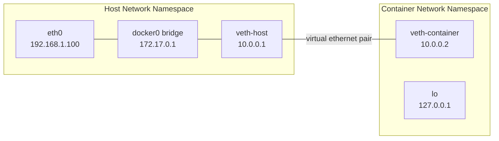
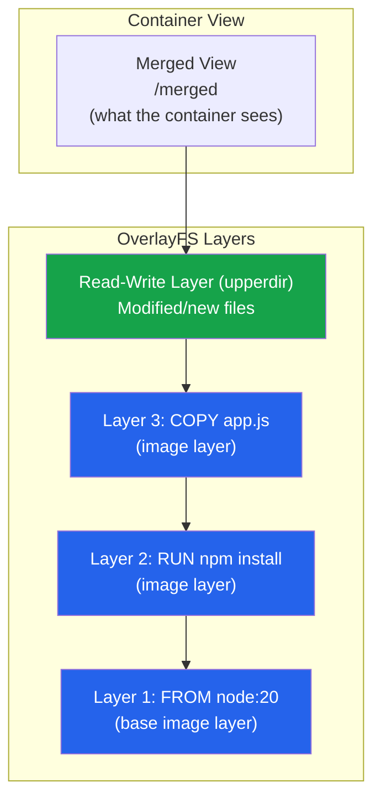
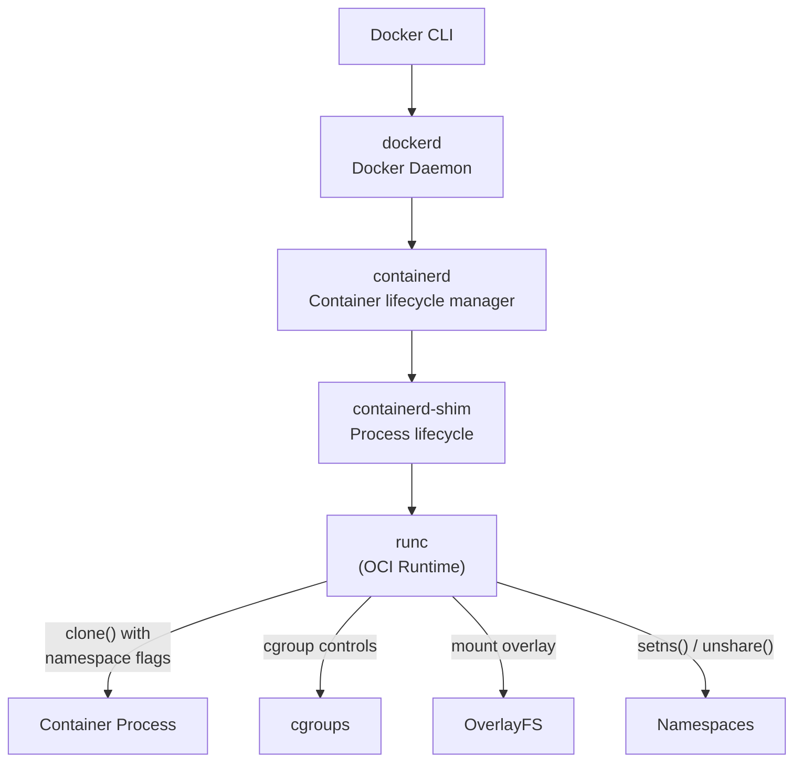

# Containers from Scratch

Containers are not a kernel feature. There is no "container" system call, no "container" kernel module. A container is a combination of three Linux kernel features — **namespaces**, **cgroups**, and **union filesystems** — assembled by user-space tooling to create an isolated process environment that feels like a separate machine.

Understanding this is not just academic. When your container's network doesn't work, you need to know it's a network namespace issue. When the OOM killer strikes inside a container, you need to know it's a cgroup memory limit. When a Docker build layer invalidates unexpectedly, you need to know it's an OverlayFS layer cache miss.

After this page, "container" will be a transparent abstraction. You will know exactly which kernel primitives produce each isolation guarantee, and you will be able to debug container issues at the syscall level.

## Namespaces: Resource Isolation

Namespaces isolate what a process can **see**. Each namespace type makes a process believe it has its own private instance of a global resource.

### The Seven Namespace Types

| Namespace | Flag | Isolates | Kernel Version |
|-----------|------|----------|----------------|
| **PID** | `CLONE_NEWPID` | Process IDs — container sees its own PID 1 | 2.6.24 (2008) |
| **Network** | `CLONE_NEWNET` | Network stack — own interfaces, routing table, iptables | 2.6.29 (2009) |
| **Mount** | `CLONE_NEWNS` | Mount points — own filesystem tree | 2.4.19 (2002) |
| **UTS** | `CLONE_NEWUTS` | Hostname and domain name | 2.6.19 (2006) |
| **IPC** | `CLONE_NEWIPC` | System V IPC, POSIX message queues | 2.6.19 (2006) |
| **User** | `CLONE_NEWUSER` | User and group IDs — root inside, unprivileged outside | 3.8 (2013) |
| **Cgroup** | `CLONE_NEWCGROUP` | Cgroup root directory — hides host cgroup hierarchy | 4.6 (2016) |

### PID Namespace

A PID namespace gives a container its own process ID numbering. The first process in the namespace becomes PID 1 — the init process of the container.

```bash
# Create a new PID namespace
sudo unshare --pid --fork --mount-proc bash

# Inside the namespace:
$ ps aux
USER       PID %CPU %MEM    VSZ   RSS TTY      STAT START   TIME COMMAND
root         1  0.0  0.0  10036  5120 pts/0    S    12:00   0:00 bash
root         2  0.0  0.0  11492  3456 pts/0    R+   12:00   0:00 ps aux

# Only two processes visible — the host's hundreds of processes are hidden
```

From the host, the container's PID 1 has a normal PID in the host's PID namespace (e.g., PID 54321). The mapping is visible in `/proc/<host_pid>/status`:

```
NSpid: 54321    1
```

::: warning PID 1 Responsibilities
PID 1 has special kernel behavior: it does not receive signals that it hasn't explicitly registered handlers for (unlike other processes which get default handlers). This is why sending SIGTERM to a container may not terminate the application if it doesn't handle SIGTERM. Additionally, PID 1 must reap zombie children — see [Process Model](/infrastructure/linux-internals/process-model).
:::

### Network Namespace

A network namespace provides an isolated network stack: its own interfaces, routing table, iptables rules, and socket port space.

```bash
# Create a network namespace
ip netns add container1

# Create a virtual ethernet pair (like a virtual cable)
ip link add veth-host type veth peer name veth-container

# Move one end into the container's namespace
ip link set veth-container netns container1

# Configure the host end
ip addr add 10.0.0.1/24 dev veth-host
ip link set veth-host up

# Configure the container end
ip netns exec container1 ip addr add 10.0.0.2/24 dev veth-container
ip netns exec container1 ip link set veth-container up
ip netns exec container1 ip link set lo up

# Test connectivity
ip netns exec container1 ping 10.0.0.1
```



This is exactly how Docker networking works. Docker creates a bridge (`docker0`), creates a veth pair for each container, and moves one end into the container's network namespace.

### Mount Namespace

A mount namespace gives a container its own mount table. This is how containers get their own root filesystem without affecting the host.

```bash
# Create mount namespace with a new root filesystem
sudo unshare --mount bash

# Mount a minimal rootfs
mount --bind /path/to/rootfs /mnt/container

# Pivot root: make the container rootfs the new root
cd /mnt/container
mkdir -p old_root
pivot_root . old_root
umount -l /old_root
rmdir /old_root

# Now the container sees only its own filesystem
```

### User Namespace

User namespaces map UIDs and GIDs between the container and the host. A process can be root (UID 0) inside the container while being an unprivileged user (e.g., UID 100000) on the host.

```bash
# Create a user namespace where UID 0 (inside) maps to UID 100000 (outside)
unshare --user --map-root-user bash

$ id
uid=0(root) gid=0(root) groups=0(root)
# Looks like root, but on the host this process runs as the original user
```

::: tip Rootless Containers
User namespaces enable **rootless containers** — running Docker or Podman without root privileges on the host. The container process runs as a normal user but has UID 0 inside its user namespace, allowing it to install packages, bind to low ports, and perform other "root" operations without any actual host privilege. This is a significant security improvement.
:::

## cgroups: Resource Limits

While namespaces control what a process can **see**, cgroups control what a process can **use**. Cgroups limit CPU, memory, disk I/O, network bandwidth, and other resources.

### cgroups v1 vs. v2

| Aspect | cgroups v1 | cgroups v2 |
|--------|-----------|-----------|
| Hierarchy | Multiple hierarchies (one per controller) | Single unified hierarchy |
| Controllers | Independent per hierarchy | Coordinated (e.g., memory + I/O pressure) |
| Delegation | Root-only by default | Supports unprivileged delegation |
| Thread support | Limited | Thread-granular control |
| Pressure metrics | No | Yes (`PSI` — Pressure Stall Information) |
| Status | Legacy (still widely used) | Default on modern distributions |

```bash
# Check which version your system uses
stat -fc %T /sys/fs/cgroup/
# "cgroup2fs" → v2
# "tmpfs"     → v1 (or hybrid)
```

### cgroups v2 Controllers

```bash
# List available controllers
cat /sys/fs/cgroup/cgroup.controllers
# cpu cpuset io memory hugetlb pids rdma misc

# Create a cgroup
mkdir /sys/fs/cgroup/my-container

# Enable controllers for the cgroup
echo "+cpu +memory +io +pids" > /sys/fs/cgroup/cgroup.subtree_control
```

#### Memory Controller

```bash
# Hard limit: OOM kill if exceeded
echo 512M > /sys/fs/cgroup/my-container/memory.max

# Soft limit: throttle reclaim above this
echo 256M > /sys/fs/cgroup/my-container/memory.high

# Current usage
cat /sys/fs/cgroup/my-container/memory.current
# 134217728  (128 MB in bytes)

# OOM events
cat /sys/fs/cgroup/my-container/memory.events
# low 0
# high 12
# max 0
# oom 0
# oom_kill 0
```

#### CPU Controller

```bash
# CPU weight (relative share, default 100, range 1-10000)
echo 200 > /sys/fs/cgroup/my-container/cpu.weight

# CPU bandwidth limit: 200ms out of every 1000ms = 20% of one core
echo "200000 1000000" > /sys/fs/cgroup/my-container/cpu.max

# Pin to specific CPUs
echo "0-3" > /sys/fs/cgroup/my-container/cpuset.cpus
```

#### PID Controller

```bash
# Limit maximum number of processes
echo 100 > /sys/fs/cgroup/my-container/pids.max

# Current process count
cat /sys/fs/cgroup/my-container/pids.current
```

#### I/O Controller

```bash
# Throttle disk I/O (device 8:0 = /dev/sda)
# Read: 50 MB/s, Write: 10 MB/s
echo "8:0 rbps=52428800 wbps=10485760" > /sys/fs/cgroup/my-container/io.max
```

### Pressure Stall Information (PSI)

cgroups v2 provides **PSI** — a measure of how much time processes spend stalled waiting for a resource:

```bash
cat /sys/fs/cgroup/my-container/memory.pressure
# some avg10=0.00 avg60=2.50 avg300=1.00 total=15000000
# full avg10=0.00 avg60=0.50 avg300=0.25 total=3000000

# "some" = at least one process stalled
# "full" = ALL processes stalled
# avg10/60/300 = percentage over 10s/60s/300s windows
```

PSI is invaluable for right-sizing containers: if `memory.pressure` shows sustained "some" > 10%, the container needs more memory. If "full" > 0%, workload is severely constrained.

## Union Filesystems: Layered Images

### The Layer Model

Container images are built from read-only layers stacked on top of each other. When a container runs, a thin read-write layer is added on top. This is the **union filesystem** — multiple directories merged into a single view.



### OverlayFS

OverlayFS is the default union filesystem used by Docker and containerd. It merges two directory trees:

- **lowerdir:** Read-only layers (image layers), stacked
- **upperdir:** Read-write layer (container's changes)
- **merged:** The unified view presented to the container
- **workdir:** Internal working directory for OverlayFS

```bash
# Manual OverlayFS mount
mkdir -p lower upper merged work
echo "base file" > lower/file.txt

mount -t overlay overlay \
  -o lowerdir=lower,upperdir=upper,workdir=work \
  merged/

# Read from merged: sees lower's file
cat merged/file.txt    # "base file"

# Write to merged: goes to upper
echo "modified" > merged/file.txt
cat upper/file.txt     # "modified"
cat lower/file.txt     # "base file" (unchanged)
```

**Copy-on-write:** When a container modifies a file from a lower layer, OverlayFS copies the entire file to the upper layer first, then applies the modification. This is called **copy-up** and is the reason writing to large files in lower layers is slow.

**Whiteout files:** When a container deletes a file from a lower layer, OverlayFS creates a **whiteout** — a special character device in the upper layer that hides the lower file. The file still exists in the lower layer (layers are immutable) but is invisible in the merged view.

::: tip Why Docker Build Cache Works
Each Dockerfile instruction creates a layer. If nothing has changed in the instruction or its inputs, Docker reuses the cached layer. When you change line 8 of your Dockerfile, only layers 8+ are rebuilt — layers 1-7 are reused from cache. This is why you should put rarely-changing instructions (OS packages, dependencies) early and frequently-changing instructions (application code) late.
:::

## Building a Container in Go

Here is a minimal container implementation in approximately 100 lines of Go, using only Linux system calls:

```go
package main

import (
    "fmt"
    "os"
    "os/exec"
    "syscall"
)

func main() {
    switch os.Args[1] {
    case "run":
        run()
    case "child":
        child()
    default:
        fmt.Println("Usage: container run <cmd>")
    }
}

func run() {
    fmt.Printf("Running %v as PID %d\n", os.Args[2:], os.Getpid())

    cmd := exec.Command("/proc/self/exe", append([]string{"child"}, os.Args[2:]...)...)
    cmd.Stdin = os.Stdin
    cmd.Stdout = os.Stdout
    cmd.Stderr = os.Stderr

    // Create new namespaces for the child
    cmd.SysProcAttr = &syscall.SysProcAttr{
        Cloneflags: syscall.CLONE_NEWUTS |   // Hostname
                    syscall.CLONE_NEWPID |   // PID
                    syscall.CLONE_NEWNS  |   // Mount
                    syscall.CLONE_NEWNET,    // Network
        Unshareflags: syscall.CLONE_NEWNS,
    }

    must(cmd.Run())
}

func child() {
    fmt.Printf("Child running %v as PID %d\n", os.Args[2:], os.Getpid())

    // Set hostname
    must(syscall.Sethostname([]byte("container")))

    // Set up new root filesystem
    must(syscall.Chroot("/path/to/rootfs"))
    must(syscall.Chdir("/"))

    // Mount /proc (needed for ps, top, etc.)
    must(syscall.Mount("proc", "/proc", "proc", 0, ""))

    // Set up cgroup memory limit
    cgroupPath := "/sys/fs/cgroup/my-container"
    os.MkdirAll(cgroupPath, 0755)
    os.WriteFile(cgroupPath+"/memory.max", []byte("256M"), 0644)
    os.WriteFile(cgroupPath+"/pids.max", []byte("64"), 0644)
    // Add this process to the cgroup
    os.WriteFile(cgroupPath+"/cgroup.procs",
        []byte(fmt.Sprintf("%d", os.Getpid())), 0644)

    // Execute the requested command
    cmd := exec.Command(os.Args[2], os.Args[3:]...)
    cmd.Stdin = os.Stdin
    cmd.Stdout = os.Stdout
    cmd.Stderr = os.Stderr
    must(cmd.Run())

    // Cleanup
    must(syscall.Unmount("/proc", 0))
}

func must(err error) {
    if err != nil {
        fmt.Fprintf(os.Stderr, "Error: %v\n", err)
        os.Exit(1)
    }
}
```

This 80-line program creates a process with its own hostname, PID namespace, mount namespace, network namespace, filesystem root, and memory/PID limits. It is, in essence, a container.

## How Docker / containerd Uses These Primitives

Docker (and its underlying runtime, containerd + runc) does exactly what we did above, plus extensive additional machinery:



| Docker Operation | Kernel Primitives Used |
|-----------------|----------------------|
| `docker run` | `clone()` with CLONE_NEW* flags, cgroup creation, OverlayFS mount, pivot_root |
| `docker exec` | `setns()` to enter existing namespaces, then `execve()` |
| `docker stop` | `kill(SIGTERM)`, then `kill(SIGKILL)` after grace period |
| `docker pause` | `SIGSTOP` via cgroup freezer |
| `docker network connect` | Create veth pair, move one end to container's net namespace |
| Memory limit (`-m 512m`) | `memory.max` in cgroups v2 |
| CPU limit (`--cpus=2`) | `cpu.max` in cgroups v2 |
| Read-only rootfs (`--read-only`) | Mount OverlayFS upperdir as tmpfs or read-only |

### The OCI Runtime Specification

The **Open Container Initiative (OCI)** standardizes the container format. An OCI bundle is a directory containing:

```
my-container/
├── config.json    ← runtime configuration (namespaces, cgroups, mounts, etc.)
└── rootfs/        ← the container's root filesystem
    ├── bin/
    ├── etc/
    ├── lib/
    ├── proc/      (mount point)
    └── ...
```

`config.json` is where all the namespace, cgroup, and mount configurations live. `runc` reads this file and calls the appropriate system calls. Any OCI-compliant runtime (runc, crun, gVisor, Kata Containers) can run the same bundle.

## Security Implications

### What Containers Do NOT Isolate

| Resource | Isolated? | Risk |
|----------|----------|------|
| Kernel | No — containers share the host kernel | Kernel exploit = host compromise |
| `/proc/sys` | Partially — some parameters are namespaced | Container can read host info |
| Time | No — containers share the host clock | Cannot set container timezone via kernel |
| Kernel modules | No — `modprobe` affects the host | Container with CAP_SYS_MODULE can load kernel modules |
| `/dev` devices | Partially — device cgroup controls access | Misconfigured device access = host compromise |

::: danger Containers Are Not VMs
Containers provide process-level isolation, not machine-level isolation. A kernel vulnerability exploited inside a container can compromise the host. For strong isolation (multi-tenant, untrusted code), use:
- **gVisor** — user-space kernel that intercepts system calls
- **Kata Containers** — lightweight VMs with OCI compatibility
- **Firecracker** — microVMs (used by AWS Lambda and Fargate)
:::

## Further Reading

- [Process Model](/infrastructure/linux-internals/process-model) — fork, exec, and process lifecycle that containers build on
- [Memory Management](/infrastructure/linux-internals/memory-management) — cgroup memory limits and OOM killer behavior
- [Docker Internals](/infrastructure/docker/internals) — how Docker assembles these primitives
- [Kubernetes Pod Lifecycle](/infrastructure/kubernetes/pod-lifecycle) — how K8s orchestrates containers
- [Docker Security Hardening](/infrastructure/docker/security-hardening) — production security practices
