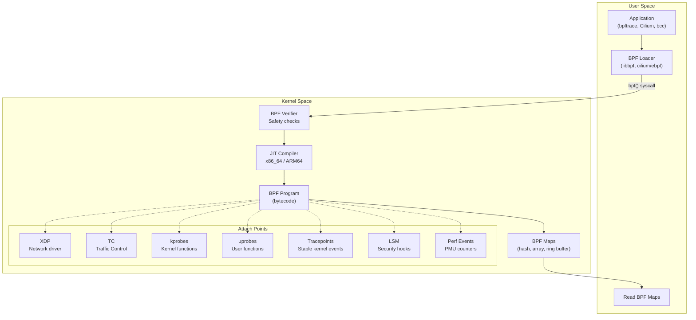
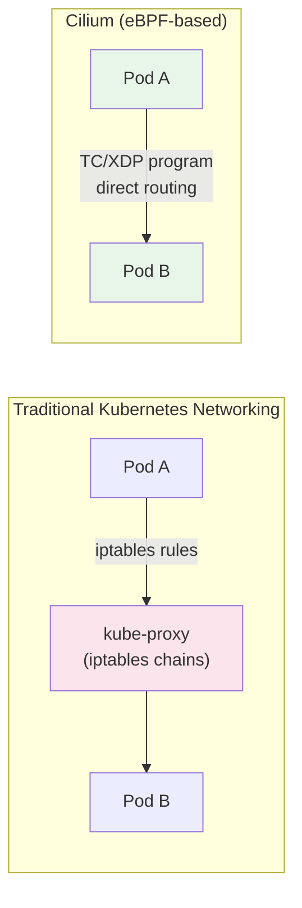

# eBPF -- The Linux Superpower

eBPF (extended Berkeley Packet Filter) is one of the most important innovations in the Linux kernel in the last decade. It allows you to run sandboxed programs inside the kernel without modifying kernel source code or loading kernel modules. This changes everything: networking, observability, security, and performance analysis can be implemented by attaching small programs to kernel events, with safety guarantees enforced by an in-kernel verifier.

Before eBPF, if you wanted to add custom logic to the kernel — trace a function, filter packets at wire speed, enforce a security policy — you had to write a kernel module. Kernel modules are dangerous (a bug crashes the entire machine), require kernel version matching, and take months to deploy through OS update cycles. eBPF programs are safe (the verifier guarantees they cannot crash the kernel), portable (CO-RE — Compile Once, Run Everywhere), and can be loaded in milliseconds.

## Why eBPF Matters

| Before eBPF | With eBPF |
|-------------|-----------|
| Kernel modules for custom packet filtering | eBPF programs attached to network hooks |
| `strace` and `ftrace` for tracing (high overhead) | eBPF kprobes/uprobes (near-zero overhead) |
| iptables for firewall rules (linear chain matching) | XDP/TC programs (O(1) matching, hardware offload) |
| Proprietary kernel patches for security policies | eBPF LSM hooks (runtime policy enforcement) |
| Months to deploy kernel changes | Seconds to load an eBPF program |

### Who Uses eBPF in Production

| Company | Use Case |
|---------|----------|
| Meta (Facebook) | Katran (L4 load balancer), network monitoring at scale |
| Google | GKE Dataplane V2 (Cilium-based), production tracing |
| Netflix | FlameScope, bpftrace-based performance analysis |
| Cloudflare | DDoS mitigation with XDP, packet processing |
| Isovalent/Cilium | Kubernetes CNI, service mesh (no sidecars) |
| Datadog | Continuous profiling, network monitoring agent |

## eBPF Architecture



### How It Works

1. **Write** an eBPF program (C, Rust, or a high-level language like bpftrace)
2. **Compile** to BPF bytecode (LLVM backend)
3. **Load** into the kernel via the `bpf()` system call
4. **Verify** — the in-kernel verifier checks the program for safety
5. **JIT compile** to native machine code (x86_64, ARM64)
6. **Attach** to a hook point (kprobe, tracepoint, XDP, etc.)
7. **Execute** on every event at the hook point
8. **Communicate** results to user space via BPF maps or ring buffers

## eBPF Program Types

### XDP (eXpress Data Path)

XDP programs run at the earliest point in the network stack — before the kernel allocates an `sk_buff`. They operate directly on raw packet data at the network driver level.

```
Packet arrives at NIC
  → XDP program runs (before sk_buff allocation)
    → XDP_PASS: continue normal stack processing
    → XDP_DROP: drop packet (never enters kernel stack)
    → XDP_TX: bounce packet back out same NIC
    → XDP_REDIRECT: send to different NIC or CPU
    → XDP_ABORTED: drop + error trace
```

**Performance:** XDP can process 10-20 million packets per second per core. With hardware offload (NIC runs the BPF program), even higher.

**Use cases:**
- DDoS mitigation — drop attack traffic before it touches the kernel
- Load balancing — Katran (Meta's L4 LB) uses XDP to handle millions of connections
- Packet filtering — Replace iptables for high-performance firewalls

```c
// XDP program: drop all UDP packets to port 9090
SEC("xdp")
int xdp_drop_port(struct xdp_md *ctx) {
    void *data = (void *)(long)ctx->data;
    void *data_end = (void *)(long)ctx->data_end;

    struct ethhdr *eth = data;
    if ((void *)(eth + 1) > data_end)
        return XDP_PASS;

    if (eth->h_proto != htons(ETH_P_IP))
        return XDP_PASS;

    struct iphdr *ip = (void *)(eth + 1);
    if ((void *)(ip + 1) > data_end)
        return XDP_PASS;

    if (ip->protocol != IPPROTO_UDP)
        return XDP_PASS;

    struct udphdr *udp = (void *)(ip + 1);
    if ((void *)(udp + 1) > data_end)
        return XDP_PASS;

    if (udp->dest == htons(9090))
        return XDP_DROP;

    return XDP_PASS;
}
```

### TC (Traffic Control)

TC programs attach to the Linux traffic control layer, operating on `sk_buff` (socket buffers) after XDP. They run on both ingress and egress and can modify packets.

**Use cases:**
- Packet manipulation (NAT, encapsulation, header rewriting)
- Cilium's Kubernetes CNI — pod-to-pod networking via TC programs
- Traffic shaping and policing

### kprobes and kretprobes

kprobes attach to any kernel function entry point. kretprobes attach to function returns. They enable tracing any kernel function without recompiling the kernel.

```python
# bpftrace: trace every time a TCP connection is established
# Count connections by destination port
bpftrace -e '
kprobe:tcp_v4_connect {
    @connect_count[comm] = count();
}
'
```

::: warning kprobes Are Unstable
kprobes attach to kernel function names, which can change between kernel versions. A kprobe that works on kernel 5.15 may break on 6.1 if the function was renamed, moved, or inlined. For stable tracing, prefer tracepoints or BTF-enabled kprobes with CO-RE.
:::

### uprobes

uprobes attach to user-space function entry points. They enable tracing application code without modifying it.

```python
# bpftrace: trace every malloc call and its size
bpftrace -e '
uprobe:/lib/x86_64-linux-gnu/libc.so.6:malloc {
    @malloc_sizes = hist(arg0);
}
'
```

**Use cases:**
- Trace application functions (database queries, HTTP handlers)
- Profile memory allocations
- Continuous profiling (Datadog, Parca, Pyroscope use uprobes)

### Tracepoints

Tracepoints are stable, documented kernel instrumentation points. Unlike kprobes, they have a stable ABI — they do not break across kernel versions.

```python
# bpftrace: trace system calls
bpftrace -e '
tracepoint:syscalls:sys_enter_openat {
    printf("%s opened %s\n", comm, str(args->filename));
}
'
```

Common tracepoint categories:
- `syscalls` — Every system call entry and exit
- `sched` — Scheduler events (context switches, migrations)
- `block` — Block I/O events (read, write, completion)
- `net` — Network events (packet receive, transmit)
- `irq` — Interrupt events

### LSM (Linux Security Module) Hooks

eBPF programs can attach to LSM hooks to enforce security policies at runtime:

```c
SEC("lsm/file_open")
int restrict_file_open(struct file *file) {
    // Deny opening files in /etc/shadow from non-root
    // (simplified — real implementation checks path properly)
    if (current_uid() != 0) {
        // Check if path matches restricted pattern
        // Return -EPERM to deny
    }
    return 0; // Allow
}
```

**Use cases:**
- Runtime security enforcement (Falco, Tetragon)
- Container escape detection
- File access control beyond DAC/MAC

## Verification and Safety Model

The eBPF verifier is what makes eBPF safe. It statically analyzes every possible execution path of a BPF program before allowing it to run in the kernel.

### What the Verifier Checks

| Check | Purpose |
|-------|---------|
| **Bounded loops** | Programs must terminate (no infinite loops). Bounded loops allowed since kernel 5.3. |
| **Memory safety** | All memory accesses are bounds-checked. No out-of-bounds reads/writes. |
| **No null dereferences** | Pointer checks required before dereferencing. |
| **Stack size limit** | Max 512 bytes of stack per program. |
| **Instruction limit** | Max 1 million verified instructions (since kernel 5.2). |
| **Helper function whitelist** | Only approved kernel helper functions callable. |
| **Type safety** | With BTF (BPF Type Format), the verifier checks type correctness. |
| **No uninitialized reads** | All variables must be initialized before use. |

### Verifier Example

```c
// This program will be REJECTED by the verifier:
SEC("xdp")
int bad_program(struct xdp_md *ctx) {
    void *data = (void *)(long)ctx->data;
    struct ethhdr *eth = data;

    // ERROR: No bounds check before accessing eth->h_proto
    // The verifier requires: if ((void *)(eth + 1) > data_end) return XDP_PASS;
    if (eth->h_proto == htons(ETH_P_IP))
        return XDP_DROP;

    return XDP_PASS;
}
```

The verifier will reject this with an error like: `R1 invalid mem access 'inv'` — telling you that `eth` might point beyond the packet boundary.

```c
// This program will be ACCEPTED:
SEC("xdp")
int good_program(struct xdp_md *ctx) {
    void *data = (void *)(long)ctx->data;
    void *data_end = (void *)(long)ctx->data_end;
    struct ethhdr *eth = data;

    // Bounds check required by verifier
    if ((void *)(eth + 1) > data_end)
        return XDP_PASS;

    if (eth->h_proto == htons(ETH_P_IP))
        return XDP_DROP;

    return XDP_PASS;
}
```

::: tip The Verifier Is Your Friend
The verifier errors can be cryptic, but they protect the kernel from crashes. Common fixes:
- Always check pointer bounds before dereferencing
- Limit loop iterations with a compile-time constant
- Use `bpf_probe_read_kernel()` for kernel memory access
- Check return values of helper functions
:::

## BPF Maps

BPF maps are key-value data structures shared between eBPF programs and user space. They are the primary communication mechanism.

### Map Types

| Map Type | Description | Use Case |
|----------|-------------|----------|
| `BPF_MAP_TYPE_HASH` | Hash table | Per-IP counters, connection tracking |
| `BPF_MAP_TYPE_ARRAY` | Fixed-size array | Configuration, per-CPU statistics |
| `BPF_MAP_TYPE_RINGBUF` | Lock-free ring buffer | Event streaming to user space |
| `BPF_MAP_TYPE_PERF_EVENT_ARRAY` | Per-CPU event buffers | High-throughput event output |
| `BPF_MAP_TYPE_LRU_HASH` | Hash with LRU eviction | Connection tables with size limits |
| `BPF_MAP_TYPE_PERCPU_HASH` | Per-CPU hash table | Lock-free counters |
| `BPF_MAP_TYPE_PROG_ARRAY` | Array of BPF programs | Tail calls (program chaining) |
| `BPF_MAP_TYPE_LPM_TRIE` | Longest prefix match trie | IP routing tables |

```c
// Define a hash map counting packets per source IP
struct {
    __uint(type, BPF_MAP_TYPE_HASH);
    __uint(max_entries, 65536);
    __type(key, __u32);   // Source IP (IPv4)
    __type(value, __u64); // Packet count
} packet_count SEC(".maps");

SEC("xdp")
int count_packets(struct xdp_md *ctx) {
    // ... parse packet to get source IP ...
    __u32 src_ip = ip->saddr;

    __u64 *count = bpf_map_lookup_elem(&packet_count, &src_ip);
    if (count) {
        __sync_fetch_and_add(count, 1);
    } else {
        __u64 init = 1;
        bpf_map_update_elem(&packet_count, &src_ip, &init, BPF_ANY);
    }

    return XDP_PASS;
}
```

## CO-RE (Compile Once, Run Everywhere)

Historically, eBPF programs had to be compiled on the target machine to match kernel struct layouts. CO-RE, using BTF (BPF Type Format), solves this:

1. **BTF** encodes type information (struct layouts, field offsets) into the kernel and BPF programs
2. **libbpf** uses BTF to relocate field accesses at load time
3. A program compiled on kernel 5.15 works on kernel 6.1, even if struct layouts changed

```c
// CO-RE: access task_struct->pid without hardcoding offsets
SEC("kprobe/do_sys_openat2")
int trace_open(struct pt_regs *ctx) {
    struct task_struct *task = (void *)bpf_get_current_task();

    // BPF_CORE_READ handles field relocation across kernel versions
    pid_t pid = BPF_CORE_READ(task, pid);
    pid_t tgid = BPF_CORE_READ(task, tgid);

    bpf_printk("PID %d (TGID %d) called openat\n", pid, tgid);
    return 0;
}
```

## Real-World Use Cases

### Networking: Cilium

Cilium is a Kubernetes CNI (Container Network Interface) that replaces iptables-based kube-proxy with eBPF programs:



**Benefits over iptables:**
- O(1) lookup vs. O(n) iptables chain traversal
- Native load balancing without conntrack overhead
- Transparent encryption (WireGuard via eBPF)
- Network policy enforcement at kernel level
- Service mesh without sidecar proxies

### Observability: bpftrace

bpftrace is a high-level tracing language for eBPF, inspired by awk and DTrace:

```bash
# Trace latency of block I/O operations (disk)
bpftrace -e '
tracepoint:block:block_rq_issue {
    @start[args->dev, args->sector] = nsecs;
}
tracepoint:block:block_rq_complete {
    $dur = nsecs - @start[args->dev, args->sector];
    @latency_us = hist($dur / 1000);
    delete(@start[args->dev, args->sector]);
}
'

# Trace DNS lookups
bpftrace -e '
uprobe:/lib/x86_64-linux-gnu/libc.so.6:getaddrinfo {
    printf("%s resolving %s\n", comm, str(arg0));
}
'

# Trace TCP retransmissions
bpftrace -e '
tracepoint:tcp:tcp_retransmit_skb {
    printf("retransmit: %s:%d -> %s:%d\n",
        ntop(args->saddr), args->sport,
        ntop(args->daddr), args->dport);
}
'
```

### Security: Falco and Tetragon

**Falco** uses eBPF to detect runtime security threats:
- Container escape attempts
- Unexpected process execution in containers
- Sensitive file access
- Network connections to suspicious IPs

**Tetragon** (by Isovalent/Cilium) provides security observability and enforcement:

```yaml
# Tetragon policy: alert on container process executing /bin/bash
apiVersion: cilium.io/v1alpha1
kind: TracingPolicy
metadata:
  name: detect-shell-in-container
spec:
  kprobes:
  - call: "sys_execve"
    syscall: true
    args:
    - index: 0
      type: "string"
    selectors:
    - matchArgs:
      - index: 0
        operator: "Equal"
        values:
        - "/bin/bash"
        - "/bin/sh"
```

## Tools Ecosystem

### bcc (BPF Compiler Collection)

A collection of 100+ production-ready eBPF tracing tools:

```bash
# Top processes by I/O
biotop

# Trace file opens by process
opensnoop

# TCP connection latency
tcpconnlat

# DNS request tracing
gethostlatency

# Trace process exec() calls
execsnoop
```

### bpftrace

High-level language for one-liner and short scripts:

```bash
# Installation
apt-get install bpftrace

# One-liners
bpftrace -e 'tracepoint:syscalls:sys_enter_* { @[probe] = count(); }'
bpftrace -e 'profile:hz:99 { @[kstack] = count(); }'
```

### libbpf

The standard C library for loading and interacting with eBPF programs:

```c
#include <bpf/libbpf.h>

// Load and attach a BPF program
struct bpf_object *obj = bpf_object__open_file("program.bpf.o", NULL);
bpf_object__load(obj);

struct bpf_program *prog = bpf_object__find_program_by_name(obj, "trace_open");
struct bpf_link *link = bpf_program__attach(prog);

// Read from a BPF map
int map_fd = bpf_object__find_map_fd_by_name(obj, "packet_count");
__u32 key = 0;
__u64 value;
bpf_map_lookup_elem(map_fd, &key, &value);
```

### Go and Rust Libraries

| Language | Library | Used By |
|----------|---------|---------|
| Go | cilium/ebpf | Cilium, Tetragon, Datadog |
| Go | aquasecurity/libbpfgo | Tracee (Aqua Security) |
| Rust | aya-rs | Increasingly popular for new tools |
| Python | bcc | bcc tools, prototyping |

## Getting Started

### Kernel Requirements

| Feature | Minimum Kernel | Recommended |
|---------|---------------|-------------|
| Basic eBPF | 4.1 | 5.10+ |
| BTF (CO-RE) | 5.2 | 5.10+ |
| Ring buffer | 5.8 | 5.10+ |
| BPF LSM | 5.7 | 5.15+ |
| Bounded loops | 5.3 | 5.10+ |
| Signed programs | 5.17 | 6.1+ |

```bash
# Check if your kernel supports BTF
ls /sys/kernel/btf/vmlinux

# Check BPF subsystem
bpftool feature probe

# List loaded BPF programs
bpftool prog list

# List BPF maps
bpftool map list
```

::: tip Start with bpftrace
If you are new to eBPF, start with `bpftrace`. It lets you write powerful tracing programs in one-liners without dealing with C compilation, libbpf, or the verifier directly. Graduate to libbpf/C when you need production tools or complex programs.
:::

## Further Reading

- [Linux Process Model](/infrastructure/linux-internals/process-model) — Understand processes before tracing them
- [Memory Management](/infrastructure/linux-internals/memory-management) — eBPF for memory debugging
- [Containers from Scratch](/infrastructure/linux-internals/containers-from-scratch) — eBPF + containers
- [Network Policies](/infrastructure/kubernetes/network-policies) — Cilium eBPF-based network policies
- *Learning eBPF* by Liz Rice (O'Reilly) — The best introduction to eBPF
- *BPF Performance Tools* by Brendan Gregg — The definitive reference
- ebpf.io — Official eBPF website and documentation
- Brendan Gregg's blog (brendangregg.com) — The authority on Linux performance and eBPF tracing
- Cilium documentation (docs.cilium.io) — eBPF networking in practice
