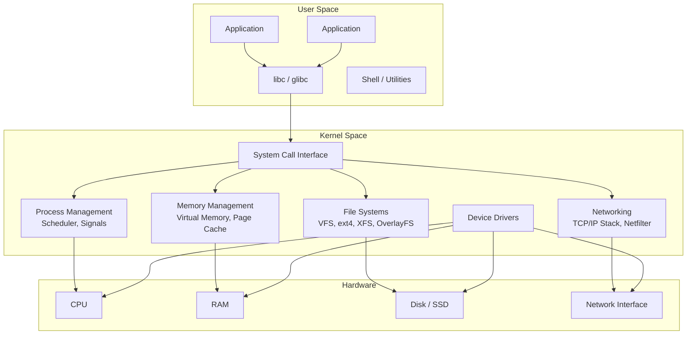
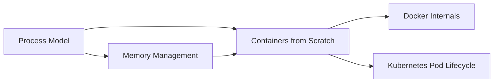

# Linux Internals

Every server you deploy to, every container you run, every cloud VM your code executes on — they all run Linux. Yet most engineers treat the operating system as a black box. They know that `docker run` starts a container but not that containers are just Linux namespaces and cgroups. They know that `kill -9` terminates a process but not why `kill -15` is fundamentally different. They know that the OOM killer sometimes murders their process but not how to predict or prevent it.

This section dismantles the black box. Understanding Linux internals is not an academic exercise — it is a direct path to debugging production issues faster, sizing infrastructure correctly, and building systems that work with the OS instead of against it.

## Why Linux Internals Matter for Application Engineers

| Production Problem | Linux Knowledge That Fixes It |
|---|---|
| Container randomly killed | OOM killer + cgroup memory limits |
| Application latency spikes every 30 seconds | Transparent Huge Pages compaction or swap thrashing |
| Process ignores SIGTERM during shutdown | Signal handling and blocked signal masks |
| Docker build takes 10 minutes | Union filesystem layers and build cache |
| Server runs out of memory but `free` shows available memory | Page cache vs. application memory |
| Cannot bind to port 80 | Capabilities, user namespaces, `CAP_NET_BIND_SERVICE` |
| "Too many open files" | File descriptor limits, ulimits, `/proc/sys/fs/file-max` |

## Kernel Architecture Overview

The Linux kernel is a **monolithic kernel** — all core OS services (scheduling, memory management, file systems, networking, device drivers) run in a single address space in kernel mode. This contrasts with microkernel designs (like Mach) where services run in separate user-space processes.



The monolithic design has a key advantage: communication between kernel subsystems is a direct function call, not an IPC message. This makes Linux fast. The trade-off is that a bug in any kernel subsystem — including third-party device drivers — can crash the entire kernel.

### Loadable Kernel Modules

Linux mitigates the rigidity of a monolithic kernel with **loadable kernel modules** (LKMs). Device drivers, file systems, and networking modules can be compiled separately and loaded/unloaded at runtime without rebooting:

```bash
# List loaded modules
lsmod

# Load a module
modprobe overlay    # OverlayFS for containers

# Remove a module
modprobe -r overlay
```

## User Space vs. Kernel Space

The CPU enforces a hardware boundary between user space and kernel space using **protection rings** (x86) or **exception levels** (ARM).

| Aspect | User Space | Kernel Space |
|--------|-----------|-------------|
| CPU privilege | Ring 3 (lowest) | Ring 0 (highest) |
| Memory access | Only process's own virtual memory | All physical memory |
| Hardware access | None — must go through kernel | Direct access to all devices |
| Crash impact | Only the process dies | Entire system crashes (kernel panic) |
| Code | Applications, libraries | Kernel, drivers, modules |

A user-space process cannot directly access hardware, read another process's memory, or modify kernel data structures. Every privileged operation requires a **system call** — a controlled transition from user space to kernel space.

### The Cost of a System Call

A system call is not free. The transition involves:

1. **Software interrupt** (or `SYSCALL` instruction on x86-64): switches CPU from Ring 3 to Ring 0
2. **Save user-space registers** to the kernel stack
3. **Kernel handler executes** the requested operation
4. **Restore registers** and switch back to Ring 3

The overhead is roughly **100-300 nanoseconds** on modern hardware. This sounds trivial, but a program that makes millions of system calls per second (e.g., a web server doing many small reads) can spend significant time in transition overhead.

::: tip Reducing System Call Overhead
- `io_uring` — Linux's modern async I/O interface batches multiple I/O operations into a single system call using shared ring buffers between user space and kernel space
- `epoll` — monitors thousands of file descriptors with a single system call (used by nginx, Node.js, and every high-performance server)
- `mmap` — maps files directly into the process's address space, turning I/O into memory access (no read/write system calls)
- `vDSO` — the kernel maps a small shared library into every process that handles simple, read-only system calls (`gettimeofday`, `clock_gettime`) entirely in user space
:::

## System Calls

System calls are the API between user applications and the Linux kernel. There are approximately 450 system calls in Linux. The most important categories:

### Process Management

| System Call | Purpose |
|------------|---------|
| `fork()` | Create a child process (copy of parent) |
| `execve()` | Replace current process image with a new program |
| `wait4()` | Wait for a child process to change state |
| `exit_group()` | Terminate all threads in the process |
| `clone()` | Create a new process or thread with fine-grained control |
| `kill()` | Send a signal to a process |

### File I/O

| System Call | Purpose |
|------------|---------|
| `open()` / `openat()` | Open a file, return a file descriptor |
| `read()` / `write()` | Transfer data to/from a file descriptor |
| `close()` | Release a file descriptor |
| `mmap()` | Map a file into memory |
| `ioctl()` | Device-specific control operations |
| `io_uring_enter()` | Submit/complete async I/O operations |

### Memory Management

| System Call | Purpose |
|------------|---------|
| `brk()` | Adjust the program break (heap boundary) |
| `mmap()` | Map memory pages (files, anonymous memory, shared memory) |
| `mprotect()` | Change protection on memory pages |
| `madvise()` | Advise kernel on expected memory access patterns |

### Networking

| System Call | Purpose |
|------------|---------|
| `socket()` | Create a communication endpoint |
| `bind()` | Assign an address to a socket |
| `listen()` | Mark a socket as accepting connections |
| `accept()` | Accept an incoming connection |
| `connect()` | Initiate a connection |
| `sendmsg()` / `recvmsg()` | Send/receive messages with advanced options |
| `epoll_wait()` | Wait for events on multiple file descriptors |

### Tracing System Calls

```bash
# Trace all system calls made by a command
strace -c ls /tmp
# Output: summary table of system call counts, errors, and time

# Trace system calls of a running process
strace -p <PID> -f -e trace=network
# -f: follow forks (child processes)
# -e trace=network: only network-related system calls
```

`strace` is one of the most powerful debugging tools in Linux. When an application fails mysteriously, attaching `strace` reveals exactly what system calls it is making — and which one is failing.

## Section Overview

This section covers four core areas of Linux internals, each building on the previous:

### [Process Model](/infrastructure/linux-internals/process-model)

How Linux creates, schedules, and terminates processes. The `fork`/`exec` model, the Completely Fair Scheduler, signals, process groups, and the `/proc` filesystem. Essential for understanding why your application behaves the way it does under load.

### [Memory Management](/infrastructure/linux-internals/memory-management)

Virtual memory, page tables, TLB, `malloc` internals, the OOM killer, shared memory, copy-on-write, and cgroups memory limits. Essential for understanding why your container was killed and how to prevent it.

### [Containers from Scratch](/infrastructure/linux-internals/containers-from-scratch)

Namespaces, cgroups, union filesystems, and how Docker/containerd use these primitives to create containers. After this page, "containers" will be a transparent abstraction rather than magic.

## How These Topics Connect



The process model explains how programs run. Memory management explains how they use RAM. Containers combine both — namespaces isolate the process model, cgroups limit memory and CPU, and union filesystems provide the file system. Once you understand all three, Docker and Kubernetes become simple orchestration layers on top of kernel primitives.

## Quick Reference: Essential Commands

| Command | Purpose | Example |
|---------|---------|---------|
| `strace` | Trace system calls | `strace -p 1234 -e trace=file` |
| `ltrace` | Trace library calls | `ltrace -p 1234` |
| `perf` | CPU profiling, tracing | `perf top`, `perf record -g` |
| `top` / `htop` | Process monitoring | `htop -p 1234` |
| `vmstat` | Virtual memory statistics | `vmstat 1` (every 1 second) |
| `iostat` | Disk I/O statistics | `iostat -x 1` |
| `ss` | Socket statistics | `ss -tlnp` (listening TCP) |
| `ip` | Network configuration | `ip addr show` |
| `dmesg` | Kernel ring buffer | `dmesg -T \| tail -50` |
| `/proc` | Process and kernel info | `cat /proc/<pid>/status` |
| `nsenter` | Enter a namespace | `nsenter -t <pid> -n ip addr` |
| `unshare` | Create new namespaces | `unshare --pid --fork bash` |

## Further Reading

- [Process Model](/infrastructure/linux-internals/process-model) — fork, exec, scheduling, signals
- [Memory Management](/infrastructure/linux-internals/memory-management) — virtual memory, OOM killer, cgroups
- [Containers from Scratch](/infrastructure/linux-internals/containers-from-scratch) — namespaces, cgroups, OverlayFS
- [Docker Internals](/infrastructure/docker/internals) — how Docker uses these kernel primitives
- [Kubernetes Pod Lifecycle](/infrastructure/kubernetes/pod-lifecycle) — how K8s manages Linux processes
