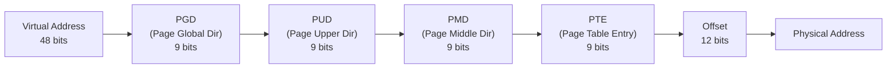
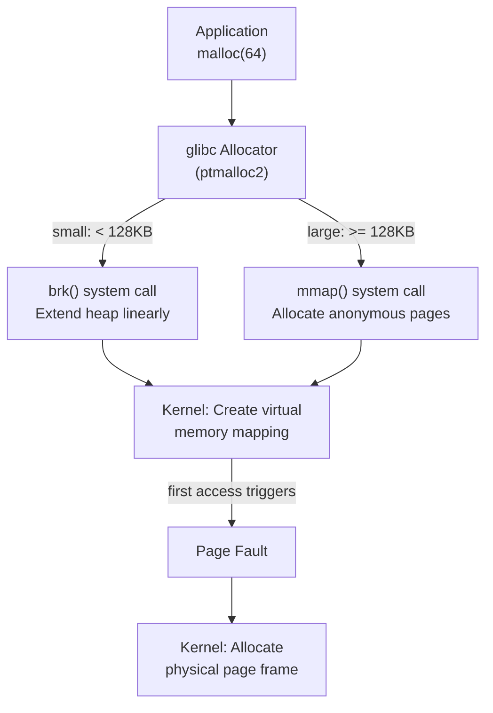

# Linux Memory Management

Memory management is where most production incidents hide. Your container gets OOM-killed at 3 AM. Your Java application pauses for 10 seconds during garbage collection and the load balancer marks it as unhealthy. Your database performance degrades because the OS page cache was evicted by a batch job. Your application "leaks" memory that `top` does not show because it is in the kernel's slab cache.

Understanding how Linux manages memory — from virtual addresses to physical pages to the OOM killer's decision algorithm — gives you the tools to predict, prevent, and debug these failures.

## Virtual Memory

### The Abstraction

Every process sees its own private, contiguous address space starting at address 0 and extending to the architecture's limit (128 TB on x86-64 with 4-level page tables). This is **virtual memory** — an illusion maintained by the CPU's Memory Management Unit (MMU) and the kernel's page tables.

```
Process A's view:                Physical RAM:
┌─────────────────┐ 0xFFFF...   ┌─────────────────┐
│ Kernel space     │             │ Page frame 0    │ ← Kernel
├─────────────────┤             │ Page frame 1    │ ← Process A stack
│ Stack ↓          │             │ Page frame 2    │ ← Process B code
│                  │             │ Page frame 3    │ ← Process A heap
│                  │             │ Page frame 4    │ ← Shared lib (libc)
│ Heap ↑           │             │ Page frame 5    │ ← Process B heap
│ BSS (zero-init)  │             │ ...             │
│ Data (init)      │             │ Page frame N    │ ← Page cache
│ Code (text)      │             └─────────────────┘
├─────────────────┤
│ (unmapped)       │
└─────────────────┘ 0x0000...
```

Virtual memory provides three guarantees:

1. **Isolation:** Process A cannot see or modify Process B's memory
2. **Abstraction:** Processes do not need to know where their data physically lives
3. **Overcommit:** The kernel can promise more memory than physically exists

### Page Tables

The MMU translates virtual addresses to physical addresses using a **page table** — a multi-level tree structure. On x86-64, the page table has 4 or 5 levels:



Each page table entry maps a **4 KB page** of virtual memory to a physical page frame. The entry also contains permission bits (read, write, execute), a present bit (is this page in physical RAM?), and a dirty bit (has the page been modified?).

### Translation Lookaside Buffer (TLB)

Walking a 4-level page table for every memory access would be catastrophically slow (4 extra memory accesses per actual access). The CPU caches recent translations in the **TLB** — a small, extremely fast associative cache.

| TLB Type | Typical Size | Miss Penalty |
|----------|-------------|--------------|
| L1 DTLB | 64 entries | ~7 cycles |
| L1 ITLB | 128 entries | ~7 cycles |
| L2 STLB | 1536 entries | ~12 cycles |
| Page table walk (TLB miss) | N/A | ~100+ cycles |

TLB misses are expensive. For applications with large working sets (databases, JVM applications), TLB misses can become a significant performance bottleneck.

::: tip Huge Pages Reduce TLB Pressure
Standard pages are 4 KB. With a 1536-entry TLB, you can cover 6 MB of memory before TLB misses begin. **Huge pages** (2 MB or 1 GB) cover 3 GB or 1.5 TB respectively, dramatically reducing TLB misses for large applications.

```bash
# Enable transparent huge pages (automatic)
echo always > /sys/kernel/mm/transparent_hugepage/enabled

# Or allocate explicit huge pages
echo 1024 > /proc/sys/vm/nr_hugepages  # Reserve 1024 × 2MB = 2GB

# Application uses them via mmap with MAP_HUGETLB flag
```

Be cautious with Transparent Huge Pages (THP) — the kernel's background compaction process (`khugepaged`) can cause latency spikes in latency-sensitive applications like [Redis](/system-design/databases/redis-internals) and databases.
:::

## malloc Internals

### How Applications Allocate Memory

When your application calls `malloc(size)`, it does NOT directly call a system call. The C library (glibc) maintains a user-space memory allocator that manages a pool of memory obtained from the kernel.



Key points:

1. **`brk()`** extends the heap — a contiguous region of virtual memory. Small allocations come from the heap. The heap only grows; it rarely shrinks (freed memory stays in the allocator's free list).

2. **`mmap()`** creates a new virtual memory mapping for large allocations. When the allocation is freed, `munmap()` returns the memory to the kernel immediately.

3. **Demand paging:** The kernel does NOT allocate physical memory when `brk()` or `mmap()` is called. Physical pages are allocated only when the process first accesses the virtual address, triggering a **page fault**.

### The Free List

When you call `free()`, the memory is usually NOT returned to the kernel. Instead, the allocator adds it to a free list for future `malloc()` calls. This is why a process's **RSS** (Resident Set Size) in `top` rarely decreases — even after freeing memory.

```bash
# RSS shows physical memory usage
# VSZ shows virtual memory (including not-yet-accessed pages)
ps -o pid,rss,vsz,comm -p <pid>
```

::: warning Memory Fragmentation
The heap can become fragmented over time — many small free blocks between allocated blocks, unable to satisfy a large allocation. This is a common cause of "memory leaks" that are not actually leaks: the allocator holds fragmented free memory that cannot be returned to the OS.

Solutions:
- Use `jemalloc` or `tcmalloc` — modern allocators with better fragmentation behavior
- Use `malloc_trim()` to force glibc to return free memory to the OS
- Restart the process periodically (the blunt but effective approach)
:::

## Memory Overcommit

### The Overcommit Strategy

Linux, by default, allows processes to allocate more virtual memory than physically exists. This is **overcommit** — and it is the reason the OOM killer exists.

| Overcommit Mode | `/proc/sys/vm/overcommit_memory` | Behavior |
|----------------|----------------------------------|----------|
| **Heuristic (default)** | 0 | Kernel allows "reasonable" overcommit; rejects obviously excessive requests |
| **Always** | 1 | Never deny any allocation request. The kernel optimistically assumes memory will be available when needed. |
| **Never** | 2 | Only allow total committed memory up to swap + (RAM × `overcommit_ratio`). `malloc()` can fail. |

Why does Linux overcommit? Because most memory allocations are never fully used. A process may `mmap()` 1 GB of virtual memory but only touch 100 MB of it. Without overcommit, the kernel would have to reserve 1 GB of physical memory for a process that only needs 100 MB.

```bash
# Check current overcommit settings
cat /proc/sys/vm/overcommit_memory    # 0, 1, or 2
cat /proc/sys/vm/overcommit_ratio     # default 50 (percent of RAM)

# Check committed memory
grep -i commit /proc/meminfo
# CommitLimit:    16384000 kB
# Committed_AS:   8192000 kB
```

## The OOM Killer

When the kernel cannot satisfy a memory allocation and there is no more swap space, it invokes the **Out-Of-Memory (OOM) Killer**. The OOM killer selects a process to kill and frees its memory.

### How the OOM Killer Chooses Its Victim

The kernel assigns an **OOM score** (0-1000) to every process based on:

1. **Memory usage:** The percentage of total memory consumed. Higher memory usage = higher score.
2. **Process age:** Newer processes get slightly higher scores (they have had less time to produce useful work).
3. **Nice value:** Lower-priority processes get higher scores.
4. **oom_score_adj:** A per-process tunable (-1000 to 1000). Set to -1000 to make a process immune. Set to 1000 to make it the first to be killed.

```bash
# View a process's OOM score
cat /proc/<pid>/oom_score

# Protect a critical process from OOM killer
echo -1000 > /proc/<pid>/oom_score_adj

# Make a process the first to be killed
echo 1000 > /proc/<pid>/oom_score_adj
```

### OOM in Containers (cgroups)

In a containerized environment, the OOM killer operates at the cgroup level. Each container has a memory limit set via cgroups. When the container exceeds its limit, the kernel kills a process inside that container — NOT a process from another container or the host.

```bash
# Set container memory limit (cgroups v2)
echo 512M > /sys/fs/cgroup/<cgroup>/memory.max

# Check if the cgroup has experienced OOM
cat /sys/fs/cgroup/<cgroup>/memory.events
# oom 3          → OOM killer invoked 3 times
# oom_kill 3     → 3 processes killed
```

::: danger Common OOM Killer Misconception
The OOM killer does not kill the process that made the final allocation that exceeded memory. It kills the process with the highest OOM score — which is usually the largest memory consumer. This means your application may be killed because a co-located batch job consumed too much memory. In Kubernetes, always set memory limits on every container to isolate blast radius.
:::

### Detecting OOM Kills

```bash
# Kernel log (dmesg)
dmesg | grep -i "oom\|killed process"

# Example output:
# [12345.678] Out of memory: Killed process 4567 (java) total-vm:8192000kB,
#   anon-rss:4096000kB, file-rss:1024kB, shmem-rss:0kB, oom_score_adj:0

# Docker logs
docker inspect <container_id> | grep OOMKilled
# "OOMKilled": true
```

## Page Cache

Linux uses **all** available free memory as a page cache — a cache of file data that has been read from or written to disk. This is not "used" memory in the application sense; it is opportunistic caching that dramatically improves I/O performance.

```bash
$ free -h
              total    used    free    shared  buff/cache   available
Mem:           31Gi    8.2Gi   512Mi    256Mi       22Gi       22Gi
Swap:          8.0Gi   0.0Gi   8.0Gi
```

In this example, only 8.2 GB is genuinely used by applications. The 22 GB in "buff/cache" is page cache — it will be reclaimed immediately if an application needs memory. The **available** column (22 GB) is the true indicator of how much memory is available for new applications.

::: warning Do Not Alert on "Low Free Memory"
A healthy Linux server should have nearly zero "free" memory — it means the page cache is actively caching file data. Alert on "low available memory" instead, or on high swap usage.
:::

## Shared Memory and Copy-on-Write

### Shared Memory (shm)

Multiple processes can map the same physical pages into their address spaces using:

- **`mmap()` with `MAP_SHARED`** — changes are visible to all processes and written back to the file
- **POSIX shared memory** (`shm_open` + `mmap`) — named shared memory segments
- **System V shared memory** (`shmget` + `shmat`) — legacy but still widely used

Shared memory is the fastest IPC mechanism because there is no data copying — processes read and write directly to the same physical pages.

### Copy-on-Write Revisited

When `fork()` creates a child process, the parent's page table entries are duplicated, but the physical pages are shared. Both page tables point to the same physical frames, marked as read-only. When either process writes to a page:

1. The CPU triggers a **page fault** (write to read-only page)
2. The kernel allocates a new physical page
3. The kernel copies the contents of the old page to the new one
4. The writing process's page table is updated to point to the new page
5. The page is marked as writable

This means `fork()` is O(page_table_size), not O(memory_size). For a process with 4 GB of mapped memory, `fork()` copies page table entries (~8 MB), not the 4 GB of data.

::: tip Redis and COW
[Redis](/system-design/databases/redis-internals) uses `fork()` for background persistence (BGSAVE and BGAOFREWRITE). The child process writes the dataset to disk while the parent continues serving requests. COW means the child initially shares all of the parent's memory. As the parent modifies data, only modified pages are copied. If the write rate is low, the memory overhead of the snapshot is minimal. If the write rate is high, memory usage can temporarily double.
:::

## Swap

When physical memory is exhausted, the kernel can evict less-recently-used pages to a **swap** device (a disk partition or file). When the process accesses a swapped-out page, a **page fault** brings it back from disk — at ~1000x the latency of a RAM access.

### Swappiness

The `vm.swappiness` parameter (0-200, default 60) controls how aggressively the kernel swaps:

| Value | Behavior |
|-------|----------|
| 0 | Only swap to avoid OOM (do not swap to make room for page cache) |
| 1 | Minimal swapping — strongly prefer evicting page cache |
| 60 | Default — balance between swapping and evicting page cache |
| 100 | Swap and page cache eviction are treated equally |
| 200 | Aggressively swap (cgroups v2 only) |

```bash
# Set swappiness
sysctl vm.swappiness=10

# For databases and latency-sensitive apps: minimize swapping
echo "vm.swappiness = 1" >> /etc/sysctl.conf
```

::: tip Disable Swap in Kubernetes
Kubernetes recommends disabling swap on worker nodes. The kubelet's memory accounting assumes that memory limits are enforced by cgroups (which do not account for swap by default). With swap enabled, a container can exceed its memory limit by swapping, which defeats resource isolation. Starting with Kubernetes 1.28+, there is experimental swap support with `NodeSwap` feature gate if explicitly configured.
:::

## cgroups Memory Limits

Control groups (cgroups) allow you to limit and account for the memory usage of a group of processes. This is how Docker and Kubernetes enforce container memory limits.

### cgroups v2 Memory Controls

```bash
# Set a hard memory limit (OOM kill if exceeded)
echo 512M > /sys/fs/cgroup/<cgroup>/memory.max

# Set a soft limit (throttle reclaim, not kill)
echo 256M > /sys/fs/cgroup/<cgroup>/memory.high

# Set a minimum memory guarantee (protect from reclaim)
echo 128M > /sys/fs/cgroup/<cgroup>/memory.min

# Include/exclude swap
echo 512M > /sys/fs/cgroup/<cgroup>/memory.swap.max
```

| Control | Behavior |
|---------|----------|
| `memory.max` | Hard limit. Exceeding triggers OOM within the cgroup. |
| `memory.high` | Soft limit. Exceeding triggers aggressive reclaim (slows the process) but does not kill. |
| `memory.min` | Protected memory. Kernel will not reclaim pages below this threshold. |
| `memory.low` | Best-effort protection. Kernel prefers to reclaim from other cgroups. |

### Kubernetes Memory Limits

```yaml
resources:
  requests:
    memory: "256Mi"   # Scheduling guarantee (memory.low)
  limits:
    memory: "512Mi"   # Hard limit (memory.max)
```

- **Request** affects scheduling — the pod is placed on a node with at least 256 Mi available
- **Limit** triggers OOM kill — if the container exceeds 512 Mi, the kernel kills it

::: warning Set Requests Close to Limits
If `requests` is much lower than `limits`, the scheduler packs many pods onto a node based on requests. Under load, all pods try to use their full limit, exceeding the node's physical memory, and the OOM killer starts randomly killing pods. Set requests to 80-100% of limits for predictable behavior.
:::

## Debugging Memory Issues

### Tool Reference

| Tool | Purpose | Command |
|------|---------|---------|
| `free -h` | System memory overview | `free -h` |
| `vmstat` | Virtual memory statistics | `vmstat 1` |
| `smem` | Per-process proportional memory (PSS) | `smem -tk` |
| `pmap` | Process memory map | `pmap -x <pid>` |
| `/proc/meminfo` | Detailed kernel memory breakdown | `cat /proc/meminfo` |
| `/proc/<pid>/smaps` | Per-VMA memory details | `cat /proc/<pid>/smaps_rollup` |
| `valgrind` | Memory leak detection | `valgrind --leak-check=full ./app` |

### "Where Did My Memory Go?"

```bash
# Step 1: System overview
free -h

# Step 2: Top memory consumers
ps aux --sort=-%mem | head -20

# Step 3: Detailed breakdown for a process
# PSS = Proportional Set Size (shared memory divided among sharers)
cat /proc/<pid>/smaps_rollup
# Rss:             4096000 kB   ← physical memory
# Pss:             3072000 kB   ← proportional (shared pages split)
# Swap:                  0 kB   ← swapped out memory

# Step 4: Check for memory fragmentation
cat /proc/buddyinfo

# Step 5: Check kernel slab usage (kmalloc, dentry cache, inode cache)
slabtop
```

## Further Reading

- [Process Model](/infrastructure/linux-internals/process-model) — fork, COW, and process lifecycle
- [Containers from Scratch](/infrastructure/linux-internals/containers-from-scratch) — cgroups and namespace memory isolation
- [Redis Internals](/system-design/databases/redis-internals) — COW implications for Redis persistence
- [Kubernetes Pod Lifecycle](/infrastructure/kubernetes/pod-lifecycle) — memory limits and OOM behavior in K8s
