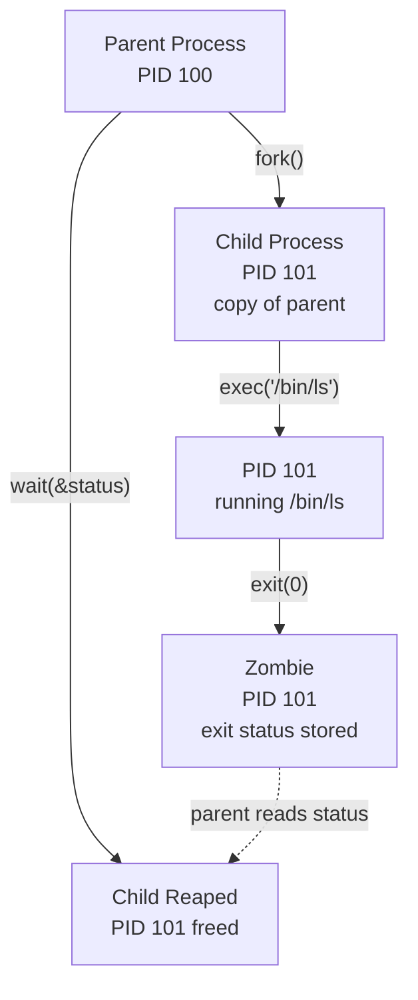
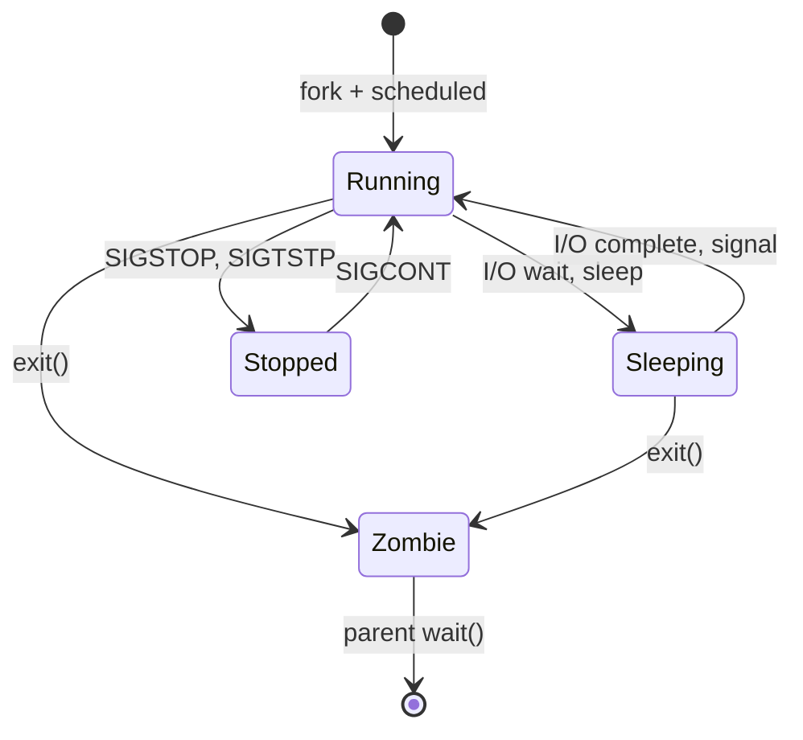
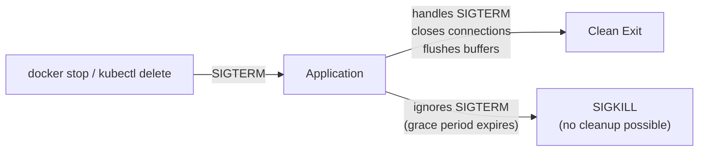

# Linux Process Model

Every program running on a Linux system is a process. Your web server, your database, your shell, the `ls` command you just ran — all processes. Understanding the Linux process model is foundational because every higher-level abstraction — threads, containers, orchestrators — is built on top of it.

A process is not just "a running program." It is a kernel-managed entity with its own virtual address space, file descriptor table, signal handlers, resource limits, scheduling priority, and security context. The kernel's job is to give each process the illusion that it has the entire machine to itself, while actually sharing the CPU, memory, and I/O across hundreds or thousands of processes.

## Process Lifecycle

### fork() and exec()

Linux creates new processes using a two-step model inherited from Unix:

1. **`fork()`** — Creates a new process (child) that is an almost exact copy of the calling process (parent). The child gets a copy of the parent's address space, file descriptors, signal handlers, and environment. The only differences: the child gets a new PID, and `fork()` returns 0 to the child and the child's PID to the parent.

2. **`exec()`** — Replaces the current process's memory image with a new program. The PID stays the same, but the code, data, stack, and heap are replaced entirely.

```c
#include <unistd.h>
#include <stdio.h>
#include <sys/wait.h>

int main() {
    pid_t pid = fork();

    if (pid == 0) {
        // Child process
        // Replace this process with "ls -la"
        execl("/bin/ls", "ls", "-la", NULL);
        // execl only returns on error
        perror("execl failed");
        return 1;
    } else if (pid > 0) {
        // Parent process
        int status;
        waitpid(pid, &status, 0);  // Wait for child to finish
        printf("Child exited with status %d\n", WEXITSTATUS(status));
    } else {
        perror("fork failed");
        return 1;
    }
    return 0;
}
```



### Why fork() + exec() Instead of spawn()?

This two-step design seems wasteful — why copy the entire parent just to replace it? The answer is that the gap between `fork()` and `exec()` is where you set up the child's environment:

```c
pid_t pid = fork();
if (pid == 0) {
    // Between fork and exec: set up the child
    close(STDOUT_FILENO);            // Close stdout
    open("output.log", O_WRONLY);    // Redirect stdout to file
    setuid(1000);                    // Drop privileges
    chdir("/app");                   // Change working directory
    execl("/app/server", "server", NULL);
}
```

This is how shells implement I/O redirection, background processes, and pipelines. It is also how Docker sets up a container's environment before running the entrypoint.

### Copy-on-Write

Modern Linux does not actually copy the parent's entire address space on `fork()`. Instead, both parent and child share the same physical memory pages, marked as read-only. Only when either process tries to write to a page does the kernel create a private copy (a **page fault** triggers the copy). This is called **copy-on-write** (COW).

For processes that `fork()` and immediately `exec()`, COW means almost zero memory is copied — the child's address space is replaced before any writes happen.

::: tip vfork() and posix_spawn()
`vfork()` is an even more aggressive optimization — the child shares the parent's address space entirely (no COW) and the parent is suspended until the child calls `exec()` or `_exit()`. `posix_spawn()` combines `fork()` and `exec()` into a single operation for common cases. Both exist for performance, but `fork()` + `exec()` remains the standard pattern.
:::

## Process States

A process transitions through several states during its lifetime:



| State | Code | Meaning |
|-------|------|---------|
| **Running** | R | Either executing on CPU or in the run queue, ready to execute |
| **Sleeping (Interruptible)** | S | Waiting for an event (I/O, timer, signal). Can be woken by signals. Most processes are in this state most of the time. |
| **Sleeping (Uninterruptible)** | D | Waiting for I/O that cannot be interrupted. Cannot be killed — not even by `SIGKILL`. Common during disk I/O and NFS operations. |
| **Stopped** | T | Stopped by a signal (SIGSTOP, SIGTSTP). Can be resumed with SIGCONT. |
| **Zombie** | Z | Process has exited, but the parent has not yet called `wait()` to read the exit status. The process table entry still exists. |

### Zombie Processes

When a process exits, its memory and resources are freed, but its entry in the process table remains until the parent reads the exit status with `wait()`. This entry is a **zombie**.

A few zombies are harmless. But if a parent process never calls `wait()` (a common bug in daemon code), zombies accumulate and eventually exhaust the system's process table.

```bash
# Find zombie processes
ps aux | awk '$8 == "Z"'

# The fix: ensure the parent calls wait(), or set SIGCHLD to SIG_IGN
# (tells the kernel to automatically reap children)
```

::: warning Container Init Problem
In a Docker container, the entrypoint process runs as PID 1. PID 1 has a special responsibility: it must reap orphaned zombie children. If your application does not handle SIGCHLD, zombies accumulate inside the container. Use a lightweight init like `tini` (Docker's `--init` flag) or `dumb-init` to solve this.
:::

## The Completely Fair Scheduler (CFS)

The Linux scheduler decides which process gets CPU time. Since Linux 2.6.23, the default scheduler is the **Completely Fair Scheduler** (CFS).

### How CFS Works

CFS maintains a per-CPU **red-black tree** of runnable tasks, sorted by **virtual runtime** (`vruntime`). Virtual runtime tracks how much CPU time a process has consumed, weighted by its priority (nice value).

```
Red-black tree of runnable tasks (sorted by vruntime):

        [vruntime: 50ms]
       /                \
  [vruntime: 30ms]   [vruntime: 70ms]
  /            \
[vruntime: 10ms] [vruntime: 40ms]
                    ← leftmost = next to run
```

The scheduler always picks the task with the **lowest vruntime** — the one that has received the least CPU time relative to its weight. After a task runs for its time slice, its vruntime increases, and it is re-inserted into the tree. Tasks with higher nice values (lower priority) have their vruntime increased faster, so they get less CPU time.

### Nice Values and Priorities

| Nice Value | Priority | CPU Share (relative) |
|-----------|----------|---------------------|
| -20 | Highest | ~88,761 (weight) |
| 0 | Default | 1,024 |
| 19 | Lowest | 15 |

```bash
# Run a process with low priority
nice -n 10 ./batch-job

# Change priority of a running process
renice -n 5 -p 1234

# View process priorities
ps -eo pid,ni,comm | head
```

### Real-Time Scheduling

CFS handles normal (SCHED_NORMAL) tasks. For latency-critical workloads, Linux provides real-time scheduling classes:

| Policy | Behavior |
|--------|----------|
| `SCHED_FIFO` | Fixed priority, runs until it voluntarily yields or a higher-priority task arrives |
| `SCHED_RR` | Round-robin among tasks of the same priority |
| `SCHED_DEADLINE` | Earliest deadline first — task specifies runtime, deadline, and period |

::: danger Real-Time Processes Can Starve the System
A `SCHED_FIFO` process at priority 99 that does not yield will prevent ALL other processes from running, including the shell you need to kill it. Always set `sched_rt_runtime_us` (default: 950000) to reserve some CPU for non-RT tasks.
:::

## Signals

Signals are the Unix mechanism for asynchronous notification. They can be sent by the kernel (hardware faults, child process events) or by other processes (`kill` command).

### Signal Types

| Signal | Number | Default Action | Purpose |
|--------|--------|---------------|---------|
| `SIGTERM` | 15 | Terminate | Graceful shutdown request. Can be caught and handled. |
| `SIGKILL` | 9 | Terminate | Forceful kill. **Cannot be caught, blocked, or ignored.** |
| `SIGINT` | 2 | Terminate | Interrupt from keyboard (Ctrl+C) |
| `SIGHUP` | 1 | Terminate | Terminal hangup. Often used to reload config. |
| `SIGCHLD` | 17 | Ignore | Child process stopped or terminated |
| `SIGSTOP` | 19 | Stop | Stop process. **Cannot be caught.** |
| `SIGCONT` | 18 | Continue | Resume stopped process |
| `SIGSEGV` | 11 | Core dump | Segmentation fault (invalid memory access) |
| `SIGPIPE` | 13 | Terminate | Write to pipe with no reader |
| `SIGUSR1` | 10 | Terminate | User-defined signal 1 |
| `SIGUSR2` | 12 | Terminate | User-defined signal 2 |

### Signal Handling in Applications

```c
#include <signal.h>
#include <stdio.h>
#include <unistd.h>

volatile sig_atomic_t running = 1;

void handle_sigterm(int sig) {
    printf("Received SIGTERM, shutting down gracefully...\n");
    running = 0;  // Set flag to exit main loop
}

int main() {
    struct sigaction sa;
    sa.sa_handler = handle_sigterm;
    sa.sa_flags = 0;
    sigemptyset(&sa.sa_mask);
    sigaction(SIGTERM, &sa, NULL);

    while (running) {
        // Main application loop
        sleep(1);
    }

    // Cleanup: close connections, flush buffers, etc.
    printf("Cleanup complete, exiting.\n");
    return 0;
}
```

### SIGTERM vs. SIGKILL: The Container Shutdown Sequence

When Kubernetes sends a pod a termination signal, or when `docker stop` runs:

1. **SIGTERM** is sent to PID 1 in the container
2. A grace period starts (default 30 seconds in K8s)
3. If the process is still running after the grace period, **SIGKILL** is sent



::: warning Your Application MUST Handle SIGTERM
If your application ignores SIGTERM, it will be killed with SIGKILL after the grace period. SIGKILL cannot be caught — no cleanup runs, no connections are closed gracefully, no in-flight requests are completed. This causes dropped requests, corrupted files, and database connection leaks.
:::

## Process Groups and Sessions

### Process Groups

Every process belongs to a **process group**. A process group is a collection of related processes — typically all the processes in a shell pipeline.

```bash
# This creates a process group with three members:
cat file.txt | grep "error" | wc -l
# cat, grep, and wc are all in the same process group
```

Signals can be sent to an entire process group with `kill -<signal> -<pgid>` (negative PID). When you press Ctrl+C, the terminal sends SIGINT to the **foreground process group** — which is why all three processes in a pipeline stop, not just one.

### Sessions and Controlling Terminal

A **session** is a collection of process groups. A session is created when a user logs in and typically contains all processes launched from that terminal.

```
Session (SID 1000)
├── Process Group 1000 (login shell)
│   └── bash (PID 1000, PGID 1000)
├── Process Group 1001 (foreground job)
│   ├── vim (PID 1001, PGID 1001)
├── Process Group 1002 (background job)
│   ├── make (PID 1002, PGID 1002)
│   └── gcc (PID 1003, PGID 1002)
```

### Daemons

A daemon is a background process that is not attached to any terminal. Creating a daemon traditionally requires:

1. `fork()` and have the parent exit (detach from shell)
2. `setsid()` to create a new session (no controlling terminal)
3. `fork()` again (prevent reacquiring a terminal)
4. Change working directory to `/`
5. Close stdin/stdout/stderr (or redirect to /dev/null)
6. Write PID to a pidfile

Modern Linux uses **systemd** for daemon management, which handles all of this automatically.

## The /proc Filesystem

`/proc` is a virtual filesystem that exposes kernel data structures as files. It is the primary interface for inspecting process and system state.

### Per-Process Information

```bash
# Process status (memory, state, threads)
cat /proc/<pid>/status

# Memory map (every mapped region)
cat /proc/<pid>/maps

# File descriptors (what files are open)
ls -la /proc/<pid>/fd/

# Command line arguments
cat /proc/<pid>/cmdline | tr '\0' ' '

# Environment variables
cat /proc/<pid>/environ | tr '\0' '\n'

# Current working directory
readlink /proc/<pid>/cwd

# Executable path
readlink /proc/<pid>/exe

# I/O statistics
cat /proc/<pid>/io

# Scheduling information
cat /proc/<pid>/sched

# Namespace IDs (container debugging)
ls -la /proc/<pid>/ns/
```

### System-Wide Information

| Path | Contents |
|------|----------|
| `/proc/cpuinfo` | CPU model, cores, cache sizes, flags |
| `/proc/meminfo` | Detailed memory usage breakdown |
| `/proc/loadavg` | 1, 5, 15 minute load averages |
| `/proc/sys/` | Tunable kernel parameters (sysctl) |
| `/proc/sys/vm/overcommit_memory` | Memory overcommit policy |
| `/proc/sys/fs/file-max` | System-wide file descriptor limit |
| `/proc/sys/net/core/somaxconn` | Maximum socket listen backlog |

### Tuning Kernel Parameters

```bash
# Temporary (until reboot)
echo 1 > /proc/sys/net/ipv4/ip_forward
sysctl -w net.core.somaxconn=65535

# Persistent (survives reboot)
echo "net.core.somaxconn = 65535" >> /etc/sysctl.conf
sysctl -p
```

## Threads vs. Processes

In Linux, threads and processes are nearly identical. Both are created with the `clone()` system call. The difference is what they share:

| Resource | Separate Process (`fork`) | Thread (`pthread_create`) |
|----------|--------------------------|--------------------------|
| Address space | Separate (COW) | Shared |
| File descriptors | Copied | Shared |
| Signal handlers | Copied | Shared |
| PID | Different | Different TID, same TGID (shown as PID) |
| Scheduling | Independent | Independent |

From the kernel's perspective, every thread is a **task** (`task_struct`). The scheduler does not distinguish between threads and processes — it schedules tasks.

```bash
# View threads of a process
ps -T -p <pid>
# or
ls /proc/<pid>/task/

# Thread count
cat /proc/<pid>/status | grep Threads
```

## Practical Debugging Workflows

### "Why Is This Process Using So Much CPU?"

```bash
# 1. Identify the process
top -o %CPU

# 2. Profile it (sample CPU stack traces for 10 seconds)
perf record -g -p <pid> -- sleep 10
perf report

# 3. Or use strace to see what system calls it's making
strace -c -p <pid> -f
```

### "Why Is This Process Stuck?"

```bash
# 1. Check the process state
cat /proc/<pid>/status | grep State
# If "D" (uninterruptible sleep): stuck in kernel I/O

# 2. Check what it's waiting on
cat /proc/<pid>/wchan
# Shows the kernel function where it's sleeping

# 3. Check the kernel stack
cat /proc/<pid>/stack
```

### "Why Was My Process Killed?"

```bash
# Check the kernel log for OOM killer messages
dmesg | grep -i "oom\|killed"

# Check cgroup memory limits (for containers)
cat /sys/fs/cgroup/memory/<cgroup>/memory.limit_in_bytes
cat /sys/fs/cgroup/memory/<cgroup>/memory.usage_in_bytes
```

## Further Reading

- [Memory Management](/infrastructure/linux-internals/memory-management) — virtual memory, OOM killer, cgroups memory
- [Containers from Scratch](/infrastructure/linux-internals/containers-from-scratch) — how namespaces and cgroups build on the process model
- [Docker Internals](/infrastructure/docker/internals) — how Docker manages process lifecycles
- [Kubernetes Pod Lifecycle](/infrastructure/kubernetes/pod-lifecycle) — signal handling and graceful shutdown in K8s
