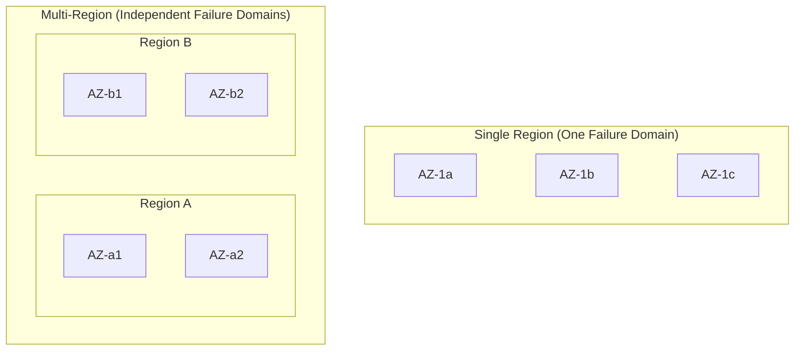
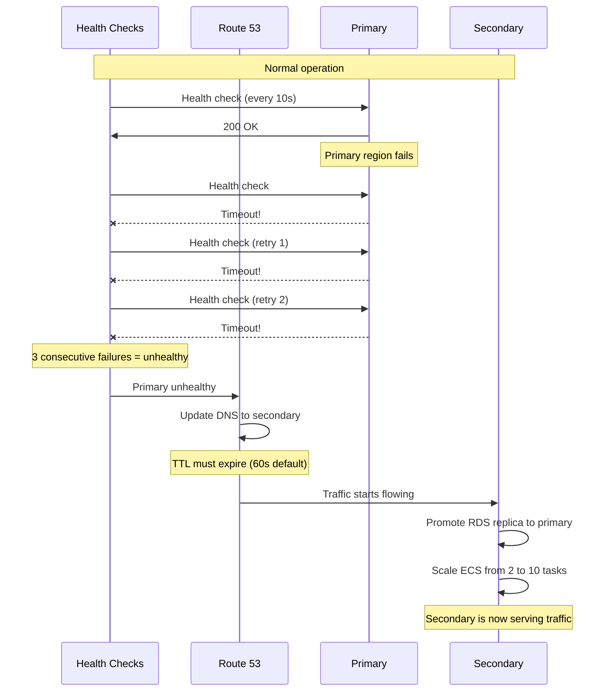
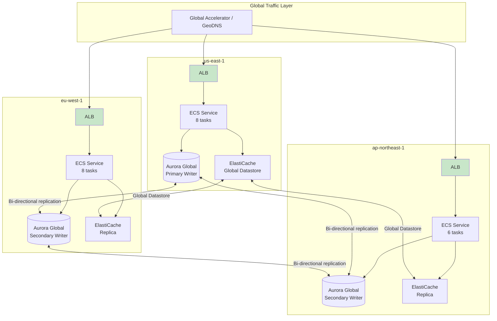
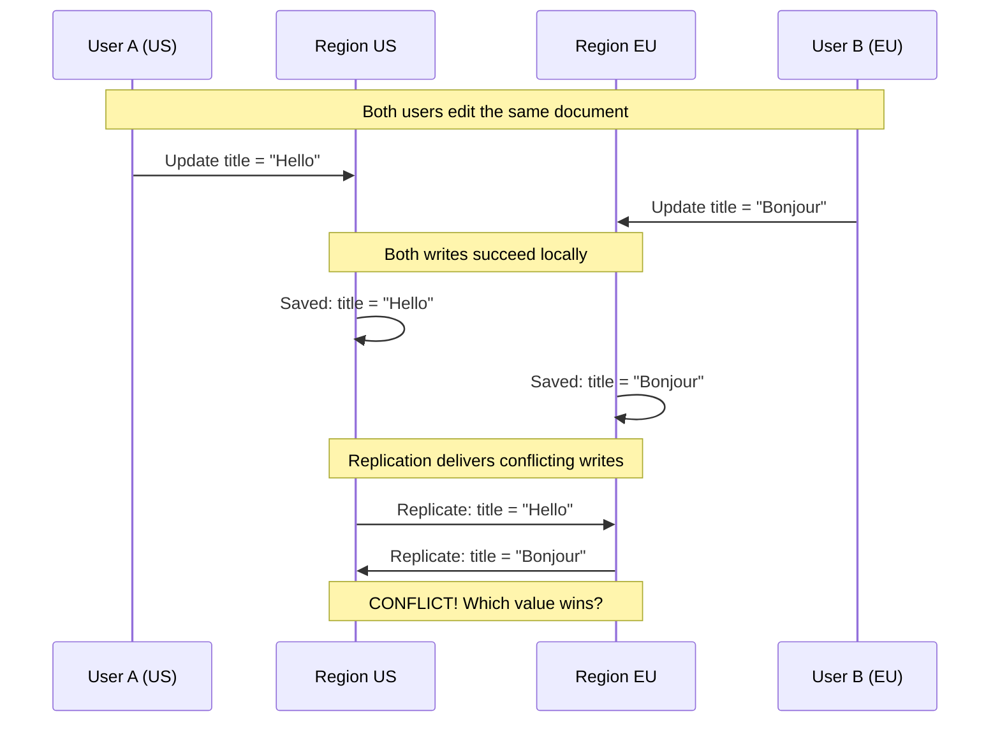
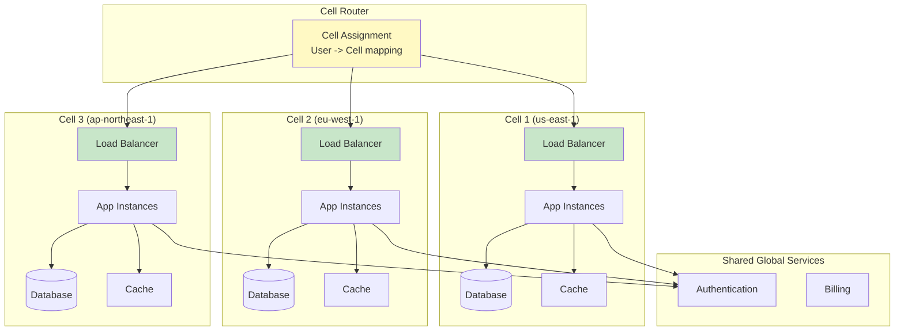
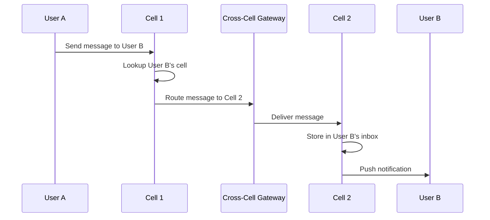
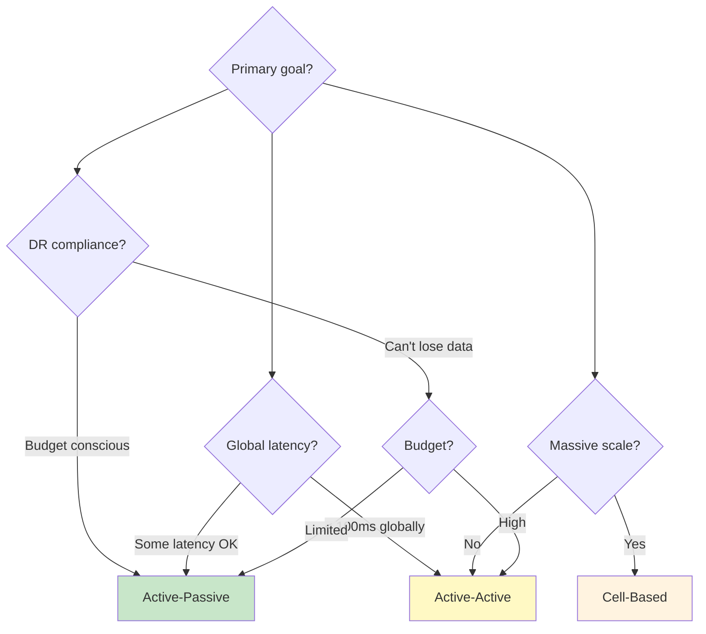

# Multi-Region Architecture Patterns

## Why Architecture Patterns Matter

Choosing the wrong multi-region pattern can cost millions in unnecessary infrastructure, create intractable data consistency problems, or worse — provide a false sense of safety that collapses during the very outage it was designed to survive.

Each pattern represents a specific trade-off between cost, complexity, consistency, and recovery guarantees. Understanding these trade-offs from first principles — rather than cargo-culting a pattern from a FAANG blog post — is the difference between a multi-region architecture that works and one that fails when you need it most.

### The Three Fundamental Patterns

| Pattern | Description | RPO | RTO | Cost | Use Case |
|---------|-------------|-----|-----|------|----------|
| Active-Passive | One region serves traffic; another waits | Minutes | Minutes-Hours | 1.3-1.5x | DR compliance |
| Active-Active | All regions serve traffic simultaneously | Seconds | Seconds | 2.0-2.5x | Global performance |
| Cell-Based | Users partitioned into independent cells | Zero | Seconds | 2.0-3.0x | Massive scale |

## First Principles

### Failure Domain Theory

A **failure domain** is the set of components that fail together. Multi-region architecture creates isolated failure domains:



**Failure domain hierarchy** (from smallest to largest):
1. **Process**: Single container/VM failure
2. **Host**: Physical machine failure
3. **Rack**: Power/network switch failure
4. **Availability Zone**: Datacenter-level failure (fire, power, cooling)
5. **Region**: Geographic area failure (natural disaster, fiber cut)
6. **Cloud Provider**: Provider-wide failure (control plane bug)
7. **Global**: Internet-level disruption (BGP hijack, DNS root)

### The Blast Radius Equation

The expected downtime from a failure event is:

$$
E[\text{downtime}] = P(\text{failure}) \times T_{\text{recovery}} \times \text{Blast Radius}
$$

Where Blast Radius is the fraction of users/requests affected:

| Architecture | Blast Radius of Region Failure | Expected Annual Downtime |
|-------------|-------------------------------|------------------------|
| Single region | 100% | $0.001 \times 24 \times 365 \times 1.0 = 8.76$ hours |
| Active-passive | 100% (during failover) -> 0% | $0.001 \times 0.5 \times 365 \times 1.0 = 1.83$ hours |
| Active-active | 50% (instant failover) | $0.001 \times 0.01 \times 365 \times 0.5 = 0.02$ hours |
| Cell-based (10 cells) | 10% | $0.001 \times 0.01 \times 365 \times 0.1 = 0.004$ hours |

## Core Mechanics

### Pattern 1: Active-Passive

In active-passive, one region handles all production traffic while the secondary region receives replicated data and stands ready to take over.

```mermaid
graph TB
    subgraph "DNS"
        DNS[Route 53<br/>Health-checked routing]
    end

    subgraph "Primary: us-east-1 (Active)"
        ALB1[ALB]
        ECS1[ECS Service<br/>10 tasks]
        RDS1[(RDS Primary<br/>Multi-AZ)]
        REDIS1[ElastiCache<br/>Primary]
    end

    subgraph "Secondary: eu-west-1 (Passive)"
        ALB2[ALB]
        ECS2[ECS Service<br/>2 tasks &#40;warm&#41;]
        RDS2[(RDS Read Replica<br/>Cross-region)]
        REDIS2[ElastiCache<br/>Replica]
    end

    DNS -->|All traffic| ALB1
    DNS -.->|Failover| ALB2
    ALB1 --> ECS1
    ECS1 --> RDS1
    ECS1 --> REDIS1
    ALB2 --> ECS2
    ECS2 --> RDS2
    ECS2 --> REDIS2
    RDS1 -->|Async replication| RDS2

    style ALB1 fill:#c8e6c9
    style ALB2 fill:#ffcdd2
```

**Failover process**:



**Implementation**:

```typescript
// src/failover/active-passive-controller.ts
interface FailoverConfig {
  primaryRegion: string;
  secondaryRegion: string;
  healthCheckInterval: number;
  failureThreshold: number;
  recoveryThreshold: number;
  dnsRecordId: string;
  dnsTTL: number;
}

interface RegionHealth {
  region: string;
  healthy: boolean;
  lastCheck: Date;
  consecutiveFailures: number;
  consecutiveSuccesses: number;
  latencyMs: number;
}

class ActivePassiveController {
  private regionHealth: Map<string, RegionHealth> = new Map();
  private currentPrimary: string;

  constructor(private config: FailoverConfig) {
    this.currentPrimary = config.primaryRegion;
  }

  async performHealthCheck(region: string): Promise<boolean> {
    const health = this.regionHealth.get(region) ?? {
      region,
      healthy: true,
      lastCheck: new Date(),
      consecutiveFailures: 0,
      consecutiveSuccesses: 0,
      latencyMs: 0,
    };

    try {
      const start = Date.now();
      const response = await fetch(`https://${region}.myapp.internal/health`, {
        signal: AbortSignal.timeout(5000),
      });
      health.latencyMs = Date.now() - start;

      if (response.ok) {
        health.consecutiveSuccesses++;
        health.consecutiveFailures = 0;
        health.healthy = true;
      } else {
        health.consecutiveFailures++;
        health.consecutiveSuccesses = 0;
      }
    } catch {
      health.consecutiveFailures++;
      health.consecutiveSuccesses = 0;
      health.latencyMs = -1;
    }

    health.lastCheck = new Date();

    // Determine health status
    if (health.consecutiveFailures >= this.config.failureThreshold) {
      health.healthy = false;
    }
    if (health.consecutiveSuccesses >= this.config.recoveryThreshold) {
      health.healthy = true;
    }

    this.regionHealth.set(region, health);
    return health.healthy;
  }

  async evaluateFailover(): Promise<{
    action: 'failover' | 'failback' | 'none';
    reason: string;
  }> {
    const primaryHealth = this.regionHealth.get(this.config.primaryRegion);
    const secondaryHealth = this.regionHealth.get(this.config.secondaryRegion);

    if (!primaryHealth || !secondaryHealth) {
      return { action: 'none', reason: 'Insufficient health data' };
    }

    // Failover: primary is down, secondary is up
    if (
      this.currentPrimary === this.config.primaryRegion &&
      !primaryHealth.healthy &&
      secondaryHealth.healthy
    ) {
      return {
        action: 'failover',
        reason: `Primary ${this.config.primaryRegion} unhealthy ` +
          `(${primaryHealth.consecutiveFailures} consecutive failures)`,
      };
    }

    // Failback: primary recovered, currently on secondary
    if (
      this.currentPrimary === this.config.secondaryRegion &&
      primaryHealth.healthy &&
      primaryHealth.consecutiveSuccesses >= this.config.recoveryThreshold * 2
    ) {
      return {
        action: 'failback',
        reason: `Primary ${this.config.primaryRegion} recovered ` +
          `(${primaryHealth.consecutiveSuccesses} consecutive successes)`,
      };
    }

    return { action: 'none', reason: 'No action needed' };
  }

  async executeFailover(targetRegion: string): Promise<void> {
    console.log(`Executing failover to ${targetRegion}`);

    // Step 1: Promote RDS replica
    if (targetRegion !== this.config.primaryRegion) {
      await this.promoteRdsReplica(targetRegion);
    }

    // Step 2: Scale up compute in target region
    await this.scaleCompute(targetRegion, 'up');

    // Step 3: Update DNS
    await this.updateDns(targetRegion);

    // Step 4: Wait for DNS propagation
    await this.waitForDnsPropagation();

    // Step 5: Scale down old primary (after traffic drains)
    const oldPrimary = this.currentPrimary;
    this.currentPrimary = targetRegion;

    setTimeout(async () => {
      await this.scaleCompute(oldPrimary, 'down');
    }, 5 * 60 * 1000); // Wait 5 minutes for traffic to drain
  }

  private async promoteRdsReplica(region: string): Promise<void> {
    // AWS SDK call to promote read replica
    console.log(`Promoting RDS replica in ${region} to primary`);
  }

  private async scaleCompute(region: string, direction: 'up' | 'down'): Promise<void> {
    const targetCount = direction === 'up' ? 10 : 2;
    console.log(`Scaling ${region} to ${targetCount} tasks`);
  }

  private async updateDns(targetRegion: string): Promise<void> {
    console.log(`Updating DNS to point to ${targetRegion}`);
  }

  private async waitForDnsPropagation(): Promise<void> {
    // Wait for 2x TTL to ensure propagation
    const waitTime = this.config.dnsTTL * 2 * 1000;
    await new Promise(resolve => setTimeout(resolve, waitTime));
  }
}
```

### Pattern 2: Active-Active

In active-active, all regions serve production traffic simultaneously. Each region can handle the full load independently.



**The Write Conflict Challenge**:

Active-active's hardest problem is concurrent writes to the same data in different regions.



**Conflict resolution strategies**:

| Strategy | Description | Data Loss Risk | Use Case |
|----------|-------------|---------------|----------|
| Last-Writer-Wins (LWW) | Timestamp-based, latest write wins | One write lost | User profiles, preferences |
| Application-level merge | Custom merge logic | None (if logic correct) | Documents, collaborative editing |
| CRDTs | Mathematically convergent types | None | Counters, sets, flags |
| Region ownership | Each region owns specific data | None | User data by home region |
| Conflict-free routing | Route writes to one region | None | Shopping carts, orders |

**LWW with vector clocks**:

```typescript
// src/replication/conflict-resolver.ts
interface VectorClock {
  [regionId: string]: number;
}

interface VersionedValue<T> {
  value: T;
  vectorClock: VectorClock;
  timestamp: number;
  region: string;
}

class ConflictResolver<T> {
  /**
   * Compare two vector clocks.
   * Returns:
   *  'before' if a happened-before b
   *  'after' if b happened-before a
   *  'concurrent' if neither happened-before the other
   */
  compareVectorClocks(a: VectorClock, b: VectorClock): 'before' | 'after' | 'concurrent' {
    let aBeforeB = false;
    let bBeforeA = false;

    const allKeys = new Set([...Object.keys(a), ...Object.keys(b)]);

    for (const key of allKeys) {
      const aVal = a[key] ?? 0;
      const bVal = b[key] ?? 0;

      if (aVal < bVal) aBeforeB = true;
      if (bVal < aVal) bBeforeA = true;
    }

    if (aBeforeB && !bBeforeA) return 'before';
    if (bBeforeA && !aBeforeB) return 'after';
    return 'concurrent';
  }

  resolve(
    local: VersionedValue<T>,
    remote: VersionedValue<T>,
    strategy: 'lww' | 'custom',
    customMerge?: (a: T, b: T) => T
  ): VersionedValue<T> {
    const relation = this.compareVectorClocks(
      local.vectorClock,
      remote.vectorClock
    );

    switch (relation) {
      case 'before':
        // Local is older, use remote
        return remote;

      case 'after':
        // Remote is older, keep local
        return local;

      case 'concurrent':
        // True conflict — need resolution strategy
        if (strategy === 'lww') {
          // Last-writer-wins by timestamp, break ties by region name
          if (local.timestamp > remote.timestamp) return local;
          if (remote.timestamp > local.timestamp) return remote;
          return local.region > remote.region ? local : remote;
        }

        if (strategy === 'custom' && customMerge) {
          return {
            value: customMerge(local.value, remote.value),
            vectorClock: this.mergeClocks(local.vectorClock, remote.vectorClock),
            timestamp: Math.max(local.timestamp, remote.timestamp),
            region: local.region,
          };
        }

        // Default: LWW
        return local.timestamp >= remote.timestamp ? local : remote;
    }
  }

  private mergeClocks(a: VectorClock, b: VectorClock): VectorClock {
    const merged: VectorClock = { ...a };
    for (const [key, val] of Object.entries(b)) {
      merged[key] = Math.max(merged[key] ?? 0, val);
    }
    return merged;
  }
}
```

### Pattern 3: Cell-Based Architecture

Cell-based architecture partitions users into independent cells, each containing a complete copy of the application stack. Cells are isolated — a failure in one cell cannot affect another.



**Cell assignment strategies**:

```typescript
// src/cell/cell-router.ts
interface Cell {
  id: string;
  region: string;
  capacity: number;
  currentLoad: number;
  healthy: boolean;
}

interface CellAssignment {
  userId: string;
  cellId: string;
  assignedAt: Date;
  reason: string;
}

class CellRouter {
  private cells: Map<string, Cell>;
  private assignments: Map<string, CellAssignment>;

  constructor(cells: Cell[]) {
    this.cells = new Map(cells.map(c => [c.id, c]));
    this.assignments = new Map();
  }

  /**
   * Assign a user to a cell.
   * Strategy: Geographic affinity + load balancing
   */
  assignCell(userId: string, userRegion: string): CellAssignment {
    // Check existing assignment
    const existing = this.assignments.get(userId);
    if (existing) {
      const cell = this.cells.get(existing.cellId);
      if (cell?.healthy) return existing;
      // Cell is unhealthy — reassign
    }

    // Find best cell
    const healthyCells = [...this.cells.values()].filter(c => c.healthy);

    if (healthyCells.length === 0) {
      throw new Error('No healthy cells available');
    }

    // Prefer cells in the same region
    const sameRegion = healthyCells.filter(c => c.region === userRegion);
    const candidates = sameRegion.length > 0 ? sameRegion : healthyCells;

    // Among candidates, pick the one with most available capacity
    const bestCell = candidates.reduce((best, cell) => {
      const availableCapacity = cell.capacity - cell.currentLoad;
      const bestAvailable = best.capacity - best.currentLoad;
      return availableCapacity > bestAvailable ? cell : best;
    });

    const assignment: CellAssignment = {
      userId,
      cellId: bestCell.id,
      assignedAt: new Date(),
      reason: sameRegion.length > 0
        ? `Geographic affinity (${userRegion})`
        : `Best available capacity (${bestCell.region})`,
    };

    this.assignments.set(userId, assignment);
    bestCell.currentLoad++;

    return assignment;
  }

  /**
   * Evacuate a cell — move all users to other cells
   */
  async evacuateCell(cellId: string): Promise<{
    evacuated: number;
    failed: number;
  }> {
    const cell = this.cells.get(cellId);
    if (!cell) throw new Error(`Unknown cell: ${cellId}`);

    cell.healthy = false;

    const usersInCell = [...this.assignments.entries()]
      .filter(([, a]) => a.cellId === cellId);

    let evacuated = 0;
    let failed = 0;

    for (const [userId] of usersInCell) {
      try {
        // Remove existing assignment
        this.assignments.delete(userId);
        // Reassign to a healthy cell
        this.assignCell(userId, cell.region);
        evacuated++;
      } catch {
        failed++;
      }
    }

    return { evacuated, failed };
  }

  /**
   * Consistent hashing for deterministic cell assignment
   * (Alternative to database-backed assignments)
   */
  assignCellConsistentHash(userId: string): string {
    const hash = this.hashString(userId);
    const healthyCells = [...this.cells.values()]
      .filter(c => c.healthy)
      .sort((a, b) => a.id.localeCompare(b.id));

    if (healthyCells.length === 0) {
      throw new Error('No healthy cells');
    }

    const index = hash % healthyCells.length;
    return healthyCells[index].id;
  }

  private hashString(str: string): number {
    let hash = 5381;
    for (let i = 0; i < str.length; i++) {
      hash = ((hash << 5) + hash) + str.charCodeAt(i);
      hash = hash & 0x7fffffff; // Keep positive
    }
    return hash;
  }
}
```

**Cell boundary challenges**:

The hardest part of cell-based architecture is handling cross-cell operations. For example, if User A (Cell 1) wants to send a message to User B (Cell 2):



## Edge Cases & Failure Modes

### Active-Passive Pitfalls

| Pitfall | Description | Prevention |
|---------|-------------|------------|
| Untested failover | Failover never tested, breaks in production | Monthly failover drills |
| Stale standby | Secondary has months-old code/config | Deploy to both regions always |
| Replication lag surprise | 5 minutes of data lost on failover | Monitor and alert on replication lag |
| DNS TTL trap | Cached DNS prevents failover for hours | Use TTL 60s, not 3600s |
| Manual promotion complexity | DBA needed to promote DB replica at 3 AM | Automate full failover |
| Warm pool too cold | Secondary can't handle full traffic | Keep secondary at 30%+ capacity |
| Failback harder than failover | Getting back to primary is complex | Document and automate failback |

### Active-Active Pitfalls

| Pitfall | Description | Prevention |
|---------|-------------|------------|
| Write amplification | Every write replicated N times | Write to nearest region, async replicate |
| Conflict storms | High-contention data causes cascading conflicts | Region ownership for hot data |
| Inconsistent reads | Read-your-writes not guaranteed cross-region | Session affinity or synchronous reads |
| Clock skew | LWW depends on synchronized clocks | NTP + bounded-staleness protocols |
| Global service dependency | Auth/billing is single-region | Make global services multi-region too |
| Replication topology complexity | N regions = N*(N-1)/2 replication links | Hub-and-spoke or mesh with limits |

### Cell-Based Pitfalls

| Pitfall | Description | Prevention |
|---------|-------------|------------|
| Hot cells | Viral user overloads one cell | Cell-level auto-scaling, re-sharding |
| Cross-cell latency | Operations crossing cells are slow | Minimize cross-cell operations |
| Global state | Some data must be global (billing, auth) | Separate global services from cell-local |
| Cell migration | Moving users between cells is complex | Zero-downtime migration tooling |
| Uneven growth | Some cells grow faster than others | Periodic rebalancing |

## Performance Characteristics

### Failover Speed Comparison

| Component | Active-Passive | Active-Active | Cell-Based |
|-----------|---------------|---------------|-----------|
| Detection time | 30s (3x 10s checks) | 10s (health check) | 10s (cell health) |
| DNS propagation | 60-300s | 0s (already routing) | 0s (re-route user) |
| DB promotion | 60-300s | 0s (already writable) | 0s (cell-local DB) |
| Scale-up | 120-600s | 0s (already scaled) | 0s (already scaled) |
| Cache warming | 300-1800s | 0s (already warm) | 0s (cell-local cache) |
| **Total RTO** | **~5-30 min** | **~10-30s** | **~10-30s** |

### Resource Utilization

$$
\text{Utilization}_{\text{active-passive}} = \frac{R_{\text{primary}}}{R_{\text{primary}} + R_{\text{standby}}} \approx \frac{1}{1.3} = 77\%
$$

$$
\text{Utilization}_{\text{active-active}} = \frac{R_{\text{total-load}}}{2 \times R_{\text{per-region}}} \approx 50\%
$$

Active-active requires each region to handle the other's traffic during failover, so each region must be provisioned at < 50% capacity — meaning 50% of your compute is "wasted" under normal operation.

## Mathematical Foundations

### Availability Calculation per Pattern

**Active-Passive** (with failover time $T_f$):

$$
A_{\text{AP}} = 1 - \frac{P_{\text{primary\_fail}} \times T_f + P_{\text{both\_fail}} \times T_{\text{full\_outage}}}{T_{\text{total}}}
$$

With monthly primary failure rate of 0.1% and failover time of 10 minutes:

$$
A_{\text{AP}} = 1 - \frac{0.001 \times 12 \times 10}{525600} \approx 99.9998\%
$$

**Active-Active** (instant failover):

$$
A_{\text{AA}} = 1 - P_{\text{both\_regions\_down}}
$$

$$
= 1 - (P_{\text{R1\_down}} \times P_{\text{R2\_down}} + P_{\text{correlated}})
$$

With independent region failure rates of 0.01% and correlated failure probability of 0.0001%:

$$
A_{\text{AA}} = 1 - (0.0001 \times 0.0001 + 0.000001) = 1 - 0.00000101 \approx 99.99999\%
$$

**Cell-Based** (per cell):

$$
A_{\text{cell}} = 1 - P_{\text{cell\_fail}} \times \frac{T_{\text{evacuate}}}{\text{year}}
$$

With 10 cells and each cell failing 0.1% of the time, the probability that a specific user is affected:

$$
P_{\text{user\_affected}} = P_{\text{their\_cell\_fails}} = 0.001
$$

This is the same as single-region, but the blast radius is 1/10. Combined with fast evacuation (seconds), effective availability approaches active-active levels.

### Cost Efficiency Frontier

$$
\text{Cost Efficiency} = \frac{\Delta A}{C_{\text{additional}}} = \frac{A_{\text{new}} - A_{\text{base}}}{C_{\text{new}} - C_{\text{base}}}
$$

| Transition | Availability Gain | Cost Increase | Cost per Nine |
|-----------|-------------------|---------------|---------------|
| Single -> Active-Passive | +0.0098% (99.99 -> 99.9998%) | +30% | $3,061/nine |
| Active-Passive -> Active-Active | +0.00009% | +70% | $777,778/nine |
| Active-Active -> Cell-Based | +0.000005% | +20% | $4,000,000/nine |

Each additional "nine" of availability becomes exponentially more expensive. This is why most companies stop at active-passive unless they have extremely high availability requirements (financial services, healthcare).

## Real-World War Stories

::: info War Story — The Active-Passive That Wasn't
A healthcare SaaS company maintained an active-passive setup for 3 years without ever testing failover. When their primary region experienced a 4-hour outage, they attempted failover and discovered:

1. The database replica was 18 hours behind (replication had silently broken 2 weeks prior)
2. The secondary region was running a 6-month-old version of the application
3. The secondary region's SSL certificates had expired
4. The configuration pointed to the primary region's cache and queue services
5. The failover runbook referenced infrastructure that no longer existed

**Result**: Instead of a 10-minute failover, they experienced a 12-hour outage.

**Fix**: Implemented automated monthly failover tests (chaos engineering). The failover pipeline runs every month:
1. Scale secondary to production capacity
2. Switch 10% of traffic to secondary for 1 hour
3. Validate all functionality works
4. Switch back

They also added monitoring for replication lag, certificate expiration, and version drift between regions.

**Lesson**: An untested failover is not a failover. It's a wish.
:::

::: info War Story — The Cell Architecture Migration
Slack's infrastructure evolved from a single-region monolith to a cell-based architecture (which they call "bedrock"). The migration took 2 years and involved:

1. Identifying natural data boundaries (workspaces are independent)
2. Building a cell router that maps workspace IDs to cells
3. Creating tooling for zero-downtime cell migration
4. Building cross-cell messaging for shared channels
5. Implementing per-cell deployment and rollback

The key insight was that Slack workspaces are natural cells — users within a workspace interact frequently with each other but rarely across workspaces. This made the data partitioning natural rather than forced.

**Result**: When a cell experiences issues, only the workspaces in that cell are affected. Global incidents became cell-local incidents, reducing blast radius by 10-50x.

**Lesson**: Cell-based architecture works best when there are natural data boundaries. Don't force it if your data model requires extensive cross-cell communication.
:::

## Decision Framework

### Choosing Your Pattern



### Pattern Selection Matrix

| Requirement | Active-Passive | Active-Active | Cell-Based |
|------------|:-:|:-:|:-:|
| DR compliance | Great | Great | Great |
| Sub-second RTO | No | Yes | Yes |
| Zero RPO | No | With sync replication | Yes (per cell) |
| Global low latency | No | Yes | Yes |
| Cost efficiency | Best | Moderate | Moderate |
| Operational simplicity | Best | Complex | Very complex |
| Independent deployments | No | Possible | Yes |
| Blast radius reduction | Limited | Moderate | Excellent |
| Regulatory compliance | Good | Complex | Good |

## Advanced Topics

### Hybrid Patterns

Real-world architectures often combine patterns:

- **Active-active compute + active-passive database**: Serve reads everywhere, funnel writes to one region
- **Cell-based per service**: Order service is cell-based, catalog service is active-active (read-heavy)
- **Active-passive with read replicas**: Primary handles writes, all regions handle reads

### Testing Multi-Region Architectures

```typescript
// tests/multi-region/failover.test.ts
describe('Multi-region failover', () => {
  it('should failover within RTO when primary fails', async () => {
    const startTime = Date.now();

    // Simulate primary region failure
    await simulateRegionFailure('us-east-1');

    // Wait for detection + failover
    await waitForCondition(
      async () => {
        const health = await checkEndpoint('https://api.myapp.com/health');
        return health.status === 200 &&
               health.headers['x-served-from'] === 'eu-west-1';
      },
      { timeout: 120_000, interval: 1_000 }
    );

    const rto = Date.now() - startTime;
    console.log(`Failover completed in ${rto}ms`);
    expect(rto).toBeLessThan(120_000); // 2 min RTO

    // Verify data integrity
    const testData = await fetchTestRecord('eu-west-1');
    expect(testData).toBeDefined();
    expect(testData.version).toBeGreaterThanOrEqual(expectedMinVersion);

    // Restore primary
    await restoreRegion('us-east-1');
  });
});
```

For detailed implementation of data replication across these patterns, see [Data Replication](./data-replication). For traffic management strategies, see [Traffic Routing](./traffic-routing).
