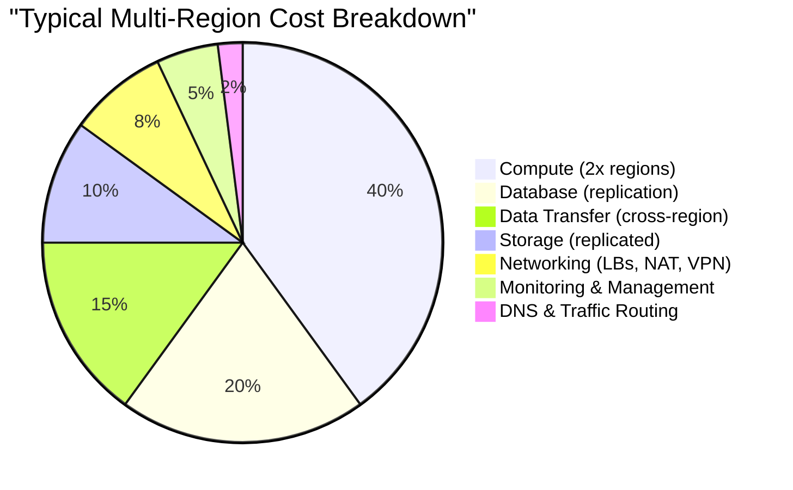
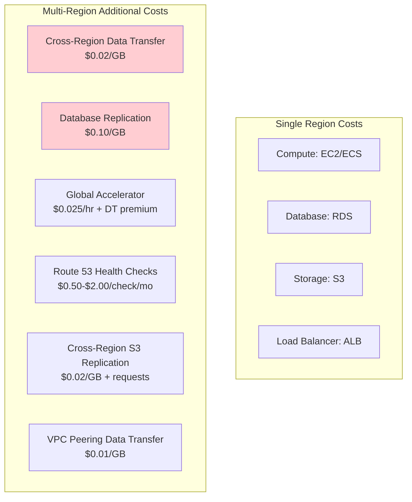
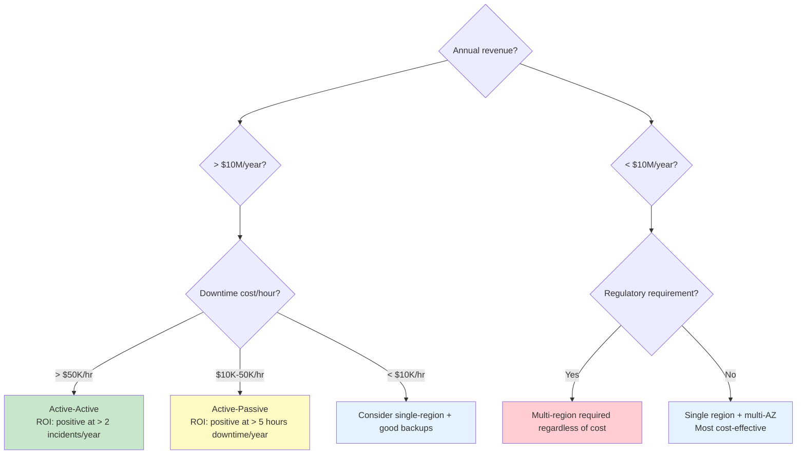

# Multi-Region Cost Analysis

## Why Cost Analysis Is Critical

Multi-region architecture is expensive. The naive approach — duplicate everything in every region — can 3x your infrastructure bill. But the cost of downtime can be even higher: a 2019 study by Gartner estimated the average cost of IT downtime at $5,600 per minute ($336,000/hour). For large enterprises, this number exceeds $1 million per hour.

The goal of cost analysis is not to minimize spending — it's to optimize the ratio of **resilience gained per dollar spent**. Some multi-region costs are unavoidable (data transfer between regions). Others are wasteful (idle compute in standby regions at 100% capacity). Understanding where each dollar goes enables rational architecture decisions.

### The Cost Landscape



## First Principles

### The Cost Multiplication Factor

Going from single-region to multi-region is not a simple 2x multiplication. Different components scale differently:

$$
C_{\text{multi}} = C_{\text{compute}} \times f_c + C_{\text{storage}} \times f_s + C_{\text{database}} \times f_d + C_{\text{transfer}} + C_{\text{management}}
$$

Where:
- $f_c$ = compute multiplication factor (depends on architecture pattern)
- $f_s$ = storage multiplication factor (typically equals region count)
- $f_d$ = database multiplication factor (depends on replication type)
- $C_{\text{transfer}}$ = cross-region data transfer (new cost, scales with traffic)
- $C_{\text{management}}$ = operational overhead (monitoring, tooling, complexity)

| Architecture | $f_c$ | $f_s$ | $f_d$ | Transfer | Total Multiplier |
|-------------|------|------|------|----------|-----------------|
| Active-Passive (2 regions) | 1.3 | 2.0 | 1.5 | Low | 1.3-1.5x |
| Active-Active (2 regions) | 2.0 | 2.0 | 2.0 | Medium | 2.0-2.5x |
| Active-Active (3 regions) | 3.0 | 3.0 | 3.0 | High | 2.8-3.5x |
| Cell-Based (3 cells) | 3.0 | 3.0 | 3.0 | Low | 2.5-3.0x |

### Cloud Provider Pricing Model

Cloud pricing for multi-region introduces costs that don't exist in single-region:



## Core Mechanics

### AWS Data Transfer Pricing

Data transfer is often the most surprising cost in multi-region architectures:

| Transfer Type | Cost per GB |
|--------------|------------|
| Within same AZ | Free |
| Cross-AZ (same region) | $0.01 |
| Cross-region (US to US) | $0.02 |
| Cross-region (US to EU) | $0.02 |
| Cross-region (US to AP) | $0.09 |
| Internet egress (first 10 TB) | $0.09 |
| Internet egress (next 40 TB) | $0.085 |
| Internet egress (next 100 TB) | $0.07 |
| CloudFront to internet | $0.085 (US/EU) |
| Global Accelerator DT premium | +$0.015-$0.035 |
| S3 cross-region replication | $0.02 + request costs |
| VPC peering (cross-region) | $0.01 |

::: danger Cost Trap
Cross-region data transfer to Asia-Pacific costs 4.5x more than within the US ($0.09 vs $0.02 per GB). A system transferring 10 TB/month to AP-Tokyo pays $900/month just for data transfer.
:::

### Compute Cost Comparison

```typescript
// scripts/cost-calculator.ts
interface RegionConfig {
  region: string;
  instanceType: string;
  instanceCount: number;
  utilizationTarget: number;
  reservationType: 'on-demand' | '1yr-reserved' | '3yr-reserved' | 'spot';
}

interface CostBreakdown {
  compute: number;
  database: number;
  storage: number;
  transfer: number;
  networking: number;
  management: number;
  total: number;
}

const INSTANCE_PRICING: Record<string, Record<string, number>> = {
  'm6i.xlarge': {
    'us-east-1': 0.192,
    'eu-west-1': 0.211,
    'ap-northeast-1': 0.245,
  },
  'm6i.2xlarge': {
    'us-east-1': 0.384,
    'eu-west-1': 0.422,
    'ap-northeast-1': 0.490,
  },
  'r6i.xlarge': {
    'us-east-1': 0.252,
    'eu-west-1': 0.277,
    'ap-northeast-1': 0.322,
  },
};

const RESERVED_DISCOUNT: Record<string, number> = {
  'on-demand': 1.0,
  '1yr-reserved': 0.60,  // ~40% discount
  '3yr-reserved': 0.36,  // ~64% discount
  'spot': 0.30,           // ~70% discount (variable)
};

function calculateMonthlyComputeCost(config: RegionConfig): number {
  const hourlyRate = INSTANCE_PRICING[config.instanceType]?.[config.region] ?? 0;
  const discount = RESERVED_DISCOUNT[config.reservationType];
  const hoursPerMonth = 730; // 365.25 * 24 / 12

  return hourlyRate * discount * config.instanceCount * hoursPerMonth;
}

function calculateMultiRegionCost(
  regions: RegionConfig[],
  dataTransferGB: number,
  databaseConfig: {
    instanceType: string;
    storageGB: number;
    iops: number;
  },
  s3StorageGB: number
): CostBreakdown {
  // Compute
  const compute = regions.reduce(
    (sum, r) => sum + calculateMonthlyComputeCost(r), 0
  );

  // Database (primary + replicas)
  const dbHourlyRate = 0.48; // db.r6i.xlarge approximate
  const dbPrimary = dbHourlyRate * 730;
  const dbReplicas = regions.length > 1
    ? (regions.length - 1) * dbHourlyRate * 730
    : 0;
  const dbStorage = databaseConfig.storageGB * 0.115;
  const dbIops = Math.max(0, databaseConfig.iops - 3000) * 0.08;
  const database = dbPrimary + dbReplicas + dbStorage + dbIops;

  // Storage (S3, replicated)
  const storage = s3StorageGB * 0.023 * regions.length;

  // Data transfer
  const crossRegionRate = 0.02; // US-EU
  const transfer = dataTransferGB * crossRegionRate * (regions.length - 1);

  // Networking (ALBs, NAT Gateways, VPC endpoints)
  const albCost = regions.length * (0.0225 * 730 + 0.008 * 1000000 / 1000);
  const natCost = regions.length * (0.045 * 730 + 0.045 * 1000);
  const networking = albCost + natCost;

  // Management overhead (~5-10% of total)
  const subtotal = compute + database + storage + transfer + networking;
  const management = subtotal * 0.07;

  return {
    compute,
    database,
    storage,
    transfer,
    networking,
    management,
    total: subtotal + management,
  };
}

// Example: Compare single vs. multi-region costs
function compareArchitectures(): void {
  // Single region
  const singleRegion = calculateMultiRegionCost(
    [{ region: 'us-east-1', instanceType: 'm6i.xlarge', instanceCount: 10, utilizationTarget: 0.7, reservationType: '1yr-reserved' }],
    0, // No cross-region transfer
    { instanceType: 'db.r6i.xlarge', storageGB: 500, iops: 5000 },
    1000
  );

  // Active-Passive (2 regions)
  const activePassive = calculateMultiRegionCost(
    [
      { region: 'us-east-1', instanceType: 'm6i.xlarge', instanceCount: 10, utilizationTarget: 0.7, reservationType: '1yr-reserved' },
      { region: 'eu-west-1', instanceType: 'm6i.xlarge', instanceCount: 3, utilizationTarget: 0.2, reservationType: 'on-demand' },
    ],
    500, // 500 GB/month cross-region
    { instanceType: 'db.r6i.xlarge', storageGB: 500, iops: 5000 },
    1000
  );

  // Active-Active (2 regions)
  const activeActive = calculateMultiRegionCost(
    [
      { region: 'us-east-1', instanceType: 'm6i.xlarge', instanceCount: 10, utilizationTarget: 0.5, reservationType: '1yr-reserved' },
      { region: 'eu-west-1', instanceType: 'm6i.xlarge', instanceCount: 10, utilizationTarget: 0.5, reservationType: '1yr-reserved' },
    ],
    2000, // 2 TB/month cross-region
    { instanceType: 'db.r6i.xlarge', storageGB: 500, iops: 5000 },
    1000
  );

  console.table({
    'Single Region': singleRegion,
    'Active-Passive': activePassive,
    'Active-Active': activeActive,
  });
}
```

### Detailed Cost Breakdown: Real-World Example

A SaaS application serving 50,000 users globally:

| Component | Single Region | Active-Passive (2R) | Active-Active (2R) | Active-Active (3R) |
|-----------|-------------|--------------------|--------------------|-------------------|
| **Compute** | | | | |
| ECS/EKS instances | $2,880 | $3,744 | $5,760 | $8,640 |
| Auto-scaling headroom | $576 | $749 | $1,152 | $1,728 |
| **Database** | | | | |
| RDS/Aurora primary | $1,200 | $1,200 | $1,200 | $1,200 |
| Read replicas | $0 | $1,100 | $1,100 | $2,200 |
| Storage (500 GB) | $58 | $58 | $115 | $173 |
| **Cache** | | | | |
| ElastiCache | $600 | $600 | $1,200 | $1,800 |
| Global Datastore | $0 | $200 | $200 | $400 |
| **Storage** | | | | |
| S3 (1 TB) | $23 | $46 | $46 | $69 |
| S3 replication | $0 | $20 | $20 | $40 |
| **Data Transfer** | | | | |
| Cross-region | $0 | $100 | $400 | $900 |
| Internet egress | $450 | $450 | $450 | $450 |
| **Networking** | | | | |
| ALB | $200 | $400 | $400 | $600 |
| NAT Gateway | $350 | $700 | $700 | $1,050 |
| VPC peering | $0 | $50 | $100 | $200 |
| **Traffic Routing** | | | | |
| Route 53 | $5 | $30 | $30 | $45 |
| Global Accelerator | $0 | $0 | $55 | $55 |
| Health checks | $0 | $15 | $15 | $25 |
| **Management** | | | | |
| CloudWatch (enhanced) | $200 | $350 | $400 | $550 |
| CI/CD (multi-region deploy) | $100 | $150 | $200 | $300 |
| **Totals** | | | | |
| **Monthly** | **$6,642** | **$9,962** | **$13,543** | **$20,425** |
| **Annual** | **$79,704** | **$119,544** | **$162,516** | **$245,100** |
| **Multiplier** | **1.0x** | **1.5x** | **2.04x** | **3.07x** |

## Implementation: Cost Optimization Strategies

### Strategy 1: Right-Size Standby Capacity

In active-passive, the standby region doesn't need full capacity:

```typescript
// infrastructure/auto-scaling.ts
interface RegionScalingConfig {
  region: string;
  role: 'primary' | 'standby';
  normalCapacity: {
    min: number;
    desired: number;
    max: number;
  };
  failoverCapacity: {
    min: number;
    desired: number;
    max: number;
  };
  warmPoolSize: number;  // Pre-initialized instances ready to start
}

const scalingConfigs: RegionScalingConfig[] = [
  {
    region: 'us-east-1',
    role: 'primary',
    normalCapacity: { min: 6, desired: 10, max: 20 },
    failoverCapacity: { min: 6, desired: 10, max: 20 },
    warmPoolSize: 0,  // No warm pool needed for primary
  },
  {
    region: 'eu-west-1',
    role: 'standby',
    normalCapacity: { min: 2, desired: 2, max: 5 },   // 20% capacity
    failoverCapacity: { min: 6, desired: 10, max: 20 }, // Full capacity
    warmPoolSize: 4,  // 4 instances pre-initialized (hibernate)
  },
];

// Cost savings: 80% of standby compute cost saved during normal operation
// Warm pool: instances in stopped state cost only for EBS storage (~$5/instance/month)
// Scale-up time with warm pool: ~60 seconds (vs. ~5 minutes without)
```

```hcl
# Terraform: Auto Scaling with Warm Pool
resource "aws_autoscaling_group" "standby" {
  provider         = aws.secondary
  name             = "app-standby"
  min_size         = 2
  desired_capacity = 2
  max_size         = 20

  warm_pool {
    pool_state                  = "Stopped"
    min_size                    = 4
    max_group_prepared_capacity = 10

    instance_reuse_policy {
      reuse_on_scale_in = true
    }
  }

  # Use mixed instances for cost optimization
  mixed_instances_policy {
    instances_distribution {
      on_demand_base_capacity                  = 2
      on_demand_percentage_above_base_capacity = 0
      spot_allocation_strategy                 = "capacity-optimized"
    }

    launch_template {
      launch_template_specification {
        launch_template_id = aws_launch_template.app.id
      }

      override {
        instance_type = "m6i.xlarge"
      }
      override {
        instance_type = "m5.xlarge"
      }
      override {
        instance_type = "m5a.xlarge"
      }
    }
  }
}
```

### Strategy 2: Reserved Instances for Multi-Region

```typescript
// scripts/ri-optimizer.ts
interface ReservedInstanceRecommendation {
  region: string;
  instanceType: string;
  count: number;
  term: '1yr' | '3yr';
  paymentOption: 'all-upfront' | 'partial-upfront' | 'no-upfront';
  monthlySavings: number;
  breakEvenMonths: number;
}

function optimizeReservations(
  regions: RegionConfig[]
): ReservedInstanceRecommendation[] {
  const recommendations: ReservedInstanceRecommendation[] = [];

  for (const region of regions) {
    // Reserve the minimum guaranteed capacity
    const guaranteedInstances = region.role === 'primary'
      ? region.normalCapacity.min
      : Math.max(2, region.normalCapacity.min);

    if (guaranteedInstances > 0) {
      const onDemandCost = INSTANCE_PRICING[region.instanceType][region.region]
        * guaranteedInstances * 730;
      const reservedCost = onDemandCost * 0.60; // 1yr RI discount

      recommendations.push({
        region: region.region,
        instanceType: region.instanceType,
        count: guaranteedInstances,
        term: '1yr',
        paymentOption: 'partial-upfront',
        monthlySavings: onDemandCost - reservedCost,
        breakEvenMonths: 7,
      });
    }

    // Use Savings Plans for variable capacity
    // (covers any instance type in the region)
  }

  return recommendations;
}
```

### Strategy 3: Minimize Data Transfer

```typescript
// src/optimization/transfer-optimizer.ts
interface DataTransferOptimization {
  strategy: string;
  beforeCostPerMonth: number;
  afterCostPerMonth: number;
  implementationEffort: 'low' | 'medium' | 'high';
}

const optimizations: DataTransferOptimization[] = [
  {
    strategy: 'Compress replication data (gzip)',
    beforeCostPerMonth: 400,
    afterCostPerMonth: 120,  // 70% compression ratio
    implementationEffort: 'low',
  },
  {
    strategy: 'Replicate only changed fields (delta sync)',
    beforeCostPerMonth: 400,
    afterCostPerMonth: 80,  // 80% reduction
    implementationEffort: 'medium',
  },
  {
    strategy: 'Use VPC endpoints instead of internet',
    beforeCostPerMonth: 900,  // Internet egress pricing
    afterCostPerMonth: 100,   // VPC peering pricing
    implementationEffort: 'low',
  },
  {
    strategy: 'CDN for static assets (avoid origin fetch)',
    beforeCostPerMonth: 500,
    afterCostPerMonth: 85,   // CloudFront pricing lower than direct
    implementationEffort: 'low',
  },
  {
    strategy: 'Cell-based routing (reduce cross-region reads)',
    beforeCostPerMonth: 2000,
    afterCostPerMonth: 200,
    implementationEffort: 'high',
  },
];
```

### Strategy 4: S3 Intelligent-Tiering for Multi-Region

```hcl
# S3 bucket with lifecycle rules for cost optimization
resource "aws_s3_bucket" "data" {
  bucket = "myapp-data-${var.region}"
}

resource "aws_s3_bucket_intelligent_tiering_configuration" "data" {
  bucket = aws_s3_bucket.data.id
  name   = "auto-tier"

  tiering {
    access_tier = "ARCHIVE_ACCESS"
    days        = 90
  }

  tiering {
    access_tier = "DEEP_ARCHIVE_ACCESS"
    days        = 180
  }
}

# Only replicate recent data to secondary region
resource "aws_s3_bucket_replication_configuration" "data" {
  provider = aws.primary
  bucket   = aws_s3_bucket.data_primary.id
  role     = aws_iam_role.replication.arn

  rule {
    id     = "replicate-recent"
    status = "Enabled"

    filter {
      and {
        prefix = "active/"  # Only replicate active data
        tags = {
          replicate = "true"
        }
      }
    }

    destination {
      bucket        = aws_s3_bucket.data_secondary.arn
      storage_class = "STANDARD_IA"  # Cheaper storage in secondary
    }
  }
}
```

## Edge Cases & Failure Modes

### Hidden Cost Traps

| Cost Trap | Description | Typical Impact | Mitigation |
|-----------|-------------|---------------|------------|
| NAT Gateway data processing | $0.045/GB + $0.045/hr per AZ | $500-2000/mo per region | Use VPC endpoints for AWS services |
| Cross-AZ transfer | $0.01/GB within region | $100-500/mo | AZ-aware routing |
| CloudWatch logs (cross-region) | $0.50/GB ingestion + transfer | $200-1000/mo | Log locally, aggregate with Kinesis |
| Health check costs | $0.50-$2.00 per check per month | $50-200/mo | Consolidate health checks |
| Idle EBS volumes | Standby instances still pay for storage | $100-500/mo | Use warm pools (stopped instances) |
| DNS query costs | $0.40/M queries for latency/geo routing | $100-400/mo | Cache-friendly TTLs |
| Global Accelerator | $0.025/hr per accelerator | $18/mo base + DT premium | Evaluate if DNS failover suffices |

### The NAT Gateway Tax

NAT Gateways are one of the most expensive hidden costs in multi-region:

$$
C_{\text{NAT}} = (\$0.045/\text{hr} \times 730\text{hr}) + (\$0.045/\text{GB} \times G_{\text{processed}})
$$

Per AZ, per region. For 3 AZs across 3 regions processing 1 TB/month each:

$$
C_{\text{NAT}} = 9 \times (32.85 + 45) = \$700.65/\text{month}
$$

**Mitigation**: Use VPC endpoints for S3, DynamoDB, and other AWS services. This eliminates NAT Gateway data processing charges for AWS-to-AWS traffic.

## Performance Characteristics

### Cost per Request by Architecture

$$
C_{\text{per-request}} = \frac{C_{\text{monthly-total}}}{R_{\text{monthly-requests}}}
$$

| Architecture | Monthly Cost | Monthly Requests | Cost/Request |
|-------------|-------------|-----------------|-------------|
| Single region | $6,642 | 100M | $0.0000664 |
| Active-Passive | $9,962 | 100M | $0.0000996 |
| Active-Active (2R) | $13,543 | 100M | $0.000135 |
| Active-Active (3R) | $20,425 | 100M | $0.000204 |

### Downtime Cost vs. Multi-Region Cost

$$
\text{Break-even} = \frac{C_{\text{multi-region}} - C_{\text{single}}}{C_{\text{downtime-per-hour}}} \times \text{hours/month}
$$

For our example ($6,642 vs $13,543, with $10,000/hour downtime cost):

$$
\text{Break-even} = \frac{13543 - 6642}{10000} = 0.69 \text{ hours/month}
$$

If you expect more than 41 minutes of downtime per month from regional failures, multi-region pays for itself. Given that AWS has averaged ~2-3 significant regional incidents per year with durations of 1-8 hours, multi-region is almost always economically justified for production systems.

## Mathematical Foundations

### Total Cost of Ownership Model

$$
\text{TCO}_{\text{multi}} = \sum_{t=1}^{T} \frac{C_{\text{infra}}(t) + C_{\text{ops}}(t) + C_{\text{risk}}(t)}{(1 + r)^t}
$$

Where:
- $C_{\text{infra}}(t)$ = infrastructure cost in period $t$
- $C_{\text{ops}}(t)$ = operational overhead (engineering time)
- $C_{\text{risk}}(t)$ = expected cost of downtime
- $r$ = discount rate
- $T$ = time horizon

The risk cost is:

$$
C_{\text{risk}}(t) = \sum_{i} P_i \times D_i \times C_{\text{impact}_i}
$$

Where $P_i$ is the probability of incident $i$, $D_i$ is its duration, and $C_{\text{impact}_i}$ is the per-hour business impact.

### Economies of Scale in Multi-Region

As traffic grows, the per-request cost of multi-region decreases because fixed costs (networking, management) are amortized over more requests, while variable costs (compute, data transfer) scale linearly:

$$
C_{\text{per-request}}(N) = \frac{F}{N} + V
$$

Where $F$ is total fixed costs and $V$ is variable cost per request. For our example:
- Fixed costs: ~$4,000/month (networking, management, health checks)
- Variable costs: ~$0.00005/request (compute, transfer)

At 100M requests: $\frac{4000}{10^8} + 0.00005 = \$0.00009$/request
At 1B requests: $\frac{4000}{10^9} + 0.00005 = \$0.000054$/request

Multi-region becomes proportionally cheaper as you scale.

## Real-World War Stories

::: info War Story — The $2M Data Transfer Bill
A social media company migrated to active-active across 3 regions. Their architecture replicated every user action (post, like, comment) to all regions in real-time. With 200M daily active users generating 2 billion events/day at 1 KB average, cross-region data transfer hit 2 TB/day.

**Monthly data transfer cost**: 60 TB x $0.02/GB x 2 region pairs = $2,400

But the system also had a "fan-out" feature for trending content. When content went viral, it was replicated with full metadata and media thumbnails — not just event IDs. This increased the average event size to 50 KB during viral events.

**Monthly data transfer during viral events**: 60 TB x 50 = 3,000 TB x $0.02 = $60,000/month

Then they expanded to AP-Tokyo (at $0.09/GB transfer): $60,000 + 1,000 TB x $0.09 = $150,000/month

**Total annual data transfer**: ~$1.8M/year

**Fix**:
1. Replicate only event IDs and metadata (not thumbnails): 90% reduction
2. Batch replication every 5 seconds instead of real-time: 60% fewer requests
3. Use S3 Transfer Acceleration for media instead of application-level replication
4. Implement regional caching — only replicate on first access from a region
5. Final cost: $12,000/month (93% reduction)

**Lesson**: Design your replication protocol for cost. Replicate the minimum necessary data, and lazy-load everything else.
:::

::: info War Story — The Savings Plan That Backfired
A startup bought 3-year Compute Savings Plans for their multi-region infrastructure. Six months later, they pivoted their architecture from active-active (3 regions x 10 instances) to cell-based (2 regions x 5 instances + edge workers). They had committed to $50,000/month in Savings Plans that now covered only 60% of their compute — the rest was wasted.

**Root cause**: Architecture decisions change. Committing to long-term reservations for multi-region infrastructure that's still evolving is risky.

**Better approach**:
1. Start with On-Demand for the first 6 months (validate architecture)
2. Then buy 1-year Savings Plans for the baseline capacity only
3. Use Spot instances for non-critical workloads (testing, staging)
4. Review and adjust commitments quarterly

**Lesson**: Multi-region architectures evolve rapidly. Don't lock in long-term commitments until the architecture has stabilized.
:::

## Decision Framework

### When Multi-Region Pays for Itself



### Cost Optimization Checklist

| Optimization | Savings | Effort | Priority |
|-------------|---------|--------|----------|
| VPC endpoints for AWS services | 20-40% of NAT costs | Low | 1 |
| Reserved Instances for baseline | 30-60% of compute | Low | 2 |
| Right-size standby regions | 50-70% of standby compute | Low | 3 |
| CloudFront for static content | 30-50% of egress | Low | 4 |
| Compress replication data | 50-70% of transfer | Medium | 5 |
| Warm pools instead of running standby | 60-80% of standby compute | Medium | 6 |
| Delta replication | 70-90% of transfer | Medium | 7 |
| Cell-based routing | 50-80% of transfer | High | 8 |
| Spot instances for standby | 60-70% of standby compute | Medium | 9 |
| S3 Intelligent-Tiering | 20-40% of storage | Low | 10 |

## Advanced Topics

### FinOps for Multi-Region

```typescript
// scripts/multi-region-cost-monitor.ts
interface CostAlert {
  region: string;
  service: string;
  currentCost: number;
  budgetedCost: number;
  percentOverBudget: number;
  recommendation: string;
}

class MultiRegionCostMonitor {
  async checkCosts(): Promise<CostAlert[]> {
    const alerts: CostAlert[] = [];

    // Check data transfer costs per region pair
    const transferCosts = await this.getDataTransferCosts();
    for (const [pair, cost] of transferCosts) {
      const budget = this.getTransferBudget(pair);
      if (cost > budget * 1.1) { // 10% over budget
        alerts.push({
          region: pair,
          service: 'Data Transfer',
          currentCost: cost,
          budgetedCost: budget,
          percentOverBudget: ((cost - budget) / budget) * 100,
          recommendation: this.getTransferRecommendation(pair, cost),
        });
      }
    }

    // Check for idle resources in standby regions
    const idleResources = await this.findIdleResources();
    for (const resource of idleResources) {
      alerts.push({
        region: resource.region,
        service: resource.type,
        currentCost: resource.monthlyCost,
        budgetedCost: 0,
        percentOverBudget: 100,
        recommendation: `Consider terminating idle ${resource.type} ` +
          `in ${resource.region} (saving $${resource.monthlyCost}/mo)`,
      });
    }

    return alerts;
  }

  private getTransferRecommendation(pair: string, cost: number): string {
    if (cost > 1000) {
      return 'Consider implementing delta replication or compression. ' +
        'Review if all replicated data is necessary.';
    }
    if (cost > 500) {
      return 'Enable gzip compression for replication traffic.';
    }
    return 'Monitor for trends.';
  }
}
```

### Cloud Cost Comparison for Multi-Region

| Component | AWS (2 regions) | GCP (2 regions) | Azure (2 regions) |
|-----------|----------------|----------------|-------------------|
| Compute (10x m5.xlarge equivalent) | $1,400/mo | $1,300/mo | $1,350/mo |
| Database (managed, HA) | $2,300/mo | $2,100/mo | $2,200/mo |
| Cross-region transfer (1 TB) | $20/mo | $80/mo (premium) / $20 (standard) | $20/mo |
| Global LB | $55/mo (GA) | $18/mo (Cloud LB) | $37/mo (Front Door) |
| S3/GCS/Blob storage (1 TB) | $46/mo | $40/mo | $42/mo |
| DNS + health checks | $45/mo | $35/mo | $40/mo |
| **Total** | **$3,866/mo** | **$3,573/mo** | **$3,689/mo** |

::: tip
GCP's "premium tier" network charges higher cross-region transfer but provides better performance. Their "standard tier" matches AWS pricing but uses the public internet. Consider this trade-off carefully.
:::

### Right-Sizing Calculator

$$
\text{Optimal standby capacity} = C_{\text{primary}} \times \frac{T_{\text{scale-up}}}{T_{\text{RTO}}}
$$

If your primary runs 10 instances, scale-up takes 3 minutes, and your RTO is 5 minutes:

$$
\text{Standby} = 10 \times \frac{3}{5} = 6 \text{ instances minimum}
$$

The remaining 4 can be in a warm pool (stopped instances, pay only for EBS storage).

With a 15-minute RTO:

$$
\text{Standby} = 10 \times \frac{3}{15} = 2 \text{ instances minimum}
$$

This means 80% of standby compute can be in warm pools or spot instances.

For the data replication strategies that drive transfer costs, see [Data Replication](./data-replication). For understanding which architecture pattern best fits your budget, see [Architecture Patterns](./architecture-patterns). For the traffic routing costs, see [Traffic Routing](./traffic-routing).
