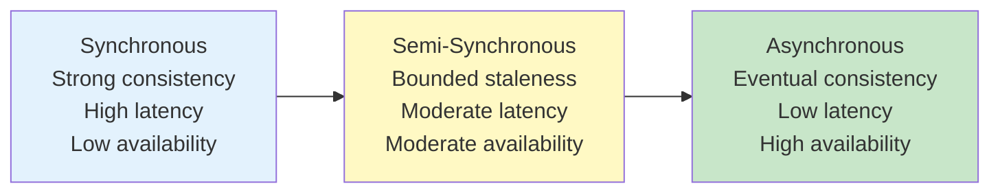
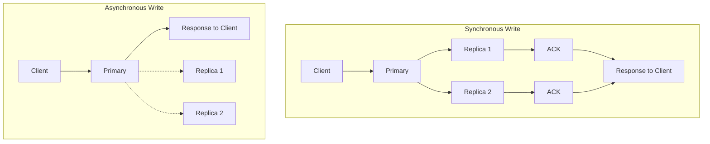
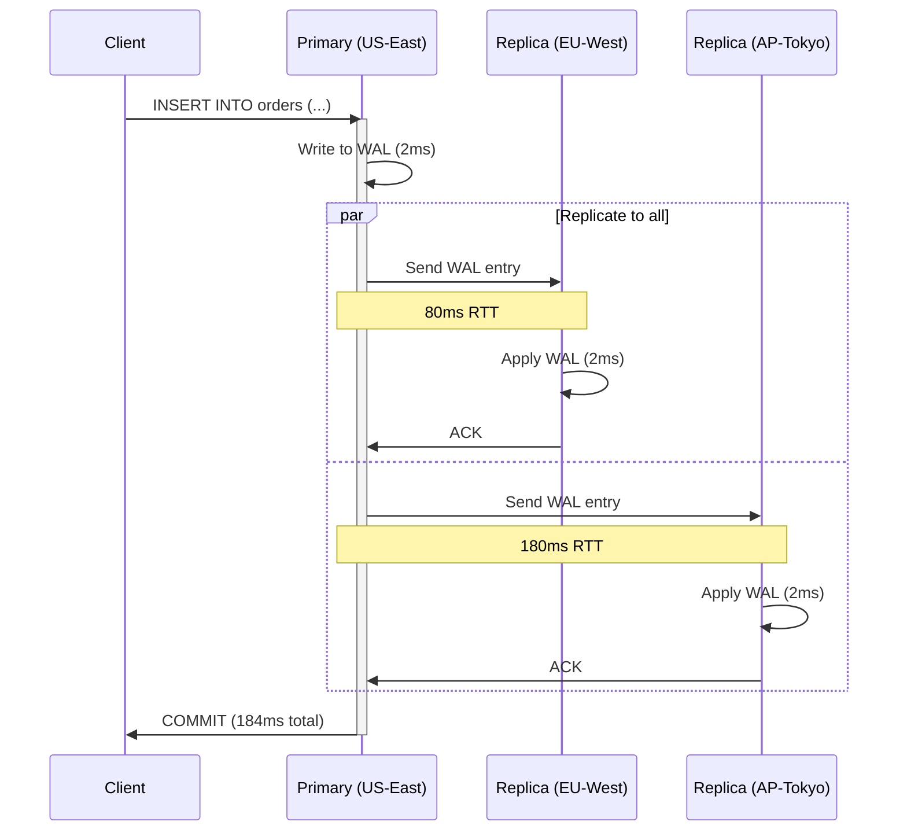
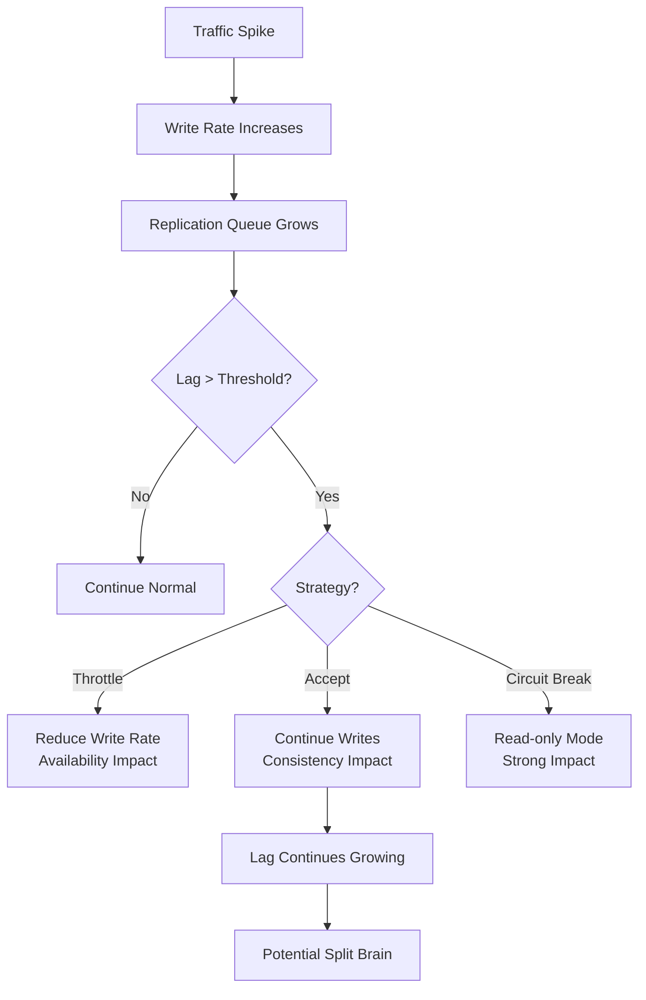
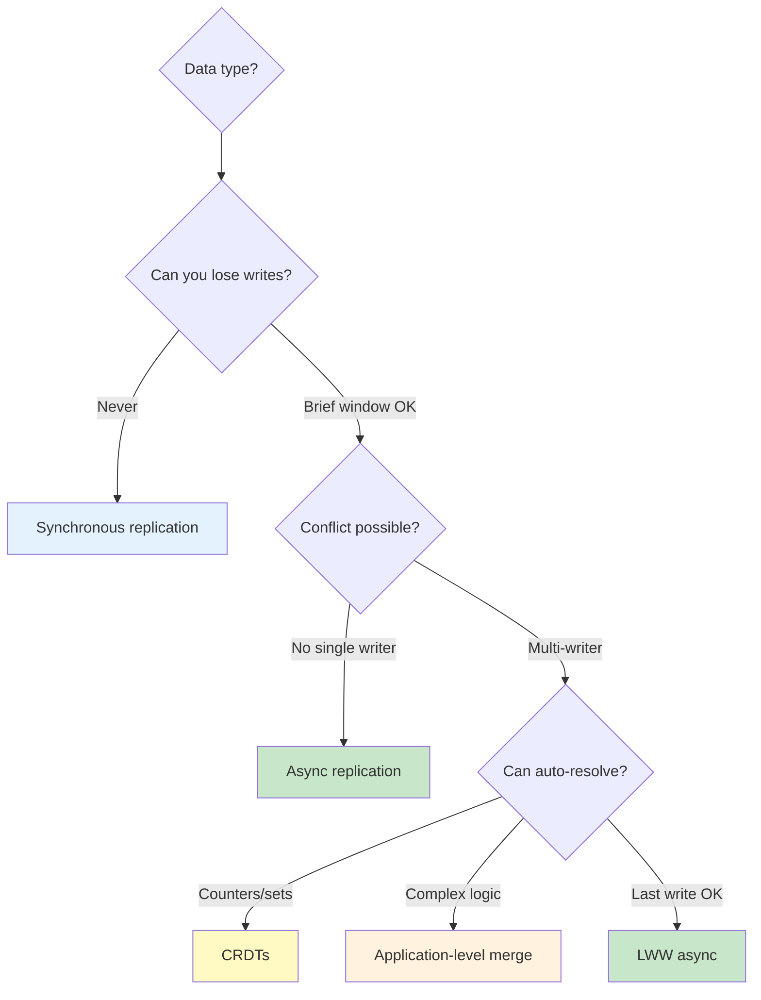

# Cross-Region Data Replication

## Why Data Replication Is the Hardest Problem

Compute is stateless — you can spin up a container in any region in seconds. Data has gravity. It accumulates, it has relationships, it must be consistent, and it cannot be teleported faster than light. Cross-region data replication is where physics meets software engineering, and physics always wins.

The fundamental tension: users expect their data to be instantly available everywhere, but the speed of light imposes a minimum 60-200ms round-trip between distant regions. Every multi-region data strategy is a specific answer to the question: **what happens to writes during those milliseconds of propagation?**

### The Replication Spectrum



## First Principles

### The Replication Trilemma

Like the CAP theorem for distributed systems, data replication has its own trilemma — you can optimize for at most two of three properties:

$$
\text{Choose two: } \{\text{Strong Consistency}, \text{Low Latency}, \text{High Availability}\}
$$

| Trade-off | Consistency | Latency | Availability | Example |
|-----------|------------|---------|-------------|---------|
| CP | Strong | High (cross-region RTT) | Reduced during partitions | Google Spanner |
| AP | Eventual | Low (local only) | Always available | DynamoDB Global Tables |
| CA | Strong | Low | No partition tolerance | Single-region PostgreSQL |

### Write Propagation Models



In synchronous replication, the client waits for all replicas to acknowledge. Write latency = max(replica latencies):

$$
T_{\text{sync-write}} = T_{\text{local}} + \max_{i \in \text{replicas}} (T_{\text{RTT}_i})
$$

In asynchronous replication, the client gets an immediate response. Write latency = local only:

$$
T_{\text{async-write}} = T_{\text{local}}
$$

But the replication lag creates a window where replicas are stale:

$$
\text{Staleness Window} = T_{\text{RTT}} + T_{\text{apply}}
$$

### Consistency Models in Practice

| Model | Guarantee | Staleness | Cross-Region Latency |
|-------|-----------|-----------|---------------------|
| Linearizability | Reads always see latest write | 0 | +RTT per write |
| Sequential Consistency | Operations ordered consistently | 0 | +RTT per write |
| Causal Consistency | Causally related ops ordered | 0 for causal, bounded for concurrent | +metadata overhead |
| Bounded Staleness | Reads within time/version bound | Configurable | Minimal |
| Eventual Consistency | All replicas converge eventually | Unbounded | 0 |
| Read-Your-Writes | See your own writes | 0 for own writes | Session routing |

## Core Mechanics

### Synchronous Replication

Synchronous replication guarantees that when a write is acknowledged, it exists on all replicas. This is the simplest model to reason about but the most expensive in latency.



**When to use synchronous replication**:
- Financial transactions (payments, transfers)
- Inventory management (preventing overselling)
- Identity/authentication data
- Any data where losing a write is unacceptable

**AWS Aurora Global Database with write forwarding**:

```sql
-- On secondary region: writes are forwarded to primary
-- This provides synchronous-like behavior with a single writer
SET aurora_replica_read_consistency = 'SESSION';

-- Write in secondary region (forwarded to primary)
INSERT INTO orders (user_id, amount, region)
VALUES (123, 99.99, 'eu-west-1');
-- Latency: local processing + RTT to primary + primary processing + RTT back
-- ~160-200ms for EU to US

-- Read-after-write consistency within session
SELECT * FROM orders WHERE user_id = 123;
-- Returns the just-inserted row (session consistency)
```

### Asynchronous Replication

Asynchronous replication acknowledges writes immediately and replicates in the background. This provides low write latency but creates a replication lag window.

```typescript
// src/replication/async-replicator.ts
interface ReplicationEvent {
  id: string;
  table: string;
  operation: 'INSERT' | 'UPDATE' | 'DELETE';
  data: Record<string, unknown>;
  timestamp: number;
  sourceRegion: string;
  sequenceNumber: bigint;
}

interface ReplicationState {
  lastSequence: bigint;
  lag: number;  // milliseconds
  healthy: boolean;
}

class AsyncReplicator {
  private state: ReplicationState = {
    lastSequence: 0n,
    lag: 0,
    healthy: true,
  };

  private readonly MAX_LAG_MS = 5000;      // Alert threshold
  private readonly CRITICAL_LAG_MS = 30000; // Circuit break threshold

  async processReplicationStream(
    stream: AsyncIterable<ReplicationEvent>
  ): Promise<void> {
    for await (const event of stream) {
      try {
        // Apply the event
        await this.applyEvent(event);

        // Update state
        this.state.lastSequence = event.sequenceNumber;
        this.state.lag = Date.now() - event.timestamp;
        this.state.healthy = true;

        // Emit metrics
        this.emitMetrics(event);

        // Check lag thresholds
        if (this.state.lag > this.CRITICAL_LAG_MS) {
          console.error(
            `CRITICAL: Replication lag ${this.state.lag}ms exceeds threshold`
          );
          // Optionally: pause write forwarding, alert on-call
          await this.alertOnCall('critical_replication_lag', this.state);
        } else if (this.state.lag > this.MAX_LAG_MS) {
          console.warn(`WARNING: Replication lag ${this.state.lag}ms`);
        }

      } catch (error) {
        this.state.healthy = false;
        console.error(`Replication error for event ${event.id}:`, error);

        // Retry with backoff
        await this.retryWithBackoff(event, 3);
      }
    }
  }

  private async applyEvent(event: ReplicationEvent): Promise<void> {
    switch (event.operation) {
      case 'INSERT':
        await this.db.query(
          `INSERT INTO ${event.table} VALUES ($1)
           ON CONFLICT DO NOTHING`, // Idempotent
          [event.data]
        );
        break;

      case 'UPDATE':
        // Use optimistic concurrency to handle ordering
        await this.db.query(
          `UPDATE ${event.table}
           SET data = $1, updated_at = $2
           WHERE id = $3 AND updated_at < $2`, // Only apply if newer
          [event.data, event.timestamp, event.data.id]
        );
        break;

      case 'DELETE':
        // Soft delete with timestamp for ordering
        await this.db.query(
          `UPDATE ${event.table}
           SET deleted_at = $1
           WHERE id = $2 AND (deleted_at IS NULL OR deleted_at < $1)`,
          [event.timestamp, event.data.id]
        );
        break;
    }
  }

  private async retryWithBackoff(
    event: ReplicationEvent,
    maxRetries: number
  ): Promise<void> {
    for (let i = 0; i < maxRetries; i++) {
      const delay = Math.min(1000 * Math.pow(2, i), 30000);
      await new Promise(r => setTimeout(r, delay));

      try {
        await this.applyEvent(event);
        return;
      } catch (error) {
        if (i === maxRetries - 1) {
          // Dead letter queue for manual intervention
          await this.deadLetterQueue.send(event);
          throw error;
        }
      }
    }
  }

  private emitMetrics(event: ReplicationEvent): void {
    // Emit to Prometheus/CloudWatch
    const labels = {
      source_region: event.sourceRegion,
      table: event.table,
      operation: event.operation,
    };

    metrics.histogram('replication_lag_ms', this.state.lag, labels);
    metrics.counter('replication_events_total', 1, labels);
  }
}
```

### Conflict Resolution Strategies

When using multi-primary (active-active) replication, conflicts are inevitable. Here are the strategies:

#### Strategy 1: Last-Writer-Wins (LWW)

```typescript
// Simplest conflict resolution — timestamp-based
interface LWWValue<T> {
  value: T;
  timestamp: number;
  writerRegion: string;
}

function resolveLWW<T>(local: LWWValue<T>, remote: LWWValue<T>): LWWValue<T> {
  if (local.timestamp > remote.timestamp) return local;
  if (remote.timestamp > local.timestamp) return remote;
  // Deterministic tie-breaking
  return local.writerRegion > remote.writerRegion ? local : remote;
}
```

::: warning
LWW silently drops one of the conflicting writes. This is acceptable for user profiles or preferences but dangerous for financial data, counters, or anything where both writes carry important information.
:::

#### Strategy 2: CRDTs (Conflict-free Replicated Data Types)

CRDTs are data structures that mathematically guarantee convergence — all replicas will reach the same state regardless of the order they receive operations.

```typescript
// G-Counter CRDT — only increments, converges via max
class GCounter {
  // Each region maintains its own counter
  private counts: Map<string, number> = new Map();

  constructor(private regionId: string) {}

  increment(amount: number = 1): void {
    const current = this.counts.get(this.regionId) ?? 0;
    this.counts.set(this.regionId, current + amount);
  }

  value(): number {
    let total = 0;
    for (const count of this.counts.values()) {
      total += count;
    }
    return total;
  }

  merge(other: GCounter): void {
    for (const [region, count] of other.counts) {
      const local = this.counts.get(region) ?? 0;
      this.counts.set(region, Math.max(local, count));
    }
  }

  state(): Map<string, number> {
    return new Map(this.counts);
  }
}

// PN-Counter CRDT — supports increment and decrement
class PNCounter {
  private increments: GCounter;
  private decrements: GCounter;

  constructor(regionId: string) {
    this.increments = new GCounter(regionId);
    this.decrements = new GCounter(regionId);
  }

  increment(amount: number = 1): void {
    this.increments.increment(amount);
  }

  decrement(amount: number = 1): void {
    this.decrements.increment(amount);
  }

  value(): number {
    return this.increments.value() - this.decrements.value();
  }

  merge(other: PNCounter): void {
    this.increments.merge(other.increments);
    this.decrements.merge(other.decrements);
  }
}

// LWW-Register CRDT — last-writer-wins with causality tracking
class LWWRegister<T> {
  private val: T;
  private ts: number;
  private rid: string;

  constructor(
    value: T,
    timestamp: number,
    regionId: string
  ) {
    this.val = value;
    this.ts = timestamp;
    this.rid = regionId;
  }

  set(value: T, timestamp: number, regionId: string): void {
    if (timestamp > this.ts ||
        (timestamp === this.ts && regionId > this.rid)) {
      this.val = value;
      this.ts = timestamp;
      this.rid = regionId;
    }
  }

  get(): T {
    return this.val;
  }

  merge(other: LWWRegister<T>): void {
    this.set(other.val, other.ts, other.rid);
  }
}

// OR-Set CRDT (Observed-Remove Set) — add and remove elements
class ORSet<T> {
  // Each element tagged with unique ID (region + sequence)
  private elements: Map<string, { value: T; addId: string; removed: boolean }>;
  private sequence: number = 0;

  constructor(private regionId: string) {
    this.elements = new Map();
  }

  add(value: T): void {
    const addId = `${this.regionId}:${++this.sequence}`;
    this.elements.set(addId, { value, addId, removed: false });
  }

  remove(value: T): void {
    // Remove all instances of value (mark as removed)
    for (const [key, elem] of this.elements) {
      if (elem.value === value && !elem.removed) {
        this.elements.set(key, { ...elem, removed: true });
      }
    }
  }

  has(value: T): boolean {
    for (const elem of this.elements.values()) {
      if (elem.value === value && !elem.removed) return true;
    }
    return false;
  }

  values(): T[] {
    const result = new Set<T>();
    for (const elem of this.elements.values()) {
      if (!elem.removed) result.add(elem.value);
    }
    return [...result];
  }

  merge(other: ORSet<T>): void {
    // Union of all add IDs
    for (const [key, elem] of other.elements) {
      const local = this.elements.get(key);
      if (!local) {
        this.elements.set(key, elem);
      } else {
        // If either side removed it, it's removed
        if (elem.removed) {
          this.elements.set(key, { ...local, removed: true });
        }
      }
    }
  }
}
```

#### Strategy 3: Application-Level Merge

For complex business logic, custom merge functions are often necessary:

```typescript
// src/replication/order-merger.ts
interface Order {
  id: string;
  items: OrderItem[];
  status: OrderStatus;
  totalAmount: number;
  updatedAt: number;
  updatedBy: string;
  region: string;
}

type OrderStatus = 'pending' | 'confirmed' | 'shipped' | 'delivered' | 'cancelled';

// Status progression is a partial order
const STATUS_PRIORITY: Record<OrderStatus, number> = {
  pending: 0,
  confirmed: 1,
  shipped: 2,
  delivered: 3,
  cancelled: 4,  // Terminal state
};

function mergeOrders(local: Order, remote: Order): Order {
  // Rule 1: Status always progresses forward (or to cancelled)
  let mergedStatus: OrderStatus;
  if (local.status === 'cancelled' || remote.status === 'cancelled') {
    mergedStatus = 'cancelled';
  } else {
    mergedStatus = STATUS_PRIORITY[local.status] >= STATUS_PRIORITY[remote.status]
      ? local.status
      : remote.status;
  }

  // Rule 2: Items use union (additive merge)
  const itemMap = new Map<string, OrderItem>();
  for (const item of local.items) {
    itemMap.set(item.productId, item);
  }
  for (const item of remote.items) {
    const existing = itemMap.get(item.productId);
    if (!existing || item.updatedAt > existing.updatedAt) {
      itemMap.set(item.productId, item);
    }
  }

  const mergedItems = [...itemMap.values()];

  // Rule 3: Recalculate total from merged items
  const totalAmount = mergedItems.reduce(
    (sum, item) => sum + item.price * item.quantity, 0
  );

  return {
    id: local.id,
    items: mergedItems,
    status: mergedStatus,
    totalAmount,
    updatedAt: Math.max(local.updatedAt, remote.updatedAt),
    updatedBy: local.updatedAt >= remote.updatedAt
      ? local.updatedBy
      : remote.updatedBy,
    region: local.region,
  };
}
```

### Database-Specific Replication

#### PostgreSQL Logical Replication

```sql
-- Primary region: Create publication
CREATE PUBLICATION multi_region_pub
  FOR TABLE orders, users, products
  WITH (publish = 'insert, update, delete');

-- Secondary region: Create subscription
CREATE SUBSCRIPTION multi_region_sub
  CONNECTION 'host=primary.us-east-1.rds.amazonaws.com dbname=myapp'
  PUBLICATION multi_region_pub
  WITH (
    copy_data = true,
    create_slot = true,
    slot_name = 'eu_west_sub',
    synchronous_commit = 'off'  -- Async for performance
  );

-- Monitor replication lag
SELECT
  slot_name,
  pg_size_pretty(
    pg_wal_lsn_diff(pg_current_wal_lsn(), confirmed_flush_lsn)
  ) AS replication_lag_bytes,
  active,
  pid
FROM pg_replication_slots;
```

#### DynamoDB Global Tables

```typescript
// DynamoDB Global Tables — fully managed multi-region
import {
  DynamoDBClient,
  CreateGlobalTableCommand,
} from '@aws-sdk/client-dynamodb';

// Create global table spanning 3 regions
const client = new DynamoDBClient({ region: 'us-east-1' });

await client.send(new CreateGlobalTableCommand({
  GlobalTableName: 'UserSessions',
  ReplicationGroup: [
    { RegionName: 'us-east-1' },
    { RegionName: 'eu-west-1' },
    { RegionName: 'ap-northeast-1' },
  ],
}));

// Writes go to nearest region, automatically replicated
// Conflict resolution: Last-Writer-Wins using item-level timestamps
// Typical replication latency: 500ms - 2s
```

#### Redis Global Datastore

```typescript
// ElastiCache Global Datastore for Redis
// Provides cross-region replication with <1s lag

import { createClient } from 'redis';

class MultiRegionCache {
  private localClient: ReturnType<typeof createClient>;
  private primaryClient: ReturnType<typeof createClient>;

  constructor(
    private region: string,
    private isPrimary: boolean
  ) {
    this.localClient = createClient({
      url: `redis://${region}-cache.internal:6379`,
    });

    if (!isPrimary) {
      this.primaryClient = createClient({
        url: 'redis://primary-cache.internal:6379',
      });
    }
  }

  // Reads always go to local region (fast)
  async get(key: string): Promise<string | null> {
    return this.localClient.get(key);
  }

  // Writes go to primary (forwarded automatically by Global Datastore)
  async set(key: string, value: string, ttl?: number): Promise<void> {
    const client = this.isPrimary ? this.localClient : this.primaryClient;
    if (ttl) {
      await client.setEx(key, ttl, value);
    } else {
      await client.set(key, value);
    }
    // Automatically replicated to all regions within ~1s
  }

  // For session data: read-your-writes consistency
  async getWithFallback(key: string): Promise<string | null> {
    // Try local first (fast but might be stale)
    let value = await this.localClient.get(key);
    if (value !== null) return value;

    // Fallback to primary (slower but consistent)
    if (!this.isPrimary && this.primaryClient) {
      value = await this.primaryClient.get(key);
    }
    return value;
  }
}
```

## Edge Cases & Failure Modes

### The Replication Lag Cascade

When a region becomes overwhelmed, replication lag increases. If the lag exceeds a threshold, the system must decide: continue accepting writes (risking data divergence) or throttle writes (reducing availability).



### Replication Anti-Patterns

| Anti-Pattern | Problem | Solution |
|-------------|---------|----------|
| Replicating everything | Bandwidth exhaustion, cost explosion | Replicate only what's needed |
| Ignoring replication lag | Stale reads cause business logic errors | Monitor lag, use read-your-writes |
| Synchronous for all writes | Latency kills user experience | Reserve sync for critical data only |
| No conflict detection | Silent data corruption | Implement conflict detection and alerts |
| Relying on wall-clock time | Clock skew causes incorrect ordering | Use logical clocks or hybrid clocks |
| No dead letter queue | Failed replications silently lost | DLQ with alerting and replay |
| Bi-directional without CRDT | Infinite replication loops | Use CRDT or tombstone tracking |

### The Replication Loop Problem

In bi-directional replication, a write in Region A replicates to Region B, which then replicates it back to Region A, creating an infinite loop:

```
Region A: Write X=1 -> Replicate to B
Region B: Receive X=1 -> Replicate to A (LOOP!)
Region A: Receive X=1 -> Replicate to B (INFINITE!)
```

**Solutions**:
1. **Origin tracking**: Tag each write with its origin region; ignore writes originating from self
2. **Sequence numbers**: Track the last applied sequence number; ignore already-seen events
3. **Replication filters**: Only replicate local writes, not replicated writes

## Performance Characteristics

### Replication Latency Benchmarks

| Technology | Same-AZ | Cross-AZ | Cross-Region (US-EU) | Cross-Region (US-AP) |
|-----------|---------|----------|---------------------|---------------------|
| PostgreSQL streaming | < 1ms | 1-3ms | 80-120ms | 150-250ms |
| Aurora Global DB | < 1ms | 1-3ms | < 1s (typically) | 1-2s |
| DynamoDB Global Tables | N/A | N/A | 500ms-2s | 1-3s |
| Redis Global Datastore | < 1ms | 1ms | < 1s | 1-2s |
| CockroachDB | 1-3ms | 3-10ms | 80-150ms (sync) | 150-300ms (sync) |
| Kafka MirrorMaker | 5-50ms | 10-100ms | 100-500ms | 200-1000ms |

### Bandwidth Cost

$$
C_{\text{replication}} = W \times S \times R \times P
$$

Where:
- $W$ = write operations per second
- $S$ = average write size (bytes)
- $R$ = number of target regions
- $P$ = price per GB transferred

**Example**: 1000 writes/sec, 2 KB average, to 2 other regions at $0.02/GB:

$$
C_{\text{monthly}} = 1000 \times 2048 \times 2 \times \frac{86400 \times 30}{10^9} \times 0.02 = \$212/\text{month}
$$

## Mathematical Foundations

### Eventual Consistency Convergence Time

For a gossip-based replication protocol with $n$ nodes, the expected time for all nodes to receive an update is:

$$
T_{\text{convergence}} = O(\log n) \times T_{\text{gossip-interval}}
$$

With $n = 3$ regions and a 1-second gossip interval:

$$
T_{\text{convergence}} \approx \log_2(3) \times 1 \approx 1.6 \text{ seconds}
$$

### CRDT Convergence Proof

For a state-based CRDT to converge, its merge function must form a **join-semilattice** — a set with a least upper bound (LUB) operation:

$$
\forall a, b: a \sqcup b = b \sqcup a \quad \text{(commutative)}
$$
$$
\forall a, b, c: (a \sqcup b) \sqcup c = a \sqcup (b \sqcup c) \quad \text{(associative)}
$$
$$
\forall a: a \sqcup a = a \quad \text{(idempotent)}
$$

The G-Counter merge function $\text{max}$ satisfies all three properties:
- $\max(a, b) = \max(b, a)$ (commutative)
- $\max(\max(a, b), c) = \max(a, \max(b, c))$ (associative)
- $\max(a, a) = a$ (idempotent)

Therefore, regardless of message ordering, delivery duplication, or network partitions, all replicas will converge to the same state.

### Consistency Window Analysis

The probability that a read returns stale data depends on the replication lag distribution and the read timing:

$$
P(\text{stale read}) = P(T_{\text{read}} - T_{\text{write}} < L)
$$

Where $L$ is the replication lag. If lag follows a normal distribution $L \sim N(\mu_L, \sigma_L^2)$:

$$
P(\text{stale read at time } \Delta t) = \Phi\left(\frac{\Delta t - \mu_L}{\sigma_L}\right)
$$

Where $\Phi$ is the standard normal CDF. For $\mu_L = 100\text{ms}$ and $\sigma_L = 30\text{ms}$:

| Time after write | P(stale read) |
|-----------------|---------------|
| 0 ms | 99.9% |
| 50 ms | 95.2% |
| 100 ms | 50.0% |
| 150 ms | 4.8% |
| 200 ms | 0.04% |

## Real-World War Stories

::: info War Story — The Double-Charge Incident
An e-commerce platform used active-active with DynamoDB Global Tables. A customer in Europe placed an order while the EU-US replication was experiencing elevated latency (~5s instead of typical ~1s). The customer saw "order pending" and clicked again. Both regions processed the order independently, resulting in a double charge.

**Root cause**: The idempotency key was based on a client-generated UUID. The second click generated a new UUID, so both writes appeared to be unique orders.

**Fix**:
1. Changed idempotency key to be based on cart contents + user ID + time window (not client UUID)
2. Added a "processing lock" in a strongly-consistent system (DynamoDB with conditional writes)
3. Implemented a deduplication window: orders with the same cart contents within 60 seconds are rejected
4. Added client-side optimistic locking: disable submit button and show processing state

```typescript
// Idempotent order creation
async function createOrder(userId: string, cartId: string): Promise<Order> {
  const idempotencyKey = createHash('sha256')
    .update(`${userId}:${cartId}:${Math.floor(Date.now() / 60000)}`)
    .digest('hex');

  // Conditional write: only succeed if key doesn't exist
  try {
    await dynamodb.putItem({
      TableName: 'OrderLocks',
      Item: {
        pk: { S: idempotencyKey },
        status: { S: 'processing' },
        ttl: { N: String(Math.floor(Date.now() / 1000) + 300) },
      },
      ConditionExpression: 'attribute_not_exists(pk)',
    });
  } catch (error) {
    if (error.name === 'ConditionalCheckFailedException') {
      // Order already being processed — return existing
      return getExistingOrder(idempotencyKey);
    }
    throw error;
  }

  // Proceed with order creation
  return processOrder(userId, cartId, idempotencyKey);
}
```

**Lesson**: In multi-region systems, every write operation must be idempotent. Assume every request will be received multiple times across multiple regions.
:::

::: info War Story — The 8-Hour Replication Lag
A SaaS company using PostgreSQL logical replication between US and EU experienced 8 hours of replication lag after a routine schema migration. The migration added a large column with a default value, which triggered a full table rewrite. During the rewrite, the replication slot accumulated 200 GB of WAL files, and the secondary couldn't apply them fast enough.

**Impact**: EU users saw data from 8 hours ago. Customer support tickets flooded in.

**Root cause**: `ALTER TABLE ADD COLUMN ... DEFAULT value` in PostgreSQL < 14 rewrites the entire table. This blocked replication for the duration of the rewrite.

**Fix**:
1. Upgraded to PostgreSQL 14+ (ADD COLUMN with DEFAULT is instant)
2. Added replication lag monitoring with alerts at 1s, 10s, 60s, and 5m
3. Implemented schema migration review checklist that includes replication impact assessment
4. Added automatic write throttling when replication lag exceeds threshold
5. Created a "migration staging" process that tests migrations against a replica before production

**Lesson**: Schema changes are the #1 cause of replication problems. Always test migrations against your replication setup before applying to production.
:::

## Decision Framework

### Choosing a Replication Strategy

| Data Type | Consistency Need | Replication Strategy | Technology |
|-----------|-----------------|---------------------|-----------|
| User sessions | Read-your-writes | Async + session affinity | Redis Global Datastore |
| User profiles | Eventual (seconds) | Async with LWW | DynamoDB Global Tables |
| Financial transactions | Strong | Sync or write forwarding | Aurora Global + write forwarding |
| Analytics events | Eventual (minutes OK) | Async batch | Kafka MirrorMaker |
| Product catalog | Eventual (seconds) | Async with full sync | PostgreSQL logical replication |
| Counters/metrics | Convergent | CRDT | Custom or Redis |
| Chat messages | Causal | Async with causal ordering | Custom with vector clocks |



## Advanced Topics

### Change Data Capture (CDC) for Replication

CDC captures database changes as a stream of events, enabling flexible replication topologies:

```typescript
// CDC-based replication with Debezium
interface CDCEvent {
  before: Record<string, unknown> | null;
  after: Record<string, unknown> | null;
  source: {
    version: string;
    connector: string;
    name: string;
    ts_ms: number;
    db: string;
    table: string;
    server_id: number;
  };
  op: 'c' | 'u' | 'd' | 'r';  // create, update, delete, read (snapshot)
  ts_ms: number;
}

class CDCReplicator {
  async processEvent(event: CDCEvent): Promise<void> {
    const { table } = event.source;

    switch (event.op) {
      case 'c': // CREATE
      case 'r': // SNAPSHOT READ (initial sync)
        await this.upsert(table, event.after!);
        break;

      case 'u': // UPDATE
        await this.upsert(table, event.after!);
        break;

      case 'd': // DELETE
        await this.softDelete(table, event.before!);
        break;
    }
  }

  private async upsert(
    table: string,
    data: Record<string, unknown>
  ): Promise<void> {
    // Idempotent upsert
    const columns = Object.keys(data);
    const values = Object.values(data);
    const placeholders = values.map((_, i) => `$${i + 1}`);
    const updates = columns
      .filter(c => c !== 'id')
      .map((c, i) => `${c} = $${i + 2}`)
      .join(', ');

    await this.db.query(
      `INSERT INTO ${table} (${columns.join(', ')})
       VALUES (${placeholders.join(', ')})
       ON CONFLICT (id) DO UPDATE SET ${updates}`,
      values
    );
  }
}
```

### Hybrid Clock for Ordering

Hybrid logical clocks combine physical time with logical counters to provide total ordering without strict clock synchronization:

```typescript
class HybridClock {
  private physicalTime: number = 0;
  private logicalCounter: number = 0;

  now(): { physical: number; logical: number } {
    const wallClock = Date.now();

    if (wallClock > this.physicalTime) {
      this.physicalTime = wallClock;
      this.logicalCounter = 0;
    } else {
      this.logicalCounter++;
    }

    return {
      physical: this.physicalTime,
      logical: this.logicalCounter,
    };
  }

  receive(remote: { physical: number; logical: number }): {
    physical: number;
    logical: number;
  } {
    const wallClock = Date.now();

    if (wallClock > this.physicalTime && wallClock > remote.physical) {
      this.physicalTime = wallClock;
      this.logicalCounter = 0;
    } else if (remote.physical > this.physicalTime) {
      this.physicalTime = remote.physical;
      this.logicalCounter = remote.logical + 1;
    } else if (this.physicalTime === remote.physical) {
      this.logicalCounter = Math.max(this.logicalCounter, remote.logical) + 1;
    } else {
      this.logicalCounter++;
    }

    return {
      physical: this.physicalTime,
      logical: this.logicalCounter,
    };
  }

  compare(
    a: { physical: number; logical: number },
    b: { physical: number; logical: number }
  ): number {
    if (a.physical !== b.physical) return a.physical - b.physical;
    return a.logical - b.logical;
  }
}
```

For details on how routing decisions affect which replica serves a request, see [Traffic Routing](./traffic-routing). For understanding RPO/RTO implications of different replication strategies, see [Failover Strategies](./failover-strategies).
