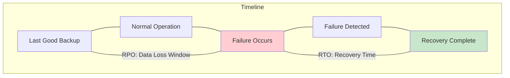
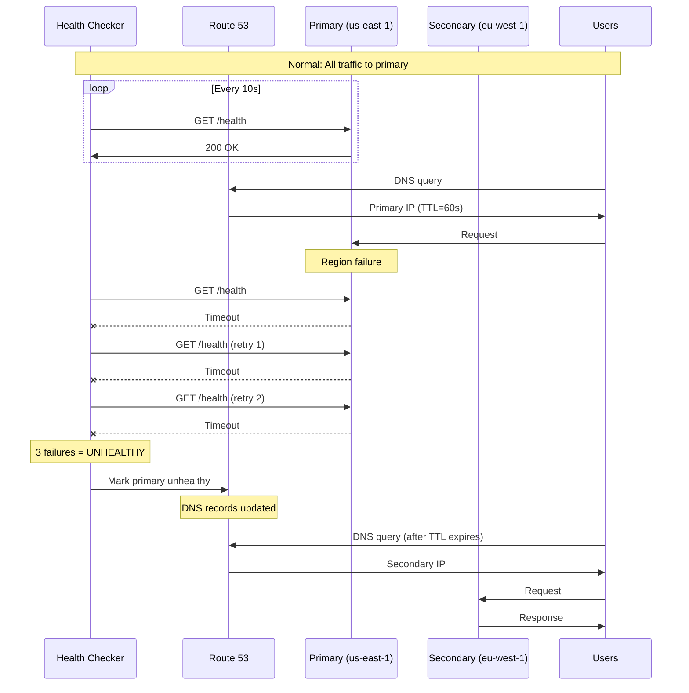
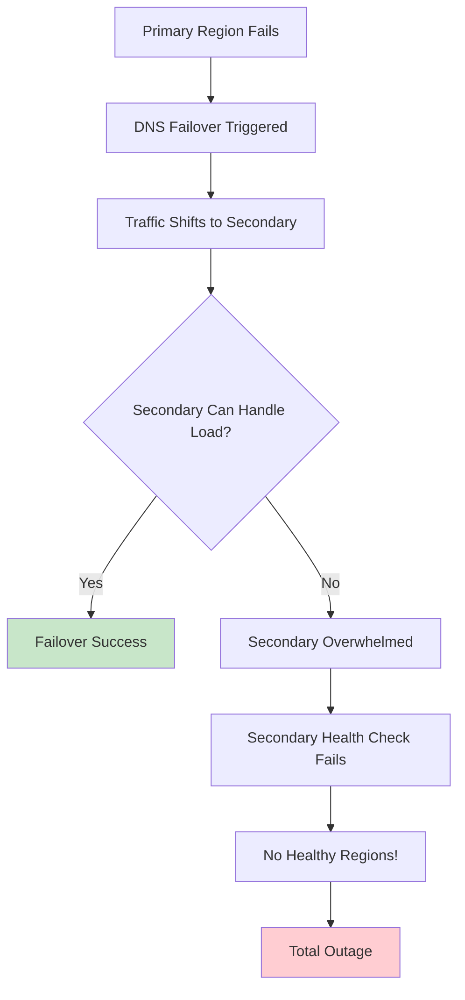
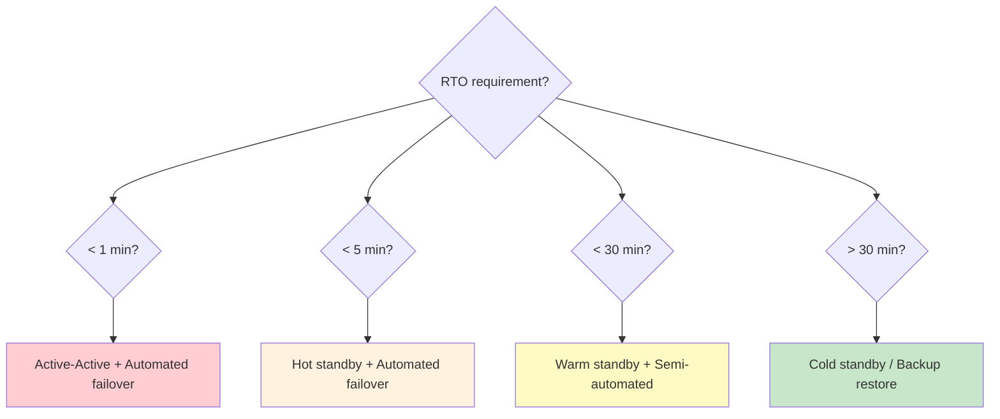

# Failover Strategies

## Why Failover Strategy Matters

A multi-region architecture without a tested failover strategy is a false sense of security. The infrastructure exists in multiple regions, the data is replicated, the routing is configured — but when a region actually fails at 3 AM on a holiday weekend, does anyone know what to do? Can the systems do it automatically? Have you tested it?

The 2017 S3 outage proved that even AWS's own services can fail at a regional level. The companies that survived without impact had something in common: automated, tested failover procedures that executed without human intervention.

### RPO and RTO: The Two Numbers That Define Your Strategy

**Recovery Point Objective (RPO)**: How much data can you afford to lose? This is measured in time — an RPO of 5 minutes means you can lose at most 5 minutes of data.

**Recovery Time Objective (RTO)**: How quickly must you recover? This is the maximum acceptable downtime.



| Business Impact Level | RPO | RTO | Example |
|----------------------|-----|-----|---------|
| Mission Critical | 0 (zero data loss) | < 1 minute | Payment processing |
| Business Critical | < 1 minute | < 5 minutes | E-commerce checkout |
| Important | < 15 minutes | < 30 minutes | Internal business apps |
| Standard | < 1 hour | < 4 hours | Content management |
| Low Priority | < 24 hours | < 24 hours | Development environments |

## First Principles

### The Failover Equation

Total downtime during a failure event is:

$$
T_{\text{downtime}} = T_{\text{detect}} + T_{\text{decide}} + T_{\text{execute}} + T_{\text{verify}}
$$

Where:
- $T_{\text{detect}}$ = Time to detect the failure (health checks, monitoring)
- $T_{\text{decide}}$ = Time to decide to failover (manual approval or automated)
- $T_{\text{execute}}$ = Time to perform the failover (DNS, DB promotion, scaling)
- $T_{\text{verify}}$ = Time to verify the failover succeeded (smoke tests)

For each component:

| Component | Manual | Semi-Automated | Fully Automated |
|-----------|--------|---------------|----------------|
| Detection | 5-30 min | 30s-2 min | 10-30s |
| Decision | 10-60 min | 1-5 min | 0s (automatic) |
| Execution | 15-60 min | 5-15 min | 1-5 min |
| Verification | 5-15 min | 2-5 min | 30s-2 min |
| **Total RTO** | **35-165 min** | **8-27 min** | **2-8 min** |

### Failure Detection Theory

Reliable failure detection uses the **phi accrual failure detector** or simpler threshold-based approaches:

$$
\text{Failure Declared} \iff \text{consecutive\_failures} \geq \text{threshold}
$$

The trade-off between false positives (unnecessary failovers) and detection speed:

$$
T_{\text{detect}} = \text{check\_interval} \times \text{failure\_threshold}
$$

| Check Interval | Threshold | Detection Time | False Positive Risk |
|---------------|-----------|---------------|-------------------|
| 5s | 2 | 10s | Higher |
| 10s | 3 | 30s | Moderate |
| 30s | 3 | 90s | Lower |
| 60s | 5 | 300s | Lowest |

::: warning
False positive failovers can be worse than the original failure. A failover triggered by a 10-second network blip can cause minutes of disruption. Configure detection thresholds conservatively.
:::

## Core Mechanics

### DNS Failover

DNS failover uses health checks to automatically update DNS records when a primary endpoint becomes unhealthy:



**Limitations of DNS failover**:
1. TTL-dependent: Users with cached DNS continue hitting the failed primary
2. No connection draining: Active TCP connections are dropped
3. Health check latency: Detection takes multiple check intervals
4. DNS propagation: Some resolvers cache beyond TTL

### Database Failover

Database failover is typically the most complex and risky part:

```typescript
// src/failover/database-failover.ts
interface DatabaseFailoverConfig {
  primaryEndpoint: string;
  replicaEndpoints: string[];
  maxReplicationLag: number;  // milliseconds
  promotionTimeout: number;    // milliseconds
}

interface DatabaseState {
  isPrimary: boolean;
  replicationLag: number;
  connectedClients: number;
  walPosition: string;
}

class DatabaseFailoverOrchestrator {
  private currentPrimary: string;

  constructor(private config: DatabaseFailoverConfig) {
    this.currentPrimary = config.primaryEndpoint;
  }

  async executeDatabaseFailover(
    targetReplica: string
  ): Promise<{ success: boolean; dataLoss: number }> {
    console.log(`Starting database failover to ${targetReplica}`);

    // Step 1: Check replication lag
    const lag = await this.getReplicationLag(targetReplica);
    console.log(`Current replication lag: ${lag}ms`);

    if (lag > this.config.maxReplicationLag) {
      console.warn(
        `Replication lag ${lag}ms exceeds threshold ${this.config.maxReplicationLag}ms`
      );
      // Continue anyway in DR scenario, but log the data loss
    }

    // Step 2: Try to fence the old primary (prevent split-brain)
    try {
      await this.fencePrimary(this.currentPrimary);
      console.log('Old primary fenced successfully');
    } catch (error) {
      console.warn(
        'Could not fence old primary (may be unreachable):',
        error
      );
      // In a true outage, the primary may not be reachable to fence
    }

    // Step 3: Wait for replica to apply remaining WAL
    const waitStart = Date.now();
    while (Date.now() - waitStart < this.config.promotionTimeout) {
      const currentLag = await this.getReplicationLag(targetReplica);
      if (currentLag === 0) {
        console.log('Replica caught up to primary');
        break;
      }
      await new Promise(r => setTimeout(r, 1000));
    }

    // Step 4: Promote the replica
    await this.promoteReplica(targetReplica);
    console.log(`Replica ${targetReplica} promoted to primary`);

    // Step 5: Update application connection strings
    await this.updateConnectionConfig(targetReplica);

    // Step 6: Verify new primary is accepting writes
    await this.verifyWriteCapability(targetReplica);

    const finalLag = lag; // Data loss = replication lag at time of failover
    this.currentPrimary = targetReplica;

    return {
      success: true,
      dataLoss: finalLag,
    };
  }

  private async fencePrimary(endpoint: string): Promise<void> {
    // Revoke write permissions, close connections
    // AWS RDS: Modify instance to read-only
    // PostgreSQL: SELECT pg_terminate_backend(pid) for all write connections
    console.log(`Fencing primary at ${endpoint}`);
  }

  private async promoteReplica(endpoint: string): Promise<void> {
    // AWS RDS: aws rds promote-read-replica
    // Aurora: aws rds failover-global-cluster
    // PostgreSQL: pg_promote()
    console.log(`Promoting replica at ${endpoint}`);
  }

  private async getReplicationLag(replica: string): Promise<number> {
    // Query replication lag from replica
    const result = await this.query(
      replica,
      `SELECT EXTRACT(EPOCH FROM (now() - pg_last_xact_replay_timestamp())) * 1000 AS lag_ms`
    );
    return result.rows[0].lag_ms;
  }

  private async updateConnectionConfig(newPrimary: string): Promise<void> {
    // Update service discovery, config maps, or parameter store
    console.log(`Updating connection config to ${newPrimary}`);
  }

  private async verifyWriteCapability(endpoint: string): Promise<void> {
    // Attempt a write operation
    await this.query(
      endpoint,
      `INSERT INTO failover_test (id, timestamp)
       VALUES (gen_random_uuid(), now())
       ON CONFLICT DO NOTHING`
    );
    console.log('Write verification successful');
  }
}
```

### Full Failover Orchestration

```typescript
// src/failover/failover-orchestrator.ts
interface FailoverPlan {
  steps: FailoverStep[];
  rollbackSteps: FailoverStep[];
  preChecks: PreCheck[];
  postChecks: PostCheck[];
}

interface FailoverStep {
  name: string;
  action: () => Promise<void>;
  timeout: number;
  retries: number;
  rollback?: () => Promise<void>;
  critical: boolean;  // If false, failure doesn't abort the plan
}

interface PreCheck {
  name: string;
  check: () => Promise<boolean>;
}

interface PostCheck {
  name: string;
  check: () => Promise<boolean>;
  timeout: number;
}

class FailoverOrchestrator {
  async execute(plan: FailoverPlan): Promise<{
    success: boolean;
    duration: number;
    steps: { name: string; status: string; duration: number }[];
  }> {
    const startTime = Date.now();
    const stepResults: { name: string; status: string; duration: number }[] = [];

    // Run pre-checks
    console.log('Running pre-checks...');
    for (const check of plan.preChecks) {
      const passed = await check.check();
      if (!passed) {
        console.error(`Pre-check failed: ${check.name}`);
        return {
          success: false,
          duration: Date.now() - startTime,
          steps: [{ name: check.name, status: 'pre-check-failed', duration: 0 }],
        };
      }
    }

    // Execute failover steps
    const completedSteps: FailoverStep[] = [];

    for (const step of plan.steps) {
      const stepStart = Date.now();
      console.log(`Executing: ${step.name}`);

      let success = false;
      for (let attempt = 0; attempt <= step.retries; attempt++) {
        try {
          await Promise.race([
            step.action(),
            this.timeout(step.timeout),
          ]);
          success = true;
          break;
        } catch (error) {
          console.warn(
            `Step "${step.name}" attempt ${attempt + 1} failed:`,
            error
          );
          if (attempt === step.retries) {
            if (step.critical) {
              console.error(`Critical step "${step.name}" failed. Rolling back.`);
              await this.rollback(completedSteps);
              stepResults.push({
                name: step.name,
                status: 'failed',
                duration: Date.now() - stepStart,
              });
              return {
                success: false,
                duration: Date.now() - startTime,
                steps: stepResults,
              };
            } else {
              console.warn(`Non-critical step "${step.name}" failed, continuing.`);
            }
          }
        }
      }

      completedSteps.push(step);
      stepResults.push({
        name: step.name,
        status: success ? 'success' : 'skipped',
        duration: Date.now() - stepStart,
      });
    }

    // Run post-checks
    console.log('Running post-checks...');
    for (const check of plan.postChecks) {
      const checkStart = Date.now();
      let passed = false;

      while (Date.now() - checkStart < check.timeout) {
        passed = await check.check();
        if (passed) break;
        await new Promise(r => setTimeout(r, 5000));
      }

      if (!passed) {
        console.error(`Post-check failed: ${check.name}. Initiating rollback.`);
        await this.rollback(completedSteps);
        return {
          success: false,
          duration: Date.now() - startTime,
          steps: stepResults,
        };
      }

      stepResults.push({
        name: `post-check: ${check.name}`,
        status: 'success',
        duration: Date.now() - checkStart,
      });
    }

    return {
      success: true,
      duration: Date.now() - startTime,
      steps: stepResults,
    };
  }

  private async rollback(completedSteps: FailoverStep[]): Promise<void> {
    // Rollback in reverse order
    for (const step of [...completedSteps].reverse()) {
      if (step.rollback) {
        try {
          console.log(`Rolling back: ${step.name}`);
          await step.rollback();
        } catch (error) {
          console.error(`Rollback of "${step.name}" failed:`, error);
          // Continue rolling back other steps
        }
      }
    }
  }

  private timeout(ms: number): Promise<never> {
    return new Promise((_, reject) =>
      setTimeout(() => reject(new Error('Timeout')), ms)
    );
  }
}

// Example failover plan
function createFailoverPlan(
  fromRegion: string,
  toRegion: string
): FailoverPlan {
  return {
    preChecks: [
      {
        name: 'Target region is healthy',
        check: async () => {
          const health = await checkRegionHealth(toRegion);
          return health.status === 'healthy';
        },
      },
      {
        name: 'Replication lag is acceptable',
        check: async () => {
          const lag = await getReplicationLag(toRegion);
          return lag < 5000;  // < 5 seconds
        },
      },
    ],

    steps: [
      {
        name: 'Enable read-only mode on primary',
        action: () => setReadOnlyMode(fromRegion, true),
        timeout: 30000,
        retries: 2,
        rollback: () => setReadOnlyMode(fromRegion, false),
        critical: false,  // Primary might be unreachable
      },
      {
        name: 'Wait for replication to catch up',
        action: () => waitForReplicationSync(toRegion, 30000),
        timeout: 60000,
        retries: 0,
        critical: false,  // Best effort
      },
      {
        name: 'Promote database replica',
        action: () => promoteReplica(toRegion),
        timeout: 120000,
        retries: 1,
        critical: true,
      },
      {
        name: 'Scale up compute in target region',
        action: () => scaleCompute(toRegion, 'production'),
        timeout: 300000,
        retries: 2,
        rollback: () => scaleCompute(toRegion, 'standby'),
        critical: true,
      },
      {
        name: 'Update DNS routing',
        action: () => updateDnsRouting(toRegion),
        timeout: 30000,
        retries: 3,
        rollback: () => updateDnsRouting(fromRegion),
        critical: true,
      },
      {
        name: 'Invalidate CDN caches',
        action: () => invalidateCdnCaches(),
        timeout: 60000,
        retries: 1,
        critical: false,
      },
    ],

    rollbackSteps: [],

    postChecks: [
      {
        name: 'Application responding in target region',
        check: async () => {
          const response = await fetch(`https://${toRegion}.myapp.internal/health`);
          return response.ok;
        },
        timeout: 120000,
      },
      {
        name: 'Database accepting writes',
        check: async () => {
          try {
            await testDatabaseWrite(toRegion);
            return true;
          } catch {
            return false;
          }
        },
        timeout: 60000,
      },
      {
        name: 'End-to-end request succeeds',
        check: async () => {
          const response = await fetch('https://api.myapp.com/smoke-test');
          return response.ok;
        },
        timeout: 120000,
      },
    ],
  };
}
```

### Chaos Engineering for Failover Validation

```typescript
// src/chaos/chaos-experiments.ts
interface ChaosExperiment {
  name: string;
  description: string;
  hypothesis: string;
  blast_radius: 'low' | 'medium' | 'high';
  duration: number;  // seconds
  rollback: () => Promise<void>;
}

class ChaosRunner {
  async runExperiment(experiment: ChaosExperiment): Promise<{
    hypothesis_validated: boolean;
    observations: string[];
    metrics: Record<string, number>;
  }> {
    console.log(`Starting chaos experiment: ${experiment.name}`);
    console.log(`Hypothesis: ${experiment.hypothesis}`);

    const observations: string[] = [];
    const baselineMetrics = await this.collectMetrics();

    try {
      // Run the experiment
      await this.injectFailure(experiment);

      // Monitor during experiment
      const experimentMetrics = await this.monitorDuring(
        experiment.duration
      );

      // Collect observations
      const errorRate = experimentMetrics.errorRate;
      const latencyP99 = experimentMetrics.latencyP99;

      if (errorRate > 0.01) {
        observations.push(
          `Error rate increased to ${(errorRate * 100).toFixed(2)}%`
        );
      }
      if (latencyP99 > baselineMetrics.latencyP99 * 2) {
        observations.push(
          `P99 latency doubled: ${latencyP99}ms (baseline: ${baselineMetrics.latencyP99}ms)`
        );
      }

      const hypothesis_validated = errorRate < 0.05 && latencyP99 < 1000;

      return {
        hypothesis_validated,
        observations,
        metrics: experimentMetrics,
      };
    } finally {
      // Always rollback
      console.log('Rolling back experiment...');
      await experiment.rollback();
      console.log('Rollback complete');
    }
  }
}

// Example experiments
const experiments: ChaosExperiment[] = [
  {
    name: 'Region Failure',
    description: 'Simulate complete failure of primary region',
    hypothesis: 'Traffic automatically fails over to secondary within 2 minutes with < 1% error rate',
    blast_radius: 'high',
    duration: 600,  // 10 minutes
    rollback: async () => {
      await restoreRegion('us-east-1');
      await updateDnsRouting('us-east-1');
    },
  },
  {
    name: 'Database Failover',
    description: 'Force database failover to read replica',
    hypothesis: 'Application recovers within 30 seconds with read-your-writes consistency',
    blast_radius: 'medium',
    duration: 300,
    rollback: async () => {
      await restoreDatabase('us-east-1');
    },
  },
  {
    name: 'Network Partition',
    description: 'Block cross-region network traffic',
    hypothesis: 'Each region continues serving local users independently',
    blast_radius: 'medium',
    duration: 300,
    rollback: async () => {
      await restoreNetworkConnectivity();
    },
  },
  {
    name: 'Cache Failure',
    description: 'Terminate all Redis nodes in primary region',
    hypothesis: 'Application falls back to database with < 2x latency increase',
    blast_radius: 'medium',
    duration: 300,
    rollback: async () => {
      await restoreCache('us-east-1');
    },
  },
];
```

### GameDay: Scheduled Failover Drills

```yaml
# GameDay checklist template
name: Monthly Failover Drill
date: 2026-03-18
participants:
  - Platform Engineering (lead)
  - SRE On-call
  - Database Team
  - Application Team Lead

pre-drill:
  - [ ] Notify stakeholders (customer support, management)
  - [ ] Verify monitoring dashboards are accessible
  - [ ] Confirm rollback procedures are documented
  - [ ] Check replication lag is < 1 second
  - [ ] Verify secondary region capacity

drill-steps:
  - name: "Block primary region health checks"
    command: "aws route53 update-health-check --health-check-id XXX --disabled"
    expected: "Route 53 detects failure within 30 seconds"
    timeout: 120s

  - name: "Verify DNS failover"
    command: "dig +short api.myapp.com @8.8.8.8"
    expected: "Returns secondary region IP"
    timeout: 300s

  - name: "Verify application health"
    command: "curl -s https://api.myapp.com/health"
    expected: "200 OK, x-served-from: eu-west-1"
    timeout: 120s

  - name: "Run smoke tests against production"
    command: "npm run test:smoke -- --env production"
    expected: "All tests pass"
    timeout: 300s

  - name: "Verify data consistency"
    command: "npm run verify:data-consistency"
    expected: "No data discrepancies"
    timeout: 300s

  - name: "Restore primary region"
    command: "aws route53 update-health-check --health-check-id XXX --no-disabled"
    expected: "Traffic returns to primary within TTL"
    timeout: 300s

post-drill:
  - [ ] Document actual RTO vs target
  - [ ] Document any data loss (RPO)
  - [ ] Record issues encountered
  - [ ] Create action items for improvements
  - [ ] Update runbooks if needed
```

## Edge Cases & Failure Modes

### Failover Anti-Patterns

| Anti-Pattern | Why It's Dangerous | Better Approach |
|-------------|-------------------|----------------|
| Manual-only failover | Slow, error-prone, depends on key personnel | Automated with manual override |
| Untested failover | Breaks when needed most | Monthly drills |
| Failover without fencing | Split-brain: both regions accepting writes | STONITH (Shoot The Other Node In The Head) |
| Immediate failback | Oscillation between regions | Wait for stability + verification |
| Ignoring state services | Database, cache, queue state lost | Stateful failover orchestration |
| Global dependencies | Auth, DNS, billing are single-region | Make global services multi-region |
| No communication plan | Users and teams don't know what's happening | Automated status page updates |

### The Failover Cascade



**Prevention**: Always provision secondary regions to handle 100% of traffic. If you run active-active at 50%/50%, each region must be able to handle 100% (i.e., each region is at most 50% utilized normally).

### Split-Brain Prevention

```typescript
// src/failover/fence.ts — STONITH implementation
class Fencer {
  /**
   * Fence a region to prevent split-brain.
   * STONITH: Shoot The Other Node In The Head
   */
  async fence(region: string): Promise<boolean> {
    console.log(`Fencing region ${region}`);

    const actions = [
      // 1. Revoke write permissions on database
      this.revokeDatabaseWrites(region),

      // 2. Block network access from this region's apps
      this.updateSecurityGroups(region, 'deny-writes'),

      // 3. Set application to read-only mode
      this.setReadOnlyMode(region),

      // 4. Remove from load balancer
      this.deregisterFromLoadBalancer(region),
    ];

    const results = await Promise.allSettled(actions);
    const successes = results.filter(r => r.status === 'fulfilled').length;

    // At least one fencing action must succeed
    if (successes === 0) {
      console.error('ALL FENCING ACTIONS FAILED - SPLIT BRAIN RISK');
      // Last resort: shut down the region's compute entirely
      await this.emergencyShutdown(region);
    }

    return successes > 0;
  }

  private async revokeDatabaseWrites(region: string): Promise<void> {
    // AWS RDS: Modify instance to read-only
    // PostgreSQL: ALTER USER app_user SET default_transaction_read_only = on
    console.log(`Revoking database writes in ${region}`);
  }

  private async emergencyShutdown(region: string): Promise<void> {
    // Last resort: stop all compute in the region
    console.log(`EMERGENCY: Shutting down all compute in ${region}`);
  }
}
```

## Performance Characteristics

### Failover Speed by Component

| Component | Hot Standby | Warm Standby | Cold Standby |
|-----------|------------|-------------|-------------|
| Compute (ECS/K8s) | 0s (already running) | 60-120s (scale up) | 300-600s (deploy) |
| Database (RDS) | 60-120s (promote) | 60-120s (promote) | 600-1800s (restore) |
| Cache (Redis) | 0s (replicated) | 300-600s (warm up) | 600-1800s (cold start) |
| DNS propagation | 60-300s | 60-300s | 60-300s |
| CDN invalidation | 5-30s | 5-30s | 5-30s |
| **Total (parallel)** | **~2-5 min** | **~5-10 min** | **~15-30 min** |

### Data Loss by Replication Type

| Replication Type | Typical RPO | Worst Case RPO | Cost |
|-----------------|------------|---------------|------|
| Synchronous | 0 | 0 | Highest (latency penalty) |
| Semi-synchronous | < 1s | < 5s | High |
| Async (streaming) | < 5s | < 60s | Moderate |
| Async (batch) | 1-15 min | 1+ hour | Lowest |
| Backup-based | 1-24 hours | Days | Lowest |

## Mathematical Foundations

### RPO/RTO Cost Model

The cost of achieving a given RPO/RTO is approximately exponential:

$$
C(\text{RPO}, \text{RTO}) = C_0 \times e^{-\alpha \cdot \text{RPO}} \times e^{-\beta \cdot \text{RTO}}
$$

Where $C_0$ is the base infrastructure cost, and $\alpha$, $\beta$ are scaling constants.

In practice, the cost to halve your RPO or RTO roughly doubles your infrastructure spending:

| RPO/RTO Target | Infrastructure Cost Multiplier |
|---------------|-------------------------------|
| 24 hours / 24 hours | 1.0x (baseline) |
| 1 hour / 4 hours | 1.3x |
| 15 min / 30 min | 1.5x |
| 1 min / 5 min | 2.0x |
| 0 / 1 min | 2.5-3.0x |
| 0 / seconds | 3.0-4.0x |

### Availability with Failover

$$
A = 1 - \frac{\text{MTTR}}{\text{MTBF} + \text{MTTR}}
$$

Where:
- MTTR = Mean Time To Recovery (includes detection + failover + verification)
- MTBF = Mean Time Between Failures

For MTBF = 720 hours (monthly regional incident) and MTTR = 5 minutes (automated failover):

$$
A = 1 - \frac{0.083}{720 + 0.083} = 1 - 0.000115 = 99.988\%
$$

For MTTR = 120 minutes (manual failover):

$$
A = 1 - \frac{2}{720 + 2} = 1 - 0.00277 = 99.72\%
$$

The difference: 99.988% vs. 99.72% = ~23 additional hours of downtime per year.

## Real-World War Stories

::: info War Story — The Failover That Caused the Outage
A media company's automated failover triggered during a brief network glitch (15 seconds). The failover succeeded, routing all traffic to the secondary region. But the secondary's database replica was 3 minutes behind (unnoticed because monitoring only alerted at 5 minutes). Users saw comments and posts from 3 minutes ago, causing confusion.

Then the primary region recovered. The automated failback triggered immediately, routing traffic back. But during the 2 minutes on the secondary, users had created new content that only existed in the secondary's database. The failback caused this content to "disappear."

**Root cause**:
1. Failover triggered too aggressively (15-second blip)
2. No replication lag check before failover
3. Automatic failback without data reconciliation

**Fix**:
1. Increased failure detection threshold from 2 to 5 consecutive failures
2. Added pre-failover check: replication lag must be < 5 seconds
3. Disabled automatic failback — failback is always manual after data reconciliation
4. Added a "cool-down" period: no failover within 30 minutes of a previous failover

**Lesson**: The failover mechanism can cause more damage than the original failure. Design for safety, not just speed.
:::

::: info War Story — The 11-Hour Database Promotion
A financial services company attempted to failover their PostgreSQL database during a regional incident. The read replica promotion took 11 hours because:

1. The replica had 2 TB of data and was processing a backlog of 50 GB of WAL files
2. PostgreSQL's recovery process is single-threaded — it cannot parallelize WAL replay
3. The IO-bound recovery was further slowed by competing with application health check queries

**Impact**: 11 hours of downtime for a system with a 4-hour RTO SLA.

**Fix**:
1. Switched to Aurora Global Database (sub-minute failover)
2. For non-Aurora databases: reduced WAL replay backlog by monitoring and alerting on replication lag at 100 MB
3. Provisioned replicas with IOPS-optimized storage to accelerate recovery
4. Implemented application-level read-only mode to serve cached data during failover

**Lesson**: Database promotion time is proportional to replication lag. Monitor lag obsessively — it's your RPO AND your RTO.
:::

## Decision Framework

### Choosing a Failover Strategy



| Strategy | RTO | RPO | Cost | Complexity | Best For |
|----------|-----|-----|------|-----------|----------|
| Active-Active auto | < 30s | < 1s | 2.5x | Very High | Critical systems |
| Hot standby auto | 2-5 min | < 30s | 1.5x | High | Important systems |
| Warm standby semi-auto | 10-30 min | 1-15 min | 1.3x | Medium | Standard systems |
| Cold standby manual | 1-4 hours | 15-60 min | 1.1x | Low | Non-critical |
| Backup restore | 4-24 hours | 1-24 hours | 1.0x | Low | Dev/test |

## Advanced Topics

### Automated Failover with AWS Lambda

```typescript
// lambda/failover-handler.ts
import { Route53Client, ChangeResourceRecordSetsCommand } from '@aws-sdk/client-route-53';
import { RDSClient, FailoverGlobalClusterCommand } from '@aws-sdk/client-rds';
import { SNSClient, PublishCommand } from '@aws-sdk/client-sns';

export const handler = async (event: CloudWatchAlarmEvent): Promise<void> => {
  // Triggered by CloudWatch alarm on health check failure
  const alarmName = event.detail.alarmName;
  const region = extractRegionFromAlarm(alarmName);

  console.log(`Failover triggered for region: ${region}`);

  // Step 1: Verify the failure (avoid false positives)
  const confirmed = await confirmFailure(region);
  if (!confirmed) {
    console.log('Failure not confirmed. Aborting failover.');
    return;
  }

  // Step 2: Execute database failover
  const rdsClient = new RDSClient({ region: 'us-east-1' });
  await rdsClient.send(new FailoverGlobalClusterCommand({
    GlobalClusterIdentifier: 'my-global-cluster',
    TargetDbClusterIdentifier: getTargetCluster(region),
  }));

  // Step 3: Update DNS (Route 53 handles this via health checks)
  // ... but we can force it for faster failover

  // Step 4: Notify team
  const snsClient = new SNSClient({ region: 'us-east-1' });
  await snsClient.send(new PublishCommand({
    TopicArn: process.env.ALERT_TOPIC_ARN,
    Subject: `FAILOVER EXECUTED: Region ${region}`,
    Message: JSON.stringify({
      region,
      timestamp: new Date().toISOString(),
      action: 'failover',
      target: getTargetRegion(region),
    }),
  }));
};

async function confirmFailure(region: string): Promise<boolean> {
  // Multi-source confirmation to avoid false positives
  const checks = await Promise.all([
    checkFromRegion('us-east-1', region),
    checkFromRegion('eu-west-1', region),
    checkFromRegion('ap-northeast-1', region),
  ]);

  // At least 2 out of 3 external checks must confirm failure
  const failures = checks.filter(c => !c).length;
  return failures >= 2;
}
```

### Failover Testing Automation

```yaml
# .github/workflows/failover-drill.yml
name: Monthly Failover Drill

on:
  schedule:
    - cron: '0 14 15 * *'  # 15th of each month at 2 PM UTC
  workflow_dispatch:
    inputs:
      target_region:
        description: 'Region to fail over FROM'
        required: true
        default: 'us-east-1'

jobs:
  failover-drill:
    runs-on: ubuntu-latest
    environment: production-drill
    steps:
      - uses: actions/checkout@v4

      - name: Announce drill
        run: |
          curl -X POST "${{ secrets.SLACK_WEBHOOK }}" \
            -d '{"text": "DRILL: Starting monthly failover drill. Target: ${{ inputs.target_region || 'us-east-1' }}"}'

      - name: Record baseline metrics
        id: baseline
        run: |
          LATENCY=$(curl -s -o /dev/null -w '%{time_total}' https://api.myapp.com/health)
          echo "latency=$LATENCY" >> "$GITHUB_OUTPUT"

      - name: Execute failover
        id: failover
        run: |
          START=$(date +%s)
          npm run failover -- --from=${{ inputs.target_region || 'us-east-1' }}
          END=$(date +%s)
          echo "rto=$((END-START))" >> "$GITHUB_OUTPUT"

      - name: Verify failover
        run: npm run test:smoke -- --env production

      - name: Restore primary
        run: npm run failback -- --to=${{ inputs.target_region || 'us-east-1' }}

      - name: Report results
        run: |
          curl -X POST "${{ secrets.SLACK_WEBHOOK }}" \
            -d "{\"text\": \"DRILL COMPLETE: RTO = ${{ steps.failover.outputs.rto }}s\"}"
```

For the cost implications of maintaining failover infrastructure, see [Cost Analysis](./cost-analysis). For understanding how data replication lag affects RPO, see [Data Replication](./data-replication).
