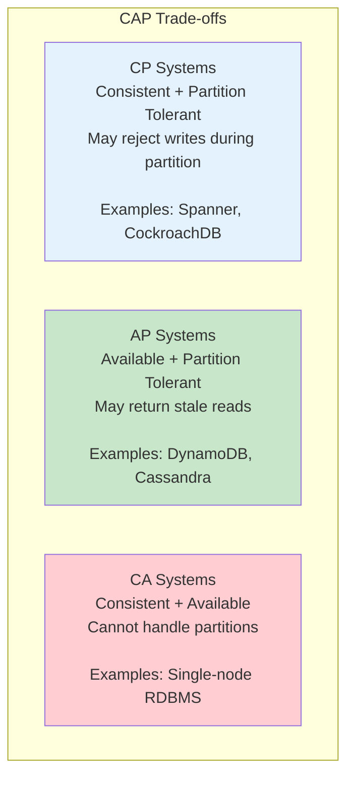
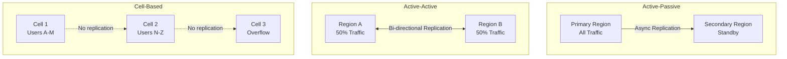
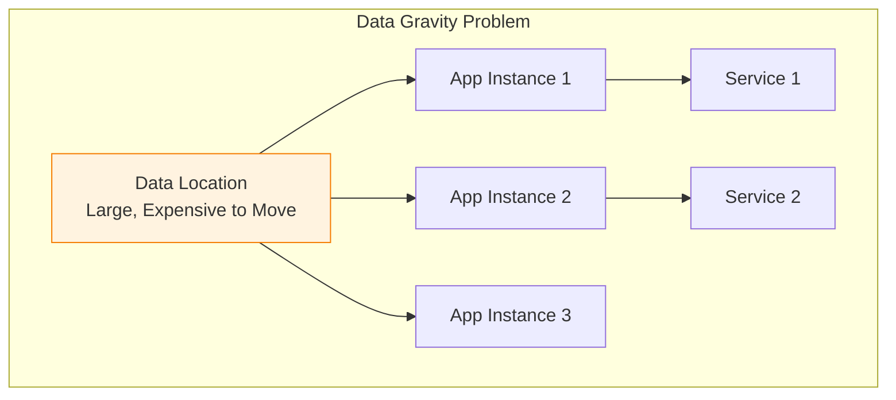
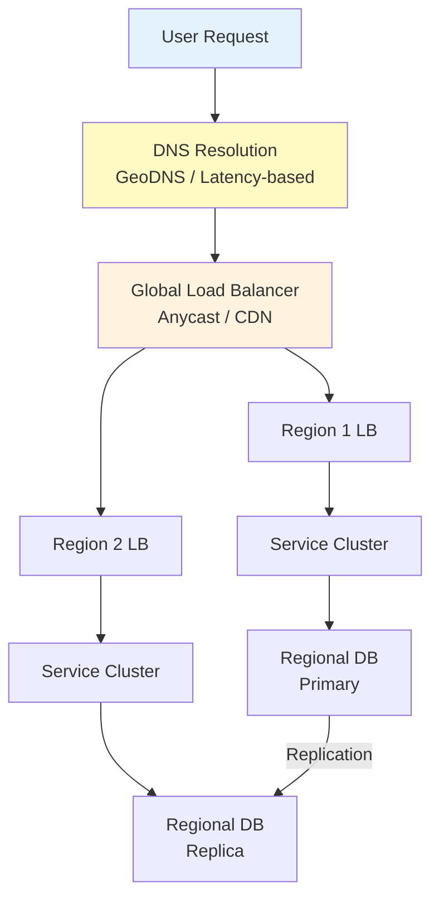
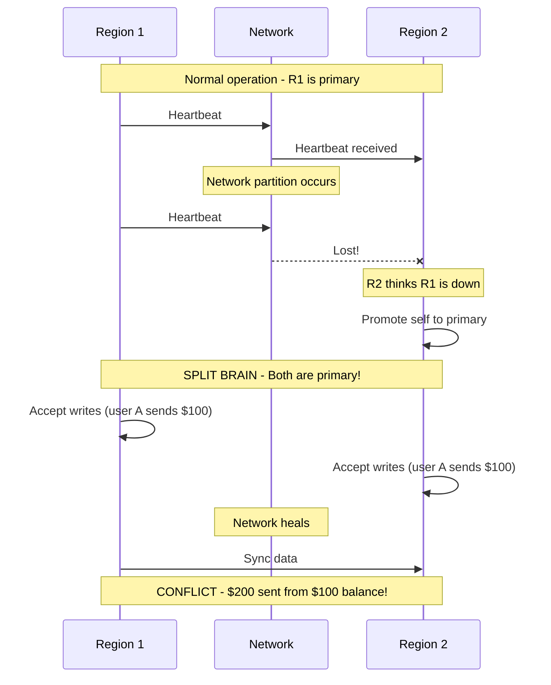
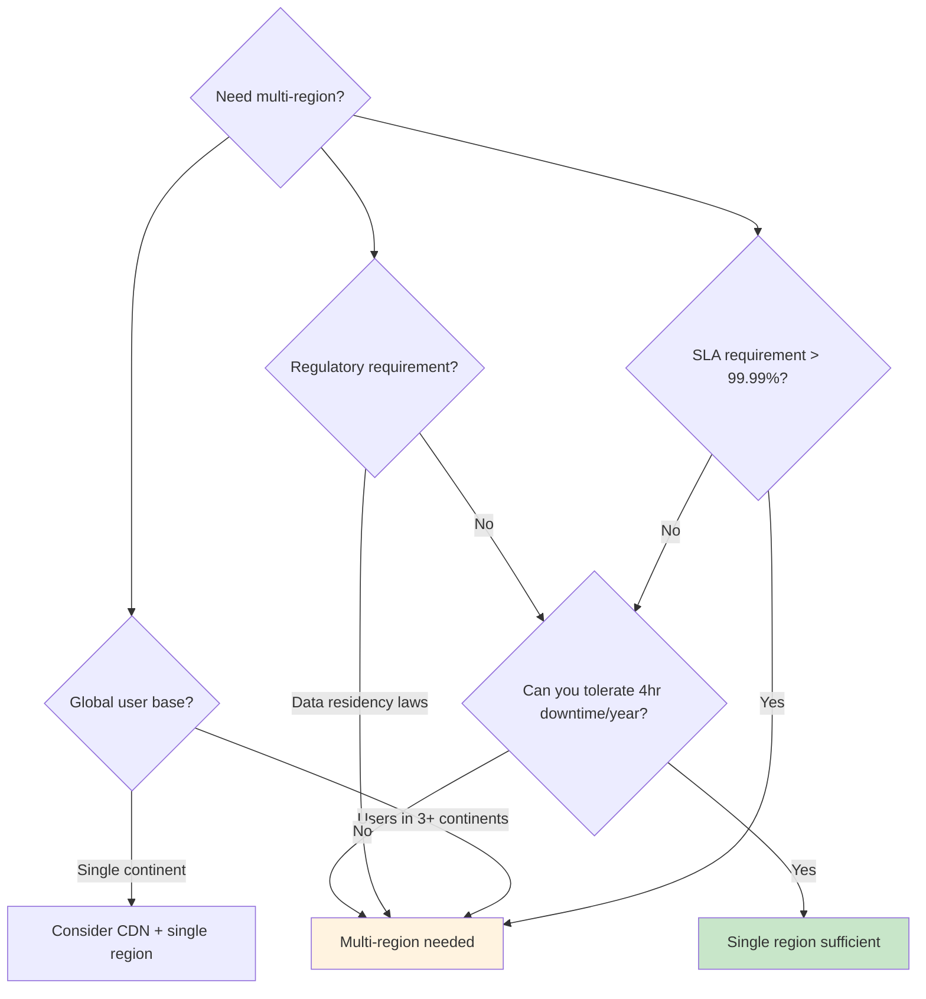

# Multi-Region Infrastructure Overview

## Why Multi-Region Exists

On February 28, 2017, a single mistyped command during routine maintenance in AWS's US-East-1 region took down S3 — and with it, a significant portion of the internet. Companies that relied exclusively on US-East-1 lost revenue, customers, and trust. Companies that had multi-region architectures barely noticed.

Multi-region infrastructure distributes your application across multiple geographic locations — not just for performance, but for survival. It addresses three fundamental requirements that single-region architectures cannot satisfy:

1. **Blast radius containment**: A failure in one region should not take down the entire application
2. **Latency optimization**: Users in Tokyo shouldn't wait 200ms for data to round-trip to Virginia
3. **Regulatory compliance**: GDPR, data residency laws, and sovereignty requirements demand data stays in specific geographies

### The Problem at Scale

| Problem | Single Region | Multi-Region |
|---------|--------------|-------------|
| Region outage | Total downtime | Automatic failover |
| User latency (global) | 100-300ms for distant users | < 50ms for all users |
| Data residency | Single jurisdiction | Comply with local laws |
| Disaster recovery | RPO/RTO in hours | RPO/RTO in minutes/seconds |
| Peak capacity | Limited by one region's capacity | Global capacity pool |
| Blast radius | Everything at risk | Isolated failure domains |

### Historical Context

| Era | Approach | Limitations |
|-----|---------|------------|
| 2000s | Primary + warm standby datacenter | Manual failover, hours of downtime |
| 2010s | Active-passive across regions | Data lag, complex failover |
| 2015s | Active-active with eventual consistency | Split-brain risk, complex data management |
| 2020s | Cell-based architecture | Engineering complexity, but near-zero downtime |
| 2025+ | Edge-native, globally distributed databases | Reduced latency, but cost challenges |

## First Principles

### The CAP Theorem in Multi-Region

The CAP theorem states that a distributed system can provide at most two of three guarantees: Consistency, Availability, and Partition tolerance. In multi-region deployments, network partitions between regions **will** happen — they are not theoretical, they are operational reality.

$$
\text{CAP: Choose two of } \{C, A, P\}
$$

Since partition tolerance is mandatory across regions (you cannot guarantee zero network issues between Virginia and Tokyo), the real choice is:

$$
\text{Multi-Region: } C + P \text{ (sacrifice availability)} \quad \text{or} \quad A + P \text{ (sacrifice consistency)}
$$

In practice, most multi-region systems choose **AP** — availability and partition tolerance — accepting eventual consistency. Critical operations (payments, identity) may use **CP** — consistency and partition tolerance — accepting brief unavailability during network partitions.



### Latency Physics

The speed of light in fiber optic cable is approximately $2 \times 10^8$ m/s (about 2/3 the speed of light in vacuum). This creates hard physical limits on cross-region latency:

$$
T_{\text{one-way}} = \frac{d}{c_{\text{fiber}}} = \frac{d}{2 \times 10^8 \text{ m/s}}
$$

$$
T_{\text{round-trip}} = 2 \times T_{\text{one-way}} + T_{\text{processing}} + T_{\text{routing}}
$$

| Route | Distance (km) | Theoretical Min RTT | Typical RTT |
|-------|--------------|-------------------|-------------|
| US-East <-> US-West | 3,900 | 39 ms | 60-80 ms |
| US-East <-> EU-West | 5,600 | 56 ms | 80-100 ms |
| US-East <-> AP-Tokyo | 10,800 | 108 ms | 150-200 ms |
| EU-West <-> AP-Tokyo | 9,400 | 94 ms | 120-160 ms |
| US-East <-> AP-Sydney | 15,900 | 159 ms | 200-250 ms |
| EU-West <-> AP-Sydney | 17,000 | 170 ms | 220-280 ms |

These are **physical constraints** — no amount of engineering can make light travel faster. Multi-region architecture works with physics, not against it, by placing compute and data closer to users.

### The Availability Equation

Single-region availability is bounded by the region's SLA. Multi-region availability is the complement of simultaneous failure:

$$
A_{\text{single}} = A_{\text{region}}
$$

$$
A_{\text{multi}} = 1 - \prod_{i=1}^{n} (1 - A_i)
$$

For two regions each with 99.99% availability:

$$
A_{\text{multi}} = 1 - (1 - 0.9999)^2 = 1 - 0.00000001 = 99.999999\%
$$

In practice, this theoretical availability is reduced by:
- Failover detection time
- DNS propagation delay
- Data replication lag
- Shared dependencies (global control plane, shared DNS)

A more realistic model:

$$
A_{\text{effective}} = A_{\text{multi}} \times (1 - P_{\text{correlated}}) \times (1 - P_{\text{failover\_failure}})
$$

Where $P_{\text{correlated}}$ is the probability of correlated failures and $P_{\text{failover\_failure}}$ is the probability that the failover mechanism itself fails.

## Core Mechanics

### Architecture Patterns Overview



| Pattern | RPO | RTO | Cost Multiplier | Complexity |
|---------|-----|-----|----------------|-----------|
| Active-Passive | Minutes | Minutes-Hours | 1.3-1.5x | Low |
| Active-Active | Seconds | Seconds | 2.0-2.5x | High |
| Cell-Based | Zero (per cell) | Seconds | 2.0-3.0x | Very High |

These are covered in depth in [Architecture Patterns](./architecture-patterns).

### The Data Problem

Data is the hardest part of multi-region. Compute is stateless — spin up containers anywhere. But data has gravity:



**Data replication strategies** (covered in [Data Replication](./data-replication)):

| Strategy | Consistency | Latency Impact | Conflict Risk |
|----------|------------|---------------|--------------|
| Synchronous replication | Strong | High (adds cross-region RTT) | None |
| Asynchronous replication | Eventual | None | Possible |
| Semi-synchronous | Bounded staleness | Moderate | Low |
| CRDT-based | Eventual (convergent) | None | Auto-resolved |

### Traffic Management

Routing users to the right region requires multiple layers of traffic management:



Detailed in [Traffic Routing](./traffic-routing).

## Implementation: Multi-Region Infrastructure with Terraform

```hcl
# infrastructure/main.tf — Multi-region setup
terraform {
  required_version = ">= 1.5"
  required_providers {
    aws = {
      source  = "hashicorp/aws"
      version = "~> 5.0"
    }
  }

  backend "s3" {
    bucket         = "myorg-terraform-state"
    key            = "multi-region/terraform.tfstate"
    region         = "us-east-1"
    dynamodb_table = "terraform-locks"
    encrypt        = true
  }
}

# Primary region
provider "aws" {
  region = "us-east-1"
  alias  = "primary"
}

# Secondary region
provider "aws" {
  region = "eu-west-1"
  alias  = "secondary"
}

# Tertiary region
provider "aws" {
  region = "ap-northeast-1"
  alias  = "tertiary"
}

locals {
  regions = {
    primary = {
      region     = "us-east-1"
      cidr       = "10.0.0.0/16"
      is_primary = true
    }
    secondary = {
      region     = "eu-west-1"
      cidr       = "10.1.0.0/16"
      is_primary = false
    }
    tertiary = {
      region     = "ap-northeast-1"
      cidr       = "10.2.0.0/16"
      is_primary = false
    }
  }
}

# VPC per region
module "vpc_primary" {
  source    = "./modules/vpc"
  providers = { aws = aws.primary }

  region = local.regions.primary.region
  cidr   = local.regions.primary.cidr
  name   = "primary"
}

module "vpc_secondary" {
  source    = "./modules/vpc"
  providers = { aws = aws.secondary }

  region = local.regions.secondary.region
  cidr   = local.regions.secondary.cidr
  name   = "secondary"
}

module "vpc_tertiary" {
  source    = "./modules/vpc"
  providers = { aws = aws.tertiary }

  region = local.regions.tertiary.region
  cidr   = local.regions.tertiary.cidr
  name   = "tertiary"
}

# Cross-region VPC peering
resource "aws_vpc_peering_connection" "primary_to_secondary" {
  provider    = aws.primary
  vpc_id      = module.vpc_primary.vpc_id
  peer_vpc_id = module.vpc_secondary.vpc_id
  peer_region = "eu-west-1"
  auto_accept = false

  tags = {
    Name = "primary-to-secondary"
  }
}

resource "aws_vpc_peering_connection_accepter" "secondary_accept" {
  provider                  = aws.secondary
  vpc_peering_connection_id = aws_vpc_peering_connection.primary_to_secondary.id
  auto_accept               = true
}

# Global Accelerator for traffic routing
resource "aws_globalaccelerator_accelerator" "main" {
  provider        = aws.primary
  name            = "myapp-global"
  ip_address_type = "IPV4"
  enabled         = true

  attributes {
    flow_logs_enabled   = true
    flow_logs_s3_bucket = "myorg-flow-logs"
    flow_logs_s3_prefix = "global-accelerator/"
  }
}

resource "aws_globalaccelerator_listener" "https" {
  provider        = aws.primary
  accelerator_arn = aws_globalaccelerator_accelerator.main.id
  protocol        = "TCP"

  port_range {
    from_port = 443
    to_port   = 443
  }
}

resource "aws_globalaccelerator_endpoint_group" "primary" {
  provider                  = aws.primary
  listener_arn              = aws_globalaccelerator_listener.https.id
  endpoint_group_region     = "us-east-1"
  health_check_port         = 443
  health_check_protocol     = "TCP"
  health_check_interval_seconds = 10
  threshold_count           = 3
  traffic_dial_percentage   = 100

  endpoint_configuration {
    endpoint_id = module.alb_primary.arn
    weight      = 100
  }
}

resource "aws_globalaccelerator_endpoint_group" "secondary" {
  provider                  = aws.secondary
  listener_arn              = aws_globalaccelerator_listener.https.id
  endpoint_group_region     = "eu-west-1"
  health_check_port         = 443
  health_check_protocol     = "TCP"
  health_check_interval_seconds = 10
  threshold_count           = 3
  traffic_dial_percentage   = 100

  endpoint_configuration {
    endpoint_id = module.alb_secondary.arn
    weight      = 100
  }
}
```

### Application-Level Region Awareness

```typescript
// src/region/region-config.ts
interface RegionConfig {
  regionId: string;
  isPrimary: boolean;
  endpoints: {
    database: string;
    cache: string;
    queue: string;
    storage: string;
  };
  failover: {
    targetRegion: string;
    healthCheckUrl: string;
    failoverThreshold: number;
  };
  dataResidency: {
    allowedRegions: string[];
    piiStorage: 'local' | 'primary';
  };
}

const REGION_CONFIGS: Record<string, RegionConfig> = {
  'us-east-1': {
    regionId: 'us-east-1',
    isPrimary: true,
    endpoints: {
      database: 'primary-db.us-east-1.rds.amazonaws.com',
      cache: 'primary-cache.us-east-1.cache.amazonaws.com',
      queue: 'https://sqs.us-east-1.amazonaws.com/123456789/main-queue',
      storage: 'myapp-data-us-east-1',
    },
    failover: {
      targetRegion: 'eu-west-1',
      healthCheckUrl: 'https://api.eu-west-1.myapp.com/health',
      failoverThreshold: 3,
    },
    dataResidency: {
      allowedRegions: ['us-east-1', 'us-west-2'],
      piiStorage: 'local',
    },
  },
  'eu-west-1': {
    regionId: 'eu-west-1',
    isPrimary: false,
    endpoints: {
      database: 'secondary-db.eu-west-1.rds.amazonaws.com',
      cache: 'secondary-cache.eu-west-1.cache.amazonaws.com',
      queue: 'https://sqs.eu-west-1.amazonaws.com/123456789/main-queue',
      storage: 'myapp-data-eu-west-1',
    },
    failover: {
      targetRegion: 'us-east-1',
      healthCheckUrl: 'https://api.us-east-1.myapp.com/health',
      failoverThreshold: 3,
    },
    dataResidency: {
      allowedRegions: ['eu-west-1', 'eu-central-1'],
      piiStorage: 'local',
    },
  },
};

class RegionManager {
  private config: RegionConfig;
  private healthChecker: HealthChecker;

  constructor(regionId: string) {
    this.config = REGION_CONFIGS[regionId];
    if (!this.config) {
      throw new Error(`Unknown region: ${regionId}`);
    }
    this.healthChecker = new HealthChecker(this.config.failover);
  }

  get isPrimary(): boolean {
    return this.config.isPrimary;
  }

  getEndpoint(service: keyof RegionConfig['endpoints']): string {
    return this.config.endpoints[service];
  }

  canStoreData(dataType: 'pii' | 'general'): boolean {
    if (dataType === 'pii') {
      return this.config.dataResidency.piiStorage === 'local';
    }
    return true;
  }

  async shouldFailover(): Promise<boolean> {
    return this.healthChecker.isUnhealthy();
  }
}
```

## Edge Cases & Failure Modes

### Multi-Region Failure Scenarios

| Failure Mode | Description | Mitigation |
|-------------|-------------|------------|
| Split brain | Both regions think they're primary | Leader election with distributed consensus |
| Replication lag during failover | Secondary behind by minutes | Accept data loss or wait for sync |
| DNS propagation delay | Users still hitting failed region | Low TTL + client-side retry |
| Thundering herd on failover | All traffic hits secondary at once | Rate limiting, auto-scaling warm pools |
| Correlated failures | Both regions in same blast radius | Use truly independent failure domains |
| Data divergence | Conflicting writes in active-active | CRDTs, last-writer-wins, or conflict resolution |
| Certificate/DNS issues | Global resources that span regions | Redundant certificate providers |
| Cascading failures | Failed region overloads surviving region | Circuit breakers, load shedding |

### The Split-Brain Problem



## Performance Characteristics

### Multi-Region Latency Budget

$$
T_{\text{total}} = T_{\text{DNS}} + T_{\text{TLS}} + T_{\text{network}} + T_{\text{processing}} + T_{\text{data}}
$$

| Component | Local Region | Cross-Region |
|-----------|-------------|-------------|
| DNS resolution | 1-5 ms | 1-5 ms |
| TLS handshake | 5-20 ms | 50-100 ms |
| Network RTT | 1-5 ms | 50-200 ms |
| Application processing | 10-50 ms | 10-50 ms |
| Database query | 5-20 ms | 60-250 ms (if cross-region) |
| **Total** | **22-100 ms** | **171-605 ms** |

### Cost Comparison

| Component | Single Region | 2 Regions | 3 Regions |
|-----------|-------------|-----------|-----------|
| Compute | $10,000/mo | $18,000/mo | $26,000/mo |
| Database | $5,000/mo | $9,000/mo | $13,000/mo |
| Data transfer | $500/mo | $3,000/mo | $7,000/mo |
| Load balancing | $200/mo | $600/mo | $1,000/mo |
| DNS + health checks | $50/mo | $150/mo | $250/mo |
| **Total** | **$15,750/mo** | **$30,750/mo** | **$47,250/mo** |
| **Cost multiplier** | **1.0x** | **1.95x** | **3.0x** |

Detailed in [Cost Analysis](./cost-analysis).

## Mathematical Foundations

### Replication Lag Model

For asynchronous replication between regions:

$$
L = \frac{W \times S}{B - W \times S}
$$

Where:
- $L$ = replication lag (seconds)
- $W$ = write rate (writes/second)
- $S$ = average write size (bytes)
- $B$ = replication bandwidth (bytes/second)

When $W \times S$ approaches $B$, lag grows unbounded — the replica can never catch up.

### Quorum Systems

For a replicated system with $n$ replicas, read quorum $r$ and write quorum $w$:

$$
r + w > n \quad \text{(for strong consistency)}
$$

$$
w > \frac{n}{2} \quad \text{(to prevent conflicting writes)}
$$

With 3 regions: $r = 2, w = 2$ provides strong consistency.
With 5 regions: $r = 3, w = 3$ provides strong consistency with tolerance for 2 region failures.

## Real-World War Stories

::: info War Story — The US-East-1 Dependency
In 2017, an S3 outage in US-East-1 cascaded across the internet because many "multi-region" applications had hidden dependencies on US-East-1. AWS's own service health dashboard was hosted in US-East-1 and went down, making it impossible to even check the status of the outage.

**Hidden dependencies that broke "multi-region" apps**:
- S3 buckets for static assets (only in US-East-1)
- IAM/STS endpoints (global service with US-East-1 dependency)
- CloudFront origin in US-East-1
- Route 53 health checks configured in US-East-1
- Terraform state stored in US-East-1 S3

**Lesson**: Multi-region means multi-region for EVERYTHING — not just compute. Audit every dependency, every service, every configuration for region-specific assumptions.
:::

::: info War Story — The $2M Replication Bill
A social media startup launched active-active in 3 regions. Their real-time feed system replicated every post, comment, and reaction to all regions. With 500 million events/day at 2 KB average, cross-region data transfer hit 1 TB/day. At $0.02/GB for inter-region transfer, their monthly bill for data transfer alone was $600/month... until they went viral and traffic grew 100x. The data transfer bill hit $60,000/month. Combined with triple compute costs, their multi-region infrastructure cost more than their revenue.

**Fix**: Moved to cell-based architecture. User data lives in the user's home region. Global data (trending topics) uses a lightweight CRDT that transfers only delta updates (100x less data). Cross-region transfer dropped from 1 TB/day to 10 GB/day.

**Lesson**: Multi-region data transfer costs grow linearly with traffic. Design your data model to minimize cross-region replication from the start.
:::

## Decision Framework

### Do You Actually Need Multi-Region?



### Choosing Your Architecture

| Factor | Active-Passive | Active-Active | Cell-Based |
|--------|---------------|---------------|-----------|
| Implementation effort | Low | High | Very High |
| Operational complexity | Low | High | Very High |
| Cost multiplier | 1.3-1.5x | 2.0-2.5x | 2.0-3.0x |
| RPO | Minutes | Seconds | Zero |
| RTO | Minutes | Seconds | Seconds |
| Data consistency | Strong | Eventual | Strong (per cell) |
| Best for | DR only | Global latency | Massive scale |

## Section Overview

This section covers multi-region infrastructure in depth:

| Page | What You'll Learn |
|------|------------------|
| [Architecture Patterns](./architecture-patterns) | Active-passive, active-active, cell-based architectures |
| [Data Replication](./data-replication) | Cross-region replication, conflict resolution, CRDTs |
| [Traffic Routing](./traffic-routing) | GeoDNS, latency-based routing, Global Accelerator |
| [Failover Strategies](./failover-strategies) | DNS failover, RPO/RTO analysis, automated failover |
| [Cost Analysis](./cost-analysis) | Data transfer costs, compute duplication, optimization |

Start with Architecture Patterns to understand the fundamental approaches, then dive into Data Replication for the hardest engineering challenge in multi-region systems.

## Advanced Topics

### The Edge Computing Continuum

Multi-region is evolving toward edge computing — pushing compute and data to dozens or hundreds of locations:

```mermaid
graph TB
    subgraph "Traditional Multi-Region (2-5 regions)"
        T1[US-East]
        T2[EU-West]
        T3[AP-Tokyo]
    end

    subgraph "Edge Computing (50+ locations)"
        E1[CDN PoP 1]
        E2[CDN PoP 2]
        E3[CDN PoP 3]
        E4[CDN PoP 4]
        E5[CDN PoP 5]
        E6["..."]
        E7[CDN PoP N]
    end

    subgraph "Technologies"
        CF[Cloudflare Workers]
        FL[Fly.io]
        DN[Deno Deploy]
        LL[Lambda@Edge]
    end
```

Edge platforms like Cloudflare Workers, Fly.io, and Deno Deploy run application code in 200+ locations worldwide, achieving < 10ms latency for most users. However, they face the same fundamental data challenge: compute can be everywhere, but data can't.

### Globally Distributed Databases

A new generation of databases is designed for multi-region from the ground up:

| Database | Consistency Model | Replication | Latency | Cost |
|----------|------------------|-------------|---------|------|
| CockroachDB | Serializable | Synchronous (Raft) | Higher (consensus overhead) | $$$ |
| Google Spanner | Linearizable | Synchronous (TrueTime) | Higher (GPS clocks) | $$$$ |
| YugabyteDB | Tunable | Synchronous (Raft) | Tunable | $$$ |
| PlanetScale (Vitess) | Eventual | Asynchronous | Low | $$ |
| DynamoDB Global Tables | Eventual | Asynchronous (last-writer-wins) | Low | $$ |
| CassandraDB | Tunable | Configurable quorum | Tunable | $$ |

The choice between these depends on your consistency requirements, latency budget, and willingness to pay — covered in [Data Replication](./data-replication).
