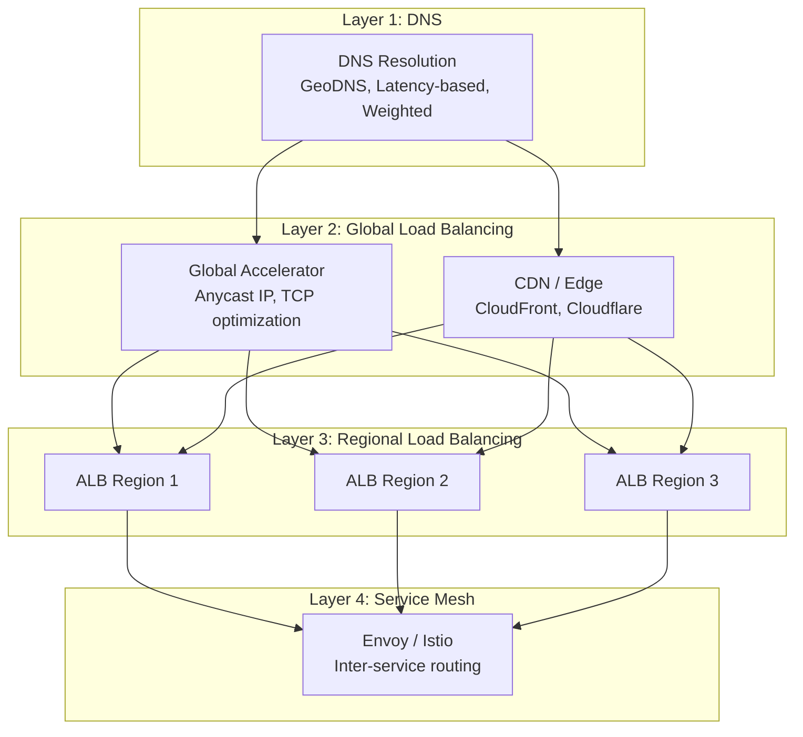
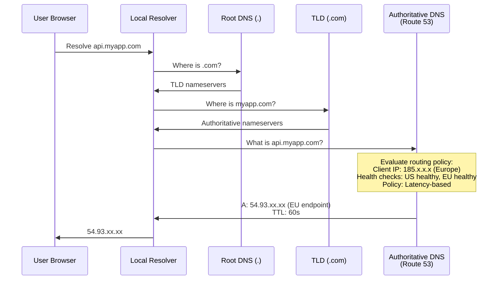
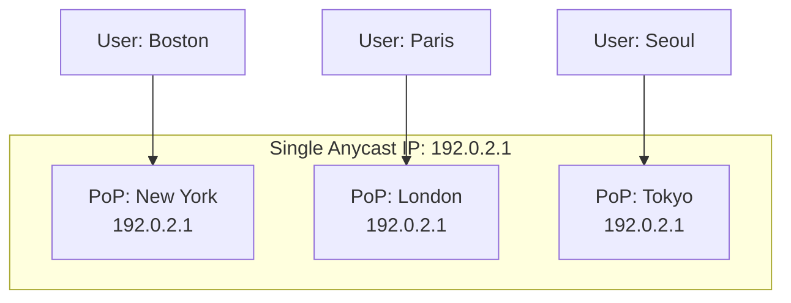
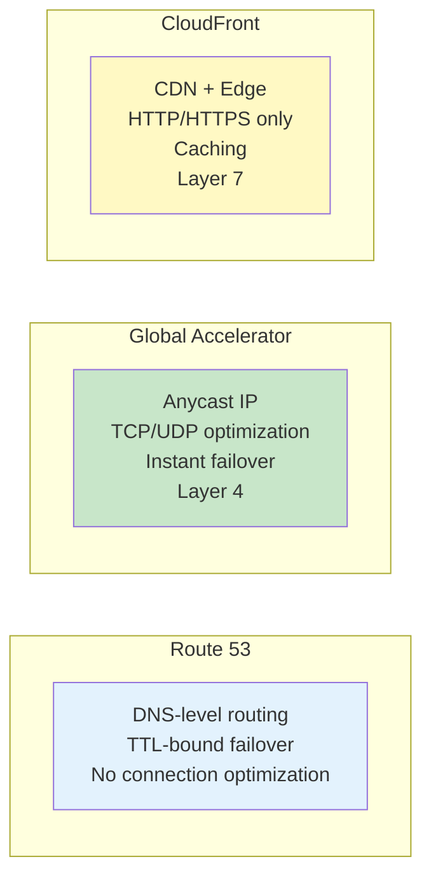
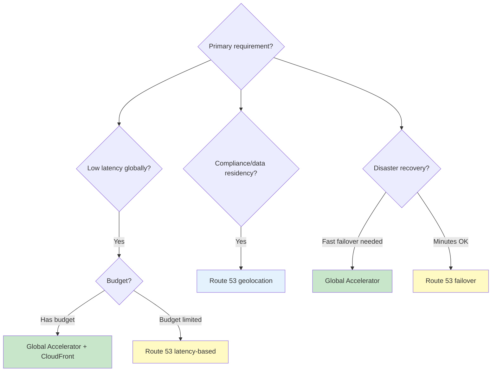

# Traffic Routing

## Why Traffic Routing Matters

Traffic routing is the control plane of multi-region architecture. It decides which region serves each request — and it makes that decision billions of times per day, often in under a millisecond. A misconfigured routing policy can send European users to Asian servers (200ms latency), route traffic to a failed region (downtime), or overwhelm a single region while others sit idle.

The routing layer is also the first responder during incidents. When a region fails, traffic routing is what redirects users to healthy regions. When you deploy a bad build, traffic routing enables instant rollback by shifting traffic away. When you need to drain a region for maintenance, traffic routing does it gracefully.

### The Routing Stack



## First Principles

### DNS as the Foundation

Every internet request begins with DNS resolution. The user's browser asks "what is the IP address of api.myapp.com?" — and the answer determines which region handles the request.



**DNS routing policies**:

| Policy | Description | Use Case |
|--------|-------------|----------|
| Simple | Single static answer | Development, simple apps |
| Weighted | Distribute by percentage | Canary deployments, A/B testing |
| Latency | Route to lowest-latency region | Global applications |
| Geolocation | Route based on user location | Data residency compliance |
| Geoproximity | Route to nearest + bias adjustment | Fine-tuned geographic routing |
| Failover | Primary/secondary with health checks | Disaster recovery |
| Multivalue | Return multiple healthy IPs | Client-side load balancing |

### The TTL Trade-off

DNS Time-To-Live (TTL) controls how long resolvers cache the answer:

$$
T_{\text{propagation}} \leq \text{TTL}
$$

| TTL | Propagation Time | DNS Query Volume | Failover Speed |
|-----|-----------------|-----------------|----------------|
| 5s | Near-instant | Very High ($$$) | Fastest |
| 60s | Up to 1 minute | High | Fast |
| 300s (5 min) | Up to 5 minutes | Moderate | Moderate |
| 3600s (1 hour) | Up to 1 hour | Low | Slow |
| 86400s (1 day) | Up to 1 day | Minimal | Unusable for failover |

::: warning
Many resolvers (corporate proxies, ISPs) **ignore** TTL and cache for longer. Some cache for hours regardless of what you set. This means DNS failover is **not** instantaneous — always combine DNS routing with other mechanisms.
:::

### Anycast: IP-Level Routing

Anycast assigns the same IP address to servers in multiple locations. Network routing (BGP) automatically directs packets to the nearest server.



**Anycast advantages over DNS**:
- No TTL/propagation delay — routing changes are instant
- Works at Layer 3/4 — no DNS resolution needed
- Automatic failover — BGP withdraws route when server fails
- DDoS resistance — attack traffic is distributed globally

**Anycast limitations**:
- TCP session migration on route changes (connection reset)
- Limited to Layer 3/4 (can't route based on HTTP headers)
- Requires BGP peering (not available to most organizations directly)
- AWS Global Accelerator and Cloudflare provide managed anycast

## Core Mechanics

### AWS Route 53 Configuration

```hcl
# Latency-based routing with health checks
resource "aws_route53_health_check" "us_east" {
  fqdn              = "api-us-east-1.myapp.com"
  port               = 443
  type               = "HTTPS"
  resource_path      = "/health"
  failure_threshold  = 3
  request_interval   = 10
  measure_latency    = true

  regions = ["us-east-1", "eu-west-1", "ap-southeast-1"]

  tags = {
    Name = "api-us-east-1-health"
  }
}

resource "aws_route53_health_check" "eu_west" {
  fqdn              = "api-eu-west-1.myapp.com"
  port               = 443
  type               = "HTTPS"
  resource_path      = "/health"
  failure_threshold  = 3
  request_interval   = 10
  measure_latency    = true

  regions = ["us-east-1", "eu-west-1", "ap-southeast-1"]

  tags = {
    Name = "api-eu-west-1-health"
  }
}

# Latency-based records
resource "aws_route53_record" "api_us" {
  zone_id        = aws_route53_zone.main.zone_id
  name           = "api.myapp.com"
  type           = "A"
  set_identifier = "us-east-1"

  alias {
    name                   = module.alb_us.dns_name
    zone_id                = module.alb_us.zone_id
    evaluate_target_health = true
  }

  latency_routing_policy {
    region = "us-east-1"
  }

  health_check_id = aws_route53_health_check.us_east.id
}

resource "aws_route53_record" "api_eu" {
  zone_id        = aws_route53_zone.main.zone_id
  name           = "api.myapp.com"
  type           = "A"
  set_identifier = "eu-west-1"

  alias {
    name                   = module.alb_eu.dns_name
    zone_id                = module.alb_eu.zone_id
    evaluate_target_health = true
  }

  latency_routing_policy {
    region = "eu-west-1"
  }

  health_check_id = aws_route53_health_check.eu_west.id
}

# Geolocation routing for data residency
resource "aws_route53_record" "api_gdpr" {
  zone_id        = aws_route53_zone.main.zone_id
  name           = "api.myapp.com"
  type           = "A"
  set_identifier = "europe"

  alias {
    name                   = module.alb_eu.dns_name
    zone_id                = module.alb_eu.zone_id
    evaluate_target_health = true
  }

  geolocation_routing_policy {
    continent = "EU"
  }

  health_check_id = aws_route53_health_check.eu_west.id
}

# Failover routing (primary/secondary)
resource "aws_route53_record" "api_failover_primary" {
  zone_id        = aws_route53_zone.main.zone_id
  name           = "api-failover.myapp.com"
  type           = "A"
  set_identifier = "primary"

  alias {
    name                   = module.alb_us.dns_name
    zone_id                = module.alb_us.zone_id
    evaluate_target_health = true
  }

  failover_routing_policy {
    type = "PRIMARY"
  }

  health_check_id = aws_route53_health_check.us_east.id
}

resource "aws_route53_record" "api_failover_secondary" {
  zone_id        = aws_route53_zone.main.zone_id
  name           = "api-failover.myapp.com"
  type           = "A"
  set_identifier = "secondary"

  alias {
    name                   = module.alb_eu.dns_name
    zone_id                = module.alb_eu.zone_id
    evaluate_target_health = true
  }

  failover_routing_policy {
    type = "SECONDARY"
  }

  health_check_id = aws_route53_health_check.eu_west.id
}
```

### AWS Global Accelerator

Global Accelerator provides static anycast IPs that route to the nearest healthy endpoint over AWS's backbone network:

```hcl
resource "aws_globalaccelerator_accelerator" "api" {
  name            = "api-accelerator"
  ip_address_type = "IPV4"
  enabled         = true

  attributes {
    flow_logs_enabled   = true
    flow_logs_s3_bucket = aws_s3_bucket.flow_logs.id
    flow_logs_s3_prefix = "global-accelerator/"
  }
}

resource "aws_globalaccelerator_listener" "api" {
  accelerator_arn = aws_globalaccelerator_accelerator.api.id
  protocol        = "TCP"

  port_range {
    from_port = 443
    to_port   = 443
  }
}

# US endpoint group
resource "aws_globalaccelerator_endpoint_group" "us" {
  listener_arn                  = aws_globalaccelerator_listener.api.id
  endpoint_group_region         = "us-east-1"
  health_check_port             = 443
  health_check_protocol         = "TCP"
  health_check_interval_seconds = 10
  threshold_count               = 3
  traffic_dial_percentage       = 100

  endpoint_configuration {
    endpoint_id                    = aws_lb.us.arn
    weight                         = 100
    client_ip_preservation_enabled = true
  }
}

# EU endpoint group
resource "aws_globalaccelerator_endpoint_group" "eu" {
  listener_arn                  = aws_globalaccelerator_listener.api.id
  endpoint_group_region         = "eu-west-1"
  health_check_port             = 443
  health_check_protocol         = "TCP"
  health_check_interval_seconds = 10
  threshold_count               = 3
  traffic_dial_percentage       = 100

  endpoint_configuration {
    endpoint_id                    = aws_lb.eu.arn
    weight                         = 100
    client_ip_preservation_enabled = true
  }
}
```

**Global Accelerator vs. CloudFront vs. Route 53**:



| Feature | Route 53 | Global Accelerator | CloudFront |
|---------|----------|-------------------|-----------|
| Protocol | DNS | TCP/UDP | HTTP/HTTPS |
| Failover speed | TTL-dependent (60s+) | < 30 seconds | < 30 seconds |
| Static IPs | No | Yes (2 anycast IPs) | No |
| Caching | No | No | Yes |
| DDoS protection | Basic | AWS Shield Standard | AWS Shield Standard |
| TCP optimization | No | Yes (AWS backbone) | Yes (Edge termination) |
| Health checks | Yes (separate cost) | Included | Origin health checks |
| Cost | $0.50/hosted zone + queries | $0.025/hr + $0.01-0.05/GB | $0.01-0.02/10K requests |

### Application-Level Routing

For fine-grained control, implement routing logic in the application layer:

```typescript
// src/routing/traffic-router.ts
interface RoutingDecision {
  targetRegion: string;
  reason: string;
  confidence: number;
  fallbackRegion: string;
}

interface RoutingContext {
  userId?: string;
  sourceIp: string;
  geoLocation?: {
    country: string;
    continent: string;
    latitude: number;
    longitude: number;
  };
  headers: Record<string, string>;
  requestPath: string;
}

interface RegionStatus {
  region: string;
  healthy: boolean;
  latencyMs: number;
  loadPercent: number;
  capacity: number;
}

class TrafficRouter {
  private regionStatus: Map<string, RegionStatus> = new Map();
  private userAffinityMap: Map<string, string> = new Map();

  private readonly REGION_LOCATIONS: Record<string, { lat: number; lng: number }> = {
    'us-east-1': { lat: 39.0, lng: -77.5 },
    'eu-west-1': { lat: 53.3, lng: -6.3 },
    'ap-northeast-1': { lat: 35.7, lng: 139.7 },
  };

  route(context: RoutingContext): RoutingDecision {
    const healthyRegions = [...this.regionStatus.values()]
      .filter(r => r.healthy && r.loadPercent < 90);

    if (healthyRegions.length === 0) {
      throw new Error('No healthy regions available');
    }

    // Priority 1: User affinity (sticky sessions for consistency)
    if (context.userId) {
      const affinity = this.userAffinityMap.get(context.userId);
      if (affinity && this.isRegionHealthy(affinity)) {
        return {
          targetRegion: affinity,
          reason: 'User affinity',
          confidence: 0.95,
          fallbackRegion: this.findFallback(affinity, healthyRegions),
        };
      }
    }

    // Priority 2: Data residency requirements
    const dataRegion = this.getDataResidencyRegion(context);
    if (dataRegion && this.isRegionHealthy(dataRegion)) {
      return {
        targetRegion: dataRegion,
        reason: `Data residency (${context.geoLocation?.country})`,
        confidence: 1.0,
        fallbackRegion: this.findFallback(dataRegion, healthyRegions),
      };
    }

    // Priority 3: Geographic proximity
    if (context.geoLocation) {
      const nearest = this.findNearestRegion(
        context.geoLocation.latitude,
        context.geoLocation.longitude,
        healthyRegions
      );
      return {
        targetRegion: nearest.region,
        reason: `Geographic proximity (${nearest.distanceKm.toFixed(0)} km)`,
        confidence: 0.9,
        fallbackRegion: this.findFallback(nearest.region, healthyRegions),
      };
    }

    // Priority 4: Least loaded region
    const leastLoaded = healthyRegions.reduce((min, r) =>
      r.loadPercent < min.loadPercent ? r : min
    );
    return {
      targetRegion: leastLoaded.region,
      reason: `Least loaded (${leastLoaded.loadPercent}% load)`,
      confidence: 0.7,
      fallbackRegion: this.findFallback(leastLoaded.region, healthyRegions),
    };
  }

  private findNearestRegion(
    lat: number,
    lng: number,
    candidates: RegionStatus[]
  ): { region: string; distanceKm: number } {
    let nearest = { region: '', distanceKm: Infinity };

    for (const candidate of candidates) {
      const loc = this.REGION_LOCATIONS[candidate.region];
      if (!loc) continue;

      const distance = this.haversineDistance(lat, lng, loc.lat, loc.lng);
      if (distance < nearest.distanceKm) {
        nearest = { region: candidate.region, distanceKm: distance };
      }
    }

    return nearest;
  }

  /**
   * Haversine formula for great-circle distance
   */
  private haversineDistance(
    lat1: number, lon1: number,
    lat2: number, lon2: number
  ): number {
    const R = 6371; // Earth's radius in km
    const dLat = this.toRad(lat2 - lat1);
    const dLon = this.toRad(lon2 - lon1);

    const a =
      Math.sin(dLat / 2) * Math.sin(dLat / 2) +
      Math.cos(this.toRad(lat1)) * Math.cos(this.toRad(lat2)) *
      Math.sin(dLon / 2) * Math.sin(dLon / 2);

    const c = 2 * Math.atan2(Math.sqrt(a), Math.sqrt(1 - a));
    return R * c;
  }

  private toRad(deg: number): number {
    return deg * (Math.PI / 180);
  }

  private getDataResidencyRegion(context: RoutingContext): string | null {
    const country = context.geoLocation?.country;
    if (!country) return null;

    // GDPR: EU users must be served from EU
    const euCountries = new Set([
      'DE', 'FR', 'IT', 'ES', 'NL', 'BE', 'AT', 'SE', 'PL', 'DK',
      'FI', 'IE', 'PT', 'CZ', 'RO', 'HU', 'SK', 'BG', 'HR', 'LT',
      'SI', 'LV', 'EE', 'CY', 'LU', 'MT', 'GR',
    ]);
    if (euCountries.has(country)) return 'eu-west-1';

    return null;
  }

  private isRegionHealthy(region: string): boolean {
    return this.regionStatus.get(region)?.healthy ?? false;
  }

  private findFallback(exclude: string, candidates: RegionStatus[]): string {
    const fallback = candidates.find(r => r.region !== exclude);
    return fallback?.region ?? exclude;
  }
}
```

### Traffic Shifting for Deployments

```typescript
// src/routing/traffic-shifter.ts
interface TrafficWeight {
  region: string;
  weight: number; // 0-100
}

class TrafficShifter {
  /**
   * Gradually shift traffic between regions.
   * Used for canary deployments and region maintenance.
   */
  async shiftTraffic(
    from: string,
    to: string,
    steps: number[],  // e.g., [5, 25, 50, 75, 100]
    stepDuration: number, // milliseconds between steps
    validateFn: (metrics: RegionMetrics) => boolean
  ): Promise<{ success: boolean; finalWeights: TrafficWeight[] }> {

    for (const targetPercent of steps) {
      console.log(`Shifting ${targetPercent}% traffic from ${from} to ${to}`);

      await this.updateWeights([
        { region: from, weight: 100 - targetPercent },
        { region: to, weight: targetPercent },
      ]);

      // Wait for step duration
      await new Promise(r => setTimeout(r, stepDuration));

      // Validate metrics
      const metrics = await this.getRegionMetrics(to);
      if (!validateFn(metrics)) {
        console.error(`Validation failed at ${targetPercent}%. Rolling back.`);
        await this.updateWeights([
          { region: from, weight: 100 },
          { region: to, weight: 0 },
        ]);
        return {
          success: false,
          finalWeights: [
            { region: from, weight: 100 },
            { region: to, weight: 0 },
          ],
        };
      }

      console.log(`Step ${targetPercent}% validated. Metrics healthy.`);
    }

    return {
      success: true,
      finalWeights: [
        { region: from, weight: 0 },
        { region: to, weight: 100 },
      ],
    };
  }

  private async updateWeights(weights: TrafficWeight[]): Promise<void> {
    // Update Route 53 weighted records
    for (const w of weights) {
      await this.route53.changeResourceRecordSets({
        HostedZoneId: this.hostedZoneId,
        ChangeBatch: {
          Changes: [{
            Action: 'UPSERT',
            ResourceRecordSet: {
              Name: 'api.myapp.com',
              Type: 'A',
              SetIdentifier: w.region,
              Weight: w.weight,
              AliasTarget: {
                DNSName: this.getAlbDns(w.region),
                HostedZoneId: this.getAlbZoneId(w.region),
                EvaluateTargetHealth: true,
              },
            },
          }],
        },
      });
    }
  }
}
```

## Edge Cases & Failure Modes

### Routing Failures

| Failure Mode | Impact | Mitigation |
|-------------|--------|------------|
| DNS provider outage | All routing fails | Multiple DNS providers, NS redundancy |
| Health check flapping | Traffic bounces between regions | Debounce: require 3 consecutive failures |
| GeoIP database stale | Users routed to wrong region | Regular GeoIP DB updates, fallback to latency |
| Anycast route leak | Traffic routed to wrong PoP | BGP monitoring, route validation |
| TTL caching ignores updates | Stale routing after failover | Low TTL + client retry logic |
| Thundering herd on failover | Secondary overwhelmed | Pre-warmed capacity, auto-scaling |
| Health check passes but app broken | Traffic sent to degraded region | Deep health checks, synthetic monitoring |

### Health Check Design

```typescript
// src/health/deep-health-check.ts
interface HealthCheckResult {
  status: 'healthy' | 'degraded' | 'unhealthy';
  checks: {
    name: string;
    status: 'pass' | 'warn' | 'fail';
    duration: number;
    message?: string;
  }[];
  region: string;
  timestamp: number;
}

class DeepHealthChecker {
  async check(): Promise<HealthCheckResult> {
    const checks = await Promise.allSettled([
      this.checkDatabase(),
      this.checkCache(),
      this.checkQueue(),
      this.checkDiskSpace(),
      this.checkMemory(),
      this.checkExternalDeps(),
    ]);

    const results = checks.map((c, i) => {
      const names = ['database', 'cache', 'queue', 'disk', 'memory', 'external'];
      if (c.status === 'fulfilled') return c.value;
      return {
        name: names[i],
        status: 'fail' as const,
        duration: 0,
        message: c.reason?.message ?? 'Unknown error',
      };
    });

    const failCount = results.filter(r => r.status === 'fail').length;
    const warnCount = results.filter(r => r.status === 'warn').length;

    let status: 'healthy' | 'degraded' | 'unhealthy';
    if (failCount > 0) status = 'unhealthy';
    else if (warnCount > 0) status = 'degraded';
    else status = 'healthy';

    return {
      status,
      checks: results,
      region: process.env.AWS_REGION ?? 'unknown',
      timestamp: Date.now(),
    };
  }

  private async checkDatabase(): Promise<{
    name: string; status: 'pass' | 'warn' | 'fail'; duration: number; message?: string;
  }> {
    const start = Date.now();
    try {
      await this.db.query('SELECT 1');
      const duration = Date.now() - start;
      return {
        name: 'database',
        status: duration > 100 ? 'warn' : 'pass',
        duration,
        message: duration > 100 ? `Slow response: ${duration}ms` : undefined,
      };
    } catch (error) {
      return {
        name: 'database',
        status: 'fail',
        duration: Date.now() - start,
        message: String(error),
      };
    }
  }

  // Similar implementations for cache, queue, disk, memory, external
}

// Health check endpoint
app.get('/health', async (req, res) => {
  const result = await healthChecker.check();

  const statusCode = result.status === 'unhealthy' ? 503 : 200;

  res.status(statusCode).json(result);
});

// Shallow health check for load balancers (fast, frequent)
app.get('/health/shallow', (req, res) => {
  res.status(200).json({ status: 'ok', region: process.env.AWS_REGION });
});
```

## Performance Characteristics

### Routing Latency Overhead

| Routing Method | Added Latency | Failover Speed | Cost |
|---------------|--------------|----------------|------|
| Route 53 (DNS) | 0 ms (cached) | TTL-dependent | $0.50/zone + $0.40/M queries |
| Global Accelerator | -20 to -60 ms (faster!) | < 30s | $18/mo + $0.015-0.035/GB |
| CloudFront | -10 to -50 ms | < 30s | $0.01-0.02/10K + transfer |
| Client-side retry | 0-200 ms (on failure) | Instant (if pre-configured) | None |

Global Accelerator and CloudFront often **reduce** latency because they route traffic over AWS's optimized backbone network rather than the public internet.

### Cost Analysis for Routing

$$
C_{\text{routing}} = C_{\text{DNS}} + C_{\text{health-checks}} + C_{\text{accelerator}} + C_{\text{data-transfer}}
$$

For a global application with 10M requests/day:

| Component | Monthly Cost |
|-----------|-------------|
| Route 53 hosted zone | $0.50 |
| DNS queries (300M/mo) | $120 |
| Health checks (6 endpoints x 3 regions) | $27 |
| Global Accelerator (2 IPs) | $36 |
| GA data processing (1 TB) | $35 |
| **Total** | **~$219/mo** |

## Mathematical Foundations

### Optimal Region Placement

Given a set of users at locations $u_1, u_2, \ldots, u_n$ with weights $w_i$ (traffic volume), find the optimal placement of $k$ regions to minimize total weighted latency:

$$
\min_{S \subseteq L, |S| = k} \sum_{i=1}^{n} w_i \cdot \min_{s \in S} d(u_i, s)
$$

This is the **weighted k-median problem** (NP-hard). A greedy approximation:

1. Place first region at the location minimizing total weighted distance
2. Place each subsequent region at the location that maximally reduces the remaining weighted distance
3. This achieves a $(1 + \frac{2}{e})$-approximation

### Haversine Formula

The great-circle distance between two points on Earth:

$$
d = 2R \arcsin\left(\sqrt{\sin^2\left(\frac{\phi_2 - \phi_1}{2}\right) + \cos(\phi_1)\cos(\phi_2)\sin^2\left(\frac{\lambda_2 - \lambda_1}{2}\right)}\right)
$$

Where $R = 6371$ km, $\phi$ is latitude, $\lambda$ is longitude (all in radians).

The estimated network latency from distance:

$$
T_{\text{RTT}} \approx \frac{d}{c_{\text{fiber}}} \times 2 \times f_{\text{routing}}
$$

Where $c_{\text{fiber}} \approx 2 \times 10^5$ km/s and $f_{\text{routing}} \approx 1.5$ accounts for routing indirection.

## Real-World War Stories

::: info War Story — The GeoIP Misroute
A streaming service used GeoIP-based routing to comply with content licensing. A GeoIP database update incorrectly classified a major US ISP's IP range as being in Canada. Overnight, millions of US users were routed to the Canadian CDN PoP, which didn't have licenses for US-specific content. Users saw "content not available in your region" errors.

**Detection time**: 6 hours (users filed support tickets, which were initially dismissed as user error)

**Root cause**: The GeoIP provider made an error in their database update. The company had no validation layer between the GeoIP update and production routing.

**Fix**:
1. Added a GeoIP validation pipeline that compares new databases against known-good baselines
2. Staged GeoIP rollouts (1% -> 10% -> 100%) with monitoring
3. Added fallback to latency-based routing when GeoIP confidence is low
4. Client-side region detection as a secondary signal (browser timezone, language)

**Lesson**: GeoIP databases are external dependencies with error rates. Never blindly trust them for critical routing decisions.
:::

::: info War Story — The 45-Second Failover That Wasn't
A financial services company tested their DNS failover monthly and consistently achieved 60-second failover. During a real incident, failover took 45 minutes because:

1. Their monitoring used a DNS resolver with aggressive caching (ignored TTL)
2. Corporate VPN clients cached DNS for 30+ minutes
3. Mobile app had hardcoded DNS caching of 5 minutes
4. Browser DNS cache (2 minutes) + OS DNS cache (varies)

**Fix**:
1. Deployed Global Accelerator for static IPs (no DNS dependency)
2. Client SDKs implement connection-level failover (try secondary endpoint if primary fails)
3. Health check monitoring uses multiple resolver locations
4. Mobile app uses IP-based failover, not DNS-based

**Lesson**: DNS TTL is a suggestion, not a contract. For sub-minute failover, use anycast (Global Accelerator) or client-side failover logic.
:::

## Decision Framework

### Choosing a Routing Strategy



## Advanced Topics

### Multi-CDN Strategy

For maximum resilience, use multiple CDN providers:

```typescript
// Client-side multi-CDN failover
const CDN_ENDPOINTS = [
  { provider: 'cloudfront', url: 'https://d123.cloudfront.net' },
  { provider: 'cloudflare', url: 'https://myapp.cdn.cloudflare.com' },
  { provider: 'fastly', url: 'https://myapp.global.ssl.fastly.net' },
];

async function fetchWithCDNFailover(
  path: string,
  timeout: number = 5000
): Promise<Response> {
  for (const cdn of CDN_ENDPOINTS) {
    try {
      const response = await fetch(`${cdn.url}${path}`, {
        signal: AbortSignal.timeout(timeout),
      });
      if (response.ok) return response;
    } catch {
      console.warn(`CDN ${cdn.provider} failed, trying next`);
    }
  }
  throw new Error('All CDN endpoints failed');
}
```

### Service Mesh Cross-Region Routing

```yaml
# Istio VirtualService for cross-region routing
apiVersion: networking.istio.io/v1beta1
kind: VirtualService
metadata:
  name: api-service
spec:
  hosts:
    - api-service
  http:
    - match:
        - headers:
            x-user-region:
              exact: "eu"
      route:
        - destination:
            host: api-service.eu-west-1.svc.cluster.local
          weight: 100
    - route:
        - destination:
            host: api-service.us-east-1.svc.cluster.local
          weight: 80
        - destination:
            host: api-service.eu-west-1.svc.cluster.local
          weight: 20
      retries:
        attempts: 3
        perTryTimeout: 2s
        retryOn: 5xx,reset,connect-failure
```

For understanding how failover builds on top of these routing mechanisms, see [Failover Strategies](./failover-strategies). For the cost implications of cross-region traffic, see [Cost Analysis](./cost-analysis).
