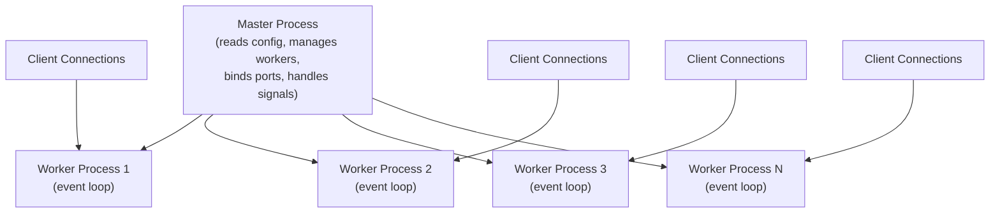
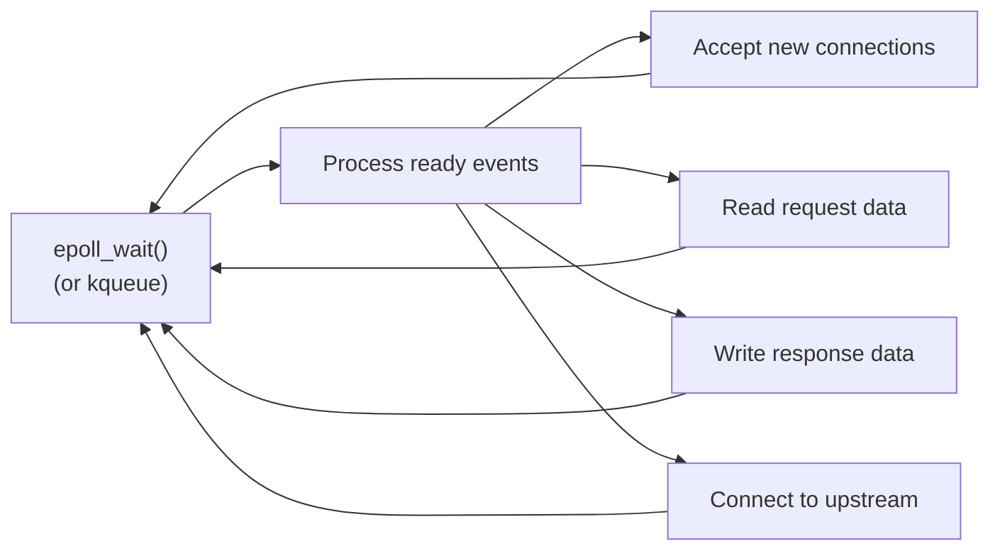

# Nginx Deep Dive

Nginx (pronounced "engine-x") powers roughly a third of the internet's web servers. It was designed from the ground up to solve the C10K problem — handling 10,000 concurrent connections on a single machine — at a time when Apache's process-per-connection model was hitting its limits. Its event-driven, non-blocking architecture makes it extraordinarily efficient as a web server, reverse proxy, load balancer, and HTTP cache.

Understanding Nginx is not optional for backend engineers. Whether you use it directly or indirectly (through Kubernetes ingress controllers, cloud load balancers, or CDNs that run Nginx forks), the configuration patterns and architectural concepts are foundational.

## Architecture

### Master and Worker Processes

Nginx uses a multi-process architecture with a single master process and multiple worker processes:



| Component | Responsibility |
|-----------|---------------|
| **Master** | Read/validate config, bind ports, start/stop workers, handle signals (`SIGHUP` for reload, `SIGTERM` for shutdown) |
| **Worker** | Handle connections, process requests, communicate with upstream servers. Each worker runs an event loop |
| **Cache Manager** | Manages on-disk cache: checks sizes, removes expired entries |
| **Cache Loader** | Loads cached metadata into shared memory on startup |

### The Event Loop

Each worker process runs a single-threaded event loop using OS-level I/O multiplexing:



On Linux, Nginx uses `epoll`; on FreeBSD/macOS, it uses `kqueue`. Both are $O(1)$ for checking which file descriptors are ready (unlike `select`/`poll` which are $O(n)$).

**Why this is fast:** A single worker can handle thousands of concurrent connections because it never blocks. While waiting for data from one client, it processes data from another. No thread context switching, no lock contention, minimal memory overhead per connection (~2.5 KB).

```nginx
# Core configuration for the event model
worker_processes auto;    # One worker per CPU core
worker_rlimit_nofile 65535;

events {
    worker_connections 16384;   # Max connections per worker
    use epoll;                  # Linux: use epoll
    multi_accept on;            # Accept multiple connections at once
}
```

The maximum number of simultaneous connections:

$$
\text{max\_connections} = \text{worker\_processes} \times \text{worker\_connections}
$$

With 4 workers and 16,384 connections each, a single Nginx instance can handle 65,536 concurrent connections. In practice, reverse proxy configurations use two connections per client (one inbound, one to upstream), so effective capacity is halved.

## Configuration Fundamentals

### Configuration Structure

```nginx
# Main context (global settings)
user nginx;
worker_processes auto;
error_log /var/log/nginx/error.log warn;
pid /var/run/nginx.pid;

# Events context
events {
    worker_connections 4096;
}

# HTTP context
http {
    include /etc/nginx/mime.types;
    default_type application/octet-stream;

    # Logging
    log_format main '$remote_addr - $remote_user [$time_local] '
                    '"$request" $status $body_bytes_sent '
                    '"$http_referer" "$http_user_agent" '
                    'rt=$request_time uct=$upstream_connect_time '
                    'urt=$upstream_response_time';

    access_log /var/log/nginx/access.log main;

    # Performance
    sendfile on;
    tcp_nopush on;
    tcp_nodelay on;
    keepalive_timeout 65;

    # Includes
    include /etc/nginx/conf.d/*.conf;
}
```

### Server Blocks (Virtual Hosts)

Server blocks let a single Nginx instance handle multiple domains:

```nginx
# Default server — catches requests that don't match any other server_name
server {
    listen 80 default_server;
    server_name _;
    return 444;  # Close connection without response
}

# API server
server {
    listen 443 ssl http2;
    server_name api.example.com;

    ssl_certificate     /etc/ssl/certs/api.example.com.pem;
    ssl_certificate_key /etc/ssl/private/api.example.com.key;

    location / {
        proxy_pass http://api_backend;
    }
}

# Static site
server {
    listen 443 ssl http2;
    server_name www.example.com;

    ssl_certificate     /etc/ssl/certs/www.example.com.pem;
    ssl_certificate_key /etc/ssl/private/www.example.com.key;

    root /var/www/example.com;
    index index.html;

    location / {
        try_files $uri $uri/ /index.html;
    }
}
```

### Location Block Matching

Location blocks are matched in a specific priority order:

```nginx
# 1. Exact match (highest priority)
location = /health {
    return 200 "OK\n";
}

# 2. Preferential prefix (stops searching if matched)
location ^~ /static/ {
    root /var/www;
    expires 30d;
}

# 3. Regular expression (first match wins)
location ~* \.(jpg|jpeg|png|gif|webp)$ {
    root /var/www/images;
    expires 7d;
}

# 4. Prefix match (longest match wins)
location /api/v2/ {
    proxy_pass http://api_v2_backend;
}

location /api/ {
    proxy_pass http://api_v1_backend;
}

# 5. Default (lowest priority)
location / {
    proxy_pass http://app_backend;
}
```

**Matching priority:**

| Priority | Modifier | Type | Behavior |
|----------|----------|------|----------|
| 1 | `= /path` | Exact | Match exact URI, stop |
| 2 | `^~ /path` | Preferential prefix | Match prefix, stop (no regex check) |
| 3 | `~ pattern` | Case-sensitive regex | First regex match wins |
| 3 | `~* pattern` | Case-insensitive regex | First regex match wins |
| 4 | `/path` | Prefix | Longest prefix match |

## Reverse Proxy and Load Balancing

### Upstream Configuration

```nginx
upstream api_backend {
    # Load balancing method (default: round-robin)
    least_conn;  # Or: ip_hash, random, hash $request_uri

    # Backend servers
    server 10.0.1.10:8080 weight=5;       # 5x more traffic
    server 10.0.1.11:8080 weight=3;
    server 10.0.1.12:8080;                 # weight=1 (default)
    server 10.0.1.13:8080 backup;          # Only used when others are down

    # Health checks (passive)
    server 10.0.1.10:8080 max_fails=3 fail_timeout=30s;

    # Connection pooling to upstreams
    keepalive 32;               # Keep 32 idle connections per worker
    keepalive_requests 1000;    # Max requests per keepalive connection
    keepalive_timeout 60s;
}
```

**Load balancing methods:**

| Method | Algorithm | Use Case |
|--------|-----------|----------|
| `round-robin` | Sequential rotation | Default, works for most cases |
| `least_conn` | Fewest active connections | When request processing times vary |
| `ip_hash` | Hash of client IP | Session affinity without cookies |
| `hash $key` | Hash of arbitrary key | Consistent routing (cache optimization) |
| `random two` | Random pick, then least-connected of two | Avoids thundering herd |

See [Load Balancing Algorithms](/system-design/load-balancing/algorithms) for detailed analysis.

### Proxy Configuration

```nginx
location /api/ {
    # Pass to upstream
    proxy_pass http://api_backend;

    # Headers
    proxy_set_header Host $host;
    proxy_set_header X-Real-IP $remote_addr;
    proxy_set_header X-Forwarded-For $proxy_add_x_forwarded_for;
    proxy_set_header X-Forwarded-Proto $scheme;
    proxy_set_header X-Request-ID $request_id;

    # Timeouts
    proxy_connect_timeout 5s;
    proxy_send_timeout 30s;
    proxy_read_timeout 30s;

    # Buffering
    proxy_buffering on;
    proxy_buffer_size 4k;
    proxy_buffers 8 4k;

    # Keepalive to upstream
    proxy_http_version 1.1;
    proxy_set_header Connection "";
}
```

::: tip Proxy Buffering
When `proxy_buffering` is on, Nginx reads the entire response from the upstream server into memory/disk buffers before sending it to the client. This frees the upstream connection quickly, even if the client is slow. Turn it off for streaming/SSE endpoints.
:::

## Rate Limiting

Nginx implements the leaky bucket algorithm via the `limit_req` module:

```nginx
http {
    # Define rate limit zones
    # $binary_remote_addr uses 4 bytes (IPv4) instead of ~15 bytes for string IP
    limit_req_zone $binary_remote_addr zone=ip_limit:10m rate=10r/s;
    limit_req_zone $http_x_api_key zone=api_limit:10m rate=100r/s;

    server {
        # General API rate limit by IP
        location /api/ {
            limit_req zone=ip_limit burst=20 nodelay;
            limit_req_status 429;

            # Custom error response
            error_page 429 = @rate_limited;
            proxy_pass http://api_backend;
        }

        # Strict rate limit on auth endpoints
        location /api/auth/ {
            limit_req zone=ip_limit burst=5;  # No nodelay = requests are delayed
            limit_req_status 429;
            proxy_pass http://api_backend;
        }

        location @rate_limited {
            default_type application/json;
            return 429 '{"error": "rate_limit_exceeded", "retry_after": 1}';
        }
    }
}
```

The `burst` parameter defines the queue size. With `nodelay`, excess requests within the burst are processed immediately (not queued). Without `nodelay`, they are delayed to enforce the rate. See [Rate Limiting](/system-design/distributed-systems/rate-limiting) for algorithm details.

## Caching

Nginx can cache upstream responses, dramatically reducing load on your application servers:

```nginx
http {
    # Define cache zone
    proxy_cache_path /var/cache/nginx
        levels=1:2                 # Directory hierarchy
        keys_zone=app_cache:10m    # 10MB for keys (stores ~80K keys)
        max_size=10g               # Max disk usage
        inactive=60m               # Remove if not accessed in 60min
        use_temp_path=off;

    server {
        location /api/products/ {
            proxy_cache app_cache;
            proxy_cache_key "$scheme$request_method$host$request_uri";
            proxy_cache_valid 200 10m;     # Cache 200 responses for 10min
            proxy_cache_valid 404 1m;      # Cache 404 for 1min
            proxy_cache_use_stale error timeout updating
                                  http_500 http_502 http_503;

            # Add cache status header
            add_header X-Cache-Status $upstream_cache_status;

            proxy_pass http://api_backend;
        }

        # Bypass cache for authenticated requests
        location /api/user/ {
            proxy_cache app_cache;
            proxy_cache_bypass $http_authorization;
            proxy_no_cache $http_authorization;
            proxy_pass http://api_backend;
        }
    }
}
```

`$upstream_cache_status` values: `MISS`, `HIT`, `EXPIRED`, `STALE`, `UPDATING`, `REVALIDATED`, `BYPASS`.

::: warning Stale-While-Revalidate
`proxy_cache_use_stale updating` serves stale content while Nginx fetches a fresh copy in the background. This eliminates the latency spike when cached content expires — at the cost of briefly serving stale data. This is usually the right trade-off for API responses.
:::

## TLS Termination

```nginx
server {
    listen 443 ssl http2;
    server_name example.com;

    # Certificates
    ssl_certificate     /etc/ssl/certs/fullchain.pem;
    ssl_certificate_key /etc/ssl/private/privkey.pem;

    # Protocol versions
    ssl_protocols TLSv1.2 TLSv1.3;

    # Cipher suites (TLS 1.2)
    ssl_ciphers ECDHE-ECDSA-AES128-GCM-SHA256:ECDHE-RSA-AES128-GCM-SHA256:ECDHE-ECDSA-AES256-GCM-SHA384:ECDHE-RSA-AES256-GCM-SHA384;
    ssl_prefer_server_ciphers on;

    # Session caching (reduces TLS handshake overhead)
    ssl_session_cache shared:SSL:10m;
    ssl_session_timeout 1d;
    ssl_session_tickets off;  # Disable for forward secrecy

    # OCSP stapling
    ssl_stapling on;
    ssl_stapling_verify on;
    resolver 8.8.8.8 8.8.4.4 valid=300s;

    # HSTS
    add_header Strict-Transport-Security
        "max-age=63072000; includeSubDomains; preload" always;
}

# Redirect HTTP to HTTPS
server {
    listen 80;
    server_name example.com;
    return 301 https://$host$request_uri;
}
```

## WebSocket Proxying

```nginx
map $http_upgrade $connection_upgrade {
    default upgrade;
    ''      close;
}

upstream websocket_backend {
    server 10.0.1.10:8080;
    server 10.0.1.11:8080;
}

server {
    location /ws/ {
        proxy_pass http://websocket_backend;
        proxy_http_version 1.1;
        proxy_set_header Upgrade $http_upgrade;
        proxy_set_header Connection $connection_upgrade;
        proxy_set_header Host $host;

        # Longer timeouts for WebSocket connections
        proxy_read_timeout 3600s;
        proxy_send_timeout 3600s;
    }
}
```

## Performance Tuning

### System-Level Tuning

```bash
# /etc/sysctl.conf
net.core.somaxconn = 65535
net.core.netdev_max_backlog = 65535
net.ipv4.tcp_max_syn_backlog = 65535
net.ipv4.ip_local_port_range = 1024 65535
net.ipv4.tcp_tw_reuse = 1
net.ipv4.tcp_fin_timeout = 15
net.core.rmem_max = 16777216
net.core.wmem_max = 16777216
```

### Nginx-Level Tuning

```nginx
worker_processes auto;
worker_rlimit_nofile 65535;
worker_cpu_affinity auto;    # Pin workers to CPU cores

events {
    worker_connections 16384;
    use epoll;
    multi_accept on;
}

http {
    # File I/O
    sendfile on;        # Zero-copy file transfer
    tcp_nopush on;      # Send headers and beginning of file in one packet
    tcp_nodelay on;     # Disable Nagle's algorithm

    # Compression
    gzip on;
    gzip_comp_level 5;
    gzip_min_length 256;
    gzip_types text/plain text/css application/json
               application/javascript text/xml application/xml
               application/xml+rss text/javascript image/svg+xml;
    gzip_vary on;

    # Open file cache
    open_file_cache max=10000 inactive=20s;
    open_file_cache_valid 30s;
    open_file_cache_min_uses 2;
    open_file_cache_errors on;

    # Connection reuse
    keepalive_timeout 65;
    keepalive_requests 10000;

    # Buffers
    client_body_buffer_size 16k;
    client_header_buffer_size 1k;
    large_client_header_buffers 4 8k;
    client_max_body_size 50m;
}
```

### Key Performance Metrics

| Metric | What It Tells You | Target |
|--------|------------------|--------|
| `$request_time` | Total time from first client byte to last response byte | < 200ms for API |
| `$upstream_response_time` | Time waiting for upstream response | < 100ms |
| `$upstream_connect_time` | Time to establish upstream connection | < 10ms |
| Active connections | Current concurrent connections | < worker_connections |
| `$upstream_cache_status` | Cache hit rate | > 80% for cacheable |

::: tip Monitoring Nginx
Export Nginx metrics to Prometheus using the `stub_status` module or the commercial Nginx Plus API. Track active connections, request rate, error rate, and upstream response times. See [Observability](/infrastructure/observability/) for the full monitoring stack.
:::

## Common Patterns

### Health Check Endpoint

```nginx
server {
    location = /health {
        access_log off;
        return 200 "healthy\n";
        add_header Content-Type text/plain;
    }

    location = /ready {
        access_log off;
        proxy_pass http://api_backend/ready;
        proxy_connect_timeout 1s;
        proxy_read_timeout 1s;
    }
}
```

### Security Headers

```nginx
# Security headers (add to server or http block)
add_header X-Frame-Options "SAMEORIGIN" always;
add_header X-Content-Type-Options "nosniff" always;
add_header X-XSS-Protection "1; mode=block" always;
add_header Referrer-Policy "strict-origin-when-cross-origin" always;
add_header Content-Security-Policy "default-src 'self'" always;
add_header Permissions-Policy "camera=(), microphone=(), geolocation=()" always;

# Hide Nginx version
server_tokens off;
```

## Further Reading

- [L4 vs L7 Load Balancing](/system-design/load-balancing/l4-vs-l7) — Where Nginx sits in the load balancing stack
- [Rate Limiting](/system-design/distributed-systems/rate-limiting) — Nginx's leaky bucket rate limiting algorithm
- [TLS Handshake](/system-design/networking/tls-handshake) — How TLS termination works under the hood
- [HTTP/2 & HTTP/3](/system-design/networking/http2-http3) — Protocol features Nginx supports
- [Service Mesh](/infrastructure/service-mesh/) — How Nginx compares to Envoy as a sidecar proxy
- [Observability](/infrastructure/observability/) — Monitoring Nginx in production
- Nginx official documentation: nginx.org/en/docs/
- "Inside NGINX: How We Designed for Performance & Scale" — Nginx blog
- Brendan Gregg's systems performance methodology for tuning
