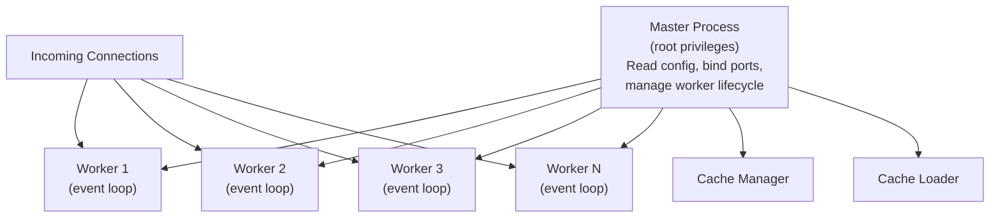
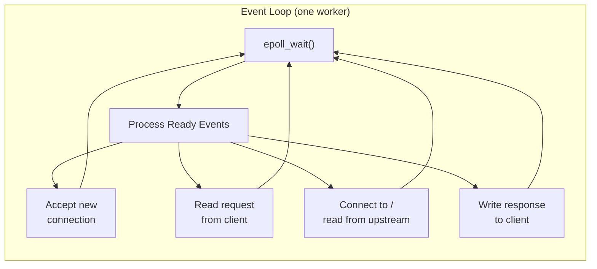
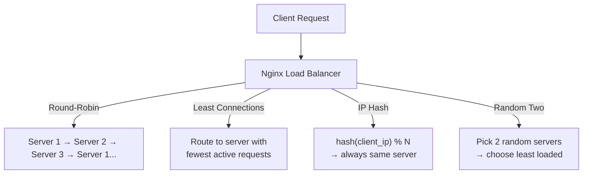
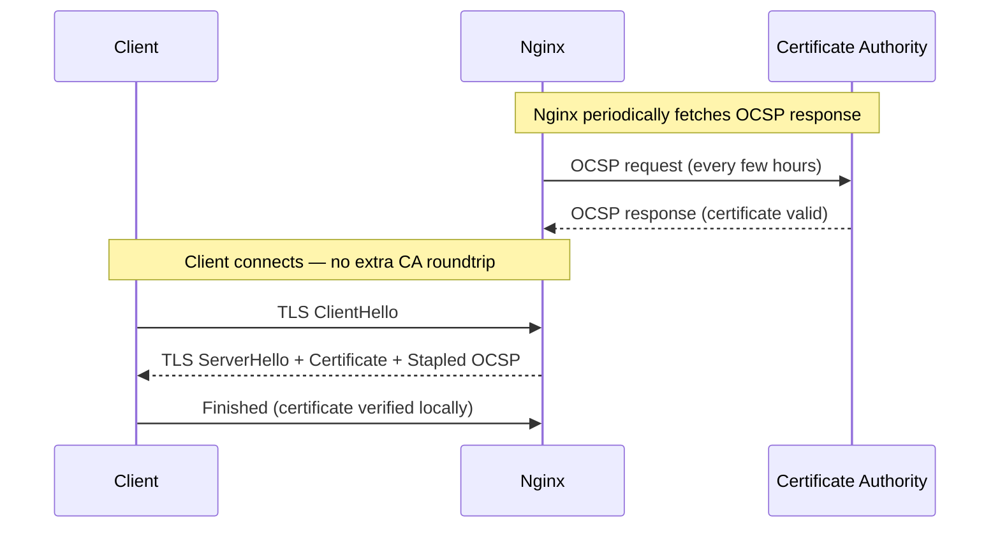
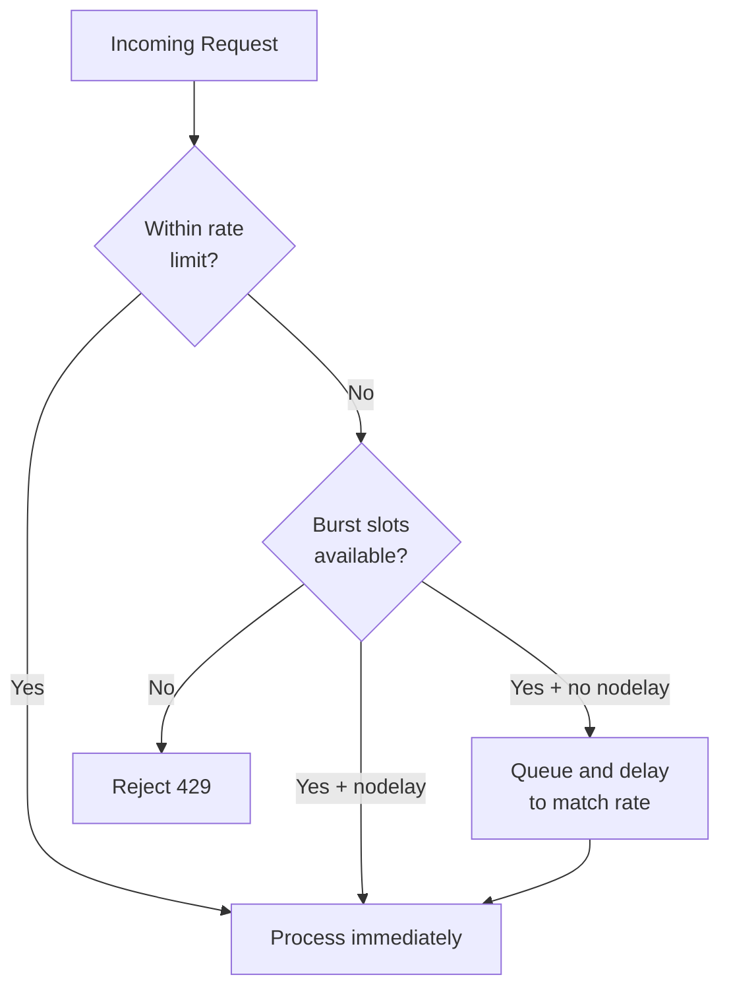

# Nginx Deep Dive

## Why Nginx Matters

Nginx sits at the front door of roughly one-third of the internet's websites. It was built from scratch by Igor Sysoev in 2002 to solve the C10K problem — handling 10,000 concurrent connections on commodity hardware — at a time when Apache's thread-per-connection model was choking under load. Its event-driven architecture, tiny memory footprint, and flexible configuration language made it the dominant choice for reverse proxying, load balancing, TLS termination, and HTTP caching.

Even if you never configure Nginx directly, understanding it is essential. Kubernetes ingress controllers (ingress-nginx), cloud load balancers, and CDNs like Cloudflare are either running Nginx or heavily inspired by its architecture. The configuration patterns — upstream blocks, location matching, header propagation, rate limiting — appear in every web infrastructure stack.

## Architecture

### Master + Worker Model

Nginx uses a process-based architecture. One **master process** manages multiple **worker processes**, each running a single-threaded event loop:



| Process | Role | Privilege |
|---------|------|-----------|
| **Master** | Reads and validates config, binds to ports 80/443, starts/stops workers, handles signals (SIGHUP, SIGTERM, SIGUSR1) | Root (needs to bind to privileged ports) |
| **Worker** | Accepts and processes connections, proxies to upstream, serves files, runs the event loop | Drops to unprivileged user (`nginx`) |
| **Cache Manager** | Periodically checks disk cache size, removes expired/excess entries | Unprivileged |
| **Cache Loader** | On startup, loads cached item metadata into shared memory for fast lookup | Unprivileged |

The number of workers is configured with `worker_processes`. Setting it to `auto` creates one worker per CPU core, which is the recommended setting for production.

### The Event Loop

Each worker runs a non-blocking event loop using OS-level I/O multiplexing — `epoll` on Linux, `kqueue` on FreeBSD/macOS. This is fundamentally different from Apache's thread-per-connection model:



**Why this is fast:** A single worker can handle thousands of concurrent connections because it never blocks waiting for I/O. While one connection is waiting for data from an upstream server, the worker processes data from other connections. No threads means no context switching overhead and no lock contention.

The maximum number of simultaneous connections:

$$
\text{max\_connections} = \text{worker\_processes} \times \text{worker\_connections}
$$

With 4 workers and 16,384 connections each, you get 65,536 concurrent connections. For reverse proxy setups, each client uses two connections (one inbound, one to upstream), so effective capacity is halved.

```nginx
worker_processes auto;           # One per CPU core
worker_rlimit_nofile 65535;      # File descriptor limit per worker

events {
    worker_connections 16384;    # Max connections per worker
    use epoll;                   # Linux kernel I/O multiplexing
    multi_accept on;             # Accept all pending connections at once
}
```

## Configuration Structure

Nginx configuration is a hierarchy of nested contexts, each with different directives available:

```
main context (nginx.conf)
  |-- events { }
  |-- http { }
        |-- upstream { }
        |-- server { }
              |-- location { }
                    |-- if { }
        |-- map { }
```

```nginx
# ── Main Context ─────────────────────────────────
user nginx;
worker_processes auto;
error_log /var/log/nginx/error.log warn;
pid /var/run/nginx.pid;

# ── Events Context ───────────────────────────────
events {
    worker_connections 4096;
}

# ── HTTP Context ─────────────────────────────────
http {
    include /etc/nginx/mime.types;
    default_type application/octet-stream;

    # Logging format
    log_format main '$remote_addr - $remote_user [$time_local] '
                    '"$request" $status $body_bytes_sent '
                    '"$http_referer" "$http_user_agent" '
                    'rt=$request_time';

    access_log /var/log/nginx/access.log main;

    # Performance basics
    sendfile on;
    tcp_nopush on;
    tcp_nodelay on;
    keepalive_timeout 65;

    # ── Server Context ───────────────────────────
    server {
        listen 80;
        server_name example.com;

        # ── Location Context ─────────────────────
        location / {
            proxy_pass http://backend;
        }

        location /static/ {
            root /var/www;
            expires 30d;
        }
    }

    # Include additional server configs
    include /etc/nginx/conf.d/*.conf;
}
```

::: tip Configuration Inheritance
Directives set in an outer context are inherited by inner contexts unless explicitly overridden. For example, `gzip on` in the `http` block applies to all `server` and `location` blocks. Setting `gzip off` in a specific `location` block overrides it for that location only.
:::

## Reverse Proxy

### Basic proxy_pass

The fundamental use case: forward client requests to an application server running on a different port or host.

```nginx
server {
    listen 80;
    server_name api.example.com;

    location / {
        proxy_pass http://127.0.0.1:3000;

        # Forward real client information to the upstream
        proxy_set_header Host $host;
        proxy_set_header X-Real-IP $remote_addr;
        proxy_set_header X-Forwarded-For $proxy_add_x_forwarded_for;
        proxy_set_header X-Forwarded-Proto $scheme;
        proxy_set_header X-Request-ID $request_id;

        # Timeouts
        proxy_connect_timeout 5s;    # Time to establish upstream connection
        proxy_send_timeout 30s;      # Time to send request body to upstream
        proxy_read_timeout 30s;      # Time to read response from upstream

        # Buffering — read full upstream response before sending to client
        proxy_buffering on;
        proxy_buffer_size 4k;        # Buffer for response headers
        proxy_buffers 8 4k;          # Buffers for response body

        # Required for keepalive to upstream
        proxy_http_version 1.1;
        proxy_set_header Connection "";
    }
}
```

::: warning The Trailing Slash Matters
`proxy_pass http://backend;` and `proxy_pass http://backend/;` behave differently. Without a trailing slash, Nginx passes the full original URI. With a trailing slash, Nginx strips the matching location prefix. For `location /api/` with `proxy_pass http://backend/`, a request to `/api/users` is forwarded as `/users`. This is a common source of 404 errors.
:::

### WebSocket Proxying

WebSocket connections require an HTTP Upgrade handshake. Nginx must explicitly forward the `Upgrade` and `Connection` headers:

```nginx
map $http_upgrade $connection_upgrade {
    default upgrade;
    ''      close;
}

upstream ws_backend {
    server 10.0.1.10:8080;
    server 10.0.1.11:8080;
}

server {
    listen 443 ssl http2;
    server_name ws.example.com;

    location /ws/ {
        proxy_pass http://ws_backend;
        proxy_http_version 1.1;
        proxy_set_header Upgrade $http_upgrade;
        proxy_set_header Connection $connection_upgrade;
        proxy_set_header Host $host;
        proxy_set_header X-Real-IP $remote_addr;

        # WebSocket connections are long-lived
        proxy_read_timeout 3600s;
        proxy_send_timeout 3600s;

        # Disable buffering for real-time data
        proxy_buffering off;
    }
}
```

### gRPC Proxying

Nginx supports native gRPC proxying since version 1.13.10:

```nginx
upstream grpc_backend {
    server 10.0.1.10:50051;
    server 10.0.1.11:50051;
}

server {
    listen 443 ssl http2;
    server_name grpc.example.com;

    location / {
        grpc_pass grpc://grpc_backend;

        # For TLS-to-gRPC upstream:
        # grpc_pass grpcs://grpc_backend;

        # Timeouts for streaming RPCs
        grpc_read_timeout 300s;
        grpc_send_timeout 300s;

        # Error handling
        error_page 502 = /error502grpc;
    }

    location = /error502grpc {
        internal;
        default_type application/grpc;
        add_header grpc-status 14;
        add_header grpc-message "upstream unavailable";
        return 204;
    }
}
```

## Load Balancing

### Upstream Configuration

```nginx
upstream api_backend {
    # ── Algorithm ────────────────────────────────
    least_conn;    # Route to server with fewest active connections

    # ── Servers ──────────────────────────────────
    server 10.0.1.10:8080 weight=5;          # Gets 5x more traffic
    server 10.0.1.11:8080 weight=3;          # Gets 3x more traffic
    server 10.0.1.12:8080;                    # Default weight=1
    server 10.0.1.13:8080 backup;             # Only used when all others are down
    server 10.0.1.14:8080 down;               # Temporarily removed from rotation

    # ── Passive Health Checks ────────────────────
    # max_fails consecutive failures → server marked down for fail_timeout
    server 10.0.1.10:8080 max_fails=3 fail_timeout=30s;

    # ── Keepalive to Upstream ────────────────────
    keepalive 32;               # Idle connections per worker to cache
    keepalive_requests 1000;    # Max requests per keepalive connection
    keepalive_timeout 60s;      # Close idle connections after this
}
```

### Load Balancing Algorithms

| Algorithm | Directive | Behavior | Best For |
|-----------|-----------|----------|----------|
| Round-Robin | _(default)_ | Sequential rotation across servers | Homogeneous backends, equal request cost |
| Weighted Round-Robin | `weight=N` | Proportional distribution based on weight | Heterogeneous hardware |
| Least Connections | `least_conn` | Route to server with fewest active connections | Varying request processing times |
| IP Hash | `ip_hash` | Hash of client IP determines server | Session affinity without cookies |
| Generic Hash | `hash $key` | Hash of arbitrary variable | Cache optimization (consistent routing) |
| Random | `random two least_conn` | Pick two random servers, choose the one with fewer connections | Large upstream pools (avoids thundering herd) |



### Active Health Checks (Nginx Plus)

Open-source Nginx only supports **passive** health checks (marking servers down after observed failures). **Active** health checks (periodically probing servers) require Nginx Plus or a third-party module:

```nginx
# Nginx Plus only
upstream api_backend {
    zone backend_zone 64k;    # Shared memory for health state

    server 10.0.1.10:8080;
    server 10.0.1.11:8080;
}

server {
    location / {
        proxy_pass http://api_backend;
        health_check interval=5s fails=3 passes=2
                     uri=/health
                     match=healthy_response;
    }
}

match healthy_response {
    status 200;
    header Content-Type ~ application/json;
    body ~ "\"status\":\"ok\"";
}
```

For open-source Nginx, combine passive health checks with an external monitoring tool (Prometheus + Blackbox Exporter) that removes unhealthy servers from the upstream pool via config reload.

## SSL/TLS Termination

### Full TLS Configuration

```nginx
server {
    listen 443 ssl http2;
    server_name example.com;

    # ── Certificates ─────────────────────────────
    ssl_certificate     /etc/letsencrypt/live/example.com/fullchain.pem;
    ssl_certificate_key /etc/letsencrypt/live/example.com/privkey.pem;

    # ── Protocol Versions ────────────────────────
    ssl_protocols TLSv1.2 TLSv1.3;

    # ── Cipher Suites (TLS 1.2) ─────────────────
    ssl_ciphers ECDHE-ECDSA-AES128-GCM-SHA256:ECDHE-RSA-AES128-GCM-SHA256:ECDHE-ECDSA-AES256-GCM-SHA384:ECDHE-RSA-AES256-GCM-SHA384;
    ssl_prefer_server_ciphers on;
    # TLS 1.3 ciphers are not configurable — they are always secure

    # ── Session Caching ──────────────────────────
    ssl_session_cache shared:SSL:10m;    # 10MB ~ 40,000 sessions
    ssl_session_timeout 1d;
    ssl_session_tickets off;              # Disable for perfect forward secrecy

    # ── OCSP Stapling ────────────────────────────
    ssl_stapling on;
    ssl_stapling_verify on;
    ssl_trusted_certificate /etc/letsencrypt/live/example.com/chain.pem;
    resolver 8.8.8.8 8.8.4.4 valid=300s;
    resolver_timeout 5s;

    # ── DH Parameters ────────────────────────────
    ssl_dhparam /etc/nginx/dhparam.pem;   # openssl dhparam -out dhparam.pem 2048

    # ── HSTS ─────────────────────────────────────
    add_header Strict-Transport-Security
        "max-age=63072000; includeSubDomains; preload" always;
}

# ── HTTP → HTTPS Redirect ────────────────────────
server {
    listen 80;
    server_name example.com;
    return 301 https://$host$request_uri;
}
```

### Let's Encrypt with Certbot

```nginx
# Initial setup — serve ACME challenge, then redirect
server {
    listen 80;
    server_name example.com;

    location /.well-known/acme-challenge/ {
        root /var/www/certbot;
    }

    location / {
        return 301 https://$host$request_uri;
    }
}
```

```bash
# Obtain certificate
certbot certonly --webroot -w /var/www/certbot \
    -d example.com -d www.example.com

# Auto-renewal (add to crontab or systemd timer)
# 0 3 * * * certbot renew --quiet --post-hook "nginx -s reload"
```

### OCSP Stapling

Without OCSP stapling, the client's browser contacts the Certificate Authority to verify the certificate has not been revoked — adding 100-300ms of latency. With stapling, Nginx periodically fetches the OCSP response from the CA and includes it in the TLS handshake, eliminating this round-trip.



## Rate Limiting

Nginx implements rate limiting using the **leaky bucket** algorithm via the `limit_req` module.

### Configuration

```nginx
http {
    # ── Define Rate Limit Zones ──────────────────
    # Zone: 10MB shared memory (~160,000 IP addresses)
    # Rate: 10 requests/second per IP
    limit_req_zone $binary_remote_addr zone=ip_limit:10m rate=10r/s;

    # Rate limit by API key
    limit_req_zone $http_x_api_key zone=api_limit:10m rate=100r/s;

    # Rate limit by server name (global per-domain limit)
    limit_req_zone $server_name zone=domain_limit:1m rate=1000r/s;

    server {
        # ── General API Rate Limit ───────────────
        location /api/ {
            limit_req zone=ip_limit burst=20 nodelay;
            limit_req_status 429;

            proxy_pass http://api_backend;
        }

        # ── Strict Auth Rate Limit ───────────────
        location /api/auth/login {
            limit_req zone=ip_limit burst=5;    # No nodelay — excess requests are delayed
            limit_req_status 429;

            proxy_pass http://api_backend;
        }

        # ── Custom 429 Response ──────────────────
        error_page 429 = @rate_limited;
        location @rate_limited {
            default_type application/json;
            return 429 '{"error": "rate_limit_exceeded", "retry_after": 1}';
        }
    }
}
```

### burst and nodelay Explained

| Configuration | Behavior |
|--------------|----------|
| `rate=10r/s` alone | Exactly 1 request every 100ms. Anything faster is rejected (503). |
| `rate=10r/s burst=20` | Up to 20 excess requests are queued and released at the rate. Adds latency. |
| `rate=10r/s burst=20 nodelay` | Up to 20 excess requests are processed immediately. The 21st is rejected (429). The burst bucket refills at 10/s. |



::: tip Two-Stage Rate Limiting
Combine `delay` (Nginx 1.15.7+) with `burst` for a two-tier approach: the first N requests are processed immediately, the rest are delayed:
```nginx
limit_req zone=ip_limit burst=20 delay=10;
# First 10 excess requests: immediate (no delay)
# Next 10 excess requests: delayed to match rate
# Beyond 20: rejected with 429
```
:::

## Caching

### Proxy Cache Configuration

```nginx
http {
    # ── Define Cache Zone ────────────────────────
    proxy_cache_path /var/cache/nginx
        levels=1:2                  # Two-level directory hierarchy
        keys_zone=app_cache:10m     # 10MB for cache keys (~80K entries)
        max_size=10g                # Max total disk usage
        inactive=60m                # Remove entries not accessed in 60 minutes
        use_temp_path=off;          # Write directly to cache dir (avoids rename)

    server {
        # ── Cache Product API ────────────────────
        location /api/products/ {
            proxy_cache app_cache;
            proxy_cache_key "$scheme$request_method$host$request_uri";
            proxy_cache_valid 200 10m;       # 200 responses cached for 10 min
            proxy_cache_valid 301 302 1m;    # Redirects cached for 1 min
            proxy_cache_valid 404 30s;       # 404 cached for 30 seconds
            proxy_cache_valid any 5s;        # Everything else for 5 seconds

            # Serve stale content while revalidating
            proxy_cache_use_stale error timeout updating
                                  http_500 http_502 http_503 http_504;

            # Only one request at a time populates the cache
            proxy_cache_lock on;
            proxy_cache_lock_timeout 5s;

            # Expose cache status in response headers
            add_header X-Cache-Status $upstream_cache_status always;

            proxy_pass http://api_backend;
        }

        # ── Bypass Cache for Authenticated Requests
        location /api/user/ {
            proxy_cache app_cache;
            proxy_cache_bypass $http_authorization;
            proxy_no_cache $http_authorization;

            proxy_pass http://api_backend;
        }
    }
}
```

### Cache Status Values

| `$upstream_cache_status` | Meaning |
|--------------------------|---------|
| `MISS` | Response not in cache, fetched from upstream |
| `HIT` | Served from cache |
| `EXPIRED` | Cache entry expired, new response fetched |
| `STALE` | Stale entry served (upstream unavailable) |
| `UPDATING` | Stale entry served while cache is being refreshed |
| `REVALIDATED` | Entry revalidated with `If-Modified-Since` |
| `BYPASS` | Cache was explicitly bypassed (`proxy_cache_bypass`) |

### Cache Purging

Open-source Nginx does not support cache purging natively. Options:

```bash
# Option 1: Delete cache files manually
# Cache key hash determines file location
# Find the file and delete it

# Option 2: Use the ngx_cache_purge module (third-party)
# location ~ /purge(/.*) {
#     allow 127.0.0.1;
#     deny all;
#     proxy_cache_purge app_cache "$scheme$request_method$host$1";
# }

# Option 3: Clear entire cache
rm -rf /var/cache/nginx/*
nginx -s reload
```

## Security Headers

```nginx
server {
    # ── Clickjacking Protection ──────────────────
    add_header X-Frame-Options "SAMEORIGIN" always;

    # ── MIME Sniffing Prevention ─────────────────
    add_header X-Content-Type-Options "nosniff" always;

    # ── XSS Filter (legacy browsers) ────────────
    add_header X-XSS-Protection "1; mode=block" always;

    # ── Referrer Policy ──────────────────────────
    add_header Referrer-Policy "strict-origin-when-cross-origin" always;

    # ── Content Security Policy ──────────────────
    add_header Content-Security-Policy
        "default-src 'self'; script-src 'self' 'unsafe-inline'; style-src 'self' 'unsafe-inline'; img-src 'self' data: https:; font-src 'self'; connect-src 'self'; frame-ancestors 'self'"
        always;

    # ── Permissions Policy ───────────────────────
    add_header Permissions-Policy
        "camera=(), microphone=(), geolocation=(), payment=()" always;

    # ── HSTS ─────────────────────────────────────
    add_header Strict-Transport-Security
        "max-age=63072000; includeSubDomains; preload" always;

    # ── Hide Server Version ──────────────────────
    server_tokens off;

    # ── Prevent Indexing of Sensitive Paths ──────
    location ~ /\.(git|env|htaccess) {
        deny all;
        return 404;
    }
}
```

| Header | Protects Against | Value |
|--------|-----------------|-------|
| `X-Frame-Options` | Clickjacking | `DENY` or `SAMEORIGIN` |
| `X-Content-Type-Options` | MIME sniffing attacks | `nosniff` |
| `Strict-Transport-Security` | SSL stripping, downgrade attacks | `max-age=63072000; includeSubDomains` |
| `Content-Security-Policy` | XSS, data injection | Varies per application |
| `Referrer-Policy` | Referrer information leakage | `strict-origin-when-cross-origin` |
| `Permissions-Policy` | Unauthorized browser feature access | Disable camera, mic, geolocation |

## Gzip and Brotli Compression

### Gzip (Built-in)

```nginx
http {
    gzip on;
    gzip_comp_level 5;          # 1-9 — sweet spot is 4-6
    gzip_min_length 256;        # Don't compress tiny responses
    gzip_vary on;               # Add Vary: Accept-Encoding header
    gzip_proxied any;           # Compress proxied responses too

    gzip_types
        text/plain
        text/css
        text/javascript
        application/json
        application/javascript
        application/xml
        application/xml+rss
        image/svg+xml
        font/woff2;

    # Don't compress already-compressed formats
    gzip_disable "msie6";       # IE6 has buggy gzip support
}
```

### Brotli (Module Required)

Brotli offers 15-25% better compression than gzip but requires building Nginx with the `ngx_brotli` module:

```nginx
http {
    brotli on;
    brotli_comp_level 6;         # 0-11, higher = smaller but slower
    brotli_min_length 256;
    brotli_types
        text/plain
        text/css
        text/javascript
        application/json
        application/javascript
        application/xml
        image/svg+xml
        font/woff2;

    # Static pre-compressed files (build step generates .br files)
    brotli_static on;            # Serve pre-compressed .br files if available
}
```

::: tip Pre-compression for Static Assets
For static files, pre-compress at build time rather than on every request:
```bash
# Pre-compress during build
find /var/www/static -type f \( -name "*.js" -o -name "*.css" -o -name "*.html" -o -name "*.svg" \) \
    -exec brotli --best {} \;
```
Then enable `gzip_static on;` and `brotli_static on;` — Nginx serves the `.gz` or `.br` file directly.
:::

## Logging

### Access Log Formats

```nginx
http {
    # ── Standard Format ──────────────────────────
    log_format main '$remote_addr - $remote_user [$time_local] '
                    '"$request" $status $body_bytes_sent '
                    '"$http_referer" "$http_user_agent"';

    # ── Extended Format (with timing) ────────────
    log_format extended '$remote_addr - $remote_user [$time_local] '
                        '"$request" $status $body_bytes_sent '
                        '"$http_referer" "$http_user_agent" '
                        'rt=$request_time uct=$upstream_connect_time '
                        'urt=$upstream_response_time ucs=$upstream_cache_status';

    # ── JSON Format (for log aggregation) ────────
    log_format json escape=json
        '{'
            '"time":"$time_iso8601",'
            '"remote_addr":"$remote_addr",'
            '"request_method":"$request_method",'
            '"request_uri":"$request_uri",'
            '"status":$status,'
            '"body_bytes_sent":$body_bytes_sent,'
            '"request_time":$request_time,'
            '"upstream_response_time":"$upstream_response_time",'
            '"upstream_cache_status":"$upstream_cache_status",'
            '"http_user_agent":"$http_user_agent",'
            '"http_referer":"$http_referer",'
            '"request_id":"$request_id"'
        '}';

    # Apply format
    access_log /var/log/nginx/access.log json;

    # Conditional logging — skip health checks
    map $request_uri $loggable {
        /health 0;
        /ready  0;
        default 1;
    }
    access_log /var/log/nginx/access.log json if=$loggable;
}
```

### Error Log Levels

```nginx
# Levels: debug, info, notice, warn, error, crit, alert, emerg
error_log /var/log/nginx/error.log warn;

# Per-server error log
server {
    error_log /var/log/nginx/api_error.log error;
}

# Debug logging for specific client IPs
events {
    debug_connection 10.0.1.100;
    debug_connection 192.168.1.0/24;
}
```

## Location Matching Rules

Understanding location matching priority is essential for correct routing. Nginx evaluates locations in this exact order:

```nginx
# Priority 1: Exact match — highest priority, stops immediately
location = /health {
    return 200 "OK\n";
}

# Priority 2: Preferential prefix — stops if matched (no regex check)
location ^~ /static/ {
    root /var/www;
    expires 30d;
}

# Priority 3: Regular expression — first match in config order wins
location ~* \.(jpg|jpeg|png|gif|webp|avif)$ {
    root /var/www/images;
    expires 7d;
}

location ~ /api/v[0-9]+/ {
    proxy_pass http://api_backend;
}

# Priority 4: Prefix match — longest match wins
location /api/v2/ {
    proxy_pass http://api_v2_backend;
}

location /api/ {
    proxy_pass http://api_v1_backend;
}

# Priority 5: Default — lowest priority
location / {
    proxy_pass http://app_backend;
}
```

| Priority | Modifier | Type | Rule |
|----------|----------|------|------|
| 1 | `= /path` | Exact | Match exact URI, stop immediately |
| 2 | `^~ /prefix` | Preferential prefix | Match prefix, stop (skip all regex) |
| 3 | `~ pattern` | Case-sensitive regex | First match in config order wins |
| 3 | `~* pattern` | Case-insensitive regex | First match in config order wins |
| 4 | `/prefix` | Prefix | Longest prefix match wins |

::: warning Regex Order Matters
For prefix matches, the **longest** match wins regardless of order in the config. For regex matches, the **first** match in the config file wins. If you have two regex locations, the one that appears first in the file takes priority — even if a later regex is a "better" match.
:::

## Common Patterns

### SPA Routing (React, Vue, Angular)

```nginx
server {
    listen 80;
    server_name app.example.com;
    root /var/www/spa;

    # Serve static files directly
    location /assets/ {
        expires 1y;
        add_header Cache-Control "public, immutable";
    }

    # API requests proxied to backend
    location /api/ {
        proxy_pass http://api_backend;
        proxy_set_header Host $host;
        proxy_set_header X-Real-IP $remote_addr;
    }

    # Everything else → index.html (client-side routing)
    location / {
        try_files $uri $uri/ /index.html;

        # Don't cache index.html (it contains hashed asset references)
        add_header Cache-Control "no-cache, no-store, must-revalidate";
    }
}
```

### API Gateway

```nginx
upstream auth_service { server 10.0.1.10:3000; }
upstream user_service { server 10.0.1.11:3000; }
upstream product_service { server 10.0.1.12:3000; }
upstream order_service { server 10.0.1.13:3000; }

server {
    listen 443 ssl http2;
    server_name api.example.com;

    # Global rate limiting
    limit_req zone=api_global burst=100 nodelay;

    # Auth service
    location /api/auth/ {
        limit_req zone=auth_limit burst=5;
        proxy_pass http://auth_service/;
    }

    # User service
    location /api/users/ {
        proxy_pass http://user_service/;
    }

    # Product service (with caching)
    location /api/products/ {
        proxy_cache api_cache;
        proxy_cache_valid 200 5m;
        proxy_cache_use_stale error timeout http_500;
        add_header X-Cache-Status $upstream_cache_status;
        proxy_pass http://product_service/;
    }

    # Order service
    location /api/orders/ {
        proxy_pass http://order_service/;
    }

    # Catch-all
    location / {
        return 404 '{"error": "not_found"}';
        default_type application/json;
    }
}
```

### Static File Serving and Media Streaming

```nginx
server {
    listen 80;
    server_name cdn.example.com;
    root /var/www/media;

    # Aggressive caching for hashed filenames
    location ~* \.[a-f0-9]{8,}\.(js|css|woff2|png|jpg|svg)$ {
        expires 1y;
        add_header Cache-Control "public, immutable";
        access_log off;
    }

    # Video streaming with byte-range support
    location /video/ {
        mp4;
        mp4_buffer_size 1m;
        mp4_max_buffer_size 5m;

        # Enable range requests
        add_header Accept-Ranges bytes;

        # Limit bandwidth per connection
        limit_rate_after 5m;    # Full speed for first 5MB
        limit_rate 512k;        # Then throttle to 512KB/s
    }

    # Large file downloads
    location /downloads/ {
        # Direct I/O for large files (bypass page cache)
        directio 10m;
        aio on;
        sendfile on;
        tcp_nopush on;
    }
}
```

## Performance Tuning

### System-Level (sysctl)

```bash
# /etc/sysctl.conf — kernel network parameters
net.core.somaxconn = 65535             # Listen backlog queue size
net.core.netdev_max_backlog = 65535    # Packet queue before kernel drops
net.ipv4.tcp_max_syn_backlog = 65535   # SYN queue size
net.ipv4.ip_local_port_range = 1024 65535  # Ephemeral port range
net.ipv4.tcp_tw_reuse = 1             # Reuse TIME_WAIT sockets
net.ipv4.tcp_fin_timeout = 15         # Faster cleanup of closed connections
net.core.rmem_max = 16777216           # Max receive buffer
net.core.wmem_max = 16777216           # Max send buffer
```

### Nginx-Level

```nginx
# ── Worker Configuration ─────────────────────────
worker_processes auto;
worker_rlimit_nofile 65535;
worker_cpu_affinity auto;         # Pin workers to CPU cores

events {
    worker_connections 16384;
    use epoll;
    multi_accept on;
}

http {
    # ── File I/O Optimization ────────────────────
    sendfile on;           # Zero-copy file transfer (kernel → socket directly)
    tcp_nopush on;         # Send headers + file beginning in one packet
    tcp_nodelay on;        # Disable Nagle's algorithm (reduce latency)

    # ── Connection Management ────────────────────
    keepalive_timeout 65;
    keepalive_requests 10000;    # Max requests per keepalive connection
    reset_timedout_connection on; # Free memory from timed-out connections

    # ── Open File Cache ──────────────────────────
    open_file_cache max=10000 inactive=20s;
    open_file_cache_valid 30s;
    open_file_cache_min_uses 2;
    open_file_cache_errors on;

    # ── Client Buffers ───────────────────────────
    client_body_buffer_size 16k;
    client_header_buffer_size 1k;
    large_client_header_buffers 4 8k;
    client_max_body_size 50m;

    # ── Upstream Buffering ───────────────────────
    proxy_buffering on;
    proxy_buffer_size 4k;
    proxy_buffers 8 4k;
    proxy_busy_buffers_size 8k;
}
```

### Key Performance Metrics

| Metric | Variable | What It Tells You | Target |
|--------|----------|------------------|--------|
| Request time | `$request_time` | Total client-to-client latency | < 200ms for API |
| Upstream response time | `$upstream_response_time` | Time waiting for backend | < 100ms |
| Upstream connect time | `$upstream_connect_time` | TCP connection to backend | < 10ms |
| Cache status | `$upstream_cache_status` | Cache hit rate | > 80% for cacheable |
| Active connections | `stub_status` | Current concurrent connections | < worker_connections |
| Requests per second | Access log analysis | Throughput | Depends on workload |

```nginx
# Enable stub_status for monitoring
server {
    listen 8080;
    server_name _;

    location /nginx_status {
        stub_status;
        allow 127.0.0.1;
        allow 10.0.0.0/8;
        deny all;
    }
}
```

## Nginx vs Caddy vs Traefik

| Feature | Nginx | Caddy | Traefik |
|---------|-------|-------|---------|
| **Architecture** | C, event-driven | Go, goroutine-per-request | Go, goroutine-per-request |
| **Config format** | Custom directive language | Caddyfile or JSON API | YAML / TOML / Docker labels |
| **Auto HTTPS** | Manual (certbot) | Automatic (built-in ACME) | Automatic (built-in ACME) |
| **Config reload** | `nginx -s reload` (graceful) | API-driven, zero-downtime | Dynamic via providers |
| **Service discovery** | Static config only | Static or API | Docker, K8s, Consul native |
| **Performance** | Best (C, epoll, zero-copy) | Good | Good |
| **Memory footprint** | Smallest | Small | Moderate |
| **Learning curve** | Steep | Gentle | Moderate |
| **Ecosystem** | Massive (20+ years) | Growing | Strong for containers |
| **Best for** | High-traffic, fine-grained control | Simple setups, auto-TLS | Container orchestration |

::: tip When to Choose What
**Nginx** — when you need maximum performance, fine-grained control, or are running high-traffic infrastructure. The configuration language is powerful but has a learning curve.

**Caddy** — when you want automatic HTTPS with zero configuration, simple reverse proxying, and do not need Nginx-level performance tuning. Excellent for small-to-medium deployments.

**Traefik** — when you are in a container-first environment (Docker Compose, Kubernetes) and want service discovery via labels/annotations. Configuration is dynamic, not file-based.
:::

---

## Key Takeaway

::: info Key Takeaway
Nginx's event-driven architecture makes it extraordinarily efficient as a reverse proxy, load balancer, and TLS termination point. The most critical configurations to get right in production are: proper header forwarding (`X-Real-IP`, `X-Forwarded-For`, `X-Forwarded-Proto`) so your application sees the real client, health checks and upstream failover so your site stays up when backends fail, TLS termination with session caching and OCSP stapling for fast HTTPS, and rate limiting at the edge to protect your application from abuse. Everything else is optimization.
:::

---

## Common Misconceptions

::: warning Common Misconceptions

**1. "Nginx is a web server, not a reverse proxy."**
Nginx is both, and in modern architectures it is predominantly used as a reverse proxy, load balancer, and TLS terminator. Serving static files directly is a secondary (though still common) role. Most production Nginx instances proxy to application servers (Node.js, Python, Go, Java) rather than serving content themselves.

**2. "More worker processes means better performance."**
Workers beyond the number of CPU cores cause context-switching overhead with no benefit. Each worker can handle tens of thousands of concurrent connections via non-blocking I/O. Setting `worker_processes auto` (one per core) is optimal for virtually all workloads.

**3. "proxy_pass to localhost is free."**
Even loopback connections involve socket creation, TCP handshake, and kernel buffer copies. Each proxied request uses two connections (client-to-Nginx and Nginx-to-upstream), doubling the file descriptor usage. Use upstream `keepalive` to amortize connection setup costs across multiple requests.

**4. "Nginx caching replaces a CDN."**
Nginx caching reduces load on your application servers, but it runs in a single location. A CDN caches at edge locations worldwide, reducing latency for geographically distributed users. Use both: CDN at the edge, Nginx cache in front of your application.

**5. "Rate limiting by IP is sufficient."**
Clients behind a shared NAT (corporate networks, mobile carriers) share a single IP. Rate limiting by IP alone can inadvertently block thousands of legitimate users. Layer rate limiting by IP with limits by API key, authenticated user, or custom headers.

**6. "`add_header` always adds headers."**
`add_header` directives are only inherited if the current context does not define any `add_header` of its own. Adding a single `add_header` in a `location` block silently drops all headers defined in the parent `server` block. Use `always` and define all required headers in every location that adds any, or use the `more_set_headers` module from the `headers-more` module.
:::

---

## When NOT to Use Nginx

| Scenario | Why Not | Better Alternative |
|----------|---------|-------------------|
| Dynamic service discovery | Static config requires reload | Traefik, Envoy |
| Automatic HTTPS with zero config | Requires manual certbot setup | Caddy |
| Service mesh sidecar proxy | Not designed for per-pod proxying | Envoy, Linkerd-proxy |
| HTTP/3 (QUIC) in production | Experimental support only | Caddy (native), Cloudflare |
| Simple internal services | Over-engineered for internal traffic | Direct service-to-service |
| When your team has no ops expertise | Configuration is complex and error-prone | Caddy, managed load balancers |

---

## In Production

::: warning Production Considerations

**Test configuration before reload.** Always run `nginx -t` before `nginx -s reload`. A syntax error in a new config will cause the reload to fail silently — the old config keeps running, but the next full restart will fail catastrophically.

**Log rotation is mandatory.** Without rotation, access logs grow unboundedly. Use `logrotate` with `postrotate nginx -s reopen` to rotate logs without dropping connections. Alternatively, pipe logs to a log aggregator and disable file-based logging.

**Monitor upstream response times.** The `$upstream_response_time` variable reveals backend latency. A sudden increase means your application is slow, not Nginx. Track this metric in your monitoring system (Prometheus, Datadog) with the p50/p95/p99 percentiles.

**Set `proxy_read_timeout` appropriately.** The default 60s is too long for APIs (wastes connections on stuck requests) and too short for file uploads or long-polling. Set different timeouts per location block based on expected response times.

**Use `proxy_next_upstream` carefully.** Nginx can retry failed requests on the next upstream server, but retrying non-idempotent requests (POST, DELETE) is dangerous — it can cause double-charges or duplicate deletions. Limit `proxy_next_upstream` to connection errors and timeouts for safe methods only.

**Tune `worker_connections` based on actual usage.** The default of 512 or 1024 is too low for reverse proxy setups. Monitor active connections with `stub_status` and set `worker_connections` to at least 4x your peak concurrent connections.
:::

---

## Quiz

::: details Quiz — 7 Questions

**Q1: Why does Nginx use multiple worker processes instead of multiple threads?**
Nginx uses processes because each worker runs a single-threaded event loop that can handle thousands of connections without blocking. Processes avoid lock contention and are isolated from each other — if one worker crashes, the master restarts it without affecting other workers. Threads would require synchronization primitives (mutexes, locks) that add overhead and complexity for no benefit in an event-driven model.

**Q2: What is the difference between `location /api/` and `location = /api/`?**
`location /api/` is a prefix match — it matches any URI starting with `/api/` (like `/api/users`, `/api/orders/123`). `location = /api/` is an exact match — it only matches the URI `/api/` exactly and nothing else. Exact matches have the highest priority and Nginx stops searching immediately upon a match.

**Q3: Why is `proxy_cache_use_stale updating` important?**
Without it, when a cached entry expires, the first request triggers a fetch from upstream while subsequent requests wait (or bypass cache). With `updating`, Nginx serves the stale cached response to all clients while one request fetches a fresh copy in the background. This eliminates the latency spike when popular content expires — at the cost of briefly serving stale data.

**Q4: What does `proxy_set_header Connection ""` do, and why is it needed?**
It clears the `Connection` header sent to the upstream server. By default, HTTP/1.0 uses `Connection: close`. Setting it to empty, combined with `proxy_http_version 1.1`, enables keepalive connections to upstream servers. Without this, Nginx opens a new TCP connection for every proxied request, wasting resources and adding latency.

**Q5: How does `ssl_session_cache shared:SSL:10m` improve HTTPS performance?**
It stores TLS session parameters in 10MB of shared memory (accessible by all workers). When a client reconnects, Nginx can resume the previous TLS session instead of performing a full handshake — saving one round-trip and the expensive key exchange computation. 10MB stores roughly 40,000 sessions.

**Q6: Why might adding an `add_header` directive in a `location` block break security headers defined in the parent `server` block?**
Nginx's `add_header` inheritance is non-additive: if a `location` block defines any `add_header` directives, it completely replaces (not extends) the headers from the parent `server` block. So adding `add_header X-Cache-Status ...` in a location silently drops your CSP, HSTS, and X-Frame-Options headers. Always re-declare all required headers in any location that adds custom headers, or use the `always` parameter and the `headers-more` module.

**Q7: When should you choose Caddy or Traefik over Nginx?**
Choose **Caddy** when you want automatic HTTPS with zero configuration (built-in ACME client), simple reverse proxy setups, or when your team does not have deep ops expertise. Choose **Traefik** when you are in a container-centric environment (Docker Compose, Kubernetes) and want automatic service discovery via labels/annotations. Choose **Nginx** when you need maximum performance, fine-grained control, or are running high-traffic infrastructure where every millisecond of latency matters.
:::

---

## Exercise

::: details Configure Nginx for a Production SPA + API Architecture

**Scenario:** You are deploying a React SPA with a Node.js API backend. Requirements:

1. Nginx serves the SPA's static files from `/var/www/app`
2. All requests to `/api/*` are proxied to a Node.js backend on port 3000
3. WebSocket connections on `/ws/` are proxied to port 3001
4. HTTPS with Let's Encrypt certificates and OCSP stapling
5. Rate limiting: 30 req/s per IP for API, 5 req/s for `/api/auth/login`
6. Caching for `GET /api/products/*` responses (5 minute TTL)
7. All security headers configured (CSP, HSTS, X-Frame-Options, etc.)
8. Gzip compression for text-based content types
9. Health check endpoint at `/health` (returns 200, no logging)
10. HTTP to HTTPS redirect

**Tasks:**
1. Write the complete `nginx.conf` with all requirements above
2. Define the `upstream` block with 2 backend servers and keepalive
3. Configure `proxy_cache_path` and apply it to the product endpoint
4. Set appropriate timeouts for API vs WebSocket locations
5. Add JSON-format access logging with conditional exclusion of health checks

**Evaluation criteria:**
- `nginx -t` passes without errors
- SPA routing works (all non-API routes serve index.html)
- API proxy forwards correct headers (Host, X-Real-IP, X-Forwarded-For)
- WebSocket upgrade handshake works
- Rate limiting returns 429 with JSON body
- Security headers present on all responses
- Cache hit rate visible via X-Cache-Status header
:::

---

## One-Liner Summary

Nginx is an event-driven reverse proxy that handles tens of thousands of concurrent connections per worker — configure it for production with proper header forwarding, upstream keepalive, TLS session caching, rate limiting, and security headers.

---

*See also: [Load Balancing Algorithms](/system-design/load-balancing/algorithms) | [TLS Handshake](/system-design/networking/tls-handshake) | [Rate Limiting](/system-design/distributed-systems/rate-limiting) | [Service Mesh](/infrastructure/service-mesh/)*
