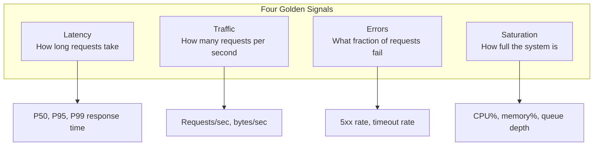
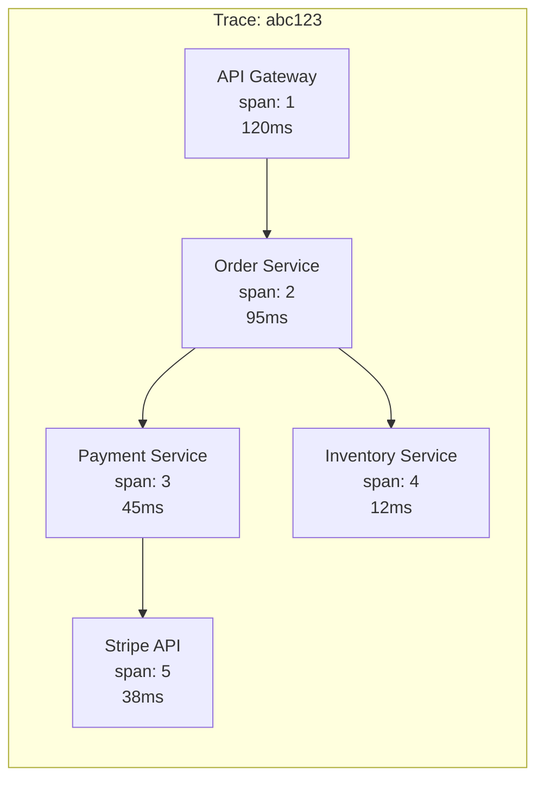
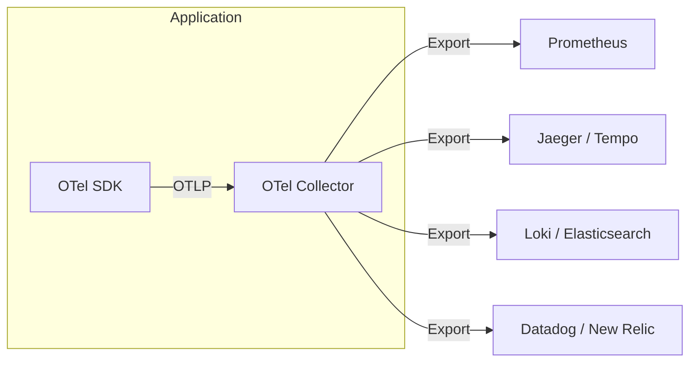
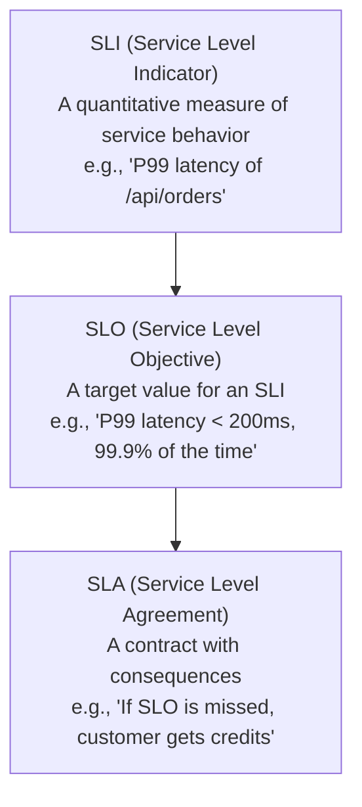
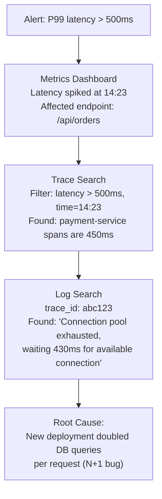

# Observability

Observability is the ability to understand the internal state of a system by examining its external outputs. It is not the same as monitoring. Monitoring tells you *when* something is wrong (CPU is at 95%). Observability tells you *why* something is wrong (a new deployment introduced an N+1 query that is hammering the database connection pool).

In a monolith, you can attach a debugger. In a distributed system with 50 services processing a request, you cannot. The request enters through an API gateway, hits three services, two caches, a message queue, and two databases. When it fails, the error manifests in a completely different service than where the root cause lives. Observability gives you the tools to trace that causal chain backward from symptom to cause, in production, under load, in real time.

## The Three Pillars

### Logs

Logs are discrete, timestamped records of events that happened in your system. They are the most fundamental observability signal — humans have been reading logs since the first computer.

**Structured logging** is non-negotiable in production. Unstructured logs (`"Error processing request for user 123"`) are nearly impossible to query at scale. Structured logs are machine-parseable:

```json
{
  "timestamp": "2026-03-20T14:23:45.123Z",
  "level": "error",
  "service": "order-service",
  "trace_id": "abc123def456",
  "span_id": "789ghi",
  "user_id": "user-42",
  "order_id": "ord-9001",
  "message": "Payment processing failed",
  "error": "connection refused",
  "downstream_service": "payment-service",
  "latency_ms": 5023,
  "retry_count": 3
}
```

```typescript
import pino from 'pino';

const logger = pino({
  level: process.env.LOG_LEVEL || 'info',
  formatters: {
    level: (label) => ({ level: label }),
  },
  serializers: {
    err: pino.stdSerializers.err,
  },
});

// Structured logging with context
function processOrder(orderId: string, userId: string) {
  const log = logger.child({ orderId, userId, operation: 'processOrder' });

  log.info('Starting order processing');

  try {
    const result = chargePayment(orderId);
    log.info({ paymentId: result.id, amount: result.amount },
             'Payment successful');
  } catch (error) {
    log.error({ err: error, retryable: isRetryable(error) },
              'Payment processing failed');
    throw error;
  }
}
```

::: tip Log Levels Strategy
| Level | When to Use | Alert? |
|-------|------------|--------|
| **FATAL** | Process is about to crash | Page immediately |
| **ERROR** | Operation failed, user impact | Alert |
| **WARN** | Something unexpected but handled | Monitor trend |
| **INFO** | Significant business events (order placed, user signed up) | No |
| **DEBUG** | Diagnostic information for debugging | No (disable in prod) |
| **TRACE** | Extremely verbose, per-request detail | No (never in prod) |
:::

### Metrics

Metrics are numeric measurements of system behavior over time. Unlike logs (which record individual events), metrics aggregate data into time series that you can query, alert on, and graph.

**The four golden signals** (from Google's SRE book):



**Metric types in Prometheus:**

```python
from prometheus_client import Counter, Histogram, Gauge, Summary

# Counter: monotonically increasing (requests, errors, bytes)
http_requests_total = Counter(
    'http_requests_total',
    'Total HTTP requests',
    ['method', 'endpoint', 'status']
)

# Histogram: distribution of values (latency, response size)
http_request_duration = Histogram(
    'http_request_duration_seconds',
    'HTTP request duration in seconds',
    ['method', 'endpoint'],
    buckets=[0.005, 0.01, 0.025, 0.05, 0.1, 0.25, 0.5, 1.0, 2.5, 5.0, 10.0]
)

# Gauge: can go up and down (temperature, queue size, connections)
active_connections = Gauge(
    'active_connections',
    'Number of active connections',
    ['service']
)

# Usage in request handler
@app.route('/api/orders', methods=['POST'])
def create_order():
    http_requests_total.labels(
        method='POST', endpoint='/api/orders', status='200').inc()

    with http_request_duration.labels(
            method='POST', endpoint='/api/orders').time():
        result = process_order()

    return jsonify(result)
```

**Histogram quantile calculation:**

Prometheus histograms use buckets. The p99 latency is estimated as:

$$
\phi\text{-quantile} \approx b_{\text{lower}} + \frac{\phi \cdot N - \text{count}_{\text{lower}}}{\text{count}_{\text{upper}} - \text{count}_{\text{lower}}} \times (b_{\text{upper}} - b_{\text{lower}})
$$

```promql
# P99 latency over 5 minutes
histogram_quantile(0.99,
  rate(http_request_duration_seconds_bucket[5m])
)

# Error rate
sum(rate(http_requests_total{status=~"5.."}[5m]))
/
sum(rate(http_requests_total[5m]))

# Request rate by endpoint
sum by (endpoint) (rate(http_requests_total[5m]))
```

### Traces

Distributed traces track a single request as it flows through multiple services. A trace is a tree of spans, where each span represents a unit of work:



```
Trace ID: abc123def456

├── [120ms] API Gateway (span-1)
│   └── [95ms] Order Service (span-2, parent: span-1)
│       ├── [45ms] Payment Service (span-3, parent: span-2)
│       │   └── [38ms] Stripe API (span-5, parent: span-3)
│       └── [12ms] Inventory Service (span-4, parent: span-2)
```

Each span carries:
- **Trace ID** — Unique identifier for the entire request
- **Span ID** — Unique identifier for this span
- **Parent Span ID** — Links to the parent span
- **Start time and duration**
- **Attributes** — Key-value pairs (e.g., `http.method=POST`, `db.statement=SELECT...`)
- **Events** — Timestamped annotations within a span
- **Status** — OK, ERROR, UNSET

## OpenTelemetry

OpenTelemetry (OTel) is the industry standard for instrumentation. It provides vendor-neutral APIs and SDKs for generating logs, metrics, and traces.

### Architecture



### Instrumentation

```python
# OpenTelemetry setup for a Python FastAPI application
from opentelemetry import trace, metrics
from opentelemetry.sdk.trace import TracerProvider
from opentelemetry.sdk.trace.export import BatchSpanProcessor
from opentelemetry.exporter.otlp.proto.grpc.trace_exporter import (
    OTLPSpanExporter,
)
from opentelemetry.sdk.metrics import MeterProvider
from opentelemetry.exporter.otlp.proto.grpc.metric_exporter import (
    OTLPMetricExporter,
)
from opentelemetry.sdk.metrics.export import PeriodicExportingMetricReader
from opentelemetry.instrumentation.fastapi import FastAPIInstrumentor
from opentelemetry.instrumentation.httpx import HTTPXClientInstrumentor
from opentelemetry.instrumentation.sqlalchemy import SQLAlchemyInstrumentor

# Configure trace provider
trace_provider = TracerProvider()
trace_provider.add_span_processor(
    BatchSpanProcessor(OTLPSpanExporter(endpoint="otel-collector:4317"))
)
trace.set_tracer_provider(trace_provider)

# Configure metrics provider
metric_reader = PeriodicExportingMetricReader(
    OTLPMetricExporter(endpoint="otel-collector:4317"),
    export_interval_millis=10000,
)
metrics.set_meter_provider(MeterProvider(metric_readers=[metric_reader]))

# Auto-instrument frameworks
app = FastAPI()
FastAPIInstrumentor.instrument_app(app)
HTTPXClientInstrumentor().instrument()
SQLAlchemyInstrumentor().instrument(engine=db_engine)

# Custom instrumentation
tracer = trace.get_tracer("order-service")
meter = metrics.get_meter("order-service")

order_counter = meter.create_counter(
    "orders_created_total",
    description="Total orders created",
)

@app.post("/api/orders")
async def create_order(order: OrderRequest):
    with tracer.start_as_current_span("create_order") as span:
        span.set_attribute("order.items_count", len(order.items))
        span.set_attribute("order.total_amount", order.total)

        # Payment processing
        with tracer.start_as_current_span("process_payment"):
            payment = await payment_service.charge(order.total)
            span.add_event("payment_completed", {
                "payment_id": payment.id
            })

        order_counter.add(1, {"payment_method": order.payment_method})
        return {"order_id": order.id}
```

### OpenTelemetry Collector Configuration

```yaml
# otel-collector-config.yaml
receivers:
  otlp:
    protocols:
      grpc:
        endpoint: 0.0.0.0:4317
      http:
        endpoint: 0.0.0.0:4318

processors:
  batch:
    timeout: 5s
    send_batch_size: 1024

  # Add resource attributes
  resource:
    attributes:
      - key: environment
        value: production
        action: upsert

  # Tail-based sampling (keep errors + 10% of success)
  tail_sampling:
    decision_wait: 10s
    policies:
      - name: errors
        type: status_code
        status_code:
          status_codes: [ERROR]
      - name: slow-requests
        type: latency
        latency:
          threshold_ms: 1000
      - name: percentage
        type: probabilistic
        probabilistic:
          sampling_percentage: 10

exporters:
  prometheus:
    endpoint: 0.0.0.0:8889
  jaeger:
    endpoint: jaeger:14250
    tls:
      insecure: true
  loki:
    endpoint: http://loki:3100/loki/api/v1/push

service:
  pipelines:
    traces:
      receivers: [otlp]
      processors: [batch, resource, tail_sampling]
      exporters: [jaeger]
    metrics:
      receivers: [otlp]
      processors: [batch, resource]
      exporters: [prometheus]
    logs:
      receivers: [otlp]
      processors: [batch, resource]
      exporters: [loki]
```

## The Observability Stack

### Prometheus + Grafana (Metrics)

```yaml
# prometheus.yml
global:
  scrape_interval: 15s
  evaluation_interval: 15s

rule_files:
  - /etc/prometheus/rules/*.yml

scrape_configs:
  - job_name: 'kubernetes-pods'
    kubernetes_sd_configs:
      - role: pod
    relabel_configs:
      - source_labels: [__meta_kubernetes_pod_annotation_prometheus_io_scrape]
        action: keep
        regex: true
      - source_labels: [__meta_kubernetes_pod_annotation_prometheus_io_path]
        action: replace
        target_label: __metrics_path__
        regex: (.+)
```

### Jaeger (Traces)

Jaeger is the most widely used open-source distributed tracing backend. It stores traces and provides a UI for querying and visualizing them.

```yaml
# Jaeger deployment in Kubernetes
apiVersion: apps/v1
kind: Deployment
metadata:
  name: jaeger
spec:
  replicas: 1
  template:
    spec:
      containers:
        - name: jaeger
          image: jaegertracing/all-in-one:1.54
          env:
            - name: SPAN_STORAGE_TYPE
              value: elasticsearch
            - name: ES_SERVER_URLS
              value: http://elasticsearch:9200
          ports:
            - containerPort: 16686  # UI
            - containerPort: 14250  # gRPC (collector)
            - containerPort: 14268  # HTTP (collector)
```

### ELK Stack (Logs)

Elasticsearch + Logstash (or Fluentd/Fluent Bit) + Kibana for log aggregation:

```yaml
# Fluent Bit DaemonSet (collects logs from every node)
apiVersion: apps/v1
kind: DaemonSet
metadata:
  name: fluent-bit
spec:
  template:
    spec:
      containers:
        - name: fluent-bit
          image: fluent/fluent-bit:2.2
          volumeMounts:
            - name: varlog
              mountPath: /var/log
            - name: config
              mountPath: /fluent-bit/etc/
      volumes:
        - name: varlog
          hostPath:
            path: /var/log
        - name: config
          configMap:
            name: fluent-bit-config
---
apiVersion: v1
kind: ConfigMap
metadata:
  name: fluent-bit-config
data:
  fluent-bit.conf: |
    [SERVICE]
        Flush        5
        Log_Level    info
        Parsers_File parsers.conf

    [INPUT]
        Name              tail
        Tag               kube.*
        Path              /var/log/containers/*.log
        Parser            docker
        Mem_Buf_Limit     5MB

    [FILTER]
        Name              kubernetes
        Match             kube.*
        Merge_Log         On
        K8S-Logging.Parser On

    [OUTPUT]
        Name              es
        Match             *
        Host              elasticsearch
        Port              9200
        Logstash_Format   On
        Logstash_Prefix   k8s-logs
        Retry_Limit       5
```

## SLIs, SLOs, and SLAs

### Definitions



| Concept | Audience | Consequence of Violation |
|---------|----------|------------------------|
| **SLI** | Engineering team | None (it is a measurement) |
| **SLO** | Engineering + product | Prioritize reliability work |
| **SLA** | Customers | Financial penalties, credits |

### Choosing SLIs

Good SLIs measure the user experience, not internal metrics:

| Bad SLI | Good SLI | Why |
|---------|----------|-----|
| CPU utilization | Request latency (p99) | Users do not care about CPU |
| Free disk space | Error rate (5xx / total) | Users care about failures |
| Pod count | Availability (successful requests / total) | Users care about uptime |

```promql
# Availability SLI: fraction of successful requests
sum(rate(http_requests_total{status!~"5.."}[1h]))
/
sum(rate(http_requests_total[1h]))

# Latency SLI: fraction of requests under 200ms
sum(rate(http_request_duration_seconds_bucket{le="0.2"}[1h]))
/
sum(rate(http_request_duration_seconds_count[1h]))
```

### Error Budgets

An error budget is the inverse of your SLO. If your SLO is 99.9% availability, your error budget is 0.1% — roughly 43 minutes of downtime per month.

$$
\text{Error Budget} = 1 - \text{SLO Target}
$$

$$
\text{Monthly Budget (minutes)} = 30 \times 24 \times 60 \times (1 - \text{SLO})
$$

| SLO | Error Budget / Month | Error Budget / Quarter |
|-----|---------------------|----------------------|
| 99% | 7.2 hours | 21.6 hours |
| 99.9% | 43.2 minutes | 2.16 hours |
| 99.95% | 21.6 minutes | 1.08 hours |
| 99.99% | 4.32 minutes | 12.96 minutes |

::: warning Error Budgets Drive Decisions
When the error budget is healthy, ship features fast. When the error budget is nearly exhausted, freeze deployments and focus on reliability. This creates a natural feedback loop between velocity and reliability without subjective debates.
:::

```python
class ErrorBudget:
    def __init__(self, slo_target: float, window_days: int = 30):
        self.slo_target = slo_target
        self.window_seconds = window_days * 24 * 3600
        self.budget = 1 - slo_target  # e.g., 0.001 for 99.9%

    def remaining(self, total_requests: int,
                  failed_requests: int) -> float:
        """Returns remaining error budget as a fraction (0 to 1)."""
        allowed_failures = total_requests * self.budget
        consumed = failed_requests / allowed_failures if allowed_failures > 0 else 1.0
        return max(0, 1 - consumed)

    def should_freeze_deployments(self, total: int, failed: int) -> bool:
        return self.remaining(total, failed) < 0.1  # < 10% remaining
```

## Alerting Strategies

### Alert on Symptoms, Not Causes

| Bad Alert (cause) | Good Alert (symptom) |
|-------------------|---------------------|
| CPU > 90% | P99 latency > 500ms |
| Disk > 80% | Error rate > 1% for 5 minutes |
| Pod restarted | Availability below SLO burn rate |

### Multi-Window Burn Rate Alerting

Instead of alerting on instantaneous SLO violations, alert when the error budget is being consumed faster than expected:

$$
\text{Burn Rate} = \frac{\text{Actual Error Rate}}{\text{Allowed Error Rate}}
$$

A burn rate of 1 means you will exactly exhaust the budget by the end of the window. A burn rate of 10 means you will exhaust the budget in 1/10 of the window.

```yaml
# Prometheus alerting rules for multi-window burn rate
groups:
  - name: slo-alerts
    rules:
      # Fast burn: 14.4x burn rate over 1 hour (pages immediately)
      - alert: HighErrorBurnRate
        expr: |
          (
            sum(rate(http_requests_total{status=~"5.."}[1h]))
            / sum(rate(http_requests_total[1h]))
          ) > (14.4 * 0.001)
          and
          (
            sum(rate(http_requests_total{status=~"5.."}[5m]))
            / sum(rate(http_requests_total[5m]))
          ) > (14.4 * 0.001)
        for: 2m
        labels:
          severity: critical
        annotations:
          summary: "High error burn rate - will exhaust monthly budget in 2 days"

      # Slow burn: 3x burn rate over 3 days (tickets)
      - alert: SlowErrorBurnRate
        expr: |
          (
            sum(rate(http_requests_total{status=~"5.."}[3d]))
            / sum(rate(http_requests_total[3d]))
          ) > (3 * 0.001)
          and
          (
            sum(rate(http_requests_total{status=~"5.."}[6h]))
            / sum(rate(http_requests_total[6h]))
          ) > (3 * 0.001)
        for: 15m
        labels:
          severity: warning
        annotations:
          summary: "Slow error burn rate - will exhaust monthly budget in 10 days"
```

### Runbook Automation

Every alert should link to a runbook. Runbooks should be automatable:

```yaml
# Example runbook structure
alert: HighDatabaseLatency
runbook: |
  ## Diagnosis
  1. Check connection pool saturation:
     `kubectl exec -it $POD -- curl localhost:9090/metrics | grep db_pool`
  2. Check slow queries:
     `SELECT * FROM pg_stat_activity WHERE state = 'active' ORDER BY duration DESC LIMIT 10;`
  3. Check for lock contention:
     `SELECT * FROM pg_locks WHERE NOT granted;`

  ## Mitigation
  1. If connection pool saturated → Scale up pool size or add read replicas
  2. If slow query detected → Kill query: `SELECT pg_cancel_backend($PID);`
  3. If lock contention → Identify blocking transaction and consider termination

  ## Escalation
  - If not resolved in 15 minutes → Page database team
```

## Correlating Signals

The real power of observability comes from correlating logs, metrics, and traces. When an alert fires:

1. **Metrics** tell you *what* changed (latency spike at 14:23)
2. **Traces** tell you *where* the slowness is (payment service, span 3)
3. **Logs** tell you *why* (connection pool exhausted, 0 available connections)



Use the trace ID as the correlation key. Inject it into every log line, every metric label, and propagate it through every service call.

## Further Reading

- [Rate Limiting](/system-design/distributed-systems/rate-limiting) — How to monitor and alert on rate limit metrics
- [Circuit Breaker Pattern](/system-design/distributed-systems/circuit-breaker) — Monitoring circuit breaker state changes
- [Nginx Deep Dive](/infrastructure/nginx/) — Nginx metrics and access log analysis
- [Service Mesh](/infrastructure/service-mesh/) — Automatic observability from the mesh layer
- [Prometheus Deep Dive](/devops/monitoring/prometheus-deep-dive) — Advanced PromQL and Prometheus architecture
- [Grafana Dashboards](/devops/monitoring/grafana-dashboards) — Building effective dashboards
- [Structured Logging](/devops/logging/structured-logging) — Production logging patterns
- Google SRE book, Chapters 4-6 (Service Level Objectives, Monitoring Distributed Systems)
- Charity Majors, Liz Fong-Jones, George Miranda, *Observability Engineering* (O'Reilly, 2022)
- OpenTelemetry documentation: opentelemetry.io/docs/
