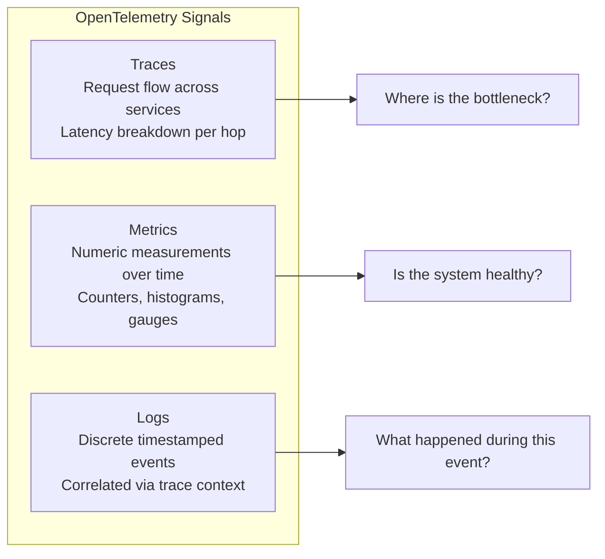
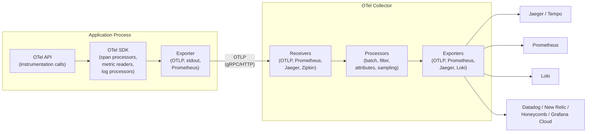
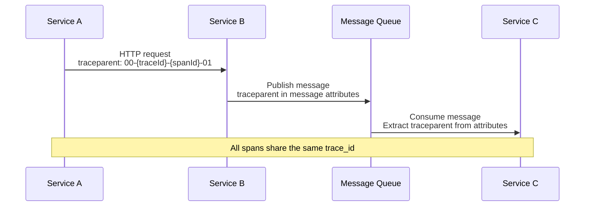
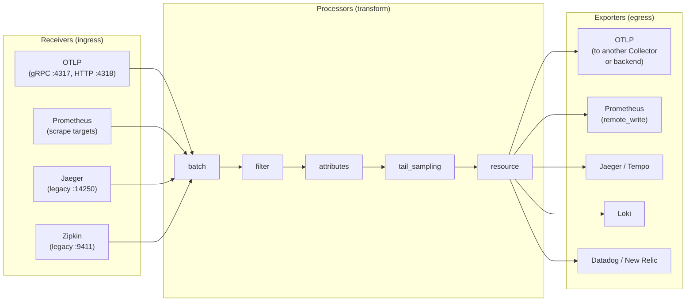
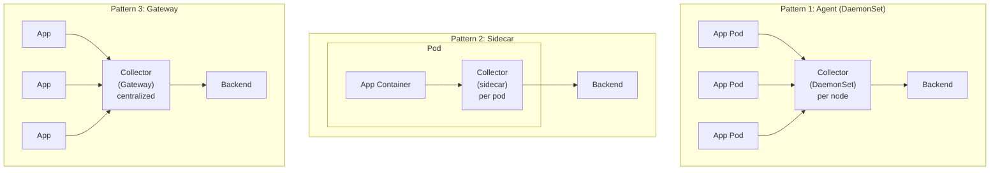
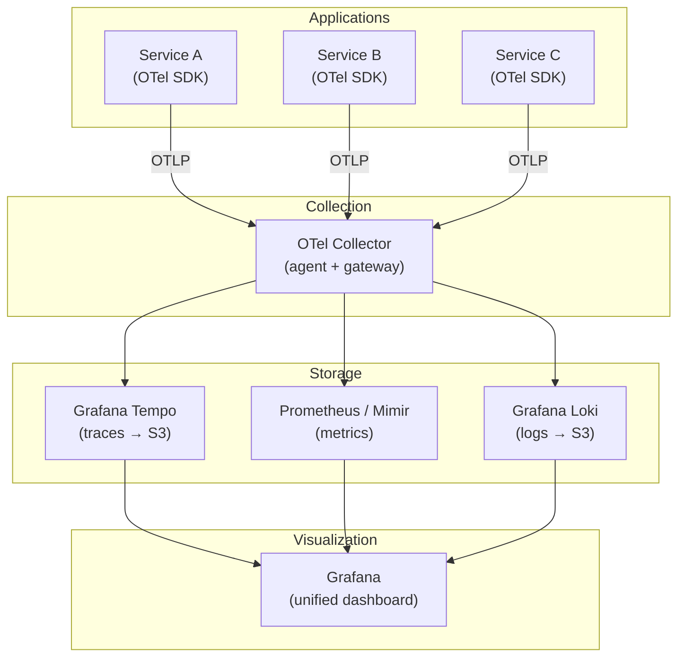

# OpenTelemetry

OpenTelemetry (OTel) is the open standard for generating, collecting, and exporting telemetry data from software systems. It provides vendor-neutral APIs, SDKs, and tools for producing traces, metrics, and logs — the three signals that make a distributed system observable. Before OTel, every observability vendor shipped its own proprietary SDK. If you instrumented your code with Datadog's library, switching to New Relic meant rewriting every instrumentation call across every service. OpenTelemetry eliminates that lock-in: you instrument once, and export to any backend.

This page covers OTel's architecture, all three signal types, the Collector pipeline, instrumentation in four languages, and backend integration patterns.

**Related**: [Distributed Tracing](/architecture-patterns/microservices/distributed-tracing) (deep dive on trace concepts, W3C Trace Context, sampling strategies, trace-based testing) | [Observability in System Design](/system-design/advanced/observability-in-design) (designing observability into architecture, SLIs/SLOs, alerting strategies) | [Observability Overview](/infrastructure/observability/) (three pillars, Prometheus, Grafana, alerting)

---

## What is OpenTelemetry?

### History: Two Projects Become One

OpenTelemetry was born from the merger of two competing CNCF projects:

| Project | Created | Focus | Problem |
|---------|---------|-------|---------|
| **OpenTracing** | 2016 | Distributed tracing API standard | API-only, no SDK — each vendor implemented differently |
| **OpenCensus** | 2018 (Google) | Traces + metrics with SDK | Competed with OpenTracing, split the ecosystem |
| **OpenTelemetry** | 2019 (merger) | Traces + metrics + logs, full stack | Unified standard, single ecosystem |

OpenTracing gave the community a common vocabulary for tracing (spans, contexts, propagation), but it was just an API specification — every vendor's implementation differed in subtle, incompatible ways. OpenCensus, backed by Google, shipped an actual SDK with traces and metrics built in, but its existence fractured the ecosystem. Library authors had to choose which project to support, and many chose neither.

In 2019, the two projects merged into OpenTelemetry under the CNCF. By 2024, OTel's tracing and metrics APIs reached GA (stable) status across most languages. Logging reached stable in 2024-2025. As of 2026, OpenTelemetry is the second most active CNCF project after Kubernetes.

### The Three Signals



| Signal | What It Answers | Data Model | Typical Volume |
|--------|----------------|------------|----------------|
| **Traces** | "Where did this request spend its time?" | Tree of spans with timing, attributes, events | Low-medium (sampled) |
| **Metrics** | "How is the system performing right now?" | Time series of counters, histograms, gauges | Low (aggregated) |
| **Logs** | "What exactly happened at this moment?" | Timestamped structured records | High (every event) |

The power of OTel is that these three signals share context. A metric exemplar links to a specific trace. A log record carries the `trace_id` and `span_id` of the span that produced it. This correlation means you can go from a dashboard anomaly to a specific trace to the exact log line that explains the root cause — in seconds.

### OTel vs Vendor-Specific SDKs

| Aspect | Vendor SDK (Datadog, New Relic) | OpenTelemetry |
|--------|---------------------------------|---------------|
| **Lock-in** | High — rewriting instrumentation to switch vendors costs months | None — change the exporter config, keep all instrumentation |
| **Language support** | Varies by vendor | 11+ languages with official SDKs |
| **Auto-instrumentation** | Vendor-specific, often excellent | Broad coverage, improving rapidly |
| **Overhead** | Optimized for their pipeline | Comparable; batch processing keeps it low |
| **Community** | Vendor-maintained | Thousands of contributors, CNCF-governed |
| **Features** | Often ahead on proprietary features (APM, profiling) | Focused on telemetry generation, not analysis |
| **Cost** | Often bundled with the vendor platform | Free and open-source |

::: warning Vendor SDKs are not going away
Most observability vendors now ship OTel-compatible receivers and recommend OTel for instrumentation. Datadog, New Relic, Honeycomb, and Grafana Cloud all accept OTLP natively. However, some vendor-specific features (runtime profiling, code-level APM, security monitoring) still require the vendor's own agent. The practical approach is: OTel for instrumentation, vendor agent for their proprietary features where needed.
:::

### CNCF Project Status

OpenTelemetry is a **CNCF Graduated project** (graduated in 2024). This is the highest maturity level in the CNCF, alongside Kubernetes, Prometheus, and Envoy. Graduation means the project has demonstrated production adoption, a healthy contributor base, and strong governance.

Stability by component (as of 2026):

| Component | Status | Notes |
|-----------|--------|-------|
| Traces API/SDK | Stable (GA) | All major languages |
| Metrics API/SDK | Stable (GA) | All major languages |
| Logs API/SDK | Stable (GA) | Reached GA in 2024-2025 across languages |
| Collector | Stable (core), Mixed (contrib) | Core receivers/exporters stable; contrib processors vary |
| Semantic Conventions | Stable (HTTP, DB, messaging) | Some domains still experimental |
| Profiling | Experimental | Signal added in 2024, evolving rapidly |

---

## Architecture

### SDK, API, Collector

OpenTelemetry's architecture has three distinct layers: the API (for instrumentation), the SDK (for configuration and processing), and the Collector (for routing and exporting).



**Why separate API and SDK?**

The API is a thin interface with no dependencies. Library authors instrument their code using only the API — this adds zero overhead when OTel is not configured (the API defaults to no-op implementations). Application owners install the SDK, which provides the actual implementation: span processing, metric aggregation, batching, and export. This separation means libraries can be instrumented without forcing a specific SDK version or backend on consumers.

### The Data Flow

```
Your Code
  → OTel API (create span, record metric, emit log)
    → OTel SDK (process, sample, batch)
      → Exporter (serialize to OTLP protocol)
        → OTel Collector (receive, process, fan-out)
          → Backend (Jaeger, Prometheus, Loki, Datadog, etc.)
```

### Auto-Instrumentation vs Manual Instrumentation

| Approach | What It Does | Effort | Coverage |
|----------|-------------|--------|----------|
| **Auto-instrumentation** | Automatically instruments HTTP servers/clients, database drivers, message queues, gRPC, etc. | Zero code changes (agent/SDK setup only) | Framework and library calls |
| **Manual instrumentation** | You create custom spans, record custom metrics, add attributes and events | Requires code changes | Business logic, custom operations |

Auto-instrumentation is your starting point. It gives you a full trace through your HTTP handlers, database queries, and outgoing HTTP calls without writing a single instrumentation line. Manual instrumentation adds business context: "this span represents order validation," "this attribute is the cart total," "this event marks the moment payment was authorized."

In practice, every production system uses both. Auto-instrumentation for the infrastructure layer, manual instrumentation for the business layer.

### Context Propagation

Context propagation is how trace context (trace ID, span ID, sampling decision) travels between services. Without propagation, each service creates isolated traces instead of a connected tree.

| Format | Standard | Headers | Used By |
|--------|----------|---------|---------|
| **W3C Trace Context** | W3C Recommendation | `traceparent`, `tracestate` | OTel default, most modern systems |
| **B3 (Zipkin)** | De facto | `X-B3-TraceId`, `X-B3-SpanId`, `X-B3-Sampled` | Zipkin, older systems |
| **Jaeger** | Proprietary | `uber-trace-id` | Legacy Jaeger deployments |
| **AWS X-Ray** | Proprietary | `X-Amzn-Trace-Id` | AWS services |

OTel supports all of these and defaults to W3C Trace Context. For a detailed breakdown of the `traceparent` header format, see [Distributed Tracing: W3C Trace Context](/architecture-patterns/microservices/distributed-tracing#w3c-trace-context-standard).

Context propagation works across transport protocols:



```typescript
// Context propagation happens automatically with auto-instrumentation.
// For manual propagation (e.g., custom transports):
import { context, propagation } from '@opentelemetry/api';

// Inject context into a carrier (outgoing)
const headers: Record<string, string> = {};
propagation.inject(context.active(), headers);
// headers now contains { traceparent: '00-abc...-def...-01' }

// Extract context from a carrier (incoming)
const extractedContext = propagation.extract(
  context.active(),
  incomingHeaders
);
// Use extractedContext as the parent for new spans
```

---

## Traces

Traces are the signal that made OpenTelemetry famous. A trace represents the entire lifecycle of a request as it flows through your distributed system — a tree of spans where each span is a unit of work.

For a comprehensive treatment of trace concepts, span anatomy, waterfall visualization, and trace-based testing, see [Distributed Tracing](/architecture-patterns/microservices/distributed-tracing). This section focuses on OTel-specific trace APIs and patterns.

### Spans, Traces, Span Context

Every span carries:

| Field | Description | Example |
|-------|-------------|---------|
| `trace_id` | 128-bit ID shared by all spans in the trace | `4bf92f3577b34da6a3ce929d0e0e4736` |
| `span_id` | 64-bit ID unique to this span | `00f067aa0ba902b7` |
| `parent_span_id` | Links to the parent span (empty for root span) | `abcdef1234567890` |
| `name` | Human-readable operation name | `POST /api/orders` |
| `kind` | `SERVER`, `CLIENT`, `PRODUCER`, `CONSUMER`, `INTERNAL` | `SERVER` |
| `start_time` | When the operation started | `2026-04-04T14:23:45.123Z` |
| `end_time` | When the operation ended | `2026-04-04T14:23:45.245Z` |
| `status` | `OK`, `ERROR`, `UNSET` | `ERROR` |
| `attributes` | Key-value metadata | `http.method=POST`, `http.status_code=500` |
| `events` | Timestamped annotations within the span | `exception` event with stack trace |
| `links` | References to spans in other traces | Batch processor linking to triggering request |

### Span Attributes, Events, and Links

**Attributes** are key-value pairs that describe the span. OTel defines semantic conventions for common attributes:

```python
from opentelemetry import trace

tracer = trace.get_tracer("order-service")

with tracer.start_as_current_span("process-order") as span:
    # Semantic convention attributes
    span.set_attribute("http.request.method", "POST")
    span.set_attribute("http.response.status_code", 201)
    span.set_attribute("url.path", "/api/orders")

    # Custom business attributes
    span.set_attribute("order.id", "ord-9001")
    span.set_attribute("order.item_count", 3)
    span.set_attribute("order.total_cents", 4599)
    span.set_attribute("customer.tier", "premium")
```

**Events** are timestamped annotations within a span — things that happened at a specific point during the operation:

```python
    # Record a significant moment
    span.add_event("payment_authorized", {
        "payment.provider": "stripe",
        "payment.id": "pi_abc123",
        "payment.amount_cents": 4599,
    })

    # OTel automatically records exceptions as events
    try:
        charge_card(order)
    except PaymentError as e:
        span.record_exception(e)  # Adds an "exception" event
        span.set_status(trace.StatusCode.ERROR, str(e))
        raise
```

**Links** connect spans across different traces. Use them when a span is causally related to spans in another trace but is not a parent-child relationship:

```python
# A batch processing job links to the traces that triggered it
from opentelemetry.trace import Link

trigger_contexts = [msg.trace_context for msg in batch_messages]
links = [Link(ctx) for ctx in trigger_contexts]

with tracer.start_as_current_span("process-batch", links=links) as span:
    span.set_attribute("batch.size", len(batch_messages))
    for msg in batch_messages:
        process(msg)
```

### Sampling Strategies

Not every trace needs to be recorded. At high throughput, collecting 100% of traces is prohibitively expensive. Sampling controls which traces are kept.

| Strategy | Where It Happens | How It Works | Trade-off |
|----------|-----------------|-------------|-----------|
| **Head-based (probability)** | At trace creation | Random decision at the root span — keep or drop the entire trace | Simple, predictable cost; misses rare errors |
| **Head-based (rate limiting)** | At trace creation | Keep N traces per second | Prevents burst costs; may miss patterns |
| **Tail-based** | At the Collector (after trace completes) | Examine the full trace, then decide to keep or drop | Catches all errors and slow traces; requires buffering |
| **Always on** | At trace creation | Keep everything | Only viable at low throughput (<100 req/s) |
| **Always off** | At trace creation | Drop everything | For production services where tracing is not needed |

::: tip Production sampling strategy
The most effective production setup combines **head-based sampling** (keep 5-10% of all traces for baseline visibility) with **tail-based sampling** at the Collector (always keep traces with errors, traces slower than a threshold, and traces matching specific attributes). This gives you low cost and guaranteed visibility into problems.
:::

```yaml
# Tail-based sampling in OTel Collector
processors:
  tail_sampling:
    decision_wait: 10s
    num_traces: 100000
    policies:
      # Always keep error traces
      - name: errors-policy
        type: status_code
        status_code:
          status_codes: [ERROR]
      # Always keep slow traces
      - name: latency-policy
        type: latency
        latency:
          threshold_ms: 2000
      # Keep 5% of everything else
      - name: probabilistic-policy
        type: probabilistic
        probabilistic:
          sampling_percentage: 5
```

---

## Metrics

OTel metrics provide a vendor-neutral way to record numeric measurements. Unlike Prometheus client libraries (which expose metrics via a scrape endpoint), OTel metrics are push-based by default — the SDK periodically exports aggregated metrics to the Collector or directly to a backend.

### Metric Types

| Type | Behavior | Use Case | Example |
|------|----------|----------|---------|
| **Counter** | Monotonically increasing | Counting events | `http.server.request.count` |
| **UpDownCounter** | Can increase or decrease | Current totals | `active_connections`, `queue_depth` |
| **Histogram** | Records distribution of values | Latency, response sizes | `http.server.request.duration` |
| **Gauge** | Reports current value at observation time | CPU usage, temperature | `system.cpu.utilization` |

```typescript
import { metrics } from '@opentelemetry/api';

const meter = metrics.getMeter('order-service');

// Counter — total orders created
const orderCounter = meter.createCounter('orders.created', {
  description: 'Total number of orders created',
  unit: '{order}',
});
orderCounter.add(1, { 'payment.method': 'credit_card', 'customer.tier': 'premium' });

// UpDownCounter — items currently in processing queue
const queueDepth = meter.createUpDownCounter('orders.queue_depth', {
  description: 'Number of orders waiting to be processed',
  unit: '{order}',
});
queueDepth.add(1);   // Order enqueued
queueDepth.add(-1);  // Order dequeued

// Histogram — order processing duration
const processingDuration = meter.createHistogram('orders.processing_duration', {
  description: 'Time to process an order',
  unit: 'ms',
});
const startTime = Date.now();
await processOrder(order);
processingDuration.record(Date.now() - startTime, { 'order.type': 'standard' });

// Gauge (via observable callback)
meter.createObservableGauge('system.memory.usage', {
  description: 'Current memory usage in bytes',
  unit: 'By',
}).addCallback((result) => {
  result.observe(process.memoryUsage().heapUsed, { 'memory.type': 'heap' });
});
```

### Views and Aggregations

Views let you customize how metrics are aggregated without changing the instrumentation code. This is powerful when different backends need different aggregation strategies:

```typescript
import { MeterProvider, View } from '@opentelemetry/sdk-metrics';
import {
  ExplicitBucketHistogramAggregation,
  DropAggregation,
} from '@opentelemetry/sdk-metrics';

const meterProvider = new MeterProvider({
  views: [
    // Custom histogram buckets for order processing duration
    new View({
      instrumentName: 'orders.processing_duration',
      aggregation: new ExplicitBucketHistogramAggregation(
        [10, 50, 100, 250, 500, 1000, 2500, 5000]
      ),
    }),
    // Drop a noisy metric entirely
    new View({
      instrumentName: 'debug.*',
      aggregation: new DropAggregation(),
    }),
    // Rename a metric for backward compatibility
    new View({
      instrumentName: 'http.server.request.duration',
      meterName: 'legacy-service',
      name: 'http_request_duration_seconds',
    }),
  ],
});
```

### Metric Exemplars

Exemplars are the bridge between metrics and traces. An exemplar is a sample measurement attached to a metric data point that includes the `trace_id` and `span_id` of the request that produced it. When you see a latency spike on a dashboard, exemplars let you click through to the exact trace that caused the spike.

```
Histogram: http.server.request.duration

Bucket [100ms-250ms]: count=1847
Bucket [250ms-500ms]: count=423
Bucket [500ms-1000ms]: count=12
  └─ Exemplar: value=892ms, trace_id=abc123, span_id=def456
     (click to see the trace of this slow request)
Bucket [1000ms+]: count=2
  └─ Exemplar: value=2341ms, trace_id=xyz789, span_id=ghi012
```

In Grafana, this appears as dots on your histogram panel that link directly to the trace view in Tempo or Jaeger.

### Custom Metrics Instrumentation

```python
from opentelemetry import metrics

meter = metrics.get_meter("payment-service")

# Business metrics
payment_amount = meter.create_histogram(
    "payment.amount",
    description="Payment transaction amounts",
    unit="USD",
)

payment_success = meter.create_counter(
    "payment.success_total",
    description="Successful payment transactions",
)

payment_failure = meter.create_counter(
    "payment.failure_total",
    description="Failed payment transactions",
)

def process_payment(amount: float, method: str, currency: str):
    try:
        result = stripe.charge(amount, currency)
        payment_amount.record(amount, {"payment.method": method, "currency": currency})
        payment_success.add(1, {"payment.method": method, "provider": "stripe"})
        return result
    except StripeError as e:
        payment_failure.add(1, {
            "payment.method": method,
            "error.type": type(e).__name__,
        })
        raise
```

---

## Logs

OTel's log signal is the newest and most nuanced. Rather than replacing your existing logging library, OTel provides a **log bridge** that connects your existing logger (Log4j, SLF4J, Python logging, pino, etc.) to the OTel pipeline. This means your logs get enriched with trace context and exported alongside traces and metrics through a unified pipeline.

### Log Correlation with Traces

The key value of OTel logs is automatic correlation. When a log is emitted inside an active span, the OTel log bridge injects `trace_id` and `span_id` into the log record:

```json
{
  "timestamp": "2026-04-04T14:23:45.123Z",
  "severity": "ERROR",
  "body": "Payment processing failed: insufficient funds",
  "resource": {
    "service.name": "order-service",
    "service.version": "2.4.1"
  },
  "attributes": {
    "order.id": "ord-9001",
    "customer.id": "cust-42"
  },
  "trace_id": "4bf92f3577b34da6a3ce929d0e0e4736",
  "span_id": "00f067aa0ba902b7",
  "trace_flags": 1
}
```

With this correlation, clicking a trace in Jaeger or Tempo shows the logs emitted during that trace. Clicking a log in Loki or Elasticsearch shows the trace it belongs to. This bidirectional linking eliminates the manual search-by-timestamp approach that wastes hours during incidents.

### Structured Logging Integration

```typescript
import pino from 'pino';
import { trace } from '@opentelemetry/api';

// Create a pino logger that automatically injects trace context
const logger = pino({
  mixin() {
    const span = trace.getActiveSpan();
    if (span) {
      const { traceId, spanId, traceFlags } = span.spanContext();
      return { traceId, spanId, traceFlags };
    }
    return {};
  },
});

// Every log call now includes trace context automatically
async function processOrder(orderId: string) {
  const child = logger.child({ orderId });
  child.info('Starting order processing');
  // Output: {"level":"info","traceId":"abc123...","spanId":"def456...","orderId":"ord-9001","msg":"Starting order processing"}

  try {
    await chargePayment(orderId);
    child.info('Payment successful');
  } catch (error) {
    child.error({ err: error }, 'Payment failed');
    throw error;
  }
}
```

### Log Bridges

OTel log bridges connect existing logging frameworks to the OTel pipeline without requiring you to change your logging calls.

**Python:**

```python
import logging
from opentelemetry._logs import set_logger_provider
from opentelemetry.sdk._logs import LoggerProvider, LoggingHandler
from opentelemetry.sdk._logs.export import BatchLogRecordProcessor
from opentelemetry.exporter.otlp.proto.grpc._log_exporter import OTLPLogExporter

# Set up OTel log provider
logger_provider = LoggerProvider()
logger_provider.add_log_record_processor(
    BatchLogRecordProcessor(OTLPLogExporter(endpoint="otel-collector:4317"))
)
set_logger_provider(logger_provider)

# Bridge standard Python logging to OTel
handler = LoggingHandler(level=logging.INFO, logger_provider=logger_provider)
logging.getLogger().addHandler(handler)

# Now standard logging calls are exported via OTel
logger = logging.getLogger("order-service")
logger.info("Order created", extra={"order_id": "ord-9001", "total": 45.99})
# This log record will include trace_id and span_id if inside an active span
```

**Java (Log4j2 bridge):**

```xml
<!-- pom.xml -->
<dependency>
  <groupId>io.opentelemetry.instrumentation</groupId>
  <artifactId>opentelemetry-log4j-appender-2.17</artifactId>
  <version>2.12.0-alpha</version>
</dependency>
```

```xml
<!-- log4j2.xml -->
<Configuration>
  <Appenders>
    <OpenTelemetry name="OTelAppender" />
    <Console name="Console" target="SYSTEM_OUT">
      <PatternLayout pattern="%d{ISO8601} [%t] %-5level %logger{36} trace_id=%X{trace_id} span_id=%X{span_id} - %msg%n"/>
    </Console>
  </Appenders>
  <Loggers>
    <Root level="info">
      <AppenderRef ref="OTelAppender"/>
      <AppenderRef ref="Console"/>
    </Root>
  </Loggers>
</Configuration>
```

---

## OTel Collector

The OTel Collector is a vendor-agnostic proxy that receives, processes, and exports telemetry data. It is the single most important operational component in an OTel deployment. Without it, every application must know about every backend, every sampling decision happens in the application, and changing backends requires redeploying every service.

### Receivers, Processors, Exporters Pipeline



### Configuration

The Collector is configured via YAML. Every pipeline explicitly declares which receivers, processors, and exporters to use:

```yaml
# otel-collector-config.yaml — production-ready configuration
receivers:
  otlp:
    protocols:
      grpc:
        endpoint: 0.0.0.0:4317
        max_recv_msg_size_mib: 4
      http:
        endpoint: 0.0.0.0:4318
        cors:
          allowed_origins: ["*"]

  # Scrape Prometheus metrics from services
  prometheus:
    config:
      scrape_configs:
        - job_name: 'kubernetes-pods'
          scrape_interval: 15s
          kubernetes_sd_configs:
            - role: pod
          relabel_configs:
            - source_labels: [__meta_kubernetes_pod_annotation_prometheus_io_scrape]
              action: keep
              regex: true

processors:
  # Batch telemetry for efficient export
  batch:
    timeout: 5s
    send_batch_size: 1024
    send_batch_max_size: 2048

  # Add resource attributes to all telemetry
  resource:
    attributes:
      - key: environment
        value: production
        action: upsert
      - key: cluster
        value: us-east-1-prod
        action: upsert

  # Filter out health check spans
  filter:
    error_mode: ignore
    traces:
      span:
        - 'attributes["http.route"] == "/health"'
        - 'attributes["http.route"] == "/ready"'

  # Modify span attributes
  attributes:
    actions:
      # Remove sensitive data
      - key: db.statement
        action: hash
      - key: http.request.header.authorization
        action: delete
      # Add computed attributes
      - key: deployment.ring
        value: canary
        action: upsert

  # Tail-based sampling for traces
  tail_sampling:
    decision_wait: 10s
    num_traces: 100000
    policies:
      - name: errors
        type: status_code
        status_code:
          status_codes: [ERROR]
      - name: slow-requests
        type: latency
        latency:
          threshold_ms: 2000
      - name: high-value-customers
        type: string_attribute
        string_attribute:
          key: customer.tier
          values: [enterprise, premium]
      - name: baseline
        type: probabilistic
        probabilistic:
          sampling_percentage: 5

  # Memory limiter to prevent OOM
  memory_limiter:
    check_interval: 1s
    limit_mib: 1024
    spike_limit_mib: 256

exporters:
  otlp/tempo:
    endpoint: tempo:4317
    tls:
      insecure: true

  prometheusremotewrite:
    endpoint: http://prometheus:9090/api/v1/write

  otlp/loki:
    endpoint: loki:3100

  otlp/datadog:
    endpoint: https://api.datadoghq.com
    headers:
      DD-API-KEY: "${env:DD_API_KEY}"

extensions:
  health_check:
    endpoint: 0.0.0.0:13133
  zpages:
    endpoint: 0.0.0.0:55679

service:
  extensions: [health_check, zpages]
  pipelines:
    traces:
      receivers: [otlp]
      processors: [memory_limiter, filter, attributes, tail_sampling, batch]
      exporters: [otlp/tempo]
    metrics:
      receivers: [otlp, prometheus]
      processors: [memory_limiter, resource, batch]
      exporters: [prometheusremotewrite]
    logs:
      receivers: [otlp]
      processors: [memory_limiter, resource, batch]
      exporters: [otlp/loki]
```

::: warning Processor order matters
Processors execute in the order listed. Place `memory_limiter` first (it is a safety valve), then filters (reduce volume early), then transformations, then sampling, then batching (last, for efficient export). Getting this order wrong can cause the Collector to process data it is about to drop or batch data before filtering, wasting resources.
:::

### Deployment Patterns



| Pattern | When to Use | Pros | Cons |
|---------|------------|------|------|
| **Agent (DaemonSet)** | Default for Kubernetes | One Collector per node, shared by all pods; low overhead | Node-level config only; pods share resources |
| **Sidecar** | Multi-tenant, per-service config | Isolated config per service; failure isolation | Higher resource usage (one Collector per pod) |
| **Gateway** | Centralized processing, tail sampling | Single point of configuration; efficient batching | Single point of failure; network hop |
| **Agent + Gateway** | Production at scale | Agents handle local batching, gateway handles sampling and routing | More complex to operate |

The most common production pattern is **Agent + Gateway**: DaemonSet agents on each node handle local batching and simple processing, then forward to a centralized gateway Collector that performs tail-based sampling and fan-out to multiple backends.

### Key Processors

| Processor | Purpose | When to Use |
|-----------|---------|-------------|
| `batch` | Groups telemetry into batches for efficient export | Always — reduces network calls by 10-100x |
| `memory_limiter` | Drops data when memory exceeds threshold | Always — prevents Collector OOM |
| `filter` | Drops telemetry matching conditions | Remove health checks, debug spans, noisy metrics |
| `attributes` | Add, modify, hash, or delete attributes | Enrich with environment info, redact PII |
| `resource` | Add or modify resource attributes | Add cluster name, environment, region |
| `tail_sampling` | Sample complete traces based on content | Keep errors, slow traces, important customers |
| `transform` | OTTL-based transformation language | Complex conditional logic, computed fields |
| `probabilistic_sampler` | Head-based random sampling at Collector | Reduce volume before export |
| `k8sattributes` | Enrich with Kubernetes metadata | Add pod name, namespace, node, labels |

---

## Instrumentation Examples

### Node.js / Express Auto-Instrumentation

```typescript
// instrumentation.ts — MUST be loaded before any other imports
// Run with: node --require ./instrumentation.ts app.ts
// Or with: node --require @opentelemetry/auto-instrumentations-node/register app.ts

import { NodeSDK } from '@opentelemetry/sdk-node';
import { OTLPTraceExporter } from '@opentelemetry/exporter-trace-otlp-grpc';
import { OTLPMetricExporter } from '@opentelemetry/exporter-metrics-otlp-grpc';
import { OTLPLogExporter } from '@opentelemetry/exporter-logs-otlp-grpc';
import { getNodeAutoInstrumentations } from '@opentelemetry/auto-instrumentations-node';
import { Resource } from '@opentelemetry/resources';
import {
  ATTR_SERVICE_NAME,
  ATTR_SERVICE_VERSION,
  ATTR_DEPLOYMENT_ENVIRONMENT_NAME,
} from '@opentelemetry/semantic-conventions';
import { PeriodicExportingMetricReader } from '@opentelemetry/sdk-metrics';
import { BatchLogRecordProcessor } from '@opentelemetry/sdk-logs';

const resource = new Resource({
  [ATTR_SERVICE_NAME]: 'order-service',
  [ATTR_SERVICE_VERSION]: process.env.APP_VERSION ?? '0.0.0',
  [ATTR_DEPLOYMENT_ENVIRONMENT_NAME]: process.env.NODE_ENV ?? 'development',
});

const collectorUrl = process.env.OTEL_EXPORTER_OTLP_ENDPOINT ?? 'http://otel-collector:4317';

const sdk = new NodeSDK({
  resource,
  traceExporter: new OTLPTraceExporter({ url: collectorUrl }),
  metricReader: new PeriodicExportingMetricReader({
    exporter: new OTLPMetricExporter({ url: collectorUrl }),
    exportIntervalMillis: 10000,
  }),
  logRecordProcessor: new BatchLogRecordProcessor(
    new OTLPLogExporter({ url: collectorUrl })
  ),
  instrumentations: [
    getNodeAutoInstrumentations({
      '@opentelemetry/instrumentation-http': {
        ignoreIncomingRequestHook: (req) =>
          req.url === '/health' || req.url === '/ready',
      },
      '@opentelemetry/instrumentation-express': {
        ignoreLayersType: ['middleware'],
      },
      '@opentelemetry/instrumentation-pg': {
        enhancedDatabaseReporting: true,
      },
      '@opentelemetry/instrumentation-redis-4': {
        dbStatementSerializer: (cmdName, cmdArgs) =>
          `${cmdName} ${cmdArgs[0] ?? ''}`,
      },
    }),
  ],
});

sdk.start();
console.log('OpenTelemetry instrumentation started');

const shutdown = async () => {
  await sdk.shutdown();
  console.log('OpenTelemetry shut down');
  process.exit(0);
};
process.on('SIGTERM', shutdown);
process.on('SIGINT', shutdown);
```

**Custom span creation in Node.js:**

```typescript
import { trace, SpanStatusCode, metrics } from '@opentelemetry/api';

const tracer = trace.getTracer('order-service');
const meter = metrics.getMeter('order-service');
const orderValueHistogram = meter.createHistogram('order.value', { unit: 'USD' });

async function createOrder(req: Request): Promise<Order> {
  return tracer.startActiveSpan('create-order', async (span) => {
    try {
      const items = req.body.items;
      span.setAttribute('order.item_count', items.length);
      span.setAttribute('customer.id', req.userId);

      // Nested span for inventory check
      const available = await tracer.startActiveSpan('check-inventory', async (invSpan) => {
        invSpan.setAttribute('inventory.sku_count', items.length);
        const result = await inventoryService.checkBulk(items);
        invSpan.setAttribute('inventory.all_available', result.allAvailable);
        invSpan.end();
        return result;
      });

      if (!available.allAvailable) {
        span.setStatus(SpanStatusCode.ERROR, 'Items out of stock');
        span.addEvent('inventory_check_failed', {
          'unavailable.skus': available.unavailableSkus.join(','),
        });
        throw new OutOfStockError(available.unavailableSkus);
      }

      // Nested span for payment
      const payment = await tracer.startActiveSpan('process-payment', async (paySpan) => {
        paySpan.setAttribute('payment.method', req.body.paymentMethod);
        paySpan.setAttribute('payment.amount_cents', calculateTotal(items));
        const charge = await paymentService.charge(req.body.paymentMethod, calculateTotal(items));
        paySpan.addEvent('payment_authorized', { 'payment.id': charge.id });
        paySpan.end();
        return charge;
      });

      const order = await db.orders.create({ items, paymentId: payment.id });
      span.setAttribute('order.id', order.id);
      orderValueHistogram.record(order.totalUsd, { 'payment.method': req.body.paymentMethod });
      span.setStatus(SpanStatusCode.OK);
      return order;
    } catch (error) {
      span.recordException(error as Error);
      span.setStatus(SpanStatusCode.ERROR, (error as Error).message);
      throw error;
    } finally {
      span.end();
    }
  });
}
```

### Python / FastAPI Instrumentation

```python
# otel_setup.py
from opentelemetry import trace, metrics
from opentelemetry.sdk.trace import TracerProvider
from opentelemetry.sdk.trace.export import BatchSpanProcessor
from opentelemetry.sdk.metrics import MeterProvider
from opentelemetry.sdk.metrics.export import PeriodicExportingMetricReader
from opentelemetry.sdk._logs import LoggerProvider
from opentelemetry.sdk._logs.export import BatchLogRecordProcessor
from opentelemetry.exporter.otlp.proto.grpc.trace_exporter import OTLPSpanExporter
from opentelemetry.exporter.otlp.proto.grpc.metric_exporter import OTLPMetricExporter
from opentelemetry.exporter.otlp.proto.grpc._log_exporter import OTLPLogExporter
from opentelemetry.sdk.resources import Resource
from opentelemetry.instrumentation.fastapi import FastAPIInstrumentor
from opentelemetry.instrumentation.httpx import HTTPXClientInstrumentor
from opentelemetry.instrumentation.sqlalchemy import SQLAlchemyInstrumentor
from opentelemetry._logs import set_logger_provider
import logging

COLLECTOR_ENDPOINT = "otel-collector:4317"

resource = Resource.create({
    "service.name": "user-service",
    "service.version": "1.2.0",
    "deployment.environment.name": "production",
})

def setup_otel(app):
    # Traces
    trace_provider = TracerProvider(resource=resource)
    trace_provider.add_span_processor(
        BatchSpanProcessor(OTLPSpanExporter(endpoint=COLLECTOR_ENDPOINT, insecure=True))
    )
    trace.set_tracer_provider(trace_provider)

    # Metrics
    metric_reader = PeriodicExportingMetricReader(
        OTLPMetricExporter(endpoint=COLLECTOR_ENDPOINT, insecure=True),
        export_interval_millis=10000,
    )
    metrics.set_meter_provider(MeterProvider(resource=resource, metric_readers=[metric_reader]))

    # Logs
    log_provider = LoggerProvider(resource=resource)
    log_provider.add_log_record_processor(
        BatchLogRecordProcessor(OTLPLogExporter(endpoint=COLLECTOR_ENDPOINT, insecure=True))
    )
    set_logger_provider(log_provider)

    # Auto-instrument frameworks
    FastAPIInstrumentor.instrument_app(app)
    HTTPXClientInstrumentor().instrument()
    SQLAlchemyInstrumentor().instrument(engine=db_engine)
```

**Custom span creation in Python:**

```python
from opentelemetry import trace

tracer = trace.get_tracer("user-service")

async def register_user(email: str, name: str) -> User:
    with tracer.start_as_current_span("register-user") as span:
        span.set_attribute("user.email_domain", email.split("@")[1])

        # Nested span: check if user exists
        with tracer.start_as_current_span("check-duplicate"):
            existing = await db.users.find_by_email(email)
            if existing:
                span.set_status(trace.StatusCode.ERROR, "Duplicate email")
                raise DuplicateUserError(email)

        # Nested span: send welcome email
        with tracer.start_as_current_span("send-welcome-email") as email_span:
            email_span.set_attribute("email.template", "welcome-v2")
            await email_service.send(email, "welcome-v2", {"name": name})
            email_span.add_event("email_queued")

        user = await db.users.create(email=email, name=name)
        span.set_attribute("user.id", str(user.id))
        return user
```

### Java / Spring Boot Instrumentation

Java uses the OTel Java Agent for zero-code auto-instrumentation. The agent attaches at JVM startup and automatically instruments Spring Web, JDBC, Hibernate, gRPC, Kafka, and 100+ other libraries:

```bash
# Download the agent
curl -Lo opentelemetry-javaagent.jar \
  https://github.com/open-telemetry/opentelemetry-java-instrumentation/releases/latest/download/opentelemetry-javaagent.jar

# Run with the agent
java -javaagent:opentelemetry-javaagent.jar \
  -Dotel.service.name=payment-service \
  -Dotel.exporter.otlp.endpoint=http://otel-collector:4317 \
  -Dotel.metrics.exporter=otlp \
  -Dotel.logs.exporter=otlp \
  -jar payment-service.jar
```

```yaml
# Or via environment variables (Kubernetes deployment)
env:
  - name: JAVA_TOOL_OPTIONS
    value: "-javaagent:/opt/opentelemetry-javaagent.jar"
  - name: OTEL_SERVICE_NAME
    value: "payment-service"
  - name: OTEL_EXPORTER_OTLP_ENDPOINT
    value: "http://otel-collector:4317"
  - name: OTEL_METRICS_EXPORTER
    value: "otlp"
  - name: OTEL_LOGS_EXPORTER
    value: "otlp"
```

**Custom span creation in Java:**

```java
import io.opentelemetry.api.GlobalOpenTelemetry;
import io.opentelemetry.api.trace.Span;
import io.opentelemetry.api.trace.Tracer;
import io.opentelemetry.api.trace.StatusCode;
import io.opentelemetry.api.common.Attributes;

@Service
public class PaymentService {
    private final Tracer tracer = GlobalOpenTelemetry.getTracer("payment-service");

    public PaymentResult processPayment(PaymentRequest request) {
        Span span = tracer.spanBuilder("process-payment")
            .setAttribute("payment.method", request.getMethod())
            .setAttribute("payment.amount_cents", request.getAmountCents())
            .setAttribute("payment.currency", request.getCurrency())
            .startSpan();

        try (var scope = span.makeCurrent()) {
            // Validate card
            Span validateSpan = tracer.spanBuilder("validate-card").startSpan();
            try (var validateScope = validateSpan.makeCurrent()) {
                cardValidator.validate(request.getCardToken());
                validateSpan.addEvent("card_validated");
            } finally {
                validateSpan.end();
            }

            // Charge via Stripe
            Span chargeSpan = tracer.spanBuilder("stripe-charge").startSpan();
            try (var chargeScope = chargeSpan.makeCurrent()) {
                chargeSpan.setAttribute("stripe.idempotency_key", request.getIdempotencyKey());
                StripeCharge charge = stripeClient.charge(request);
                chargeSpan.addEvent("charge_completed", Attributes.builder()
                    .put("stripe.charge_id", charge.getId())
                    .build());
                span.setStatus(StatusCode.OK);
                return PaymentResult.success(charge.getId());
            } finally {
                chargeSpan.end();
            }
        } catch (Exception e) {
            span.recordException(e);
            span.setStatus(StatusCode.ERROR, e.getMessage());
            return PaymentResult.failure(e.getMessage());
        } finally {
            span.end();
        }
    }
}
```

### Go Instrumentation

Go does not have a runtime agent, so instrumentation is done via middleware and explicit SDK setup:

```go
// otel.go
package main

import (
	"context"
	"log"

	"go.opentelemetry.io/otel"
	"go.opentelemetry.io/otel/exporters/otlp/otlptrace/otlptracegrpc"
	"go.opentelemetry.io/otel/exporters/otlp/otlpmetric/otlpmetricgrpc"
	"go.opentelemetry.io/otel/propagation"
	"go.opentelemetry.io/otel/sdk/metric"
	"go.opentelemetry.io/otel/sdk/resource"
	"go.opentelemetry.io/otel/sdk/trace"
	semconv "go.opentelemetry.io/otel/semconv/v1.26.0"
)

func setupOTel(ctx context.Context) (func(), error) {
	res, err := resource.New(ctx,
		resource.WithAttributes(
			semconv.ServiceNameKey.String("inventory-service"),
			semconv.ServiceVersionKey.String("1.0.0"),
			semconv.DeploymentEnvironmentNameKey.String("production"),
		),
	)
	if err != nil {
		return nil, err
	}

	// Trace exporter
	traceExporter, err := otlptracegrpc.New(ctx,
		otlptracegrpc.WithEndpoint("otel-collector:4317"),
		otlptracegrpc.WithInsecure(),
	)
	if err != nil {
		return nil, err
	}

	tp := trace.NewTracerProvider(
		trace.WithBatcher(traceExporter),
		trace.WithResource(res),
		trace.WithSampler(trace.ParentBased(trace.TraceIDRatioBased(0.1))),
	)
	otel.SetTracerProvider(tp)

	// Metric exporter
	metricExporter, err := otlpmetricgrpc.New(ctx,
		otlpmetricgrpc.WithEndpoint("otel-collector:4317"),
		otlpmetricgrpc.WithInsecure(),
	)
	if err != nil {
		return nil, err
	}

	mp := metric.NewMeterProvider(
		metric.WithReader(metric.NewPeriodicReader(metricExporter)),
		metric.WithResource(res),
	)
	otel.SetMeterProvider(mp)

	// Set global propagator
	otel.SetTextMapPropagator(propagation.NewCompositeTextMapPropagator(
		propagation.TraceContext{},
		propagation.Baggage{},
	))

	cleanup := func() {
		_ = tp.Shutdown(ctx)
		_ = mp.Shutdown(ctx)
	}
	return cleanup, nil
}
```

**Custom span creation in Go:**

```go
package main

import (
	"context"
	"fmt"

	"go.opentelemetry.io/otel"
	"go.opentelemetry.io/otel/attribute"
	"go.opentelemetry.io/otel/codes"
	otelmetric "go.opentelemetry.io/otel/metric"
)

var (
	tracer       = otel.Tracer("inventory-service")
	meter        = otel.Meter("inventory-service")
	stockChecks, _ = meter.Int64Counter("inventory.stock_checks",
		otelmetric.WithDescription("Number of stock availability checks"),
	)
)

func CheckStock(ctx context.Context, sku string, quantity int) (bool, error) {
	ctx, span := tracer.Start(ctx, "check-stock")
	defer span.End()

	span.SetAttributes(
		attribute.String("inventory.sku", sku),
		attribute.Int("inventory.requested_quantity", quantity),
	)

	stockChecks.Add(ctx, 1, otelmetric.WithAttributes(
		attribute.String("inventory.sku", sku),
	))

	available, err := db.GetStockLevel(ctx, sku)
	if err != nil {
		span.RecordError(err)
		span.SetStatus(codes.Error, fmt.Sprintf("failed to check stock: %v", err))
		return false, err
	}

	span.SetAttributes(
		attribute.Int("inventory.available", available),
		attribute.Bool("inventory.sufficient", available >= quantity),
	)

	if available < quantity {
		span.AddEvent("insufficient_stock", trace.WithAttributes(
			attribute.Int("inventory.shortage", quantity-available),
		))
		return false, nil
	}

	return true, nil
}
```

---

## Backend Integration

OpenTelemetry's Collector can export to virtually any observability backend. Here is how the most common backends fit together:

### Traces Backends

| Backend | Type | Storage | Best For |
|---------|------|---------|----------|
| **Jaeger** | Open-source | Elasticsearch, Cassandra, Badger | Standalone tracing, familiar UI |
| **Grafana Tempo** | Open-source | Object storage (S3, GCS) | Cost-effective at scale, Grafana integration |
| **Zipkin** | Open-source | Elasticsearch, MySQL, Cassandra | Legacy systems, simple deployments |

**Tempo configuration (recommended for new deployments):**

```yaml
# Tempo stores traces in object storage — dramatically cheaper than Elasticsearch
# Collector exporter:
exporters:
  otlp/tempo:
    endpoint: tempo:4317
    tls:
      insecure: true
```

### Metrics Backend

**Prometheus** is the dominant open-source metrics backend. OTel can export to Prometheus in two ways:

```yaml
# Option 1: Prometheus Remote Write (push-based)
exporters:
  prometheusremotewrite:
    endpoint: http://prometheus:9090/api/v1/write
    resource_to_telemetry_conversion:
      enabled: true

# Option 2: Expose a Prometheus scrape endpoint on the Collector
exporters:
  prometheus:
    endpoint: 0.0.0.0:8889
    resource_to_telemetry_conversion:
      enabled: true
```

### Logs Backend

**Grafana Loki** is the most common open-source logs backend for OTel-native deployments:

```yaml
exporters:
  otlphttp/loki:
    endpoint: http://loki:3100/otlp
```

### Commercial Backends

All major commercial vendors accept OTLP natively:

| Vendor | OTLP Endpoint | Notes |
|--------|---------------|-------|
| **Datadog** | `https://api.datadoghq.com` | Set `DD-API-KEY` header |
| **New Relic** | `https://otlp.nr-data.net:4317` | Set `api-key` header |
| **Honeycomb** | `https://api.honeycomb.io:443` | Set `x-honeycomb-team` header |
| **Grafana Cloud** | `https://otlp-gateway-{region}.grafana.net/otlp` | Basic auth with instance ID + API key |
| **Splunk** | `https://ingest.{realm}.signalfx.com` | Set `X-SF-TOKEN` header |

```yaml
# Example: Export to Grafana Cloud
exporters:
  otlphttp/grafana:
    endpoint: https://otlp-gateway-prod-us-east-0.grafana.net/otlp
    headers:
      Authorization: "Basic ${env:GRAFANA_CLOUD_AUTH}"
```

### The Full Stack: Grafana + Tempo + Prometheus + Loki

The most popular open-source observability stack in 2026 uses Grafana as the unified frontend, with Tempo for traces, Prometheus for metrics, and Loki for logs — all fed by OpenTelemetry:



In Grafana, you can seamlessly navigate from a metric panel to exemplar traces in Tempo, then from a trace to correlated logs in Loki. This cross-signal navigation is the promise of OTel fulfilled.

---

## Best Practices

### What to Instrument: The Golden Signals

Not everything needs custom instrumentation. Start with what matters:

| Signal | Metric | OTel Auto-Instrumentation Covers It? |
|--------|--------|--------------------------------------|
| **Latency** | `http.server.request.duration` | Yes |
| **Traffic** | `http.server.request.count` | Yes |
| **Errors** | `http.server.request.count` (filtered by status) | Yes |
| **Saturation** | Connection pool usage, queue depth | No — requires custom metrics |

Auto-instrumentation covers the four golden signals for HTTP. Add custom instrumentation for:
- Business operations (orders created, payments processed, users registered)
- Queue depths and processing backlogs
- Cache hit/miss ratios
- External API call success rates and latency
- Feature flag evaluation counts

### Attribute Naming: Semantic Conventions

OTel defines semantic conventions for attribute names. Following them ensures your telemetry is compatible with dashboards, alerts, and analysis tools across vendors.

| Domain | Attribute | Example Value |
|--------|-----------|---------------|
| **HTTP** | `http.request.method` | `POST` |
| **HTTP** | `http.response.status_code` | `201` |
| **HTTP** | `url.path` | `/api/orders` |
| **Database** | `db.system` | `postgresql` |
| **Database** | `db.operation.name` | `SELECT` |
| **Database** | `db.collection.name` | `orders` |
| **Messaging** | `messaging.system` | `kafka` |
| **Messaging** | `messaging.operation.type` | `publish` |
| **RPC** | `rpc.system` | `grpc` |
| **RPC** | `rpc.method` | `GetUser` |

::: tip Naming your own attributes
For custom attributes, use a namespaced dot-separated convention: `order.id`, `customer.tier`, `payment.method`. Avoid generic names like `id` or `type` — they collide across services and become useless in queries.
:::

### Performance Overhead Management

OTel is designed for production, but misconfiguration can cause problems:

| Configuration | Impact | Recommendation |
|---------------|--------|----------------|
| **Sampling rate** | 100% traces at 10k req/s = massive data volume | Start with 5-10% head-based + tail-based for errors |
| **Batch size** | Too small = many network calls; too large = memory pressure | `send_batch_size: 1024`, `timeout: 5s` |
| **Attribute count** | More attributes per span = more memory and bandwidth | Limit to 128 attributes per span (SDK default) |
| **Span count** | Creating a span per loop iteration = explosive overhead | One span per meaningful operation, not per iteration |
| **Export endpoint** | Exporting to a remote endpoint adds latency | Export to a local Collector (agent), not directly to backend |
| **SDK initialization** | Loading all auto-instrumentations slows startup | Disable instrumentations for unused libraries |

```yaml
# Resource limits in the SDK (Node.js example)
const sdk = new NodeSDK({
  spanLimits: {
    attributeCountLimit: 128,
    eventCountLimit: 128,
    linkCountLimit: 128,
    attributeValueLengthLimit: 1024,
  },
  // ...
});
```

### Migration from Vendor SDKs to OTel

A phased approach minimizes risk:

| Phase | Action | Duration |
|-------|--------|----------|
| **1. Dual-write** | Deploy OTel Collector. Configure vendor SDK to continue sending. Configure OTel SDK alongside it, exporting to the same vendor via OTLP. Compare data. | 2-4 weeks |
| **2. OTel primary** | Switch instrumentation to OTel SDK. Configure Collector to export to existing vendor backend. Verify dashboards and alerts still work. | 2-4 weeks |
| **3. Remove vendor SDK** | Remove vendor SDK dependencies. All telemetry flows through OTel. | 1 week |
| **4. Multi-backend (optional)** | Add additional exporters (Tempo, Prometheus) alongside the vendor backend. Evaluate alternatives. | Ongoing |

::: warning Do not migrate all services at once
Migrate one service at a time, starting with a non-critical service. Verify that all dashboards, alerts, and traces look correct before moving to the next service. A broken migration on a critical service during an incident is a nightmare.
:::

---

::: tip Key Takeaway
- OpenTelemetry is the vendor-neutral standard for generating traces, metrics, and logs. Instrument with OTel, export to any backend, and never rewrite instrumentation when switching vendors.
- The Collector is the architectural linchpin: it decouples your applications from your backends, enables tail-based sampling, and provides a single point for filtering, enriching, and routing telemetry data.
- Start with auto-instrumentation (zero code changes, immediate value), then add custom spans and metrics for business-critical paths. The combination of auto and manual instrumentation gives you infrastructure visibility and business context.
:::

::: warning Common Misconceptions
- **"OTel replaces Prometheus."** OTel generates and exports metrics; Prometheus stores and queries them. They are complementary, not competitive. OTel can export to Prometheus, and Prometheus remains the best tool for metric storage, PromQL queries, and alerting rules.
- **"You need to instrument every function."** Over-instrumentation creates noise, inflates costs, and degrades performance. Instrument service boundaries (HTTP handlers, RPC calls, message consumers), database operations, and business-critical logic. A span per loop iteration is almost always wrong.
- **"Auto-instrumentation is enough."** Auto-instrumentation gives you HTTP, database, and framework traces. It cannot know that a span represents "order validation" or that an attribute holds the "customer tier." Manual instrumentation adds the business context that makes traces useful for debugging domain problems, not just infrastructure problems.
- **"OTel adds significant overhead."** With proper configuration (batch processing, reasonable sampling, local Collector), OTel's overhead is typically under 2% CPU and negligible latency. The overhead comes from misconfiguration: 100% sampling at high throughput, synchronous exports, or creating thousands of spans per request.
- **"The Collector is optional."** Technically yes — you can export directly from the SDK to a backend. In practice, skipping the Collector means every application needs backend credentials, sampling decisions are per-service instead of global, and changing backends requires redeploying every service. The Collector is optional like tests are optional.
:::

## When NOT to Use OpenTelemetry

- **Single-process CLI tools or scripts** — If your application is a single process that runs for seconds and exits, the overhead of initializing OTel SDKs and Collectors is not justified. Use structured logging to stdout.
- **Embedded systems or ultra-low-latency paths** — OTel's SDK has memory and CPU overhead that may be unacceptable in microsecond-sensitive hot paths (trading systems, real-time audio). Instrument at the boundary, not inside the hot loop.
- **When your vendor's native SDK offers critical features** — Some vendor-specific features (Datadog continuous profiling, New Relic code-level APM, Sentry error grouping) are not available through OTel. If those features are essential, use the vendor SDK for that signal and OTel for others.
- **Prototypes and hackathons** — Setting up OTel properly (SDK, Collector, backend) takes time. For a two-day prototype, `console.log` and a Sentry free tier will serve you better.

::: tip In Production

**Skyscanner** migrated from Datadog's proprietary SDK to OpenTelemetry across 500+ microservices. The migration took 6 months with a dual-write approach. They reported that OTel's auto-instrumentation covered 80% of their previous instrumentation with zero code changes, and the remaining 20% (custom business spans) was migrated incrementally. The Collector's tail-based sampling reduced their trace storage costs by 60%.

**Shopify** runs one of the largest OTel deployments, processing billions of spans per day through their Collector fleet. They use a tiered Collector architecture (agent + gateway) with custom processors for PII redaction and cost attribution. Their key insight: "The Collector is not infrastructure — it is a data pipeline that happens to carry telemetry."

**eBay** adopted OpenTelemetry to replace a patchwork of vendor-specific instrumentation across Java, Go, and Node.js services. They contributed back to the OTel Java agent and use OTel's semantic conventions as their internal standard for attribute naming, enabling cross-team dashboard sharing without translation layers.

**GitHub** uses OpenTelemetry for tracing across their Ruby, Go, and TypeScript services. They combine OTel traces with Datadog's APM features by exporting OTLP to Datadog's intake endpoint, getting the best of both worlds: vendor-neutral instrumentation with vendor-specific analysis.
:::

---

::: details Quiz

**1. What two CNCF projects merged to form OpenTelemetry, and what limitation did each have?**

::: details Answer
OpenTracing and OpenCensus. OpenTracing was an API-only specification with no SDK — every vendor implemented it differently, leading to subtle incompatibilities. OpenCensus (backed by Google) had a full SDK with traces and metrics, but its existence split the ecosystem — library authors had to choose one or the other, and many chose neither.
:::

**2. Why does OTel separate the API from the SDK?**

::: details Answer
The API is a thin, zero-dependency interface that library authors use for instrumentation. When no SDK is installed, the API defaults to no-op implementations (zero overhead). Application owners install the SDK, which provides the actual processing, batching, and export. This separation means libraries can ship with OTel instrumentation without forcing a specific SDK version, backend, or runtime cost on consumers who do not use OTel.
:::

**3. What is tail-based sampling and why is it more effective than head-based sampling for catching errors?**

::: details Answer
Head-based sampling makes the keep/drop decision at the moment the trace starts (root span creation) — before any errors or latency anomalies have occurred. If you sample at 10%, you statistically miss 90% of errors. Tail-based sampling happens at the Collector after the entire trace is complete, so it can examine the final status, total duration, and attributes before deciding. This allows policies like "always keep traces with ERROR status" and "always keep traces slower than 2 seconds" while dropping 95% of normal traces.
:::

**4. A Node.js service exports OTLP directly to Jaeger. You want to switch to Grafana Tempo. How does the Collector help?**

::: details Answer
Without the Collector, switching from Jaeger to Tempo requires changing the exporter configuration in the application code and redeploying every service. With the Collector, the application exports OTLP to the Collector (which never changes), and the Collector's exporter config is updated from Jaeger to Tempo. No application code changes, no redeployments. The Collector decouples instrumentation from backend choice.
:::

**5. What are metric exemplars and why do they matter?**

::: details Answer
Exemplars are sample data points attached to metric aggregations that include a `trace_id` and `span_id`. They bridge metrics and traces: when you see a latency spike on a Grafana histogram panel, exemplars appear as dots you can click to jump directly to the specific trace that caused the spike. Without exemplars, you see "p99 latency is 2s" and must manually search for slow traces by time range. With exemplars, you click directly from the metric to the trace.
:::

**6. In the OTel Collector configuration, why should `memory_limiter` be the first processor in the pipeline?**

::: details Answer
`memory_limiter` is a safety valve that drops telemetry data when the Collector's memory usage exceeds a threshold. If placed after other processors (like `batch` or `attributes`), the Collector has already spent CPU and memory processing data that will be dropped. Placing it first ensures that when memory is under pressure, data is dropped before any processing resources are spent on it. This prevents the Collector from OOMing under load spikes.
:::

**7. You see this in your Java service logs: spans are created but `trace_id` is all zeros (`00000000000000000000000000000000`). What is the most likely cause?**

::: details Answer
The OTel SDK is not properly initialized, or the Java agent is not attached. When only the API is present without an SDK, it uses the no-op implementation, which creates spans with all-zero trace IDs. Verify that the `-javaagent:opentelemetry-javaagent.jar` flag is present in the JVM arguments, that the jar file exists at the specified path, and that `OTEL_EXPORTER_OTLP_ENDPOINT` is set correctly. Another possible cause: the SDK is initialized after the first spans are created (initialization order issue).
:::

:::

---

::: details Exercise: Set Up a Full OTel Pipeline

**Scenario:** You are running a Node.js Express API (order-service), a Python FastAPI service (inventory-service), and a Go service (notification-service). You need to set up a complete OTel pipeline with the following requirements:

1. All three services export traces, metrics, and logs via OTLP
2. Health check endpoints (`/health`, `/ready`) are excluded from traces
3. PII attributes (`user.email`, `user.phone`) are hashed before export
4. Tail-based sampling: keep all error traces, all traces slower than 1 second, and 10% of the rest
5. Traces go to Tempo, metrics to Prometheus, logs to Loki
6. The Collector must not exceed 512MB memory

**Deliverables:**
- Collector configuration (YAML)
- Docker Compose file with Collector, Tempo, Prometheus, Loki, and Grafana
- Instrumentation setup for one of the three services

::: details Solution

**Collector configuration:**

```yaml
# otel-collector-config.yaml
receivers:
  otlp:
    protocols:
      grpc:
        endpoint: 0.0.0.0:4317
      http:
        endpoint: 0.0.0.0:4318

processors:
  memory_limiter:
    check_interval: 1s
    limit_mib: 512
    spike_limit_mib: 128

  filter:
    error_mode: ignore
    traces:
      span:
        - 'attributes["http.route"] == "/health"'
        - 'attributes["http.route"] == "/ready"'
        - 'attributes["url.path"] == "/health"'
        - 'attributes["url.path"] == "/ready"'

  attributes/hash-pii:
    actions:
      - key: user.email
        action: hash
      - key: user.phone
        action: hash

  tail_sampling:
    decision_wait: 10s
    num_traces: 50000
    policies:
      - name: errors
        type: status_code
        status_code:
          status_codes: [ERROR]
      - name: slow
        type: latency
        latency:
          threshold_ms: 1000
      - name: baseline
        type: probabilistic
        probabilistic:
          sampling_percentage: 10

  batch:
    timeout: 5s
    send_batch_size: 1024

exporters:
  otlp/tempo:
    endpoint: tempo:4317
    tls:
      insecure: true

  prometheusremotewrite:
    endpoint: http://prometheus:9090/api/v1/write

  otlphttp/loki:
    endpoint: http://loki:3100/otlp

extensions:
  health_check:
    endpoint: 0.0.0.0:13133

service:
  extensions: [health_check]
  pipelines:
    traces:
      receivers: [otlp]
      processors: [memory_limiter, filter, attributes/hash-pii, tail_sampling, batch]
      exporters: [otlp/tempo]
    metrics:
      receivers: [otlp]
      processors: [memory_limiter, batch]
      exporters: [prometheusremotewrite]
    logs:
      receivers: [otlp]
      processors: [memory_limiter, attributes/hash-pii, batch]
      exporters: [otlphttp/loki]
```

**Docker Compose:**

```yaml
# docker-compose.yaml
version: '3.9'
services:
  otel-collector:
    image: otel/opentelemetry-collector-contrib:0.100.0
    command: ["--config", "/etc/otel/config.yaml"]
    volumes:
      - ./otel-collector-config.yaml:/etc/otel/config.yaml
    ports:
      - "4317:4317"   # OTLP gRPC
      - "4318:4318"   # OTLP HTTP
      - "13133:13133" # Health check
    depends_on:
      - tempo
      - prometheus
      - loki
    deploy:
      resources:
        limits:
          memory: 512M

  tempo:
    image: grafana/tempo:2.4.0
    command: ["-config.file=/etc/tempo.yaml"]
    volumes:
      - ./tempo.yaml:/etc/tempo.yaml
      - tempo-data:/var/tempo
    ports:
      - "3200:3200"   # Tempo HTTP
      - "14317:4317"  # OTLP gRPC (internal)

  prometheus:
    image: prom/prometheus:v2.51.0
    command:
      - --config.file=/etc/prometheus/prometheus.yml
      - --web.enable-remote-write-receiver
      - --enable-feature=exemplar-storage
    volumes:
      - ./prometheus.yml:/etc/prometheus/prometheus.yml
      - prom-data:/prometheus
    ports:
      - "9090:9090"

  loki:
    image: grafana/loki:2.9.0
    ports:
      - "3100:3100"
    volumes:
      - loki-data:/loki

  grafana:
    image: grafana/grafana:10.4.0
    ports:
      - "3000:3000"
    environment:
      - GF_AUTH_ANONYMOUS_ENABLED=true
      - GF_AUTH_ANONYMOUS_ORG_ROLE=Admin
    volumes:
      - ./grafana-datasources.yaml:/etc/grafana/provisioning/datasources/datasources.yaml
    depends_on:
      - prometheus
      - tempo
      - loki

volumes:
  tempo-data:
  prom-data:
  loki-data:
```

**Grafana datasources provisioning:**

```yaml
# grafana-datasources.yaml
apiVersion: 1
datasources:
  - name: Prometheus
    type: prometheus
    url: http://prometheus:9090
    isDefault: true
  - name: Tempo
    type: tempo
    url: http://tempo:3200
    jsonData:
      tracesToLogsV2:
        datasourceUid: loki
        filterByTraceID: true
      tracesToMetrics:
        datasourceUid: prometheus
  - name: Loki
    type: loki
    url: http://loki:3100
    jsonData:
      derivedFields:
        - datasourceUid: tempo
          matcherRegex: '"traceId":"(\w+)"'
          name: TraceID
          url: '$${__value.raw}'
```

This setup gives you a complete observability pipeline: applications send OTLP to the Collector, which filters, hashes PII, samples traces, and routes data to the appropriate backend. Grafana provides a unified view with cross-signal navigation.
:::

:::

---

> **One-Liner Summary:** OpenTelemetry is the vendor-neutral standard for instrumenting distributed systems — instrument once with OTel, export traces, metrics, and logs to any backend, and never rewrite instrumentation again.

*Last updated: 2026-04-04*
