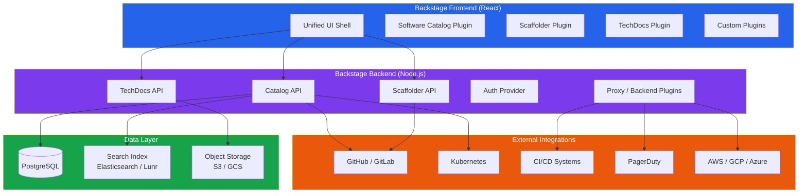
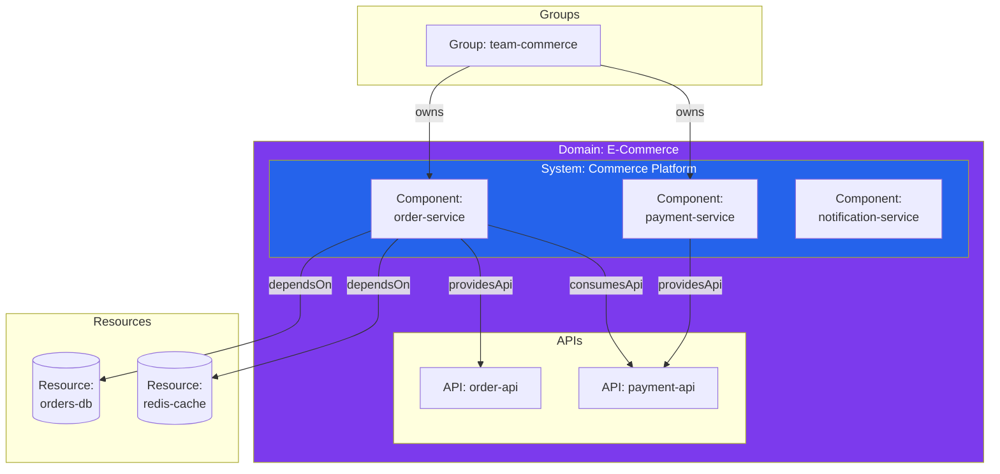
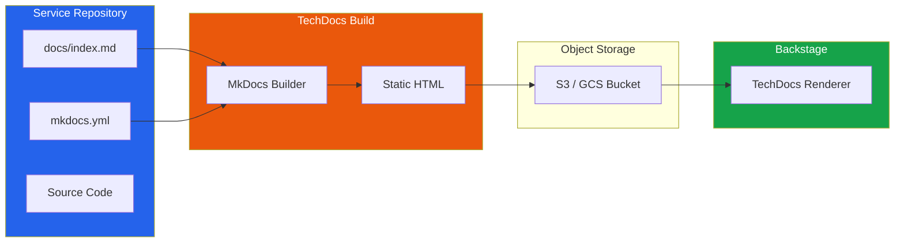
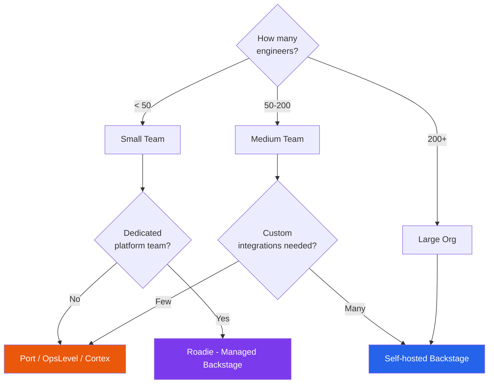

# Backstage & Developer Portals

Backstage is an open-source framework for building developer portals, originally created by Spotify and donated to the Cloud Native Computing Foundation (CNCF). It provides a single pane of glass for developers to discover services, create new projects from templates, read documentation, and integrate with any internal tool through its plugin architecture.

Before Backstage, Spotify had over 2,000 microservices and hundreds of engineering teams. Developers spent enormous time figuring out basic questions: Who owns this service? Where are its docs? What infrastructure does it use? Is it healthy? Backstage was built to centralize answers to all of these questions in one place.

The key insight behind Backstage is that a developer portal is not a dashboard — it is a product. It aggregates context from dozens of tools (GitHub, PagerDuty, Kubernetes, CI/CD, cloud provider) into a unified interface organized around the things developers actually care about: services, APIs, teams, and documentation.

## Backstage Architecture



## Core Component 1: Software Catalog

The Software Catalog is the heart of Backstage. It is a centralized registry of every software component in your organization — services, APIs, libraries, websites, data pipelines, ML models — along with their owners, dependencies, and lifecycle status.

### Catalog Entity Definition

Every component is described by a YAML file (typically `catalog-info.yaml`) stored in the component's Git repository:

```yaml
# catalog-info.yaml — placed in root of the service repo
apiVersion: backstage.io/v1alpha1
kind: Component
metadata:
  name: order-service
  description: "Handles order creation, fulfillment, and tracking"
  tags:
    - typescript
    - grpc
    - postgresql
  annotations:
    github.com/project-slug: myorg/order-service
    backstage.io/techdocs-ref: dir:.
    pagerduty.com/service-id: P1234ABC
    grafana/dashboard-selector: "service=order-service"
  links:
    - url: https://grafana.internal/d/order-service
      title: Grafana Dashboard
    - url: https://runbooks.internal/order-service
      title: Runbook
spec:
  type: service
  lifecycle: production
  owner: team-commerce
  system: commerce-platform
  dependsOn:
    - component:payment-service
    - resource:orders-database
    - component:notification-service
  providesApis:
    - order-api
  consumesApis:
    - payment-api
    - inventory-api
```

### Entity Kinds

Backstage defines several built-in entity kinds:

| Kind | Purpose | Example |
|---|---|---|
| Component | A software component (service, library, website) | order-service, shared-ui-lib |
| API | An API exposed by a component | order-api (OpenAPI, gRPC, GraphQL) |
| Resource | Infrastructure resource | orders-database, redis-cache |
| System | A collection of related components | commerce-platform |
| Domain | A business domain grouping systems | e-commerce, payments |
| Group | A team or organizational unit | team-commerce |
| User | An individual person | jane.doe |
| Template | A scaffolding template | create-node-service |
| Location | A reference to external catalog data | github-org-discovery |

### Entity Relationships



### Catalog Discovery

Backstage can automatically discover entities from your GitHub or GitLab organization:

```yaml
# app-config.yaml — Backstage configuration
catalog:
  providers:
    github:
      myOrg:
        organization: 'my-company'
        catalogPath: '/catalog-info.yaml'
        filters:
          branch: 'main'
          repository: '.*'   # All repos
        schedule:
          frequency: { minutes: 30 }
          timeout: { minutes: 3 }

    # Discover Kubernetes workloads automatically
    kubernetes:
      myCluster:
        clusterLocatorMethods:
          - type: config
            clusters:
              - url: https://k8s.internal:6443
                name: production
                authProvider: serviceAccount
```

## Core Component 2: Software Templates (Scaffolder)

Templates allow developers to create new projects, services, or components from pre-configured blueprints — the golden paths of your platform.

### Template Definition

```yaml
# templates/create-node-service/template.yaml
apiVersion: scaffolder.backstage.io/v1beta3
kind: Template
metadata:
  name: create-node-service
  title: Create a Node.js Microservice
  description: |
    Scaffolds a production-ready Node.js service with TypeScript,
    Express, PostgreSQL, Docker, CI/CD, monitoring, and TechDocs.
  tags:
    - recommended
    - nodejs
    - typescript
spec:
  owner: team-platform
  type: service

  parameters:
    - title: Service Information
      required:
        - name
        - description
        - owner
      properties:
        name:
          title: Service Name
          type: string
          pattern: '^[a-z][a-z0-9-]*$'
          ui:autofocus: true
        description:
          title: Description
          type: string
        owner:
          title: Owner Team
          type: string
          ui:field: OwnerPicker
          ui:options:
            allowedKinds: [Group]

    - title: Infrastructure
      properties:
        database:
          title: Database
          type: string
          enum: [none, postgresql, mysql]
          default: postgresql
        cache:
          title: Cache
          type: string
          enum: [none, redis, memcached]
          default: none
        queue:
          title: Message Queue
          type: string
          enum: [none, rabbitmq, sqs]
          default: none

  steps:
    # Step 1: Generate code from cookiecutter template
    - id: fetch-template
      name: Fetch Template
      action: fetch:template
      input:
        url: ./skeleton
        values:
          name: ${​{ parameters.name }}
          description: ${​{ parameters.description }}
          owner: ${​{ parameters.owner }}
          database: ${​{ parameters.database }}

    # Step 2: Create GitHub repository
    - id: publish
      name: Create Repository
      action: publish:github
      input:
        repoUrl: github.com?owner=my-company&repo=${​{ parameters.name }}
        description: ${​{ parameters.description }}
        defaultBranch: main
        protectDefaultBranch: true
        repoVisibility: internal

    # Step 3: Register in Backstage catalog
    - id: register
      name: Register Component
      action: catalog:register
      input:
        repoContentsUrl: ${​{ steps['publish'].output.repoContentsUrl }}
        catalogInfoPath: /catalog-info.yaml

    # Step 4: Provision infrastructure
    - id: provision-infra
      name: Provision Infrastructure
      action: http:backstage:request
      input:
        method: POST
        path: /api/platform/provision
        body:
          service: ${​{ parameters.name }}
          database: ${​{ parameters.database }}
          cache: ${​{ parameters.cache }}

  output:
    links:
      - title: Repository
        url: ${​{ steps['publish'].output.remoteUrl }}
      - title: Open in Backstage
        icon: catalog
        entityRef: ${​{ steps['register'].output.entityRef }}
```

::: tip Template Best Practices
1. Keep templates opinionated — they encode your golden path, not every possible configuration.
2. Include everything a service needs from day one: Dockerfile, CI/CD config, monitoring, TechDocs scaffold.
3. Test templates in CI — a broken template blocks all new service creation.
4. Version templates — breaking changes should not affect existing services.
:::

## Core Component 3: TechDocs

TechDocs is Backstage's built-in documentation system. It renders Markdown documentation stored alongside the code (docs-as-code) directly in the Backstage UI.

### How TechDocs Works



```yaml
# mkdocs.yml — in the service repository root
site_name: Order Service
nav:
  - Home: index.md
  - Architecture: architecture.md
  - API Reference: api.md
  - Runbook: runbook.md
  - ADRs:
    - adr/001-database-choice.md
    - adr/002-event-schema.md

plugins:
  - techdocs-core
```

### TechDocs Configuration

```yaml
# app-config.yaml
techdocs:
  builder: 'external'  # CI/CD builds docs, not Backstage
  generator:
    runIn: 'local'
  publisher:
    type: 'awsS3'
    awsS3:
      bucketName: 'my-company-techdocs'
      region: 'us-east-1'
```

## Plugin Architecture

Backstage's power comes from its plugin system. Over 200 community plugins exist, and you can build custom plugins for any internal tool.

### Popular Plugins

| Plugin | What It Does |
|---|---|
| Kubernetes | Show pod status, deployments, logs for each service |
| GitHub Actions | Display CI/CD pipeline status and history |
| PagerDuty | Show on-call schedule, incidents for each service |
| SonarQube | Code quality metrics and security findings |
| Grafana | Embed dashboards for each service |
| Cost Insights | Show cloud cost per team and service |
| API Docs | Render OpenAPI, AsyncAPI, GraphQL schemas |
| Tech Radar | Interactive technology radar for your organization |
| TODO | Surface TODO comments from codebases |
| Lighthouse | Web performance audits |

### Building a Custom Plugin

```typescript
// plugins/my-plugin/src/plugin.ts
import {
  createPlugin,
  createRoutableExtension,
} from '@backstage/core-plugin-api';

export const myPlugin = createPlugin({
  id: 'my-custom-plugin',
  routes: {
    root: rootRouteRef,
  },
});

export const MyPluginPage = myPlugin.provide(
  createRoutableExtension({
    name: 'MyPluginPage',
    component: () =>
      import('./components/MyPluginPage').then(m => m.MyPluginPage),
    mountPoint: rootRouteRef,
  }),
);
```

```typescript
// plugins/my-plugin/src/components/MyPluginPage.tsx
import React from 'react';
import { useEntity } from '@backstage/plugin-catalog-react';
import {
  InfoCard,
  Table,
  StatusOK,
  StatusError,
} from '@backstage/core-components';

export const MyPluginPage = () => {
  const { entity } = useEntity();
  const serviceName = entity.metadata.name;

  // Fetch data from your internal API
  const { data, loading } = useServiceHealth(serviceName);

  return (
    <InfoCard title="Service Health">
      <Table
        columns={[
          { title: 'Check', field: 'name' },
          { title: 'Status', field: 'status',
            render: row => row.healthy ? <StatusOK /> : <StatusError /> },
          { title: 'Last Checked', field: 'lastChecked' },
        ]}
        data={data?.checks || []}
        isLoading={loading}
      />
    </InfoCard>
  );
};
```

## Alternative Developer Portals

Backstage is the most popular option, but it is not the only one. Consider alternatives based on your team's needs:

| Portal | Type | Best For | Key Differentiator |
|---|---|---|---|
| **Backstage** | Open source (CNCF) | Large orgs with platform teams | Maximum flexibility, plugin ecosystem |
| **Port** | Commercial | Teams wanting quick setup | No-code portal builder, scorecards |
| **Cortex** | Commercial | Engineering maturity focus | Service scorecards, reliability metrics |
| **OpsLevel** | Commercial | Service ownership clarity | Maturity rubrics, check-based approach |
| **Roadie** | Managed Backstage | Teams that want Backstage without ops | Hosted Backstage with managed plugins |
| **Configure8** | Commercial | Cloud-native visibility | Auto-discovery, cost tracking |

### Decision Framework



::: warning Backstage Operational Cost
Backstage is free to use, but it is not free to run. Self-hosting Backstage requires a dedicated team to maintain it, write plugins, manage upgrades, and handle incidents. For small teams, this overhead may outweigh the benefits. Consider managed alternatives like Roadie or commercial portals.
:::

## Backstage Deployment

### Production Setup

```yaml
# docker-compose.yml for Backstage
version: '3.8'
services:
  backstage:
    image: my-company/backstage:latest
    ports:
      - "7007:7007"
    environment:
      - POSTGRES_HOST=db
      - POSTGRES_PORT=5432
      - POSTGRES_USER=backstage
      - POSTGRES_PASSWORD=${DB_PASSWORD}
      - GITHUB_TOKEN=${GITHUB_TOKEN}
      - AUTH_GITHUB_CLIENT_ID=${GH_CLIENT_ID}
      - AUTH_GITHUB_CLIENT_SECRET=${GH_CLIENT_SECRET}
    depends_on:
      - db

  db:
    image: postgres:16
    environment:
      POSTGRES_USER: backstage
      POSTGRES_PASSWORD: ${DB_PASSWORD}
      POSTGRES_DB: backstage
    volumes:
      - pgdata:/var/lib/postgresql/data

volumes:
  pgdata:
```

### Kubernetes Deployment

```yaml
apiVersion: apps/v1
kind: Deployment
metadata:
  name: backstage
  namespace: platform
spec:
  replicas: 2
  selector:
    matchLabels:
      app: backstage
  template:
    metadata:
      labels:
        app: backstage
    spec:
      containers:
        - name: backstage
          image: my-company/backstage:latest
          ports:
            - containerPort: 7007
          resources:
            requests:
              cpu: "500m"
              memory: "1Gi"
            limits:
              cpu: "2000m"
              memory: "4Gi"
          envFrom:
            - secretRef:
                name: backstage-secrets
          readinessProbe:
            httpGet:
              path: /healthcheck
              port: 7007
            initialDelaySeconds: 30
            periodSeconds: 10
```

## Measuring Portal Adoption

Track these metrics to know if your developer portal is providing value:

| Metric | How to Measure | Good Target |
|---|---|---|
| Catalog completeness | % of services with catalog-info.yaml | >95% |
| Daily active users | Unique Backstage logins per day | >50% of eng org |
| Templates used | New services created via templates per month | Increasing trend |
| TechDocs coverage | % of services with docs | >80% |
| Search usage | Searches per day in Backstage | Increasing trend |
| Time to find owner | How long to find "who owns this?" | <30 seconds |
| Plugins active | Number of actively used plugins | Growing with needs |

## Further Reading

- [Platform Engineering Overview](/infrastructure/platform-engineering/) — Why platforms matter and how to build one
- [Developer Experience](/infrastructure/platform-engineering/developer-experience) — Measuring and improving DX
- [CI/CD Pipelines](/infrastructure/ci-cd/) — Build and deployment automation
- [Kubernetes](/infrastructure/kubernetes/) — Container orchestration for platform infrastructure
- Backstage official documentation (backstage.io)
- CNCF Backstage project page
- "Building Developer Portals with Backstage" by Himanshu Mishra (O'Reilly)
