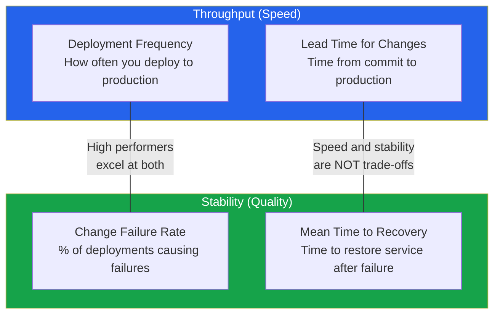
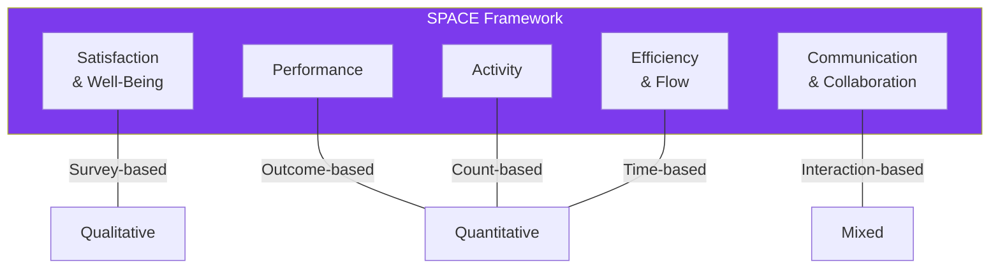
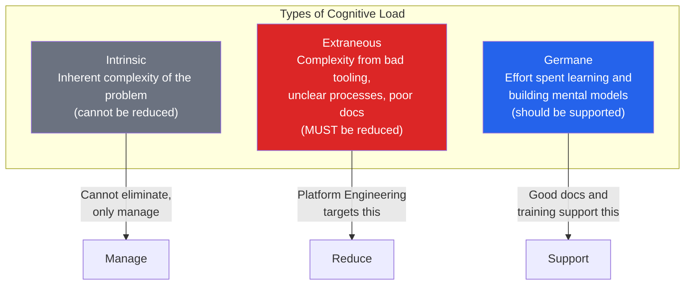
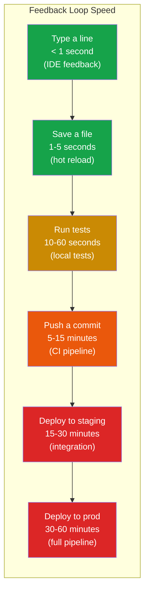
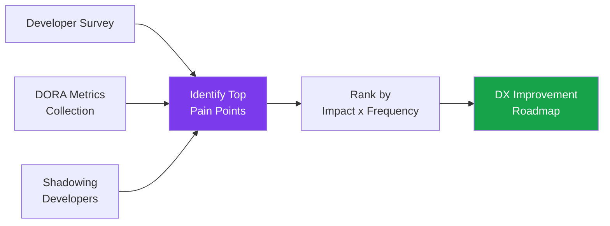

# Developer Experience (DX)

Developer Experience is the sum of all interactions a developer has with the tools, processes, systems, and culture of their engineering organization. It encompasses everything from how long it takes to set up a development environment to how quickly feedback arrives after pushing a commit to how easy it is to find documentation for an internal service.

DX matters because it directly impacts three things organizations care about: **velocity** (how fast teams ship), **quality** (how reliably they ship), and **retention** (whether engineers stay). Research consistently shows that teams with better developer experience ship 2-4x faster with fewer defects and significantly lower attrition.

The most dangerous trap is treating DX as an aesthetic concern — nicer tooling, prettier dashboards. Real DX improvement is structural. It is about removing friction from the critical path of software delivery, reducing cognitive load, and building fast feedback loops.

## DORA Metrics

The DORA (DevOps Research and Assessment) research program, originally led by Dr. Nicole Forsgren, identified four key metrics that reliably predict software delivery performance. These metrics have been validated across thousands of organizations over nearly a decade.

### The Four DORA Metrics



| Metric | Elite | High | Medium | Low |
|---|---|---|---|---|
| **Deployment Frequency** | On-demand (multiple/day) | Weekly to monthly | Monthly to 6 months | Fewer than once per 6 months |
| **Lead Time for Changes** | Less than 1 hour | 1 day to 1 week | 1 week to 1 month | 1 to 6 months |
| **Mean Time to Recovery** | Less than 1 hour | Less than 1 day | 1 day to 1 week | More than 6 months |
| **Change Failure Rate** | 0-15% | 16-30% | 16-30% | 16-30% |

::: tip The Critical Insight
DORA research proves that speed and stability are **not** trade-offs. Elite performers are faster AND more stable. They deploy more frequently AND break things less often. The mechanism is simple: small, frequent deployments are easier to test, easier to review, and easier to roll back.
:::

### Measuring DORA Metrics

```typescript
// Automated DORA metrics collection from CI/CD events

interface DeploymentEvent {
  service: string;
  team: string;
  commitSha: string;
  commitTimestamp: Date;
  deployTimestamp: Date;
  environment: 'staging' | 'production';
  success: boolean;
}

interface IncidentEvent {
  service: string;
  team: string;
  startedAt: Date;
  resolvedAt: Date;
  causedByDeployment?: string;
}

class DORAMetrics {
  // Deployment Frequency: deployments per day per service
  async deploymentFrequency(
    team: string,
    days: number = 30
  ): Promise<number> {
    const deploys = await db.query(`
      SELECT COUNT(*) as count
      FROM deployments
      WHERE team = $1
        AND environment = 'production'
        AND deploy_timestamp > now() - interval '${days} days'
    `, [team]);

    return deploys.rows[0].count / days;
  }

  // Lead Time: median time from commit to production deploy
  async leadTimeForChanges(
    team: string,
    days: number = 30
  ): Promise<number> {
    const result = await db.query(`
      SELECT
        percentile_cont(0.5) WITHIN GROUP (
          ORDER BY EXTRACT(EPOCH FROM
            (deploy_timestamp - commit_timestamp))
        ) AS median_lead_time_seconds
      FROM deployments
      WHERE team = $1
        AND environment = 'production'
        AND deploy_timestamp > now() - interval '${days} days'
    `, [team]);

    return result.rows[0].median_lead_time_seconds;
  }

  // Change Failure Rate: % of deploys that cause incidents
  async changeFailureRate(
    team: string,
    days: number = 30
  ): Promise<number> {
    const result = await db.query(`
      SELECT
        COUNT(CASE WHEN i.id IS NOT NULL THEN 1 END)::float
        / NULLIF(COUNT(d.id), 0) AS failure_rate
      FROM deployments d
      LEFT JOIN incidents i ON i.caused_by_deployment = d.id
      WHERE d.team = $1
        AND d.environment = 'production'
        AND d.deploy_timestamp > now() - interval '${days} days'
    `, [team]);

    return result.rows[0].failure_rate || 0;
  }

  // MTTR: median time from incident start to resolution
  async meanTimeToRecovery(
    team: string,
    days: number = 90
  ): Promise<number> {
    const result = await db.query(`
      SELECT
        percentile_cont(0.5) WITHIN GROUP (
          ORDER BY EXTRACT(EPOCH FROM
            (resolved_at - started_at))
        ) AS median_mttr_seconds
      FROM incidents
      WHERE team = $1
        AND resolved_at IS NOT NULL
        AND started_at > now() - interval '${days} days'
    `, [team]);

    return result.rows[0].median_mttr_seconds;
  }
}
```

### DORA Metrics Dashboard

```sql
-- Team-level DORA summary query
WITH team_deploys AS (
    SELECT
        team,
        COUNT(*) AS deploy_count,
        COUNT(*) / 30.0 AS deploys_per_day,
        percentile_cont(0.5) WITHIN GROUP (
            ORDER BY EXTRACT(EPOCH FROM (deploy_timestamp - commit_timestamp))
        ) / 3600.0 AS median_lead_time_hours
    FROM deployments
    WHERE environment = 'production'
      AND deploy_timestamp > now() - interval '30 days'
    GROUP BY team
),
team_failures AS (
    SELECT
        d.team,
        COUNT(CASE WHEN i.id IS NOT NULL THEN 1 END)::float
            / NULLIF(COUNT(d.id), 0) AS change_failure_rate
    FROM deployments d
    LEFT JOIN incidents i ON i.caused_by_deployment = d.id
    WHERE d.environment = 'production'
      AND d.deploy_timestamp > now() - interval '30 days'
    GROUP BY d.team
),
team_recovery AS (
    SELECT
        team,
        percentile_cont(0.5) WITHIN GROUP (
            ORDER BY EXTRACT(EPOCH FROM (resolved_at - started_at))
        ) / 3600.0 AS median_mttr_hours
    FROM incidents
    WHERE resolved_at IS NOT NULL
      AND started_at > now() - interval '90 days'
    GROUP BY team
)
SELECT
    d.team,
    d.deploys_per_day,
    d.median_lead_time_hours,
    f.change_failure_rate,
    r.median_mttr_hours,
    CASE
        WHEN d.deploys_per_day >= 1 AND d.median_lead_time_hours < 1
             AND f.change_failure_rate < 0.15 AND r.median_mttr_hours < 1
        THEN 'Elite'
        WHEN d.deploys_per_day >= 0.14 AND d.median_lead_time_hours < 168
        THEN 'High'
        WHEN d.deploys_per_day >= 0.033
        THEN 'Medium'
        ELSE 'Low'
    END AS performance_level
FROM team_deploys d
JOIN team_failures f ON f.team = d.team
LEFT JOIN team_recovery r ON r.team = d.team
ORDER BY d.deploys_per_day DESC;
```

## SPACE Framework

While DORA measures delivery performance, the SPACE framework (developed by researchers at GitHub, Microsoft, and the University of Victoria) provides a more holistic view of developer productivity.

SPACE stands for five dimensions that together capture the full picture:

| Dimension | What It Measures | Example Metrics |
|---|---|---|
| **S**atisfaction & Well-Being | How developers feel about their work | Developer satisfaction survey, burnout index |
| **P**erformance | Outcomes of the development process | Code quality, reliability, customer impact |
| **A**ctivity | Count of developer actions | PRs merged, commits, reviews completed |
| **C**ommunication & Collaboration | How well teams work together | Review turnaround time, knowledge sharing |
| **E**fficiency & Flow | How smoothly work progresses | Uninterrupted time, build wait times, handoff delays |



::: warning Never Use Activity Metrics Alone
Measuring commits per day, PRs per week, or lines of code written rewards busywork. Activity metrics only make sense in combination with performance and satisfaction metrics. A developer who writes 10 high-quality PRs per month may be far more productive than one who writes 40 trivial ones.
:::

### Practical SPACE Metrics

```typescript
interface SPACEMetrics {
  satisfaction: {
    developerNPS: number;         // -100 to +100
    toolSatisfaction: number;     // 1-5 scale
    burnoutRisk: 'low' | 'medium' | 'high';
  };
  performance: {
    deploymentFrequency: number;  // deploys per day
    changeFailureRate: number;    // 0 to 1
    customerImpactScore: number;  // custom metric
  };
  activity: {
    prsOpened: number;
    prsReviewed: number;
    prsMerged: number;
    incidentsResolved: number;
  };
  communication: {
    medianReviewTurnaround: number;  // hours
    crossTeamCollaborations: number;
    documentationContributions: number;
  };
  efficiency: {
    buildWaitTime: number;           // minutes
    ciCdPipelineDuration: number;    // minutes
    environmentSetupTime: number;    // minutes
    deepWorkHoursPerDay: number;     // hours
  };
}
```

## Dev Containers & Cloud Development Environments

One of the highest-impact DX improvements is eliminating the "works on my machine" problem. Dev containers provide reproducible, pre-configured development environments that work identically for every developer.

### Dev Containers (VS Code / Open Standard)

```json
// .devcontainer/devcontainer.json
{
  "name": "Order Service Dev Environment",
  "image": "mcr.microsoft.com/devcontainers/typescript-node:20",

  "features": {
    "ghcr.io/devcontainers/features/docker-in-docker:2": {},
    "ghcr.io/devcontainers/features/kubectl-helm-minikube:1": {},
    "ghcr.io/devcontainers/features/aws-cli:1": {}
  },

  "forwardPorts": [3000, 5432, 6379],

  "postCreateCommand": "npm install && npm run db:migrate",

  "customizations": {
    "vscode": {
      "extensions": [
        "dbaeumer.vscode-eslint",
        "esbenp.prettier-vscode",
        "ms-azuretools.vscode-docker",
        "prisma.prisma"
      ],
      "settings": {
        "editor.formatOnSave": true,
        "editor.defaultFormatter": "esbenp.prettier-vscode"
      }
    }
  },

  "containerEnv": {
    "DATABASE_URL": "postgresql://dev:dev@db:5432/orderservice",
    "REDIS_URL": "redis://cache:6379",
    "NODE_ENV": "development"
  }
}
```

```yaml
# .devcontainer/docker-compose.yml
version: '3.8'
services:
  app:
    build:
      context: .
      dockerfile: Dockerfile
    volumes:
      - ..:/workspace:cached
    command: sleep infinity
    depends_on:
      - db
      - cache

  db:
    image: postgres:16
    environment:
      POSTGRES_USER: dev
      POSTGRES_PASSWORD: dev
      POSTGRES_DB: orderservice
    volumes:
      - pgdata:/var/lib/postgresql/data

  cache:
    image: redis:7-alpine

volumes:
  pgdata:
```

### Cloud Development Environments

| Tool | Provider | Best For |
|---|---|---|
| **GitHub Codespaces** | GitHub | Teams already on GitHub, fast spin-up |
| **Gitpod** | Open source / cloud | Multi-repo workspaces, open-source projects |
| **AWS Cloud9** | AWS | AWS-integrated development |
| **Google Cloud Workstations** | GCP | GCP-integrated development |
| **Coder** | Self-hosted | Organizations that need on-premise cloud dev |
| **DevPod** | Open source | Tool-agnostic, works with any provider |

::: tip When Cloud Dev Environments Shine
Cloud dev environments provide the most value when: (1) your project requires large dependencies or complex setup, (2) you have many contributors (open source), (3) security requires that source code not live on developer laptops, or (4) onboarding time for new developers exceeds 1 day.
:::

## Reducing Cognitive Load

Cognitive load — the total mental effort required to accomplish a task — is the silent killer of developer productivity. Every unnecessary decision, every undocumented process, every tool that requires memorizing obscure flags adds cognitive load.

### Types of Cognitive Load for Developers



### Strategies to Reduce Extraneous Cognitive Load

| Strategy | Before | After |
|---|---|---|
| Golden path templates | "How do I set up a new service?" | `platform new service --type api` |
| Automated environment setup | 2-day setup guide with 40 steps | `devcontainer open` |
| Standardized CI/CD | Each team's custom pipeline | Shared pipeline with team config |
| Centralized docs | "Ask Steve, he knows" | Search in [Backstage](/infrastructure/platform-engineering/backstage) |
| Consistent naming | `svc-order`, `OrderSvc`, `order-service` | `{team}-{service}-{env}` convention |
| Error message improvement | `Error: ECONNREFUSED` | `Error: Cannot connect to orders-db. Is it running? Try: docker compose up db` |

### Fast Feedback Loops

The speed of the feedback loop determines how productively a developer can work. Every additional second of wait time between making a change and seeing the result breaks flow state.



Optimizing each loop:

```typescript
// package.json — optimize local feedback loops
{
  "scripts": {
    // Hot reload in < 1 second
    "dev": "tsx watch src/index.ts",

    // Run only affected tests (< 10 seconds)
    "test:watch": "vitest --watch --reporter=dot",

    // Type checking as you save
    "typecheck:watch": "tsc --noEmit --watch --preserveWatchOutput",

    // Lint only changed files (< 5 seconds)
    "lint:staged": "lint-staged"
  },
  "lint-staged": {
    "*.{ts,tsx}": ["eslint --fix", "prettier --write"],
    "*.{json,md,yml}": ["prettier --write"]
  }
}
```

## Developer Experience Metrics to Track

### Quantitative Metrics

| Metric | How to Measure | Good Target |
|---|---|---|
| Onboarding time | Time from first day to first production deploy | < 1 week |
| Environment setup time | Time from `git clone` to running locally | < 30 minutes |
| Build time (local) | Time to compile/build the project | < 30 seconds |
| CI pipeline duration | Time from push to green/red result | < 10 minutes |
| Time to first review | Time from PR opened to first reviewer comment | < 4 hours |
| PR merge time | Time from PR opened to merged | < 1 day |
| Deploy frequency | Production deployments per developer per week | > 2 |
| Incident resolution time | Median time to resolve developer-affecting incidents | < 4 hours |

### Qualitative Metrics (Survey-Based)

Run a quarterly developer experience survey:

```yaml
# Developer Experience Survey Template
questions:
  - category: "Tools & Infrastructure"
    items:
      - "I can set up a local development environment quickly"
      - "Our CI/CD pipeline is fast and reliable"
      - "I can easily find documentation for internal services"
      - "Our monitoring/observability tools help me debug issues"

  - category: "Process & Workflow"
    items:
      - "I can deploy my changes to production with confidence"
      - "Code reviews happen quickly and are constructive"
      - "I understand our team's priorities and goals"
      - "Meetings do not prevent me from having focused coding time"

  - category: "Architecture & Code"
    items:
      - "Our codebase is well-structured and maintainable"
      - "I can understand services I did not write"
      - "Testing is easy and I trust our test suite"
      - "I can make changes without fear of breaking unrelated things"

  - category: "Overall"
    items:
      - "I would recommend our engineering tools to other companies"
      - "On a scale of 1-10, how productive do you feel day-to-day?"
      - "What is the single biggest thing slowing you down?"

# Scale: 1 (Strongly Disagree) to 5 (Strongly Agree)
# Track trends over quarters, not absolute numbers
```

## DX Improvement Playbook

A structured approach to improving developer experience:

### Step 1: Measure Current State



### Step 2: Prioritize by Impact

Use a 2x2 matrix:

| | High Frequency | Low Frequency |
|---|---|---|
| **High Pain** | Fix immediately (slow CI, broken dev env) | Fix this quarter (complex deployment process) |
| **Low Pain** | Automate away (repetitive but minor tasks) | Backlog (nice-to-have improvements) |

### Step 3: Implement and Measure

Track the before/after of every DX initiative:

```typescript
// Track DX improvement impact
interface DXInitiative {
  name: string;
  category: 'tooling' | 'process' | 'documentation' | 'automation';
  before: {
    timeSpent: string;   // "2 hours per developer per week"
    satisfaction: number; // 1-5 scale
    description: string;
  };
  after: {
    timeSpent: string;
    satisfaction: number;
    description: string;
  };
  impact: {
    developersAffected: number;
    weeklyTimeSaved: string;
    annualizedValue: string; // developer hours saved * loaded cost
  };
}

// Example
const ciSpeedUp: DXInitiative = {
  name: 'CI Pipeline Optimization',
  category: 'tooling',
  before: {
    timeSpent: '45 min average pipeline',
    satisfaction: 2.1,
    description: 'Developers context-switch while waiting for CI',
  },
  after: {
    timeSpent: '8 min average pipeline',
    satisfaction: 4.3,
    description: 'Fast enough to wait for the result',
  },
  impact: {
    developersAffected: 85,
    weeklyTimeSaved: '3 hours per developer',
    annualizedValue: '13,260 developer-hours saved',
  },
};
```

## Common DX Anti-Patterns

::: danger DX Anti-Patterns to Avoid
1. **Optimizing for metrics, not experience** — A CI pipeline that reports 5 minutes but takes 20 minutes with queue time is not a 5-minute pipeline.
2. **Survey without action** — Running developer surveys and never acting on results destroys trust. Only survey if you will follow through.
3. **One-size-fits-all tooling** — Frontend teams and backend teams have different needs. Do not force identical workflows on everyone.
4. **Ignoring onboarding** — If new hires take 2 weeks to become productive, your DX has a systemic problem. Onboarding is the most honest test of your developer experience.
5. **Tool sprawl** — Adding a new tool for every problem without retiring old ones increases cognitive load. Sometimes the best DX improvement is removing a tool.
:::

## Further Reading

- [Platform Engineering Overview](/infrastructure/platform-engineering/) — Building the platform that powers great DX
- [Backstage & Developer Portals](/infrastructure/platform-engineering/backstage) — Centralizing the developer experience
- [CI/CD Pipelines](/infrastructure/ci-cd/) — Fast, reliable build and deploy pipelines
- [Observability](/infrastructure/observability/) — Debugging and monitoring for developers
- "Accelerate" by Nicole Forsgren, Jez Humble, and Gene Kim (the DORA research book)
- "A developer experience framework" — SPACE paper by Forsgren et al. (2021)
- "Team Topologies" by Matthew Skelton and Manuel Pais
- DX Core 4 metrics by Abi Noda (getdx.com research)
