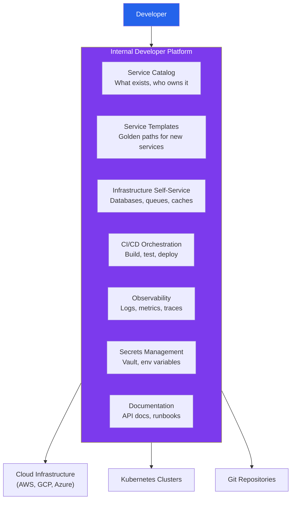
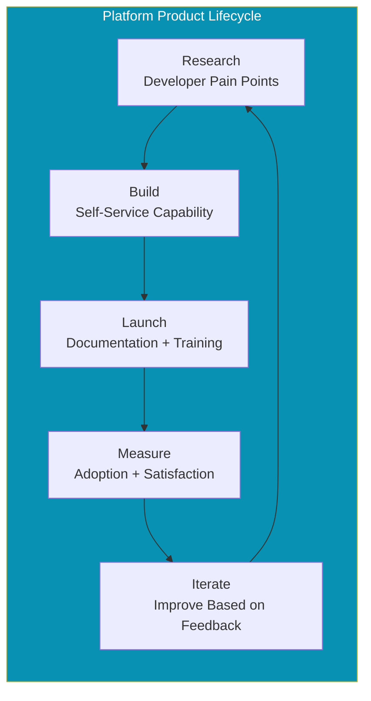
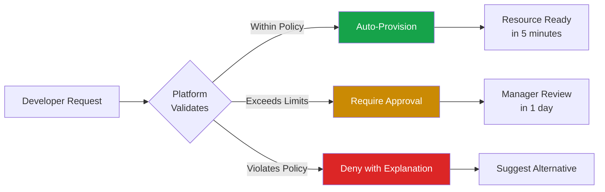
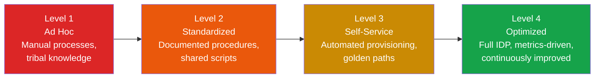

# Platform Engineering Overview

Platform engineering is the discipline of building and maintaining Internal Developer Platforms (IDPs) — self-service toolchains and workflows that enable software engineering teams to ship faster without waiting on operations teams. It is the evolution of DevOps: instead of expecting every developer to be an infrastructure expert, you build a platform team that abstracts away infrastructure complexity behind curated, self-service interfaces.

The core insight is simple. In most organizations, developers spend 30-40% of their time on infrastructure tasks — provisioning environments, configuring CI/CD, debugging deployments, managing secrets, setting up monitoring. Platform engineering reclaims that time by turning repetitive infrastructure work into self-service capabilities.

This is not about removing control from developers. It is about removing toil. A good platform gives developers the power to deploy a new service in 10 minutes without filing a ticket, while maintaining the guardrails (security, compliance, cost controls) that the organization requires.

## The Problem Platform Engineering Solves

Consider what happens when a developer at a typical company wants to deploy a new microservice:


The difference is not just speed. It is developer satisfaction, operational consistency, and organizational scalability. When every service is provisioned through the platform, every service gets the same security baselines, the same monitoring, the same deployment patterns.

## What Is an Internal Developer Platform (IDP)?

An IDP is not a single product. It is a curated set of tools, services, and workflows that together provide a self-service experience for developers. Think of it as an internal PaaS (Platform as a Service) tailored to your organization's specific needs.

### Core Capabilities of an IDP



| Capability | What It Provides | Example Tools |
|---|---|---|
| Service Catalog | Central registry of all services, owners, dependencies | [Backstage](/infrastructure/platform-engineering/backstage), Port, OpsLevel |
| Golden Path Templates | Pre-configured project scaffolds with best practices baked in | Cookiecutter, Yeoman, Backstage Templates |
| Infrastructure Provisioning | Self-service databases, caches, queues, storage | Terraform, Crossplane, Pulumi |
| CI/CD | Automated build, test, security scan, deploy pipelines | GitHub Actions, ArgoCD, Tekton |
| Observability | Logs, metrics, traces, dashboards, alerts | Grafana, Datadog, OpenTelemetry |
| Secrets Management | Secure storage and injection of credentials | Vault, AWS Secrets Manager, Doppler |
| Documentation | API references, runbooks, architecture docs | TechDocs, Swagger, Confluence |
| Cost Management | Per-team and per-service cloud cost visibility | Kubecost, Infracost, CloudHealth |

## Platform as a Product

The most important mindset shift in platform engineering is treating the platform as a product, not a project. Your internal developers are your customers. The platform team builds features, gathers feedback, iterates, and measures adoption — just like a product team building a SaaS product.

### Product Thinking Applied to Platforms



| Product Principle | Platform Application |
|---|---|
| Know your customer | Interview developers about their biggest pain points |
| Minimum viable product | Start with one golden path, not ten |
| Measure adoption | Track how many teams use each platform capability |
| Self-service over tickets | If a developer has to ask someone, the platform failed |
| Documentation is part of the product | Undocumented capabilities do not exist |
| Backwards compatibility | Breaking changes erode trust |

::: tip Start With the Most Painful Problem
Do not try to build a complete IDP from day one. Find the single most painful infrastructure task your developers face — environment provisioning? secret management? CI/CD setup? — and solve that first. Then expand.
:::

## The Platform Team

### Team Structure

A platform team is a dedicated engineering team responsible for building and maintaining the IDP. It is not the old ops team with a new name. Platform engineers write code, build products, and ship features — they just happen to build for internal developers instead of external customers.

| Role | Responsibility |
|---|---|
| Platform Product Manager | Prioritize capabilities based on developer needs |
| Platform Engineers | Build and maintain platform services and tooling |
| Site Reliability Engineers (SRE) | Ensure platform reliability, define SLOs |
| Developer Advocates (optional) | Drive adoption, write docs, run workshops |

### Team Size Guidelines

| Organization Size | Platform Team Size | Focus |
|---|---|---|
| 20-50 engineers | 1-2 platform engineers | Automate the top 3 pain points |
| 50-200 engineers | 3-6 platform engineers | Build a basic IDP with golden paths |
| 200-1000 engineers | 6-15 platform engineers | Full IDP with self-service catalog |
| 1000+ engineers | 15+ (often multiple teams) | Dedicated teams per platform domain |

## Self-Service Infrastructure

The defining feature of a good platform is self-service. Developers should be able to provision the resources they need without filing tickets or waiting for approvals (within predefined guardrails).

### Example: Self-Service Database Provisioning

```yaml
# developer-facing interface: platform.yaml in their repo
apiVersion: platform.company.io/v1
kind: ServiceResources
metadata:
  name: order-service
  team: commerce
spec:
  database:
    engine: postgresql
    version: "16"
    size: small       # small | medium | large | xlarge
    highAvailability: true
    backup:
      enabled: true
      retentionDays: 30

  cache:
    engine: redis
    version: "7"
    size: small
    evictionPolicy: allkeys-lru

  queue:
    engine: rabbitmq
    vhost: order-events
```

```typescript
// Platform controller processes the resource request
import * as pulumi from '@pulumi/pulumi';
import * as aws from '@pulumi/aws';

const SIZE_MAP = {
  small:  'db.t3.medium',
  medium: 'db.r6g.large',
  large:  'db.r6g.xlarge',
  xlarge: 'db.r6g.2xlarge',
};

export function provisionDatabase(config: DatabaseConfig) {
  const instance = new aws.rds.Instance(`${config.serviceName}-db`, {
    engine: 'postgres',
    engineVersion: config.version,
    instanceClass: SIZE_MAP[config.size],
    allocatedStorage: 100,
    multiAz: config.highAvailability,
    backupRetentionPeriod: config.backup?.retentionDays || 7,

    // Platform guardrails — developers can't override these
    storageEncrypted: true,
    deletionProtection: true,
    performanceInsightsEnabled: true,

    tags: {
      Team: config.team,
      Service: config.serviceName,
      ManagedBy: 'platform',
    },
  });

  // Automatically inject connection string as a secret
  new aws.secretsmanager.Secret(`${config.serviceName}-db-url`, {
    name: `/${config.team}/${config.serviceName}/DATABASE_URL`,
  });

  return instance;
}
```

### Guardrails, Not Gates

The platform should enforce organizational standards without blocking developers:



Examples of guardrails:

- **Cost limits**: Any request under $500/month auto-approves. Above that, requires team lead sign-off.
- **Security baselines**: All databases must have encryption at rest. No public endpoints without authentication. All secrets in Vault.
- **Compliance constraints**: PII workloads must run in specific regions. Healthcare data requires HIPAA-compliant instances.
- **Naming conventions**: All resources follow `{team}-{service}-{resource}-{env}` naming.

## Golden Paths

A golden path is the organization's recommended, supported way to accomplish a common development task. It is not the only way — but it is the way that comes with full platform support, documentation, and guardrails.

### Example Golden Paths

| Task | Golden Path | What It Includes |
|---|---|---|
| Create a new API service | `platform new service --type api` | Repo scaffold, CI/CD, Dockerfile, Terraform, monitoring |
| Add a PostgreSQL database | `platform add database --engine postgres` | RDS provisioning, secret injection, backup config |
| Set up a cron job | `platform add cronjob --schedule "0 */6 * * *"` | Kubernetes CronJob, monitoring, alerting |
| Deploy to production | `git push` (PR merge to main) | CI/CD pipeline with tests, security scan, canary deploy |

::: warning Golden Paths Must Be Optional
If developers feel forced to use the platform, they will route around it. The golden path must be genuinely better (faster, more reliable, less effort) than the alternative. Adoption should be driven by value, not mandates.
:::

## Measuring Platform Success

How do you know your platform is working? Track these metrics:

### Platform Adoption Metrics

| Metric | What It Measures | Target |
|---|---|---|
| Services on platform | % of services using platform golden paths | >80% |
| Self-service ratio | % of infra requests handled without tickets | >90% |
| Time to first deploy | How long from "create service" to production | <30 minutes |
| Developer NPS | Developer satisfaction with the platform | >40 |
| Support ticket volume | Number of platform-related support requests | Decreasing trend |

### DORA Metrics Impact

Platform engineering directly improves [DORA metrics](/infrastructure/platform-engineering/developer-experience):

| DORA Metric | Without Platform | With Platform |
|---|---|---|
| Deployment Frequency | Weekly | Multiple per day |
| Lead Time for Changes | Days to weeks | Hours |
| Mean Time to Recovery | Hours | Minutes |
| Change Failure Rate | 15-30% | <5% |

## The Platform Maturity Model



| Level | Characteristics | Platform Team Focus |
|---|---|---|
| Level 1: Ad Hoc | No platform. Developers manage their own infra. Lots of tickets. | Identify pain points, build the case for a platform team. |
| Level 2: Standardized | Shared scripts and templates. Documented procedures. Some automation. | Create golden path templates, basic CI/CD standardization. |
| Level 3: Self-Service | Developers provision resources on demand. Service catalog exists. | Build IDP, integrate observability, enforce guardrails. |
| Level 4: Optimized | Full IDP with metrics. Continuously improved based on developer feedback. | Optimize developer experience, reduce cognitive load. |

## Common Anti-Patterns

::: danger Platform Engineering Anti-Patterns
1. **Building in isolation** — The platform team builds what they think is cool, not what developers actually need. Always start with user research.
2. **Mandatory adoption** — Forcing teams to use the platform breeds resentment. Make it so good they choose it.
3. **Too much abstraction** — Hiding too much complexity makes debugging impossible. Developers need escape hatches.
4. **No documentation** — If a platform capability is not documented, it does not exist for developers.
5. **One-size-fits-all** — Different teams have different needs. The platform should be configurable, not rigid.
6. **Treating it as a project** — Projects end. Platforms need continuous investment and maintenance.
:::

## Section Contents

| Page | What You'll Learn |
|---|---|
| [Backstage & Developer Portals](/infrastructure/platform-engineering/backstage) | Spotify's Backstage, software catalogs, templates, and plugins |
| [Developer Experience (DX)](/infrastructure/platform-engineering/developer-experience) | DORA metrics, SPACE framework, dev containers, and cognitive load |

## Further Reading

- [CI/CD Pipelines](/infrastructure/ci-cd/) — The deployment automation layer of your platform
- [Kubernetes](/infrastructure/kubernetes/) — Container orchestration that platforms are often built on
- [Terraform](/infrastructure/terraform/) — Infrastructure as Code foundations
- [Observability](/infrastructure/observability/) — Monitoring, logging, and tracing
- "Team Topologies" by Matthew Skelton and Manuel Pais
- "Platform Engineering on Kubernetes" by Mauricio Salatino
- CNCF Platforms Working Group reference architecture
