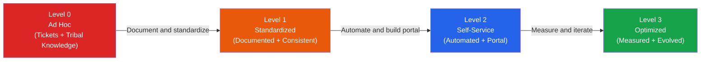
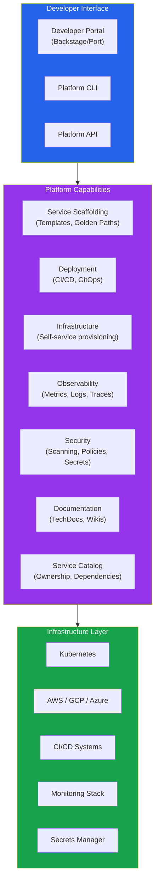
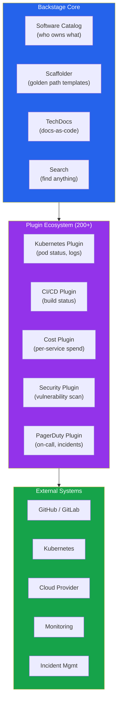
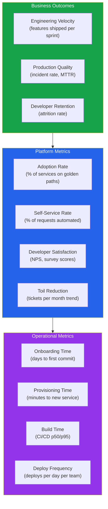
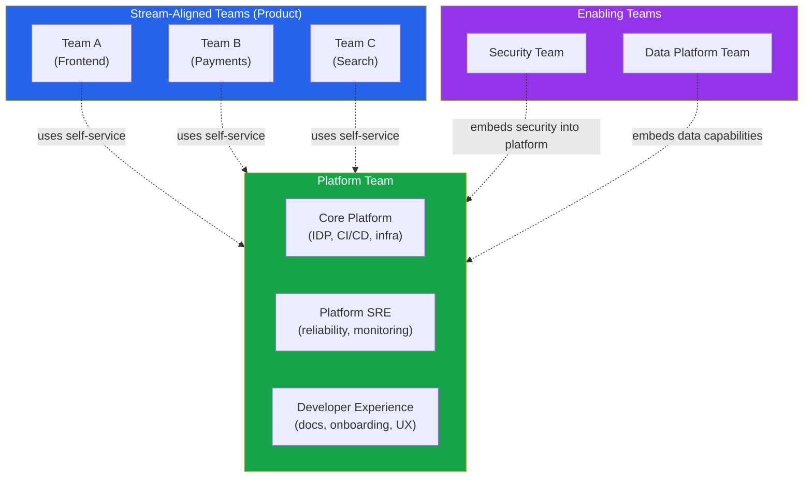
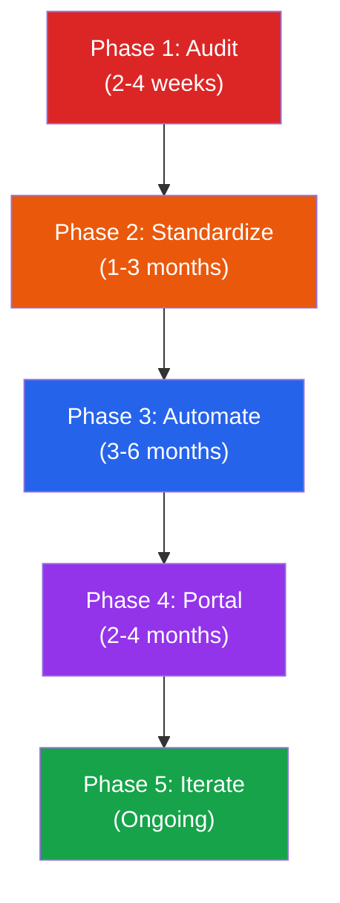

# Platform Engineering Maturity

Platform engineering is the discipline of building and maintaining an Internal Developer Platform (IDP) — a self-service layer that abstracts infrastructure complexity so product teams can deploy, operate, and observe their services without filing tickets or needing deep infrastructure expertise.

The concept is not new. Google had Borg, its internal platform, for over a decade before Kubernetes was born. Netflix built its own internal platform around 2012. What changed is that the rest of the industry now has the tools (Kubernetes, Backstage, Terraform, ArgoCD) and the organizational models (Team Topologies) to build IDPs without being a FAANG-scale company.

The central problem platform engineering solves is cognitive load. As organizations scale from 5 to 50 to 500 engineers, the number of tools, processes, and infrastructure decisions grows faster than any individual can track. Without a platform, every team reinvents the wheel: their own CI/CD pipeline, their own monitoring setup, their own deployment scripts. Platform engineering centralizes these capabilities into a product that internal developers consume.

This page defines a four-level maturity model, then covers each component of a mature IDP: golden paths, self-service infrastructure, Backstage, developer experience metrics, platform team structure, and migration strategies.

**Related**: [Backstage & Developer Portals](/infrastructure/platform-engineering/backstage) | [Developer Experience](/infrastructure/platform-engineering/developer-experience)

---

## The Platform Maturity Model



### Level 0 — Ad Hoc

**Characteristics:**
- Infrastructure is provisioned by filing Jira tickets to an ops team
- Deployment processes vary per team (some use shell scripts, some use CI/CD, some deploy manually)
- No service catalog — "who owns this service?" requires asking in Slack
- Monitoring and alerting are set up differently (or not at all) for each service
- New developers take 2-4 weeks to make their first commit
- Knowledge lives in people's heads, not in documentation

**Metrics (typical):**
| Metric | Typical Value |
|--------|--------------|
| Lead time for changes | 1-4 weeks |
| Deployment frequency | Monthly or less |
| Time to onboard new developer | 2-4 weeks |
| Time to provision new service | 1-2 weeks (ticket queue) |
| MTTR (Mean Time to Recovery) | Hours to days |

**How you know you are here:** Engineers spend more time fighting infrastructure than writing business logic. The answer to most "how do I..." questions is "ask Bob."

### Level 1 — Standardized

**Characteristics:**
- Standard CI/CD pipeline exists (all teams use the same basic structure)
- Infrastructure as Code (Terraform/Pulumi) for provisioning
- Documented runbooks for common operations
- Consistent monitoring stack (Prometheus + Grafana, Datadog, etc.)
- Service templates exist but are not enforced
- Some automation, but still requires infrastructure team involvement for many tasks

**What changes from Level 0:**
- Documented golden paths (even if not automated)
- Standard Dockerfile template, Helm chart structure
- Centralized logging and monitoring
- Shared CI/CD pipeline with per-repo configuration
- Service ownership tracked (even if in a spreadsheet)

### Level 2 — Self-Service

**Characteristics:**
- Internal Developer Portal (Backstage, Port, Cortex) provides a single pane of glass
- Creating a new service takes minutes, not weeks (scaffolding templates)
- Infrastructure provisioning is self-service (through platform API, not tickets)
- Golden paths are automated and enforced
- Developer documentation is discoverable through the portal
- Cost attribution per team/service is available
- Most common operations require zero interaction with the platform team

**What changes from Level 1:**
- Portal replaces documentation as the primary interface
- Templates replace manual setup
- Self-service replaces tickets for infrastructure
- Guardrails replace reviews for standards enforcement

### Level 3 — Optimized

**Characteristics:**
- DORA and SPACE metrics are tracked and used for continuous improvement
- Platform team operates as a product team (user research, backlog, roadmap)
- Developer satisfaction is measured regularly (quarterly surveys)
- Platform capabilities are continuously evolved based on data
- Cost optimization is automated (right-sizing, scale-to-zero)
- Security and compliance are built into the platform (shift-left)
- Migration to new standards is platform-assisted (automated codemods, migration tooling)

**What changes from Level 2:**
- Metrics drive decisions (not intuition)
- Platform has its own product management
- Continuous improvement loop is formalized
- Developer experience is quantified, not assumed

---

## Internal Developer Platforms (IDPs)

### What an IDP Actually Provides



### IDP vs PaaS

| Aspect | PaaS (Heroku, Railway) | IDP |
|--------|----------------------|-----|
| **Ownership** | Vendor-owned | Organization-owned |
| **Customization** | Limited to vendor's model | Fully customizable to your org |
| **Abstraction level** | Opaque (you cannot see the infrastructure) | Transparent (you can see and escape the abstraction) |
| **Lock-in** | High (vendor-specific APIs) | Low (built on open standards) |
| **Cost model** | Per-resource pricing | Infrastructure cost + platform team cost |
| **Escape hatch** | Migrate to different platform | Modify the platform itself |
| **Best for** | Small teams, startups, simple workloads | 50+ engineers, complex infrastructure, compliance requirements |

::: warning IDPs Are Products, Not Projects
The number one failure mode in platform engineering is building the IDP as a project (fixed scope, fixed timeline, handed off to maintenance mode) instead of as a product (ongoing user research, backlog prioritization, continuous iteration). A platform that stops evolving stops being used.
:::

---

## Golden Paths

Golden paths (sometimes called "paved roads") are opinionated, pre-built paths through your infrastructure that represent the recommended way to accomplish common tasks. They are not mandatory — teams can go off-path — but the golden path should be so good that going off-path feels like unnecessary effort.

### What Golden Paths Look Like

```
Golden Path: "Create a new backend service"

1. Developer opens Backstage → clicks "Create Component"
2. Selects "Backend Service (Go)" template
3. Fills in: service name, team, description, tier (critical/standard)
4. Platform automatically creates:
   ├── GitHub repo with standard structure
   │   ├── main.go (starter code with health check, metrics, tracing)
   │   ├── Dockerfile (multi-stage, distroless base)
   │   ├── helm/ (Helm chart with sane defaults)
   │   ├── .github/workflows/ (CI pipeline)
   │   ├── catalog-info.yaml (Backstage registration)
   │   └── docs/ (TechDocs skeleton)
   ├── Kubernetes namespace
   ├── ArgoCD Application (GitOps deploy)
   ├── Datadog monitors (golden signals)
   ├── PagerDuty service + escalation policy
   ├── Slack channel (#svc-<name>)
   └── Backstage catalog entry (owner, dependencies, docs)

Time: 3-5 minutes (vs 1-2 weeks without platform)
```

### Designing Effective Golden Paths

**Principles:**

1. **Opinionated but not mandatory**: The golden path works out of the box. Teams can customize or diverge, but they should not need to.

2. **Escape hatches at every layer**: If a team needs to customize the Helm chart, they can. If they need a non-standard database, they can request it. The platform does not lock people in.

3. **Incrementally adoptable**: Teams can adopt golden paths one component at a time. "Use our CI pipeline but keep your own Helm chart" is a valid intermediate state.

4. **Production-ready by default**: A service created from a golden path template should have monitoring, alerting, health checks, structured logging, and security scanning from day one.

### Golden Path Coverage Map

| Task | Golden Path (Mature) | Ad Hoc (Immature) |
|------|---------------------|-------------------|
| **Create new service** | Template in Backstage, 5 min | Clone old repo, customize manually, 1-2 weeks |
| **Add a database** | Self-service in portal, 10 min | Jira ticket to DBA team, 3-5 days |
| **Set up monitoring** | Automatic with template | Manual Grafana dashboard creation |
| **Deploy to production** | `git push` triggers GitOps pipeline | SSH into server, run deploy script |
| **Create a new environment** | Self-service, 15 min | Jira ticket to infra team, 1-2 weeks |
| **Onboard new developer** | Portal + docs, 1-2 days | Shadow senior engineer, 2-4 weeks |
| **Investigate production incident** | Portal shows service graph, logs, metrics | SSH into multiple servers, grep logs |

---

## Backstage Deep Dive

Backstage (covered in detail on the [Backstage & Developer Portals page](/infrastructure/platform-engineering/backstage)) is the most widely adopted open-source framework for building an IDP portal. Here we focus on how Backstage fits into platform maturity.

### Backstage as a Platform Maturity Accelerator



### Backstage Scaffolder Templates

Templates are the golden path automation engine in Backstage.

```yaml
# backstage-template.yaml — Create a new Go microservice
apiVersion: scaffolder.backstage.io/v1beta3
kind: Template
metadata:
  name: go-microservice
  title: Go Microservice
  description: Create a new Go microservice with CI/CD, monitoring, and docs
  tags: ['go', 'microservice', 'recommended']
spec:
  owner: platform-team
  type: service

  parameters:
    - title: Service Details
      required: ['name', 'description', 'owner']
      properties:
        name:
          title: Service Name
          type: string
          pattern: '^[a-z][a-z0-9-]{2,30}$'
          ui:help: 'Lowercase, hyphens only, 3-31 characters'
        description:
          title: Description
          type: string
          maxLength: 200
        owner:
          title: Owner Team
          type: string
          ui:field: OwnerPicker
          ui:options:
            catalogFilter:
              kind: Group
        tier:
          title: Service Tier
          type: string
          enum: ['critical', 'standard', 'experimental']
          default: 'standard'
          description: 'Critical = 99.99% SLO, Standard = 99.9%, Experimental = best-effort'

    - title: Infrastructure Options
      properties:
        database:
          title: Database
          type: string
          enum: ['none', 'postgresql', 'redis', 'both']
          default: 'none'
        cloudProvider:
          title: Cloud Provider
          type: string
          enum: ['aws', 'gcp']
          default: 'aws'

  steps:
    - id: fetch-template
      name: Fetch Template
      action: fetch:template
      input:
        url: ./template
        values:
          name: ${{ parameters.name }}
          description: ${{ parameters.description }}
          owner: ${{ parameters.owner }}
          tier: ${{ parameters.tier }}

    - id: create-repo
      name: Create GitHub Repository
      action: publish:github
      input:
        allowedHosts: ['github.com']
        repoUrl: 'github.com?owner=my-org&repo=${{ parameters.name }}'
        defaultBranch: main
        protectDefaultBranch: true
        requireCodeOwnerReviews: true

    - id: create-namespace
      name: Create Kubernetes Namespace
      action: kubernetes:create-namespace
      input:
        namespace: ${{ parameters.name }}
        labels:
          team: ${{ parameters.owner }}
          tier: ${{ parameters.tier }}

    - id: create-argocd-app
      name: Create ArgoCD Application
      action: argocd:create-application
      input:
        appName: ${{ parameters.name }}
        repoUrl: ${{ steps['create-repo'].output.repoUrl }}
        path: helm/
        destNamespace: ${{ parameters.name }}

    - id: create-monitors
      name: Create Monitoring
      action: datadog:create-monitors
      input:
        serviceName: ${{ parameters.name }}
        tier: ${{ parameters.tier }}
        owner: ${{ parameters.owner }}

    - id: register-catalog
      name: Register in Backstage Catalog
      action: catalog:register
      input:
        repoContentsUrl: ${{ steps['create-repo'].output.repoContentsUrl }}
        catalogInfoPath: '/catalog-info.yaml'

  output:
    links:
      - title: Repository
        url: ${{ steps['create-repo'].output.remoteUrl }}
      - title: Open in Backstage
        icon: catalog
        entityRef: ${{ steps['register-catalog'].output.entityRef }}
```

### Backstage Alternatives

| Tool | Type | Strengths | Limitations |
|------|------|-----------|-------------|
| **Backstage** (Spotify, CNCF) | Open-source framework | Massive plugin ecosystem, fully customizable | Requires dedicated team to build and maintain |
| **Port** | Commercial SaaS | No-code portal builder, fast setup | Less customizable than Backstage |
| **Cortex** | Commercial SaaS | Scorecards, service maturity tracking | Focused on catalog, less on scaffolding |
| **OpsLevel** | Commercial SaaS | Service ownership, maturity rubrics | Less extensible |
| **Kratix** | Open-source | Kubernetes-native platform API | Narrower scope (infrastructure only) |

---

## Developer Experience Metrics

Measuring platform success requires the right metrics. See the [Developer Experience page](/infrastructure/platform-engineering/developer-experience) for the full DORA and SPACE treatment. Here we focus on platform-specific metrics.

### The Three Layers of Platform Metrics



### DORA Metrics for Platform Teams

| DORA Metric | What It Means for Platform | Target (Elite) |
|-------------|---------------------------|-----------------|
| **Deployment Frequency** | How often product teams deploy (enabled by platform) | Multiple times per day per team |
| **Lead Time for Changes** | Commit to production (CI/CD pipeline speed) | Less than 1 hour |
| **Change Failure Rate** | % of deployments causing failures (platform guardrails) | 0-5% |
| **Mean Time to Recovery** | Incident detection to resolution (observability quality) | Less than 1 hour |

### SPACE Framework for Platform Teams

| Dimension | Example Metric | Measurement |
|-----------|---------------|-------------|
| **Satisfaction** | Developer NPS | Quarterly survey |
| **Performance** | Service creation time | Automated measurement |
| **Activity** | Templates used per month | Backstage analytics |
| **Communication** | Platform support tickets | Ticket system |
| **Efficiency** | % of self-service vs ticket requests | Ticket vs portal analytics |

### Developer Surveys

Surveys are the most direct way to measure developer experience. Run them quarterly.

**Key survey questions (scored 1-5):**

```
Infrastructure & Deployment:
1. "I can deploy my changes to production confidently and quickly."
2. "Creating a new service or environment is straightforward."
3. "I rarely need to file tickets for infrastructure tasks."

Observability & Debugging:
4. "When something breaks in production, I can find the root cause quickly."
5. "I have the monitoring and alerting I need for my services."

Documentation & Discovery:
6. "I can find documentation for internal tools and services easily."
7. "I know who owns a service and how to contact them."

Developer Tools:
8. "My local development environment works reliably."
9. "CI/CD pipelines are fast enough that they don't block my workflow."

Overall:
10. "The internal developer platform makes me more productive."

Free text:
11. "What is the biggest source of friction in your day-to-day work?"
12. "If you could change one thing about our developer tools, what would it be?"
```

::: tip Track Trends, Not Absolutes
The absolute score on developer satisfaction matters less than the trend. A score of 3.2 that improves to 3.5 quarter-over-quarter means the platform is getting better. A score of 4.0 that drops to 3.7 signals a problem. Always present metrics as trend lines, not snapshots.
:::

---

## Platform Team Structure

### Team Topologies for Platform Engineering

Team Topologies (by Matthew Skelton and Manuel Pais) provides the organizational model for platform engineering. The platform team is an **enabling team** — its purpose is to reduce the cognitive load of stream-aligned (product) teams.



### Platform Team Roles

| Role | Responsibility | Skills |
|------|---------------|--------|
| **Platform Product Manager** | User research, roadmap, prioritization | Product management, developer empathy |
| **Platform Engineer** | Build and maintain IDP capabilities | Kubernetes, Terraform, CI/CD, Go/Python |
| **Platform SRE** | Reliability of the platform itself | Monitoring, incident response, SLOs |
| **Developer Advocate (DX)** | Documentation, onboarding, support | Technical writing, empathy, training |
| **Security Engineer** | Embed security into golden paths | AppSec, supply chain security, compliance |

### Platform Team Sizing

| Organization Size | Platform Team Size | Ratio |
|------------------|-------------------|-------|
| 20-50 engineers | 2-3 platform engineers | 1:15-20 |
| 50-200 engineers | 5-10 platform engineers | 1:15-25 |
| 200-500 engineers | 10-25 platform engineers | 1:20-30 |
| 500+ engineers | 25+ (multiple platform sub-teams) | 1:20-40 |

::: warning The "Platform Team of One" Trap
A single platform engineer cannot build and maintain an IDP alone. They become a bottleneck and a single point of failure — the exact problem the platform was supposed to solve. If you cannot invest at least 2-3 people, focus on standardization (Level 1) rather than attempting self-service (Level 2).
:::

---

## Service Catalogs

The service catalog is the foundation of an IDP. Without knowing what exists, who owns it, and how it connects to other services, everything else (golden paths, monitoring, cost attribution) falls apart.

### What a Service Catalog Entry Contains

```yaml
# catalog-info.yaml (Backstage format)
apiVersion: backstage.io/v1alpha1
kind: Component
metadata:
  name: payment-service
  description: "Handles payment processing, billing, and invoicing"
  annotations:
    github.com/project-slug: my-org/payment-service
    backstage.io/techdocs-ref: dir:.
    pagerduty.com/service-id: P1234567
    datadoghq.com/dashboard-url: https://app.datadoghq.com/dashboard/abc-123
    argocd/app-name: payment-service
  tags:
    - go
    - critical
    - pci-compliant
  links:
    - url: https://wiki.internal/payment-service
      title: Wiki
    - url: https://grafana.internal/d/payment-service
      title: Grafana Dashboard
spec:
  type: service
  lifecycle: production
  owner: team-payments
  system: billing-system
  providesApis:
    - payment-api
  consumesApis:
    - user-api
    - notification-api
  dependsOn:
    - resource:postgresql-payments
    - resource:redis-payments
```

### Service Maturity Scorecards

Scorecards measure how well each service follows organizational standards:

| Category | Check | Weight |
|----------|-------|--------|
| **Ownership** | Has owner defined in catalog | Required |
| **Documentation** | TechDocs published and updated in last 90 days | 15% |
| **Monitoring** | Has SLO defined + alerting configured | 20% |
| **Security** | Passes vulnerability scan, no critical CVEs | 20% |
| **Reliability** | Has runbook, has on-call rotation | 15% |
| **Testing** | >80% code coverage, integration tests in CI | 15% |
| **Cost** | Has cost attribution labels | 15% |

```
Service Scorecard:
  payment-service: A (92/100)  ✅
  search-service:  B (78/100)  ⚠️  Missing: runbook, cost labels
  legacy-api:      D (41/100)  ❌  Missing: docs, monitoring, tests, owner unclear
```

---

## Scaffolding and Templates

### Beyond Backstage Templates

Scaffolding goes beyond creating repos. A mature platform provides templates for every common task:

| Template | Output |
|----------|--------|
| **New backend service** | Repo + CI/CD + namespace + monitors + docs |
| **New frontend app** | Repo + CI/CD + CDN config + feature flags |
| **New API** | OpenAPI spec + generated server stub + docs + gateway registration |
| **New database** | Provisioned DB + secret in Vault + connection string injected |
| **New team** | Namespace + RBAC + cost center + Slack channel + on-call rotation |
| **New environment** | Full environment clone with all services + data seeding |

### Cookiecutter vs Backstage Scaffolder vs Yeoman

| Tool | Strengths | Limitations |
|------|-----------|-------------|
| **Backstage Scaffolder** | Integrated with catalog, executes actions (create repo, namespace, etc.) | Requires Backstage deployment |
| **Cookiecutter** | Simple, language-agnostic, widely used | Template-only (no orchestration of infrastructure) |
| **Yeoman** | Interactive prompts, generators | JavaScript ecosystem only, less active |
| **copier** | Git-based templates with update support | Python ecosystem focus |
| **Projen** | Generates and manages project config files | AWS CDK focus, opinionated |

---

## Documentation-as-Code

### TechDocs in Backstage

TechDocs renders Markdown documentation from the repo and surfaces it in Backstage alongside the service it belongs to. This means developers discover docs when they discover services.

```
service-repo/
├── docs/
│   ├── index.md          # Overview
│   ├── architecture.md   # Architecture decisions
│   ├── runbook.md         # Operational runbook
│   └── api.md            # API reference
├── mkdocs.yml            # TechDocs config
└── catalog-info.yaml     # Links to TechDocs
```

```yaml
# mkdocs.yml
site_name: Payment Service
nav:
  - Overview: index.md
  - Architecture: architecture.md
  - Runbook: runbook.md
  - API Reference: api.md

plugins:
  - techdocs-core
```

### Documentation Standards

A mature platform enforces documentation standards through scorecards:

| Documentation Type | Required For | Freshness Target |
|-------------------|-------------|-----------------|
| **README** | All services | Updated per release |
| **Architecture Decision Records (ADRs)** | All significant decisions | When decisions are made |
| **Runbook** | Production services | Reviewed quarterly |
| **API documentation** | All APIs | Auto-generated from spec |
| **Onboarding guide** | Per team | Updated quarterly |

---

## Cost Attribution

### Why Cost Attribution Matters

Without cost attribution, infrastructure spending is an opaque number that grows until someone panics. With per-team, per-service cost attribution, teams own their costs and can make informed trade-offs.

### Implementation

```yaml
# Kubernetes labels for cost attribution
metadata:
  labels:
    cost-center: "engineering"
    team: "payments"
    service: "payment-service"
    environment: "production"
    tier: "critical"
```

```
Cost Attribution Pipeline:

1. All resources labeled with team + service + environment
2. Cloud provider cost data exported (AWS CUR, GCP billing export)
3. Kubernetes cost data from kubecost / OpenCost
4. Costs aggregated by team, service, environment
5. Dashboards in Backstage or Grafana show per-team spend
6. Monthly cost reports sent to team leads
7. Teams with unusual cost growth are flagged for review
```

**Tools for cost attribution:**

| Tool | Scope | Model |
|------|-------|-------|
| **Kubecost** | Kubernetes costs | Open-source + commercial |
| **OpenCost** | Kubernetes costs | CNCF open-source |
| **Infracost** | Terraform plan cost estimation | Open-source + commercial |
| **CloudHealth** | Multi-cloud cost management | Commercial (VMware) |
| **Vantage** | Multi-cloud cost management | Commercial |

---

## Migration: From Tickets to Self-Service

### The Migration Path



**Phase 1 — Audit (2-4 weeks):**
- Catalog all existing services (owner, language, deployment method, monitoring)
- Count tickets by category (infrastructure, access, environment, deploy)
- Interview developers (what takes the most time? what is the most frustrating?)
- Map the current developer journey from "I have an idea" to "it is in production"

**Phase 2 — Standardize (1-3 months):**
- Choose one CI/CD pipeline, one deployment method, one monitoring stack
- Create templates for the top 2-3 service types (e.g., Go backend, React frontend)
- Write runbooks for the top 10 operational tasks
- Establish service ownership (every service has an owner in a spreadsheet or catalog)

**Phase 3 — Automate (3-6 months):**
- Build self-service for the highest-volume ticket categories
- Automate service creation from templates (Backstage scaffolder or equivalent)
- Automate environment provisioning (Terraform modules + CI/CD)
- Automate monitoring setup (included in templates)

**Phase 4 — Portal (2-4 months):**
- Deploy Backstage (or alternative)
- Migrate service catalog into Backstage
- Surface key integrations (CI/CD status, Kubernetes health, cost, on-call)
- Train developers, hold office hours

**Phase 5 — Iterate (Ongoing):**
- Measure adoption, satisfaction, and operational metrics
- Run quarterly developer surveys
- Prioritize platform backlog based on data
- Deprecate old processes as new paths mature

### Common Migration Mistakes

1. **Big bang migration**: Forcing all teams to adopt the platform at once. Migrate 2-3 willing teams first, fix problems, then expand.

2. **Building without users**: Building platform capabilities nobody asked for. Start with the most painful, most frequent tickets.

3. **Ignoring the developer experience**: A self-service portal with a terrible UI is worse than a ticket system. Invest in UX.

4. **No escape hatches**: Platforms that force everyone into one box will be circumvented. Allow customization at every layer.

5. **Platform team as gatekeepers**: If the platform team reviews and approves every service change, you have not built self-service — you have built a different ticket queue.

---

## Measuring Platform Success

### The Platform Success Dashboard

```
┌──────────────────────────────────────────────────────────┐
│                    Platform Health                         │
├─────────────────────┬────────────────────────────────────┤
│ Adoption            │ 78% of services on golden paths    │
│ Self-Service Rate   │ 92% of requests automated          │
│ Developer NPS       │ +42 (up from +28 last quarter)     │
│ Onboarding Time     │ 1.5 days (was 3 weeks)            │
│ Service Creation    │ 8 minutes (was 2 weeks)            │
│ Deploy Frequency    │ 12 deploys/day/team (was 2/week)  │
│ MTTR               │ 22 minutes (was 4 hours)           │
│ Platform Uptime    │ 99.97% (SLO: 99.9%)               │
│ Cost per Developer │ $1,200/month (was $1,800)          │
└─────────────────────┴────────────────────────────────────┘
```

### Leading vs Lagging Indicators

| Type | Metric | What It Tells You |
|------|--------|------------------|
| **Leading** | Template usage trend | Future adoption |
| **Leading** | Developer survey scores | Future satisfaction |
| **Leading** | Platform support ticket trend | Future self-service rate |
| **Lagging** | DORA metrics improvement | Platform impact on delivery |
| **Lagging** | Developer attrition rate | Long-term developer satisfaction |
| **Lagging** | Incident count trend | Platform quality impact |

---

## When NOT to Use Platform Engineering

- **Your org has fewer than 20 engineers**: The overhead of building and maintaining a platform does not pay off at small scale. Use a PaaS (Heroku, Railway, Render) instead. You need the problems of scale before you need platform engineering.

- **You do not have executive sponsorship**: Platform engineering requires sustained investment (18+ months to see full value). Without executive support, the platform team will be deprioritized when product deadlines hit.

- **Your infrastructure is simple and stable**: If you have 5 services on a single cloud provider with a straightforward CI/CD pipeline, the current approach may be fine. Platform engineering solves complexity — if you do not have complexity, you do not need it.

- **You want to centralize control, not enable autonomy**: Platform engineering is about self-service and developer empowerment. If the goal is to force standardization top-down without developer input, the platform will be resented and circumvented.

- **You are not willing to treat the platform as a product**: If the plan is "build it once and hand it off," the platform will decay within a year. Platforms require continuous investment, user research, and iteration.

- **Your teams have fundamentally different needs**: If your frontend team uses Vercel, your ML team uses Kubeflow, and your backend team uses raw EC2 instances, a single unified platform may not serve anyone well. Consider targeted automation per team instead.

---

::: tip Key Takeaway
- Platform engineering is not about tools — it is about reducing cognitive load for product teams by providing self-service, opinionated defaults (golden paths), and a unified developer experience. The tools (Backstage, Terraform, ArgoCD) are means to that end.
- Progress through maturity levels incrementally: standardize before you automate, automate before you build a portal, measure before you optimize. Skipping levels leads to fragile platforms.
- The most important metric is developer satisfaction — measured through regular surveys. If developers do not find the platform useful, adoption will remain low regardless of how technically sophisticated it is.
:::

::: warning Common Misconceptions

**"Platform engineering is just DevOps with a new name."**
DevOps is a culture and set of practices for breaking down silos between development and operations. Platform engineering is a specific discipline: building a self-service product (the IDP) for internal developers. You can practice DevOps without a platform team, and you can have a platform team that does not follow DevOps principles. They are complementary but distinct.

**"We need to build everything from scratch."**
No. A mature IDP is composed of existing tools (Backstage, Terraform, ArgoCD, Prometheus) glued together with automation and a portal. You build the integration layer and the developer experience, not the underlying tools.

**"If we build it, they will come."**
The number one reason platform initiatives fail is building capabilities nobody asked for. Treat your internal developers as customers. Do user research. Prioritize based on actual pain points, not assumed ones. Run pilots with willing teams before organization-wide rollouts.

**"The platform team should control all infrastructure."**
The platform team enables self-service — it does not gatekeep. If creating a database still requires a ticket to the platform team, you have not achieved self-service. The platform provides guardrails (security, cost limits, compliance), not approval workflows.

**"Golden paths mean every team must use the same tools."**
Golden paths are recommendations, not mandates. They represent the well-supported, easy path. Teams can diverge if they have good reasons, but they lose platform support for the divergent parts. The goal is to make the golden path so good that diverging feels like unnecessary effort.

**"DORA metrics measure platform success."**
DORA metrics measure software delivery performance, which the platform enables but does not solely determine. Platform-specific metrics (adoption rate, self-service rate, developer NPS, onboarding time) are more directly actionable. DORA metrics are a lagging indicator of platform impact.

**"We need Backstage specifically."**
Backstage is the most popular choice, but Port, Cortex, OpsLevel, or even a custom portal built on your internal tools can serve the same purpose. What matters is the capability (unified developer portal with self-service), not the specific tool.
:::

---

::: tip In Production

**Spotify** built Backstage to manage 2,000+ microservices across hundreds of engineering teams. They open-sourced it after proving it internally, and it is now a CNCF incubating project used by thousands of organizations.

**Mercedes-Benz** adopted Backstage as their internal developer portal, integrating it with their automotive software development workflows and compliance requirements.

**Netflix** built its own internal platform (not Backstage-based) that includes service creation, deployment, monitoring, and cost management — all self-service. Their platform engineering team is one of the most mature in the industry.

**Airbnb** runs an internal developer platform that reduced new service onboarding from weeks to hours. Their golden paths include service templates, CI/CD, monitoring, and automated security scanning.

**Zalando** uses a platform engineering approach with a centralized Kubernetes platform that serves hundreds of product teams across Europe. They measure platform success through developer satisfaction surveys and DORA metrics.

**Adobe** runs one of the largest Backstage deployments, with hundreds of custom plugins integrating their internal toolchain for 20,000+ engineers.
:::

---

::: details Quiz

**1. What distinguishes Level 2 (Self-Service) from Level 1 (Standardized)?**

At Level 1, standards exist but developers still need to interact with the infrastructure/platform team for many tasks (provisioning, environment creation, database setup). At Level 2, these tasks are automated and accessible through a self-service portal or API. The key shift is from "documented process that requires human involvement" to "automated workflow that developers execute independently."

---

**2. Why should a platform team be structured as a product team, not a project team?**

A project team builds something to a fixed spec and hands it off. A product team continuously iterates based on user feedback. Platforms that stop evolving stop being useful — developer needs change, tools evolve, and teams grow. Treating the platform as a product means having a product manager, a roadmap, user research (developer surveys), and an ongoing backlog. Without this, the platform decays within 12-18 months.

---

**3. What is the difference between a golden path and a mandate?**

A golden path is an opinionated, well-supported default that developers can follow for the fastest, easiest path to production. A mandate forces all teams to use specific tools or processes. Golden paths provide escape hatches — teams can diverge if they have good reasons, but they lose platform support for non-golden-path components. Mandates create resentment and shadow IT. The goal is to make the golden path so good that diverging is unnecessary, not to forbid it.

---

**4. How do you measure whether a platform engineering initiative is succeeding?**

Three tiers of metrics: (1) Operational metrics — onboarding time, service creation time, build times (immediate, easy to measure). (2) Platform metrics — adoption rate (% of services on golden paths), self-service rate (% of requests automated), developer NPS (quarterly surveys). (3) Business outcomes — DORA metrics improvement, incident rate trends, developer retention. Track trends over time, not absolute values.

---

**5. Why is starting with 2-3 pilot teams better than an organization-wide rollout?**

Pilot teams provide fast feedback in a low-risk environment. They discover usability issues, missing features, and edge cases before the platform is used by the whole organization. Pilots also create internal champions — developers who can advocate for the platform from personal experience. An organization-wide rollout amplifies every bug and missing feature across all teams simultaneously, creating frustration that can permanently damage the platform's reputation.
:::

---

::: details Exercise

**Build a Platform Maturity Assessment for Your Organization**

Assess your current platform maturity and create a 6-month roadmap:

1. **Audit current state (Level 0-3):**
   - How long does it take to create a new service? (Time the entire process.)
   - How many tickets per month are filed for infrastructure tasks? (Count them.)
   - Can a new developer make their first commit within 48 hours? (Verify with a recent hire.)
   - Do you have a service catalog? (Check if it is complete and accurate.)
   - What percentage of services have monitoring and alerting configured? (Audit.)

2. **Score each dimension:**
   | Dimension | Score (0-3) | Evidence |
   |-----------|------------|----------|
   | Service creation | ? | Time to first deploy |
   | CI/CD standardization | ? | % of teams on standard pipeline |
   | Monitoring coverage | ? | % of services with golden signal alerts |
   | Documentation | ? | % of services with up-to-date docs |
   | Self-service infrastructure | ? | % of requests that need no ticket |
   | Developer onboarding | ? | Days to first commit |
   | Cost attribution | ? | Can you tell per-team spend? |
   | Service ownership | ? | Is every service owned and contactable? |

3. **Identify the top 3 pain points** from developer interviews or surveys

4. **Create a 6-month roadmap** that moves you up one maturity level:
   - Month 1-2: Address top pain point with quick wins
   - Month 3-4: Build the next most impactful capability
   - Month 5-6: Measure impact and plan next phase

5. **Define success metrics** for the 6-month period:
   - One operational metric (e.g., onboarding time from 3 weeks to 3 days)
   - One adoption metric (e.g., 50% of services on golden path)
   - One satisfaction metric (e.g., developer NPS > 0)
:::

---

**One-Liner Summary**: Platform engineering maturity is the progression from ad-hoc, ticket-driven infrastructure to a self-service internal developer platform with golden paths, service catalogs, and measured developer experience — treating your internal platform as a product with real users, not a one-time project.

*Last updated: 2026-04-04*
