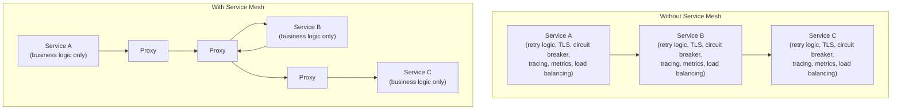
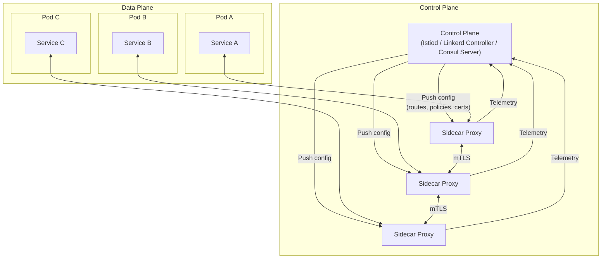
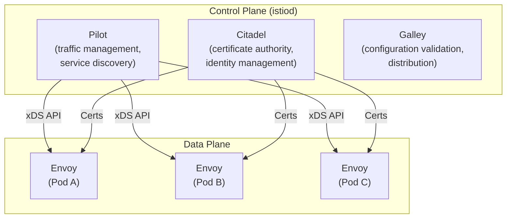
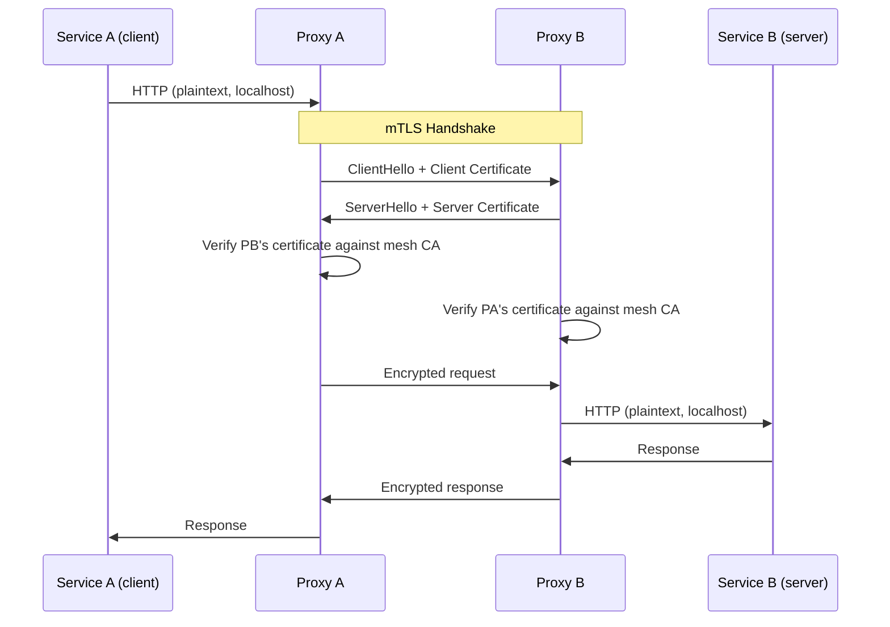

# Service Mesh

A service mesh is a dedicated infrastructure layer for handling service-to-service communication. Instead of embedding networking logic (retries, timeouts, circuit breakers, TLS, load balancing, observability) inside every service, you extract it into a proxy that runs alongside each service instance. The application code knows nothing about the mesh — it just makes plain HTTP or gRPC calls to `localhost`, and the mesh handles everything else.

The service mesh exists because microservices shifted a massive amount of complexity from monolith code into the network. When you have 50 services, each needing retries, mTLS, circuit breakers, and distributed tracing, implementing that logic in 50 different codebases (possibly in 5 different languages) is a maintenance nightmare. The service mesh solves this by making the network reliable, secure, and observable at the infrastructure level.

## Why Service Meshes Exist

### The Problem

In a monolith, function calls between modules are instant, reliable, and free. In microservices, every function call becomes a network call with:

- **Latency** — 0.1-100ms per hop instead of nanoseconds
- **Failure** — Networks drop packets, servers crash, deployments roll
- **Security** — Traffic is unencrypted by default on the internal network
- **Observability** — You cannot `strace` a distributed call chain



### What a Service Mesh Provides

| Capability | Without Mesh | With Mesh |
|-----------|-------------|-----------|
| **mTLS** | Each service manages certificates | Automatic certificate rotation |
| **Retries** | Implemented in application code | Configured at infrastructure level |
| **Circuit breaking** | Library per language (Hystrix, Polly, etc.) | Proxy-level, language-agnostic |
| **Load balancing** | Client-side or DNS-based | Proxy-level with health-aware routing |
| **Tracing** | Instrumentation per service | Automatic span generation |
| **Metrics** | Instrumentation per service | Automatic L7 metrics (latency, errors, throughput) |
| **Traffic control** | Feature flags in code | Canary routing, traffic splitting |
| **Rate limiting** | Per-service implementation | Centralized policy |

## Architecture

### Data Plane vs Control Plane



**Data Plane:** The network of sidecar proxies deployed alongside every service instance. These proxies intercept all inbound and outbound traffic and apply the configured policies. They handle the actual packet-level work: TLS termination, load balancing, retries, observability.

**Control Plane:** The management layer that configures the data plane proxies. It distributes routing rules, security policies, and certificates. It collects telemetry from the proxies and provides APIs for operators to manage the mesh.

### The Sidecar Pattern

In Kubernetes, the sidecar proxy runs as a container in the same pod as the application container. Traffic is intercepted using `iptables` rules that redirect all inbound and outbound traffic through the proxy:

```yaml
# What a meshed pod looks like (simplified)
apiVersion: v1
kind: Pod
metadata:
  name: my-service
  annotations:
    sidecar.istio.io/inject: "true"
spec:
  containers:
    # Application container
    - name: my-service
      image: my-service:v1.2.3
      ports:
        - containerPort: 8080

    # Sidecar proxy (injected automatically)
    - name: istio-proxy
      image: envoyproxy/envoy:v1.28
      ports:
        - containerPort: 15001  # Outbound traffic
        - containerPort: 15006  # Inbound traffic
        - containerPort: 15090  # Prometheus metrics
      resources:
        requests:
          cpu: 100m
          memory: 128Mi
        limits:
          cpu: 500m
          memory: 256Mi

  initContainers:
    # Sets up iptables rules to redirect traffic
    - name: istio-init
      image: istio/proxyv2
      securityContext:
        capabilities:
          add: ["NET_ADMIN"]
```

The `iptables` rules redirect all outbound traffic to the Envoy proxy on port 15001, and all inbound traffic to port 15006. The application is completely unaware.

::: warning Sidecar Resource Overhead
Each sidecar proxy consumes CPU and memory. With Envoy (used by Istio), expect ~100-200MB RAM and ~0.1-0.5 CPU cores per pod under load. For a cluster with 1,000 pods, that is 100-200 GB of additional RAM for the mesh alone. Monitor this overhead and right-size sidecar resources.
:::

## Istio

Istio is the most feature-rich service mesh, backed by Google, IBM, and Lyft. It uses Envoy as its data plane proxy.

### Architecture



### Traffic Management

Istio uses `VirtualService` and `DestinationRule` resources to control traffic:

```yaml
# Canary deployment: 90% to v1, 10% to v2
apiVersion: networking.istio.io/v1beta1
kind: VirtualService
metadata:
  name: product-service
spec:
  hosts:
    - product-service
  http:
    - route:
        - destination:
            host: product-service
            subset: v1
          weight: 90
        - destination:
            host: product-service
            subset: v2
          weight: 10
      retries:
        attempts: 3
        perTryTimeout: 2s
        retryOn: "5xx,reset,connect-failure"
      timeout: 10s
---
apiVersion: networking.istio.io/v1beta1
kind: DestinationRule
metadata:
  name: product-service
spec:
  host: product-service
  trafficPolicy:
    connectionPool:
      tcp:
        maxConnections: 100
      http:
        h2UpgradePolicy: DEFAULT
        http1MaxPendingRequests: 100
        http2MaxRequests: 1000
    outlierDetection:
      consecutive5xxErrors: 5
      interval: 10s
      baseEjectionTime: 30s
      maxEjectionPercent: 50
  subsets:
    - name: v1
      labels:
        version: v1
    - name: v2
      labels:
        version: v2
```

**Header-based routing** for testing:

```yaml
apiVersion: networking.istio.io/v1beta1
kind: VirtualService
metadata:
  name: product-service
spec:
  hosts:
    - product-service
  http:
    # Route internal testers to v2
    - match:
        - headers:
            x-test-user:
              exact: "true"
      route:
        - destination:
            host: product-service
            subset: v2
    # Everyone else gets v1
    - route:
        - destination:
            host: product-service
            subset: v1
```

### Circuit Breaking with Istio

Instead of implementing [circuit breakers](/system-design/distributed-systems/circuit-breaker) in application code, Istio configures them at the proxy level:

```yaml
apiVersion: networking.istio.io/v1beta1
kind: DestinationRule
metadata:
  name: payment-service
spec:
  host: payment-service
  trafficPolicy:
    connectionPool:
      tcp:
        maxConnections: 50          # Max TCP connections
      http:
        http1MaxPendingRequests: 100  # Max queued requests
        http2MaxRequests: 500         # Max concurrent requests
        maxRequestsPerConnection: 10
        maxRetries: 3
    outlierDetection:
      consecutive5xxErrors: 3       # Eject after 3 consecutive 5xx
      interval: 10s                 # Check every 10 seconds
      baseEjectionTime: 30s         # Eject for 30 seconds
      maxEjectionPercent: 30        # Never eject more than 30% of hosts
```

## Linkerd

Linkerd is a lighter-weight alternative to Istio, focused on simplicity. It uses its own micro-proxy (linkerd2-proxy) written in Rust instead of Envoy.

### Key Differences from Istio

| Aspect | Istio | Linkerd |
|--------|-------|---------|
| **Proxy** | Envoy (C++) | linkerd2-proxy (Rust) |
| **Proxy memory** | ~50-100MB | ~10-20MB |
| **Proxy latency** | ~1-3ms p99 | ~0.5-1ms p99 |
| **Complexity** | High (many CRDs) | Low (opinionated defaults) |
| **Multi-cluster** | Supported | Supported |
| **Custom Envoy filters** | Yes (WASM) | No |
| **CNCF status** | Graduated | Graduated |

### Linkerd Installation and Usage

```bash
# Install Linkerd CLI
curl -sL run.linkerd.io/install | sh

# Validate cluster
linkerd check --pre

# Install control plane
linkerd install | kubectl apply -f -

# Mesh a deployment (inject sidecar)
kubectl get deploy my-app -o yaml | linkerd inject - | kubectl apply -f -

# Check metrics
linkerd stat deploy -n my-namespace
linkerd top deploy/my-app  # Live traffic view
```

Linkerd provides automatic mTLS, retries, timeouts, and golden metrics (success rate, latency, throughput) with zero configuration.

## Consul Connect

HashiCorp Consul Connect adds service mesh capabilities to Consul's existing service discovery. It works both on Kubernetes and on traditional VMs.

```hcl
# Consul service definition with Connect sidecar
service {
  name = "web"
  port = 8080

  connect {
    sidecar_service {
      proxy {
        upstreams = [
          {
            destination_name = "api"
            local_bind_port  = 9191
          }
        ]
      }
    }
  }
}
```

The application connects to `localhost:9191` to reach the `api` service. Consul Connect handles mTLS, service discovery, and authorization.

### Intentions (Authorization)

```hcl
# Allow web to talk to api
Kind = "service-intentions"
Name = "api"
Sources = [
  {
    Name   = "web"
    Action = "allow"
  },
  {
    Name   = "*"
    Action = "deny"
  }
]
```

## Mutual TLS (mTLS)

mTLS is the foundational security feature of every service mesh. Both the client and server present certificates and verify each other's identity.



The mesh control plane acts as a Certificate Authority (CA):

1. When a pod starts, the sidecar requests a certificate from the control plane
2. The control plane issues a short-lived certificate (e.g., 24 hours) with the pod's service identity
3. The sidecar automatically rotates the certificate before it expires
4. All service-to-service traffic is encrypted and mutually authenticated

```yaml
# Istio: Enforce strict mTLS mesh-wide
apiVersion: security.istio.io/v1beta1
kind: PeerAuthentication
metadata:
  name: default
  namespace: istio-system
spec:
  mtls:
    mode: STRICT
---
# Authorization policy: only allow specific services to call payment
apiVersion: security.istio.io/v1beta1
kind: AuthorizationPolicy
metadata:
  name: payment-policy
  namespace: production
spec:
  selector:
    matchLabels:
      app: payment-service
  rules:
    - from:
        - source:
            principals:
              - "cluster.local/ns/production/sa/order-service"
              - "cluster.local/ns/production/sa/refund-service"
      to:
        - operation:
            methods: ["POST"]
            paths: ["/api/v1/charge", "/api/v1/refund"]
```

## Observability

Service meshes provide automatic observability for every request in the mesh without any application instrumentation.

### Golden Signals (Automatic)

Every sidecar proxy emits these metrics automatically:

| Metric | Description | Prometheus Example |
|--------|-------------|-------------------|
| **Request rate** | Requests per second | `istio_requests_total` |
| **Error rate** | 5xx responses per second | `istio_requests_total{response_code=~"5.."}` |
| **Latency** | Request duration percentiles | `istio_request_duration_milliseconds_bucket` |
| **Throughput** | Bytes transferred | `istio_request_bytes_sum` |

### Distributed Tracing

The mesh automatically generates trace spans for every proxy hop. Applications only need to forward trace headers (`x-request-id`, `x-b3-traceid`, etc.) for cross-service correlation:

```python
# Application only needs to propagate headers
import requests

def handle_request(incoming_request):
    # Extract trace headers from incoming request
    trace_headers = {
        key: incoming_request.headers[key]
        for key in [
            'x-request-id', 'x-b3-traceid', 'x-b3-spanid',
            'x-b3-parentspanid', 'x-b3-sampled', 'x-b3-flags',
            'x-ot-span-context', 'traceparent', 'tracestate',
        ]
        if key in incoming_request.headers
    }

    # Forward headers to downstream calls
    response = requests.get(
        'http://product-service/api/products',
        headers=trace_headers
    )
    return response.json()
```

See [Observability](/infrastructure/observability/) for the complete observability stack including Jaeger and OpenTelemetry.

## When to Use a Service Mesh

### You Need a Service Mesh If

- You have **more than 10-15 microservices** and cross-cutting concerns are duplicated everywhere
- You need **mTLS** between all services for compliance (PCI DSS, SOC 2, HIPAA)
- You need **traffic splitting** for canary deployments without changing application code
- You want **automatic L7 observability** without instrumenting every service
- You have **polyglot services** (multiple languages) and cannot standardize on one resilience library

### You Do Not Need a Service Mesh If

- You have a **monolith or a handful of services** — the overhead is not justified
- Your team **does not have Kubernetes expertise** — a mesh adds significant operational complexity
- **Latency is critical** and you cannot afford the additional ~1-3ms per hop
- You can standardize on a **single language with a good resilience library** (e.g., Go + gRPC interceptors)

::: tip Start Without a Mesh
Do not start with a service mesh. Start with a well-structured monolith. When you decompose into microservices, start with client-side load balancing and a shared observability library. Adopt a service mesh when the operational burden of managing cross-cutting concerns across many services becomes unsustainable.
:::

## Service Mesh Comparison

| Feature | Istio | Linkerd | Consul Connect |
|---------|-------|---------|----------------|
| Proxy | Envoy | linkerd2-proxy | Envoy or built-in |
| Platform | Kubernetes | Kubernetes | Kubernetes + VMs |
| mTLS | Automatic | Automatic | Automatic |
| Traffic splitting | Yes (VirtualService) | Yes (TrafficSplit) | Yes (service-splitter) |
| Circuit breaking | Yes (DestinationRule) | No (relies on retries) | Yes |
| Rate limiting | Yes (EnvoyFilter) | No | Yes |
| Multi-cluster | Yes | Yes | Yes (WAN federation) |
| WASM extensibility | Yes | No | Yes |
| Resource overhead | High | Low | Medium |
| Learning curve | Steep | Moderate | Moderate |

## Further Reading

- [Circuit Breaker Pattern](/system-design/distributed-systems/circuit-breaker) — How circuit breaking works under the hood
- [Rate Limiting](/system-design/distributed-systems/rate-limiting) — Rate limiting at the mesh level
- [Nginx Deep Dive](/infrastructure/nginx/) — How Nginx compares as a reverse proxy
- [Observability](/infrastructure/observability/) — Building the full observability stack
- [Kubernetes Services & Ingress](/infrastructure/kubernetes/services-ingress) — How service mesh interacts with Kubernetes networking
- [TLS Handshake](/system-design/networking/tls-handshake) — The TLS mechanics behind mTLS
- [gRPC Internals](/system-design/networking/grpc-internals) — gRPC mesh support and protocol details
- William Morgan (Buoyant), "The Service Mesh: What Every Software Engineer Needs to Know" (2020)
- Istio documentation: istio.io/latest/docs/
- Linkerd documentation: linkerd.io/2/overview/
