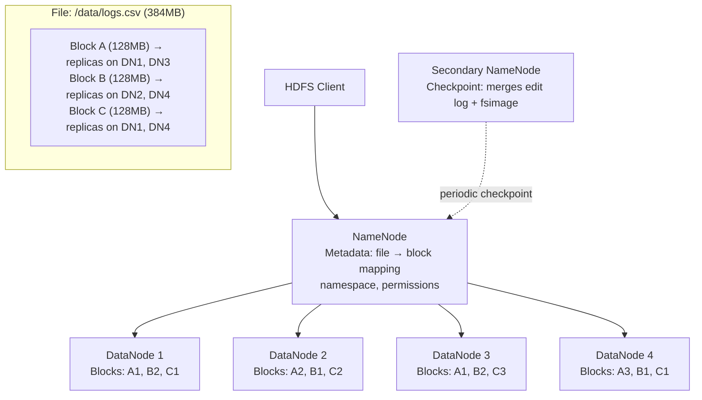
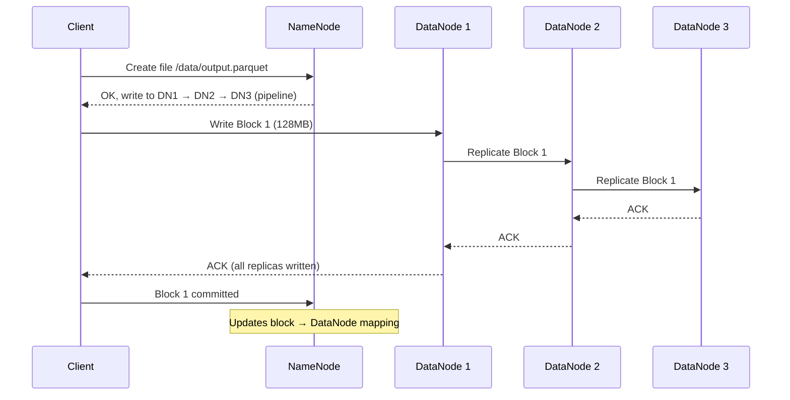
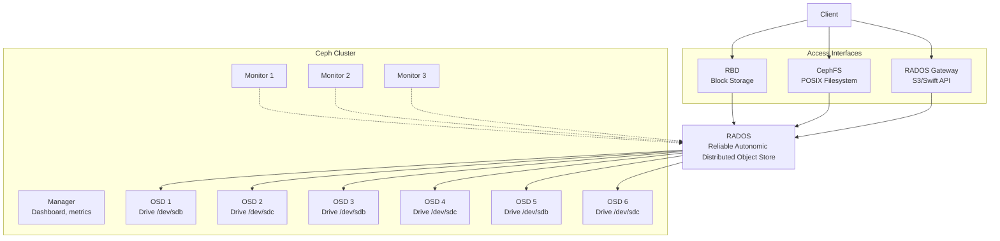
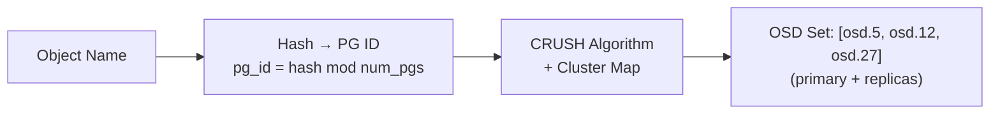
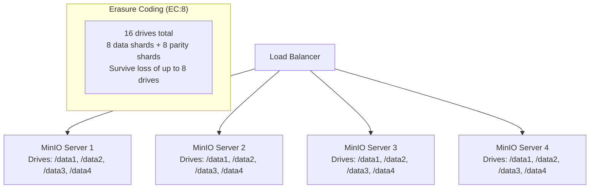
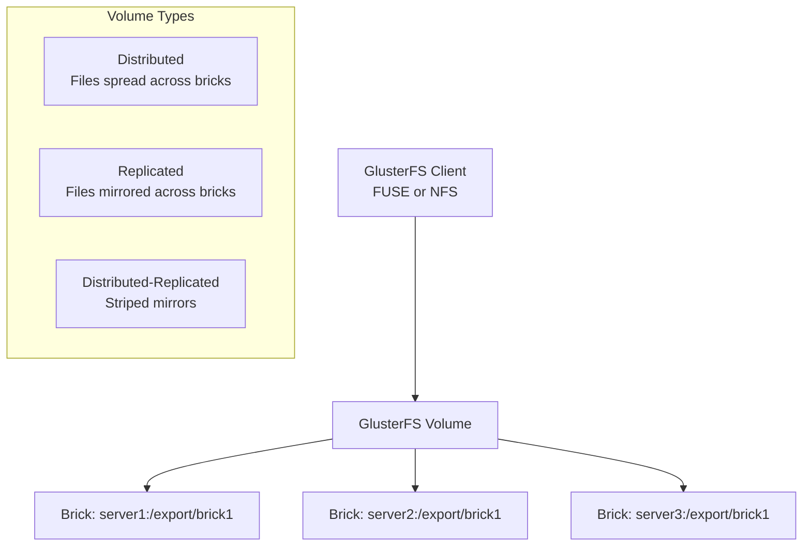

# Distributed File Systems

A single machine's storage has hard limits: capacity (tens of TB), throughput (single NIC, single bus), and availability (one power supply, one motherboard). Distributed file systems shatter these limits by spreading data across many machines, presenting a unified storage layer that scales horizontally, tolerates hardware failures, and delivers aggregate throughput that no single machine can match.

The cost of this power is complexity. Every distributed file system makes trade-offs around consistency, availability, metadata management, and failure handling. Understanding these trade-offs is the difference between choosing the right system for your workload and spending six months migrating away from the wrong one.

---

## HDFS (Hadoop Distributed File System)

### Why HDFS Exists

HDFS was designed for one specific workload: storing massive datasets (terabytes to petabytes) and processing them with MapReduce. It optimizes for high-throughput sequential reads of large files, not random I/O or low-latency access. It assumes hardware will fail constantly and designs around it.

### Architecture



**NameNode** — The single metadata server. Stores the entire namespace (file names, directory tree, block-to-DataNode mapping) in memory. This is the scalability bottleneck: one NameNode must fit all metadata in RAM.

**DataNode** — Stores actual data blocks. Sends heartbeats to the NameNode every 3 seconds. Reports its block list periodically. If a DataNode misses heartbeats, the NameNode declares it dead and re-replicates its blocks to other nodes.

**Secondary NameNode** — Misleading name. It is NOT a hot standby. It periodically merges the NameNode's edit log with the fsimage (filesystem snapshot) to prevent the edit log from growing unbounded. For actual HA, you need HDFS NameNode HA with Zookeeper.

### Write Path



HDFS uses a **replication pipeline**: the client writes to the first DataNode, which forwards to the second, which forwards to the third. This avoids the client uploading the same block three times over the network.

### Key Design Decisions

| Decision | Choice | Rationale |
|----------|--------|-----------|
| Block size | 128MB (default) | Amortize metadata overhead; MapReduce processes one block per task |
| Replication factor | 3 (default) | Survive 2 simultaneous node failures |
| Consistency | Write-once, read-many | Simplifies concurrency; files are immutable after close |
| Metadata storage | In NameNode memory | Fast lookups; limits scale to ~500M files per NameNode |
| Rack awareness | Replicas on 2 racks | Survive a full rack failure |

::: warning
HDFS is not a general-purpose filesystem. It has no random write support (append-only), high latency for small files (NameNode becomes bottleneck with millions of small files), and no POSIX compliance. If your workload requires random reads/writes, low latency, or many small files, use Ceph or a block storage system instead.
:::

### HDFS NameNode HA

Production HDFS deployments use NameNode HA with two NameNodes (active/standby) and a Journal Node quorum:

```yaml
# hdfs-site.xml (simplified)
dfs.nameservices: mycluster
dfs.ha.namenodes.mycluster: nn1,nn2
dfs.namenode.rpc-address.mycluster.nn1: namenode1:8020
dfs.namenode.rpc-address.mycluster.nn2: namenode2:8020
dfs.namenode.shared.edits.dir: qjournal://jn1:8485;jn2:8485;jn3:8485/mycluster
dfs.ha.automatic-failover.enabled: true
dfs.ha.fencing.methods: sshfence
```

---

## Ceph

Ceph is a unified distributed storage system that provides block storage (RBD), file storage (CephFS), and object storage (RGW) on a single platform. It was designed from the ground up to be self-healing, self-managing, and scalable without single points of failure.

### Architecture



### RADOS (Reliable Autonomic Distributed Object Store)

RADOS is Ceph's foundation layer. Everything in Ceph is stored as an object in RADOS. The key insight: clients compute where data lives using the CRUSH algorithm, so there is no metadata lookup bottleneck.

**Components:**

| Component | Role | Scaling |
|-----------|------|---------|
| **Monitor (MON)** | Maintains cluster map (OSD map, CRUSH map, PG map). Quorum-based (Paxos). | 3 or 5 per cluster (odd number) |
| **OSD (Object Storage Daemon)** | One per physical drive. Stores data, handles replication, recovery, rebalancing. | Hundreds to thousands per cluster |
| **Manager (MGR)** | Dashboard, Prometheus metrics, alerting. Active/standby pair. | 2 per cluster |
| **MDS (Metadata Server)** | CephFS only. Manages file/directory metadata. | 1 active + standby per filesystem |

### The CRUSH Algorithm

CRUSH (Controlled Replication Under Scalable Hashing) is Ceph's data placement algorithm. Unlike HDFS where the NameNode maintains a block-to-node mapping, CRUSH is a deterministic function: given an object name and the cluster map, any client can compute exactly which OSDs store that object.



$$\text{PG ID} = \text{hash}(\text{object name}) \mod \text{num\_pgs}$$

$$\text{OSD set} = \text{CRUSH}(\text{PG ID}, \text{cluster map}, \text{replication rules})$$

CRUSH rules encode failure domain hierarchy:

```
# CRUSH rule: replicate across 3 different hosts
rule replicated_rule {
    id 0
    type replicated
    step take default
    step chooseleaf firstn 0 type host    # Each replica on a different host
    step emit
}
```

This means replicas are automatically placed on different hosts (or racks, or datacenters) without central coordination.

### CephFS (File Storage)

CephFS provides a POSIX-compliant distributed filesystem. It uses MDS (Metadata Server) for file/directory metadata and RADOS for data storage.

```bash
# Mount CephFS
mount -t ceph mon1:6789:/ /mnt/cephfs -o name=admin,secret=<key>

# Or use the FUSE client
ceph-fuse /mnt/cephfs

# Kubernetes: use CephFS CSI driver
```

### RBD (Block Storage)

RBD provides virtual block devices backed by RADOS. Used for Kubernetes PersistentVolumes, VM disks, and database storage.

```bash
# Create a 100GB block device
rbd create mypool/myvolume --size 102400

# Map it as a block device on a host
rbd map mypool/myvolume
# /dev/rbd0

# Format and mount
mkfs.xfs /dev/rbd0
mount /dev/rbd0 /mnt/data
```

### RGW (Object Storage)

RADOS Gateway provides an S3-compatible and Swift-compatible HTTP API for object storage.

```bash
# Create a bucket and upload an object (S3-compatible)
aws --endpoint-url http://rgw.example.com:7480 s3 mb s3://my-bucket
aws --endpoint-url http://rgw.example.com:7480 s3 cp file.tar.gz s3://my-bucket/
```

### Ceph Deployment with Rook

In Kubernetes environments, Rook is the standard operator for deploying and managing Ceph:

```yaml
apiVersion: ceph.rook.io/v1
kind: CephCluster
metadata:
  name: rook-ceph
  namespace: rook-ceph
spec:
  cephVersion:
    image: quay.io/ceph/ceph:v18.2
  dataDirHostPath: /var/lib/rook
  mon:
    count: 3
    allowMultiplePerNode: false
  mgr:
    count: 2
  dashboard:
    enabled: true
  storage:
    useAllNodes: true
    useAllDevices: true
    deviceFilter: "^sd[b-z]"    # Use all drives except sda (OS drive)
```

---

## MinIO

MinIO is a high-performance, S3-compatible object storage server. Unlike Ceph's complexity, MinIO focuses on one thing: being the fastest and simplest S3-compatible storage you can self-host.

### Architecture



**Key design:**
- No separate metadata server — metadata is stored alongside data
- Erasure coding (not replication) for efficiency — configurable EC:N ratios
- S3 API compatible — drop-in replacement for AWS S3 in most applications
- Single binary — deploy with a single command

### Deployment

```yaml
# Kubernetes: MinIO Operator
apiVersion: minio.min.io/v2
kind: Tenant
metadata:
  name: minio-tenant
  namespace: minio
spec:
  image: minio/minio:latest
  pools:
    - servers: 4
      volumesPerServer: 4
      volumeClaimTemplate:
        spec:
          accessModes:
            - ReadWriteOnce
          resources:
            requests:
              storage: 1Ti
          storageClassName: local-storage
  requestAutoCert: true
  features:
    bucketDNS: true
```

```bash
# Standalone deployment for development
minio server /data --console-address ":9001"

# Distributed deployment (4 nodes, 4 drives each)
minio server http://minio{1...4}/data{1...4}
```

### Erasure Coding vs Replication

MinIO uses erasure coding by default, which is more storage-efficient than replication:

| Method | Storage Overhead | Fault Tolerance | Read Performance |
|--------|-----------------|-----------------|-----------------|
| 3x Replication | 200% (3x storage) | 2 drive failures | Good (read from any copy) |
| EC:8 (8 data + 8 parity) | 100% (2x storage) | 8 drive failures | Good (reconstruct from any 8) |
| EC:4 (8 data + 4 parity) | 50% (1.5x storage) | 4 drive failures | Good (need 8 of 12 drives) |

---

## GlusterFS

GlusterFS is a distributed file system that aggregates storage from multiple servers into a single namespace. It is simpler than Ceph for basic file storage use cases.

### Architecture



```bash
# Create a replicated volume across 3 servers
gluster volume create myvol replica 3 \
  server1:/export/brick1 \
  server2:/export/brick1 \
  server3:/export/brick1

gluster volume start myvol

# Mount on clients
mount -t glusterfs server1:/myvol /mnt/gluster
```

GlusterFS is suitable for workloads that need shared file access with simple operations. For anything requiring S3 API, block storage, or high performance, Ceph or MinIO is a better choice.

---

## Comparison Matrix

| Feature | HDFS | Ceph | MinIO | GlusterFS |
|---------|------|------|-------|-----------|
| **Primary interface** | HDFS API (Java) | Block (RBD), File (CephFS), Object (RGW) | Object (S3 API) | File (POSIX, NFS) |
| **Architecture** | NameNode + DataNodes | MON + OSD + MDS + MGR | Peer servers (no metadata node) | Peer servers + bricks |
| **Metadata** | Centralized (NameNode in RAM) | Distributed (CRUSH algorithm) | Distributed (inline with data) | Distributed (DHT) |
| **Consistency** | Strong (write-once) | Strong (Paxos monitors) | Strong (read-after-write) | Eventual (by default) |
| **Replication** | Block replication (3x) | Replication or erasure coding | Erasure coding | Replication |
| **Scale** | PB (limited by NameNode RAM) | EB (no central bottleneck) | PB (simple horizontal scale) | PB (tested to 72 bricks) |
| **Small file handling** | Poor (NameNode overhead) | Good | Good | Good |
| **Kubernetes integration** | Limited | Excellent (Rook operator) | Good (MinIO operator) | CSI driver available |
| **Operational complexity** | Medium | High | Low | Medium |
| **Best for** | Hadoop/Spark analytics | Unified storage (block+file+object) | S3-compatible object storage | Shared POSIX filesystems |

### Decision Framework

```
Q: What storage interface do you need?
├── S3 API (object) → MinIO (simple) or Ceph RGW (if you already run Ceph)
├── Block device → Ceph RBD (or cloud provider block storage)
├── POSIX filesystem (shared mount) → CephFS or GlusterFS
└── Hadoop/Spark data lake → HDFS

Q: What is your operational capacity?
├── Small team, need simplicity → MinIO
├── Platform team with storage expertise → Ceph
└── Already running Hadoop → HDFS

Q: Running on Kubernetes?
├── Yes → Rook-Ceph (unified) or MinIO Operator (object only)
└── Bare metal / VMs → Any option works

Q: What scale?
├── < 100TB → MinIO or GlusterFS (simplest)
├── 100TB - 1PB → Ceph or MinIO
└── > 1PB → Ceph or HDFS (depending on workload)
```

::: tip
If you are starting fresh and need object storage, start with MinIO. It is a single binary, S3-compatible, and scales to petabytes. Graduate to Ceph only when you need unified block + file + object storage on the same platform, or when you need features like CephFS snapshots, RBD mirroring, or multi-site replication.
:::

---

## Performance Characteristics

| System | Sequential Read | Sequential Write | Random Read IOPS | Latency (p50) |
|--------|----------------|-----------------|-----------------|---------------|
| HDFS (3 DataNodes) | 1-3 GB/s aggregate | 500MB-1.5 GB/s | Poor (not designed for random I/O) | 5-20ms |
| Ceph RBD (NVMe OSDs) | 2-5 GB/s per volume | 1-3 GB/s per volume | 50K-200K | 0.5-2ms |
| Ceph RGW | 1-5 GB/s aggregate | 500MB-2 GB/s | N/A (object API) | 5-20ms |
| MinIO (NVMe, 16 drives) | 10+ GB/s aggregate | 5+ GB/s aggregate | N/A (object API) | 2-10ms |
| GlusterFS (replicated) | 500MB-2 GB/s | 300MB-1 GB/s | 10K-50K | 2-10ms |

*Performance varies significantly with hardware, network, configuration, and workload pattern. Always benchmark with your specific workload.*

---

## Further Reading

- [Storage Systems Overview](/infrastructure/storage/) — block, file, and object storage fundamentals, RAID levels, performance metrics
- [Kubernetes Deployments & StatefulSets](/infrastructure/kubernetes/deployments-statefulsets) — PersistentVolumeClaims for distributed storage
- [Ceph documentation](https://docs.ceph.com/) — official architecture and operations guide
- [MinIO documentation](https://min.io/docs/minio/linux/index.html) — deployment and administration
- [HDFS architecture guide](https://hadoop.apache.org/docs/stable/hadoop-project-dist/hadoop-hdfs/HdfsDesign.html) — the original design paper
- [Rook documentation](https://rook.io/docs/rook/latest/) — deploying Ceph on Kubernetes
- [The CRUSH paper](https://ceph.com/assets/pdfs/weil-crush-sc06.pdf) — original CRUSH algorithm paper by Sage Weil
