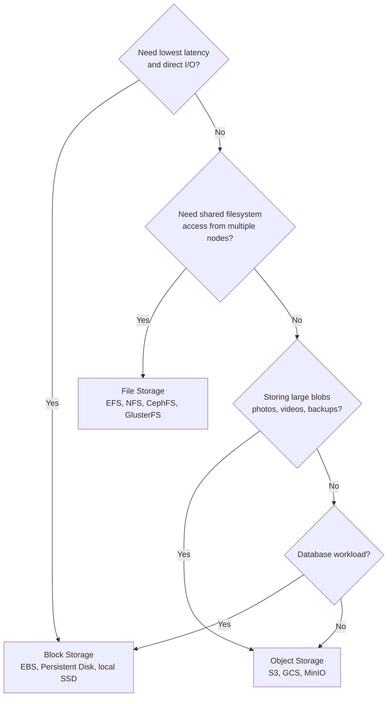
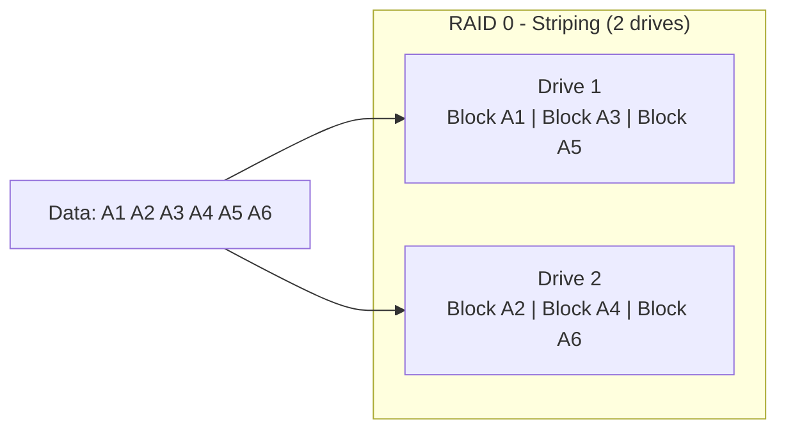
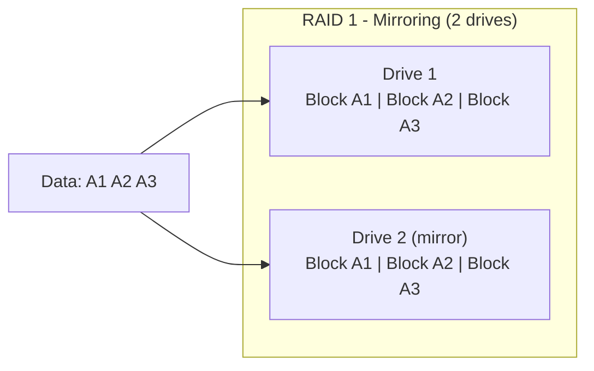
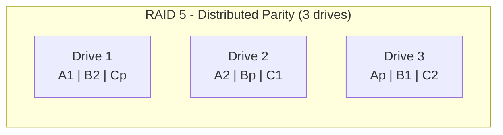
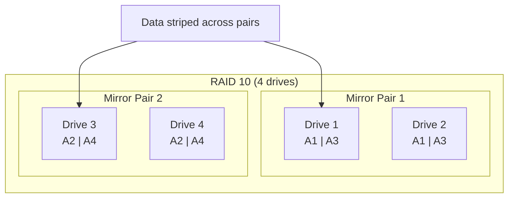

# Storage Systems

Every system you build sits on storage. The database that holds your user records, the object store that serves your images, the volume that persists your container's state — they all depend on storage subsystems with fundamentally different characteristics. Choosing the wrong storage type is expensive: you pay for performance you do not need, or you discover under load that your storage cannot deliver the IOPS your database demands.

This section builds your understanding of storage from first principles: how data is physically organized, how RAID protects against drive failure, how performance is measured, and when to use block, file, or object storage.

---

## Block vs File vs Object Storage

These are the three fundamental storage paradigms. Everything else — databases, distributed file systems, cloud storage services — is built on top of one of these.

### Block Storage

Block storage presents raw storage as fixed-size blocks (typically 512 bytes or 4KB). The operating system sees a block device (like `/dev/sda`) and layers a filesystem on top. Block storage knows nothing about files — it reads and writes blocks at specific addresses.

**Examples:** SSD/HDD drives, AWS EBS, GCP Persistent Disk, Azure Managed Disk, iSCSI LUNs, Ceph RBD

**Characteristics:**
- Lowest latency (direct block addressing)
- OS formats with a filesystem (ext4, XFS, NTFS)
- One-to-one mapping: a block volume is attached to exactly one machine (exceptions: shared block with clustering filesystems)
- Ideal for databases, boot volumes, applications requiring raw I/O

### File Storage

File storage presents a hierarchical namespace of files and directories via a network protocol (NFS, SMB/CIFS). Multiple clients can mount the same filesystem simultaneously.

**Examples:** NFS servers, AWS EFS, Azure Files, GCP Filestore, GlusterFS, CephFS

**Characteristics:**
- Shared access (many clients read/write the same files)
- POSIX semantics (file locks, permissions, directory traversal)
- Higher latency than block (protocol overhead + network)
- Ideal for shared configuration, CMS content, legacy applications expecting a filesystem

### Object Storage

Object storage is a flat namespace of objects, each identified by a unique key. Objects are immutable — you replace the entire object, not a byte range within it. Metadata is stored alongside the object.

**Examples:** AWS S3, GCP Cloud Storage, Azure Blob Storage, MinIO, Ceph RGW

**Characteristics:**
- Flat namespace (no directories, though `/` in keys simulates them)
- HTTP API access (PUT, GET, DELETE)
- Massive scale (exabytes, billions of objects)
- Built-in replication and durability (11 nines on S3)
- Higher latency per operation (HTTP overhead)
- Ideal for media assets, backups, data lake storage, static website hosting

### Comparison Matrix

| Attribute | Block Storage | File Storage | Object Storage |
|-----------|--------------|--------------|----------------|
| **Access pattern** | Random read/write at byte offset | File open/read/write/close | HTTP PUT/GET by key |
| **Protocol** | SCSI, NVMe, iSCSI | NFS, SMB/CIFS | HTTP (S3 API) |
| **Latency** | <1ms (NVMe), 1-5ms (SSD) | 1-10ms | 10-100ms |
| **Throughput** | High (GB/s with NVMe) | Medium (limited by protocol) | High (parallel GET) |
| **Shared access** | No (single attach) | Yes (multi-mount) | Yes (HTTP, stateless) |
| **Max scale** | TB per volume | PB per filesystem | Exabytes |
| **Mutability** | In-place overwrites | In-place overwrites | Replace entire object |
| **Metadata** | Filesystem inode | Filesystem attributes | Custom key-value pairs |
| **Cost** | $$$ | $$ | $ |
| **Durability** | Depends on RAID/replication | Depends on backing store | 99.999999999% (S3) |

---

## RAID Levels

RAID (Redundant Array of Independent Disks) combines multiple physical drives into a logical unit for performance, redundancy, or both. Understanding RAID is essential even in cloud environments — cloud block storage services use RAID internally, and self-managed storage systems require explicit RAID configuration.

### RAID 0 — Striping

Data is split across drives with no redundancy. Any drive failure loses all data.

| Metric | Value |
|--------|-------|
| Usable capacity | 100% (N drives) |
| Read performance | Nx (parallel reads across N drives) |
| Write performance | Nx (parallel writes) |
| Fault tolerance | None (1 drive failure = total data loss) |
| Use case | Scratch storage, temporary data, caches |

### RAID 1 — Mirroring

Every block is written to two (or more) drives. Survives any single drive failure.

| Metric | Value |
|--------|-------|
| Usable capacity | 50% (N/2 drives) |
| Read performance | 2x (read from either drive) |
| Write performance | 1x (must write both copies) |
| Fault tolerance | 1 drive failure |
| Use case | OS drives, critical small databases |

### RAID 5 — Striping with Distributed Parity

Data and parity are distributed across all drives. Parity allows reconstructing any single failed drive.

*p = parity block. If Drive 2 fails, B2 is reconstructed from B1 and Bp.*

| Metric | Value |
|--------|-------|
| Usable capacity | (N-1)/N (1 drive for parity) |
| Read performance | (N-1)x |
| Write performance | Slower (parity calculation on every write) |
| Fault tolerance | 1 drive failure |
| Use case | General purpose, read-heavy workloads |

### RAID 6 — Double Parity

Like RAID 5 but with two parity blocks. Survives any two simultaneous drive failures.

| Metric | Value |
|--------|-------|
| Usable capacity | (N-2)/N |
| Read performance | (N-2)x |
| Write performance | Slower than RAID 5 (dual parity) |
| Fault tolerance | 2 drive failures |
| Use case | Large arrays where rebuild time is long enough for a second failure |

### RAID 10 — Mirrored Stripes

Combines RAID 1 (mirroring) and RAID 0 (striping). Data is striped across mirrored pairs.

| Metric | Value |
|--------|-------|
| Usable capacity | 50% (N/2) |
| Read performance | Nx (read from any mirror in any pair) |
| Write performance | N/2 x (write to all mirrors) |
| Fault tolerance | 1 drive per mirror pair (up to N/2 drives if failures are distributed) |
| Use case | Databases, write-heavy workloads requiring both performance and redundancy |

### RAID Comparison Summary

| RAID | Min Drives | Capacity | Read Speed | Write Speed | Fault Tolerance | Best For |
|------|-----------|----------|------------|-------------|-----------------|----------|
| 0 | 2 | 100% | Excellent | Excellent | None | Temp/cache |
| 1 | 2 | 50% | Good | Fair | 1 drive | Boot/OS |
| 5 | 3 | (N-1)/N | Good | Fair | 1 drive | Read-heavy |
| 6 | 4 | (N-2)/N | Good | Poor | 2 drives | Large arrays |
| 10 | 4 | 50% | Excellent | Good | 1 per pair | Databases |

::: danger
RAID is NOT a backup strategy. RAID protects against drive failure. It does not protect against accidental deletion, corruption, ransomware, or controller failure. Always maintain separate backups regardless of RAID level.
:::

---

## Storage Performance Metrics

### IOPS (Input/Output Operations Per Second)

IOPS measures how many read or write operations a storage device can perform per second. For databases with many small random reads (e.g., key-value lookups), IOPS is the bottleneck.

| Storage Type | Random Read IOPS | Random Write IOPS |
|--------------|-----------------|-------------------|
| HDD (7200 RPM) | 75-150 | 75-150 |
| SATA SSD | 50,000-100,000 | 30,000-80,000 |
| NVMe SSD | 100,000-1,000,000 | 50,000-500,000 |
| AWS gp3 EBS | 3,000 (baseline) | 3,000 (baseline) |
| AWS io2 EBS | up to 256,000 | up to 256,000 |
| AWS io2 Block Express | up to 256,000 | up to 256,000 |

### Throughput (MB/s or GB/s)

Throughput measures data transfer rate. For streaming workloads (video processing, analytics, backups), throughput matters more than IOPS.

| Storage Type | Sequential Read | Sequential Write |
|--------------|----------------|-----------------|
| HDD (7200 RPM) | 150-200 MB/s | 150-200 MB/s |
| SATA SSD | 500-560 MB/s | 400-530 MB/s |
| NVMe SSD (PCIe 4.0) | 5,000-7,000 MB/s | 3,000-5,000 MB/s |
| AWS gp3 EBS | 125 MB/s (baseline) | 125 MB/s (baseline) |
| AWS io2 EBS | up to 4,000 MB/s | up to 4,000 MB/s |

### Latency

Latency is the time between issuing an I/O request and receiving the response. For latency-sensitive applications (trading systems, real-time analytics), this is the critical metric.

| Storage Type | Read Latency (p50) | Read Latency (p99) |
|--------------|-------------------|-------------------|
| Local NVMe | 10-50 us | 100-200 us |
| Local SATA SSD | 50-100 us | 200-500 us |
| HDD | 2-8 ms | 10-20 ms |
| AWS gp3 EBS | 1-2 ms | 3-5 ms |
| AWS io2 EBS | 0.5-1 ms | 1-2 ms |
| AWS EFS (NFS) | 1-5 ms | 10-30 ms |
| AWS S3 (object) | 20-100 ms | 200-500 ms |

### The IOPS-Throughput-Latency Triangle

These three metrics are interrelated:

$$\text{Throughput} = \text{IOPS} \times \text{I/O Size}$$

$$\text{Latency} \approx \frac{1}{\text{IOPS}} \text{ (at queue depth 1)}$$

A drive doing 100,000 IOPS at 4KB I/O size delivers: $100{,}000 \times 4\text{KB} = 400\text{MB/s}$ throughput.

The same drive doing 100,000 IOPS at 256KB I/O size would need: $100{,}000 \times 256\text{KB} = 25{,}600\text{MB/s}$ — which exceeds the interface bandwidth, so IOPS drops.

::: tip
When evaluating storage for a workload, first determine whether you are IOPS-bound (many small random I/Os, typical of databases) or throughput-bound (few large sequential I/Os, typical of analytics and media). This determines which storage tier you need and how much it will cost.
:::

---

## When to Use Which Storage Type

| Workload | Storage Type | Why |
|----------|-------------|-----|
| PostgreSQL / MySQL | Block (io2, local NVMe) | Low latency, random I/O, single attach |
| Shared configuration files | File (NFS, EFS) | Multiple pods read the same config |
| User-uploaded images | Object (S3, MinIO) | HTTP access, cheap at scale, CDN integration |
| Kafka / event streaming | Block (gp3, local SSD) | Sequential writes, high throughput |
| ML training data | Object (S3) + local cache | Bulk reads, distributed access |
| Container registry | Object (S3) | Large blobs, HTTP API, replication |
| Kubernetes PersistentVolumes | Block (CSI driver) | Direct mount, per-pod isolation |
| Log aggregation | Object (S3) for archive, Block for hot tier | Cost-optimize by tier |
| Video transcoding | Object (input/output) + Block (scratch) | Large files, parallel processing |

---

## Section Map

| Page | What You Will Learn |
|------|---------------------|
| [Distributed File Systems](/infrastructure/storage/distributed-filesystems) | HDFS, Ceph, MinIO, GlusterFS — architectures, trade-offs, and when to use each |

---

## Further Reading

- [Distributed File Systems](/infrastructure/storage/distributed-filesystems) — HDFS, Ceph, MinIO, and GlusterFS deep dive
- [Kubernetes Deployments & StatefulSets](/infrastructure/kubernetes/deployments-statefulsets) — PersistentVolumeClaims and storage in Kubernetes
- [AWS documentation on EBS volume types](https://docs.aws.amazon.com/ebs/latest/userguide/ebs-volume-types.html) — gp3, io2, st1, sc1 comparison
- [Linux kernel block layer documentation](https://www.kernel.org/doc/html/latest/block/index.html) — I/O scheduler internals
