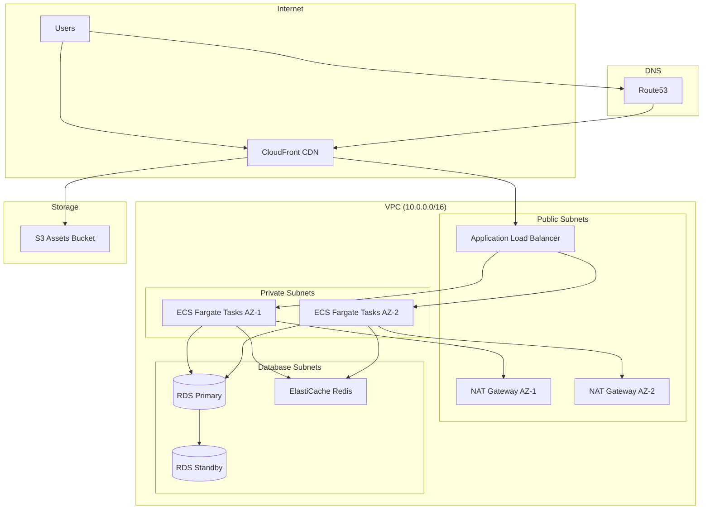

# Terraform AWS Startup Stack

This page contains a complete, production-ready AWS infrastructure written in Terraform. It is not a toy example. Every resource is configured for production use — multi-AZ deployments, encryption at rest and in transit, proper IAM policies, health checks, auto-scaling, and monitoring.

This is the infrastructure that a typical startup with a web application, API backend, PostgreSQL database, and Redis cache would deploy. You can use it as a reference, copy sections you need, or deploy the entire stack.

## Architecture Overview



## Project Structure

```
aws-startup-stack/
├── main.tf
├── variables.tf
├── outputs.tf
├── versions.tf
├── backend.tf
├── locals.tf
├── vpc.tf
├── security-groups.tf
├── ecs.tf
├── rds.tf
├── elasticache.tf
├── alb.tf
├── cloudfront.tf
├── s3.tf
├── route53.tf
├── iam.tf
├── cloudwatch.tf
├── terraform.tfvars.example
└── environments/
    ├── dev.tfvars
    ├── staging.tfvars
    └── production.tfvars
```

## Foundation: Versions and Backend

```hcl
# versions.tf
terraform {
  required_version = ">= 1.5"

  required_providers {
    aws = {
      source  = "hashicorp/aws"
      version = "~> 5.30"
    }
    random = {
      source  = "hashicorp/random"
      version = "~> 3.6"
    }
  }
}
```

```hcl
# backend.tf
terraform {
  backend "s3" {
    bucket         = "mycompany-terraform-state"
    key            = "startup-stack/terraform.tfstate"
    region         = "us-east-1"
    dynamodb_table = "terraform-state-locks"
    encrypt        = true
  }
}
```

## Variables

```hcl
# variables.tf
variable "project_name" {
  description = "Name of the project, used as prefix for all resources"
  type        = string

  validation {
    condition     = can(regex("^[a-z][a-z0-9-]{2,20}[a-z0-9]$", var.project_name))
    error_message = "Project name must be 4-22 characters, lowercase alphanumeric with hyphens."
  }
}

variable "environment" {
  description = "Deployment environment"
  type        = string

  validation {
    condition     = contains(["dev", "staging", "production"], var.environment)
    error_message = "Environment must be dev, staging, or production."
  }
}

variable "aws_region" {
  description = "AWS region for all resources"
  type        = string
  default     = "us-east-1"
}

variable "vpc_cidr" {
  description = "CIDR block for the VPC"
  type        = string
  default     = "10.0.0.0/16"
}

variable "availability_zones" {
  description = "Availability zones to use"
  type        = list(string)
  default     = ["us-east-1a", "us-east-1b"]
}

# ECS Variables
variable "app_image" {
  description = "Docker image for the application (ECR URI or Docker Hub)"
  type        = string
}

variable "app_port" {
  description = "Port the application listens on"
  type        = number
  default     = 8080
}

variable "app_cpu" {
  description = "CPU units for the ECS task (1024 = 1 vCPU)"
  type        = number
  default     = 512
}

variable "app_memory" {
  description = "Memory for the ECS task in MB"
  type        = number
  default     = 1024
}

variable "desired_count" {
  description = "Desired number of ECS tasks"
  type        = number
  default     = 2
}

variable "min_count" {
  description = "Minimum number of ECS tasks for auto-scaling"
  type        = number
  default     = 2
}

variable "max_count" {
  description = "Maximum number of ECS tasks for auto-scaling"
  type        = number
  default     = 10
}

# RDS Variables
variable "db_instance_class" {
  description = "RDS instance class"
  type        = string
  default     = "db.t3.medium"
}

variable "db_allocated_storage" {
  description = "Allocated storage for RDS in GB"
  type        = number
  default     = 50
}

variable "db_max_allocated_storage" {
  description = "Maximum allocated storage for RDS auto-scaling in GB"
  type        = number
  default     = 200
}

variable "db_multi_az" {
  description = "Enable Multi-AZ deployment for RDS"
  type        = bool
  default     = true
}

variable "db_name" {
  description = "Name of the default database"
  type        = string
  default     = "app"
}

variable "db_username" {
  description = "Master username for the database"
  type        = string
  default     = "app_admin"
}

variable "db_backup_retention" {
  description = "Number of days to retain automated backups"
  type        = number
  default     = 14
}

# ElastiCache Variables
variable "redis_node_type" {
  description = "ElastiCache Redis node type"
  type        = string
  default     = "cache.t3.medium"
}

variable "redis_num_cache_nodes" {
  description = "Number of Redis cache nodes"
  type        = number
  default     = 2
}

# Domain Variables
variable "domain_name" {
  description = "Domain name for the application"
  type        = string
}

variable "hosted_zone_id" {
  description = "Route53 hosted zone ID for the domain"
  type        = string
}

# Monitoring
variable "alarm_email" {
  description = "Email address for CloudWatch alarm notifications"
  type        = string
  default     = ""
}

variable "enable_enhanced_monitoring" {
  description = "Enable enhanced monitoring for RDS"
  type        = bool
  default     = true
}

# Application environment variables
variable "app_environment_variables" {
  description = "Environment variables to pass to the ECS task"
  type        = map(string)
  default     = {}
}
```

## Locals

```hcl
# locals.tf
locals {
  name_prefix = "${var.project_name}-${var.environment}"

  common_tags = {
    Project     = var.project_name
    Environment = var.environment
    ManagedBy   = "terraform"
  }

  azs            = var.availability_zones
  az_count       = length(local.azs)
  public_subnets  = [for i in range(local.az_count) : cidrsubnet(var.vpc_cidr, 8, i)]
  private_subnets = [for i in range(local.az_count) : cidrsubnet(var.vpc_cidr, 8, i + 10)]
  db_subnets      = [for i in range(local.az_count) : cidrsubnet(var.vpc_cidr, 8, i + 20)]

  is_production = var.environment == "production"
}
```

## Provider Configuration

```hcl
# main.tf
provider "aws" {
  region = var.aws_region

  default_tags {
    tags = local.common_tags
  }
}

# Provider for CloudFront ACM certificate (must be us-east-1)
provider "aws" {
  alias  = "us_east_1"
  region = "us-east-1"

  default_tags {
    tags = local.common_tags
  }
}

data "aws_caller_identity" "current" {}
data "aws_region" "current" {}
```

## VPC

```hcl
# vpc.tf

# ─── VPC ────────────────────────────────────────────────────────────────────────

resource "aws_vpc" "main" {
  cidr_block           = var.vpc_cidr
  enable_dns_support   = true
  enable_dns_hostnames = true

  tags = {
    Name = "${local.name_prefix}-vpc"
  }
}

# ─── Internet Gateway ──────────────────────────────────────────────────────────

resource "aws_internet_gateway" "main" {
  vpc_id = aws_vpc.main.id

  tags = {
    Name = "${local.name_prefix}-igw"
  }
}

# ─── Public Subnets ────────────────────────────────────────────────────────────

resource "aws_subnet" "public" {
  count = local.az_count

  vpc_id                  = aws_vpc.main.id
  cidr_block              = local.public_subnets[count.index]
  availability_zone       = local.azs[count.index]
  map_public_ip_on_launch = true

  tags = {
    Name = "${local.name_prefix}-public-${local.azs[count.index]}"
    Tier = "public"
  }
}

resource "aws_route_table" "public" {
  vpc_id = aws_vpc.main.id

  tags = {
    Name = "${local.name_prefix}-public-rt"
  }
}

resource "aws_route" "public_internet" {
  route_table_id         = aws_route_table.public.id
  destination_cidr_block = "0.0.0.0/0"
  gateway_id             = aws_internet_gateway.main.id
}

resource "aws_route_table_association" "public" {
  count = local.az_count

  subnet_id      = aws_subnet.public[count.index].id
  route_table_id = aws_route_table.public.id
}

# ─── NAT Gateways ──────────────────────────────────────────────────────────────

resource "aws_eip" "nat" {
  count  = local.is_production ? local.az_count : 1
  domain = "vpc"

  tags = {
    Name = "${local.name_prefix}-nat-eip-${count.index + 1}"
  }

  depends_on = [aws_internet_gateway.main]
}

resource "aws_nat_gateway" "main" {
  count = local.is_production ? local.az_count : 1

  allocation_id = aws_eip.nat[count.index].id
  subnet_id     = aws_subnet.public[count.index].id

  tags = {
    Name = "${local.name_prefix}-nat-${count.index + 1}"
  }

  depends_on = [aws_internet_gateway.main]
}

# ─── Private Subnets ───────────────────────────────────────────────────────────

resource "aws_subnet" "private" {
  count = local.az_count

  vpc_id            = aws_vpc.main.id
  cidr_block        = local.private_subnets[count.index]
  availability_zone = local.azs[count.index]

  tags = {
    Name = "${local.name_prefix}-private-${local.azs[count.index]}"
    Tier = "private"
  }
}

resource "aws_route_table" "private" {
  count  = local.az_count
  vpc_id = aws_vpc.main.id

  tags = {
    Name = "${local.name_prefix}-private-rt-${count.index + 1}"
  }
}

resource "aws_route" "private_nat" {
  count = local.az_count

  route_table_id         = aws_route_table.private[count.index].id
  destination_cidr_block = "0.0.0.0/0"
  nat_gateway_id         = aws_nat_gateway.main[local.is_production ? count.index : 0].id
}

resource "aws_route_table_association" "private" {
  count = local.az_count

  subnet_id      = aws_subnet.private[count.index].id
  route_table_id = aws_route_table.private[count.index].id
}

# ─── Database Subnets ──────────────────────────────────────────────────────────

resource "aws_subnet" "database" {
  count = local.az_count

  vpc_id            = aws_vpc.main.id
  cidr_block        = local.db_subnets[count.index]
  availability_zone = local.azs[count.index]

  tags = {
    Name = "${local.name_prefix}-database-${local.azs[count.index]}"
    Tier = "database"
  }
}

resource "aws_db_subnet_group" "main" {
  name       = "${local.name_prefix}-db-subnet-group"
  subnet_ids = aws_subnet.database[*].id

  tags = {
    Name = "${local.name_prefix}-db-subnet-group"
  }
}

# ─── VPC Flow Logs ─────────────────────────────────────────────────────────────

resource "aws_cloudwatch_log_group" "vpc_flow_logs" {
  name              = "/aws/vpc/${local.name_prefix}/flow-logs"
  retention_in_days = local.is_production ? 90 : 7

  tags = {
    Name = "${local.name_prefix}-vpc-flow-logs"
  }
}

resource "aws_iam_role" "vpc_flow_logs" {
  name = "${local.name_prefix}-vpc-flow-logs-role"

  assume_role_policy = jsonencode({
    Version = "2012-10-17"
    Statement = [{
      Action = "sts:AssumeRole"
      Effect = "Allow"
      Principal = {
        Service = "vpc-flow-logs.amazonaws.com"
      }
    }]
  })
}

resource "aws_iam_role_policy" "vpc_flow_logs" {
  name = "${local.name_prefix}-vpc-flow-logs-policy"
  role = aws_iam_role.vpc_flow_logs.id

  policy = jsonencode({
    Version = "2012-10-17"
    Statement = [{
      Action = [
        "logs:CreateLogGroup",
        "logs:CreateLogStream",
        "logs:PutLogEvents",
        "logs:DescribeLogGroups",
        "logs:DescribeLogStreams"
      ]
      Effect   = "Allow"
      Resource = "*"
    }]
  })
}

resource "aws_flow_log" "main" {
  vpc_id               = aws_vpc.main.id
  traffic_type         = "ALL"
  log_destination_type = "cloud-watch-logs"
  log_destination      = aws_cloudwatch_log_group.vpc_flow_logs.arn
  iam_role_arn         = aws_iam_role.vpc_flow_logs.arn

  tags = {
    Name = "${local.name_prefix}-vpc-flow-log"
  }
}
```

## Security Groups

```hcl
# security-groups.tf

# ─── ALB Security Group ────────────────────────────────────────────────────────

resource "aws_security_group" "alb" {
  name_prefix = "${local.name_prefix}-alb-"
  description = "Security group for the Application Load Balancer"
  vpc_id      = aws_vpc.main.id

  tags = {
    Name = "${local.name_prefix}-alb-sg"
  }

  lifecycle {
    create_before_destroy = true
  }
}

resource "aws_vpc_security_group_ingress_rule" "alb_http" {
  security_group_id = aws_security_group.alb.id
  description       = "HTTP from anywhere"
  from_port         = 80
  to_port           = 80
  ip_protocol       = "tcp"
  cidr_ipv4         = "0.0.0.0/0"
}

resource "aws_vpc_security_group_ingress_rule" "alb_https" {
  security_group_id = aws_security_group.alb.id
  description       = "HTTPS from anywhere"
  from_port         = 443
  to_port           = 443
  ip_protocol       = "tcp"
  cidr_ipv4         = "0.0.0.0/0"
}

resource "aws_vpc_security_group_egress_rule" "alb_all" {
  security_group_id = aws_security_group.alb.id
  description       = "All outbound traffic"
  ip_protocol       = "-1"
  cidr_ipv4         = "0.0.0.0/0"
}

# ─── ECS Security Group ────────────────────────────────────────────────────────

resource "aws_security_group" "ecs" {
  name_prefix = "${local.name_prefix}-ecs-"
  description = "Security group for ECS tasks"
  vpc_id      = aws_vpc.main.id

  tags = {
    Name = "${local.name_prefix}-ecs-sg"
  }

  lifecycle {
    create_before_destroy = true
  }
}

resource "aws_vpc_security_group_ingress_rule" "ecs_from_alb" {
  security_group_id            = aws_security_group.ecs.id
  description                  = "Traffic from ALB"
  from_port                    = var.app_port
  to_port                      = var.app_port
  ip_protocol                  = "tcp"
  referenced_security_group_id = aws_security_group.alb.id
}

resource "aws_vpc_security_group_egress_rule" "ecs_all" {
  security_group_id = aws_security_group.ecs.id
  description       = "All outbound traffic"
  ip_protocol       = "-1"
  cidr_ipv4         = "0.0.0.0/0"
}

# ─── RDS Security Group ────────────────────────────────────────────────────────

resource "aws_security_group" "rds" {
  name_prefix = "${local.name_prefix}-rds-"
  description = "Security group for RDS PostgreSQL"
  vpc_id      = aws_vpc.main.id

  tags = {
    Name = "${local.name_prefix}-rds-sg"
  }

  lifecycle {
    create_before_destroy = true
  }
}

resource "aws_vpc_security_group_ingress_rule" "rds_from_ecs" {
  security_group_id            = aws_security_group.rds.id
  description                  = "PostgreSQL from ECS tasks"
  from_port                    = 5432
  to_port                      = 5432
  ip_protocol                  = "tcp"
  referenced_security_group_id = aws_security_group.ecs.id
}

resource "aws_vpc_security_group_egress_rule" "rds_all" {
  security_group_id = aws_security_group.rds.id
  description       = "All outbound traffic"
  ip_protocol       = "-1"
  cidr_ipv4         = "0.0.0.0/0"
}

# ─── Redis Security Group ──────────────────────────────────────────────────────

resource "aws_security_group" "redis" {
  name_prefix = "${local.name_prefix}-redis-"
  description = "Security group for ElastiCache Redis"
  vpc_id      = aws_vpc.main.id

  tags = {
    Name = "${local.name_prefix}-redis-sg"
  }

  lifecycle {
    create_before_destroy = true
  }
}

resource "aws_vpc_security_group_ingress_rule" "redis_from_ecs" {
  security_group_id            = aws_security_group.redis.id
  description                  = "Redis from ECS tasks"
  from_port                    = 6379
  to_port                      = 6379
  ip_protocol                  = "tcp"
  referenced_security_group_id = aws_security_group.ecs.id
}

resource "aws_vpc_security_group_egress_rule" "redis_all" {
  security_group_id = aws_security_group.redis.id
  description       = "All outbound traffic"
  ip_protocol       = "-1"
  cidr_ipv4         = "0.0.0.0/0"
}
```

## Application Load Balancer

```hcl
# alb.tf

resource "aws_lb" "main" {
  name               = "${local.name_prefix}-alb"
  internal           = false
  load_balancer_type = "application"
  security_groups    = [aws_security_group.alb.id]
  subnets            = aws_subnet.public[*].id

  enable_deletion_protection = local.is_production
  enable_http2               = true
  idle_timeout               = 60

  access_logs {
    bucket  = aws_s3_bucket.alb_logs.id
    prefix  = "alb"
    enabled = true
  }

  tags = {
    Name = "${local.name_prefix}-alb"
  }
}

resource "aws_s3_bucket" "alb_logs" {
  bucket = "${local.name_prefix}-alb-logs"

  tags = {
    Name = "${local.name_prefix}-alb-logs"
  }
}

resource "aws_s3_bucket_lifecycle_configuration" "alb_logs" {
  bucket = aws_s3_bucket.alb_logs.id

  rule {
    id     = "expire-logs"
    status = "Enabled"

    expiration {
      days = local.is_production ? 90 : 30
    }

    transition {
      days          = 30
      storage_class = "STANDARD_IA"
    }
  }
}

resource "aws_s3_bucket_server_side_encryption_configuration" "alb_logs" {
  bucket = aws_s3_bucket.alb_logs.id

  rule {
    apply_server_side_encryption_by_default {
      sse_algorithm = "AES256"
    }
  }
}

resource "aws_s3_bucket_public_access_block" "alb_logs" {
  bucket = aws_s3_bucket.alb_logs.id

  block_public_acls       = true
  block_public_policy     = true
  ignore_public_acls      = true
  restrict_public_buckets = true
}

data "aws_elb_service_account" "main" {}

resource "aws_s3_bucket_policy" "alb_logs" {
  bucket = aws_s3_bucket.alb_logs.id

  policy = jsonencode({
    Version = "2012-10-17"
    Statement = [
      {
        Effect = "Allow"
        Principal = {
          AWS = data.aws_elb_service_account.main.arn
        }
        Action   = "s3:PutObject"
        Resource = "${aws_s3_bucket.alb_logs.arn}/alb/*"
      }
    ]
  })
}

# ─── Target Group ───────────────────────────────────────────────────────────────

resource "aws_lb_target_group" "app" {
  name        = "${local.name_prefix}-app-tg"
  port        = var.app_port
  protocol    = "HTTP"
  vpc_id      = aws_vpc.main.id
  target_type = "ip"

  deregistration_delay = 30

  health_check {
    enabled             = true
    healthy_threshold   = 3
    unhealthy_threshold = 3
    interval            = 30
    timeout             = 5
    path                = "/health"
    protocol            = "HTTP"
    matcher             = "200"
  }

  stickiness {
    type            = "lb_cookie"
    cookie_duration = 86400
    enabled         = false
  }

  tags = {
    Name = "${local.name_prefix}-app-tg"
  }

  lifecycle {
    create_before_destroy = true
  }
}

# ─── Listeners ──────────────────────────────────────────────────────────────────

resource "aws_lb_listener" "https" {
  load_balancer_arn = aws_lb.main.arn
  port              = 443
  protocol          = "HTTPS"
  ssl_policy        = "ELBSecurityPolicy-TLS13-1-2-2021-06"
  certificate_arn   = aws_acm_certificate_validation.main.certificate_arn

  default_action {
    type             = "forward"
    target_group_arn = aws_lb_target_group.app.arn
  }
}

resource "aws_lb_listener" "http_redirect" {
  load_balancer_arn = aws_lb.main.arn
  port              = 80
  protocol          = "HTTP"

  default_action {
    type = "redirect"
    redirect {
      port        = "443"
      protocol    = "HTTPS"
      status_code = "HTTP_301"
    }
  }
}

# ─── ACM Certificate ───────────────────────────────────────────────────────────

resource "aws_acm_certificate" "main" {
  domain_name               = var.domain_name
  subject_alternative_names = ["*.${var.domain_name}"]
  validation_method         = "DNS"

  lifecycle {
    create_before_destroy = true
  }

  tags = {
    Name = "${local.name_prefix}-cert"
  }
}

resource "aws_route53_record" "cert_validation" {
  for_each = {
    for dvo in aws_acm_certificate.main.domain_validation_options : dvo.domain_name => {
      name   = dvo.resource_record_name
      type   = dvo.resource_record_type
      record = dvo.resource_record_value
    }
  }

  zone_id = var.hosted_zone_id
  name    = each.value.name
  type    = each.value.type
  ttl     = 60
  records = [each.value.record]
}

resource "aws_acm_certificate_validation" "main" {
  certificate_arn         = aws_acm_certificate.main.arn
  validation_record_fqdns = [for record in aws_route53_record.cert_validation : record.fqdn]
}
```

## ECS Fargate

```hcl
# ecs.tf

# ─── ECS Cluster ────────────────────────────────────────────────────────────────

resource "aws_ecs_cluster" "main" {
  name = "${local.name_prefix}-cluster"

  setting {
    name  = "containerInsights"
    value = local.is_production ? "enabled" : "disabled"
  }

  configuration {
    execute_command_configuration {
      logging = "OVERRIDE"

      log_configuration {
        cloud_watch_log_group_name = aws_cloudwatch_log_group.ecs_exec.name
      }
    }
  }

  tags = {
    Name = "${local.name_prefix}-cluster"
  }
}

resource "aws_ecs_cluster_capacity_providers" "main" {
  cluster_name = aws_ecs_cluster.main.name

  capacity_providers = ["FARGATE", "FARGATE_SPOT"]

  default_capacity_provider_strategy {
    base              = local.is_production ? var.min_count : 0
    weight            = 1
    capacity_provider = "FARGATE"
  }

  default_capacity_provider_strategy {
    base              = 0
    weight            = local.is_production ? 0 : 1
    capacity_provider = "FARGATE_SPOT"
  }
}

resource "aws_cloudwatch_log_group" "ecs_exec" {
  name              = "/aws/ecs/${local.name_prefix}/exec"
  retention_in_days = 7
}

# ─── Task Definition ───────────────────────────────────────────────────────────

resource "aws_cloudwatch_log_group" "app" {
  name              = "/aws/ecs/${local.name_prefix}/app"
  retention_in_days = local.is_production ? 90 : 14

  tags = {
    Name = "${local.name_prefix}-app-logs"
  }
}

resource "aws_ecs_task_definition" "app" {
  family                   = "${local.name_prefix}-app"
  network_mode             = "awsvpc"
  requires_compatibilities = ["FARGATE"]
  cpu                      = var.app_cpu
  memory                   = var.app_memory
  execution_role_arn       = aws_iam_role.ecs_execution.arn
  task_role_arn            = aws_iam_role.ecs_task.arn

  runtime_platform {
    operating_system_family = "LINUX"
    cpu_architecture        = "X86_64"
  }

  container_definitions = jsonencode([
    {
      name      = "app"
      image     = var.app_image
      essential = true
      cpu       = var.app_cpu
      memory    = var.app_memory

      portMappings = [
        {
          containerPort = var.app_port
          hostPort      = var.app_port
          protocol      = "tcp"
        }
      ]

      environment = concat(
        [
          {
            name  = "NODE_ENV"
            value = var.environment
          },
          {
            name  = "PORT"
            value = tostring(var.app_port)
          },
          {
            name  = "DATABASE_HOST"
            value = aws_db_instance.main.address
          },
          {
            name  = "DATABASE_PORT"
            value = "5432"
          },
          {
            name  = "DATABASE_NAME"
            value = var.db_name
          },
          {
            name  = "REDIS_HOST"
            value = aws_elasticache_replication_group.main.primary_endpoint_address
          },
          {
            name  = "REDIS_PORT"
            value = "6379"
          },
          {
            name  = "AWS_REGION"
            value = var.aws_region
          },
          {
            name  = "S3_ASSETS_BUCKET"
            value = aws_s3_bucket.assets.id
          },
        ],
        [for k, v in var.app_environment_variables : {
          name  = k
          value = v
        }]
      )

      secrets = [
        {
          name      = "DATABASE_URL"
          valueFrom = aws_secretsmanager_secret.database_url.arn
        },
        {
          name      = "DATABASE_PASSWORD"
          valueFrom = "${aws_secretsmanager_secret.db_password.arn}:::"
        }
      ]

      logConfiguration = {
        logDriver = "awslogs"
        options = {
          "awslogs-group"         = aws_cloudwatch_log_group.app.name
          "awslogs-region"        = var.aws_region
          "awslogs-stream-prefix" = "app"
        }
      }

      healthCheck = {
        command     = ["CMD-SHELL", "curl -f http://localhost:${var.app_port}/health || exit 1"]
        interval    = 30
        timeout     = 5
        retries     = 3
        startPeriod = 60
      }

      linuxParameters = {
        initProcessEnabled = true
      }

      ulimits = [
        {
          name      = "nofile"
          hardLimit = 65535
          softLimit = 65535
        }
      ]
    }
  ])

  tags = {
    Name = "${local.name_prefix}-app-task"
  }
}

# ─── ECS Service ────────────────────────────────────────────────────────────────

resource "aws_ecs_service" "app" {
  name            = "${local.name_prefix}-app"
  cluster         = aws_ecs_cluster.main.id
  task_definition = aws_ecs_task_definition.app.arn
  desired_count   = var.desired_count

  launch_type      = "FARGATE"
  platform_version = "LATEST"

  enable_execute_command = true

  deployment_minimum_healthy_percent = 100
  deployment_maximum_percent         = 200
  health_check_grace_period_seconds  = 120

  deployment_circuit_breaker {
    enable   = true
    rollback = true
  }

  network_configuration {
    subnets          = aws_subnet.private[*].id
    security_groups  = [aws_security_group.ecs.id]
    assign_public_ip = false
  }

  load_balancer {
    target_group_arn = aws_lb_target_group.app.arn
    container_name   = "app"
    container_port   = var.app_port
  }

  lifecycle {
    ignore_changes = [desired_count]
  }

  depends_on = [
    aws_lb_listener.https,
    aws_iam_role_policy_attachment.ecs_execution,
  ]

  tags = {
    Name = "${local.name_prefix}-app-service"
  }
}

# ─── Auto-Scaling ──────────────────────────────────────────────────────────────

resource "aws_appautoscaling_target" "ecs" {
  max_capacity       = var.max_count
  min_capacity       = var.min_count
  resource_id        = "service/${aws_ecs_cluster.main.name}/${aws_ecs_service.app.name}"
  scalable_dimension = "ecs:service:DesiredCount"
  service_namespace  = "ecs"
}

resource "aws_appautoscaling_policy" "ecs_cpu" {
  name               = "${local.name_prefix}-cpu-scaling"
  policy_type        = "TargetTrackingScaling"
  resource_id        = aws_appautoscaling_target.ecs.resource_id
  scalable_dimension = aws_appautoscaling_target.ecs.scalable_dimension
  service_namespace  = aws_appautoscaling_target.ecs.service_namespace

  target_tracking_scaling_policy_configuration {
    predefined_metric_specification {
      predefined_metric_type = "ECSServiceAverageCPUUtilization"
    }
    target_value       = 70
    scale_in_cooldown  = 300
    scale_out_cooldown = 60
  }
}

resource "aws_appautoscaling_policy" "ecs_memory" {
  name               = "${local.name_prefix}-memory-scaling"
  policy_type        = "TargetTrackingScaling"
  resource_id        = aws_appautoscaling_target.ecs.resource_id
  scalable_dimension = aws_appautoscaling_target.ecs.scalable_dimension
  service_namespace  = aws_appautoscaling_target.ecs.service_namespace

  target_tracking_scaling_policy_configuration {
    predefined_metric_specification {
      predefined_metric_type = "ECSServiceAverageMemoryUtilization"
    }
    target_value       = 80
    scale_in_cooldown  = 300
    scale_out_cooldown = 60
  }
}

resource "aws_appautoscaling_policy" "ecs_requests" {
  name               = "${local.name_prefix}-request-scaling"
  policy_type        = "TargetTrackingScaling"
  resource_id        = aws_appautoscaling_target.ecs.resource_id
  scalable_dimension = aws_appautoscaling_target.ecs.scalable_dimension
  service_namespace  = aws_appautoscaling_target.ecs.service_namespace

  target_tracking_scaling_policy_configuration {
    predefined_metric_specification {
      predefined_metric_type = "ALBRequestCountPerTarget"
      resource_label         = "${aws_lb.main.arn_suffix}/${aws_lb_target_group.app.arn_suffix}"
    }
    target_value       = 1000
    scale_in_cooldown  = 300
    scale_out_cooldown = 60
  }
}
```

## RDS PostgreSQL

```hcl
# rds.tf

# ─── Database Password ─────────────────────────────────────────────────────────

resource "random_password" "db_password" {
  length           = 32
  special          = true
  override_special = "!#$%&*()-_=+[]{}<>:?"
}

resource "aws_secretsmanager_secret" "db_password" {
  name                    = "${local.name_prefix}/db-password"
  description             = "RDS master password for ${local.name_prefix}"
  recovery_window_in_days = local.is_production ? 30 : 0

  tags = {
    Name = "${local.name_prefix}-db-password"
  }
}

resource "aws_secretsmanager_secret_version" "db_password" {
  secret_id     = aws_secretsmanager_secret.db_password.id
  secret_string = random_password.db_password.result
}

resource "aws_secretsmanager_secret" "database_url" {
  name                    = "${local.name_prefix}/database-url"
  description             = "Full database connection URL for ${local.name_prefix}"
  recovery_window_in_days = local.is_production ? 30 : 0
}

resource "aws_secretsmanager_secret_version" "database_url" {
  secret_id = aws_secretsmanager_secret.database_url.id
  secret_string = "postgresql://${var.db_username}:${random_password.db_password.result}@${aws_db_instance.main.endpoint}/${var.db_name}?sslmode=require"
}

# ─── RDS Parameter Group ───────────────────────────────────────────────────────

resource "aws_db_parameter_group" "main" {
  name_prefix = "${local.name_prefix}-pg15-"
  family      = "postgres15"
  description = "Custom parameter group for ${local.name_prefix}"

  parameter {
    name  = "log_connections"
    value = "1"
  }

  parameter {
    name  = "log_disconnections"
    value = "1"
  }

  parameter {
    name  = "log_duration"
    value = "1"
  }

  parameter {
    name         = "log_min_duration_statement"
    value        = local.is_production ? "1000" : "500"
    apply_method = "pending-reboot"
  }

  parameter {
    name  = "shared_preload_libraries"
    value = "pg_stat_statements"
    apply_method = "pending-reboot"
  }

  parameter {
    name  = "pg_stat_statements.track"
    value = "all"
    apply_method = "pending-reboot"
  }

  parameter {
    name  = "max_connections"
    value = "200"
    apply_method = "pending-reboot"
  }

  parameter {
    name  = "work_mem"
    value = "16384"
  }

  parameter {
    name  = "maintenance_work_mem"
    value = "524288"
  }

  parameter {
    name  = "effective_cache_size"
    value = "1572864"
  }

  parameter {
    name  = "random_page_cost"
    value = "1.1"
  }

  lifecycle {
    create_before_destroy = true
  }

  tags = {
    Name = "${local.name_prefix}-pg15-params"
  }
}

# ─── RDS Instance ──────────────────────────────────────────────────────────────

resource "aws_db_instance" "main" {
  identifier = "${local.name_prefix}-db"

  engine               = "postgres"
  engine_version       = "15.4"
  instance_class       = var.db_instance_class
  allocated_storage    = var.db_allocated_storage
  max_allocated_storage = var.db_max_allocated_storage
  storage_type         = "gp3"
  storage_encrypted    = true

  db_name  = var.db_name
  username = var.db_username
  password = random_password.db_password.result

  multi_az               = var.db_multi_az
  db_subnet_group_name   = aws_db_subnet_group.main.name
  vpc_security_group_ids = [aws_security_group.rds.id]
  parameter_group_name   = aws_db_parameter_group.main.name

  publicly_accessible    = false
  deletion_protection    = local.is_production
  skip_final_snapshot    = !local.is_production
  final_snapshot_identifier = local.is_production ? "${local.name_prefix}-db-final-snapshot" : null

  backup_retention_period = var.db_backup_retention
  backup_window           = "03:00-04:00"
  maintenance_window      = "Mon:04:00-Mon:05:00"

  auto_minor_version_upgrade = true
  copy_tags_to_snapshot      = true

  performance_insights_enabled          = true
  performance_insights_retention_period = local.is_production ? 731 : 7

  monitoring_interval = var.enable_enhanced_monitoring ? 60 : 0
  monitoring_role_arn = var.enable_enhanced_monitoring ? aws_iam_role.rds_monitoring[0].arn : null

  enabled_cloudwatch_logs_exports = ["postgresql", "upgrade"]

  tags = {
    Name = "${local.name_prefix}-db"
  }

  lifecycle {
    prevent_destroy = false
  }
}

# ─── RDS Enhanced Monitoring IAM Role ──────────────────────────────────────────

resource "aws_iam_role" "rds_monitoring" {
  count = var.enable_enhanced_monitoring ? 1 : 0

  name = "${local.name_prefix}-rds-monitoring-role"

  assume_role_policy = jsonencode({
    Version = "2012-10-17"
    Statement = [{
      Action = "sts:AssumeRole"
      Effect = "Allow"
      Principal = {
        Service = "monitoring.rds.amazonaws.com"
      }
    }]
  })
}

resource "aws_iam_role_policy_attachment" "rds_monitoring" {
  count = var.enable_enhanced_monitoring ? 1 : 0

  role       = aws_iam_role.rds_monitoring[0].name
  policy_arn = "arn:aws:iam::aws:policy/service-role/AmazonRDSEnhancedMonitoringRole"
}
```

## ElastiCache Redis

```hcl
# elasticache.tf

resource "aws_elasticache_subnet_group" "main" {
  name       = "${local.name_prefix}-redis-subnet-group"
  subnet_ids = aws_subnet.database[*].id

  tags = {
    Name = "${local.name_prefix}-redis-subnet-group"
  }
}

resource "aws_elasticache_parameter_group" "main" {
  name   = "${local.name_prefix}-redis7"
  family = "redis7"

  parameter {
    name  = "maxmemory-policy"
    value = "allkeys-lru"
  }

  parameter {
    name  = "notify-keyspace-events"
    value = "Ex"
  }

  tags = {
    Name = "${local.name_prefix}-redis7-params"
  }
}

resource "aws_elasticache_replication_group" "main" {
  replication_group_id = "${local.name_prefix}-redis"
  description          = "Redis cluster for ${local.name_prefix}"

  node_type            = var.redis_node_type
  num_cache_clusters   = var.redis_num_cache_nodes
  parameter_group_name = aws_elasticache_parameter_group.main.name
  engine_version       = "7.0"
  port                 = 6379

  subnet_group_name  = aws_elasticache_subnet_group.main.name
  security_group_ids = [aws_security_group.redis.id]

  at_rest_encryption_enabled = true
  transit_encryption_enabled = true
  auth_token                 = random_password.redis_auth.result

  automatic_failover_enabled = var.redis_num_cache_nodes > 1
  multi_az_enabled           = var.redis_num_cache_nodes > 1

  snapshot_retention_limit = local.is_production ? 7 : 1
  snapshot_window          = "05:00-06:00"
  maintenance_window       = "mon:06:00-mon:07:00"

  auto_minor_version_upgrade = true
  apply_immediately          = !local.is_production

  tags = {
    Name = "${local.name_prefix}-redis"
  }
}

resource "random_password" "redis_auth" {
  length           = 64
  special          = false
}

resource "aws_secretsmanager_secret" "redis_auth" {
  name                    = "${local.name_prefix}/redis-auth-token"
  description             = "Redis AUTH token for ${local.name_prefix}"
  recovery_window_in_days = local.is_production ? 30 : 0
}

resource "aws_secretsmanager_secret_version" "redis_auth" {
  secret_id     = aws_secretsmanager_secret.redis_auth.id
  secret_string = random_password.redis_auth.result
}
```

## S3 and CloudFront

```hcl
# s3.tf

resource "aws_s3_bucket" "assets" {
  bucket = "${local.name_prefix}-assets"

  tags = {
    Name = "${local.name_prefix}-assets"
  }
}

resource "aws_s3_bucket_versioning" "assets" {
  bucket = aws_s3_bucket.assets.id
  versioning_configuration {
    status = "Enabled"
  }
}

resource "aws_s3_bucket_server_side_encryption_configuration" "assets" {
  bucket = aws_s3_bucket.assets.id

  rule {
    apply_server_side_encryption_by_default {
      sse_algorithm = "AES256"
    }
  }
}

resource "aws_s3_bucket_public_access_block" "assets" {
  bucket = aws_s3_bucket.assets.id

  block_public_acls       = true
  block_public_policy     = true
  ignore_public_acls      = true
  restrict_public_buckets = true
}

resource "aws_s3_bucket_cors_configuration" "assets" {
  bucket = aws_s3_bucket.assets.id

  cors_rule {
    allowed_headers = ["*"]
    allowed_methods = ["GET", "HEAD"]
    allowed_origins = ["https://${var.domain_name}", "https://*.${var.domain_name}"]
    expose_headers  = ["ETag"]
    max_age_seconds = 3600
  }
}

resource "aws_s3_bucket_lifecycle_configuration" "assets" {
  bucket = aws_s3_bucket.assets.id

  rule {
    id     = "transition-infrequent"
    status = "Enabled"

    transition {
      days          = 90
      storage_class = "STANDARD_IA"
    }

    noncurrent_version_expiration {
      noncurrent_days = 30
    }
  }
}
```

```hcl
# cloudfront.tf

resource "aws_cloudfront_origin_access_control" "assets" {
  name                              = "${local.name_prefix}-assets-oac"
  description                       = "OAC for ${local.name_prefix} S3 assets"
  origin_access_control_origin_type = "s3"
  signing_behavior                  = "always"
  signing_protocol                  = "sigv4"
}

resource "aws_acm_certificate" "cloudfront" {
  provider          = aws.us_east_1
  domain_name       = "cdn.${var.domain_name}"
  validation_method = "DNS"

  lifecycle {
    create_before_destroy = true
  }

  tags = {
    Name = "${local.name_prefix}-cdn-cert"
  }
}

resource "aws_route53_record" "cloudfront_cert_validation" {
  for_each = {
    for dvo in aws_acm_certificate.cloudfront.domain_validation_options : dvo.domain_name => {
      name   = dvo.resource_record_name
      type   = dvo.resource_record_type
      record = dvo.resource_record_value
    }
  }

  zone_id = var.hosted_zone_id
  name    = each.value.name
  type    = each.value.type
  ttl     = 60
  records = [each.value.record]
}

resource "aws_acm_certificate_validation" "cloudfront" {
  provider                = aws.us_east_1
  certificate_arn         = aws_acm_certificate.cloudfront.arn
  validation_record_fqdns = [for record in aws_route53_record.cloudfront_cert_validation : record.fqdn]
}

resource "aws_cloudfront_distribution" "assets" {
  origin {
    domain_name              = aws_s3_bucket.assets.bucket_regional_domain_name
    origin_access_control_id = aws_cloudfront_origin_access_control.assets.id
    origin_id                = "s3-assets"
  }

  enabled             = true
  is_ipv6_enabled     = true
  default_root_object = "index.html"
  aliases             = ["cdn.${var.domain_name}"]

  default_cache_behavior {
    allowed_methods  = ["GET", "HEAD", "OPTIONS"]
    cached_methods   = ["GET", "HEAD"]
    target_origin_id = "s3-assets"

    cache_policy_id          = "658327ea-f89d-4fab-a63d-7e88639e58f6" # CachingOptimized
    origin_request_policy_id = "88a5eaf4-2fd4-4709-b370-b4c650ea3fcf" # CORS-S3Origin

    viewer_protocol_policy = "redirect-to-https"
    compress               = true
  }

  restrictions {
    geo_restriction {
      restriction_type = "none"
    }
  }

  viewer_certificate {
    acm_certificate_arn      = aws_acm_certificate_validation.cloudfront.certificate_arn
    ssl_support_method       = "sni-only"
    minimum_protocol_version = "TLSv1.2_2021"
  }

  custom_error_response {
    error_code         = 403
    response_code      = 404
    response_page_path = "/404.html"
  }

  tags = {
    Name = "${local.name_prefix}-cdn"
  }
}

resource "aws_s3_bucket_policy" "assets_cloudfront" {
  bucket = aws_s3_bucket.assets.id

  policy = jsonencode({
    Version = "2012-10-17"
    Statement = [
      {
        Sid    = "AllowCloudFrontServicePrincipal"
        Effect = "Allow"
        Principal = {
          Service = "cloudfront.amazonaws.com"
        }
        Action   = "s3:GetObject"
        Resource = "${aws_s3_bucket.assets.arn}/*"
        Condition = {
          StringEquals = {
            "AWS:SourceArn" = aws_cloudfront_distribution.assets.arn
          }
        }
      }
    ]
  })
}
```

## Route53

```hcl
# route53.tf

resource "aws_route53_record" "app" {
  zone_id = var.hosted_zone_id
  name    = var.domain_name
  type    = "A"

  alias {
    name                   = aws_lb.main.dns_name
    zone_id                = aws_lb.main.zone_id
    evaluate_target_health = true
  }
}

resource "aws_route53_record" "app_www" {
  zone_id = var.hosted_zone_id
  name    = "www.${var.domain_name}"
  type    = "A"

  alias {
    name                   = aws_lb.main.dns_name
    zone_id                = aws_lb.main.zone_id
    evaluate_target_health = true
  }
}

resource "aws_route53_record" "cdn" {
  zone_id = var.hosted_zone_id
  name    = "cdn.${var.domain_name}"
  type    = "A"

  alias {
    name                   = aws_cloudfront_distribution.assets.domain_name
    zone_id                = aws_cloudfront_distribution.assets.hosted_zone_id
    evaluate_target_health = false
  }
}

resource "aws_route53_health_check" "app" {
  count = local.is_production ? 1 : 0

  fqdn              = var.domain_name
  port               = 443
  type               = "HTTPS"
  resource_path      = "/health"
  failure_threshold  = 3
  request_interval   = 30
  measure_latency    = true

  tags = {
    Name = "${local.name_prefix}-health-check"
  }
}
```

## IAM Roles and Policies

```hcl
# iam.tf

# ─── ECS Execution Role (pulls images, writes logs) ────────────────────────────

resource "aws_iam_role" "ecs_execution" {
  name = "${local.name_prefix}-ecs-execution-role"

  assume_role_policy = jsonencode({
    Version = "2012-10-17"
    Statement = [{
      Action = "sts:AssumeRole"
      Effect = "Allow"
      Principal = {
        Service = "ecs-tasks.amazonaws.com"
      }
    }]
  })

  tags = {
    Name = "${local.name_prefix}-ecs-execution-role"
  }
}

resource "aws_iam_role_policy_attachment" "ecs_execution" {
  role       = aws_iam_role.ecs_execution.name
  policy_arn = "arn:aws:iam::aws:policy/service-role/AmazonECSTaskExecutionRolePolicy"
}

resource "aws_iam_role_policy" "ecs_execution_secrets" {
  name = "${local.name_prefix}-ecs-execution-secrets"
  role = aws_iam_role.ecs_execution.id

  policy = jsonencode({
    Version = "2012-10-17"
    Statement = [
      {
        Effect = "Allow"
        Action = [
          "secretsmanager:GetSecretValue"
        ]
        Resource = [
          aws_secretsmanager_secret.db_password.arn,
          aws_secretsmanager_secret.database_url.arn,
          aws_secretsmanager_secret.redis_auth.arn,
        ]
      },
      {
        Effect = "Allow"
        Action = [
          "kms:Decrypt"
        ]
        Resource = ["*"]
        Condition = {
          StringEquals = {
            "kms:ViaService" = "secretsmanager.${var.aws_region}.amazonaws.com"
          }
        }
      }
    ]
  })
}

# ─── ECS Task Role (what the application can do) ───────────────────────────────

resource "aws_iam_role" "ecs_task" {
  name = "${local.name_prefix}-ecs-task-role"

  assume_role_policy = jsonencode({
    Version = "2012-10-17"
    Statement = [{
      Action = "sts:AssumeRole"
      Effect = "Allow"
      Principal = {
        Service = "ecs-tasks.amazonaws.com"
      }
    }]
  })

  tags = {
    Name = "${local.name_prefix}-ecs-task-role"
  }
}

resource "aws_iam_role_policy" "ecs_task_s3" {
  name = "${local.name_prefix}-ecs-task-s3"
  role = aws_iam_role.ecs_task.id

  policy = jsonencode({
    Version = "2012-10-17"
    Statement = [
      {
        Effect = "Allow"
        Action = [
          "s3:GetObject",
          "s3:PutObject",
          "s3:DeleteObject",
          "s3:ListBucket"
        ]
        Resource = [
          aws_s3_bucket.assets.arn,
          "${aws_s3_bucket.assets.arn}/*"
        ]
      }
    ]
  })
}

resource "aws_iam_role_policy" "ecs_task_ssm" {
  name = "${local.name_prefix}-ecs-task-ssm"
  role = aws_iam_role.ecs_task.id

  policy = jsonencode({
    Version = "2012-10-17"
    Statement = [
      {
        Effect = "Allow"
        Action = [
          "ssmmessages:CreateControlChannel",
          "ssmmessages:CreateDataChannel",
          "ssmmessages:OpenControlChannel",
          "ssmmessages:OpenDataChannel"
        ]
        Resource = "*"
      },
      {
        Effect = "Allow"
        Action = [
          "logs:CreateLogStream",
          "logs:DescribeLogStreams",
          "logs:PutLogEvents"
        ]
        Resource = "${aws_cloudwatch_log_group.ecs_exec.arn}:*"
      }
    ]
  })
}

resource "aws_iam_role_policy" "ecs_task_cloudwatch" {
  name = "${local.name_prefix}-ecs-task-cloudwatch"
  role = aws_iam_role.ecs_task.id

  policy = jsonencode({
    Version = "2012-10-17"
    Statement = [
      {
        Effect = "Allow"
        Action = [
          "cloudwatch:PutMetricData"
        ]
        Resource = "*"
        Condition = {
          StringEquals = {
            "cloudwatch:namespace" = local.name_prefix
          }
        }
      }
    ]
  })
}
```

## CloudWatch Alarms

```hcl
# cloudwatch.tf

# ─── SNS Topic for Alarms ──────────────────────────────────────────────────────

resource "aws_sns_topic" "alarms" {
  name = "${local.name_prefix}-alarms"

  tags = {
    Name = "${local.name_prefix}-alarms"
  }
}

resource "aws_sns_topic_subscription" "alarm_email" {
  count = var.alarm_email != "" ? 1 : 0

  topic_arn = aws_sns_topic.alarms.arn
  protocol  = "email"
  endpoint  = var.alarm_email
}

# ─── ECS Alarms ────────────────────────────────────────────────────────────────

resource "aws_cloudwatch_metric_alarm" "ecs_cpu_high" {
  alarm_name          = "${local.name_prefix}-ecs-cpu-high"
  comparison_operator = "GreaterThanThreshold"
  evaluation_periods  = 3
  metric_name         = "CPUUtilization"
  namespace           = "AWS/ECS"
  period              = 300
  statistic           = "Average"
  threshold           = 85

  dimensions = {
    ClusterName = aws_ecs_cluster.main.name
    ServiceName = aws_ecs_service.app.name
  }

  alarm_actions = [aws_sns_topic.alarms.arn]
  ok_actions    = [aws_sns_topic.alarms.arn]

  tags = {
    Name = "${local.name_prefix}-ecs-cpu-high"
  }
}

resource "aws_cloudwatch_metric_alarm" "ecs_memory_high" {
  alarm_name          = "${local.name_prefix}-ecs-memory-high"
  comparison_operator = "GreaterThanThreshold"
  evaluation_periods  = 3
  metric_name         = "MemoryUtilization"
  namespace           = "AWS/ECS"
  period              = 300
  statistic           = "Average"
  threshold           = 85

  dimensions = {
    ClusterName = aws_ecs_cluster.main.name
    ServiceName = aws_ecs_service.app.name
  }

  alarm_actions = [aws_sns_topic.alarms.arn]
  ok_actions    = [aws_sns_topic.alarms.arn]

  tags = {
    Name = "${local.name_prefix}-ecs-memory-high"
  }
}

resource "aws_cloudwatch_metric_alarm" "ecs_running_count" {
  alarm_name          = "${local.name_prefix}-ecs-low-task-count"
  comparison_operator = "LessThanThreshold"
  evaluation_periods  = 1
  metric_name         = "RunningTaskCount"
  namespace           = "ECS/ContainerInsights"
  period              = 60
  statistic           = "Average"
  threshold           = var.min_count

  dimensions = {
    ClusterName = aws_ecs_cluster.main.name
    ServiceName = aws_ecs_service.app.name
  }

  alarm_actions = [aws_sns_topic.alarms.arn]

  tags = {
    Name = "${local.name_prefix}-ecs-low-task-count"
  }
}

# ─── ALB Alarms ─────────────────────────────────────────────────────────────────

resource "aws_cloudwatch_metric_alarm" "alb_5xx" {
  alarm_name          = "${local.name_prefix}-alb-5xx-errors"
  comparison_operator = "GreaterThanThreshold"
  evaluation_periods  = 2
  metric_name         = "HTTPCode_Target_5XX_Count"
  namespace           = "AWS/ApplicationELB"
  period              = 300
  statistic           = "Sum"
  threshold           = 50

  dimensions = {
    LoadBalancer = aws_lb.main.arn_suffix
    TargetGroup  = aws_lb_target_group.app.arn_suffix
  }

  alarm_actions = [aws_sns_topic.alarms.arn]
  ok_actions    = [aws_sns_topic.alarms.arn]

  treat_missing_data = "notBreaching"

  tags = {
    Name = "${local.name_prefix}-alb-5xx-errors"
  }
}

resource "aws_cloudwatch_metric_alarm" "alb_response_time" {
  alarm_name          = "${local.name_prefix}-alb-high-latency"
  comparison_operator = "GreaterThanThreshold"
  evaluation_periods  = 3
  metric_name         = "TargetResponseTime"
  namespace           = "AWS/ApplicationELB"
  period              = 300
  extended_statistic  = "p95"
  threshold           = 2

  dimensions = {
    LoadBalancer = aws_lb.main.arn_suffix
    TargetGroup  = aws_lb_target_group.app.arn_suffix
  }

  alarm_actions = [aws_sns_topic.alarms.arn]
  ok_actions    = [aws_sns_topic.alarms.arn]

  tags = {
    Name = "${local.name_prefix}-alb-high-latency"
  }
}

resource "aws_cloudwatch_metric_alarm" "alb_unhealthy_hosts" {
  alarm_name          = "${local.name_prefix}-alb-unhealthy-hosts"
  comparison_operator = "GreaterThanThreshold"
  evaluation_periods  = 1
  metric_name         = "UnHealthyHostCount"
  namespace           = "AWS/ApplicationELB"
  period              = 60
  statistic           = "Maximum"
  threshold           = 0

  dimensions = {
    LoadBalancer = aws_lb.main.arn_suffix
    TargetGroup  = aws_lb_target_group.app.arn_suffix
  }

  alarm_actions = [aws_sns_topic.alarms.arn]
  ok_actions    = [aws_sns_topic.alarms.arn]

  tags = {
    Name = "${local.name_prefix}-alb-unhealthy-hosts"
  }
}

# ─── RDS Alarms ─────────────────────────────────────────────────────────────────

resource "aws_cloudwatch_metric_alarm" "rds_cpu" {
  alarm_name          = "${local.name_prefix}-rds-cpu-high"
  comparison_operator = "GreaterThanThreshold"
  evaluation_periods  = 3
  metric_name         = "CPUUtilization"
  namespace           = "AWS/RDS"
  period              = 300
  statistic           = "Average"
  threshold           = 80

  dimensions = {
    DBInstanceIdentifier = aws_db_instance.main.id
  }

  alarm_actions = [aws_sns_topic.alarms.arn]
  ok_actions    = [aws_sns_topic.alarms.arn]

  tags = {
    Name = "${local.name_prefix}-rds-cpu-high"
  }
}

resource "aws_cloudwatch_metric_alarm" "rds_free_storage" {
  alarm_name          = "${local.name_prefix}-rds-low-storage"
  comparison_operator = "LessThanThreshold"
  evaluation_periods  = 1
  metric_name         = "FreeStorageSpace"
  namespace           = "AWS/RDS"
  period              = 300
  statistic           = "Average"
  threshold           = 5368709120  # 5 GB in bytes

  dimensions = {
    DBInstanceIdentifier = aws_db_instance.main.id
  }

  alarm_actions = [aws_sns_topic.alarms.arn]

  tags = {
    Name = "${local.name_prefix}-rds-low-storage"
  }
}

resource "aws_cloudwatch_metric_alarm" "rds_connections" {
  alarm_name          = "${local.name_prefix}-rds-high-connections"
  comparison_operator = "GreaterThanThreshold"
  evaluation_periods  = 2
  metric_name         = "DatabaseConnections"
  namespace           = "AWS/RDS"
  period              = 300
  statistic           = "Average"
  threshold           = 150  # max_connections is 200

  dimensions = {
    DBInstanceIdentifier = aws_db_instance.main.id
  }

  alarm_actions = [aws_sns_topic.alarms.arn]
  ok_actions    = [aws_sns_topic.alarms.arn]

  tags = {
    Name = "${local.name_prefix}-rds-high-connections"
  }
}

resource "aws_cloudwatch_metric_alarm" "rds_read_latency" {
  alarm_name          = "${local.name_prefix}-rds-high-read-latency"
  comparison_operator = "GreaterThanThreshold"
  evaluation_periods  = 3
  metric_name         = "ReadLatency"
  namespace           = "AWS/RDS"
  period              = 300
  statistic           = "Average"
  threshold           = 0.02  # 20ms

  dimensions = {
    DBInstanceIdentifier = aws_db_instance.main.id
  }

  alarm_actions = [aws_sns_topic.alarms.arn]
  ok_actions    = [aws_sns_topic.alarms.arn]

  tags = {
    Name = "${local.name_prefix}-rds-high-read-latency"
  }
}

# ─── ElastiCache Alarms ────────────────────────────────────────────────────────

resource "aws_cloudwatch_metric_alarm" "redis_cpu" {
  alarm_name          = "${local.name_prefix}-redis-cpu-high"
  comparison_operator = "GreaterThanThreshold"
  evaluation_periods  = 3
  metric_name         = "EngineCPUUtilization"
  namespace           = "AWS/ElastiCache"
  period              = 300
  statistic           = "Average"
  threshold           = 75

  dimensions = {
    ReplicationGroupId = aws_elasticache_replication_group.main.id
  }

  alarm_actions = [aws_sns_topic.alarms.arn]
  ok_actions    = [aws_sns_topic.alarms.arn]

  tags = {
    Name = "${local.name_prefix}-redis-cpu-high"
  }
}

resource "aws_cloudwatch_metric_alarm" "redis_memory" {
  alarm_name          = "${local.name_prefix}-redis-memory-high"
  comparison_operator = "GreaterThanThreshold"
  evaluation_periods  = 2
  metric_name         = "DatabaseMemoryUsagePercentage"
  namespace           = "AWS/ElastiCache"
  period              = 300
  statistic           = "Average"
  threshold           = 80

  dimensions = {
    ReplicationGroupId = aws_elasticache_replication_group.main.id
  }

  alarm_actions = [aws_sns_topic.alarms.arn]
  ok_actions    = [aws_sns_topic.alarms.arn]

  tags = {
    Name = "${local.name_prefix}-redis-memory-high"
  }
}

# ─── CloudWatch Dashboard ──────────────────────────────────────────────────────

resource "aws_cloudwatch_dashboard" "main" {
  dashboard_name = local.name_prefix

  dashboard_body = jsonencode({
    widgets = [
      {
        type   = "metric"
        x      = 0
        y      = 0
        width  = 12
        height = 6
        properties = {
          title   = "ECS Service CPU & Memory"
          metrics = [
            ["AWS/ECS", "CPUUtilization", "ClusterName", aws_ecs_cluster.main.name, "ServiceName", aws_ecs_service.app.name],
            ["AWS/ECS", "MemoryUtilization", "ClusterName", aws_ecs_cluster.main.name, "ServiceName", aws_ecs_service.app.name]
          ]
          period = 300
          stat   = "Average"
          region = var.aws_region
        }
      },
      {
        type   = "metric"
        x      = 12
        y      = 0
        width  = 12
        height = 6
        properties = {
          title   = "ALB Response Time (p95)"
          metrics = [
            ["AWS/ApplicationELB", "TargetResponseTime", "LoadBalancer", aws_lb.main.arn_suffix, { stat = "p95" }],
            ["AWS/ApplicationELB", "TargetResponseTime", "LoadBalancer", aws_lb.main.arn_suffix, { stat = "p50" }]
          ]
          period = 300
          region = var.aws_region
        }
      },
      {
        type   = "metric"
        x      = 0
        y      = 6
        width  = 12
        height = 6
        properties = {
          title   = "RDS Performance"
          metrics = [
            ["AWS/RDS", "CPUUtilization", "DBInstanceIdentifier", aws_db_instance.main.id],
            ["AWS/RDS", "DatabaseConnections", "DBInstanceIdentifier", aws_db_instance.main.id]
          ]
          period = 300
          stat   = "Average"
          region = var.aws_region
        }
      },
      {
        type   = "metric"
        x      = 12
        y      = 6
        width  = 12
        height = 6
        properties = {
          title   = "Redis Performance"
          metrics = [
            ["AWS/ElastiCache", "EngineCPUUtilization", "ReplicationGroupId", aws_elasticache_replication_group.main.id],
            ["AWS/ElastiCache", "DatabaseMemoryUsagePercentage", "ReplicationGroupId", aws_elasticache_replication_group.main.id]
          ]
          period = 300
          stat   = "Average"
          region = var.aws_region
        }
      }
    ]
  })
}
```

## Outputs

```hcl
# outputs.tf

# VPC
output "vpc_id" {
  description = "ID of the VPC"
  value       = aws_vpc.main.id
}

output "public_subnet_ids" {
  description = "IDs of the public subnets"
  value       = aws_subnet.public[*].id
}

output "private_subnet_ids" {
  description = "IDs of the private subnets"
  value       = aws_subnet.private[*].id
}

# ALB
output "alb_dns_name" {
  description = "DNS name of the Application Load Balancer"
  value       = aws_lb.main.dns_name
}

output "alb_arn" {
  description = "ARN of the Application Load Balancer"
  value       = aws_lb.main.arn
}

# ECS
output "ecs_cluster_name" {
  description = "Name of the ECS cluster"
  value       = aws_ecs_cluster.main.name
}

output "ecs_service_name" {
  description = "Name of the ECS service"
  value       = aws_ecs_service.app.name
}

# RDS
output "rds_endpoint" {
  description = "RDS instance endpoint"
  value       = aws_db_instance.main.endpoint
  sensitive   = true
}

output "rds_address" {
  description = "RDS instance address (hostname only)"
  value       = aws_db_instance.main.address
  sensitive   = true
}

# Redis
output "redis_endpoint" {
  description = "Redis primary endpoint"
  value       = aws_elasticache_replication_group.main.primary_endpoint_address
  sensitive   = true
}

# CloudFront
output "cloudfront_domain" {
  description = "CloudFront distribution domain name"
  value       = aws_cloudfront_distribution.assets.domain_name
}

output "cloudfront_distribution_id" {
  description = "CloudFront distribution ID"
  value       = aws_cloudfront_distribution.assets.id
}

# S3
output "assets_bucket_name" {
  description = "Name of the S3 assets bucket"
  value       = aws_s3_bucket.assets.id
}

# DNS
output "app_url" {
  description = "Application URL"
  value       = "https://${var.domain_name}"
}

output "cdn_url" {
  description = "CDN URL for static assets"
  value       = "https://cdn.${var.domain_name}"
}

# Monitoring
output "cloudwatch_dashboard_url" {
  description = "URL to the CloudWatch dashboard"
  value       = "https://${var.aws_region}.console.aws.amazon.com/cloudwatch/home?region=${var.aws_region}#dashboards:name=${local.name_prefix}"
}

output "sns_alarm_topic_arn" {
  description = "ARN of the SNS topic for alarms"
  value       = aws_sns_topic.alarms.arn
}
```

## Example Variable Files

```hcl
# environments/dev.tfvars
project_name       = "myapp"
environment        = "dev"
aws_region         = "us-east-1"
availability_zones = ["us-east-1a", "us-east-1b"]

app_image     = "123456789.dkr.ecr.us-east-1.amazonaws.com/myapp:latest"
app_port      = 8080
app_cpu       = 256
app_memory    = 512
desired_count = 1
min_count     = 1
max_count     = 3

db_instance_class    = "db.t3.micro"
db_allocated_storage = 20
db_multi_az          = false
db_backup_retention  = 3

redis_node_type       = "cache.t3.micro"
redis_num_cache_nodes = 1

domain_name    = "dev.myapp.com"
hosted_zone_id = "Z1234567890ABC"
alarm_email    = "dev-alerts@myapp.com"

enable_enhanced_monitoring = false
```

```hcl
# environments/production.tfvars
project_name       = "myapp"
environment        = "production"
aws_region         = "us-east-1"
availability_zones = ["us-east-1a", "us-east-1b", "us-east-1c"]

app_image     = "123456789.dkr.ecr.us-east-1.amazonaws.com/myapp:v1.2.3"
app_port      = 8080
app_cpu       = 1024
app_memory    = 2048
desired_count = 3
min_count     = 3
max_count     = 20

db_instance_class        = "db.r5.large"
db_allocated_storage     = 100
db_max_allocated_storage = 500
db_multi_az              = true
db_backup_retention      = 30

redis_node_type       = "cache.r5.large"
redis_num_cache_nodes = 3

domain_name    = "myapp.com"
hosted_zone_id = "Z1234567890ABC"
alarm_email    = "production-alerts@myapp.com"

enable_enhanced_monitoring = true

app_environment_variables = {
  LOG_LEVEL     = "info"
  ENABLE_CACHE  = "true"
  CORS_ORIGIN   = "https://myapp.com"
}
```

## Deployment

```bash
# Initialize
terraform init

# Plan for production
terraform plan -var-file="environments/production.tfvars" -out=tfplan

# Review the plan carefully
terraform show tfplan

# Apply
terraform apply tfplan

# Verify
terraform output app_url
```

## Cost Estimate

For a production deployment in us-east-1 (as of 2025):

| Resource | Configuration | Monthly Cost (approx.) |
|---|---|---|
| ECS Fargate | 3 tasks, 1 vCPU, 2GB each | $110 |
| RDS PostgreSQL | db.r5.large, Multi-AZ, 100GB | $350 |
| ElastiCache Redis | cache.r5.large, 3 nodes | $450 |
| NAT Gateways | 3 AZs | $100 |
| ALB | 1 load balancer | $25 + data |
| CloudFront | 100GB transfer | $10 |
| S3 | 50GB storage | $2 |
| Route53 | 1 hosted zone | $1 |
| CloudWatch | Logs, metrics, alarms | $30 |
| **Total** | | **~$1,100/month** |

For dev, using smaller instances and single NAT gateway: approximately $150/month.
