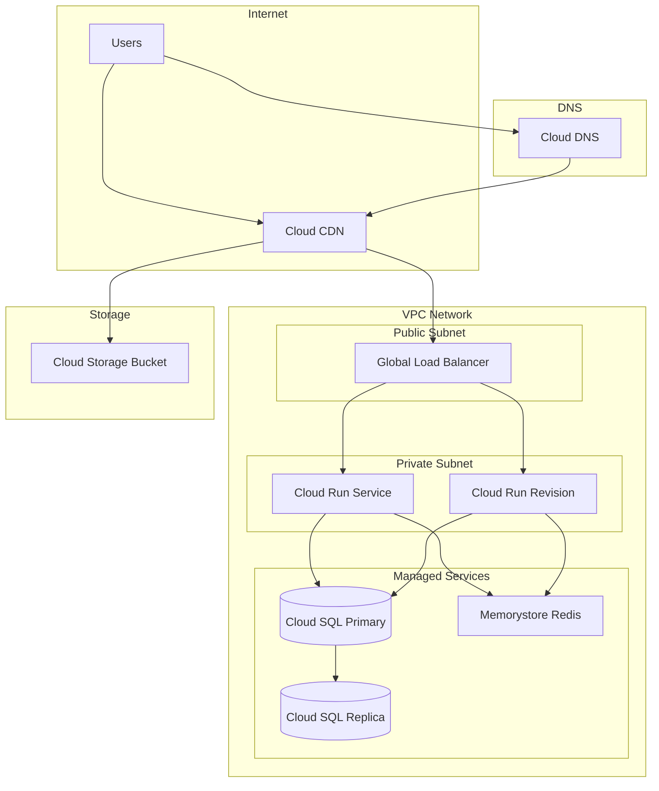

# Terraform GCP Startup Stack

This page contains a complete, production-ready GCP infrastructure written in Terraform. It mirrors the AWS Startup Stack in architecture but uses GCP-native services. Cloud Run replaces ECS Fargate, Cloud SQL replaces RDS, Memorystore replaces ElastiCache, and Cloud CDN with Cloud Load Balancing handles traffic distribution.

## Architecture Overview



## Project Structure

```
gcp-startup-stack/
├── main.tf
├── variables.tf
├── outputs.tf
├── versions.tf
├── backend.tf
├── locals.tf
├── apis.tf
├── vpc.tf
├── cloud-run.tf
├── cloud-sql.tf
├── memorystore.tf
├── load-balancer.tf
├── cloud-cdn.tf
├── cloud-dns.tf
├── iam.tf
├── monitoring.tf
├── terraform.tfvars.example
└── environments/
    ├── dev.tfvars
    ├── staging.tfvars
    └── production.tfvars
```

## Foundation

```hcl
# versions.tf
terraform {
  required_version = ">= 1.5"

  required_providers {
    google = {
      source  = "hashicorp/google"
      version = "~> 5.10"
    }
    google-beta = {
      source  = "hashicorp/google-beta"
      version = "~> 5.10"
    }
    random = {
      source  = "hashicorp/random"
      version = "~> 3.6"
    }
  }
}

# backend.tf
terraform {
  backend "gcs" {
    bucket = "mycompany-terraform-state"
    prefix = "startup-stack"
  }
}
```

```hcl
# variables.tf
variable "project_id" {
  description = "GCP project ID"
  type        = string
}

variable "project_name" {
  description = "Human-readable project name, used as prefix for resources"
  type        = string

  validation {
    condition     = can(regex("^[a-z][a-z0-9-]{2,20}[a-z0-9]$", var.project_name))
    error_message = "Project name must be 4-22 characters, lowercase alphanumeric with hyphens."
  }
}

variable "environment" {
  description = "Deployment environment"
  type        = string

  validation {
    condition     = contains(["dev", "staging", "production"], var.environment)
    error_message = "Environment must be dev, staging, or production."
  }
}

variable "region" {
  description = "GCP region for all resources"
  type        = string
  default     = "us-central1"
}

variable "zones" {
  description = "GCP zones within the region"
  type        = list(string)
  default     = ["us-central1-a", "us-central1-b", "us-central1-c"]
}

# Cloud Run
variable "app_image" {
  description = "Container image for the application"
  type        = string
}

variable "app_port" {
  description = "Port the application listens on"
  type        = number
  default     = 8080
}

variable "cloud_run_cpu" {
  description = "CPU allocation for Cloud Run (e.g., '1', '2', '4')"
  type        = string
  default     = "1"
}

variable "cloud_run_memory" {
  description = "Memory allocation for Cloud Run (e.g., '512Mi', '1Gi', '2Gi')"
  type        = string
  default     = "1Gi"
}

variable "cloud_run_min_instances" {
  description = "Minimum number of Cloud Run instances"
  type        = number
  default     = 1
}

variable "cloud_run_max_instances" {
  description = "Maximum number of Cloud Run instances"
  type        = number
  default     = 10
}

variable "cloud_run_concurrency" {
  description = "Maximum concurrent requests per Cloud Run instance"
  type        = number
  default     = 80
}

# Cloud SQL
variable "db_tier" {
  description = "Cloud SQL instance tier"
  type        = string
  default     = "db-custom-2-4096"
}

variable "db_disk_size" {
  description = "Cloud SQL disk size in GB"
  type        = number
  default     = 50
}

variable "db_name" {
  description = "Name of the default database"
  type        = string
  default     = "app"
}

variable "db_ha_enabled" {
  description = "Enable high availability for Cloud SQL"
  type        = bool
  default     = true
}

variable "db_backup_enabled" {
  description = "Enable automated backups for Cloud SQL"
  type        = bool
  default     = true
}

# Memorystore
variable "redis_tier" {
  description = "Memorystore Redis tier (BASIC or STANDARD_HA)"
  type        = string
  default     = "STANDARD_HA"
}

variable "redis_memory_size_gb" {
  description = "Memorystore Redis memory size in GB"
  type        = number
  default     = 2
}

# Domain
variable "domain_name" {
  description = "Domain name for the application"
  type        = string
}

variable "managed_zone_name" {
  description = "Cloud DNS managed zone name"
  type        = string
}

# Application
variable "app_environment_variables" {
  description = "Environment variables to pass to Cloud Run"
  type        = map(string)
  default     = {}
}
```

```hcl
# locals.tf
locals {
  name_prefix   = "${var.project_name}-${var.environment}"
  is_production = var.environment == "production"

  labels = {
    project     = var.project_name
    environment = var.environment
    managed-by  = "terraform"
  }

  # VPC CIDR ranges
  vpc_subnet_cidr     = "10.0.0.0/20"
  vpc_proxy_cidr      = "10.0.16.0/20"
  vpc_connector_cidr  = "10.0.32.0/28"
  vpc_sql_cidr        = "10.0.48.0/20"
  vpc_redis_cidr      = "10.0.64.0/20"
}
```

```hcl
# main.tf
provider "google" {
  project = var.project_id
  region  = var.region
}

provider "google-beta" {
  project = var.project_id
  region  = var.region
}
```

## Enable Required APIs

```hcl
# apis.tf
resource "google_project_service" "apis" {
  for_each = toset([
    "run.googleapis.com",
    "sqladmin.googleapis.com",
    "redis.googleapis.com",
    "compute.googleapis.com",
    "vpcaccess.googleapis.com",
    "servicenetworking.googleapis.com",
    "secretmanager.googleapis.com",
    "dns.googleapis.com",
    "cloudresourcemanager.googleapis.com",
    "monitoring.googleapis.com",
    "logging.googleapis.com",
    "artifactregistry.googleapis.com",
    "certificatemanager.googleapis.com",
  ])

  project = var.project_id
  service = each.value

  disable_dependent_services = false
  disable_on_destroy         = false
}
```

## VPC Network

```hcl
# vpc.tf

resource "google_compute_network" "main" {
  name                    = "${local.name_prefix}-vpc"
  auto_create_subnetworks = false
  routing_mode            = "REGIONAL"

  depends_on = [google_project_service.apis["compute.googleapis.com"]]
}

resource "google_compute_subnetwork" "main" {
  name          = "${local.name_prefix}-subnet"
  ip_cidr_range = local.vpc_subnet_cidr
  region        = var.region
  network       = google_compute_network.main.id

  private_ip_google_access = true

  log_config {
    aggregation_interval = "INTERVAL_5_SEC"
    flow_sampling        = 0.5
    metadata             = "INCLUDE_ALL_METADATA"
  }
}

# Proxy-only subnet for internal HTTPS load balancers
resource "google_compute_subnetwork" "proxy" {
  name          = "${local.name_prefix}-proxy-subnet"
  ip_cidr_range = local.vpc_proxy_cidr
  region        = var.region
  network       = google_compute_network.main.id
  purpose       = "REGIONAL_MANAGED_PROXY"
  role          = "ACTIVE"
}

# Private Service Access for Cloud SQL and Memorystore
resource "google_compute_global_address" "private_services" {
  name          = "${local.name_prefix}-private-services"
  purpose       = "VPC_PEERING"
  address_type  = "INTERNAL"
  prefix_length = 16
  network       = google_compute_network.main.id

  depends_on = [google_project_service.apis["servicenetworking.googleapis.com"]]
}

resource "google_service_networking_connection" "private_services" {
  network                 = google_compute_network.main.id
  service                 = "servicenetworking.googleapis.com"
  reserved_peering_ranges = [google_compute_global_address.private_services.name]
}

# Serverless VPC Access connector for Cloud Run
resource "google_vpc_access_connector" "main" {
  name          = "${local.name_prefix}-connector"
  region        = var.region
  ip_cidr_range = local.vpc_connector_cidr
  network       = google_compute_network.main.name

  min_instances = local.is_production ? 2 : 2
  max_instances = local.is_production ? 10 : 3

  machine_type = local.is_production ? "e2-standard-4" : "e2-micro"

  depends_on = [google_project_service.apis["vpcaccess.googleapis.com"]]
}

# Cloud NAT for outbound internet from VPC
resource "google_compute_router" "main" {
  name    = "${local.name_prefix}-router"
  region  = var.region
  network = google_compute_network.main.id
}

resource "google_compute_router_nat" "main" {
  name                               = "${local.name_prefix}-nat"
  router                             = google_compute_router.main.name
  region                             = var.region
  nat_ip_allocate_option             = "AUTO_ONLY"
  source_subnetwork_ip_ranges_to_nat = "ALL_SUBNETWORKS_ALL_IP_RANGES"

  log_config {
    enable = true
    filter = "ERRORS_ONLY"
  }
}

# Firewall rules
resource "google_compute_firewall" "allow_health_checks" {
  name    = "${local.name_prefix}-allow-health-checks"
  network = google_compute_network.main.name

  allow {
    protocol = "tcp"
    ports    = ["80", "443", "8080"]
  }

  source_ranges = [
    "35.191.0.0/16",
    "130.211.0.0/22",
  ]

  target_tags = ["allow-health-checks"]
}

resource "google_compute_firewall" "deny_all_ingress" {
  name    = "${local.name_prefix}-deny-all-ingress"
  network = google_compute_network.main.name

  deny {
    protocol = "all"
  }

  source_ranges = ["0.0.0.0/0"]
  priority      = 65534
}
```

## Cloud Run

```hcl
# cloud-run.tf

resource "google_cloud_run_v2_service" "app" {
  name     = "${local.name_prefix}-app"
  location = var.region

  template {
    service_account = google_service_account.cloud_run.email

    scaling {
      min_instance_count = var.cloud_run_min_instances
      max_instance_count = var.cloud_run_max_instances
    }

    max_instance_request_concurrency = var.cloud_run_concurrency

    vpc_access {
      connector = google_vpc_access_connector.main.id
      egress    = "ALL_TRAFFIC"
    }

    containers {
      name  = "app"
      image = var.app_image

      ports {
        container_port = var.app_port
      }

      resources {
        limits = {
          cpu    = var.cloud_run_cpu
          memory = var.cloud_run_memory
        }
        cpu_idle          = !local.is_production
        startup_cpu_boost = true
      }

      env {
        name  = "NODE_ENV"
        value = var.environment
      }

      env {
        name  = "PORT"
        value = tostring(var.app_port)
      }

      env {
        name  = "DB_HOST"
        value = google_sql_database_instance.main.private_ip_address
      }

      env {
        name  = "DB_PORT"
        value = "5432"
      }

      env {
        name  = "DB_NAME"
        value = var.db_name
      }

      env {
        name  = "DB_USER"
        value = google_sql_user.app.name
      }

      env {
        name = "DB_PASSWORD"
        value_source {
          secret_key_ref {
            secret  = google_secret_manager_secret.db_password.secret_id
            version = "latest"
          }
        }
      }

      env {
        name  = "REDIS_HOST"
        value = google_redis_instance.main.host
      }

      env {
        name  = "REDIS_PORT"
        value = tostring(google_redis_instance.main.port)
      }

      env {
        name  = "GCS_ASSETS_BUCKET"
        value = google_storage_bucket.assets.name
      }

      env {
        name  = "GOOGLE_CLOUD_PROJECT"
        value = var.project_id
      }

      dynamic "env" {
        for_each = var.app_environment_variables
        content {
          name  = env.key
          value = env.value
        }
      }

      startup_probe {
        http_get {
          path = "/health"
          port = var.app_port
        }
        initial_delay_seconds = 10
        period_seconds        = 10
        timeout_seconds       = 5
        failure_threshold     = 5
      }

      liveness_probe {
        http_get {
          path = "/health"
          port = var.app_port
        }
        period_seconds    = 30
        timeout_seconds   = 5
        failure_threshold = 3
      }
    }

    timeout = "300s"
  }

  traffic {
    type    = "TRAFFIC_TARGET_ALLOCATION_TYPE_LATEST"
    percent = 100
  }

  labels = local.labels

  depends_on = [
    google_project_service.apis["run.googleapis.com"],
    google_secret_manager_secret_iam_member.cloud_run_db_password,
  ]

  lifecycle {
    ignore_changes = [
      template[0].containers[0].image,
    ]
  }
}

# Allow unauthenticated access via load balancer
resource "google_cloud_run_v2_service_iam_member" "public" {
  project  = google_cloud_run_v2_service.app.project
  location = google_cloud_run_v2_service.app.location
  name     = google_cloud_run_v2_service.app.name
  role     = "roles/run.invoker"
  member   = "allUsers"
}
```

## Cloud SQL

```hcl
# cloud-sql.tf

resource "random_password" "db_password" {
  length           = 32
  special          = true
  override_special = "!#$%&*()-_=+[]{}<>:?"
}

resource "google_secret_manager_secret" "db_password" {
  secret_id = "${local.name_prefix}-db-password"

  replication {
    auto {}
  }

  labels = local.labels

  depends_on = [google_project_service.apis["secretmanager.googleapis.com"]]
}

resource "google_secret_manager_secret_version" "db_password" {
  secret      = google_secret_manager_secret.db_password.id
  secret_data = random_password.db_password.result
}

resource "google_sql_database_instance" "main" {
  name             = "${local.name_prefix}-db"
  database_version = "POSTGRES_15"
  region           = var.region

  deletion_protection = local.is_production

  settings {
    tier              = var.db_tier
    disk_size         = var.db_disk_size
    disk_type         = "PD_SSD"
    disk_autoresize   = true
    availability_type = var.db_ha_enabled ? "REGIONAL" : "ZONAL"
    edition           = "ENTERPRISE"

    ip_configuration {
      ipv4_enabled                                  = false
      private_network                               = google_compute_network.main.id
      enable_private_path_for_google_cloud_services = true
    }

    database_flags {
      name  = "log_connections"
      value = "on"
    }

    database_flags {
      name  = "log_disconnections"
      value = "on"
    }

    database_flags {
      name  = "log_min_duration_statement"
      value = local.is_production ? "1000" : "500"
    }

    database_flags {
      name  = "max_connections"
      value = "200"
    }

    database_flags {
      name  = "shared_preload_libraries"
      value = "pg_stat_statements"
    }

    database_flags {
      name  = "work_mem"
      value = "16384"
    }

    backup_configuration {
      enabled                        = var.db_backup_enabled
      start_time                     = "03:00"
      point_in_time_recovery_enabled = local.is_production
      transaction_log_retention_days = local.is_production ? 7 : 3

      backup_retention_settings {
        retained_backups = local.is_production ? 30 : 7
        retention_unit   = "COUNT"
      }
    }

    maintenance_window {
      day          = 1  # Monday
      hour         = 4  # 4 AM UTC
      update_track = "stable"
    }

    insights_config {
      query_insights_enabled  = true
      query_plans_per_minute  = 5
      query_string_length     = 1024
      record_application_tags = true
      record_client_address   = true
    }

    user_labels = local.labels
  }

  depends_on = [
    google_service_networking_connection.private_services,
    google_project_service.apis["sqladmin.googleapis.com"],
  ]
}

resource "google_sql_database" "app" {
  name     = var.db_name
  instance = google_sql_database_instance.main.name
}

resource "google_sql_user" "app" {
  name     = "app"
  instance = google_sql_database_instance.main.name
  password = random_password.db_password.result
}

# Read replica for production
resource "google_sql_database_instance" "read_replica" {
  count = local.is_production ? 1 : 0

  name                 = "${local.name_prefix}-db-replica"
  database_version     = "POSTGRES_15"
  region               = var.region
  master_instance_name = google_sql_database_instance.main.name

  deletion_protection = true

  replica_configuration {
    failover_target = false
  }

  settings {
    tier            = var.db_tier
    disk_type       = "PD_SSD"
    disk_autoresize = true

    ip_configuration {
      ipv4_enabled    = false
      private_network = google_compute_network.main.id
    }

    database_flags {
      name  = "max_connections"
      value = "200"
    }

    insights_config {
      query_insights_enabled  = true
      query_plans_per_minute  = 5
      query_string_length     = 1024
      record_application_tags = true
    }

    user_labels = merge(local.labels, {
      role = "read-replica"
    })
  }
}
```

## Memorystore Redis

```hcl
# memorystore.tf

resource "google_redis_instance" "main" {
  name           = "${local.name_prefix}-redis"
  tier           = var.redis_tier
  memory_size_gb = var.redis_memory_size_gb
  region         = var.region

  redis_version = "REDIS_7_0"

  authorized_network = google_compute_network.main.id
  connect_mode       = "PRIVATE_SERVICE_ACCESS"

  reserved_ip_range = local.vpc_redis_cidr

  redis_configs = {
    maxmemory-policy  = "allkeys-lru"
    notify-keyspace-events = "Ex"
  }

  auth_enabled            = true
  transit_encryption_mode = "SERVER_AUTHENTICATION"

  maintenance_policy {
    weekly_maintenance_window {
      day = "MONDAY"
      start_time {
        hours   = 5
        minutes = 0
      }
    }
  }

  persistence_config {
    persistence_mode    = var.redis_tier == "STANDARD_HA" ? "RDB" : "DISABLED"
    rdb_snapshot_period = var.redis_tier == "STANDARD_HA" ? "TWELVE_HOURS" : null
  }

  labels = local.labels

  depends_on = [
    google_service_networking_connection.private_services,
    google_project_service.apis["redis.googleapis.com"],
  ]
}

resource "google_secret_manager_secret" "redis_auth" {
  secret_id = "${local.name_prefix}-redis-auth"

  replication {
    auto {}
  }

  labels = local.labels
}

resource "google_secret_manager_secret_version" "redis_auth" {
  secret      = google_secret_manager_secret.redis_auth.id
  secret_data = google_redis_instance.main.auth_string
}
```

## Load Balancer and Cloud CDN

```hcl
# load-balancer.tf

# External IP
resource "google_compute_global_address" "main" {
  name = "${local.name_prefix}-lb-ip"
}

# Serverless NEG for Cloud Run
resource "google_compute_region_network_endpoint_group" "cloud_run" {
  name                  = "${local.name_prefix}-cloud-run-neg"
  network_endpoint_type = "SERVERLESS"
  region                = var.region

  cloud_run {
    service = google_cloud_run_v2_service.app.name
  }
}

# Backend service
resource "google_compute_backend_service" "app" {
  name                  = "${local.name_prefix}-backend"
  protocol              = "HTTP"
  port_name             = "http"
  load_balancing_scheme = "EXTERNAL_MANAGED"

  enable_cdn = false  # CDN is on the storage bucket, not the API

  backend {
    group = google_compute_region_network_endpoint_group.cloud_run.id
  }

  log_config {
    enable      = true
    sample_rate = local.is_production ? 0.1 : 1.0
  }

  security_policy = local.is_production ? google_compute_security_policy.main[0].id : null
}

# Cloud Armor WAF (production only)
resource "google_compute_security_policy" "main" {
  count = local.is_production ? 1 : 0

  name = "${local.name_prefix}-waf"

  rule {
    action   = "allow"
    priority = 2147483647
    match {
      versioned_expr = "SRC_IPS_V1"
      config {
        src_ip_ranges = ["*"]
      }
    }
    description = "Default allow rule"
  }

  rule {
    action   = "deny(403)"
    priority = 1000
    match {
      expr {
        expression = "evaluatePreconfiguredExpr('xss-v33-stable')"
      }
    }
    description = "XSS protection"
  }

  rule {
    action   = "deny(403)"
    priority = 1001
    match {
      expr {
        expression = "evaluatePreconfiguredExpr('sqli-v33-stable')"
      }
    }
    description = "SQL injection protection"
  }

  adaptive_protection_config {
    layer_7_ddos_defense_config {
      enable = true
    }
  }
}

# URL map
resource "google_compute_url_map" "main" {
  name            = "${local.name_prefix}-url-map"
  default_service = google_compute_backend_service.app.id

  host_rule {
    hosts        = ["cdn.${var.domain_name}"]
    path_matcher = "cdn"
  }

  path_matcher {
    name            = "cdn"
    default_service = google_compute_backend_bucket.assets.id
  }
}

# SSL certificate
resource "google_compute_managed_ssl_certificate" "main" {
  name = "${local.name_prefix}-ssl-cert"

  managed {
    domains = [var.domain_name, "www.${var.domain_name}", "cdn.${var.domain_name}"]
  }
}

# HTTPS proxy
resource "google_compute_target_https_proxy" "main" {
  name             = "${local.name_prefix}-https-proxy"
  url_map          = google_compute_url_map.main.id
  ssl_certificates = [google_compute_managed_ssl_certificate.main.id]

  ssl_policy = google_compute_ssl_policy.main.id
}

resource "google_compute_ssl_policy" "main" {
  name            = "${local.name_prefix}-ssl-policy"
  profile         = "MODERN"
  min_tls_version = "TLS_1_2"
}

# Forwarding rule (HTTPS)
resource "google_compute_global_forwarding_rule" "https" {
  name                  = "${local.name_prefix}-https-rule"
  target                = google_compute_target_https_proxy.main.id
  port_range            = "443"
  ip_address            = google_compute_global_address.main.address
  load_balancing_scheme = "EXTERNAL_MANAGED"
}

# HTTP to HTTPS redirect
resource "google_compute_url_map" "http_redirect" {
  name = "${local.name_prefix}-http-redirect"

  default_url_redirect {
    redirect_response_code = "MOVED_PERMANENTLY_DEFAULT"
    https_redirect         = true
    strip_query            = false
  }
}

resource "google_compute_target_http_proxy" "http_redirect" {
  name    = "${local.name_prefix}-http-redirect-proxy"
  url_map = google_compute_url_map.http_redirect.id
}

resource "google_compute_global_forwarding_rule" "http_redirect" {
  name                  = "${local.name_prefix}-http-redirect-rule"
  target                = google_compute_target_http_proxy.http_redirect.id
  port_range            = "80"
  ip_address            = google_compute_global_address.main.address
  load_balancing_scheme = "EXTERNAL_MANAGED"
}
```

```hcl
# cloud-cdn.tf

resource "google_storage_bucket" "assets" {
  name     = "${local.name_prefix}-assets"
  location = var.region

  uniform_bucket_level_access = true

  versioning {
    enabled = true
  }

  cors {
    origin          = ["https://${var.domain_name}", "https://www.${var.domain_name}"]
    method          = ["GET", "HEAD"]
    response_header = ["Content-Type", "ETag"]
    max_age_seconds = 3600
  }

  lifecycle_rule {
    condition {
      age = 90
    }
    action {
      type          = "SetStorageClass"
      storage_class = "NEARLINE"
    }
  }

  lifecycle_rule {
    condition {
      num_newer_versions = 3
    }
    action {
      type = "Delete"
    }
  }

  labels = local.labels
}

resource "google_compute_backend_bucket" "assets" {
  name        = "${local.name_prefix}-assets-backend"
  bucket_name = google_storage_bucket.assets.name
  enable_cdn  = true

  cdn_policy {
    cache_mode                   = "CACHE_ALL_STATIC"
    default_ttl                  = 3600
    max_ttl                      = 86400
    client_ttl                   = 3600
    negative_caching             = true
    serve_while_stale            = 86400
    signed_url_cache_max_age_sec = 7200

    cache_key_policy {
      include_host         = true
      include_protocol     = true
      include_query_string = false
    }
  }

  compression_mode = "AUTOMATIC"
}
```

## Cloud DNS

```hcl
# cloud-dns.tf

resource "google_dns_record_set" "app" {
  name         = "${var.domain_name}."
  managed_zone = var.managed_zone_name
  type         = "A"
  ttl          = 300
  rrdatas      = [google_compute_global_address.main.address]
}

resource "google_dns_record_set" "app_www" {
  name         = "www.${var.domain_name}."
  managed_zone = var.managed_zone_name
  type         = "CNAME"
  ttl          = 300
  rrdatas      = ["${var.domain_name}."]
}

resource "google_dns_record_set" "cdn" {
  name         = "cdn.${var.domain_name}."
  managed_zone = var.managed_zone_name
  type         = "A"
  ttl          = 300
  rrdatas      = [google_compute_global_address.main.address]
}
```

## IAM

```hcl
# iam.tf

# ─── Cloud Run Service Account ─────────────────────────────────────────────────

resource "google_service_account" "cloud_run" {
  account_id   = "${local.name_prefix}-run-sa"
  display_name = "Cloud Run Service Account for ${local.name_prefix}"
}

# Allow Cloud Run SA to access Cloud SQL
resource "google_project_iam_member" "cloud_run_sql_client" {
  project = var.project_id
  role    = "roles/cloudsql.client"
  member  = "serviceAccount:${google_service_account.cloud_run.email}"
}

# Allow Cloud Run SA to read secrets
resource "google_secret_manager_secret_iam_member" "cloud_run_db_password" {
  secret_id = google_secret_manager_secret.db_password.id
  role      = "roles/secretmanager.secretAccessor"
  member    = "serviceAccount:${google_service_account.cloud_run.email}"
}

resource "google_secret_manager_secret_iam_member" "cloud_run_redis_auth" {
  secret_id = google_secret_manager_secret.redis_auth.id
  role      = "roles/secretmanager.secretAccessor"
  member    = "serviceAccount:${google_service_account.cloud_run.email}"
}

# Allow Cloud Run SA to access GCS assets bucket
resource "google_storage_bucket_iam_member" "cloud_run_assets_read" {
  bucket = google_storage_bucket.assets.name
  role   = "roles/storage.objectViewer"
  member = "serviceAccount:${google_service_account.cloud_run.email}"
}

resource "google_storage_bucket_iam_member" "cloud_run_assets_write" {
  bucket = google_storage_bucket.assets.name
  role   = "roles/storage.objectCreator"
  member = "serviceAccount:${google_service_account.cloud_run.email}"
}

# Allow Cloud Run SA to write logs and metrics
resource "google_project_iam_member" "cloud_run_logging" {
  project = var.project_id
  role    = "roles/logging.logWriter"
  member  = "serviceAccount:${google_service_account.cloud_run.email}"
}

resource "google_project_iam_member" "cloud_run_metrics" {
  project = var.project_id
  role    = "roles/monitoring.metricWriter"
  member  = "serviceAccount:${google_service_account.cloud_run.email}"
}

resource "google_project_iam_member" "cloud_run_traces" {
  project = var.project_id
  role    = "roles/cloudtrace.agent"
  member  = "serviceAccount:${google_service_account.cloud_run.email}"
}

# ─── CI/CD Service Account ─────────────────────────────────────────────────────

resource "google_service_account" "cicd" {
  account_id   = "${local.name_prefix}-cicd-sa"
  display_name = "CI/CD Service Account for ${local.name_prefix}"
}

resource "google_project_iam_member" "cicd_run_admin" {
  project = var.project_id
  role    = "roles/run.admin"
  member  = "serviceAccount:${google_service_account.cicd.email}"
}

resource "google_project_iam_member" "cicd_artifact_writer" {
  project = var.project_id
  role    = "roles/artifactregistry.writer"
  member  = "serviceAccount:${google_service_account.cicd.email}"
}

resource "google_service_account_iam_member" "cicd_act_as_run" {
  service_account_id = google_service_account.cloud_run.name
  role               = "roles/iam.serviceAccountUser"
  member             = "serviceAccount:${google_service_account.cicd.email}"
}
```

## Monitoring

```hcl
# monitoring.tf

resource "google_monitoring_notification_channel" "email" {
  display_name = "${local.name_prefix} Alert Email"
  type         = "email"

  labels = {
    email_address = "alerts@${var.domain_name}"
  }
}

# Cloud Run latency alert
resource "google_monitoring_alert_policy" "cloud_run_latency" {
  display_name = "${local.name_prefix} - Cloud Run High Latency"
  combiner     = "OR"

  conditions {
    display_name = "Cloud Run p95 latency > 2s"

    condition_threshold {
      filter          = "resource.type = \"cloud_run_revision\" AND resource.labels.service_name = \"${google_cloud_run_v2_service.app.name}\" AND metric.type = \"run.googleapis.com/request_latencies\""
      duration        = "300s"
      comparison      = "COMPARISON_GT"
      threshold_value = 2000

      aggregations {
        alignment_period     = "300s"
        per_series_aligner   = "ALIGN_PERCENTILE_95"
        cross_series_reducer = "REDUCE_MEAN"
      }
    }
  }

  notification_channels = [google_monitoring_notification_channel.email.id]

  alert_strategy {
    auto_close = "604800s"
  }
}

# Cloud Run error rate alert
resource "google_monitoring_alert_policy" "cloud_run_errors" {
  display_name = "${local.name_prefix} - Cloud Run High Error Rate"
  combiner     = "OR"

  conditions {
    display_name = "Cloud Run 5xx error rate > 5%"

    condition_threshold {
      filter          = "resource.type = \"cloud_run_revision\" AND resource.labels.service_name = \"${google_cloud_run_v2_service.app.name}\" AND metric.type = \"run.googleapis.com/request_count\" AND metric.labels.response_code_class = \"5xx\""
      duration        = "300s"
      comparison      = "COMPARISON_GT"
      threshold_value = 5

      aggregations {
        alignment_period     = "300s"
        per_series_aligner   = "ALIGN_RATE"
        cross_series_reducer = "REDUCE_SUM"
      }
    }
  }

  notification_channels = [google_monitoring_notification_channel.email.id]
}

# Cloud SQL CPU alert
resource "google_monitoring_alert_policy" "cloud_sql_cpu" {
  display_name = "${local.name_prefix} - Cloud SQL High CPU"
  combiner     = "OR"

  conditions {
    display_name = "Cloud SQL CPU > 80%"

    condition_threshold {
      filter          = "resource.type = \"cloudsql_database\" AND resource.labels.database_id = \"${var.project_id}:${google_sql_database_instance.main.name}\" AND metric.type = \"cloudsql.googleapis.com/database/cpu/utilization\""
      duration        = "300s"
      comparison      = "COMPARISON_GT"
      threshold_value = 0.8

      aggregations {
        alignment_period     = "300s"
        per_series_aligner   = "ALIGN_MEAN"
      }
    }
  }

  notification_channels = [google_monitoring_notification_channel.email.id]
}

# Cloud SQL connections alert
resource "google_monitoring_alert_policy" "cloud_sql_connections" {
  display_name = "${local.name_prefix} - Cloud SQL High Connections"
  combiner     = "OR"

  conditions {
    display_name = "Cloud SQL connections > 150"

    condition_threshold {
      filter          = "resource.type = \"cloudsql_database\" AND resource.labels.database_id = \"${var.project_id}:${google_sql_database_instance.main.name}\" AND metric.type = \"cloudsql.googleapis.com/database/network/connections\""
      duration        = "300s"
      comparison      = "COMPARISON_GT"
      threshold_value = 150

      aggregations {
        alignment_period     = "300s"
        per_series_aligner   = "ALIGN_MEAN"
      }
    }
  }

  notification_channels = [google_monitoring_notification_channel.email.id]
}

# Memorystore memory alert
resource "google_monitoring_alert_policy" "redis_memory" {
  display_name = "${local.name_prefix} - Redis High Memory"
  combiner     = "OR"

  conditions {
    display_name = "Redis memory usage > 80%"

    condition_threshold {
      filter          = "resource.type = \"redis_instance\" AND resource.labels.instance_id = \"${google_redis_instance.main.name}\" AND metric.type = \"redis.googleapis.com/stats/memory/usage_ratio\""
      duration        = "300s"
      comparison      = "COMPARISON_GT"
      threshold_value = 0.8

      aggregations {
        alignment_period   = "300s"
        per_series_aligner = "ALIGN_MEAN"
      }
    }
  }

  notification_channels = [google_monitoring_notification_channel.email.id]
}

# Monitoring dashboard
resource "google_monitoring_dashboard" "main" {
  dashboard_json = jsonencode({
    displayName = "${local.name_prefix} Overview"
    mosaicLayout = {
      tiles = [
        {
          width  = 6
          height = 4
          widget = {
            title = "Cloud Run Request Count"
            xyChart = {
              dataSets = [{
                timeSeriesQuery = {
                  timeSeriesFilter = {
                    filter = "resource.type = \"cloud_run_revision\" AND resource.labels.service_name = \"${google_cloud_run_v2_service.app.name}\" AND metric.type = \"run.googleapis.com/request_count\""
                    aggregation = {
                      alignmentPeriod  = "60s"
                      perSeriesAligner = "ALIGN_RATE"
                    }
                  }
                }
              }]
            }
          }
        },
        {
          xPos   = 6
          width  = 6
          height = 4
          widget = {
            title = "Cloud Run Latency (p95)"
            xyChart = {
              dataSets = [{
                timeSeriesQuery = {
                  timeSeriesFilter = {
                    filter = "resource.type = \"cloud_run_revision\" AND resource.labels.service_name = \"${google_cloud_run_v2_service.app.name}\" AND metric.type = \"run.googleapis.com/request_latencies\""
                    aggregation = {
                      alignmentPeriod  = "60s"
                      perSeriesAligner = "ALIGN_PERCENTILE_95"
                    }
                  }
                }
              }]
            }
          }
        },
        {
          yPos   = 4
          width  = 6
          height = 4
          widget = {
            title = "Cloud SQL CPU Utilization"
            xyChart = {
              dataSets = [{
                timeSeriesQuery = {
                  timeSeriesFilter = {
                    filter = "resource.type = \"cloudsql_database\" AND metric.type = \"cloudsql.googleapis.com/database/cpu/utilization\""
                    aggregation = {
                      alignmentPeriod  = "60s"
                      perSeriesAligner = "ALIGN_MEAN"
                    }
                  }
                }
              }]
            }
          }
        },
        {
          xPos   = 6
          yPos   = 4
          width  = 6
          height = 4
          widget = {
            title = "Redis Memory Usage"
            xyChart = {
              dataSets = [{
                timeSeriesQuery = {
                  timeSeriesFilter = {
                    filter = "resource.type = \"redis_instance\" AND metric.type = \"redis.googleapis.com/stats/memory/usage_ratio\""
                    aggregation = {
                      alignmentPeriod  = "60s"
                      perSeriesAligner = "ALIGN_MEAN"
                    }
                  }
                }
              }]
            }
          }
        }
      ]
    }
  })
}
```

## Outputs

```hcl
# outputs.tf

output "app_url" {
  description = "Application URL"
  value       = "https://${var.domain_name}"
}

output "cloud_run_url" {
  description = "Cloud Run service URL (direct)"
  value       = google_cloud_run_v2_service.app.uri
}

output "cdn_url" {
  description = "CDN URL for static assets"
  value       = "https://cdn.${var.domain_name}"
}

output "load_balancer_ip" {
  description = "Global load balancer IP address"
  value       = google_compute_global_address.main.address
}

output "cloud_sql_instance_name" {
  description = "Cloud SQL instance name"
  value       = google_sql_database_instance.main.name
}

output "cloud_sql_private_ip" {
  description = "Cloud SQL private IP address"
  value       = google_sql_database_instance.main.private_ip_address
  sensitive   = true
}

output "redis_host" {
  description = "Memorystore Redis host"
  value       = google_redis_instance.main.host
  sensitive   = true
}

output "assets_bucket" {
  description = "GCS assets bucket name"
  value       = google_storage_bucket.assets.name
}

output "cloud_run_service_account" {
  description = "Cloud Run service account email"
  value       = google_service_account.cloud_run.email
}

output "cicd_service_account" {
  description = "CI/CD service account email"
  value       = google_service_account.cicd.email
}
```

## Deployment

```bash
# Initialize
terraform init

# Plan for production
terraform plan -var-file="environments/production.tfvars" -out=tfplan

# Apply
terraform apply tfplan

# Get outputs
terraform output app_url
terraform output cloud_run_url
```

## Cost Estimate (Production, us-central1)

| Resource | Configuration | Monthly Cost (approx.) |
|---|---|---|
| Cloud Run | 3 instances avg, 1 vCPU, 1GB | $90 |
| Cloud SQL | db-custom-2-4096, HA, 50GB SSD | $230 |
| Memorystore Redis | STANDARD_HA, 2GB | $165 |
| Cloud Load Balancer | 1 forwarding rule + processing | $25 |
| Cloud NAT | 1 gateway + data | $40 |
| Cloud CDN | 100GB transfer | $10 |
| Cloud Storage | 50GB | $1 |
| Cloud DNS | 1 zone | $0.50 |
| Cloud Armor | 1 policy (production) | $5 |
| **Total** | | **~$570/month** |

GCP tends to be 30-50% less expensive than the equivalent AWS stack due to sustained use discounts, per-second billing, and Cloud Run's scale-to-zero capability in non-production environments.
