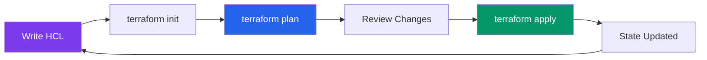

# Terraform

Terraform is HashiCorp's infrastructure-as-code tool that lets you define cloud resources in declarative configuration files, plan changes before applying them, and track the state of everything you have provisioned. It works across every major cloud provider, which makes it the closest thing to a universal language for infrastructure.

This section takes you from HCL syntax through production-grade infrastructure that runs real companies.

## Why Terraform Over Alternatives

CloudFormation locks you into AWS. Pulumi requires a general-purpose programming language, which is powerful but introduces all the complexity of a programming language into your infrastructure definitions. ARM templates are Azure-only and verbose. Terraform occupies a productive middle ground: a purpose-built language (HCL) that is simpler than a full programming language but expressive enough to model complex infrastructure, and it works everywhere.

The real advantage is the plan/apply workflow. Before Terraform touches anything, it shows you exactly what it will create, modify, or destroy. In a world where a misconfigured security group can expose a database to the internet, that preview step is not optional — it is essential.

## How These Pages Are Organized

| Page | What You Will Learn |
|---|---|
| [Fundamentals](./fundamentals) | HCL syntax, providers, resources, data sources, variables, outputs, locals, lifecycle rules, and the init/plan/apply/destroy workflow |
| [State Management](./state-management) | Remote state backends, state locking, state file internals, terraform import, and state manipulation commands |
| [Modules](./modules) | Module structure, versioning, composition patterns, the module registry, and testing with Terratest |
| [Workspaces](./workspaces) | Workspace-based vs directory-based environments, naming conventions, and when workspaces are appropriate |
| [AWS Startup Stack](./aws-startup-stack) | Complete production AWS infrastructure — VPC, ECS Fargate, RDS, ElastiCache, CloudFront, Route53, IAM, CloudWatch — in real HCL |
| [GCP Startup Stack](./gcp-startup-stack) | Complete production GCP infrastructure — VPC, Cloud Run, Cloud SQL, Memorystore, Cloud CDN, Cloud DNS, IAM — in real HCL |
| [Multi-Region](./multi-region) | Active-active and active-passive patterns, data replication, Route53 failover, Global Accelerator |
| [Security Hardening](./security-hardening) | Least-privilege IAM, security group design, encryption, VPC flow logs, GuardDuty, Config rules |
| [Cost Optimization](./cost-optimization) | Reserved instances, spot instances, right-sizing, auto-scaling, cost tagging, Cost Explorer integration |

## Prerequisites

Before diving in, make sure you have:

1. **Terraform CLI installed** — version 1.5 or later recommended
2. **Cloud provider credentials configured** — `aws configure` for AWS or `gcloud auth application-default login` for GCP
3. **A text editor with HCL support** — VS Code with the HashiCorp Terraform extension is the standard choice
4. **Basic cloud knowledge** — you should know what a VPC, subnet, and security group are conceptually, even if you have never created one

## The Terraform Workflow

Every Terraform operation follows this cycle:



Write your configuration, initialize providers, plan to see what will change, review the plan carefully, apply to make the changes, and repeat. This cycle applies whether you are creating your first EC2 instance or refactoring a multi-region deployment with hundreds of resources.

## Quick Start

If you want to see Terraform work before reading the full fundamentals page, here is the minimum viable configuration:

```hcl
# main.tf
terraform {
  required_version = ">= 1.5"
  required_providers {
    aws = {
      source  = "hashicorp/aws"
      version = "~> 5.0"
    }
  }
}

provider "aws" {
  region = "us-east-1"
}

resource "aws_s3_bucket" "example" {
  bucket = "my-first-terraform-bucket-unique-name"

  tags = {
    Environment = "learning"
    ManagedBy   = "terraform"
  }
}
```

Run `terraform init`, then `terraform plan`, then `terraform apply`. You now have an S3 bucket managed by Terraform. Run `terraform destroy` when you are done to clean up. That entire cycle — create, inspect, destroy — is Terraform in miniature.

## What You Will Build

By the end of this section, you will have the Terraform skills to:

- Provision a complete production environment on AWS or GCP from a single `terraform apply`
- Manage state safely across teams with remote backends and state locking
- Structure modules for reuse across projects and environments
- Handle multi-region deployments with proper failover
- Implement security best practices at the infrastructure layer
- Optimize cloud costs through right-sizing, reserved capacity, and intelligent tagging

Start with [Fundamentals](./fundamentals) if you are new to Terraform, or jump to [AWS Startup Stack](./aws-startup-stack) if you want production-ready infrastructure immediately.
