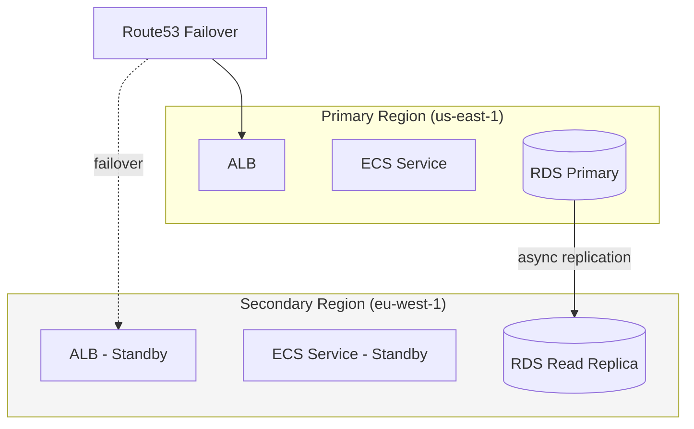
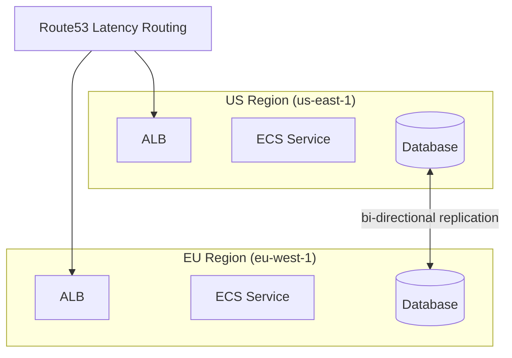

# Terraform Multi-Region Deployments

Running infrastructure in a single region means a single point of failure. When that region goes down — and it will, eventually — your entire application goes with it. Multi-region deployments eliminate this risk by distributing your infrastructure across geographically separate regions.

This page covers how to implement multi-region architectures in Terraform, from simple active-passive failover to full active-active deployments.

## Architecture Patterns

### Active-Passive

One region serves all traffic. The secondary region stays idle (or serves read-only traffic) and takes over only when the primary fails.



**Pros**: Lower cost (standby resources can be smaller), simpler data consistency
**Cons**: Failover takes minutes, standby resources may be cold, full region cost even if mostly idle

### Active-Active

Both regions serve traffic simultaneously. Users are routed to the nearest region.



**Pros**: Lower latency for global users, instant failover, no cold start issues
**Cons**: Higher cost (full infrastructure in both regions), data consistency challenges

## Terraform Multi-Region Architecture

### Provider Configuration

```hcl
# providers.tf
provider "aws" {
  region = "us-east-1"
  alias  = "us_east_1"

  default_tags {
    tags = local.common_tags
  }
}

provider "aws" {
  region = "eu-west-1"
  alias  = "eu_west_1"

  default_tags {
    tags = local.common_tags
  }
}

# For global resources (Route53, CloudFront, IAM)
provider "aws" {
  region = "us-east-1"
  alias  = "global"

  default_tags {
    tags = local.common_tags
  }
}
```

### Module-Based Multi-Region

The cleanest approach uses the same module for each region with different provider configurations:

```hcl
# variables.tf
variable "regions" {
  type = map(object({
    enabled         = bool
    is_primary      = bool
    vpc_cidr        = string
    instance_type   = string
    desired_count   = number
    min_count       = number
    max_count       = number
    db_multi_az     = bool
  }))

  default = {
    "us-east-1" = {
      enabled       = true
      is_primary    = true
      vpc_cidr      = "10.0.0.0/16"
      instance_type = "m5.large"
      desired_count = 3
      min_count     = 3
      max_count     = 10
      db_multi_az   = true
    }
    "eu-west-1" = {
      enabled       = true
      is_primary    = false
      vpc_cidr      = "10.1.0.0/16"
      instance_type = "m5.large"
      desired_count = 2
      min_count     = 2
      max_count     = 8
      db_multi_az   = true
    }
  }
}
```

```hcl
# main.tf
locals {
  primary_region   = [for k, v in var.regions : k if v.is_primary][0]
  secondary_regions = [for k, v in var.regions : k if !v.is_primary && v.enabled]
  all_active_regions = [for k, v in var.regions : k if v.enabled]
}

# ─── Primary Region ────────────────────────────────────────────────────────────

module "primary" {
  source = "./modules/regional-stack"

  providers = {
    aws = aws.us_east_1
  }

  project_name  = var.project_name
  environment   = var.environment
  region        = local.primary_region
  is_primary    = true
  vpc_cidr      = var.regions[local.primary_region].vpc_cidr
  instance_type = var.regions[local.primary_region].instance_type
  desired_count = var.regions[local.primary_region].desired_count
  min_count     = var.regions[local.primary_region].min_count
  max_count     = var.regions[local.primary_region].max_count
  db_multi_az   = var.regions[local.primary_region].db_multi_az
  app_image     = var.app_image
}

# ─── Secondary Region ──────────────────────────────────────────────────────────

module "secondary_eu" {
  source = "./modules/regional-stack"
  count  = var.regions["eu-west-1"].enabled ? 1 : 0

  providers = {
    aws = aws.eu_west_1
  }

  project_name  = var.project_name
  environment   = var.environment
  region        = "eu-west-1"
  is_primary    = false
  vpc_cidr      = var.regions["eu-west-1"].vpc_cidr
  instance_type = var.regions["eu-west-1"].instance_type
  desired_count = var.regions["eu-west-1"].desired_count
  min_count     = var.regions["eu-west-1"].min_count
  max_count     = var.regions["eu-west-1"].max_count
  db_multi_az   = var.regions["eu-west-1"].db_multi_az
  app_image     = var.app_image

  # Cross-region references
  primary_db_arn = module.primary.db_instance_arn
}
```

### Regional Stack Module

```hcl
# modules/regional-stack/main.tf

resource "aws_vpc" "main" {
  cidr_block           = var.vpc_cidr
  enable_dns_support   = true
  enable_dns_hostnames = true

  tags = {
    Name = "${var.project_name}-${var.environment}-${var.region}-vpc"
  }
}

# ... (VPC subnets, NAT gateways, security groups as in the startup stack)

# ─── ECS Cluster ────────────────────────────────────────────────────────────────

resource "aws_ecs_cluster" "main" {
  name = "${var.project_name}-${var.environment}-${var.region}"

  setting {
    name  = "containerInsights"
    value = "enabled"
  }
}

# ─── Database (Primary or Replica) ─────────────────────────────────────────────

resource "aws_db_instance" "main" {
  count = var.is_primary ? 1 : 0

  identifier     = "${var.project_name}-${var.environment}-${var.region}-db"
  engine         = "postgres"
  engine_version = "15.4"
  instance_class = "db.r5.large"

  allocated_storage     = 100
  max_allocated_storage = 500
  storage_encrypted     = true
  multi_az              = var.db_multi_az

  db_subnet_group_name   = aws_db_subnet_group.main.name
  vpc_security_group_ids = [aws_security_group.rds.id]

  backup_retention_period = 14
  # ... (other RDS config)
}

# Cross-region read replica
resource "aws_db_instance" "replica" {
  count = var.is_primary ? 0 : 1

  identifier          = "${var.project_name}-${var.environment}-${var.region}-db-replica"
  replicate_source_db = var.primary_db_arn
  instance_class      = "db.r5.large"
  storage_encrypted   = true
  multi_az            = var.db_multi_az

  vpc_security_group_ids = [aws_security_group.rds.id]

  # Cross-region replicas must specify these
  db_subnet_group_name = aws_db_subnet_group.main.name
  kms_key_id           = aws_kms_key.rds.arn

  # ... (other replica config)
}

# ─── Outputs for Cross-Region Wiring ───────────────────────────────────────────

output "alb_dns_name" {
  value = aws_lb.main.dns_name
}

output "alb_zone_id" {
  value = aws_lb.main.zone_id
}

output "db_instance_arn" {
  value = var.is_primary ? aws_db_instance.main[0].arn : aws_db_instance.replica[0].arn
}

output "vpc_id" {
  value = aws_vpc.main.id
}
```

## Route53 Routing Policies

### Failover Routing (Active-Passive)

```hcl
# route53-failover.tf

resource "aws_route53_health_check" "primary" {
  provider = aws.global

  fqdn              = module.primary.alb_dns_name
  port               = 443
  type               = "HTTPS"
  resource_path      = "/health"
  failure_threshold  = 3
  request_interval   = 10
  measure_latency    = true

  regions = ["us-east-1", "us-west-2", "eu-west-1"]

  tags = {
    Name = "${local.name_prefix}-primary-health-check"
  }
}

resource "aws_route53_health_check" "secondary" {
  provider = aws.global
  count    = length(module.secondary_eu) > 0 ? 1 : 0

  fqdn              = module.secondary_eu[0].alb_dns_name
  port               = 443
  type               = "HTTPS"
  resource_path      = "/health"
  failure_threshold  = 3
  request_interval   = 10

  tags = {
    Name = "${local.name_prefix}-secondary-health-check"
  }
}

resource "aws_route53_record" "primary" {
  provider = aws.global

  zone_id = var.hosted_zone_id
  name    = var.domain_name
  type    = "A"

  failover_routing_policy {
    type = "PRIMARY"
  }

  alias {
    name                   = module.primary.alb_dns_name
    zone_id                = module.primary.alb_zone_id
    evaluate_target_health = true
  }

  health_check_id = aws_route53_health_check.primary.id
  set_identifier  = "primary"
}

resource "aws_route53_record" "secondary" {
  provider = aws.global
  count    = length(module.secondary_eu) > 0 ? 1 : 0

  zone_id = var.hosted_zone_id
  name    = var.domain_name
  type    = "A"

  failover_routing_policy {
    type = "SECONDARY"
  }

  alias {
    name                   = module.secondary_eu[0].alb_dns_name
    zone_id                = module.secondary_eu[0].alb_zone_id
    evaluate_target_health = true
  }

  health_check_id = aws_route53_health_check.secondary[0].id
  set_identifier  = "secondary"
}
```

### Latency-Based Routing (Active-Active)

```hcl
# route53-latency.tf

resource "aws_route53_record" "latency" {
  for_each = {
    "us-east-1" = {
      dns_name = module.primary.alb_dns_name
      zone_id  = module.primary.alb_zone_id
      health   = aws_route53_health_check.primary.id
    }
    "eu-west-1" = {
      dns_name = length(module.secondary_eu) > 0 ? module.secondary_eu[0].alb_dns_name : ""
      zone_id  = length(module.secondary_eu) > 0 ? module.secondary_eu[0].alb_zone_id : ""
      health   = length(aws_route53_health_check.secondary) > 0 ? aws_route53_health_check.secondary[0].id : ""
    }
  }

  provider = aws.global

  zone_id = var.hosted_zone_id
  name    = var.domain_name
  type    = "A"

  latency_routing_policy {
    region = each.key
  }

  alias {
    name                   = each.value.dns_name
    zone_id                = each.value.zone_id
    evaluate_target_health = true
  }

  health_check_id = each.value.health
  set_identifier  = each.key
}
```

### Geolocation Routing

```hcl
# route53-geolocation.tf

resource "aws_route53_record" "geo_north_america" {
  provider = aws.global

  zone_id = var.hosted_zone_id
  name    = var.domain_name
  type    = "A"

  geolocation_routing_policy {
    continent = "NA"
  }

  alias {
    name                   = module.primary.alb_dns_name
    zone_id                = module.primary.alb_zone_id
    evaluate_target_health = true
  }

  set_identifier = "north-america"
}

resource "aws_route53_record" "geo_europe" {
  provider = aws.global
  count    = length(module.secondary_eu) > 0 ? 1 : 0

  zone_id = var.hosted_zone_id
  name    = var.domain_name
  type    = "A"

  geolocation_routing_policy {
    continent = "EU"
  }

  alias {
    name                   = module.secondary_eu[0].alb_dns_name
    zone_id                = module.secondary_eu[0].alb_zone_id
    evaluate_target_health = true
  }

  set_identifier = "europe"
}

# Default: route to primary for unmatched locations
resource "aws_route53_record" "geo_default" {
  provider = aws.global

  zone_id = var.hosted_zone_id
  name    = var.domain_name
  type    = "A"

  geolocation_routing_policy {
    country = "*"
  }

  alias {
    name                   = module.primary.alb_dns_name
    zone_id                = module.primary.alb_zone_id
    evaluate_target_health = true
  }

  set_identifier = "default"
}
```

## Global Accelerator

For lower latency and faster failover than DNS-based routing:

```hcl
# global-accelerator.tf

resource "aws_globalaccelerator_accelerator" "main" {
  name            = "${local.name_prefix}-accelerator"
  ip_address_type = "IPV4"
  enabled         = true

  attributes {
    flow_logs_enabled   = true
    flow_logs_s3_bucket = aws_s3_bucket.flow_logs.id
    flow_logs_s3_prefix = "global-accelerator/"
  }

  tags = {
    Name = "${local.name_prefix}-accelerator"
  }
}

resource "aws_globalaccelerator_listener" "https" {
  accelerator_arn = aws_globalaccelerator_accelerator.main.id
  protocol        = "TCP"

  port_range {
    from_port = 443
    to_port   = 443
  }
}

resource "aws_globalaccelerator_endpoint_group" "primary" {
  listener_arn = aws_globalaccelerator_listener.https.id

  endpoint_group_region         = "us-east-1"
  health_check_port             = 443
  health_check_protocol         = "HTTPS"
  health_check_path             = "/health"
  health_check_interval_seconds = 10
  threshold_count               = 3
  traffic_dial_percentage       = 100

  endpoint_configuration {
    endpoint_id                    = module.primary.alb_arn
    weight                         = 100
    client_ip_preservation_enabled = true
  }
}

resource "aws_globalaccelerator_endpoint_group" "secondary" {
  count = length(module.secondary_eu) > 0 ? 1 : 0

  listener_arn = aws_globalaccelerator_listener.https.id

  endpoint_group_region         = "eu-west-1"
  health_check_port             = 443
  health_check_protocol         = "HTTPS"
  health_check_path             = "/health"
  health_check_interval_seconds = 10
  threshold_count               = 3
  traffic_dial_percentage       = 100

  endpoint_configuration {
    endpoint_id                    = module.secondary_eu[0].alb_arn
    weight                         = 100
    client_ip_preservation_enabled = true
  }
}

# DNS record pointing to Global Accelerator
resource "aws_route53_record" "global_accelerator" {
  provider = aws.global

  zone_id = var.hosted_zone_id
  name    = var.domain_name
  type    = "A"

  alias {
    name                   = aws_globalaccelerator_accelerator.main.dns_name
    zone_id                = aws_globalaccelerator_accelerator.main.hosted_zone_id
    evaluate_target_health = true
  }
}
```

## Cross-Region Data Replication

### RDS Cross-Region Read Replica

```hcl
# The primary instance (in us-east-1)
resource "aws_db_instance" "primary" {
  provider = aws.us_east_1

  identifier     = "${local.name_prefix}-primary-db"
  engine         = "postgres"
  engine_version = "15.4"
  instance_class = "db.r5.large"
  # ... full configuration

  backup_retention_period = 14  # Required for cross-region replicas
}

# Cross-region replica (in eu-west-1)
resource "aws_db_instance" "replica_eu" {
  provider = aws.eu_west_1

  identifier          = "${local.name_prefix}-eu-db-replica"
  replicate_source_db = aws_db_instance.primary.arn

  instance_class    = "db.r5.large"
  storage_encrypted = true
  kms_key_id        = aws_kms_key.rds_eu.arn  # Must use a key in the replica region

  db_subnet_group_name   = module.secondary_eu[0].db_subnet_group_name
  vpc_security_group_ids = [module.secondary_eu[0].rds_security_group_id]
  multi_az               = true

  # Replica-specific settings
  auto_minor_version_upgrade = true
  skip_final_snapshot        = true
}
```

### DynamoDB Global Tables

```hcl
resource "aws_dynamodb_table" "sessions" {
  provider = aws.us_east_1

  name         = "${local.name_prefix}-sessions"
  billing_mode = "PAY_PER_REQUEST"
  hash_key     = "session_id"

  attribute {
    name = "session_id"
    type = "S"
  }

  ttl {
    attribute_name = "expires_at"
    enabled        = true
  }

  stream_enabled   = true
  stream_view_type = "NEW_AND_OLD_IMAGES"

  replica {
    region_name = "eu-west-1"
    kms_key_arn = aws_kms_key.dynamodb_eu.arn

    point_in_time_recovery {
      enabled = true
    }
  }

  tags = {
    Name = "${local.name_prefix}-sessions"
  }
}
```

### S3 Cross-Region Replication

```hcl
resource "aws_s3_bucket" "assets_primary" {
  provider = aws.us_east_1
  bucket   = "${local.name_prefix}-assets-us"
}

resource "aws_s3_bucket_versioning" "assets_primary" {
  provider = aws.us_east_1
  bucket   = aws_s3_bucket.assets_primary.id
  versioning_configuration {
    status = "Enabled"  # Required for replication
  }
}

resource "aws_s3_bucket" "assets_secondary" {
  provider = aws.eu_west_1
  bucket   = "${local.name_prefix}-assets-eu"
}

resource "aws_s3_bucket_versioning" "assets_secondary" {
  provider = aws.eu_west_1
  bucket   = aws_s3_bucket.assets_secondary.id
  versioning_configuration {
    status = "Enabled"
  }
}

resource "aws_iam_role" "s3_replication" {
  name = "${local.name_prefix}-s3-replication-role"

  assume_role_policy = jsonencode({
    Version = "2012-10-17"
    Statement = [{
      Action = "sts:AssumeRole"
      Effect = "Allow"
      Principal = {
        Service = "s3.amazonaws.com"
      }
    }]
  })
}

resource "aws_iam_role_policy" "s3_replication" {
  name = "${local.name_prefix}-s3-replication-policy"
  role = aws_iam_role.s3_replication.id

  policy = jsonencode({
    Version = "2012-10-17"
    Statement = [
      {
        Effect = "Allow"
        Action = [
          "s3:GetReplicationConfiguration",
          "s3:ListBucket"
        ]
        Resource = aws_s3_bucket.assets_primary.arn
      },
      {
        Effect = "Allow"
        Action = [
          "s3:GetObjectVersionForReplication",
          "s3:GetObjectVersionAcl",
          "s3:GetObjectVersionTagging"
        ]
        Resource = "${aws_s3_bucket.assets_primary.arn}/*"
      },
      {
        Effect = "Allow"
        Action = [
          "s3:ReplicateObject",
          "s3:ReplicateDelete",
          "s3:ReplicateTags"
        ]
        Resource = "${aws_s3_bucket.assets_secondary.arn}/*"
      }
    ]
  })
}

resource "aws_s3_bucket_replication_configuration" "assets" {
  provider = aws.us_east_1

  role   = aws_iam_role.s3_replication.arn
  bucket = aws_s3_bucket.assets_primary.id

  rule {
    id     = "replicate-all"
    status = "Enabled"

    destination {
      bucket        = aws_s3_bucket.assets_secondary.arn
      storage_class = "STANDARD"

      encryption_configuration {
        replica_kms_key_id = aws_kms_key.s3_eu.arn
      }
    }

    source_selection_criteria {
      sse_kms_encrypted_objects {
        status = "Enabled"
      }
    }
  }

  depends_on = [
    aws_s3_bucket_versioning.assets_primary,
    aws_s3_bucket_versioning.assets_secondary,
  ]
}
```

## VPC Peering Across Regions

```hcl
resource "aws_vpc_peering_connection" "cross_region" {
  provider = aws.us_east_1

  vpc_id      = module.primary.vpc_id
  peer_vpc_id = module.secondary_eu[0].vpc_id
  peer_region = "eu-west-1"
  auto_accept = false

  tags = {
    Name = "${local.name_prefix}-us-eu-peering"
  }
}

resource "aws_vpc_peering_connection_accepter" "cross_region" {
  provider = aws.eu_west_1

  vpc_peering_connection_id = aws_vpc_peering_connection.cross_region.id
  auto_accept               = true

  tags = {
    Name = "${local.name_prefix}-us-eu-peering"
  }
}

# Route from US to EU
resource "aws_route" "us_to_eu" {
  provider = aws.us_east_1
  count    = length(module.primary.private_route_table_ids)

  route_table_id            = module.primary.private_route_table_ids[count.index]
  destination_cidr_block    = var.regions["eu-west-1"].vpc_cidr
  vpc_peering_connection_id = aws_vpc_peering_connection.cross_region.id
}

# Route from EU to US
resource "aws_route" "eu_to_us" {
  provider = aws.eu_west_1
  count    = length(module.secondary_eu) > 0 ? length(module.secondary_eu[0].private_route_table_ids) : 0

  route_table_id            = module.secondary_eu[0].private_route_table_ids[count.index]
  destination_cidr_block    = var.regions["us-east-1"].vpc_cidr
  vpc_peering_connection_id = aws_vpc_peering_connection.cross_region.id
}
```

## Cost Implications

Multi-region deployments are expensive. Here is a realistic cost breakdown:

| Cost Category | Active-Passive | Active-Active |
|---|---|---|
| Compute (ECS/EC2) | 1.5x (standby at reduced capacity) | 2x |
| Database | 1.3x (cross-region replica) | 2x+ (with Global Tables) |
| NAT Gateways | 2x | 2x |
| Data Transfer | $0.02/GB cross-region | Higher (bi-directional replication) |
| Load Balancers | 2x | 2x |
| Global Accelerator | $0.025/hr + $0.015-0.035/GB | Same |
| Route53 Health Checks | $0.50/health check/month | Same |
| KMS Keys | Per-region keys needed | Same |
| **Estimated Total Multiplier** | **1.5-1.8x single region cost** | **2.0-2.5x single region cost** |

The biggest hidden cost is **cross-region data transfer**: $0.02/GB between most AWS regions. A database that replicates 100GB/day of WAL logs costs $60/month in transfer alone. Application-to-application communication across regions adds more.

## Decision Framework

Only go multi-region if:

1. **Your SLA requires it** — 99.99% uptime (52 minutes downtime/year) generally requires multi-region
2. **Users are geographically distributed** — latency matters and your users span continents
3. **Regulatory requirements mandate it** — data residency laws require infrastructure in specific regions
4. **The business impact of downtime exceeds the cost** — if an hour of downtime costs more than a month of multi-region infrastructure

Most startups do not need multi-region until they have significant revenue and global users. Start with multi-AZ in a single region, which provides 99.95%+ availability at a fraction of the cost.

## What to Learn Next

- **[Security Hardening](./security-hardening)** — secure your multi-region infrastructure
- **[Cost Optimization](./cost-optimization)** — reduce the cost of multi-region deployments
- **[Multi-Region Architecture Patterns](/infrastructure/multi-region/architecture-patterns)** — deeper dive into active-active and cell-based architectures
