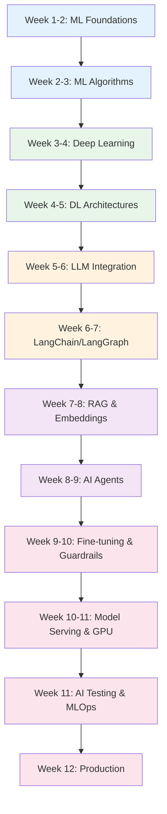

# AI/ML Engineer Learning Path

A structured 12-week journey through the Knowledge Vault for engineers building AI/ML-powered products. This path covers ML fundamentals (30 pages), deep learning (25 pages), LangChain/LangGraph mega guides, fine-tuning, guardrails, AI testing, model serving, GPU infrastructure, RAG architecture, AI agents, and production MLOps.

## Who This Is For

- Software engineers transitioning into AI/ML engineering roles
- Backend engineers adding AI capabilities to existing products
- Data scientists who want to learn the engineering side of ML
- Anyone building LLM-powered applications in production

## Prerequisites

- Solid programming skills (Python + one backend language)
- Basic understanding of APIs and databases
- Basic math (linear algebra, calculus, probability) -- or willingness to learn
- No prior ML experience required

**Total estimated time**: ~60 hours across 12 weeks

## Learning Progression

---

## Week 1-2: ML Foundations (Part 1 of 30 pages)

*Estimated reading time: 6 hours*

Build the math and conceptual foundations before touching models.

- [ ] **Required** -- [Machine Learning Overview](/machine-learning/) *(15 min)*
- [ ] **Required** -- [Math Foundations](/machine-learning/math-foundations) *(35 min)*
- [ ] **Required** -- [ML Workflow](/machine-learning/ml-workflow) *(25 min)*
- [ ] **Required** -- [Python ML Ecosystem](/machine-learning/python-ml-ecosystem) *(25 min)*
- [ ] **Required** -- [Data Preparation](/machine-learning/data-preparation) *(25 min)*
- [ ] **Required** -- [Linear Regression](/machine-learning/linear-regression) *(30 min)*
- [ ] **Required** -- [Logistic Regression](/machine-learning/logistic-regression) *(25 min)*
- [ ] **Required** -- [Evaluation Metrics](/machine-learning/evaluation-metrics) *(25 min)*
- [ ] **Required** -- [Cross-Validation](/machine-learning/cross-validation) *(20 min)*
- [ ] **Required** -- [Model Selection](/machine-learning/model-selection) *(25 min)*
- [ ] **Reference** -- [Scikit-learn Cheat Sheet](/cheat-sheets/scikit-learn) *(10 min)*
- [ ] **Reference** -- [Python Cheat Sheet](/cheat-sheets/python) *(10 min)*

::: tip Checkpoint
After this section you should be able to: explain the ML workflow, implement linear and logistic regression, evaluate models with precision/recall/F1/AUC, and perform cross-validation correctly.
:::

---

## Week 2-3: ML Algorithms (Part 2 of 30 pages)

*Estimated reading time: 6 hours*

Master the classical ML algorithms that form the foundation of modern AI.

- [ ] **Required** -- [Decision Trees](/machine-learning/decision-trees) *(25 min)*
- [ ] **Required** -- [Random Forests](/machine-learning/random-forests) *(25 min)*
- [ ] **Required** -- [Gradient Boosting](/machine-learning/gradient-boosting) *(30 min)*
- [ ] **Required** -- [Ensemble Methods](/machine-learning/ensemble-methods) *(25 min)*
- [ ] **Required** -- [SVM](/machine-learning/svm) *(25 min)*
- [ ] **Required** -- [KNN](/machine-learning/knn) *(20 min)*
- [ ] **Required** -- [Naive Bayes](/machine-learning/naive-bayes) *(20 min)*
- [ ] **Required** -- [Clustering](/machine-learning/clustering) *(25 min)*
- [ ] **Required** -- [Hyperparameter Tuning](/machine-learning/hyperparameter-tuning) *(25 min)*
- [ ] **Required** -- [Algorithm Selection Guide](/machine-learning/algorithm-selection-guide) *(20 min)*
- [ ] **Optional** -- [Feature Engineering Advanced](/machine-learning/feature-engineering-advanced) *(25 min)*
- [ ] **Optional** -- [Dimensionality Reduction](/machine-learning/dimensionality-reduction) *(25 min)*
- [ ] **Optional** -- [Anomaly Detection](/machine-learning/anomaly-detection) *(20 min)*
- [ ] **Optional** -- [Recommendation Systems](/machine-learning/recommendation-systems) *(25 min)*
- [ ] **Optional** -- [Time Series ML](/machine-learning/time-series-ml) *(25 min)*
- [ ] **Optional** -- [ML Interpretability](/machine-learning/ml-interpretability) *(25 min)*
- [ ] **Optional** -- [ML Checklist](/machine-learning/ml-checklist) *(15 min)*
- [ ] **Optional** -- [Topic Modeling](/machine-learning/topic-modeling) *(20 min)*
- [ ] **Optional** -- [Association Rules](/machine-learning/association-rules) *(15 min)*

::: tip Checkpoint
After this section you should be able to: choose the right algorithm for a given problem, tune hyperparameters with grid/random/Bayesian search, and explain the bias-variance tradeoff.
:::

---

## Week 3-4: Deep Learning Foundations

*Estimated reading time: 5 hours*

Transition from classical ML to deep learning. Understand neural networks, PyTorch, and training techniques.

- [ ] **Required** -- [Deep Learning Overview](/deep-learning/) *(15 min)*
- [ ] **Required** -- [Neural Network Basics](/deep-learning/neural-network-basics) *(35 min)*
- [ ] **Required** -- [PyTorch Fundamentals](/deep-learning/pytorch-fundamentals) *(30 min)*
- [ ] **Required** -- [Training Techniques](/deep-learning/training-techniques) *(25 min)*
- [ ] **Required** -- [Architecture Selection Guide](/deep-learning/architecture-selection-guide) *(25 min)*
- [ ] **Required** -- [Transfer Learning](/deep-learning/transfer-learning) *(25 min)*
- [ ] **Required** -- [DL Checklist](/deep-learning/dl-checklist) *(20 min)*

::: tip Checkpoint
After this section you should be able to: implement neural networks in PyTorch, apply training techniques (BatchNorm, dropout, LR scheduling), and choose the right architecture for a given task.
:::

---

## Week 4-5: DL Architectures (Part 2 of 25 pages)

*Estimated reading time: 6 hours*

Master the architectures that power modern AI: CNNs, RNNs, Transformers, and generative models.

- [ ] **Required** -- [Transformers](/deep-learning/transformers) *(30 min)*
- [ ] **Required** -- [Language Models](/deep-learning/language-models) *(30 min)*
- [ ] **Required** -- [BERT Family](/deep-learning/bert-family) *(25 min)*
- [ ] **Required** -- [NLP Fundamentals](/deep-learning/nlp-fundamentals) *(25 min)*
- [ ] **Required** -- [Text Generation](/deep-learning/text-generation) *(25 min)*
- [ ] **Optional** -- [CNN](/deep-learning/cnn) *(25 min)*
- [ ] **Optional** -- [RNN & LSTM](/deep-learning/rnn-lstm) *(25 min)*
- [ ] **Optional** -- [Diffusion Models](/deep-learning/diffusion-models) *(25 min)*
- [ ] **Optional** -- [GANs](/deep-learning/gans) *(25 min)*
- [ ] **Optional** -- [Multimodal Models](/deep-learning/multimodal-models) *(25 min)*
- [ ] **Optional** -- [Model Optimization](/deep-learning/model-optimization) *(25 min)*
- [ ] **Optional** -- [Reinforcement Learning](/deep-learning/reinforcement-learning) *(25 min)*
- [ ] **Optional** -- [Papers Reading List](/deep-learning/papers-reading-list) *(20 min)*

::: tip Checkpoint
After this section you should be able to: explain transformer attention mechanism, understand the difference between BERT and GPT architectures, and fine-tune pretrained models.
:::

---

## Week 5-6: LLM Integration

*Estimated reading time: 5 hours*

Integrate LLMs into production with proper engineering around prompts, rate limits, costs, and fallbacks.

- [ ] **Required** -- [AI/ML Engineering Overview](/ai-ml-engineering/) *(15 min)*
- [ ] **Required** -- [LLM Integration](/ai-ml-engineering/llm-integration) *(35 min)*
- [ ] **Required** -- [OpenAI API](/ai-ml-engineering/openai-api) *(25 min)*
- [ ] **Required** -- [Anthropic Claude API](/ai-ml-engineering/anthropic-claude-api) *(25 min)*
- [ ] **Required** -- [Prompt Engineering Advanced](/ai-ml-engineering/prompt-engineering-advanced) *(30 min)*
- [ ] **Required** -- [Prompt Caching](/ai-ml-engineering/prompt-caching) *(20 min)*
- [ ] **Required** -- [Multimodal AI](/ai-ml-engineering/multimodal-ai) *(25 min)*
- [ ] **Optional** -- [Vercel AI SDK](/ai-ml-engineering/vercel-ai-sdk) *(20 min)*
- [ ] **Optional** -- [HuggingFace](/ai-ml-engineering/huggingface) *(25 min)*
- [ ] **Reference** -- [LLM APIs Cheat Sheet](/cheat-sheets/llm-apis) *(10 min)*

::: tip Checkpoint
After this section you should be able to: build production LLM integrations with caching and fallbacks, implement advanced prompt engineering, and manage token budgets and costs.
:::

---

## Week 6-7: LangChain & LangGraph

*Estimated reading time: 5 hours*

LangChain and LangGraph are the dominant frameworks for building LLM-powered applications.

- [ ] **Required** -- [LangChain](/ai-ml-engineering/langchain) *(40 min)*
- [ ] **Required** -- [LangGraph](/ai-ml-engineering/langgraph) *(40 min)*
- [ ] **Required** -- [LangSmith](/ai-ml-engineering/langsmith) *(25 min)*
- [ ] **Required** -- [LlamaIndex](/ai-ml-engineering/llamaindex) *(30 min)*
- [ ] **Required** -- [CrewAI & AutoGen](/ai-ml-engineering/crewai-autogen) *(25 min)*

**Comparisons:**

- [ ] **Required** -- [LangChain vs LlamaIndex](/comparisons/langchain-vs-llamaindex) *(20 min)*
- [ ] **Required** -- [OpenAI vs Anthropic vs Google](/comparisons/openai-vs-anthropic-vs-google) *(20 min)*

::: tip Checkpoint
After this section you should be able to: build complex LLM applications with LangChain, implement stateful multi-step agents with LangGraph, trace and debug with LangSmith, and choose between frameworks.
:::

---

## Week 7-8: RAG & Embeddings

*Estimated reading time: 5 hours*

RAG is the dominant pattern for building AI products that answer questions from private data.

- [ ] **Required** -- [RAG Architecture](/ai-ml-engineering/rag-architecture) *(40 min)*
- [ ] **Required** -- [Embeddings](/ai-ml-engineering/embeddings) *(35 min)*
- [ ] **Required** -- [Vector Databases](/ai-ml-engineering/vector-databases) *(35 min)*
- [ ] **Required** -- [Data Annotation](/ai-ml-engineering/data-annotation) *(25 min)*
- [ ] **Required** -- [Search Service Blueprint](/production-blueprints/search-service/) *(40 min)*
- [ ] **Optional** -- [Elasticsearch Internals](/system-design/databases/elasticsearch-internals) *(25 min)*

::: tip Checkpoint
After this section you should be able to: design a complete RAG pipeline, implement hybrid search (vector + keyword), choose chunking strategies, and evaluate retrieval quality.
:::

---

## Week 8-9: AI Agents

*Estimated reading time: 4 hours*

AI agents use LLMs to plan and execute multi-step tasks with tools.

- [ ] **Required** -- [AI Agents](/ai-ml-engineering/ai-agents) *(40 min)*
- [ ] **Required** -- [LLM Integration](/ai-ml-engineering/llm-integration) *(35 min -- focus on function calling)*
- [ ] **Required** -- [AI in Production](/ai-ml-engineering/ai-in-production) *(30 min)*
- [ ] **Optional** -- [Job Queue Blueprint](/production-blueprints/job-queue/) *(40 min)*
- [ ] **Optional** -- [Circuit Breaker](/system-design/distributed-systems/circuit-breaker) *(20 min)*

::: tip Checkpoint
After this section you should be able to: build ReAct and Plan-Execute agents, implement guardrails and human-in-the-loop, and debug agent reasoning traces.
:::

---

## Week 9-10: Fine-Tuning & Guardrails

*Estimated reading time: 5 hours*

Customize models for your domain and keep them safe in production.

- [ ] **Required** -- [Fine-Tuning](/ai-ml-engineering/fine-tuning) *(35 min)*
- [ ] **Required** -- [AI Guardrails](/ai-ml-engineering/ai-guardrails) *(30 min)*
- [ ] **Required** -- [AI Testing](/ai-ml-engineering/ai-testing) *(30 min)*
- [ ] **Required** -- [ML Pipelines](/ai-ml-engineering/ml-pipelines) *(30 min)*
- [ ] **Optional** -- [Model Optimization](/deep-learning/model-optimization) *(25 min)*
- [ ] **Optional** -- [Text Generation](/deep-learning/text-generation) *(25 min -- focus on RLHF/DPO)*

::: tip Checkpoint
After this section you should be able to: fine-tune models with LoRA/QLoRA, implement content safety guardrails, design AI evaluation suites, and build reproducible ML pipelines.
:::

---

## Week 10-11: Model Serving & GPU Infrastructure

*Estimated reading time: 5 hours*

Deploy and serve models at scale with proper GPU management and infrastructure.

- [ ] **Required** -- [Model Serving](/infrastructure/ai-infrastructure/model-serving) *(30 min)*
- [ ] **Required** -- [GPU Kubernetes](/infrastructure/ai-infrastructure/gpu-kubernetes) *(30 min)*
- [ ] **Required** -- [AI Infrastructure Overview](/infrastructure/ai-infrastructure/) *(15 min)*
- [ ] **Required** -- [Docker Overview](/infrastructure/docker/) *(15 min)*
- [ ] **Required** -- [Production Dockerfiles](/infrastructure/docker/production-dockerfiles) *(25 min)*
- [ ] **Required** -- [Kubernetes Overview](/infrastructure/kubernetes/) *(15 min)*
- [ ] **Required** -- [HPA, VPA & KEDA](/infrastructure/kubernetes/hpa-vpa-keda) *(25 min)*
- [ ] **Optional** -- [AWS Lambda](/infrastructure/aws/lambda) *(25 min)*
- [ ] **Optional** -- [GCP Cloud Run](/infrastructure/gcp/cloud-run) *(25 min)*
- [ ] **Optional** -- [Serverless Patterns](/architecture-patterns/cloud-native/serverless-patterns) *(25 min)*

::: tip Checkpoint
After this section you should be able to: deploy model serving endpoints with auto-scaling, manage GPU resources on Kubernetes, containerize ML models, and choose between serverless and container-based inference.
:::

---

## Week 11: AI Testing & MLOps

*Estimated reading time: 4 hours*

- [ ] **Required** -- [AI Testing](/ai-ml-engineering/ai-testing) *(30 min -- deep read)*
- [ ] **Required** -- [Test Architecture](/testing/test-architecture) *(25 min)*
- [ ] **Required** -- [Integration Testing](/testing/integration-testing) *(25 min)*
- [ ] **Required** -- [CI/CD Overview](/infrastructure/ci-cd/) *(15 min)*
- [ ] **Required** -- [GitHub Actions Deep Dive](/infrastructure/ci-cd/github-actions-deep-dive) *(30 min)*
- [ ] **Optional** -- [Property-Based Testing](/testing/property-based-testing) *(25 min)*

---

## Week 12: Production Blueprints & Capstone

*Estimated reading time: 4 hours*

- [ ] **Required** -- [Search Service Blueprint](/production-blueprints/search-service/) *(40 min)*
- [ ] **Required** -- [Analytics Pipeline Blueprint](/production-blueprints/analytics-pipeline/) *(40 min)*
- [ ] **Required** -- [Feature Flag Blueprint](/production-blueprints/feature-flag-service/) *(35 min)*
- [ ] **Optional** -- [Chat Service Blueprint](/production-blueprints/chat-service/) *(35 min)*
- [ ] **Optional** -- [Notification Service Blueprint](/production-blueprints/notification-service/) *(35 min)*

---

## What You Will Be Able to Do After This Path

- Implement and evaluate classical ML algorithms (30 pages of foundations)
- Build and train deep learning models (25 pages of architectures)
- Integrate LLMs with LangChain, LangGraph, and LlamaIndex
- Design and build RAG pipelines with vector databases
- Fine-tune models with LoRA and evaluate with custom benchmarks
- Implement AI guardrails for content safety and hallucination prevention
- Serve models at scale on GPU Kubernetes clusters
- Build end-to-end AI testing and monitoring pipelines

## Cross-References to Related Paths

- **[ML/DL Engineer Path](/learning-paths/ml-dl-engineer)** -- Deep dive into DL architectures and research
- **[Data Scientist Path](/learning-paths/data-scientist)** -- Math foundations, EDA, and statistical modeling
- **[Data Engineer Path](/learning-paths/data-engineer)** -- Data pipelines that feed ML systems
- **[Backend Engineer Path](/learning-paths/backend-engineer)** -- APIs and infrastructure for AI products
- **[Platform Engineer Path](/learning-paths/platform-engineer)** -- GPU infrastructure and model serving platforms

---

::: info Total Progress
This path contains approximately 120 pages (30 ML + 25 DL + 25 AI engineering + 40 infrastructure/blueprints). Budget 12 weeks at 5 hours per week. The ML + DL foundations (weeks 1-5) are essential before diving into LLM integration.
:::
