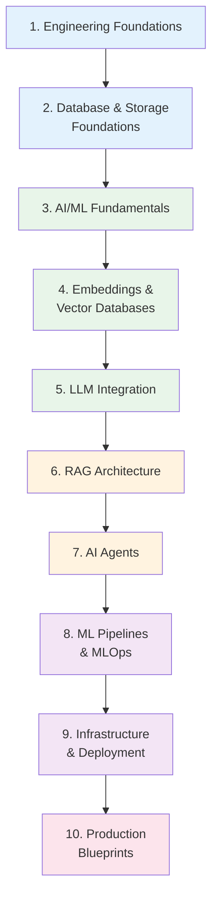
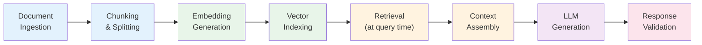

# AI/ML Engineer Learning Path

A structured journey through the Knowledge Vault for engineers building AI/ML-powered products. This path covers the engineering side of AI — not the math of training models from scratch, but how to integrate LLMs, build RAG pipelines, design embedding systems, deploy AI agents, and operate ML systems in production.

The AI/ML engineer of 2026 is not a researcher writing papers. They are a software engineer who knows how to use foundation models, build retrieval-augmented systems, and ship AI features that work reliably at scale.

**Total estimated time**: ~40 hours across 10 sections

**Prerequisites**: Solid programming skills (Python + one backend language). Basic understanding of APIs and databases. No prior ML experience required — we start from fundamentals and build up.

## Learning Progression

---

## Section 1: Engineering Foundations

*Estimated reading time: 4 hours*

AI/ML engineering is software engineering first. Before touching models, make sure your engineering fundamentals are solid.

- [ ] **Required** — [REST API Best Practices](/system-design/api-design/rest-best-practices) *(25 min)*
- [ ] **Required** — [API Versioning](/system-design/api-design/api-versioning) *(20 min)*
- [ ] **Required** — [Webhook Design Patterns](/system-design/api-design/webhooks) *(20 min)*
- [ ] **Required** — [Caching Strategies](/system-design/caching/caching-strategies) *(25 min)*
- [ ] **Required** — [Queue Selection Guide](/system-design/message-queues/queue-selection-guide) *(20 min)*
- [ ] **Required** — [Circuit Breaker](/system-design/distributed-systems/circuit-breaker) *(20 min)*
- [ ] **Optional** — [Rate Limiting](/system-design/distributed-systems/rate-limiting) *(25 min)*
- [ ] **Optional** — [API Security Patterns](/system-design/api-design/api-security-patterns) *(25 min)*
- [ ] **Reference** — [Python Cheat Sheet](/cheat-sheets/python) *(10 min)*

::: tip Checkpoint
After this section you should be able to: design clean REST APIs for AI features, implement caching for expensive model inference calls, use queues for async processing of long-running ML tasks, and protect external API calls with circuit breakers (essential for LLM API calls).
:::

---

## Section 2: Database & Storage Foundations

*Estimated reading time: 4 hours*

AI systems are data-hungry. Understanding databases and storage is critical for building data pipelines that feed ML models and for storing embeddings efficiently.

- [ ] **Required** — [Database Selection Guide](/system-design/databases/database-selection-guide) *(20 min)*
- [ ] **Required** — [PostgreSQL Internals](/system-design/databases/postgres-internals) *(35 min)*
- [ ] **Required** — [Indexing Deep Dive](/system-design/databases/indexing-deep-dive) *(30 min)*
- [ ] **Required** — [Redis Internals](/system-design/databases/redis-internals) *(25 min)*
- [ ] **Required** — [Elasticsearch Internals](/system-design/databases/elasticsearch-internals) *(25 min)*
- [ ] **Optional** — [MongoDB Internals](/system-design/databases/mongodb-internals) *(25 min)*
- [ ] **Optional** — [DynamoDB Internals](/system-design/databases/dynamodb-internals) *(25 min)*

::: tip Checkpoint
After this section you should be able to: choose the right database for different AI workloads (PostgreSQL for structured data, Redis for caching, Elasticsearch for full-text search), understand indexing strategies that will matter when we get to vector indexes, and design data storage for ML training data and feature stores.
:::

---

## Section 3: AI/ML Fundamentals

*Estimated reading time: 4 hours*

This section covers the AI/ML concepts every engineer needs, focused on practical understanding rather than mathematical rigor.

- [ ] **Required** — [AI/ML Engineering Overview](/ai-ml-engineering/) *(15 min)*
- [ ] **Required** — [Embeddings](/ai-ml-engineering/embeddings) *(35 min)*
- [ ] **Required** — [Vector Databases](/ai-ml-engineering/vector-databases) *(35 min)*
- [ ] **Required** — [LLM Integration](/ai-ml-engineering/llm-integration) *(35 min)*
- [ ] **Required** — [ML Pipelines](/ai-ml-engineering/ml-pipelines) *(30 min)*

::: tip Checkpoint
After this section you should be able to: explain what embeddings are and why they matter, understand the difference between classification, regression, and generative models, describe how LLMs work at a high level (transformers, attention, tokens), and articulate the ML pipeline stages (data, training, evaluation, serving).
:::

---

## Section 4: Embeddings & Vector Databases

*Estimated reading time: 5 hours*

Embeddings are the foundation of modern AI search, recommendation, and RAG systems. This section goes deep on how to generate, store, and query embeddings at scale.

- [ ] **Required** — [Embeddings](/ai-ml-engineering/embeddings) *(35 min — re-read for depth)*
- [ ] **Required** — [Vector Databases](/ai-ml-engineering/vector-databases) *(35 min — re-read for depth)*
- [ ] **Required** — [Consistent Hashing](/system-design/distributed-systems/consistent-hashing) *(25 min)*
- [ ] **Required** — [Bloom Filters](/system-design/distributed-systems/bloom-filters) *(20 min)*
- [ ] **Optional** — [Cache Sizing Math](/system-design/caching/cache-sizing-math) *(20 min)*
- [ ] **Optional** — [Redis Caching Patterns](/system-design/caching/redis-caching-patterns) *(25 min)*

Key concepts to understand:

| Concept | Why It Matters |
|---|---|
| **HNSW index** | The dominant algorithm for approximate nearest neighbor search in production |
| **IVF index** | Alternative to HNSW for very large datasets with memory constraints |
| **Embedding dimensions** | Trade-off between quality and storage/compute cost |
| **Distance metrics** | Cosine similarity vs L2 vs dot product — choose based on model |
| **Quantization** | Reduce memory 4-8x with minimal quality loss |

::: tip Checkpoint
After this section you should be able to: generate embeddings using OpenAI/Cohere/open-source models, choose between HNSW and IVF indexes for different scale requirements, calculate storage requirements for an embedding collection, and implement semantic search using vector similarity.
:::

---

## Section 5: LLM Integration

*Estimated reading time: 5 hours*

Integrating LLMs into production applications requires careful engineering around prompts, context windows, rate limits, costs, and fallbacks.

- [ ] **Required** — [LLM Integration](/ai-ml-engineering/llm-integration) *(35 min — deep read)*
- [ ] **Required** — [Rate Limiting](/system-design/distributed-systems/rate-limiting) *(25 min)*
- [ ] **Required** — [Circuit Breaker](/system-design/distributed-systems/circuit-breaker) *(20 min)*
- [ ] **Required** — [Caching Strategies](/system-design/caching/caching-strategies) *(25 min)*
- [ ] **Required** — [Redis Caching Patterns](/system-design/caching/redis-caching-patterns) *(25 min)*
- [ ] **Optional** — [Thundering Herd](/system-design/caching/thundering-herd) *(20 min)*
- [ ] **Optional** — [Input Validation](/security/api-security/input-validation) *(25 min)*

Key LLM engineering patterns:

| Pattern | Purpose |
|---|---|
| **Semantic caching** | Cache by embedding similarity, not exact query match |
| **Prompt templating** | Separate prompt logic from business logic |
| **Token budgeting** | Manage context window limits programmatically |
| **Fallback chains** | GPT-4 -> GPT-3.5 -> cached response -> graceful degradation |
| **Output validation** | Structured output with Zod/Pydantic parsing |
| **Streaming** | SSE for real-time token delivery to UI |

::: tip Checkpoint
After this section you should be able to: build a production LLM integration with caching, rate limiting, and fallbacks, implement semantic caching to reduce LLM API costs by 30-60%, handle streaming responses for real-time UI, and validate/parse structured LLM outputs reliably.
:::

---

## Section 6: RAG Architecture

*Estimated reading time: 5 hours*

Retrieval-Augmented Generation (RAG) is the dominant pattern for building AI products that answer questions from private data. It combines search (retrieval) with LLMs (generation).

- [ ] **Required** — [RAG Architecture](/ai-ml-engineering/rag-architecture) *(40 min)*
- [ ] **Required** — [Vector Databases](/ai-ml-engineering/vector-databases) *(35 min — focus on retrieval)*
- [ ] **Required** — [Embeddings](/ai-ml-engineering/embeddings) *(35 min — focus on chunking)*
- [ ] **Required** — [Search Service Blueprint](/production-blueprints/search-service/) *(40 min)*
- [ ] **Optional** — [Elasticsearch Internals](/system-design/databases/elasticsearch-internals) *(25 min)*
- [ ] **Optional** — [Multi-Layer Caching](/system-design/caching/multi-layer-caching) *(20 min)*

RAG pipeline stages:

::: tip Checkpoint
After this section you should be able to: design a complete RAG pipeline from document ingestion to answer generation, choose chunking strategies based on document type (recursive, semantic, paragraph), implement hybrid search (vector + keyword) for better retrieval, and evaluate RAG quality with metrics like context relevance and answer faithfulness.
:::

---

## Section 7: AI Agents

*Estimated reading time: 4 hours*

AI agents are systems that use LLMs to plan and execute multi-step tasks with tools. They go beyond simple prompt-response patterns to autonomous reasoning and action.

- [ ] **Required** — [AI Agents](/ai-ml-engineering/ai-agents) *(40 min)*
- [ ] **Required** — [LLM Integration](/ai-ml-engineering/llm-integration) *(35 min — focus on function calling)*
- [ ] **Required** — [Webhook Design](/system-design/api-design/webhooks) *(20 min)*
- [ ] **Optional** — [Job Queue Blueprint](/production-blueprints/job-queue/) *(40 min)*
- [ ] **Optional** — [Circuit Breaker](/system-design/distributed-systems/circuit-breaker) *(20 min)*

Agent architecture patterns:

| Pattern | Description | Use Case |
|---|---|---|
| **ReAct** | Reason-Act loop with tool calls | General-purpose agent |
| **Plan-Execute** | Plan first, then execute steps | Complex multi-step tasks |
| **Tool-Use** | LLM selects and calls tools | API integrations |
| **Multi-Agent** | Multiple specialized agents collaborate | Complex workflows |
| **Human-in-the-Loop** | Agent pauses for human approval | High-stakes decisions |

::: tip Checkpoint
After this section you should be able to: build an agent that uses tools (APIs, databases, file systems), implement guardrails to prevent runaway agent execution, design human-in-the-loop approval for sensitive actions, and debug agent reasoning traces.
:::

---

## Section 8: ML Pipelines & MLOps

*Estimated reading time: 4 hours*

Moving from notebooks to production requires engineering discipline — versioning, testing, monitoring, and automation for ML systems.

- [ ] **Required** — [ML Pipelines](/ai-ml-engineering/ml-pipelines) *(30 min — deep read)*
- [ ] **Required** — [CI/CD Overview](/infrastructure/ci-cd/) *(15 min)*
- [ ] **Required** — [GitHub Actions Deep Dive](/infrastructure/ci-cd/github-actions-deep-dive) *(30 min)*
- [ ] **Required** — [Test Architecture](/testing/test-architecture) *(25 min)*
- [ ] **Required** — [Integration Testing](/testing/integration-testing) *(25 min)*
- [ ] **Optional** — [Pipeline Patterns (CI/CD)](/infrastructure/ci-cd/pipeline-patterns) *(25 min)*
- [ ] **Optional** — [Environment Promotion](/infrastructure/ci-cd/environment-promotion) *(20 min)*

Key MLOps concepts:

| Concept | Description |
|---|---|
| **Model versioning** | Track model artifacts, hyperparameters, and training data |
| **Experiment tracking** | Compare model versions with metrics and visualizations |
| **Feature stores** | Centralized, versioned feature computation and serving |
| **Model serving** | REST/gRPC endpoints for real-time inference |
| **Model monitoring** | Detect data drift, concept drift, and performance degradation |
| **A/B testing** | Compare model versions in production |

::: tip Checkpoint
After this section you should be able to: set up CI/CD for ML model training and deployment, implement model versioning and experiment tracking, design integration tests for ML pipelines, and explain the difference between data drift and concept drift.
:::

---

## Section 9: Infrastructure & Deployment

*Estimated reading time: 4 hours*

AI/ML workloads have unique infrastructure requirements — GPU scheduling, large model serving, and cost management.

- [ ] **Required** — [Docker Overview](/infrastructure/docker/) *(15 min)*
- [ ] **Required** — [Production Dockerfiles](/infrastructure/docker/production-dockerfiles) *(25 min)*
- [ ] **Required** — [Kubernetes Overview](/infrastructure/kubernetes/) *(15 min)*
- [ ] **Required** — [Deployments & StatefulSets](/infrastructure/kubernetes/deployments-statefulsets) *(30 min)*
- [ ] **Required** — [HPA, VPA & KEDA](/infrastructure/kubernetes/hpa-vpa-keda) *(25 min)*
- [ ] **Optional** — [AWS Lambda](/infrastructure/aws/lambda) *(25 min)*
- [ ] **Optional** — [GCP Cloud Run](/infrastructure/gcp/cloud-run) *(25 min)*
- [ ] **Optional** — [Serverless Patterns](/architecture-patterns/cloud-native/serverless-patterns) *(25 min)*
- [ ] **Reference** — [Docker Cheat Sheet](/cheat-sheets/docker) *(10 min)*
- [ ] **Reference** — [Kubernetes Cheat Sheet](/cheat-sheets/kubernetes) *(10 min)*

::: tip Checkpoint
After this section you should be able to: containerize ML models for reproducible deployment, deploy model serving endpoints on Kubernetes with auto-scaling, understand when to use serverless (Lambda/Cloud Run) vs containers for inference, and manage GPU resources efficiently.
:::

---

## Section 10: Production Blueprints

*Estimated reading time: 4 hours*

Study production systems that integrate AI/ML concepts with real-world engineering constraints.

- [ ] **Required** — [Search Service Blueprint](/production-blueprints/search-service/) *(40 min)*
- [ ] **Required** — [Analytics Pipeline Blueprint](/production-blueprints/analytics-pipeline/) *(40 min)*
- [ ] **Required** — [Feature Flag Blueprint](/production-blueprints/feature-flag-service/) *(35 min)*
- [ ] **Optional** — [Notification Service Blueprint](/production-blueprints/notification-service/) *(35 min)*
- [ ] **Optional** — [Chat Service Blueprint](/production-blueprints/chat-service/) *(35 min)*

### Suggested Capstone Project

Build an AI-powered Q&A system:

1. **Ingest**: Load a documentation corpus (Markdown files, PDFs)
2. **Process**: Chunk documents, generate embeddings, store in a vector database
3. **Retrieve**: Implement hybrid search (vector + keyword) with re-ranking
4. **Generate**: Use an LLM with retrieved context to answer questions
5. **Evaluate**: Measure retrieval quality and answer faithfulness
6. **Deploy**: Containerize and deploy with a REST API and streaming responses
7. **Monitor**: Track latency, costs, retrieval quality, and user satisfaction

---

## Career Progression

| Level | Focus Areas | Key Skills |
|---|---|---|
| **Junior AI/ML Eng** | LLM integration, RAG basics, prompt engineering | Build AI features with APIs, basic evaluation |
| **Mid-Level AI/ML Eng** | RAG optimization, embeddings at scale, agents | Design AI systems, optimize cost/quality |
| **Senior AI/ML Eng** | Architecture, fine-tuning, platform work | Build AI platforms, mentor, drive strategy |
| **Staff AI/ML Eng** | Cross-org AI strategy, research-to-production | Define AI standards, evaluate emerging tech |

---

::: tip This Field Moves Fast
AI/ML engineering changes rapidly. The fundamentals in this path (embeddings, retrieval, caching, infrastructure) are stable. The specific models, tools, and frameworks will evolve. Stay current by reading release notes, following research papers that get adopted into products, and building side projects with new tools.
:::
