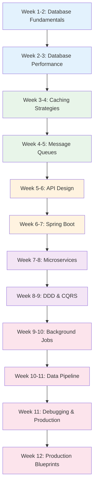

# Backend Engineer Learning Path

A structured 12-week journey through the Knowledge Vault for backend engineers. This path takes you from database fundamentals through API design, caching, message queues, Spring Boot, microservices, domain-driven design, background jobs, data pipelines, and production operations including debugging playbooks and production blueprints.

## Who This Is For

- Software engineers transitioning into backend roles
- Junior backend engineers who want to level up to mid-level
- Full-stack engineers who want deeper backend expertise
- Anyone preparing for backend-focused interviews at top companies

## Prerequisites

- Proficiency in at least one backend language (Java, Python, Node.js, Go)
- Basic SQL knowledge (SELECT, JOIN, WHERE, GROUP BY)
- Understanding of HTTP request/response cycle
- Familiarity with REST APIs

**Total estimated time**: ~55 hours across 12 weeks

## Learning Progression

---

## Week 1-2: Database Fundamentals

*Estimated reading time: 6 hours*

You need to understand how databases work under the hood before you can design schemas, tune queries, or choose the right database for a workload.

- [ ] **Required** -- [Database Selection Guide](/system-design/databases/database-selection-guide) *(20 min)*
- [ ] **Required** -- [Storage Engines](/system-design/databases/storage-engines) *(30 min)*
- [ ] **Required** -- [PostgreSQL Internals](/system-design/databases/postgres-internals) *(35 min)*
- [ ] **Required** -- [Write-Ahead Logging](/system-design/databases/write-ahead-logging) *(25 min)*
- [ ] **Required** -- [Indexing Deep Dive](/system-design/databases/indexing-deep-dive) *(30 min)*
- [ ] **Required** -- [Isolation Levels](/system-design/databases/isolation-levels) *(25 min)*
- [ ] **Required** -- [MVCC](/system-design/databases/mvcc) *(20 min)*
- [ ] **Required** -- [Replication](/system-design/databases/replication) *(30 min)*
- [ ] **Optional** -- [MongoDB Internals](/system-design/databases/mongodb-internals) *(25 min)*
- [ ] **Optional** -- [Redis Internals](/system-design/databases/redis-internals) *(25 min)*
- [ ] **Optional** -- [Time-Series Databases](/system-design/databases/time-series-databases) *(20 min)*
- [ ] **Optional** -- [Graph Databases](/system-design/databases/graph-databases) *(20 min)*
- [ ] **Optional** -- [NewSQL](/system-design/databases/newsql) *(15 min)*
- [ ] **Optional** -- [SQLite Internals](/system-design/databases/sqlite-internals) *(20 min)*

**Schema design practice:**

- [ ] **Required** -- [E-Commerce Schema Design](/system-design/databases/schema-design-ecommerce) *(25 min)*
- [ ] **Required** -- [Chat Schema Design](/system-design/databases/schema-design-chat) *(25 min)*
- [ ] **Optional** -- [SaaS Schema Design](/system-design/databases/schema-design-saas) *(25 min)*
- [ ] **Optional** -- [Social Schema Design](/system-design/databases/schema-design-social) *(25 min)*

::: tip Checkpoint
After this section you should be able to explain: B-tree vs LSM-tree trade-offs, what WAL guarantees, how MVCC enables concurrent reads/writes, when to choose PostgreSQL vs MongoDB vs Redis, and design a normalized schema for a given domain.
:::

---

## Week 2-3: Database Performance

*Estimated reading time: 4 hours*

Now that you understand internals, learn how to make databases fast in production.

- [ ] **Required** -- [Query Planning & Optimization](/system-design/databases/query-planning-optimization) *(30 min)*
- [ ] **Required** -- [Connection Pooling](/system-design/databases/connection-pooling) *(20 min)*
- [ ] **Required** -- [Sharding](/system-design/databases/sharding) *(30 min)*
- [ ] **Required** -- [Index Strategy](/performance/database-tuning/index-strategy) *(25 min)*
- [ ] **Required** -- [Query Optimization](/performance/database-tuning/query-optimization) *(25 min)*
- [ ] **Required** -- [N+1 Problem](/performance/database-tuning/n-plus-one) *(20 min)*
- [ ] **Required** -- [PostgreSQL DBA](/system-design/databases/postgresql-dba) *(30 min)*
- [ ] **Optional** -- [Connection Pool Tuning](/performance/database-tuning/connection-pool-tuning) *(20 min)*
- [ ] **Optional** -- [VACUUM & ANALYZE](/performance/database-tuning/vacuum-analyze) *(20 min)*
- [ ] **Optional** -- [Database Profiling](/performance/profiling/database-profiling) *(20 min)*
- [ ] **Reference** -- [SQL Cheat Sheet](/cheat-sheets/sql) *(10 min)*
- [ ] **Reference** -- [Advanced SQL Cheat Sheet](/cheat-sheets/sql-advanced) *(15 min)*

::: tip Checkpoint
After this section you should be able to: read an EXPLAIN plan, set up read replicas, decide when sharding is appropriate, diagnose the N+1 query problem, and tune connection pools.
:::

---

## Week 3-4: Caching Strategies

*Estimated reading time: 3.5 hours*

Caching is the single biggest lever for backend performance. Learn the patterns, pitfalls, and production considerations.

- [ ] **Required** -- [Caching Strategies Overview](/system-design/caching/caching-strategies) *(25 min)*
- [ ] **Required** -- [Cache Invalidation](/system-design/caching/cache-invalidation) *(30 min)*
- [ ] **Required** -- [Redis Caching Patterns](/system-design/caching/redis-caching-patterns) *(30 min)*
- [ ] **Required** -- [Multi-Layer Caching](/system-design/caching/multi-layer-caching) *(25 min)*
- [ ] **Required** -- [Application-Level Caching](/performance/caching-strategies/application-level) *(25 min)*
- [ ] **Required** -- [Database-Level Caching](/performance/caching-strategies/database-level) *(20 min)*
- [ ] **Optional** -- [Thundering Herd](/system-design/caching/thundering-herd) *(20 min)*
- [ ] **Optional** -- [Cache Sizing Math](/system-design/caching/cache-sizing-math) *(20 min)*
- [ ] **Optional** -- [Cache Warming](/system-design/caching/cache-warming) *(15 min)*
- [ ] **Optional** -- [CDN Deep Dive](/system-design/caching/cdn-deep-dive) *(25 min)*

::: tip Checkpoint
After this section you should be able to: choose between cache-aside, write-through, and write-behind patterns; design a multi-layer caching strategy; and handle cache invalidation correctly.
:::

---

## Week 4-5: Message Queues & Async Processing

*Estimated reading time: 4 hours*

Asynchronous processing is essential for scalable backends. Understand the major queue systems and their trade-offs.

- [ ] **Required** -- [Message Queues Overview](/system-design/message-queues/) *(15 min)*
- [ ] **Required** -- [Queue Selection Guide](/system-design/message-queues/queue-selection-guide) *(20 min)*
- [ ] **Required** -- [Kafka Internals](/system-design/message-queues/kafka-internals) *(35 min)*
- [ ] **Required** -- [RabbitMQ Internals](/system-design/message-queues/rabbitmq-internals) *(30 min)*
- [ ] **Required** -- [Ordering Guarantees](/system-design/message-queues/ordering-guarantees) *(20 min)*
- [ ] **Required** -- [Dead Letter Queues](/system-design/message-queues/dead-letter-queues) *(20 min)*
- [ ] **Required** -- [Exactly-Once Semantics](/system-design/message-queues/exactly-once-semantics) *(25 min)*
- [ ] **Optional** -- [Backpressure Patterns](/system-design/message-queues/backpressure-patterns) *(20 min)*
- [ ] **Optional** -- [Kafka Streams](/system-design/message-queues/kafka-streams) *(20 min)*
- [ ] **Optional** -- [Kafka Connect](/system-design/message-queues/kafka-connect) *(20 min)*
- [ ] **Optional** -- [Redis Streams](/system-design/message-queues/redis-streams) *(20 min)*
- [ ] **Optional** -- [SQS & SNS](/system-design/message-queues/sqs-sns) *(20 min)*
- [ ] **Optional** -- [NATS](/system-design/message-queues/nats) *(15 min)*

::: tip Checkpoint
After this section you should be able to: choose between Kafka and RabbitMQ for a given use case, explain exactly-once delivery semantics, and design a DLQ strategy.
:::

---

## Week 5-6: API Design

*Estimated reading time: 5 hours*

Backend engineers live and breathe APIs. Understand the protocols, patterns, and production concerns across REST, GraphQL, gRPC, and event-driven APIs.

- [ ] **Required** -- [API Design Overview](/system-design/api-design/) *(15 min)*
- [ ] **Required** -- [REST API Best Practices](/system-design/api-design/rest-best-practices) *(25 min)*
- [ ] **Required** -- [API Versioning](/system-design/api-design/api-versioning) *(20 min)*
- [ ] **Required** -- [Pagination Patterns](/system-design/api-design/pagination-patterns) *(25 min)*
- [ ] **Required** -- [OpenAPI & Swagger](/system-design/api-design/openapi-swagger) *(20 min)*
- [ ] **Required** -- [GraphQL Advanced](/system-design/api-design/graphql-advanced) *(25 min)*
- [ ] **Required** -- [gRPC Deep Dive](/system-design/api-design/grpc-deep-dive) *(25 min)*
- [ ] **Required** -- [Event-Driven APIs](/system-design/api-design/event-driven-apis) *(25 min)*
- [ ] **Required** -- [Webhook Infrastructure](/system-design/api-design/webhook-infrastructure) *(25 min)*
- [ ] **Optional** -- [API Gateway Patterns](/system-design/api-design/api-gateway-patterns) *(20 min)*
- [ ] **Optional** -- [API Security Patterns](/system-design/api-design/api-security-patterns) *(20 min)*
- [ ] **Optional** -- [tRPC](/system-design/api-design/trpc) *(15 min)*

**Networking fundamentals:**

- [ ] **Required** -- [HTTP/2 & HTTP/3](/system-design/networking/http2-http3) *(25 min)*
- [ ] **Required** -- [WebSockets](/system-design/networking/websockets) *(20 min)*
- [ ] **Required** -- [Service Discovery](/system-design/networking/service-discovery) *(20 min)*
- [ ] **Optional** -- [DNS Deep Dive](/system-design/networking/dns-deep-dive) *(25 min)*
- [ ] **Optional** -- [TLS Handshake](/system-design/networking/tls-handshake) *(20 min)*

::: tip Checkpoint
After this section you should be able to: design RESTful APIs with proper versioning and pagination, choose between REST, GraphQL, gRPC, and WebSockets, build webhook infrastructure, and understand event-driven API patterns.
:::

---

## Week 6-7: Spring Boot

*Estimated reading time: 8 hours*

Spring Boot is the dominant backend framework in Java enterprise. This section covers the core concepts you need as a backend engineer.

### Spring Boot Core

- [ ] **Required** -- [Spring Boot Overview](/spring-boot/) *(15 min)*
- [ ] **Required** -- [Core Concepts](/spring-boot/core-concepts) *(30 min)*
- [ ] **Required** -- [REST API](/spring-boot/rest-api) *(25 min)*
- [ ] **Required** -- [Exception Handling](/spring-boot/exception-handling) *(20 min)*
- [ ] **Required** -- [Spring Data JPA](/spring-boot/spring-data-jpa) *(30 min)*
- [ ] **Required** -- [Hibernate Tuning](/spring-boot/hibernate-tuning) *(25 min)*
- [ ] **Required** -- [Database Migrations](/spring-boot/database-migrations) *(20 min)*
- [ ] **Required** -- [Caching](/spring-boot/caching) *(20 min)*

### Spring Boot Security & APIs

- [ ] **Required** -- [Security](/spring-boot/security) *(25 min)*
- [ ] **Required** -- [JWT Auth](/spring-boot/jwt-auth) *(25 min)*
- [ ] **Required** -- [OpenAPI](/spring-boot/openapi) *(20 min)*
- [ ] **Optional** -- [Security Advanced](/spring-boot/security-advanced) *(25 min)*
- [ ] **Optional** -- [OAuth2 & OIDC](/spring-boot/oauth2-oidc) *(25 min)*
- [ ] **Optional** -- [Rate Limiting](/spring-boot/rate-limiting) *(20 min)*
- [ ] **Optional** -- [API Versioning](/spring-boot/api-versioning) *(15 min)*

### Spring Boot Production

- [ ] **Required** -- [Testing](/spring-boot/testing) *(25 min)*
- [ ] **Required** -- [Actuator](/spring-boot/actuator) *(20 min)*
- [ ] **Required** -- [Logging](/spring-boot/logging) *(20 min)*
- [ ] **Required** -- [Best Practices](/spring-boot/best-practices) *(25 min)*
- [ ] **Optional** -- [Async](/spring-boot/async) *(20 min)*
- [ ] **Optional** -- [AOP](/spring-boot/aop) *(20 min)*
- [ ] **Optional** -- [Docker](/spring-boot/docker) *(20 min)*
- [ ] **Optional** -- [Deployment](/spring-boot/deployment) *(20 min)*
- [ ] **Reference** -- [Spring Boot Cheat Sheet](/cheat-sheets/spring-boot) *(10 min)*

::: tip Checkpoint
After this section you should be able to: build production-ready REST APIs with Spring Boot, implement JPA repositories with optimized Hibernate queries, secure endpoints with Spring Security and JWT, write integration tests with @SpringBootTest, and monitor with Actuator.
:::

---

## Week 7-8: Microservices & Architecture

*Estimated reading time: 5 hours*

Microservices architecture is the dominant pattern for large-scale backends. Learn when to use it, how to decompose, and how to avoid the pitfalls.

- [ ] **Required** -- [Microservices Overview](/architecture-patterns/microservices/) *(15 min)*
- [ ] **Required** -- [Decomposition Strategies](/architecture-patterns/microservices/decomposition-strategies) *(25 min)*
- [ ] **Required** -- [Communication Patterns](/architecture-patterns/microservices/communication-patterns) *(30 min)*
- [ ] **Required** -- [Data Management](/architecture-patterns/microservices/data-management) *(25 min)*
- [ ] **Required** -- [API Gateway Pattern](/architecture-patterns/microservices/api-gateway-pattern) *(25 min)*
- [ ] **Required** -- [Anti-Patterns](/architecture-patterns/microservices/anti-patterns) *(20 min)*
- [ ] **Required** -- [Distributed Tracing](/architecture-patterns/microservices/distributed-tracing) *(25 min)*
- [ ] **Optional** -- [Service Mesh](/architecture-patterns/microservices/service-mesh) *(25 min)*
- [ ] **Optional** -- [Testing Strategies](/architecture-patterns/microservices/testing-strategies) *(25 min)*
- [ ] **Optional** -- [Migration from Monolith](/architecture-patterns/microservices/migration-from-monolith) *(25 min)*

**Spring Boot microservices:**

- [ ] **Optional** -- [Spring Boot Microservices Patterns](/spring-boot/microservices-patterns) *(25 min)*
- [ ] **Optional** -- [Spring Cloud](/spring-boot/spring-cloud) *(25 min)*
- [ ] **Optional** -- [Spring Cloud Gateway](/spring-boot/spring-cloud-gateway) *(20 min)*
- [ ] **Optional** -- [Service Discovery](/spring-boot/service-discovery) *(20 min)*
- [ ] **Optional** -- [Resilience](/spring-boot/resilience) *(20 min)*

::: tip Checkpoint
After this section you should be able to: decompose a monolith into services, choose synchronous vs asynchronous communication, design an API gateway, recognize common anti-patterns like distributed monoliths, and implement microservices with Spring Cloud.
:::

---

## Week 8-9: Domain-Driven Design & CQRS

*Estimated reading time: 5 hours*

DDD gives you the conceptual tools to design complex business domains cleanly. CQRS and event sourcing handle advanced read/write separation.

### Domain-Driven Design

- [ ] **Required** -- [DDD Overview](/architecture-patterns/domain-driven-design/) *(15 min)*
- [ ] **Required** -- [Strategic Design](/architecture-patterns/domain-driven-design/strategic-design) *(30 min)*
- [ ] **Required** -- [Tactical Design](/architecture-patterns/domain-driven-design/tactical-design) *(30 min)*
- [ ] **Required** -- [Domain Events](/architecture-patterns/domain-driven-design/domain-events) *(25 min)*
- [ ] **Required** -- [Anti-Corruption Layer](/architecture-patterns/domain-driven-design/anti-corruption-layer) *(20 min)*
- [ ] **Optional** -- [Specification Pattern](/architecture-patterns/domain-driven-design/specification-pattern) *(20 min)*
- [ ] **Optional** -- [TypeScript Implementation](/architecture-patterns/domain-driven-design/typescript-implementation) *(25 min)*

### CQRS & Event Sourcing

- [ ] **Required** -- [CQRS & Event Sourcing Overview](/architecture-patterns/cqrs-event-sourcing/) *(15 min)*
- [ ] **Required** -- [CQRS Deep Dive](/architecture-patterns/cqrs-event-sourcing/cqrs-deep-dive) *(30 min)*
- [ ] **Required** -- [Event Sourcing Deep Dive](/architecture-patterns/cqrs-event-sourcing/event-sourcing-deep-dive) *(30 min)*
- [ ] **Required** -- [Aggregate Design](/architecture-patterns/cqrs-event-sourcing/aggregate-design) *(25 min)*
- [ ] **Required** -- [Projections](/architecture-patterns/cqrs-event-sourcing/projections) *(25 min)*
- [ ] **Optional** -- [Sagas & Process Managers](/architecture-patterns/cqrs-event-sourcing/sagas-process-managers) *(25 min)*
- [ ] **Optional** -- [Snapshots](/architecture-patterns/cqrs-event-sourcing/snapshots) *(20 min)*
- [ ] **Optional** -- [Event Upcasting](/architecture-patterns/cqrs-event-sourcing/event-upcasting) *(20 min)*

### Related Event-Driven Patterns

- [ ] **Optional** -- [Event-Driven Overview](/architecture-patterns/event-driven/) *(15 min)*
- [ ] **Optional** -- [Transactional Outbox](/architecture-patterns/event-driven/transactional-outbox) *(20 min)*
- [ ] **Optional** -- [Idempotent Consumers](/architecture-patterns/event-driven/idempotent-consumers) *(20 min)*
- [ ] **Optional** -- [Eventual Consistency](/architecture-patterns/event-driven/eventual-consistency) *(20 min)*

::: tip Checkpoint
After this section you should be able to: identify bounded contexts, design aggregates, implement CQRS with separate read/write models, build projections, and use domain events for decoupling.
:::

---

## Week 9-10: Background Jobs & Temporal

*Estimated reading time: 4 hours*

Long-running processes, scheduled tasks, and complex workflows require dedicated infrastructure beyond simple API request/response.

- [ ] **Required** -- [Background Jobs Overview](/system-design/background-jobs/) *(15 min)*
- [ ] **Required** -- [Background Jobs Patterns](/system-design/background-jobs/patterns) *(25 min)*
- [ ] **Required** -- [Background Jobs Comparison](/system-design/background-jobs/comparison) *(20 min)*
- [ ] **Required** -- [Temporal](/system-design/background-jobs/temporal) *(30 min)*
- [ ] **Required** -- [Job Queue Blueprint](/production-blueprints/job-queue/) *(15 min)*
- [ ] **Required** -- [Job Queue Architecture](/production-blueprints/job-queue/architecture) *(25 min)*
- [ ] **Required** -- [Worker Patterns](/production-blueprints/job-queue/worker-patterns) *(20 min)*
- [ ] **Required** -- [Retry Strategies](/production-blueprints/job-queue/retry-strategies) *(20 min)*
- [ ] **Optional** -- [Priority Queues](/production-blueprints/job-queue/priority-queues) *(20 min)*
- [ ] **Optional** -- [Job Queue Monitoring](/production-blueprints/job-queue/monitoring) *(20 min)*

**Spring Boot background processing:**

- [ ] **Optional** -- [Spring Batch](/spring-boot/batch) *(25 min)*
- [ ] **Optional** -- [Spring Batch Deep Dive](/spring-boot/spring-batch-deep-dive) *(25 min)*
- [ ] **Optional** -- [Spring Integration](/spring-boot/spring-integration) *(20 min)*
- [ ] **Optional** -- [Spring State Machine](/spring-boot/spring-statemachine) *(20 min)*

::: tip Checkpoint
After this section you should be able to: choose between Temporal, BullMQ, and Celery for a given workload, design retry strategies with exponential backoff and dead letter handling, build reliable background job systems, and implement batch processing with Spring Batch.
:::

---

## Week 10-11: Data Pipeline Fundamentals

*Estimated reading time: 4 hours*

Backend engineers increasingly own data pipelines. Understand the patterns for moving, transforming, and validating data at scale.

- [ ] **Required** -- [Data Pipeline Overview](/data-pipeline/) *(15 min)*
- [ ] **Required** -- [Pipeline Patterns](/data-pipeline/pipeline-patterns) *(25 min)*
- [ ] **Required** -- [Data Contracts](/data-pipeline/data-contracts) *(25 min)*
- [ ] **Required** -- [Database Extraction](/data-pipeline/database-extraction) *(20 min)*
- [ ] **Required** -- [API Ingestion](/data-pipeline/api-ingestion) *(20 min)*
- [ ] **Required** -- [Pipeline Monitoring](/data-pipeline/pipeline-monitoring) *(20 min)*
- [ ] **Optional** -- [Deduplication](/data-pipeline/deduplication) *(20 min)*
- [ ] **Optional** -- [File Formats](/data-pipeline/file-formats) *(20 min)*
- [ ] **Optional** -- [Great Expectations](/data-pipeline/great-expectations) *(20 min)*
- [ ] **Optional** -- [Pandera Validation](/data-pipeline/pandera-validation) *(15 min)*

**Spring Boot data integration:**

- [ ] **Optional** -- [Spring Boot Kafka](/spring-boot/kafka) *(25 min)*
- [ ] **Optional** -- [Spring Boot Event-Driven](/spring-boot/event-driven) *(20 min)*

::: tip Checkpoint
After this section you should be able to: design data pipeline architectures, implement data contracts between services, extract data from databases and APIs, monitor pipeline health, and handle data deduplication.
:::

---

## Week 11: Debugging Playbooks & Production Operations

*Estimated reading time: 4 hours*

Your code is only as good as your ability to deploy it safely and debug it when things go wrong.

### Debugging Playbooks

- [ ] **Required** -- [Debugging Playbooks Overview](/debugging-playbooks/) *(10 min)*
- [ ] **Required** -- [API Slow Response](/debugging-playbooks/api-slow) *(25 min)*
- [ ] **Required** -- [Intermittent 502](/debugging-playbooks/intermittent-502) *(25 min)*
- [ ] **Required** -- [Database CPU](/debugging-playbooks/database-cpu) *(25 min)*
- [ ] **Required** -- [Memory Leak](/debugging-playbooks/memory-leak) *(25 min)*
- [ ] **Required** -- [High Error Rate](/debugging-playbooks/high-error-rate) *(25 min)*
- [ ] **Optional** -- [Pods Restarting](/debugging-playbooks/pods-restarting) *(20 min)*

### Deployment & Monitoring

- [ ] **Required** -- [Deployment Strategies Overview](/devops/deployment-strategies/) *(15 min)*
- [ ] **Required** -- [Blue-Green Deployments](/devops/deployment-strategies/blue-green) *(20 min)*
- [ ] **Required** -- [Database Migrations](/devops/deployment-strategies/database-migrations) *(25 min)*
- [ ] **Required** -- [Monitoring Overview](/devops/monitoring/) *(15 min)*
- [ ] **Required** -- [Metrics Design](/devops/monitoring/metrics-design) *(25 min)*
- [ ] **Required** -- [Structured Logging](/devops/logging/structured-logging) *(20 min)*
- [ ] **Required** -- [Correlation IDs](/devops/logging/correlation-ids) *(15 min)*
- [ ] **Optional** -- [Canary Deployments](/devops/deployment-strategies/canary) *(20 min)*
- [ ] **Optional** -- [Rollback Procedures](/devops/deployment-strategies/rollback-procedures) *(20 min)*
- [ ] **Optional** -- [Feature Flags for Deployment](/devops/deployment-strategies/feature-flags-deployment) *(20 min)*

::: tip Checkpoint
After this section you should be able to: diagnose slow APIs, intermittent 502s, and memory leaks using structured playbooks, plan a zero-downtime deployment, set up application metrics with RED/USE methodology, and implement structured logging with correlation IDs.
:::

---

## Week 12: Production Blueprints & Capstone

*Estimated reading time: 5 hours*

Study complete production systems that integrate every concept from this path.

- [ ] **Required** -- [Production Blueprints Overview](/production-blueprints/) *(15 min)*
- [ ] **Required** -- [Auth Service Architecture](/production-blueprints/auth-service/architecture) *(25 min)*
- [ ] **Required** -- [Auth Service Database Schema](/production-blueprints/auth-service/database-schema) *(20 min)*
- [ ] **Required** -- [Billing Engine Architecture](/production-blueprints/billing-engine/architecture) *(25 min)*
- [ ] **Required** -- [Billing Engine Idempotency](/production-blueprints/billing-engine/idempotency) *(20 min)*
- [ ] **Required** -- [Notification Service Architecture](/production-blueprints/notification-service/architecture) *(25 min)*
- [ ] **Required** -- [Rate Limiter Blueprint](/production-blueprints/rate-limiter/) *(15 min)*
- [ ] **Required** -- [Rate Limiter Algorithms](/production-blueprints/rate-limiter/algorithms) *(25 min)*
- [ ] **Optional** -- [Analytics Pipeline Architecture](/production-blueprints/analytics-pipeline/architecture) *(25 min)*
- [ ] **Optional** -- [Realtime Pipeline Architecture](/production-blueprints/realtime-pipeline/architecture) *(25 min)*
- [ ] **Optional** -- [Payment Engineering](/production-blueprints/payment-engineering/) *(25 min)*
- [ ] **Optional** -- [Chat Service Blueprint](/production-blueprints/chat-service/) *(25 min)*
- [ ] **Optional** -- [Search Service Blueprint](/production-blueprints/search-service/) *(25 min)*

---

## What You Will Be Able to Do After This Path

- Design and optimize database schemas for complex domains
- Build production-ready REST, GraphQL, and gRPC APIs
- Implement caching strategies that reduce database load by 90%+
- Design asynchronous processing with message queues and background jobs
- Build Spring Boot microservices with proper security, testing, and observability
- Apply DDD and CQRS to model complex business domains
- Debug production incidents systematically using playbooks
- Design complete production systems (auth, billing, notifications, job queues)

## Cross-References to Related Paths

- **[DevOps Engineer Path](/learning-paths/devops-engineer)** -- Deep dive into Docker, Kubernetes, Terraform, and infrastructure
- **[System Design Interview Path](/learning-paths/system-design-interview)** -- Apply your knowledge to interview-style problems
- **[Security Engineer Path](/learning-paths/security-engineer)** -- Harden your backends against attacks
- **[Spring Boot Engineer Path](/learning-paths/spring-boot-engineer)** -- Comprehensive 12-week Spring Boot deep dive
- **[Data Engineer Path](/learning-paths/data-engineer)** -- Build data pipelines and analytics systems
- **[Platform Engineer Path](/learning-paths/platform-engineer)** -- Build the infrastructure platform

---

::: info Total Progress
This path contains approximately 100 pages. At a pace of 5 pages per day, you can complete it in about 3 weeks of focused study. The Spring Boot section alone contains 20+ pages. Adjust based on your experience level and available time.
:::
