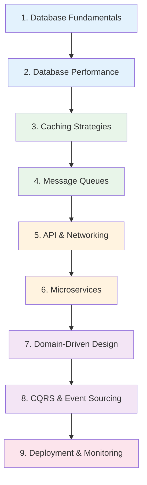

# Backend Engineer Learning Path

A structured journey through the Knowledge Vault for backend engineers. This path takes you from database fundamentals through caching, message queues, API design, microservices, domain-driven design, CQRS, deployment strategies, and production monitoring.

**Total estimated time**: ~30 hours across 9 sections

## Learning Progression

---

## Section 1: Database Fundamentals

*Estimated reading time: 4 hours*

You need to understand how databases work under the hood before you can design schemas, tune queries, or choose the right database for a workload.

- [ ] **Required** — [Database Selection Guide](/system-design/databases/database-selection-guide) *(20 min)*
- [ ] **Required** — [Storage Engines](/system-design/databases/storage-engines) *(30 min)*
- [ ] **Required** — [PostgreSQL Internals](/system-design/databases/postgres-internals) *(35 min)*
- [ ] **Required** — [Write-Ahead Logging](/system-design/databases/write-ahead-logging) *(25 min)*
- [ ] **Required** — [Indexing Deep Dive](/system-design/databases/indexing-deep-dive) *(30 min)*
- [ ] **Required** — [Isolation Levels](/system-design/databases/isolation-levels) *(25 min)*
- [ ] **Required** — [MVCC](/system-design/databases/mvcc) *(20 min)*
- [ ] **Optional** — [MongoDB Internals](/system-design/databases/mongodb-internals) *(25 min)*
- [ ] **Optional** — [Redis Internals](/system-design/databases/redis-internals) *(25 min)*
- [ ] **Optional** — [Time-Series Databases](/system-design/databases/time-series-databases) *(20 min)*
- [ ] **Optional** — [Graph Databases](/system-design/databases/graph-databases) *(20 min)*
- [ ] **Optional** — [NewSQL](/system-design/databases/newsql) *(15 min)*

::: tip Checkpoint
After this section you should be able to explain: B-tree vs LSM-tree trade-offs, what WAL guarantees, how MVCC enables concurrent reads/writes, and when to choose PostgreSQL vs MongoDB vs Redis.
:::

---

## Section 2: Database Performance

*Estimated reading time: 3 hours*

Now that you understand internals, learn how to make databases fast in production.

- [ ] **Required** — [Query Planning & Optimization](/system-design/databases/query-planning-optimization) *(30 min)*
- [ ] **Required** — [Connection Pooling](/system-design/databases/connection-pooling) *(20 min)*
- [ ] **Required** — [Replication](/system-design/databases/replication) *(30 min)*
- [ ] **Required** — [Sharding](/system-design/databases/sharding) *(30 min)*
- [ ] **Required** — [Index Strategy](/performance/database-tuning/index-strategy) *(25 min)*
- [ ] **Required** — [Query Optimization](/performance/database-tuning/query-optimization) *(25 min)*
- [ ] **Required** — [N+1 Problem](/performance/database-tuning/n-plus-one) *(20 min)*
- [ ] **Optional** — [Connection Pool Tuning](/performance/database-tuning/connection-pool-tuning) *(20 min)*
- [ ] **Optional** — [VACUUM & ANALYZE](/performance/database-tuning/vacuum-analyze) *(20 min)*
- [ ] **Optional** — [Database Profiling](/performance/profiling/database-profiling) *(20 min)*

::: tip Checkpoint
After this section you should be able to: read an EXPLAIN plan, set up read replicas, decide when sharding is appropriate, and diagnose the N+1 query problem.
:::

---

## Section 3: Caching Strategies

*Estimated reading time: 3.5 hours*

Caching is the single biggest lever for backend performance. Learn the patterns, pitfalls, and production considerations.

- [ ] **Required** — [Caching Strategies Overview](/system-design/caching/caching-strategies) *(25 min)*
- [ ] **Required** — [Cache Invalidation](/system-design/caching/cache-invalidation) *(30 min)*
- [ ] **Required** — [Redis Caching Patterns](/system-design/caching/redis-caching-patterns) *(30 min)*
- [ ] **Required** — [Multi-Layer Caching](/system-design/caching/multi-layer-caching) *(25 min)*
- [ ] **Required** — [Application-Level Caching](/performance/caching-strategies/application-level) *(25 min)*
- [ ] **Required** — [Database-Level Caching](/performance/caching-strategies/database-level) *(20 min)*
- [ ] **Optional** — [Thundering Herd](/system-design/caching/thundering-herd) *(20 min)*
- [ ] **Optional** — [Cache Sizing Math](/system-design/caching/cache-sizing-math) *(20 min)*
- [ ] **Optional** — [Cache Warming](/system-design/caching/cache-warming) *(15 min)*
- [ ] **Optional** — [CDN Deep Dive](/system-design/caching/cdn-deep-dive) *(25 min)*
- [ ] **Optional** — [HTTP Caching](/performance/caching-strategies/http-caching) *(20 min)*
- [ ] **Optional** — [Edge Caching](/performance/caching-strategies/edge-caching) *(15 min)*

::: tip Checkpoint
After this section you should be able to: choose between cache-aside, write-through, and write-behind patterns; design a multi-layer caching strategy; and handle cache invalidation correctly.
:::

---

## Section 4: Message Queues

*Estimated reading time: 3.5 hours*

Asynchronous processing is essential for scalable backends. Understand the major queue systems and their trade-offs.

- [ ] **Required** — [Message Queues Overview](/system-design/message-queues/) *(15 min)*
- [ ] **Required** — [Queue Selection Guide](/system-design/message-queues/queue-selection-guide) *(20 min)*
- [ ] **Required** — [Kafka Internals](/system-design/message-queues/kafka-internals) *(35 min)*
- [ ] **Required** — [RabbitMQ Internals](/system-design/message-queues/rabbitmq-internals) *(30 min)*
- [ ] **Required** — [Ordering Guarantees](/system-design/message-queues/ordering-guarantees) *(20 min)*
- [ ] **Required** — [Dead Letter Queues](/system-design/message-queues/dead-letter-queues) *(20 min)*
- [ ] **Required** — [Exactly-Once Semantics](/system-design/message-queues/exactly-once-semantics) *(25 min)*
- [ ] **Optional** — [Backpressure Patterns](/system-design/message-queues/backpressure-patterns) *(20 min)*
- [ ] **Optional** — [Redis Streams](/system-design/message-queues/redis-streams) *(20 min)*
- [ ] **Optional** — [SQS & SNS](/system-design/message-queues/sqs-sns) *(20 min)*
- [ ] **Optional** — [NATS](/system-design/message-queues/nats) *(15 min)*
- [ ] **Optional** — [Pulsar](/system-design/message-queues/pulsar) *(15 min)*

::: tip Checkpoint
After this section you should be able to: choose between Kafka and RabbitMQ for a given use case, explain exactly-once delivery semantics, and design a DLQ strategy.
:::

---

## Section 5: API & Networking

*Estimated reading time: 2.5 hours*

Backend engineers live and breathe APIs. Understand the protocols, patterns, and production concerns.

- [ ] **Required** — [HTTP/2 & HTTP/3](/system-design/networking/http2-http3) *(25 min)*
- [ ] **Required** — [gRPC Internals](/system-design/networking/grpc-internals) *(25 min)*
- [ ] **Required** — [WebSockets](/system-design/networking/websockets) *(20 min)*
- [ ] **Required** — [Service Discovery](/system-design/networking/service-discovery) *(20 min)*
- [ ] **Required** — [DNS Deep Dive](/system-design/networking/dns-deep-dive) *(25 min)*
- [ ] **Optional** — [TLS Handshake](/system-design/networking/tls-handshake) *(20 min)*
- [ ] **Optional** — [TCP/IP Deep Dive](/system-design/networking/tcp-ip-deep-dive) *(25 min)*
- [ ] **Optional** — [Network Debugging](/system-design/networking/network-debugging) *(20 min)*

::: tip Checkpoint
After this section you should be able to: choose between REST, gRPC, and WebSockets; explain HTTP/2 multiplexing; and set up service discovery.
:::

---

## Section 6: Microservices

*Estimated reading time: 3.5 hours*

Microservices architecture is the dominant pattern for large-scale backends. Learn when to use it, how to decompose, and how to avoid the pitfalls.

- [ ] **Required** — [Microservices Overview](/architecture-patterns/microservices/) *(15 min)*
- [ ] **Required** — [Decomposition Strategies](/architecture-patterns/microservices/decomposition-strategies) *(25 min)*
- [ ] **Required** — [Communication Patterns](/architecture-patterns/microservices/communication-patterns) *(30 min)*
- [ ] **Required** — [Data Management](/architecture-patterns/microservices/data-management) *(25 min)*
- [ ] **Required** — [API Gateway Pattern](/architecture-patterns/microservices/api-gateway-pattern) *(25 min)*
- [ ] **Required** — [Anti-Patterns](/architecture-patterns/microservices/anti-patterns) *(20 min)*
- [ ] **Optional** — [Service Mesh](/architecture-patterns/microservices/service-mesh) *(25 min)*
- [ ] **Optional** — [Testing Strategies](/architecture-patterns/microservices/testing-strategies) *(25 min)*
- [ ] **Optional** — [Migration from Monolith](/architecture-patterns/microservices/migration-from-monolith) *(25 min)*

::: tip Checkpoint
After this section you should be able to: decompose a monolith into services, choose synchronous vs asynchronous communication, design an API gateway, and recognize common anti-patterns like distributed monoliths.
:::

---

## Section 7: Domain-Driven Design

*Estimated reading time: 3 hours*

DDD gives you the conceptual tools to design complex business domains cleanly. Essential for any backend engineer working on non-trivial systems.

- [ ] **Required** — [DDD Overview](/architecture-patterns/domain-driven-design/) *(15 min)*
- [ ] **Required** — [Strategic Design](/architecture-patterns/domain-driven-design/strategic-design) *(30 min)*
- [ ] **Required** — [Tactical Design](/architecture-patterns/domain-driven-design/tactical-design) *(30 min)*
- [ ] **Required** — [Domain Events](/architecture-patterns/domain-driven-design/domain-events) *(25 min)*
- [ ] **Required** — [Anti-Corruption Layer](/architecture-patterns/domain-driven-design/anti-corruption-layer) *(20 min)*
- [ ] **Optional** — [TypeScript Implementation](/architecture-patterns/domain-driven-design/typescript-implementation) *(25 min)*
- [ ] **Optional** — [Specification Pattern](/architecture-patterns/domain-driven-design/specification-pattern) *(20 min)*

**Related architecture patterns:**

- [ ] **Optional** — [Clean Architecture Overview](/architecture-patterns/clean-architecture/) *(15 min)*
- [ ] **Optional** — [Layers and Boundaries](/architecture-patterns/clean-architecture/layers-and-boundaries) *(25 min)*
- [ ] **Optional** — [Hexagonal Architecture](/architecture-patterns/hexagonal/) *(15 min)*
- [ ] **Optional** — [Ports and Adapters](/architecture-patterns/hexagonal/ports-and-adapters) *(25 min)*

::: tip Checkpoint
After this section you should be able to: identify bounded contexts, design aggregates, use domain events for decoupling, and implement an anti-corruption layer between legacy and new systems.
:::

---

## Section 8: CQRS & Event Sourcing

*Estimated reading time: 3 hours*

Advanced architectural patterns for systems where read and write workloads differ significantly, or where you need a complete audit trail.

- [ ] **Required** — [CQRS & Event Sourcing Overview](/architecture-patterns/cqrs-event-sourcing/) *(15 min)*
- [ ] **Required** — [CQRS Deep Dive](/architecture-patterns/cqrs-event-sourcing/cqrs-deep-dive) *(30 min)*
- [ ] **Required** — [Event Sourcing Deep Dive](/architecture-patterns/cqrs-event-sourcing/event-sourcing-deep-dive) *(30 min)*
- [ ] **Required** — [Aggregate Design](/architecture-patterns/cqrs-event-sourcing/aggregate-design) *(25 min)*
- [ ] **Required** — [Projections](/architecture-patterns/cqrs-event-sourcing/projections) *(25 min)*
- [ ] **Optional** — [Sagas & Process Managers](/architecture-patterns/cqrs-event-sourcing/sagas-process-managers) *(25 min)*
- [ ] **Optional** — [Snapshots](/architecture-patterns/cqrs-event-sourcing/snapshots) *(20 min)*
- [ ] **Optional** — [Event Upcasting](/architecture-patterns/cqrs-event-sourcing/event-upcasting) *(20 min)*

**Related event-driven patterns:**

- [ ] **Optional** — [Event-Driven Architecture Overview](/architecture-patterns/event-driven/) *(15 min)*
- [ ] **Optional** — [Event Types](/architecture-patterns/event-driven/event-types) *(15 min)*
- [ ] **Optional** — [Eventual Consistency](/architecture-patterns/event-driven/eventual-consistency) *(20 min)*

::: tip Checkpoint
After this section you should be able to: implement CQRS with separate read/write models, design an event-sourced aggregate, build projections, and understand when event sourcing is worth the complexity.
:::

---

## Section 9: Deployment & Monitoring

*Estimated reading time: 4 hours*

Your code is only as good as your ability to deploy it safely and know when it breaks in production.

### Deployment Strategies

- [ ] **Required** — [Deployment Strategies Overview](/devops/deployment-strategies/) *(15 min)*
- [ ] **Required** — [Blue-Green Deployments](/devops/deployment-strategies/blue-green) *(20 min)*
- [ ] **Required** — [Canary Deployments](/devops/deployment-strategies/canary) *(20 min)*
- [ ] **Required** — [Rolling Updates](/devops/deployment-strategies/rolling-updates) *(20 min)*
- [ ] **Required** — [Database Migrations](/devops/deployment-strategies/database-migrations) *(25 min)*
- [ ] **Optional** — [Rollback Procedures](/devops/deployment-strategies/rollback-procedures) *(20 min)*
- [ ] **Optional** — [Feature Flags for Deployment](/devops/deployment-strategies/feature-flags-deployment) *(20 min)*

### Monitoring & Observability

- [ ] **Required** — [Monitoring Overview](/devops/monitoring/) *(15 min)*
- [ ] **Required** — [Metrics Design](/devops/monitoring/metrics-design) *(25 min)*
- [ ] **Required** — [Structured Logging](/devops/logging/structured-logging) *(20 min)*
- [ ] **Required** — [Correlation IDs](/devops/logging/correlation-ids) *(15 min)*
- [ ] **Optional** — [Prometheus Deep Dive](/devops/monitoring/prometheus-deep-dive) *(25 min)*
- [ ] **Optional** — [Grafana Dashboards](/devops/monitoring/grafana-dashboards) *(20 min)*
- [ ] **Optional** — [Log Aggregation](/devops/logging/log-aggregation) *(20 min)*
- [ ] **Optional** — [Monitoring Anti-Patterns](/devops/monitoring/monitoring-antipatterns) *(15 min)*

::: tip Checkpoint
After this section you should be able to: plan a zero-downtime deployment, set up application metrics with RED/USE methodology, implement structured logging with correlation IDs, and build a Grafana dashboard.
:::

---

## What to Read Next

After completing this path, consider:

- **[DevOps Engineer Path](/learning-paths/devops-engineer)** — Deep dive into Docker, Kubernetes, Terraform, and infrastructure
- **[System Design Interview Path](/learning-paths/system-design-interview)** — Apply your knowledge to interview-style problems
- **[Security Engineer Path](/learning-paths/security-engineer)** — Harden your backends against attacks
- **[Production Blueprints](/production-blueprints/)** — See complete system designs for auth services, billing engines, job queues, and more

---

::: info Total Progress
This path contains approximately 65 pages. At a pace of 5 pages per day, you can complete it in about 2 weeks. Adjust based on your experience level and available time.
:::
