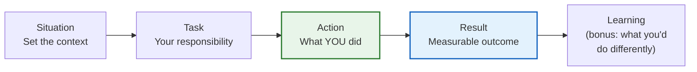
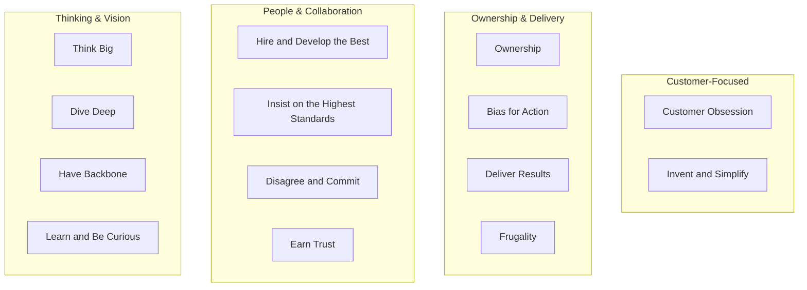
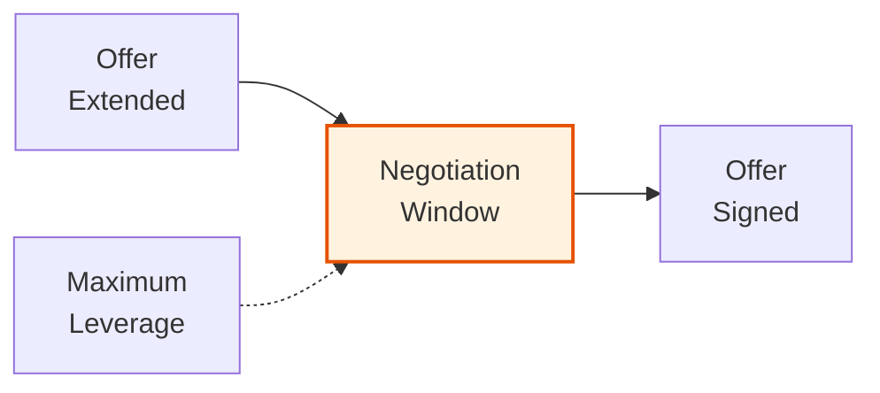
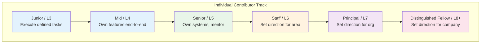
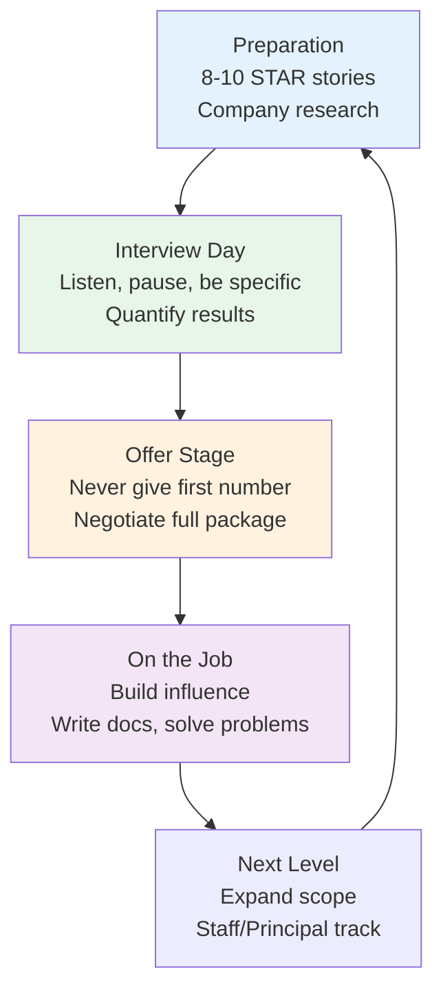

# Behavioral Interviews & Career Growth

Behavioral interviews are the most underestimated part of the engineering hiring process. Engineers spend months grinding LeetCode and system design, then lose offers because they cannot articulate how they resolved a conflict with a coworker. At senior+ levels, behavioral signals often carry more weight than technical ones — companies already assume you can code; they want to know if you can lead, influence, and operate autonomously.

This page covers the full spectrum: how to answer behavioral questions effectively, what companies actually evaluate at each level, how to negotiate compensation, and how to build the influence that makes the stories real in the first place.

## The STAR Method

STAR is a structured framework for answering behavioral questions. It prevents rambling and ensures you deliver a complete, compelling narrative.

| Component | What It Covers | Time Allocation |
|-----------|---------------|-----------------|
| **S**ituation | Context — what was the project, team, timeline? | 15-20% |
| **T**ask | Your specific responsibility or challenge | 10-15% |
| **A**ction | What you specifically did (not the team) | 50-60% |
| **R**esult | Measurable outcome, learnings, impact | 15-20% |

### STAR Flow

::: tip The 60% Rule
Spend 60% of your answer on the **Action**. Interviewers care most about what *you* did, not the context. A common mistake is spending two minutes on the Situation and thirty seconds on the Action.
:::

### Example: "Tell Me About a Time You Resolved a Conflict"

**Bad Answer (no structure):**
> "Yeah, so my tech lead wanted to use Kafka but I thought SQS was better. We argued about it for a while. Eventually we went with Kafka and it worked out fine."

**Good Answer (STAR):**

> **Situation:** We were building an event-driven order processing system for a high-traffic e-commerce platform. The team had a two-month deadline before Black Friday.
>
> **Task:** I was the backend lead responsible for the messaging architecture. My tech lead strongly advocated for Kafka, citing its throughput. I believed SQS was a better fit because we had a small team with no Kafka operational experience.
>
> **Action:** Instead of arguing from opinion, I wrote a one-page decision document comparing both options across five dimensions: throughput requirements (we only needed 5K msgs/sec, well within SQS limits), operational burden (Kafka requires cluster management, SQS is serverless), cost (SQS was 80% cheaper at our scale), team experience (zero Kafka experience), and time-to-delivery. I scheduled a 30-minute meeting with the tech lead and the VP of Engineering, presented the trade-off matrix, and explicitly stated: "I may be wrong — here's the data, let's decide together." The tech lead raised a valid concern about message ordering. I proposed using SQS FIFO queues with message group IDs, and built a proof-of-concept over the weekend showing it met our requirements.
>
> **Result:** We went with SQS FIFO. The system handled 12K orders/minute on Black Friday with zero message loss. The tech lead later told me the decision document approach changed how the team made architectural decisions going forward. I learned that bringing data instead of opinions turns conflicts into collaborative problem-solving.

### Common STAR Mistakes

| Mistake | Why It Hurts | Fix |
|---------|-------------|-----|
| Saying "we" instead of "I" | Interviewer cannot assess *your* contribution | Use "I" for your actions, "we" for team context |
| No measurable result | Story feels incomplete, unverifiable | Quantify: revenue, latency, uptime, team velocity |
| Too much context | Eats into Action time | 2-3 sentences max for Situation |
| Hypothetical answers | "I would do X" shows no track record | Always use real examples, even imperfect ones |
| Only positive stories | Seems unself-aware | Include what you learned or would do differently |

## Behavioral Question Bank

### Conflict & Collaboration

1. Tell me about a time you disagreed with a technical decision. How did you handle it?
2. Describe a situation where you had to work with a difficult teammate.
3. Tell me about a time you received critical feedback. How did you respond?
4. Describe a conflict between two teams that you helped resolve.
5. Tell me about a time you had to push back on a product requirement.

### Leadership & Influence

6. Tell me about a time you led a project without formal authority.
7. Describe how you mentored a junior engineer through a difficult challenge.
8. Tell me about a time you had to convince skeptics to adopt a new technology.
9. Describe a situation where you identified a problem no one was talking about and drove the solution.
10. Tell me about a time you had to make a decision with incomplete information.

### Delivery & Execution

11. Tell me about a project that was at risk of missing its deadline. What did you do?
12. Describe a time you had to make a significant trade-off between quality and speed.
13. Tell me about the most complex system you built. How did you manage the complexity?
14. Describe a time you had to drastically change your technical approach mid-project.
15. Tell me about a production incident you owned. How did you handle it?

### Growth & Self-Awareness

16. What is the biggest technical mistake you have made? What did you learn?
17. Tell me about a time you failed. How did you recover?
18. Describe a skill gap you identified in yourself and how you addressed it.
19. Tell me about a time your initial technical approach was wrong.
20. What is something you believed strongly about engineering that you have since changed your mind about?

### Customer & Business Impact

21. Tell me about a time you advocated for the end user against business pressure.
22. Describe how you translated a vague business requirement into a technical solution.
23. Tell me about a time you identified a business opportunity through technical insight.
24. Describe a situation where you had to balance technical debt against feature delivery.
25. Tell me about a time you simplified a complex system, and the impact it had.

::: warning Prepare 8-10 Stories, Not 25
You do not need a unique story for every question. Prepare 8-10 rich stories that you can adapt to different questions. A story about resolving a conflict during a production incident can answer questions about conflict, leadership, incident response, and decision-making under pressure.
:::

## Answering Framework by Company

Different companies weight behavioral signals differently:

| Company | Behavioral Focus | Key Signals |
|---------|-----------------|-------------|
| Amazon | Leadership Principles (16 of them) | Customer obsession, ownership, bias for action, disagree and commit |
| Google | "Googleyness" & Leadership | Cognitive humility, collaborative, comfort with ambiguity |
| Meta | Move fast, impact-oriented | Shipping velocity, initiative, cross-team collaboration |
| Apple | Craft and secrecy | Attention to detail, ability to work under ambiguity |
| Netflix | Context not control | Independent judgment, radical candor, high performance |
| Stripe | Craftsmanship, rigor | Technical taste, user empathy, written communication |

### Amazon Leadership Principles Deep Dive

Amazon behavioral interviews are the most structured — every question maps to one or more Leadership Principles. Prepare at least one story per principle:

## Negotiation Strategies

### The Negotiation Window

Negotiation happens in a specific window — after you have a verbal offer but before you sign. This is when you have maximum leverage: the company has invested weeks evaluating you and decided you are the one. They do not want to restart the search.

### Salary Negotiation Principles

**1. Never give the first number.**

When asked "What are your salary expectations?" respond with: "I'd prefer to learn more about the role and the team first. Once we've established a mutual fit, I'm confident we can find a number that works for both sides." If pressed: "I'm looking at several opportunities and don't want to anchor prematurely — what is the range budgeted for this role?"

**2. Always negotiate from competing offers.**

The single most effective negotiation tool is another offer. Even if you strongly prefer Company A, interview at Company B and C. A competing offer from Company B tells Company A that the market values you at $X.

**3. Negotiate the whole package, not just base salary.**

| Component | Negotiability | Notes |
|-----------|--------------|-------|
| Base salary | Medium | Often banded by level, limited room |
| Signing bonus | High | One-time cost, easier for companies to approve |
| Equity (RSU/options) | High | Especially at public companies |
| Annual bonus target | Low | Usually fixed per level |
| Level/title | Medium-High | Has the biggest long-term impact on compensation |
| Start date | High | Useful if you want a break between jobs |
| Remote work | Medium | Policy-dependent but increasingly negotiable |
| PTO | Low-Medium | Some companies have rigid PTO policies |

**4. The level matters more than the package.**

Getting leveled as E5 instead of E4 at a FAANG company can mean $50K-100K/year more in total compensation, compounding over years. If the company wants to low-ball the initial offer, negotiate for a higher level instead.

**5. Use the "exploding offer" to your advantage.**

If a company gives you a deadline, politely ask for an extension: "I'm very excited about this opportunity, and I want to make a fully informed decision. Could I have until [date] to finalize?" Companies almost always extend by at least a week.

### Equity Negotiation

For startups:

| Stage | Typical IC Equity | Key Questions to Ask |
|-------|-------------------|---------------------|
| Seed | 0.5-2.0% | What is the 409A valuation? What is the fully diluted share count? |
| Series A | 0.1-0.5% | What is the liquidation preference? Participating or non-participating? |
| Series B | 0.05-0.2% | What is the exercise window post-departure? (90 days is standard, 10 years is best) |
| Series C+ | 0.01-0.1% | What was the last round valuation? Any anti-dilution provisions? |

::: danger Never Accept Options Without Understanding the Tax Implications
ISOs (Incentive Stock Options) and NSOs (Non-Qualified Stock Options) have very different tax treatments. ISOs get preferential capital gains treatment if you hold for 1 year after exercise and 2 years after grant. NSOs are taxed as ordinary income at exercise. Early exercise with an 83(b) election can save significant taxes at startups but requires paying upfront.
:::

## Engineering Levels & Expectations

### The Level Ladder

### What Changes at Each Level

| Dimension | Senior (L5) | Staff (L6) | Principal (L7) |
|-----------|------------|------------|-----------------|
| **Scope** | Single team, 1-2 systems | Multi-team, cross-cutting systems | Organization-wide, multi-year |
| **Ambiguity** | Given a well-defined problem | Given a vague problem area | Identifies the problem that needs solving |
| **Impact** | Ship features that move metrics | Ship systems that enable multiple teams | Define the technical strategy |
| **Influence** | Mentor 1-2 engineers | Influence 10-20 engineers | Set standards for 50+ engineers |
| **Communication** | Team standups, code reviews | Design docs, cross-team alignment | Tech talks, strategy docs, exec communication |
| **Failure mode** | Code too much, delegate too little | Try to do Staff work at Senior scope | Get too far from the code |

### Staff Engineer Archetypes

Will Larson identifies four Staff engineer archetypes:

1. **Tech Lead** — Guides a team's technical direction. Closest to the team, most coding. De facto technical leader even without the formal title.

2. **Architect** — Responsible for the technical quality of a domain (e.g., all data infrastructure). Makes cross-team architectural decisions. Writes influential design docs.

3. **Solver** — Parachutes into the hardest problems. Migrates the database, builds the new auth system, fixes the performance crisis. Deep expertise, moves between teams.

4. **Right Hand** — Extends a senior leader's bandwidth. Operates across teams on behalf of a VP or CTO. Organizational leverage, less individual coding.

::: tip Which Archetype Should You Aim For?
Most people naturally gravitate toward one. If you love being embedded in a team, Tech Lead. If you love systems thinking across boundaries, Architect. If you love impossibly hard technical problems, Solver. If you love organizational strategy, Right Hand. All are valid paths to Principal and beyond.
:::

## Building Influence Without Authority

At Staff+ levels, your impact comes from influence, not authority. You cannot "assign" work to engineers on other teams. You must convince them.

### The Influence Toolkit

**1. Write Excellent Documents**

The single most effective influence tool in engineering is a well-written document. A clear RFC, design doc, or strategy document reaches more people than any meeting. It persists after you leave the room. It can be forwarded, referenced, and built upon.

Structure of an influential technical document:
- **Problem statement** — What is broken? What is the business impact?
- **Current state** — How does it work today? What are the constraints?
- **Proposed approach** — What should we build? Why this approach over alternatives?
- **Alternatives considered** — What else did you evaluate? Why did you reject them?
- **Migration plan** — How do we get from here to there without breaking things?

**2. Build Trust Through Consistency**

Trust is deposited in small increments and withdrawn in large ones. Show up reliably: follow through on commitments, give honest code reviews, admit when you are wrong, share credit generously.

**3. Solve Other Teams' Problems**

The fastest way to gain influence with another team is to solve one of their problems. Fix a flaky test in their CI pipeline. Write a library that simplifies their integration with your system. Volunteer for the on-call rotation nobody wants.

**4. Create Leverage Through Standards**

Write the coding standard, the RFC template, the incident response playbook, the on-call runbook. These documents multiply your influence because they encode your judgment into processes that affect every engineer.

**5. Use Data, Not Opinions**

"I think we should migrate to gRPC" is an opinion. "Our REST endpoints have a p99 latency of 340ms. gRPC with protobuf reduces payload size by 60% and adds multiplexed streaming. Here's a benchmark showing 95ms p99 on the same workload" is evidence. Evidence persuades.

### Common Influence Anti-Patterns

| Anti-Pattern | Why It Fails | Better Approach |
|-------------|-------------|-----------------|
| "Just trust me, I've done this before" | Appeals to authority, not evidence | Present data and reasoning |
| Going over someone's head | Destroys trust permanently | Address disagreements directly first |
| Building in isolation then presenting | People resist what they did not help create | Involve stakeholders early with a draft |
| Over-rotating on consensus | Nothing ships, decisions stall | Set a decision deadline, commit and iterate |
| Complaining without proposing | Signals negativity, not leadership | Every critique should include a proposed solution |

## Interview Day Tactics

### Before the Interview

- **Prepare your story bank:** Write out 8-10 STAR stories covering conflict, leadership, failure, delivery, and customer impact
- **Research the company:** Know the product, recent news, engineering blog posts, and the team's tech stack
- **Prepare questions to ask:** "What does the first 90 days look like?" / "What is the biggest technical challenge the team faces?" / "How are engineers evaluated?"

### During the Interview

- **Listen carefully** to the exact question being asked. "Tell me about a time you failed" is not the same as "Tell me about a time a project failed."
- **Take 10 seconds** to choose the right story before answering. Silence is better than rambling.
- **Be specific.** Names, dates, numbers. "Last March, when I was on the payments team..." not "A while back, at my previous company..."
- **Own the result.** Even if the outcome was bad, own what you learned and what you would do differently.

### After the Interview

- **Send a thank-you email** within 24 hours. Brief, genuine, referencing something specific from the conversation.
- **Debrief yourself.** Write down what went well and what you would improve for next time.

## Putting It All Together

## Further Reading

- [System Design Interview Learning Path](/learning-paths/system-design-interview) — Technical interview preparation
- [Backend Engineer Learning Path](/learning-paths/backend-engineer) — Build the depth that backs up your stories
- *Staff Engineer: Leadership Beyond the Management Track* by Will Larson
- *An Elegant Puzzle: Systems of Engineering Management* by Will Larson
- *Never Split the Difference* by Chris Voss — Negotiation techniques from an FBI hostage negotiator
- *Cracking the Coding Interview* by Gayle Laakmann McDowell — Chapter 5 on behavioral questions
- levels.fyi — Compensation data for leveling and negotiation benchmarks
