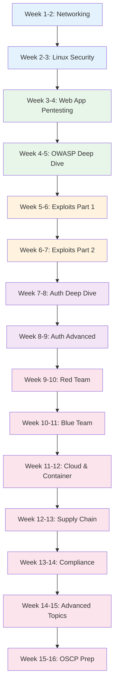

# Cybersecurity Engineer Learning Path

A structured 16-week journey through the Knowledge Vault for cybersecurity engineers. This path covers all 22 cybersecurity pages, 12 exploit deep dives, 12 deep authentication pages, supply chain security, compliance frameworks, and OSCP preparation. It covers both offensive (red team) and defensive (blue team) security.

## Who This Is For

- Developers transitioning into cybersecurity careers
- SOC analysts leveling up to penetration testing
- Security engineers preparing for OSCP or similar certifications
- Anyone building a comprehensive offensive + defensive security skillset

## Prerequisites

- Basic Linux command line proficiency
- Networking fundamentals (TCP/IP, DNS, HTTP)
- Basic programming in Python or another scripting language
- Familiarity with web applications (how they work at a high level)

**Total estimated time**: ~70 hours across 16 weeks

## Learning Progression

---

## Week 1-2: Networking Fundamentals

*Estimated reading time: 4 hours*

Security starts with understanding the network. You cannot attack or defend what you do not understand.

- [ ] **Required** -- [Networking Fundamentals](/cybersecurity/networking-fundamentals) *(30 min)*
- [ ] **Required** -- [TCP/IP Deep Dive](/system-design/networking/tcp-ip-deep-dive) *(30 min)*
- [ ] **Required** -- [DNS Deep Dive](/system-design/networking/dns-deep-dive) *(25 min)*
- [ ] **Required** -- [TLS Handshake](/system-design/networking/tls-handshake) *(20 min)*
- [ ] **Required** -- [HTTP/2 & HTTP/3](/system-design/networking/http2-http3) *(25 min)*
- [ ] **Required** -- [Network Attacks](/cybersecurity/network-attacks) *(25 min)*

::: tip Checkpoint
After this section you should be able to: analyze TCP handshakes with Wireshark, explain DNS resolution and poisoning attacks, understand TLS negotiation, and identify common network attack vectors.
:::

---

## Week 2-3: Linux Security

*Estimated reading time: 3.5 hours*

Most servers run Linux. Understand the OS from a security perspective.

- [ ] **Required** -- [Linux Security](/cybersecurity/linux-security) *(30 min)*
- [ ] **Required** -- [Linux Process Model](/infrastructure/linux-internals/process-model) *(30 min)*
- [ ] **Required** -- [Linux Memory Management](/infrastructure/linux-internals/memory-management) *(30 min)*
- [ ] **Required** -- [Containers from Scratch](/infrastructure/linux-internals/containers-from-scratch) *(35 min)*
- [ ] **Reference** -- [Linux Cheat Sheet](/cheat-sheets/linux) *(10 min)*
- [ ] **Reference** -- [Bash Cheat Sheet](/cheat-sheets/bash) *(10 min)*

---

## Week 3-4: Web Application Pentesting

*Estimated reading time: 4 hours*

Web apps are the most common attack surface. Learn to find and exploit vulnerabilities.

- [ ] **Required** -- [Web App Pentesting](/cybersecurity/web-app-pentesting) *(30 min)*
- [ ] **Required** -- [API Security Testing](/cybersecurity/api-security-testing) *(25 min)*
- [ ] **Required** -- [Security Tools](/cybersecurity/security-tools) *(25 min)*
- [ ] **Required** -- [OSINT](/cybersecurity/osint) *(25 min)*
- [ ] **Required** -- [Bug Bounty](/cybersecurity/bug-bounty) *(25 min)*
- [ ] **Required** -- [Secure Coding](/cybersecurity/secure-coding) *(25 min)*

---

## Week 4-5: OWASP Top 10 Deep Dive

*Estimated reading time: 4.5 hours*

- [ ] **Required** -- [OWASP Overview](/security/owasp/) *(15 min)*
- [ ] **Required** -- [A01: Broken Access Control](/security/owasp/a01-broken-access-control) *(25 min)*
- [ ] **Required** -- [A02: Cryptographic Failures](/security/owasp/a02-cryptographic-failures) *(25 min)*
- [ ] **Required** -- [A03: Injection](/security/owasp/a03-injection) *(25 min)*
- [ ] **Required** -- [A04: Insecure Design](/security/owasp/a04-insecure-design) *(25 min)*
- [ ] **Required** -- [A05: Security Misconfiguration](/security/owasp/a05-security-misconfiguration) *(25 min)*
- [ ] **Required** -- [A06: Vulnerable Components](/security/owasp/a06-vulnerable-components) *(20 min)*
- [ ] **Required** -- [A07: Authentication Failures](/security/owasp/a07-auth-failures) *(25 min)*
- [ ] **Required** -- [A08: Data Integrity Failures](/security/owasp/a08-data-integrity-failures) *(20 min)*
- [ ] **Required** -- [A09: Logging & Monitoring Failures](/security/owasp/a09-logging-monitoring-failures) *(20 min)*
- [ ] **Required** -- [A10: SSRF](/security/owasp/a10-ssrf) *(20 min)*

---

## Week 5-6: Real-World Exploits (Part 1)

*Estimated reading time: 4.5 hours*

Study real CVEs and exploit chains to understand how vulnerabilities are discovered and exploited.

- [ ] **Required** -- [Exploits Overview](/security/exploits/) *(15 min)*
- [ ] **Required** -- [XSS Advanced](/security/exploits/xss-advanced) *(25 min)*
- [ ] **Required** -- [Injection Advanced](/security/exploits/injection-advanced) *(25 min)*
- [ ] **Required** -- [Heartbleed](/security/exploits/heartbleed) *(25 min)*
- [ ] **Required** -- [Log4Shell](/security/exploits/log4shell) *(25 min)*
- [ ] **Required** -- [Dirty Pipe](/security/exploits/dirty-pipe) *(25 min)*
- [ ] **Required** -- [SolarWinds](/security/exploits/solarwinds) *(25 min)*

---

## Week 6-7: Real-World Exploits (Part 2)

*Estimated reading time: 4 hours*

- [ ] **Required** -- [Crypto Attacks](/security/exploits/crypto-attacks) *(25 min)*
- [ ] **Required** -- [Container Escapes](/security/exploits/container-escapes) *(25 min)*
- [ ] **Required** -- [Cloud Misconfigurations](/security/exploits/cloud-misconfigs) *(25 min)*
- [ ] **Required** -- [Spectre & Meltdown](/security/exploits/spectre-meltdown) *(25 min)*
- [ ] **Required** -- [XZ Backdoor 2024](/security/exploits/xz-backdoor-2024) *(25 min)*

---

## Week 7-8: Deep Authentication (Part 1)

*Estimated reading time: 5 hours*

Understand auth systems deeply to find and exploit auth vulnerabilities.

- [ ] **Required** -- [Authentication Overview](/security/authentication/) *(15 min)*
- [ ] **Required** -- [Auth Architecture](/security/authentication/auth-architecture) *(30 min)*
- [ ] **Required** -- [OAuth2 & OIDC](/security/authentication/oauth2-oidc) *(30 min)*
- [ ] **Required** -- [OAuth2 Flows](/security/authentication/oauth2-flows) *(25 min)*
- [ ] **Required** -- [JWT Deep Dive](/security/authentication/jwt-deep-dive) *(30 min)*
- [ ] **Required** -- [Session Deep Dive](/security/authentication/session-deep-dive) *(25 min)*
- [ ] **Required** -- [Token Strategies](/security/authentication/token-strategies) *(25 min)*
- [ ] **Required** -- [Auth Attack & Defense](/security/authentication/auth-attack-defense) *(30 min)*

---

## Week 8-9: Deep Authentication (Part 2) & Authorization

*Estimated reading time: 4.5 hours*

- [ ] **Required** -- [MFA Deep Dive](/security/authentication/mfa-deep-dive) *(25 min)*
- [ ] **Required** -- [Passkeys & WebAuthn](/security/authentication/passkeys-webauthn) *(25 min)*
- [ ] **Required** -- [API Key Design](/security/authentication/api-key-design) *(20 min)*
- [ ] **Required** -- [Enterprise SSO](/security/authentication/enterprise-sso) *(25 min)*
- [ ] **Required** -- [Authorization Overview](/security/authorization/) *(15 min)*
- [ ] **Required** -- [RBAC, ABAC, ReBAC](/security/authorization/rbac-abac-rebac) *(30 min)*
- [ ] **Required** -- [Zanzibar](/security/authorization/zanzibar) *(30 min)*
- [ ] **Required** -- [Policy Engines](/security/authorization/policy-engines) *(25 min)*

---

## Week 9-10: Red Team Operations

*Estimated reading time: 4 hours*

- [ ] **Required** -- [Red Team Ops](/cybersecurity/red-team-ops) *(30 min)*
- [ ] **Required** -- [Reverse Engineering](/cybersecurity/reverse-engineering) *(30 min)*
- [ ] **Required** -- [Malware Analysis](/cybersecurity/malware-analysis) *(30 min)*
- [ ] **Required** -- [Active Directory](/cybersecurity/active-directory) *(30 min)*
- [ ] **Required** -- [Cryptography Practical](/cybersecurity/cryptography-practical) *(25 min)*

---

## Week 10-11: Blue Team & SOC

*Estimated reading time: 4 hours*

- [ ] **Required** -- [Blue Team SOC](/cybersecurity/blue-team-soc) *(30 min)*
- [ ] **Required** -- [Incident Response & Forensics](/cybersecurity/incident-response-forensics) *(30 min)*
- [ ] **Required** -- [Incident Response Overview](/devops/incident-response/) *(15 min)*
- [ ] **Required** -- [Incident Classification](/devops/incident-response/incident-classification) *(20 min)*
- [ ] **Required** -- [Structured Logging](/devops/logging/structured-logging) *(25 min)*
- [ ] **Required** -- [Alert Design](/devops/alerting/alert-design) *(25 min)*

---

## Week 11-12: Cloud & Container Security

*Estimated reading time: 4 hours*

- [ ] **Required** -- [Cloud Pentesting](/cybersecurity/cloud-pentesting) *(30 min)*
- [ ] **Required** -- [Container Security](/cybersecurity/container-security) *(25 min)*
- [ ] **Required** -- [Docker Security Hardening](/infrastructure/docker/security-hardening) *(25 min)*
- [ ] **Required** -- [K8s RBAC](/infrastructure/kubernetes/rbac) *(25 min)*
- [ ] **Required** -- [K8s Network Policies](/infrastructure/kubernetes/network-policies) *(25 min)*
- [ ] **Optional** -- [AWS IAM Deep Dive](/infrastructure/aws/iam-deep-dive) *(25 min)*

---

## Week 12-13: Supply Chain Security

*Estimated reading time: 3 hours*

- [ ] **Required** -- [Supply Chain Security](/security/supply-chain/) *(25 min)*
- [ ] **Required** -- [XZ Backdoor 2024](/security/exploits/xz-backdoor-2024) *(25 min -- revisit)*
- [ ] **Required** -- [SolarWinds](/security/exploits/solarwinds) *(25 min -- revisit)*
- [ ] **Required** -- [Security Scanning in CI/CD](/infrastructure/ci-cd/security-scanning) *(25 min)*
- [ ] **Required** -- [Encryption Overview](/security/encryption/) *(15 min)*
- [ ] **Required** -- [Key Management](/security/encryption/key-management) *(25 min)*

---

## Week 13-14: Compliance & Governance

*Estimated reading time: 3.5 hours*

- [ ] **Required** -- [Compliance Overview](/security/compliance/) *(15 min)*
- [ ] **Required** -- [GDPR Engineering](/security/compliance/gdpr-engineering) *(30 min)*
- [ ] **Required** -- [SOC 2](/security/compliance/soc2) *(25 min)*
- [ ] **Required** -- [PCI-DSS](/security/compliance/pci-dss) *(25 min)*
- [ ] **Required** -- [Audit Logging](/security/compliance/audit-logging) *(25 min)*
- [ ] **Required** -- [Zero Trust Principles](/security/zero-trust/principles) *(25 min)*
- [ ] **Required** -- [Network Segmentation](/security/zero-trust/network-segmentation) *(25 min)*

---

## Week 14-15: Advanced Topics

*Estimated reading time: 4 hours*

- [ ] **Required** -- [Mobile Security](/cybersecurity/mobile-security) *(25 min)*
- [ ] **Required** -- [Web3 Security](/cybersecurity/web3-security) *(25 min)*
- [ ] **Required** -- [Security Certifications](/cybersecurity/security-certifications) *(20 min)*
- [ ] **Optional** -- [Secrets Management Overview](/security/secrets-management/) *(15 min)*
- [ ] **Optional** -- [HashiCorp Vault](/security/secrets-management/vault-deep-dive) *(30 min)*

**API security:**

- [ ] **Required** -- [API Security Overview](/security/api-security/) *(15 min)*
- [ ] **Required** -- [Input Validation](/security/api-security/input-validation) *(25 min)*
- [ ] **Required** -- [CORS Deep Dive](/security/api-security/cors-deep-dive) *(25 min)*
- [ ] **Required** -- [API Abuse Prevention](/security/api-security/api-abuse-prevention) *(25 min)*

---

## Week 15-16: OSCP Prep & Capstone

*Estimated reading time: 5 hours*

Synthesize everything into OSCP-style methodology.

### OSCP Methodology Review

Revisit these with an offensive security lens:

- [ ] **Review** -- [Web App Pentesting](/cybersecurity/web-app-pentesting) *(revisit)*
- [ ] **Review** -- [Network Attacks](/cybersecurity/network-attacks) *(revisit)*
- [ ] **Review** -- [Red Team Ops](/cybersecurity/red-team-ops) *(revisit)*
- [ ] **Review** -- [Linux Security](/cybersecurity/linux-security) *(revisit)*
- [ ] **Review** -- [Active Directory](/cybersecurity/active-directory) *(revisit)*

### War Room Case Studies

- [ ] **Optional** -- [CrowdStrike July 2024](/war-room/crowdstrike-july-2024) *(20 min)*
- [ ] **Optional** -- [Facebook October 2021](/war-room/facebook-october-2021) *(20 min)*
- [ ] **Optional** -- [Cloudflare Regex 2019](/war-room/cloudflare-regex-2019) *(20 min)*
- [ ] **Optional** -- [LiteLLM Supply Chain 2026](/war-room/litellm-supply-chain-2026) *(20 min)*

---

## What You Will Be Able to Do After This Path

- Perform web application and API penetration testing
- Analyze and understand real-world CVEs and exploit chains
- Conduct red team operations including AD attacks and reverse engineering
- Run blue team SOC operations with incident response and forensics
- Audit cloud and container environments for security vulnerabilities
- Assess and secure software supply chains
- Implement compliance frameworks (GDPR, SOC 2, PCI-DSS)
- Prepare for OSCP certification with systematic methodology

## Cross-References to Related Paths

- **[Security Engineer Path](/learning-paths/security-engineer)** -- AppSec, DevSecOps, and building secure systems
- **[DevOps Engineer Path](/learning-paths/devops-engineer)** -- Infrastructure security and incident response
- **[Platform Engineer Path](/learning-paths/platform-engineer)** -- K8s security, network segmentation
- **[Backend Engineer Path](/learning-paths/backend-engineer)** -- Understand the systems you are attacking/defending

---

::: info Total Progress
This path contains approximately 100 pages (22 cybersecurity + 12 exploits + 12 auth + OWASP + compliance + infrastructure). Budget 16 weeks at 4-5 hours per week. The OSCP prep section assumes you will supplement with hands-on labs (HackTheBox, TryHackMe, OffSec labs).
:::
