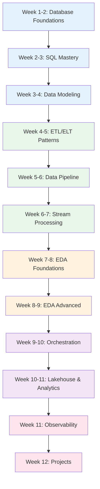

# Data Engineer Learning Path

A structured 12-week journey through the Knowledge Vault for aspiring and intermediate data engineers. This path covers SQL mastery, data modeling, ETL/ELT patterns, stream processing, the full 25-page data pipeline section, 69 EDA pages, real-time analytics, lakehouse architecture, orchestration with Airflow/Prefect, data quality with Great Expectations and Pandera, and production operations.

## Who This Is For

- Software engineers transitioning into data engineering
- Junior data engineers building towards mid/senior level
- Backend engineers who want to own data pipelines
- Anyone preparing for data engineering interviews

## Prerequisites

- Basic programming in Python
- Familiarity with SQL syntax (SELECT, JOIN, WHERE)
- Understanding of what a database is
- No prior data engineering experience required

**Total estimated time**: ~60 hours across 12 weeks

## Learning Progression

---

## Week 1-2: Database Foundations

*Estimated reading time: 6 hours*

- [ ] **Required** -- [Database Selection Guide](/system-design/databases/database-selection-guide) *(20 min)*
- [ ] **Required** -- [Storage Engines](/system-design/databases/storage-engines) *(30 min)*
- [ ] **Required** -- [PostgreSQL Internals](/system-design/databases/postgres-internals) *(35 min)*
- [ ] **Required** -- [Write-Ahead Logging](/system-design/databases/write-ahead-logging) *(25 min)*
- [ ] **Required** -- [Indexing Deep Dive](/system-design/databases/indexing-deep-dive) *(30 min)*
- [ ] **Required** -- [Isolation Levels](/system-design/databases/isolation-levels) *(25 min)*
- [ ] **Required** -- [MVCC](/system-design/databases/mvcc) *(20 min)*
- [ ] **Required** -- [Replication](/system-design/databases/replication) *(30 min)*
- [ ] **Required** -- [ClickHouse Internals](/system-design/databases/clickhouse-internals) *(25 min)*
- [ ] **Optional** -- [MongoDB Internals](/system-design/databases/mongodb-internals) *(25 min)*
- [ ] **Optional** -- [Time-Series Databases](/system-design/databases/time-series-databases) *(20 min)*

::: tip Checkpoint
After this section you should be able to explain: how B-tree indexes speed up queries, what WAL guarantees, why ClickHouse is fast for analytics (columnar storage, vectorized execution), and when to choose a columnar database over row-based.
:::

---

## Week 2-3: SQL Mastery

*Estimated reading time: 4 hours*

- [ ] **Required** -- [Query Planning & Optimization](/system-design/databases/query-planning-optimization) *(30 min)*
- [ ] **Required** -- [Index Strategy](/performance/database-tuning/index-strategy) *(25 min)*
- [ ] **Required** -- [Query Optimization](/performance/database-tuning/query-optimization) *(25 min)*
- [ ] **Required** -- [N+1 Problem](/performance/database-tuning/n-plus-one) *(20 min)*
- [ ] **Required** -- [Connection Pooling](/system-design/databases/connection-pooling) *(20 min)*
- [ ] **Required** -- [SQL Cheat Sheet](/cheat-sheets/sql) *(15 min)*
- [ ] **Required** -- [Advanced SQL Cheat Sheet](/cheat-sheets/sql-advanced) *(15 min)*
- [ ] **Optional** -- [Connection Pool Tuning](/performance/database-tuning/connection-pool-tuning) *(20 min)*
- [ ] **Optional** -- [VACUUM & ANALYZE](/performance/database-tuning/vacuum-analyze) *(20 min)*
- [ ] **Optional** -- [Database Profiling](/performance/profiling/database-profiling) *(25 min)*

::: tip Checkpoint
After this section you should be able to: read an EXPLAIN plan, design indexes for query patterns, write window functions and CTEs fluently, and understand why connection pooling matters for pipelines.
:::

---

## Week 3-4: Data Modeling

*Estimated reading time: 5 hours*

- [ ] **Required** -- [Data Modeling Overview](/data-engineering/data-modeling/) *(15 min)*
- [ ] **Required** -- [Normalization & Denormalization](/data-engineering/data-modeling/normalization-denormalization) *(30 min)*
- [ ] **Required** -- [Dimensional Modeling](/data-engineering/data-modeling/dimensional-modeling) *(35 min)*
- [ ] **Required** -- [Slowly Changing Dimensions](/data-engineering/data-modeling/slowly-changing-dimensions) *(30 min)*
- [ ] **Required** -- [Schema Evolution](/data-engineering/data-modeling/schema-evolution) *(25 min)*
- [ ] **Required** -- [Data Vault](/data-engineering/data-modeling/data-vault) *(30 min)*
- [ ] **Optional** -- [Event Schema Evolution](/architecture-patterns/event-driven/event-schema-evolution) *(25 min)*

---

## Week 4-5: ETL/ELT Patterns

*Estimated reading time: 5 hours*

- [ ] **Required** -- [ETL Patterns Overview](/data-engineering/etl-patterns/) *(15 min)*
- [ ] **Required** -- [ETL vs ELT](/data-engineering/etl-patterns/etl-vs-elt) *(25 min)*
- [ ] **Required** -- [Batch Processing](/data-engineering/etl-patterns/batch-processing) *(30 min)*
- [ ] **Required** -- [Incremental Loads](/data-engineering/etl-patterns/incremental-loads) *(25 min)*
- [ ] **Required** -- [Idempotent Pipelines](/data-engineering/etl-patterns/idempotent-pipelines) *(25 min)*
- [ ] **Required** -- [Error Handling](/data-engineering/etl-patterns/error-handling) *(25 min)*
- [ ] **Optional** -- [CDC Patterns](/data-engineering/pipeline-patterns/cdc-patterns) *(30 min)*

---

## Week 5-6: Data Pipeline (25 pages)

*Estimated reading time: 8 hours*

The complete data pipeline section covering preprocessing, ingestion, validation, and orchestration.

### Data Ingestion

- [ ] **Required** -- [Data Pipeline Overview](/data-pipeline/) *(15 min)*
- [ ] **Required** -- [Pipeline Patterns](/data-pipeline/pipeline-patterns) *(25 min)*
- [ ] **Required** -- [Database Extraction](/data-pipeline/database-extraction) *(20 min)*
- [ ] **Required** -- [API Ingestion](/data-pipeline/api-ingestion) *(20 min)*
- [ ] **Required** -- [Web Scraping](/data-pipeline/web-scraping) *(20 min)*
- [ ] **Required** -- [Data Contracts](/data-pipeline/data-contracts) *(25 min)*
- [ ] **Required** -- [File Formats](/data-pipeline/file-formats) *(20 min)*

### Preprocessing

- [ ] **Required** -- [Preprocessing Pipeline](/data-pipeline/preprocessing-pipeline) *(25 min)*
- [ ] **Required** -- [Numerical Preprocessing](/data-pipeline/numerical-preprocessing) *(20 min)*
- [ ] **Required** -- [Categorical Preprocessing](/data-pipeline/categorical-preprocessing) *(20 min)*
- [ ] **Required** -- [Text Preprocessing](/data-pipeline/text-preprocessing) *(20 min)*
- [ ] **Required** -- [Datetime Preprocessing](/data-pipeline/datetime-preprocessing) *(20 min)*
- [ ] **Required** -- [String Preprocessing](/data-pipeline/string-preprocessing) *(15 min)*
- [ ] **Optional** -- [Missing Imputation](/data-pipeline/missing-imputation) *(20 min)*
- [ ] **Optional** -- [Image Preprocessing](/data-pipeline/image-preprocessing) *(20 min)*
- [ ] **Optional** -- [Type Inference](/data-pipeline/type-inference) *(15 min)*
- [ ] **Optional** -- [Deduplication](/data-pipeline/deduplication) *(20 min)*

### Validation & Quality

- [ ] **Required** -- [Great Expectations](/data-pipeline/great-expectations) *(25 min)*
- [ ] **Required** -- [Pandera Validation](/data-pipeline/pandera-validation) *(20 min)*
- [ ] **Required** -- [Pipeline Monitoring](/data-pipeline/pipeline-monitoring) *(20 min)*

### Orchestration

- [ ] **Required** -- [Airflow Pipelines](/data-pipeline/airflow-pipelines) *(25 min)*
- [ ] **Required** -- [Prefect Pipelines](/data-pipeline/prefect-pipelines) *(25 min)*

::: tip Checkpoint
After this section you should be able to: build end-to-end data pipelines with ingestion, preprocessing, validation, and orchestration; choose between Airflow and Prefect; and implement data quality checks with Great Expectations and Pandera.
:::

---

## Week 6-7: Stream Processing

*Estimated reading time: 6 hours*

- [ ] **Required** -- [Stream Processing Overview](/data-engineering/stream-processing/) *(15 min)*
- [ ] **Required** -- [Kafka Internals](/system-design/message-queues/kafka-internals) *(35 min)*
- [ ] **Required** -- [Exactly-Once Processing](/data-engineering/stream-processing/exactly-once-processing) *(25 min)*
- [ ] **Required** -- [Windowing](/data-engineering/stream-processing/windowing) *(25 min)*
- [ ] **Required** -- [Watermarks](/data-engineering/stream-processing/watermarks) *(25 min)*
- [ ] **Required** -- [Backpressure](/data-engineering/stream-processing/backpressure) *(20 min)*
- [ ] **Required** -- [State Management](/data-engineering/stream-processing/state-management) *(25 min)*
- [ ] **Optional** -- [Kafka Streams](/system-design/message-queues/kafka-streams) *(25 min)*
- [ ] **Optional** -- [Kafka Connect](/system-design/message-queues/kafka-connect) *(20 min)*
- [ ] **Optional** -- [Ordering Guarantees](/system-design/message-queues/ordering-guarantees) *(25 min)*
- [ ] **Optional** -- [Queue Selection Guide](/system-design/message-queues/queue-selection-guide) *(20 min)*

---

## Week 7-8: EDA Foundations (Part 1 of 69 pages)

*Estimated reading time: 8 hours*

The first half of the comprehensive EDA section covering tools, univariate analysis, and data cleaning.

### Python Tools

- [ ] **Required** -- [EDA Overview](/eda/) *(15 min)*
- [ ] **Required** -- [EDA Workflow](/eda/eda-workflow) *(25 min)*
- [ ] **Required** -- [NumPy](/eda/numpy) *(25 min)*
- [ ] **Required** -- [Pandas Fundamentals](/eda/pandas-fundamentals) *(30 min)*
- [ ] **Required** -- [Pandas Advanced](/eda/pandas-advanced) *(30 min)*
- [ ] **Required** -- [Matplotlib](/eda/matplotlib) *(25 min)*
- [ ] **Required** -- [Seaborn](/eda/seaborn) *(25 min)*
- [ ] **Optional** -- [Plotly](/eda/plotly) *(25 min)*
- [ ] **Optional** -- [Polars for EDA](/eda/polars-for-eda) *(25 min)*
- [ ] **Optional** -- [SciPy Stats](/eda/scipy-stats) *(25 min)*
- [ ] **Reference** -- [Pandas EDA Cheat Sheet](/cheat-sheets/pandas-eda) *(10 min)*

### Univariate Analysis

- [ ] **Required** -- [Data Types Deep Dive](/eda/data-types-deep-dive) *(20 min)*
- [ ] **Required** -- [Understanding Distributions](/eda/understanding-distributions) *(25 min)*
- [ ] **Required** -- [Univariate Numerical](/eda/univariate-numerical) *(25 min)*
- [ ] **Required** -- [Univariate Categorical](/eda/univariate-categorical) *(25 min)*
- [ ] **Required** -- [Univariate Temporal](/eda/univariate-temporal) *(20 min)*
- [ ] **Optional** -- [Univariate Text](/eda/univariate-text) *(20 min)*
- [ ] **Optional** -- [Understanding Scale](/eda/understanding-scale) *(20 min)*

### Data Cleaning

- [ ] **Required** -- [Missing Data](/eda/missing-data) *(25 min)*
- [ ] **Required** -- [Outlier Analysis](/eda/outlier-analysis) *(25 min)*
- [ ] **Required** -- [Data Profiling](/eda/data-profiling) *(20 min)*
- [ ] **Required** -- [Data Cleaning Categories](/eda/data-cleaning-categories) *(20 min)*
- [ ] **Optional** -- [Data Cleaning Dates](/eda/data-cleaning-dates) *(20 min)*
- [ ] **Optional** -- [Data Cleaning Text](/eda/data-cleaning-text) *(20 min)*
- [ ] **Optional** -- [Data Cleaning Edge Cases](/eda/data-cleaning-edge-cases) *(20 min)*

---

## Week 8-9: EDA Advanced (Part 2 of 69 pages)

*Estimated reading time: 8 hours*

Bivariate/multivariate analysis, feature engineering, statistical testing, and domain-specific EDA.

### Bivariate & Multivariate

- [ ] **Required** -- [Bivariate Num-Num](/eda/bivariate-num-num) *(25 min)*
- [ ] **Required** -- [Bivariate Cat-Num](/eda/bivariate-cat-num) *(25 min)*
- [ ] **Required** -- [Bivariate Cat-Cat](/eda/bivariate-cat-cat) *(20 min)*
- [ ] **Required** -- [Multivariate](/eda/multivariate) *(25 min)*
- [ ] **Required** -- [Correlation Traps](/eda/correlation-traps) *(20 min)*
- [ ] **Required** -- [Multicollinearity](/eda/multicollinearity) *(20 min)*

### Feature Engineering

- [ ] **Required** -- [Feature Creation](/eda/feature-creation) *(25 min)*
- [ ] **Required** -- [Encoding Strategies](/eda/encoding-strategies) *(25 min)*
- [ ] **Required** -- [Scaling & Normalization](/eda/scaling-normalization) *(20 min)*
- [ ] **Required** -- [Transformations](/eda/transformations) *(20 min)*
- [ ] **Optional** -- [Text Features](/eda/text-features) *(20 min)*
- [ ] **Optional** -- [Datetime Features](/eda/datetime-features) *(20 min)*
- [ ] **Optional** -- [High Cardinality](/eda/high-cardinality) *(20 min)*

### Advanced Topics

- [ ] **Required** -- [Imbalanced Data](/eda/imbalanced-data) *(20 min)*
- [ ] **Required** -- [Data Quality Validation](/eda/data-quality-validation) *(20 min)*
- [ ] **Required** -- [Data Leakage](/eda/data-leakage) *(20 min)*
- [ ] **Required** -- [Sampling Strategies](/eda/sampling-strategies) *(20 min)*
- [ ] **Optional** -- [Statistical Test Selector](/eda/statistical-test-selector) *(20 min)*
- [ ] **Optional** -- [Statistical Power](/eda/statistical-power) *(20 min)*
- [ ] **Optional** -- [Data Drift](/eda/data-drift) *(20 min)*
- [ ] **Optional** -- [Reproducibility](/eda/reproducibility) *(20 min)*
- [ ] **Optional** -- [Large Datasets](/eda/large-datasets) *(20 min)*
- [ ] **Optional** -- [Small Datasets](/eda/small-datasets) *(15 min)*
- [ ] **Optional** -- [EDA Checklist](/eda/eda-checklist) *(15 min)*
- [ ] **Optional** -- [Visualization Decision Tree](/eda/visualization-decision-tree) *(15 min)*
- [ ] **Optional** -- [Automated EDA](/eda/automated-eda) *(20 min)*
- [ ] **Optional** -- [Communicating Findings](/eda/communicating-findings) *(20 min)*

---

## Week 9-10: Orchestration & Pipeline Patterns

*Estimated reading time: 5 hours*

- [ ] **Required** -- [Pipeline Patterns Overview](/data-engineering/pipeline-patterns/) *(15 min)*
- [ ] **Required** -- [Orchestration](/data-engineering/pipeline-patterns/orchestration) *(30 min)*
- [ ] **Required** -- [Data Lineage](/data-engineering/pipeline-patterns/data-lineage) *(25 min)*
- [ ] **Required** -- [Testing Data Pipelines](/data-engineering/pipeline-patterns/testing-data-pipelines) *(25 min)*
- [ ] **Required** -- [Data Quality Checks](/data-engineering/pipeline-patterns/data-quality-checks) *(25 min)*
- [ ] **Required** -- [Job Queue Blueprint](/production-blueprints/job-queue/) *(40 min)*
- [ ] **Optional** -- [Docker Overview](/infrastructure/docker/) *(15 min)*
- [ ] **Optional** -- [Production Dockerfiles](/infrastructure/docker/production-dockerfiles) *(25 min)*
- [ ] **Optional** -- [GitHub Actions Deep Dive](/infrastructure/ci-cd/github-actions-deep-dive) *(30 min)*

---

## Week 10-11: Lakehouse & Real-Time Analytics

*Estimated reading time: 5 hours*

- [ ] **Required** -- [Lakehouse Overview](/data-engineering/lakehouse/) *(15 min)*
- [ ] **Required** -- [Medallion Architecture](/data-engineering/lakehouse/medallion-architecture) *(25 min)*
- [ ] **Required** -- [Table Formats](/data-engineering/lakehouse/table-formats) *(25 min)*
- [ ] **Required** -- [Query Engines](/data-engineering/lakehouse/query-engines) *(25 min)*
- [ ] **Required** -- [Real-Time Analytics Overview](/data-engineering/real-time-analytics/) *(15 min)*
- [ ] **Required** -- [ClickHouse vs Druid vs Pinot](/data-engineering/real-time-analytics/clickhouse-vs-druid-vs-pinot) *(25 min)*
- [ ] **Optional** -- [Analytics Pipeline Blueprint](/production-blueprints/analytics-pipeline/) *(40 min)*
- [ ] **Optional** -- [Realtime Pipeline Blueprint](/production-blueprints/realtime-pipeline/) *(35 min)*

---

## Week 11: Observability & Operations

*Estimated reading time: 4 hours*

- [ ] **Required** -- [Monitoring Overview](/devops/monitoring/) *(15 min)*
- [ ] **Required** -- [Metrics Design](/devops/monitoring/metrics-design) *(25 min)*
- [ ] **Required** -- [Structured Logging](/devops/logging/structured-logging) *(25 min)*
- [ ] **Required** -- [Alert Design](/devops/alerting/alert-design) *(25 min)*
- [ ] **Required** -- [Correlation IDs](/devops/logging/correlation-ids) *(20 min)*
- [ ] **Optional** -- [Grafana Dashboards](/devops/monitoring/grafana-dashboards) *(25 min)*

---

## Week 12: Capstone Projects

*Estimated reading time: 3 hours + project time*

### EDA Projects

- [ ] **Optional** -- [Project: Titanic](/eda/project-titanic) *(30 min)*
- [ ] **Optional** -- [Project: E-Commerce](/eda/project-ecommerce) *(30 min)*
- [ ] **Optional** -- [Project: Financial](/eda/project-financial) *(30 min)*
- [ ] **Optional** -- [Project: Healthcare](/eda/project-healthcare) *(30 min)*
- [ ] **Optional** -- [Project: NLP](/eda/project-nlp) *(30 min)*

### Pipeline Projects

- [ ] **Optional** -- [Project: E-Commerce Pipeline](/data-pipeline/project-ecommerce-pipeline) *(30 min)*
- [ ] **Optional** -- [Project: IoT Streaming](/data-pipeline/project-iot-streaming) *(30 min)*
- [ ] **Optional** -- [Project: Real Estate](/data-pipeline/project-real-estate) *(30 min)*

### Production Blueprints

- [ ] **Required** -- [Analytics Pipeline Blueprint](/production-blueprints/analytics-pipeline/) *(40 min)*
- [ ] **Required** -- [Search Service Blueprint](/production-blueprints/search-service/) *(40 min)*
- [ ] **Optional** -- [Audit Log Blueprint](/production-blueprints/audit-log/) *(35 min)*

---

## What You Will Be Able to Do After This Path

- Design star schemas, Data Vault models, and SCDs for any business domain
- Build idempotent ETL/ELT pipelines with proper error handling
- Process streaming data with Kafka, windowing, and watermarks
- Perform comprehensive EDA with pandas, matplotlib, seaborn, and plotly
- Orchestrate pipelines with Airflow or Prefect
- Validate data quality with Great Expectations and Pandera
- Design lakehouse architectures with medallion layers
- Build real-time analytics with ClickHouse, Druid, or Pinot

## Cross-References to Related Paths

- **[Data Scientist Path](/learning-paths/data-scientist)** -- From EDA into ML/DL modeling
- **[ML/DL Engineer Path](/learning-paths/ml-dl-engineer)** -- Deep learning after data foundations
- **[AI/ML Engineer Path](/learning-paths/ai-ml-engineer)** -- AI engineering and LLM integration
- **[Backend Engineer Path](/learning-paths/backend-engineer)** -- Backend systems that feed data pipelines
- **[Platform Engineer Path](/learning-paths/platform-engineer)** -- Infrastructure for data platforms

---

::: info Total Progress
This path contains approximately 130 pages (including 69 EDA pages and 25 data pipeline pages). Budget 12 weeks at 5 hours per week. The EDA section alone could take 3-4 weeks of focused study.
:::
