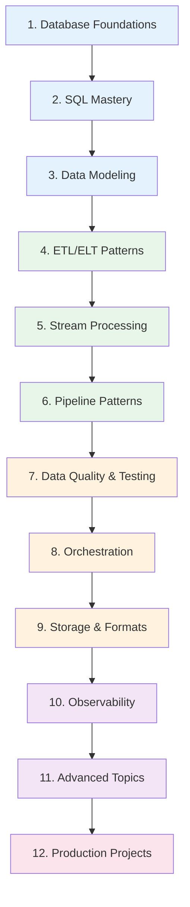

# Data Engineer Learning Path

A structured journey through the Knowledge Vault for aspiring and intermediate data engineers. This path takes you from SQL fundamentals through data modeling, ETL/ELT patterns, stream processing, pipeline orchestration, data quality, and production operations.

Data engineering sits at the intersection of software engineering and data science. You build the plumbing that moves, transforms, and stores data so that analysts, scientists, and product teams can make decisions. This path gives you the engineering foundations — the "how it works" that separates a data engineer from someone who writes SQL queries.

**Total estimated time**: ~45 hours across 12 weeks

**Prerequisites**: Basic programming in Python or another language. Familiarity with SQL syntax (SELECT, JOIN, WHERE). Understanding of what a database is. No prior data engineering experience required.

## Learning Progression

---

## Week 1-2: Database Foundations

*Estimated reading time: 6 hours*

Before you can build data pipelines, you need to understand where data lives and how databases work under the hood. This section covers the internals that explain why some queries are fast and others are slow.

- [ ] **Required** — [Database Selection Guide](/system-design/databases/database-selection-guide) *(20 min)*
- [ ] **Required** — [Storage Engines](/system-design/databases/storage-engines) *(30 min)*
- [ ] **Required** — [PostgreSQL Internals](/system-design/databases/postgres-internals) *(35 min)*
- [ ] **Required** — [Write-Ahead Logging](/system-design/databases/write-ahead-logging) *(25 min)*
- [ ] **Required** — [Indexing Deep Dive](/system-design/databases/indexing-deep-dive) *(30 min)*
- [ ] **Required** — [Isolation Levels](/system-design/databases/isolation-levels) *(25 min)*
- [ ] **Required** — [MVCC](/system-design/databases/mvcc) *(20 min)*
- [ ] **Required** — [Replication](/system-design/databases/replication) *(30 min)*
- [ ] **Optional** — [MongoDB Internals](/system-design/databases/mongodb-internals) *(25 min)*
- [ ] **Optional** — [ClickHouse Internals](/system-design/databases/clickhouse-internals) *(25 min)*
- [ ] **Optional** — [Time-Series Databases](/system-design/databases/time-series-databases) *(20 min)*

::: tip Checkpoint
After this section you should be able to explain: how a B-tree index speeds up queries, what WAL guarantees for crash recovery, why MVCC matters for concurrent reads, and when to choose a columnar database (ClickHouse) over a row-based one (PostgreSQL) for analytics.
:::

---

## Week 2-3: SQL Mastery

*Estimated reading time: 4 hours*

SQL is the lingua franca of data engineering. You will write it every day — for transformations, data quality checks, and analytical queries. Go beyond basic SELECT statements.

- [ ] **Required** — [Query Planning & Optimization](/system-design/databases/query-planning-optimization) *(30 min)*
- [ ] **Required** — [Index Strategy](/performance/database-tuning/index-strategy) *(25 min)*
- [ ] **Required** — [Query Optimization](/performance/database-tuning/query-optimization) *(25 min)*
- [ ] **Required** — [N+1 Problem](/performance/database-tuning/n-plus-one) *(20 min)*
- [ ] **Required** — [Connection Pooling](/system-design/databases/connection-pooling) *(20 min)*
- [ ] **Required** — [SQL Cheat Sheet](/cheat-sheets/sql) *(15 min — reference)*
- [ ] **Optional** — [Connection Pool Tuning](/performance/database-tuning/connection-pool-tuning) *(20 min)*
- [ ] **Optional** — [VACUUM & ANALYZE](/performance/database-tuning/vacuum-analyze) *(20 min)*
- [ ] **Optional** — [Database Profiling](/performance/profiling/database-profiling) *(25 min)*

::: tip Checkpoint
After this section you should be able to: read an EXPLAIN plan and identify bottlenecks, design indexes for common query patterns, understand why connection pooling matters for data pipelines, and write window functions and CTEs fluently.
:::

---

## Week 3-4: Data Modeling

*Estimated reading time: 5 hours*

Data modeling is the most important skill a data engineer can have. A good data model makes pipelines simple and queries fast. A bad data model means every downstream consumer fights the schema.

- [ ] **Required** — [Data Modeling Overview](/data-engineering/data-modeling/) *(15 min)*
- [ ] **Required** — [Normalization & Denormalization](/data-engineering/data-modeling/normalization-denormalization) *(30 min)*
- [ ] **Required** — [Dimensional Modeling](/data-engineering/data-modeling/dimensional-modeling) *(35 min)*
- [ ] **Required** — [Slowly Changing Dimensions](/data-engineering/data-modeling/slowly-changing-dimensions) *(30 min)*
- [ ] **Required** — [Schema Evolution](/data-engineering/data-modeling/schema-evolution) *(25 min)*
- [ ] **Required** — [Data Vault](/data-engineering/data-modeling/data-vault) *(30 min)*
- [ ] **Optional** — [Event Schema Evolution](/architecture-patterns/event-driven/event-schema-evolution) *(25 min)*

::: tip Checkpoint
After this section you should be able to: design a star schema for a business domain, explain SCD Types 1, 2, and 3 with real examples, handle schema evolution without breaking consumers, and articulate when Data Vault is preferable to Kimball-style dimensional modeling.
:::

---

## Week 4-5: ETL/ELT Patterns

*Estimated reading time: 5 hours*

ETL (Extract, Transform, Load) is the daily work of data engineering. Modern architectures often use ELT (load first, transform in the warehouse), but understanding both patterns and when to use each is essential.

- [ ] **Required** — [ETL Patterns Overview](/data-engineering/etl-patterns/) *(15 min)*
- [ ] **Required** — [ETL vs ELT](/data-engineering/etl-patterns/etl-vs-elt) *(25 min)*
- [ ] **Required** — [Batch Processing](/data-engineering/etl-patterns/batch-processing) *(30 min)*
- [ ] **Required** — [Incremental Loads](/data-engineering/etl-patterns/incremental-loads) *(25 min)*
- [ ] **Required** — [Idempotent Pipelines](/data-engineering/etl-patterns/idempotent-pipelines) *(25 min)*
- [ ] **Required** — [Error Handling](/data-engineering/etl-patterns/error-handling) *(25 min)*
- [ ] **Optional** — [CDC Patterns](/data-engineering/pipeline-patterns/cdc-patterns) *(30 min)*

::: tip Checkpoint
After this section you should be able to: design an idempotent pipeline that can be safely retried, implement incremental loads using watermarks and change timestamps, explain the trade-offs between ETL and ELT, and handle late-arriving data gracefully.
:::

---

## Week 5-7: Stream Processing

*Estimated reading time: 6 hours*

Batch processing runs hourly or daily. Stream processing runs continuously on data as it arrives. Understanding both is essential for a modern data engineer.

- [ ] **Required** — [Stream Processing Overview](/data-engineering/stream-processing/) *(15 min)*
- [ ] **Required** — [Kafka Internals](/system-design/message-queues/kafka-internals) *(35 min)*
- [ ] **Required** — [Exactly-Once Processing](/data-engineering/stream-processing/exactly-once-processing) *(25 min)*
- [ ] **Required** — [Watermarks](/data-engineering/stream-processing/watermarks) *(25 min)*
- [ ] **Required** — [Backpressure](/data-engineering/stream-processing/backpressure) *(20 min)*
- [ ] **Required** — [State Management](/data-engineering/stream-processing/state-management) *(25 min)*
- [ ] **Optional** — [Ordering Guarantees](/system-design/message-queues/ordering-guarantees) *(25 min)*
- [ ] **Optional** — [Exactly-Once Semantics](/system-design/message-queues/exactly-once-semantics) *(25 min)*
- [ ] **Optional** — [Redis Streams](/system-design/message-queues/redis-streams) *(20 min)*
- [ ] **Optional** — [Queue Selection Guide](/system-design/message-queues/queue-selection-guide) *(20 min)*
- [ ] **Optional** — [Backpressure Patterns](/system-design/message-queues/backpressure-patterns) *(20 min)*

::: tip Checkpoint
After this section you should be able to: explain Kafka partitions, consumer groups, and offset management, implement exactly-once processing with idempotent consumers, handle out-of-order events using watermarks, and design backpressure mechanisms to prevent downstream overload.
:::

---

## Week 7-8: Pipeline Patterns

*Estimated reading time: 4 hours*

Individual ETL jobs combine into complex pipelines. Understanding orchestration patterns, data lineage, and testing strategies separates junior from senior data engineers.

- [ ] **Required** — [Pipeline Patterns Overview](/data-engineering/pipeline-patterns/) *(15 min)*
- [ ] **Required** — [Orchestration](/data-engineering/pipeline-patterns/orchestration) *(30 min)*
- [ ] **Required** — [Data Lineage](/data-engineering/pipeline-patterns/data-lineage) *(25 min)*
- [ ] **Required** — [Testing Data Pipelines](/data-engineering/pipeline-patterns/testing-data-pipelines) *(25 min)*
- [ ] **Required** — [Data Quality Checks](/data-engineering/pipeline-patterns/data-quality-checks) *(25 min)*
- [ ] **Optional** — [Dead Letter Queues](/system-design/message-queues/dead-letter-queues) *(20 min)*

::: tip Checkpoint
After this section you should be able to: design a pipeline DAG with proper dependency management, implement data quality checks (null rates, cardinality, freshness), build data lineage tracking for impact analysis, and write meaningful tests for data transformations.
:::

---

## Week 8-9: Orchestration & Infrastructure

*Estimated reading time: 5 hours*

Data pipelines need scheduling, dependency management, retry logic, and monitoring. This section covers the infrastructure that keeps pipelines running.

- [ ] **Required** — [Job Queue Blueprint](/production-blueprints/job-queue/) *(40 min)*
- [ ] **Required** — [Docker Overview](/infrastructure/docker/) *(15 min)*
- [ ] **Required** — [Production Dockerfiles](/infrastructure/docker/production-dockerfiles) *(25 min)*
- [ ] **Required** — [Compose Patterns](/infrastructure/docker/compose-patterns) *(25 min)*
- [ ] **Optional** — [Kubernetes Overview](/infrastructure/kubernetes/) *(15 min)*
- [ ] **Optional** — [GitHub Actions Deep Dive](/infrastructure/ci-cd/github-actions-deep-dive) *(30 min)*
- [ ] **Optional** — [Pipeline Patterns (CI/CD)](/infrastructure/ci-cd/pipeline-patterns) *(25 min)*
- [ ] **Reference** — [Python Cheat Sheet](/cheat-sheets/python) *(10 min)*
- [ ] **Reference** — [Docker Cheat Sheet](/cheat-sheets/docker) *(10 min)*

::: tip Checkpoint
After this section you should be able to: containerize a data pipeline for reproducible execution, implement retry logic with exponential backoff for failed jobs, set up CI/CD for pipeline deployments, and understand Kubernetes enough to deploy pipelines on K8s.
:::

---

## Week 9-10: Storage Formats & Analytics Engines

*Estimated reading time: 4 hours*

Data engineers must choose the right storage format and engine for each workload. Columnar formats (Parquet), OLAP databases (ClickHouse), and data lakes are the building blocks of modern data platforms.

- [ ] **Required** — [ClickHouse Internals](/system-design/databases/clickhouse-internals) *(25 min)*
- [ ] **Required** — [DynamoDB Internals](/system-design/databases/dynamodb-internals) *(25 min)*
- [ ] **Required** — [Cassandra Internals](/system-design/databases/cassandra-internals) *(25 min)*
- [ ] **Required** — [Sharding](/system-design/databases/sharding) *(30 min)*
- [ ] **Required** — [Analytics Pipeline Blueprint](/production-blueprints/analytics-pipeline/) *(40 min)*
- [ ] **Optional** — [S3 & CloudFront](/infrastructure/aws/s3-cloudfront) *(25 min)*
- [ ] **Optional** — [Elasticsearch Internals](/system-design/databases/elasticsearch-internals) *(25 min)*
- [ ] **Optional** — [Time-Series Databases](/system-design/databases/time-series-databases) *(20 min)*

::: tip Checkpoint
After this section you should be able to: explain why ClickHouse is fast for analytical queries (columnar storage, vectorized execution), choose between Parquet and Avro for different use cases, design a data lake architecture on S3, and explain sharding strategies for large-scale data systems.
:::

---

## Week 10-11: Observability & Operations

*Estimated reading time: 4 hours*

A pipeline that runs is useful. A pipeline you can monitor, debug, and trust is production-grade. This section covers the operational side of data engineering.

- [ ] **Required** — [Monitoring Overview](/devops/monitoring/) *(15 min)*
- [ ] **Required** — [Metrics Design](/devops/monitoring/metrics-design) *(25 min)*
- [ ] **Required** — [Structured Logging](/devops/logging/structured-logging) *(25 min)*
- [ ] **Required** — [Alert Design](/devops/alerting/alert-design) *(25 min)*
- [ ] **Required** — [Correlation IDs](/devops/logging/correlation-ids) *(20 min)*
- [ ] **Optional** — [Grafana Dashboards](/devops/monitoring/grafana-dashboards) *(25 min)*
- [ ] **Optional** — [Log Aggregation](/devops/logging/log-aggregation) *(20 min)*
- [ ] **Optional** — [Incident Classification](/devops/incident-response/incident-classification) *(20 min)*

::: tip Checkpoint
After this section you should be able to: design a monitoring dashboard for a data pipeline (latency, throughput, error rate, data freshness), implement structured logging with correlation IDs for tracing, set up meaningful alerts that avoid alert fatigue, and investigate data quality incidents systematically.
:::

---

## Week 11-12: Advanced Topics

*Estimated reading time: 4 hours*

These topics deepen your understanding and prepare you for senior data engineering roles.

- [ ] **Optional** — [CAP Theorem](/system-design/distributed-systems/cap-theorem) *(25 min)*
- [ ] **Optional** — [Consistency Models](/system-design/distributed-systems/consistency-models) *(30 min)*
- [ ] **Optional** — [Distributed Transactions](/system-design/distributed-systems/distributed-transactions) *(30 min)*
- [ ] **Optional** — [Event-Driven Architecture](/architecture-patterns/event-driven/) *(15 min)*
- [ ] **Optional** — [Event Types](/architecture-patterns/event-driven/event-types) *(20 min)*
- [ ] **Optional** — [Eventual Consistency](/architecture-patterns/event-driven/eventual-consistency) *(25 min)*
- [ ] **Optional** — [CQRS Deep Dive](/architecture-patterns/cqrs-event-sourcing/cqrs-deep-dive) *(30 min)*
- [ ] **Optional** — [Event Sourcing](/architecture-patterns/cqrs-event-sourcing/event-sourcing-deep-dive) *(30 min)*

::: tip Checkpoint
After this section you should understand: how the CAP theorem constrains distributed data systems, when eventual consistency is acceptable vs when you need strong consistency, how CQRS and event sourcing relate to data engineering patterns, and how event-driven architectures feed into data pipelines.
:::

---

## Week 12: Capstone — Production Projects

*Estimated reading time: 3 hours (reading) + project time*

Tie everything together by studying production blueprints that integrate the concepts from this path.

- [ ] **Required** — [Analytics Pipeline Blueprint](/production-blueprints/analytics-pipeline/) *(40 min)*
- [ ] **Required** — [Search Service Blueprint](/production-blueprints/search-service/) *(40 min)*
- [ ] **Required** — [Audit Log Blueprint](/production-blueprints/audit-log/) *(35 min)*
- [ ] **Optional** — [Realtime Pipeline Blueprint](/production-blueprints/realtime-pipeline/) *(35 min)*

### Suggested Capstone Project

Build a mini analytics pipeline:

1. **Source**: Generate mock clickstream events (page views, clicks, conversions)
2. **Ingest**: Kafka (or Redis Streams) for real-time ingestion
3. **Transform**: Python worker that enriches and transforms events
4. **Store**: ClickHouse for analytical queries, S3 for raw event archive
5. **Dashboard**: Grafana connected to ClickHouse for real-time metrics
6. **Quality**: Data quality checks on freshness, completeness, and schema conformance

---

## Career Progression

| Level | Focus Areas | Key Skills |
|---|---|---|
| **Junior DE** | SQL, basic ETL, one tool deeply (Airflow/dbt) | Write clean SQL, build simple pipelines |
| **Mid-Level DE** | Data modeling, stream processing, testing | Design schemas, handle production issues |
| **Senior DE** | Architecture, platform work, mentoring | Design data platforms, optimize at scale |
| **Staff DE** | Cross-team data strategy, governance | Define data standards, influence org-wide |

---

::: tip This Path Is a Starting Point
Data engineering is a broad field. This path covers the engineering fundamentals. You will also need to learn specific tools (Airflow, dbt, Spark, Flink, Snowflake) depending on your company's stack. The principles in this path transfer across all tools.
:::
