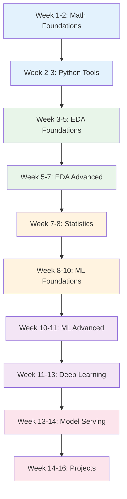

# Data Scientist Learning Path

A structured 16-week journey through the Knowledge Vault for aspiring data scientists. This path follows the natural progression: math foundations, Python tooling, EDA (69 pages), statistics, ML algorithms (30 pages), deep learning (25 pages), model evaluation, and deployment. It is the most comprehensive data-focused path, combining analytical depth with engineering skills.

## Who This Is For

- Students or professionals starting a data science career
- Analysts transitioning into data science (you know SQL and Excel, now learn ML)
- Engineers who want to understand the full data science workflow
- Anyone preparing for data science interviews

## Prerequisites

- Basic Python programming (functions, loops, dictionaries)
- High school level math (algebra, basic probability)
- Willingness to learn linear algebra and calculus fundamentals
- No prior ML or statistics experience required

**Total estimated time**: ~80 hours across 16 weeks (5 hrs/week)

## Learning Progression

---

## Week 1-2: Math Foundations

*Estimated reading time: 5 hours*

Data science is applied math. Build the foundation before touching data.

- [ ] **Required** -- [Math Foundations](/machine-learning/math-foundations) *(35 min)*
- [ ] **Required** -- [Probability for Engineers](/algorithms/probability-for-engineers) *(30 min)*
- [ ] **Required** -- [Statistics & A/B Testing](/algorithms/statistics-ab-testing) *(30 min)*
- [ ] **Required** -- [System Design Math](/algorithms/system-design-math) *(25 min)*
- [ ] **Reference** -- [Python Cheat Sheet](/cheat-sheets/python) *(10 min)*

**EDA statistics cross-reference:**
- [ ] **Required** -- [SciPy Stats](/eda/scipy-stats) *(25 min)*
- [ ] **Required** -- [Understanding Distributions](/eda/understanding-distributions) *(25 min)*
- [ ] **Required** -- [Statistical Test Selector](/eda/statistical-test-selector) *(20 min)*
- [ ] **Optional** -- [Statistical Power](/eda/statistical-power) *(20 min)*

::: tip Checkpoint
After this section you should be able to: explain Bayes' theorem, compute expected values, understand normal/binomial/Poisson distributions, perform basic hypothesis tests, and use SciPy for statistical computations.
:::

---

## Week 2-3: Python Data Science Tools

*Estimated reading time: 5 hours*

Master the Python tools you will use every day as a data scientist.

- [ ] **Required** -- [Python ML Ecosystem](/machine-learning/python-ml-ecosystem) *(25 min)*
- [ ] **Required** -- [NumPy](/eda/numpy) *(25 min)*
- [ ] **Required** -- [Pandas Fundamentals](/eda/pandas-fundamentals) *(30 min)*
- [ ] **Required** -- [Pandas Advanced](/eda/pandas-advanced) *(30 min)*
- [ ] **Required** -- [Matplotlib](/eda/matplotlib) *(25 min)*
- [ ] **Required** -- [Seaborn](/eda/seaborn) *(25 min)*
- [ ] **Required** -- [Plotly](/eda/plotly) *(25 min)*
- [ ] **Optional** -- [Polars for EDA](/eda/polars-for-eda) *(25 min)*
- [ ] **Optional** -- [Streamlit](/eda/streamlit) *(20 min)*
- [ ] **Reference** -- [Pandas EDA Cheat Sheet](/cheat-sheets/pandas-eda) *(10 min)*
- [ ] **Reference** -- [Scikit-learn Cheat Sheet](/cheat-sheets/scikit-learn) *(10 min)*

::: tip Checkpoint
After this section you should be able to: manipulate dataframes with pandas fluently, create publication-quality visualizations, and build interactive dashboards with Streamlit.
:::

---

## Week 3-5: EDA Foundations (Part 1 of 69 pages)

*Estimated reading time: 8 hours*

Exploratory Data Analysis is the core skill of data science. You spend 80% of your time here.

### Workflow & Data Understanding

- [ ] **Required** -- [EDA Overview](/eda/) *(15 min)*
- [ ] **Required** -- [EDA Workflow](/eda/eda-workflow) *(25 min)*
- [ ] **Required** -- [Asking Right Questions](/eda/asking-right-questions) *(20 min)*
- [ ] **Required** -- [Data Collection](/eda/data-collection) *(20 min)*
- [ ] **Required** -- [Data Shapes & Structures](/eda/data-shapes-structures) *(20 min)*
- [ ] **Required** -- [Data Types Deep Dive](/eda/data-types-deep-dive) *(20 min)*
- [ ] **Required** -- [Data Profiling](/eda/data-profiling) *(20 min)*

### Univariate Analysis

- [ ] **Required** -- [Univariate Numerical](/eda/univariate-numerical) *(25 min)*
- [ ] **Required** -- [Univariate Categorical](/eda/univariate-categorical) *(25 min)*
- [ ] **Required** -- [Univariate Temporal](/eda/univariate-temporal) *(20 min)*
- [ ] **Required** -- [Univariate Text](/eda/univariate-text) *(20 min)*
- [ ] **Required** -- [Understanding Scale](/eda/understanding-scale) *(20 min)*

### Data Cleaning

- [ ] **Required** -- [Missing Data](/eda/missing-data) *(25 min)*
- [ ] **Required** -- [Outlier Analysis](/eda/outlier-analysis) *(25 min)*
- [ ] **Required** -- [Data Cleaning Categories](/eda/data-cleaning-categories) *(20 min)*
- [ ] **Required** -- [Data Cleaning Dates](/eda/data-cleaning-dates) *(20 min)*
- [ ] **Required** -- [Data Cleaning Text](/eda/data-cleaning-text) *(20 min)*
- [ ] **Optional** -- [Data Cleaning Edge Cases](/eda/data-cleaning-edge-cases) *(20 min)*

::: tip Checkpoint
After this section you should be able to: profile any dataset systematically, perform univariate analysis for all data types, handle missing data with appropriate strategies, and detect and handle outliers.
:::

---

## Week 5-7: EDA Advanced (Part 2 of 69 pages)

*Estimated reading time: 10 hours*

### Bivariate & Multivariate

- [ ] **Required** -- [Bivariate Num-Num](/eda/bivariate-num-num) *(25 min)*
- [ ] **Required** -- [Bivariate Cat-Num](/eda/bivariate-cat-num) *(25 min)*
- [ ] **Required** -- [Bivariate Cat-Cat](/eda/bivariate-cat-cat) *(20 min)*
- [ ] **Required** -- [Multivariate](/eda/multivariate) *(25 min)*
- [ ] **Required** -- [Correlation Traps](/eda/correlation-traps) *(20 min)*
- [ ] **Required** -- [Multicollinearity](/eda/multicollinearity) *(20 min)*
- [ ] **Required** -- [Relational Data EDA](/eda/relational-data-eda) *(20 min)*

### Feature Engineering

- [ ] **Required** -- [Feature Creation](/eda/feature-creation) *(25 min)*
- [ ] **Required** -- [Encoding Strategies](/eda/encoding-strategies) *(25 min)*
- [ ] **Required** -- [Scaling & Normalization](/eda/scaling-normalization) *(20 min)*
- [ ] **Required** -- [Transformations](/eda/transformations) *(20 min)*
- [ ] **Required** -- [Text Features](/eda/text-features) *(20 min)*
- [ ] **Required** -- [Datetime Features](/eda/datetime-features) *(20 min)*
- [ ] **Optional** -- [High Cardinality](/eda/high-cardinality) *(20 min)*

### Advanced EDA Topics

- [ ] **Required** -- [Imbalanced Data](/eda/imbalanced-data) *(20 min)*
- [ ] **Required** -- [Data Quality Validation](/eda/data-quality-validation) *(20 min)*
- [ ] **Required** -- [Data Leakage](/eda/data-leakage) *(20 min)*
- [ ] **Required** -- [Sampling Strategies](/eda/sampling-strategies) *(20 min)*
- [ ] **Required** -- [Data Drift](/eda/data-drift) *(20 min)*
- [ ] **Required** -- [Visualization Decision Tree](/eda/visualization-decision-tree) *(15 min)*
- [ ] **Required** -- [EDA Checklist](/eda/eda-checklist) *(15 min)*
- [ ] **Optional** -- [Automated EDA](/eda/automated-eda) *(20 min)*
- [ ] **Optional** -- [Communicating Findings](/eda/communicating-findings) *(20 min)*
- [ ] **Optional** -- [EDA Ethics & Bias](/eda/eda-ethics-bias) *(20 min)*
- [ ] **Optional** -- [Explainability EDA](/eda/explainability-eda) *(20 min)*
- [ ] **Optional** -- [Geospatial EDA](/eda/geospatial-eda) *(20 min)*
- [ ] **Optional** -- [EDA for Different Domains](/eda/eda-for-different-domains) *(20 min)*
- [ ] **Optional** -- [Large Datasets](/eda/large-datasets) *(20 min)*
- [ ] **Optional** -- [Small Datasets](/eda/small-datasets) *(15 min)*
- [ ] **Optional** -- [Reproducibility](/eda/reproducibility) *(20 min)*
- [ ] **Optional** -- [Common Mistakes](/eda/common-mistakes) *(15 min)*
- [ ] **Optional** -- [Streamlit EDA App](/eda/streamlit-eda-app) *(20 min)*
- [ ] **Optional** -- [Post-Modeling EDA](/eda/post-modeling-eda) *(20 min)*
- [ ] **Optional** -- [Image & Audio EDA](/eda/image-audio-eda) *(20 min)*

::: tip Checkpoint
After this section you should be able to: perform bivariate and multivariate analysis, engineer features from raw data, detect data leakage, handle imbalanced datasets, and communicate findings effectively.
:::

---

## Week 7-8: Statistics Deep Dive

*Estimated reading time: 4 hours*

Statistical rigor separates data science from data analysis.

- [ ] **Required** -- [Statistics & A/B Testing](/algorithms/statistics-ab-testing) *(30 min -- deep read)*
- [ ] **Required** -- [Statistical Test Selector](/eda/statistical-test-selector) *(20 min -- revisit)*
- [ ] **Required** -- [Statistical Power](/eda/statistical-power) *(20 min)*
- [ ] **Required** -- [Evaluation Metrics](/machine-learning/evaluation-metrics) *(25 min)*
- [ ] **Required** -- [Cross-Validation](/machine-learning/cross-validation) *(20 min)*

**A/B testing production reference:**
- [ ] **Optional** -- [A/B Testing Blueprint](/production-blueprints/ab-testing/) *(15 min)*
- [ ] **Optional** -- [Statistical Significance](/production-blueprints/ab-testing/statistical-significance) *(25 min)*
- [ ] **Optional** -- [Analysis Pipeline](/production-blueprints/ab-testing/analysis-pipeline) *(25 min)*

---

## Week 8-10: Machine Learning Foundations (30 pages)

*Estimated reading time: 8 hours*

### Core Algorithms

- [ ] **Required** -- [Machine Learning Overview](/machine-learning/) *(15 min)*
- [ ] **Required** -- [ML Workflow](/machine-learning/ml-workflow) *(25 min)*
- [ ] **Required** -- [Data Preparation](/machine-learning/data-preparation) *(25 min)*
- [ ] **Required** -- [Linear Regression](/machine-learning/linear-regression) *(30 min)*
- [ ] **Required** -- [Logistic Regression](/machine-learning/logistic-regression) *(25 min)*
- [ ] **Required** -- [Decision Trees](/machine-learning/decision-trees) *(25 min)*
- [ ] **Required** -- [Random Forests](/machine-learning/random-forests) *(25 min)*
- [ ] **Required** -- [Gradient Boosting](/machine-learning/gradient-boosting) *(30 min)*
- [ ] **Required** -- [SVM](/machine-learning/svm) *(25 min)*
- [ ] **Required** -- [KNN](/machine-learning/knn) *(20 min)*
- [ ] **Required** -- [Naive Bayes](/machine-learning/naive-bayes) *(20 min)*
- [ ] **Required** -- [Model Selection](/machine-learning/model-selection) *(25 min)*
- [ ] **Required** -- [Hyperparameter Tuning](/machine-learning/hyperparameter-tuning) *(25 min)*
- [ ] **Required** -- [Algorithm Selection Guide](/machine-learning/algorithm-selection-guide) *(20 min)*

### Unsupervised Learning

- [ ] **Required** -- [Clustering](/machine-learning/clustering) *(25 min)*
- [ ] **Required** -- [Dimensionality Reduction](/machine-learning/dimensionality-reduction) *(25 min)*
- [ ] **Required** -- [Ensemble Methods](/machine-learning/ensemble-methods) *(25 min)*

::: tip Checkpoint
After this section you should be able to: implement and evaluate all major ML algorithms, tune hyperparameters, perform feature selection, and explain the bias-variance tradeoff.
:::

---

## Week 10-11: ML Advanced Topics

*Estimated reading time: 5 hours*

- [ ] **Required** -- [Feature Engineering Advanced](/machine-learning/feature-engineering-advanced) *(25 min)*
- [ ] **Required** -- [Anomaly Detection](/machine-learning/anomaly-detection) *(20 min)*
- [ ] **Required** -- [Recommendation Systems](/machine-learning/recommendation-systems) *(25 min)*
- [ ] **Required** -- [Time Series ML](/machine-learning/time-series-ml) *(25 min)*
- [ ] **Required** -- [ML Interpretability](/machine-learning/ml-interpretability) *(25 min)*
- [ ] **Required** -- [ML Checklist](/machine-learning/ml-checklist) *(15 min)*
- [ ] **Optional** -- [Topic Modeling](/machine-learning/topic-modeling) *(20 min)*
- [ ] **Optional** -- [Association Rules](/machine-learning/association-rules) *(15 min)*

---

## Week 11-13: Deep Learning Foundations

*Estimated reading time: 8 hours*

Data scientists need deep learning for NLP, computer vision, and tabular data at scale.

- [ ] **Required** -- [Deep Learning Overview](/deep-learning/) *(15 min)*
- [ ] **Required** -- [Neural Network Basics](/deep-learning/neural-network-basics) *(35 min)*
- [ ] **Required** -- [PyTorch Fundamentals](/deep-learning/pytorch-fundamentals) *(30 min)*
- [ ] **Required** -- [Training Techniques](/deep-learning/training-techniques) *(25 min)*
- [ ] **Required** -- [Transformers](/deep-learning/transformers) *(30 min)*
- [ ] **Required** -- [BERT Family](/deep-learning/bert-family) *(25 min)*
- [ ] **Required** -- [Transfer Learning](/deep-learning/transfer-learning) *(25 min)*
- [ ] **Required** -- [NLP Fundamentals](/deep-learning/nlp-fundamentals) *(25 min)*
- [ ] **Optional** -- [CNN](/deep-learning/cnn) *(25 min)*
- [ ] **Optional** -- [Language Models](/deep-learning/language-models) *(30 min)*
- [ ] **Optional** -- [Architecture Selection Guide](/deep-learning/architecture-selection-guide) *(25 min)*
- [ ] **Optional** -- [Model Optimization](/deep-learning/model-optimization) *(25 min)*
- [ ] **Optional** -- [DL Checklist](/deep-learning/dl-checklist) *(20 min)*

::: tip Checkpoint
After this section you should be able to: build neural networks in PyTorch, fine-tune BERT for NLP tasks, apply transfer learning to custom datasets, and choose between classical ML and deep learning for a given problem.
:::

---

## Week 13-14: Model Serving & Production

*Estimated reading time: 5 hours*

Data scientists who can deploy their models are 10x more valuable.

- [ ] **Required** -- [Model Serving](/infrastructure/ai-infrastructure/model-serving) *(30 min)*
- [ ] **Required** -- [ML Pipelines](/ai-ml-engineering/ml-pipelines) *(30 min)*
- [ ] **Required** -- [AI Testing](/ai-ml-engineering/ai-testing) *(30 min)*
- [ ] **Required** -- [Docker Overview](/infrastructure/docker/) *(15 min)*
- [ ] **Required** -- [Production Dockerfiles](/infrastructure/docker/production-dockerfiles) *(25 min)*
- [ ] **Optional** -- [GPU Kubernetes](/infrastructure/ai-infrastructure/gpu-kubernetes) *(30 min)*
- [ ] **Optional** -- [CI/CD Overview](/infrastructure/ci-cd/) *(15 min)*

**Data pipeline cross-reference:**
- [ ] **Optional** -- [Pipeline Monitoring](/data-pipeline/pipeline-monitoring) *(20 min)*
- [ ] **Optional** -- [Great Expectations](/data-pipeline/great-expectations) *(25 min)*
- [ ] **Optional** -- [Pandera Validation](/data-pipeline/pandera-validation) *(20 min)*

---

## Week 14-16: End-to-End Projects

*Estimated reading time: 5 hours + project time*

### EDA Projects

- [ ] **Required** -- [Project: Titanic](/eda/project-titanic) *(30 min)*
- [ ] **Required** -- [Project: E-Commerce](/eda/project-ecommerce) *(30 min)*
- [ ] **Required** -- [Project: Financial](/eda/project-financial) *(30 min)*
- [ ] **Optional** -- [Project: Healthcare](/eda/project-healthcare) *(30 min)*
- [ ] **Optional** -- [Project: NLP](/eda/project-nlp) *(30 min)*

### Capstone: Full Data Science Project

1. **Problem**: Define a business question with real data
2. **EDA**: Comprehensive exploratory analysis (following EDA Checklist)
3. **Feature Engineering**: Create, encode, and scale features
4. **Modeling**: Try 3+ algorithms, tune hyperparameters, evaluate
5. **Deep Learning**: Apply neural networks if appropriate
6. **Deploy**: Containerize and serve the best model
7. **Present**: Communicate findings with visualizations

---

## What You Will Be Able to Do After This Path

- Perform comprehensive EDA on any dataset (69 pages of techniques)
- Apply statistical methods with proper hypothesis testing and A/B testing
- Implement and evaluate all major ML algorithms (30 pages)
- Build deep learning models for NLP and vision tasks (25 pages)
- Engineer features that improve model performance
- Deploy models to production with monitoring
- Communicate findings effectively to stakeholders

## Cross-References to Related Paths

- **[ML/DL Engineer Path](/learning-paths/ml-dl-engineer)** -- Deep dive into DL architectures and research
- **[AI/ML Engineer Path](/learning-paths/ai-ml-engineer)** -- LLM integration, RAG, agents, production AI
- **[Data Engineer Path](/learning-paths/data-engineer)** -- Data pipelines, orchestration, lakehouse
- **[Backend Engineer Path](/learning-paths/backend-engineer)** -- APIs and infrastructure
- **All EDA pages:** [EDA Overview](/eda/) -- index of all 69 topics
- **All ML pages:** [Machine Learning Overview](/machine-learning/) -- index of all 30 topics
- **All DL pages:** [Deep Learning Overview](/deep-learning/) -- index of all 25 topics

---

::: info Total Progress
This path contains approximately 150 pages (69 EDA + 30 ML + 25 DL + statistics + tools + projects). Budget 16 weeks at 5 hours per week. The EDA section (weeks 3-7) is the largest and most important for data scientists.
:::
